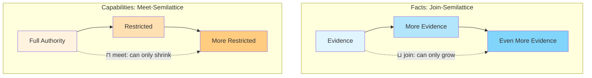
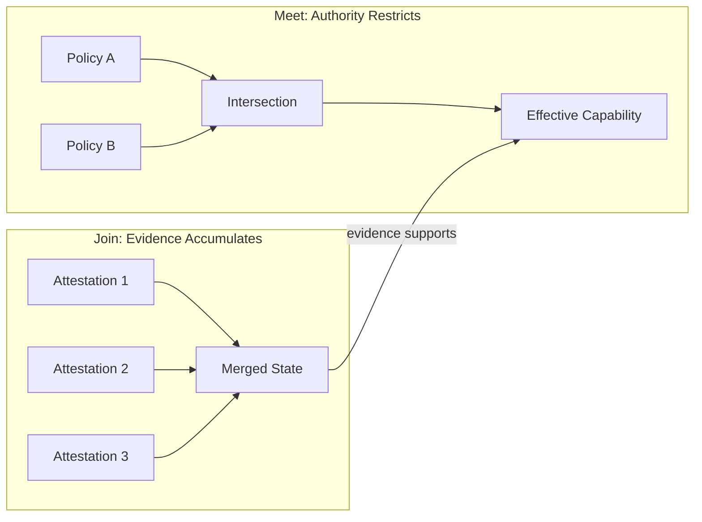
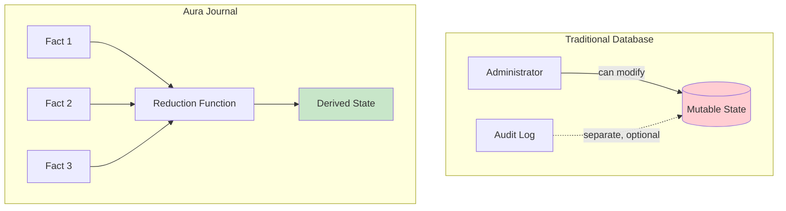
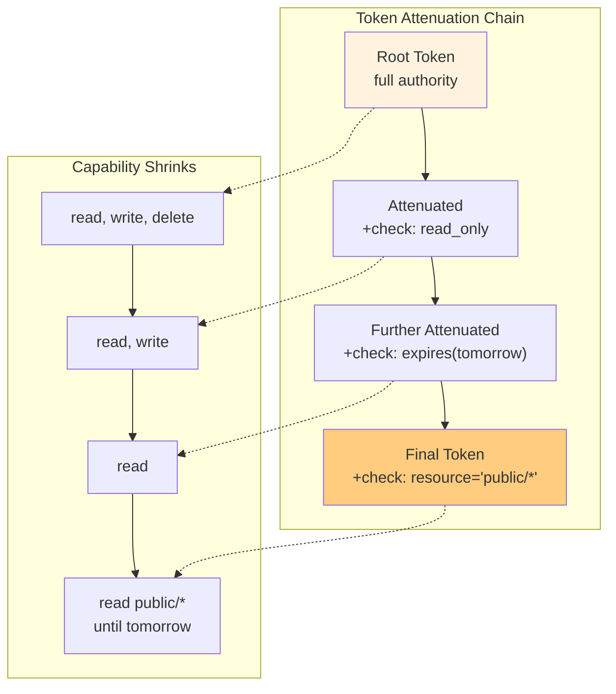
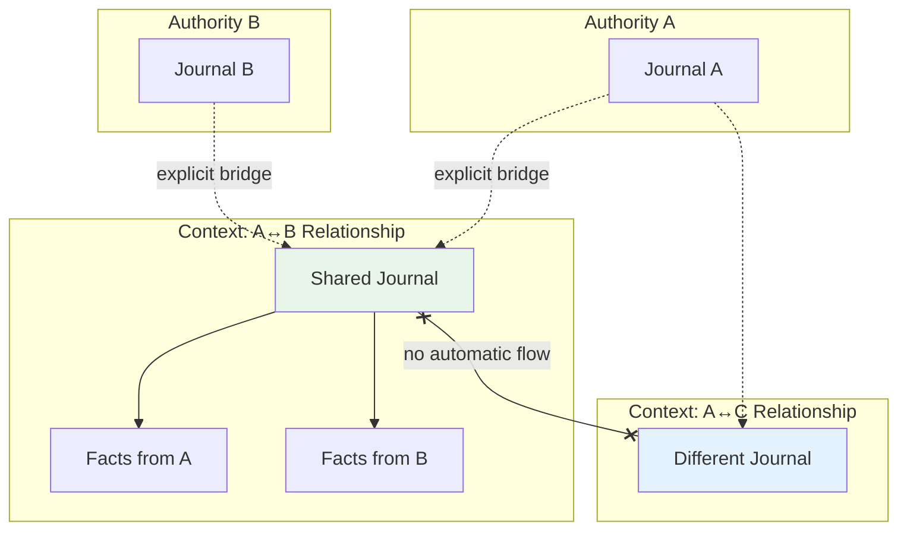
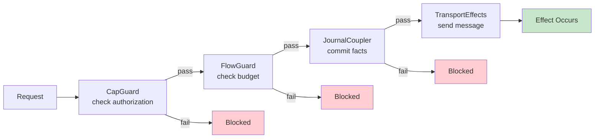
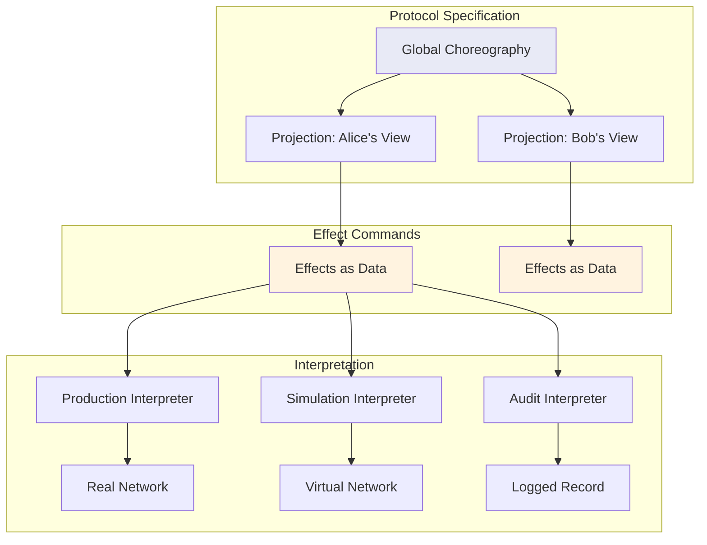
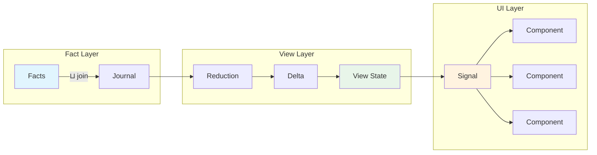
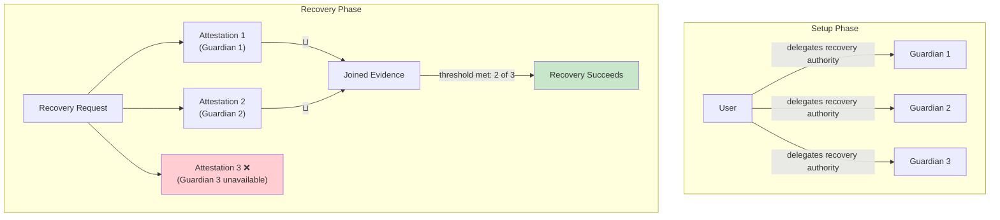
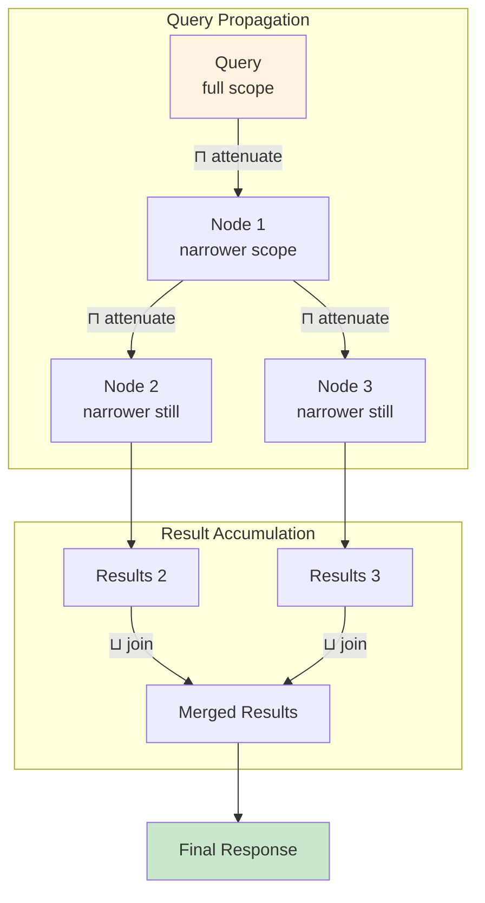

# The Shape of Agreement

Agreement has structure. You can add conditions, narrow scope, or delegate what you were given. You cannot expand what was agreed to or grant yourself permissions you were never offered.

This asymmetry reflects how consent works. Consent flows downward and outward. It can be refined and passed along but cannot be inflated or reversed without returning to the source.

Digital systems have mostly ignored this structure. Permissions live in databases controlled by administrators, with privileged ability to read, write, and access. Your identity is a row in someone else's table. Lattice theory captures the structure of consent precisely through semilattices. These provide operations that move in only one direction. Some things can only grow. Other things can only shrink.

## Two Directions

A semilattice is a set with a binary operation that is associative, commutative, and idempotent. There is a way to combine any two elements that produces a consistent result regardless of order. Combining something with itself changes nothing.

A join-semilattice finds the least upper bound. If you know A and I know B, together we know the combination. Information only accumulates. A meet-semilattice finds the greatest lower bound. If you can do A and I can do B, what we can do together is only their intersection. Authority only restricts.

Aura uses both structures simultaneously. Facts live in a join-semilattice and accumulate over time. Capabilities live in a meet-semilattice where delegation can only give a subset of what you have.

## The Journal as Constitutional Record

Traditional databases store state directly. The history of how you got there is separate and might not exist. This gives enormous power to whoever controls the database.

Aura instead uses a journal, which stores signed, timestamped facts. Current state is computed by reducing facts according to deterministic rules. The journal is the source of truth. State is derived.

Facts form a join-semilattice through set union. If two replicas have different facts, merging produces all facts from both. This is why distributed replicas converge without coordination beyond gossip.

## Authorization as Logic

Most authorization systems check a table. Does user $X$ have permission $Y$ on resource $Z$? The basis for any permission is opaque.

Aura uses Biscuit tokens with embedded Datalog rules. When you delegate, you attenuate the token by adding checks. Each check narrows what is permitted. Checks cannot expand authority because the token is cryptographically sealed.

This is the meet-semilattice in action. Authorization becomes a logical derivation rather than a table lookup. The same Datalog engine powers both authorization and journal queries.

## Context as Jurisdiction

What you share with your doctor differs from what you share with your employer. Most digital systems collapse these distinctions into a singular identity.

Aura models relationships through contexts. A context is a separate namespace with its own journal and capability frontier. Cross-context transfer requires an explicit protocol that both sides accept. Context identifiers are opaque UUIDs that reveal nothing about participants.

This maps to how sovereignty works. Authority within a context does not extend beyond it. Relations across contexts require protocols both sides accept.

## The Guard Chain

Every operation that could produce an observable effect passes through a guard chain. Each guard checks one aspect. If any guard fails, the operation produces no effect.

The first guard checks capabilities via Biscuit tokens. The second checks flow budgets. The third couples the operation to the journal before effects occur. Guards evaluate conditions and produce commands. A separate interpreter executes those commands. This allows the same logic in production, simulation, and tests.

## Effects as Values

Programs traditionally have side effects that interleave with computation in unpredictable ways. Algebraic effects produce descriptions of effects as values. A separate runtime interprets the descriptions and performs the effects.

When a protocol wants to send a message, it produces a `SendEnvelope` command. The guard chain evaluates permission. If allowed, an effect interpreter performs the send. This enables simulation where the same protocol code runs against virtual networks with controlled failures. It also enables auditability since effects are logged before execution.

## Reactive Propagation

User interfaces need to stay synchronized with underlying state. Aura uses functional reactive programming built on lattice foundations. Signals represent time-varying values. Updates only move forward.

The pipeline from facts to display preserves lattice structure. Facts commit through the guard chain. Reduction functions compute deltas. Views apply deltas monotonically. The UI is a projection of the fact lattice. This ensures end-to-end coherence where the UI cannot show state that lacks evidentiary basis.

## Recover Identity Through Your Social Graph

Traditional systems use forgot password flows that rely on central authority. Aura has no central authority. Recovery happens through the social graph.

Users designate guardians before losing access. Each guardian receives a capability to attest recovery. When a user initiates recovery, guardians add attestation facts that accumulate in the recovery journal. When evidence crosses a threshold set by the original user, recovery succeeds. Guardian capabilities form a meet-semilattice where each can only attest within delegated scope.

## Consentful Search

Centralized search requires an index operator who sees everything. Aura permits a different design where search queries are capabilities that propagate with attenuation at each hop.

Outbound propagation uses meet semantics. Each relay narrows scope. Results accumulate via join semantics as responses merge. Budget constraints prevent abuse. The same mechanism that prevents spam prevents surveillance.

## Lattice as Constitution

Sovereignty requires structure. Traditional institutions use constitutions to specify how authority is organized and what limits apply.

The semilattice properties are structural constraints built into how Aura operates. Facts will always join. Capabilities will always meet. The guard chain will always enforce. Within this structure, users choose guardians, authorities set context boundaries, and policies determine thresholds. These choices happen within lattice constraints that do not change.

## Mathematics as Political Design

Mathematical structures encode assumptions about what is possible. Aura chooses semilattices because they capture the structure of consent. Things that only grow. Things that only shrink. Operations that commute and associate. Idempotence. Convergence.

Building on these foundations means the system respects these properties by construction. Violations are not expressible. This is consent as a mathematical structure that determines what operations are even possible. The lattice ensures basic conditions for self-determination. Authority cannot be manufactured. Evidence cannot be erased. Boundaries cannot be overridden.
