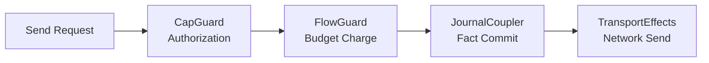

# Aura System Architecture

This document describes Aura's system architecture and implementation patterns. It covers the async effect system, authority and relational identity model, guard chain enforcement, flow budget system, choreographic protocol design, consensus integration, and crate organization principles.

Formal definitions live in [Theoretical Model](002_theoretical_model.md) and the specifications for relational identity, commitment tree semilattice, journal system, and Aura Consensus.

## Overview

Aura's system architecture implements the mathematical foundations through practical patterns that avoid deadlocks and ensure distributed correctness. The architecture centers on authorities and their commitment tree-based internal state, journals as CRDT fact stores per authority and per relational context, relational contexts for cross-authority relationships, and Aura Consensus for single-operation strong agreement where CRDT alone is insufficient.

The architecture consists of five integrated systems. The async effect system provides isolated services and deadlock-free execution. The authority and relational identity system manages contextual identities and cross-authority relationships. The guard chain and flow budget system enforces authorization and privacy constraints. The choreographic protocol system enables session-typed distributed coordination. The crate organization maintains clean layering and zero circular dependencies.

## 1. Authority and Relational Identity System

### 1.1 Authority Model

An authority is a cryptographic actor represented by a public key that hides its internal structure. An authority may contain one or more devices but never exposes information about its devices or operators. The authority derives its state from deterministic reduction of facts in its journal namespace.

```rust
pub struct AuthorityId(Uuid);
```

This identifier selects the journal namespace associated with the authority. The identifier does not encode structure or membership. The authority publishes its current public key and root commitment inside its own journal.

Authorities interact with other authorities through relational contexts. These interactions do not change the authority's internal structure. The authority remains isolated except where relational state is explicitly shared.

### 1.2 Account Authority Structure

An account authority maintains internal state through a commitment tree and an account journal. The commitment tree defines device membership and threshold policies. The journal stores facts that represent signed tree operations. The reduction function reconstructs canonical tree state from accumulated facts.

```rust
pub struct AccountAuthority {
    account_id: AccountId,
    root_keypair: KeyPair,
}
```

This structure represents the account authority with its unique account identifier and root keypair for creating device tokens. The root keypair enables creation of Biscuit tokens for device authentication. The account authority does not reveal device structure to external parties.

Account authorities use deterministic key derivation to create context-specific identities. These derived authorities represent application-scoped identities without exposing the structure of the account authority.

### 1.3 Relational Context Architecture

A relational context is shared state linking two or more authorities. Each relational context has its own journal namespace containing only the facts that participating authorities choose to share. Context identifiers are opaque and do not encode participant information.

```rust
pub struct ContextId(Uuid);
```

This identifier selects the journal namespace for a relational context. Only participating authorities know how the context is used. Participation is expressed by writing relational facts to the context journal.

Relational contexts support guardian configuration, recovery operations, and application-specific collaboration. Each context defines its own interpretation rules without affecting authority internal structure.

### 1.4 Contextual Identity Properties

Identity in Aura is contextual and relational rather than global. Authorities derive context-specific keys using `derive(account_root, app_id, context_label)`. The derivation is deterministic but irreversible. Knowing the derived key for one context reveals nothing about other contexts.

Profile data shared inside a context stays local to that context. Display names and contact attributes do not leave the context journal. Each context forms a separate identity boundary. Authorities can maintain many unrelated relationships without cross-linking.

## 2. Guard Chain and Flow Budget System

### 2.1 Guard Chain Architecture

All transport sends pass through a guard chain that enforces authorization, flow budgets, and journal updates. The guard chain executes in strict sequence to ensure no observable behavior occurs without proper authorization and charging.



Each guard must succeed before the next guard executes. Any failure returns locally and produces no observable side effect. This design ensures that unauthorized or over-budget sends do not create side channels.

The `CapGuard` evaluates Biscuit capabilities and sovereign policy to derive the capability frontier for the context and peer pair. The `FlowGuard` charges the replicated spent counter and produces a signed receipt if headroom exists. The `JournalCoupler` merges protocol facts together with budget charges to preserve charge-before-send invariants.

### 2.2 Flow Budget System

Flow budgets limit the rate and volume of messages an authority may send within a context. The system unifies spam resistance and privacy leakage control through the same monotone mechanism.

```rust
pub struct FlowBudget {
    limit: u64, // derived at runtime from capabilities
    spent: u64, // replicated fact (join = max)
    epoch: Epoch, // replicated fact
}
```

Only `spent` and `epoch` values appear as facts inside the journal. The `limit` field is computed at runtime by intersecting Biscuit-derived capabilities with sovereign policy. Before any transport effect, `FlowGuard` charges cost to the context and peer pair.

Budget charges are atomic with journal updates. If `spent` plus `cost` exceeds the computed `limit`, the send is blocked locally with no observable behavior. For multi-hop forwarding, relays validate signed receipts from previous hops and charge their own budgets before forwarding.

### 2.3 Receipts and Accountability

Per-hop receipts provide accountability for multi-hop forwarding and are bound to epochs to prevent replay.

```rust
pub struct Receipt {
    pub context: ContextId,
    pub src: AuthorityId,
    pub dst: AuthorityId,
    pub epoch: Epoch,
    pub cost: u32,
    pub nonce: u64,
    pub prev: Hash32,
    pub sig: Signature,
}
```

Receipts chain together to form an audit trail of budget charges across relay hops. The acceptance window is the current epoch only. Epoch rotation triggers when the journal fact `Epoch(context)` increments, resetting spent counters and invalidating old receipts.

## 3. Async Effect System Architecture

### 3.1 Core Principles

Aura implements an async-first effect system that supports both native and WASM targets while avoiding deadlocks through explicit context propagation and isolated state services. The system uses builder-based initialization, assumes no OS threads, and provides explicit lifecycle management.

```rust
#[async_trait]
pub trait CryptoEffects {
    async fn hash(&self, data: &[u8]) -> [u8; 32];
    async fn hmac(&self, key: &[u8], data: &[u8]) -> [u8; 32];
}
```

Effect traits define abstract capabilities without exposing implementation details. Handlers provide implementations for specific environments. The effect system ensures operations remain async-native and context-explicit.

### 3.2 Effect Trait Classification

Effect traits are organized into three categories that determine implementation location and usage patterns.

Infrastructure effects are foundational capabilities that every Aura system needs. These traits define OS-level operations that are universal across all use cases. Examples include `CryptoEffects`, `NetworkEffects`, `StorageEffects`, `TimeEffects`, and `RandomEffects`. These traits must have corresponding handlers in `aura-effects`.

Application effects encode Aura-specific abstractions and business logic. These traits capture domain concepts meaningful only within Aura's architecture. Examples include `JournalEffects`, `AuthorityEffects`, `FlowBudgetEffects`, `LeakageEffects`, and `AuthorizationEffects`. These traits are implemented in their respective domain crates.

Composite effects provide convenience methods that combine multiple lower-level operations. These are typically extension traits that add domain-specific convenience to infrastructure effects. Examples include `TreeEffects` and `LeakageChoreographyExt`.

### 3.3 Handler Registration and Interoperability System

The handler registration system enables clean composition across crate boundaries without circular dependencies through a specialized 3-layer pattern within Layer 3 Implementation.

#### 3.3.1 Split Layer 3 Architecture

**`aura-effects`** - Stateless Effect Implementations:
- Production handlers: `RealCryptoHandler`, `TcpNetworkHandler`, `FilesystemStorageHandler`
- Each implements exactly one effect trait independently
- Pure input→output transformations with no internal state
- Reusable across any context (unit tests, integration tests, production)

**`aura-composition`** - Handler Assembly Infrastructure:
- `EffectRegistry` and builder patterns for handler composition
- Handler lifecycle management (start/stop/configure)
- Bridges individual handlers into cohesive effect systems
- Focuses on "How do I assemble handlers?" not "How do I coordinate protocols?"

#### 3.3.2 Registration Flow Across Layers

The registration system enables composition without runtime overhead:

```
Layer 3 → Layer 4 → Layer 5 → Layer 6
```

1. **aura-effects** provides stateless, single-party handlers
2. **aura-composition** assembles them via `EffectRegistry` and builder patterns
3. **aura-protocol** orchestrates multi-party coordination using assembled systems
4. **Feature crates** (Layer 5) compose handlers without pulling in runtime infrastructure
5. **aura-agent** (Layer 6) provides final runtime assembly for production deployment

#### 3.3.3 Effect Category Registration

The registration system handles the three effect categories differently:

- **Infrastructure Effects**: Must have implementations in `aura-effects` (e.g., `CryptoEffects`, `NetworkEffects`)
- **Application Effects**: Implemented in domain crates using composition of infrastructure effects (e.g., `JournalEffects`, `AuthorityEffects`)
- **Composite Effects**: Often implemented as blanket implementations or extension traits

#### 3.3.4 Interoperability Benefits

This registration architecture provides:
- **Clean composition**: Feature crates can assemble handlers without runtime dependencies
- **Zero circular dependencies**: Strict layered dependency flow prevents architectural violations
- **Controlled assembly point**: `aura-composition` acts as the bridge between stateless handlers and stateful coordination
- **Testing isolation**: Mock handlers live in `aura-testkit`, maintaining clean separation from production code
- **Deployment flexibility**: Production vs. simulation handler selection happens at runtime assembly

### 3.4 Context Propagation and Guard Integration

The effect system propagates `EffectContext` through async tasks. The context carries authority identification, optional session context, and metadata without ambient state.

```rust
pub struct EffectContext {
    /// Authority performing the operation
    pub authority_id: AuthorityId,

    /// Session context (if any)
    pub session_id: Option<SessionId>,

    /// Additional metadata
    pub metadata: HashMap<String, String>,
}
```

Context flows through all effect calls to enable authority identification and session tracking. The guard chain uses context values to enforce authorization and flow constraints before network operations.

The effect runtime enforces guard chain sequencing for all transport operations. Each choreography message expands to authorization evaluation, flow budget charging, leakage recording, journal fact merging, and transport sending. This ensures no observable behavior occurs without proper authorization and accounting.

### 3.5 Impure Function Control

Aura ensures fully deterministic simulation by requiring all impure operations to flow through effect traits. Direct system calls are forbidden except in effect implementations, runtime assembly, and pure functions in `aura-core`.

```rust
// Forbidden: Direct impure function usage
let now = SystemTime::now(); // Violation
let random = thread_rng().gen::<u64>(); // Violation

// Required: Effect trait usage with explicit context
async fn my_operation<T: TimeEffects + RandomEffects>(
    ctx: &EffectContext,
    effects: &T,
) -> Result<Data> {
    let timestamp = effects.current_time().await;
    let nonce = effects.random_bytes(32).await?;
    Ok(Data { timestamp, nonce })
}
```

This ensures WASM compatibility, predictable testing, and simulation determinism. The architectural compliance checker validates these constraints across the codebase.

## 4. Choreographic Protocol System

### 4.1 Global Protocol Specification

Choreographies define global interaction patterns from a bird's eye view. Aura extends multi-party session types with capability guards, journal coupling, and leakage budgets.

```rust
choreography! {
    #[namespace = "ping_pong"]
    protocol PingPong {
        roles: Alice, Bob;
        Alice[guard_capability = "send_ping", flow_cost = 5] -> Bob: Ping(data: Vec<u8>);
        Bob[guard_capability = "send_pong", flow_cost = 5] -> Alice: Pong(response: Vec<u8>);
    }
}
```

Global protocols are projected to local session types for each role. Projection ensures deadlock freedom and communication safety. Annotations specify capability requirements and flow costs that the guard chain enforces.

### 4.2 Session Type Integration

Projection converts global choreographies into local session types that enforce structured communication patterns. Each local session type defines the exact sequence of sends and receives for a single role.

```rust
#[async_trait]
pub trait ChoreoHandler {
    async fn send<M>(&mut self, msg: &M) -> Result<()> where M: Serialize;
    async fn recv<M>(&mut self) -> Result<M> where M: DeserializeOwned;
}
```

The `AuraHandler` implements `ChoreoHandler` by mapping session operations to effect calls through `NetworkEffects`, `JournalEffects`, and other traits. Each send operation triggers the guard chain before actual transport.

### 4.3 Extension Effects and Annotations

Choreographies support annotations that modify runtime behavior through extension effects. Capability annotations attach required capabilities to messages. Flow cost annotations specify budget costs. Journal annotations define facts to insert.

Extension effects interpret these annotations to enforce authorization and accounting rules. Guard chains apply before each send based on the annotation requirements. This allows choreographies to express security policies declaratively.

## 5. Consensus Integration Architecture

### 5.1 Single-Shot Agreement Model

Aura Consensus provides single-shot agreement for operations that cannot be expressed as monotone growth. Consensus produces a commit fact that is inserted into journals and drives deterministic reduction. The system does not maintain global logs.

```rust
pub struct CommitFact {
    /// Unique identifier for this consensus instance
    pub consensus_id: ConsensusId,

    /// Hash of the prestate this operation was bound to
    pub prestate_hash: Hash32,

    /// Hash of the operation that was agreed upon
    pub operation_hash: Hash32,

    /// The actual operation (serialized)
    pub operation_bytes: Vec<u8>,

    /// Threshold signature from witnesses
    pub threshold_signature: ThresholdSignature,

    /// List of authorities that participated
    pub participants: Vec<AuthorityId>,

    /// Threshold that was required
    pub threshold: u16,

    /// Timestamp of consensus completion (milliseconds since epoch)
    pub timestamp_ms: u64,

    /// Whether fast path was used
    pub fast_path: bool,
}
```

Consensus instances use context-scoped committees with witnesses selected by authorities or relational contexts. Committee members may be offline. The protocol completes even under partitions through fast path and fallback mechanisms.

### 5.2 Fast Path and Fallback Protocol

The fast path completes in one round trip when witnesses agree on prestate. The initiator broadcasts execute messages. Witnesses compute shares and return them. The initiator aggregates shares into threshold signatures.

The fallback path uses epidemic gossip when witnesses disagree or initiators stall. Witnesses exchange share proposals through bounded fanout gossip. Any witness assembling valid threshold signatures broadcasts complete commit facts.

### 5.3 Prestate Binding and Integration

Consensus binds operations to explicit prestates through hash commitments. The prestate hash commits to current reduced state of all participants. Witnesses verify local state matches prestate hash to prevent forks.

```rust
let prestate_hash = H(C_auth1, C_auth2, C_context);
let operation_hash = H(Op);
let consensus_id = ConsensusId::new(prestate_hash, operation_hash, nonce);
```

The consensus identifier binds operations to prestates through the hash commitment. Witnesses treat matching consensus identifiers as belonging to the same consensus instance. This integration ensures consensus operations reference current authority and context state.

## 6. 8-Layer Crate Architecture

### 6.1 Architectural Layering

The codebase follows strict 8-layer architecture with zero circular dependencies. Each layer builds on lower layers without reaching back down. This enables independent testing, reusability, and clear responsibility boundaries.

Layer 1 Foundation contains `aura-core` with effect traits, domain types, cryptographic utilities, semilattice traits, and unified errors. Layer 2 Specification contains domain crates, `aura-mpst`, and `aura-macros` that define semantics without implementations. Layer 3 Implementation contains `aura-effects` and `aura-composition` for stateless handlers and composition infrastructure.

Layer 4 Orchestration contains `aura-protocol` for multi-party coordination and guard infrastructure. Layer 5 Feature contains protocol crates for authentication, recovery, rendezvous, and storage. Layer 6 Runtime contains `aura-agent` and `aura-simulator` for system assembly. Layer 7 Interface contains `aura-cli` for user applications. Layer 8 Testing contains `aura-testkit` and `aura-quint` for shared fixtures and verification.

### 6.2 Code Location Decision Framework

Single-party operations belong in `aura-effects`. These are stateless, context-free implementations like `sign(key, msg)` or `store_chunk(id, data)`. Each handler implements one effect trait independently. Operations are reusable in any context.

Handler composition belongs in `aura-composition`. This includes assembling individual handlers into cohesive systems through registries and builders. The focus is on handler assembly rather than protocol coordination.

Multi-party coordination belongs in `aura-protocol`. These are stateful, context-specific orchestrations like `execute_anti_entropy` or `CrdtCoordinator`. Operations manage multiple handlers working together across network boundaries.

### 6.3 Dependency Management

Dependencies flow downward through layers without cycles. `aura-core` has no dependencies on other Aura crates. Domain crates depend only on `aura-core`. Implementation crates depend on foundation and specification layers.

Effect trait implementations follow the classification system. Infrastructure effects are implemented in `aura-effects`. Application effects are implemented in domain crates that encode business logic. Composite effects are implemented as extension traits.

## 7. Implementation Guidelines

### 7.1 Effect Handler Development

New effect traits go into `aura-core` as interface definitions. Infrastructure effect implementations belong in `aura-effects` if they are stateless and single-party. Application effect implementations belong in domain crates if they encode Aura-specific business logic.

```rust
// Infrastructure effect in aura-effects
impl CryptoEffects for RealCryptoHandler {
    async fn hash(&self, data: &[u8]) -> [u8; 32] {
        aura_core::hash::hash(data) // Pure function call
    }
}

// Application effect in domain crate
impl<C: CryptoEffects, S: StorageEffects> JournalEffects for JournalHandler<C, S> {
    async fn append_fact(&self, fact: Fact) -> Result<FactId> {
        self.validate_fact_semantics(&fact)?; // Domain validation
        let signature = self.crypto.sign(&fact.hash()).await?;
        self.storage.write_chunk(&entry.id(), &entry.encode()).await?;
        Ok(entry.id())
    }
}
```

The distinction maintains clean separation between OS integration and domain logic. Infrastructure handlers provide universal capabilities. Domain handlers encode business rules specific to Aura.

### 7.2 Protocol Design Patterns

Protocols should use choreographic specification where possible. Global types define complete interaction patterns. Projection generates local session types with compile-time safety guarantees.

Guard chain integration happens through annotations rather than manual calls. Capability requirements, flow costs, and journal facts are declared in choreography specifications. The runtime enforces these automatically during projection.

Context isolation is maintained through explicit `ContextId` scoping. Messages and capabilities are scoped to contexts. Budget charges and receipts reference context identifiers. No information flows across context boundaries without explicit bridges.

### 7.3 Testing and Simulation

Testing uses mock effect handlers from `aura-testkit`. Mock handlers provide controllable, deterministic behavior for testing business logic. Production handlers are replaced with mocks that maintain testable state.

Simulation uses `aura-simulator` for deterministic execution with virtual time and controlled failures. The simulator provides the same effect interfaces as production but with complete determinism for property testing.

Both testing and simulation maintain the same architectural patterns as production. Effect traits provide abstraction boundaries. Guard chains enforce the same constraints. Context isolation remains intact.

## See Also

Core documentation covers foundational concepts and formal models. [Theoretical Model](002_theoretical_model.md) provides mathematical foundations. [Privacy and Information Flow](003_information_flow_contract.md) documents the privacy framework. [Distributed Systems Contract](004_distributed_systems_contract.md) specifies safety and liveness guarantees.

System documentation covers major components. [Authority and Identity](100_authority_and_identity.md) describes the authority model. [Journal System](102_journal.md) documents fact storage and reduction. [Relational Contexts](103_relational_contexts.md) covers cross-authority relationships. [Consensus](104_consensus.md) describes the agreement protocol.

Implementation documentation covers practical patterns. [Effect System and Runtime](106_effect_system_and_runtime.md) details effect implementation. [MPST and Choreography](107_mpst_and_choreography.md) covers protocol design. [Authorization](109_authorization.md) describes capability evaluation. [Project Structure](999_project_structure.md) provides comprehensive crate organization.
