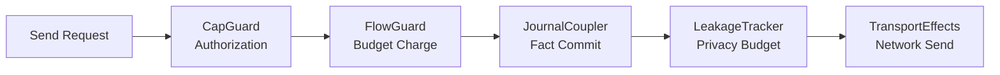

# Aura System Architecture

This document describes Aura's system architecture and implementation patterns. It covers the async effect system, authority and relational identity model, guard chain enforcement, flow budget system, choreographic protocol design, consensus integration, and crate organization principles.

Formal definitions live in [Theoretical Model](002_theoretical_model.md) and the specifications for relational identity, commitment tree semilattice, journal system, and Aura Consensus.

## Overview

Aura's system architecture implements the mathematical foundations through practical patterns that avoid deadlocks and ensure distributed correctness. The architecture centers on authorities and their commitment tree-based internal state, journals as CRDT fact stores per authority and per relational context, relational contexts for cross-authority relationships, and Aura Consensus for single-operation strong agreement where CRDT alone is insufficient.

The architecture consists of five integrated systems. The async effect system provides isolated services and deadlock-free execution. The authority and relational identity system manages contextual identities and cross-authority relationships. The guard chain and flow budget system enforces authorization and privacy constraints. The choreographic protocol system enables session-typed distributed coordination. The crate organization maintains clean layering and zero circular dependencies.

## 1. Authority and Relational Identity System

### 1.1 Authority Model

An authority is a cryptographic actor represented by a public key that hides its internal structure. An authority may contain one or more devices but never exposes information about its devices or operators. The authority derives its state from deterministic reduction of facts in its journal namespace.

```rust
pub struct AuthorityId(Uuid);
```

This identifier selects the journal namespace associated with the authority. The identifier does not encode structure or membership. The authority publishes its current public key and root commitment inside its own journal.

Authorities interact with other authorities through relational contexts. These interactions do not change the authority's internal structure. The authority remains isolated except where relational state is explicitly shared.

### 1.2 Account Authority Structure

An account authority maintains internal state through a [commitment tree](101_accounts_and_commitment_tree.md) and an account journal. The commitment tree defines device membership and threshold policies. The journal stores facts that represent signed tree operations. The reduction function reconstructs canonical tree state from accumulated facts.

Account authorities are represented by their `AuthorityId` and manage state through the commitment tree's `Policy` and `LeafNode` structures. The root keypair enables creation of Biscuit tokens for device authentication. The account authority does not reveal device structure to external parties.

Account authorities use deterministic key derivation to create context-specific identities. These derived authorities represent application-scoped identities without exposing the structure of the account authority.

### 1.3 Relational Context Architecture

A relational context is shared state linking two or more authorities. Each relational context has its own journal namespace containing only the facts that participating authorities choose to share. Context identifiers are opaque and do not encode participant information.

```rust
pub struct ContextId(Uuid);
```

This identifier selects the journal namespace for a relational context. Only participating authorities know how the context is used. Participation is expressed by writing relational facts to the context journal.

Relational contexts support guardian configuration, recovery operations, and application-specific collaboration. Each context defines its own interpretation rules without affecting authority internal structure.

### 1.4 Contextual Identity Properties

Identity in Aura is contextual and relational rather than global. Authorities derive context-specific keys using `derive(account_root, app_id, context_label)`. The derivation is deterministic but irreversible. Knowing the derived key for one context reveals nothing about other contexts.

Profile data shared inside a context stays local to that context. Display names and contact attributes do not leave the context journal. Each context forms a separate identity boundary. Authorities can maintain many unrelated relationships without cross-linking.

## 2. Guard Chain and Flow Budget System

### 2.1 Guard Chain Architecture

All transport sends pass through a guard chain that enforces authorization, flow budgets, and journal updates. The guard chain executes in strict sequence to ensure no observable behavior occurs without proper authorization and charging.



Each guard must succeed before the next guard executes. Any failure returns locally and produces no observable side effect. This design ensures that unauthorized or over-budget sends do not create side channels.

The `CapGuard` evaluates Biscuit capabilities and sovereign policy to derive the capability frontier for the context and peer pair. The `FlowGuard` charges the replicated spent counter and produces a signed receipt if headroom exists. The `JournalCoupler` merges protocol facts together with budget charges to preserve charge-before-send invariants. The `LeakageTracker` validates privacy budgets per observer class (external, neighbor, group). See [Transport and Information Flow](108_transport_and_information_flow.md) for detailed implementation.

Guard evaluation is pure and synchronous over a prepared `GuardSnapshot`. The evaluation returns `EffectCommand` data that an async interpreter executes (production or simulation). No guard performs I/O directly.

### 2.2 Flow Budget System

Flow budgets limit the rate and volume of messages an authority may send within a context. The system unifies spam resistance and privacy leakage control through the same monotone mechanism.

```rust
pub struct FlowBudget {
    limit: u64, // derived at runtime from capabilities
    spent: u64, // replicated fact (join = max)
    epoch: Epoch, // replicated fact
}
```

Only `spent` and `epoch` values appear as facts inside the journal. The `limit` field is computed at runtime by intersecting Biscuit-derived capabilities with sovereign policy. Before any transport effect, `FlowGuard` charges cost to the context and peer pair.

Budget charges are atomic with journal updates. If `spent` plus `cost` exceeds the computed `limit`, the send is blocked locally with no observable behavior. For multi-hop forwarding, relays validate signed receipts from previous hops and charge their own budgets before forwarding.

### 2.3 Receipts and Accountability

Per-hop receipts provide accountability for multi-hop forwarding and are bound to epochs to prevent replay.

```rust
pub struct Receipt {
    pub ctx: ContextId,
    pub src: AuthorityId,
    pub dst: AuthorityId,
    pub epoch: Epoch,
    pub cost: u32,
    pub nonce: u64,
    pub prev: Hash32,
    pub sig: Vec<u8>,
}
```

Receipts chain together to form an audit trail of budget charges across relay hops. The signature uses `Vec<u8>` to support multiple signature algorithms. The acceptance window is the current epoch only. Epoch rotation triggers when the journal fact `Epoch(context)` increments, resetting spent counters and invalidating old receipts.

## 3. Async Effect System Architecture

### 3.1 Core Principles

Aura implements an async-first effect system that supports both native and WASM targets while avoiding deadlocks through explicit context propagation and isolated state services. The system uses builder-based initialization, assumes no OS threads, and provides explicit lifecycle management.

```rust
#[async_trait]
pub trait CryptoEffects {
    async fn hash(&self, data: &[u8]) -> [u8; 32];
    async fn hmac(&self, key: &[u8], data: &[u8]) -> [u8; 32];
}
```

Effect traits define abstract capabilities without exposing implementation details. Handlers provide implementations for specific environments. The effect system ensures operations remain async-native and context-explicit.

### 3.2 Effect Trait Classification

Effect traits are organized into three categories that determine implementation location and usage patterns.

Infrastructure effects are foundational capabilities that every Aura system needs. These traits define OS-level operations that are universal across all use cases. Examples include `CryptoEffects`, `NetworkEffects`, `StorageEffects`, the time domain traits (`PhysicalTimeEffects`, `LogicalClockEffects`, `OrderClockEffects`), and `RandomEffects`. These traits must have corresponding handlers in `aura-effects`. See [Effect System and Runtime](106_effect_system_and_runtime.md) for implementation details.

`ReactiveEffects` provides type-safe signal-based state management for UI and inter-component communication. It enables FRP (Functional Reactive Programming) patterns through typed `Signal<T>` identifiers with read, emit, and subscribe operations. The signal system decouples state producers from consumers, allowing UI components to subscribe to specific signals without knowing the source of state changes. Note that `ReactiveEffects` is defined in `aura-core` but implemented in `aura-agent` as it encodes application-level reactive semantics rather than pure OS integration.

Application effects encode Aura-specific abstractions and business logic. These traits capture domain concepts meaningful only within Aura's architecture. Examples include `JournalEffects` (see [Journal System](102_journal.md)), `AuthorityEffects` (see [Authority and Identity](100_authority_and_identity.md)), `FlowBudgetEffects`, `LeakageEffects` (see [Privacy and Information Flow](003_information_flow_contract.md)), and `AuthorizationEffects` (see [Authorization](109_authorization.md)). These traits are implemented in their respective domain crates.

Composite effects provide convenience methods that combine multiple lower-level operations. These are typically extension traits that add domain-specific convenience to infrastructure effects. Examples include `TreeEffects` and `LeakageChoreographyExt`.

### 3.3 Handler Registration and Interoperability System

The handler registration system enables clean composition across crate boundaries without circular dependencies through a specialized 3-layer pattern within Layer 3 Implementation.

#### 3.3.1 Split Layer 3 Architecture

**`aura-effects`** - Stateless Effect Implementations:
- Production handlers: `RealCryptoHandler`, `FilesystemStorageHandler`, `RealSecureStorageHandler`, `PhysicalTimeHandler`
- Unified encryption-at-rest: `EncryptedStorage` (implements `StorageEffects` by composing `StorageEffects` + `CryptoEffects` + `SecureStorageEffects`)
- Each implements exactly one effect trait independently
- Pure input→output transformations with minimal internal caching (no cross-operation coordination)
- Reusable across any context (unit tests, integration tests, production)

**`aura-composition`** - Handler Assembly Infrastructure:
- `HandlerContext` and `Handler` trait for handler execution
- Builder patterns for handler composition
- Handler lifecycle management (start/stop/configure)
- Bridges individual handlers into cohesive effect systems
- Focuses on "How do I assemble handlers?" not "How do I coordinate protocols?"

**`aura-agent`** - Runtime Effect Registry:
- `EffectRegistry` for dynamic handler lookup and registration
- Final runtime assembly point for effect system composition

#### 3.3.2 Registration Flow Across Layers

#### 3.3.3 Unified Encrypted Storage

Aura treats `StorageEffects` as the *single* persistence interface. All application data is written through `StorageEffects`, and the production runtime wires `StorageEffects` to `EncryptedStorage` (Layer 3), which wraps an underlying storage backend (e.g. `FilesystemStorageHandler`).

`EncryptedStorage` provides encryption-at-rest by:
- Generating or loading a 256-bit master key via `SecureStorageEffects` (Keychain/TPM/Keystore; with a filesystem fallback during bring-up)
- Deriving per-key encryption keys from the master key + logical storage key to bind ciphertext integrity to the intended key
- Encrypting values with ChaCha20-Poly1305 using a fresh 96-bit nonce per write (blob format: version byte + nonce + ciphertext)

Master-key initialization is **lazy** (first storage operation), so runtime assembly remains synchronous. No automatic migration from legacy plaintext blobs is performed in this pre-launch iteration.

The registration system enables composition without runtime overhead:

```
Layer 3 → Layer 4 → Layer 5 → Layer 6
```

1. **aura-effects** provides stateless, single-party handlers
2. **aura-composition** assembles them via `EffectRegistry` and builder patterns
3. **aura-protocol** orchestrates multi-party coordination using assembled systems
4. **Feature crates** (Layer 5) compose handlers without pulling in runtime infrastructure
5. **aura-agent** (Layer 6) provides final runtime assembly for production deployment

#### 3.3.3 Effect Category Registration

The registration system handles the three effect categories differently:

- **Infrastructure Effects**: Must have implementations in `aura-effects` (e.g., `CryptoEffects`, `NetworkEffects`)
- **Application Effects**: Implemented in domain crates using composition of infrastructure effects (e.g., `JournalEffects`, `AuthorityEffects`)
- **Composite Effects**: Often implemented as blanket implementations or extension traits

#### 3.3.4 Interoperability Benefits

This registration architecture provides:
- **Clean composition**: Feature crates can assemble handlers without runtime dependencies
- **Zero circular dependencies**: Strict layered dependency flow prevents architectural violations
- **Controlled assembly point**: `aura-composition` acts as the bridge between stateless handlers and stateful coordination
- **Testing isolation**: Mock handlers live in `aura-testkit`, maintaining clean separation from production code
- **Deployment flexibility**: Production vs. simulation handler selection happens at runtime assembly

### 3.4 Unified Time System

Aura consolidates time handling into a single `TimeStamp` enum with four domains:

- **PhysicalClock**: milliseconds since UNIX epoch plus optional uncertainty, provided by `PhysicalTimeEffects`.
- **LogicalClock**: vector clock plus Lamport scalar for causal ordering, advanced via `LogicalClockEffects`.
- **OrderClock**: opaque, privacy-preserving total order token with no temporal meaning, produced by `OrderClockEffects`.
- **Range**: validity window for constraints; composed with other domains where needed.

An orthogonal provenance wrapper (`ProvenancedTime`) adds attestation proofs when consensus or multi-party validation is required. This is a data structure containing `stamp: TimeStamp`, `proofs: Vec<TimeProof>`, and `origin: Option<AuthorityId>`, used in consensus commit facts and other contexts requiring attested time claims.

Ordering across domains is explicit—call `TimeStamp::compare(policy)` for native partial ordering or deterministic tie-breaks. Facts store `TimeStamp` directly (legacy FactId removed), and guard/journal logic uses domain-appropriate timestamps:

- Transport/guards charge and log with `PhysicalClock`.
- CRDT coordination uses `LogicalClock`.
- Privacy-preserving ordering (e.g., gossip shuffles) uses `OrderClock`.
- Validity windows use `Range`.

Effect handlers expose time through domain-specific traits; no direct `SystemTime::now()` calls are permitted outside effect implementations. Simulator/testkit provide deterministic implementations for all domains so simulations stay reproducible.

### 3.5 Context Propagation and Guard Integration

The effect system propagates `EffectContext` through async tasks. The context carries authority identification, optional session context, and metadata without ambient state.

```rust
// Located in aura-core/src/context.rs (re-exported from aura-agent/src/runtime/context.rs)
pub struct EffectContext {
    authority_id: AuthorityId,
    context_id: ContextId,
    session_id: SessionId,
    execution_mode: ExecutionMode,
    metadata: HashMap<String, String>,
}

impl EffectContext {
    pub fn authority_id(&self) -> AuthorityId { ... }
    pub fn context_id(&self) -> ContextId { ... }
    pub fn session_id(&self) -> SessionId { ... }
    pub fn execution_mode(&self) -> ExecutionMode { ... }
}
```

Context flows through all effect calls to enable authority identification, session tracking, and guard chain integration. Budget enforcement (flow and leakage) happens separately through the guard chain infrastructure rather than being embedded in the context. The guard chain uses context values to enforce authorization and flow constraints before network operations.

The effect runtime prepares a `GuardSnapshot` asynchronously, evaluates the guard chain synchronously to produce `EffectCommand` items, then interprets those commands asynchronously. Each choreography message expands to snapshot preparation, pure guard evaluation, command interpretation (charge, leak, journal), and transport sending. This ensures no observable behavior occurs without proper authorization and accounting.

### 3.6 Impure Function Control

Aura ensures fully deterministic simulation by requiring all impure operations to flow through effect traits. Direct system calls are forbidden except in effect implementations, runtime assembly, and pure functions in `aura-core`.

```rust
// Forbidden: Direct impure function usage
let now = SystemTime::now(); // Violation
let random = thread_rng().gen::<u64>(); // Violation

// Required: Effect trait usage with explicit context
async fn my_operation<T: TimeEffects + RandomEffects>(
    ctx: &EffectContext,
    effects: &T,
) -> Result<Data> {
    let timestamp = effects.current_time().await;
    let nonce = effects.random_bytes(32).await?;
    Ok(Data { timestamp, nonce })
}
```

This ensures WASM compatibility, predictable testing, and simulation determinism. The architectural compliance checker validates these constraints across the codebase.

## 4. Choreographic System

### 4.1 Global Protocol Specification

Choreographies define global interaction patterns from a bird's eye view. Aura extends [multi-party session types](107_mpst_and_choreography.md) with capability guards, journal coupling, and leakage budgets.

```rust
choreography! {
    #[namespace = "ping_pong"]  // Required: unique namespace prevents module conflicts
    protocol PingPong {
        roles: Alice, Bob;
        Alice[guard_capability = "send_ping", flow_cost = 5] -> Bob: Ping(data: Vec<u8>);
        Bob[guard_capability = "send_pong", flow_cost = 5] -> Alice: Pong(response: Vec<u8>);
    }
}
```

Global protocols are projected to local session types for each role via `rumpsteak-aura`. Projection ensures deadlock freedom and communication safety. Annotations specify capability requirements and flow costs that the guard chain enforces. The `#[namespace = "..."]` attribute is required and must be unique within each compilation unit.

### 4.2 Session Type Integration

Projection converts global choreographies into local session types that enforce structured communication patterns. Each local session type defines the exact sequence of sends and receives for a single role.

```rust
// Located in aura-protocol/src/handlers/core/erased.rs
#[async_trait]
pub trait AuraHandler: Send + Sync {
    /// Execute an effect with serialized parameters and return serialized result
    async fn execute_effect(
        &self,
        effect_type: EffectType,
        operation: &str,
        parameters: &[u8],
        ctx: &AuraContext,
    ) -> Result<Vec<u8>, AuraHandlerError>;

    /// Execute a session type
    async fn execute_session(
        &self,
        session: LocalSessionType,
        ctx: &AuraContext,
    ) -> Result<(), AuraHandlerError>;

    /// Check if this handler supports a specific effect type
    fn supports_effect(&self, effect_type: EffectType) -> bool;
}
```

The `AuraHandler` trait is the primary interface for effect execution and session interpretation. It uses serialized bytes for parameters and results to enable trait object compatibility. Each send operation triggers the guard chain before actual transport.

### 4.3 Extension Effects and Annotations

Choreographies support annotations that modify runtime behavior through extension effects. Capability annotations attach required capabilities to messages. Flow cost annotations specify budget costs. Journal annotations define facts to insert.

Extension effects interpret these annotations to enforce authorization and accounting rules. Guard chains apply before each send based on the annotation requirements. This allows choreographies to express security policies declaratively.

## 5. Consensus Integration Architecture

### 5.1 Single-Shot Agreement Model

Aura Consensus provides single-shot agreement for operations that cannot be expressed as monotone growth. Consensus produces a commit fact that is inserted into journals and drives deterministic reduction. The system does not maintain global logs.

```rust
pub struct CommitFact {
    /// Unique identifier for this consensus instance
    pub consensus_id: ConsensusId,

    /// Hash of the prestate this operation was bound to
    pub prestate_hash: Hash32,

    /// Hash of the operation that was agreed upon
    pub operation_hash: Hash32,

    /// The actual operation (serialized for verification)
    pub operation_bytes: Vec<u8>,

    /// Threshold signature from witnesses
    pub threshold_signature: ThresholdSignature,

    /// Group public key for signature verification
    pub group_public_key: Option<PublicKeyPackage>,

    /// List of authorities that participated
    pub participants: Vec<AuthorityId>,

    /// Threshold that was required
    pub threshold: u16,

    /// Timestamp with optional provenance attestation
    pub timestamp: ProvenancedTime,

    /// Whether fast path was used
    pub fast_path: bool,
}
```

Consensus instances use context-scoped committees with witnesses selected by authorities or relational contexts. Committee members may be offline. The protocol completes even under partitions through fast path and fallback mechanisms.

### 5.2 Fast Path and Fallback Protocol

The fast path completes in one round trip when witnesses agree on prestate. The initiator broadcasts execute messages. Witnesses compute shares and return them. The initiator aggregates shares into threshold signatures.

The fallback path uses epidemic gossip when witnesses disagree or initiators stall. Witnesses exchange share proposals through bounded fanout gossip. Any witness assembling valid threshold signatures broadcasts complete commit facts.

### 5.3 Prestate Binding and Integration

Consensus binds operations to explicit prestates through hash commitments. The prestate hash commits to current reduced state of all participants. Witnesses verify local state matches prestate hash to prevent forks.

```rust
pub struct ConsensusId(pub Hash32);

impl ConsensusId {
    pub fn new(prestate_hash: Hash32, operation_hash: Hash32, nonce: u64) -> Self {
        // Derives unique ID from prestate, operation, and nonce
        ConsensusId(hash(b"CONSENSUS_ID", prestate_hash, operation_hash, nonce))
    }
}
```

The consensus identifier derives from prestate hash, operation hash, and nonce. Witnesses treat matching consensus identifiers as belonging to the same consensus instance. This binding ensures operations reference current authority and context state.

## 6. 8-Layer Crate Architecture

### 6.1 Architectural Layering

The codebase follows strict 8-layer architecture with zero circular dependencies. Each layer builds on lower layers without reaching back down. This enables independent testing, reusability, and clear responsibility boundaries.

Layer 1 Foundation contains `aura-core` with effect traits, domain types, cryptographic utilities (including FROST primitives in `crypto::tree_signing`), semilattice traits, and unified errors. Layer 2 Specification contains domain crates, `aura-mpst`, and `aura-macros` that define semantics without implementations. Layer 3 Implementation contains `aura-effects` and `aura-composition` for stateless handlers and composition infrastructure. The legacy `aura-frost` crate has been removed; higher-level ceremonies should be colocated with their callers and use the core primitives via adapters/effects.

Layer 4 Orchestration contains `aura-protocol` for multi-party coordination and guard infrastructure. Layer 5 Feature contains protocol crates for authentication, recovery, rendezvous, and storage. Layer 6 Runtime contains `aura-agent`, `aura-simulator`, and `aura-app` for system assembly and portable application core. Layer 7 Interface contains `aura-terminal` for user applications. Layer 8 Testing contains `aura-testkit` and `aura-quint` for shared fixtures and verification.

### 6.2 Code Location Decision Framework

Single-party operations belong in `aura-effects`. These are stateless, context-free implementations like `sign(key, msg)` or `store_chunk(id, data)`. Each handler implements one effect trait independently. Operations are reusable in any context.

Handler composition belongs in `aura-composition`. This includes assembling individual handlers into cohesive systems through `Handler` trait implementations and builders. The `EffectRegistry` for dynamic handler lookup resides in `aura-agent`. The focus is on handler assembly rather than protocol coordination.

Multi-party coordination belongs in `aura-protocol`. These are stateful, context-specific orchestrations like `execute_anti_entropy` or `CrdtCoordinator`. Operations manage multiple handlers working together across network boundaries.

### 6.3 Dependency Management

Dependencies flow downward through layers without cycles. `aura-core` has no dependencies on other Aura crates. Domain crates depend only on `aura-core`. Implementation crates depend on foundation and specification layers.

Effect trait implementations follow the classification system. Infrastructure effects are implemented in `aura-effects`. Application effects are implemented in domain crates that encode business logic. Composite effects are implemented as extension traits.

## 7. Implementation Guidelines

### 7.1 Effect Handler Development

New effect traits go into `aura-core` as interface definitions. Infrastructure effect implementations belong in `aura-effects` if they are stateless and single-party. Application effect implementations belong in domain crates if they encode Aura-specific business logic.

```rust
// Infrastructure effect in aura-effects
impl CryptoEffects for RealCryptoHandler {
    async fn hash(&self, data: &[u8]) -> [u8; 32] {
        aura_core::hash::hash(data) // Pure function call
    }
}

// Application effect in domain crate
impl<C: CryptoEffects, S: StorageEffects> JournalEffects for JournalHandler<C, S> {
    async fn append_fact(&self, fact: Fact) -> Result<OrderTime> {
        self.validate_fact_semantics(&fact)?; // Domain validation
        let signature = self.crypto.sign(&fact.hash()).await?;
        self.storage.write_chunk(&entry.id(), &entry.encode()).await?;
        Ok(entry.id())
    }
}
```

The distinction maintains clean separation between OS integration and domain logic. Infrastructure handlers provide universal capabilities. Domain handlers encode business rules specific to Aura.

### 7.2 Protocol Design Patterns

Protocols should use choreographic specification where possible. Global types define complete interaction patterns. Projection generates local session types with compile-time safety guarantees.

Guard chain integration happens through annotations rather than manual calls. Capability requirements, flow costs, and journal facts are declared in choreography specifications. The runtime enforces these automatically during projection.

Context isolation is maintained through explicit `ContextId` scoping. Messages and capabilities are scoped to contexts. Budget charges and receipts reference context identifiers. No information flows across context boundaries without explicit bridges.

### 7.3 Testing and Simulation

Testing uses mock effect handlers from `aura-testkit`. Mock handlers provide controllable, deterministic behavior for testing business logic. Production handlers are replaced with mocks that maintain testable state.

Simulation uses `aura-simulator` for deterministic execution with virtual time and controlled failures. The simulator provides the same effect interfaces as production but with complete determinism for property testing.

Both testing and simulation maintain the same architectural patterns as production. Effect traits provide abstraction boundaries. Guard chains enforce the same constraints. Context isolation remains intact.

## 8. Database System

### 8.1 Database-as-Journal Equivalence

The journal is the database. Biscuit is the query engine. CRDTs are the replication layer. This equivalence maps traditional database concepts to existing Aura components.

A database table corresponds to a journal reduction view. A database row corresponds to a fact implementing `JoinSemilattice`. Query execution uses Biscuit's Datalog engine. Replication uses `CrdtCoordinator` with delta sync.

### 8.2 Query Architecture

The `AuraQuery` wrapper loads facts from the journal into Biscuit's authorizer. Query scoping uses authority context. Authorization happens via the guard chain before query execution.

```rust
// Located in aura-effects/src/database/query.rs
pub struct AuraQuery {
    /// Facts to be added to the authorizer, keyed by predicate
    facts: Vec<(String, Vec<FactTerm>)>,
    /// Authority context for scoped queries
    authority_context: Option<AuthorityId>,
    /// Additional context facts (key -> value pairs)
    context_facts: HashMap<String, String>,
}
```

The `AuraQuery` struct provides an ergonomic API for querying Aura journal facts using Biscuit's Datalog engine. It maintains a set of facts and allows executing Datalog queries against them. Authority context can be injected for scoped queries.

### 8.3 Indexing Layer

The indexing layer provides efficient fact lookup beyond linear scan. Bloom filters provide fast membership tests. B-tree indexes provide ordered lookups for predicate, authority, and time queries. Merkle trees provide integrity verification.

Indexes update on fact commit. Performance target is less than 10ms for 10k facts. See [Database Architecture](113_database.md) for implementation details.

## 9. Urban Social Topology

### 9.1 Three-Tier Structure

Aura's social organization uses a digital urban metaphor with three tiers. Messages are communication contexts. Blocks are semi-public communities. Neighborhoods are collections of blocks connected via adjacency.

Direct messages are private relational contexts. Block messages are semi-public messaging for block residents with historical sync. Blocks have a 10 MB storage allocation. Neighborhoods receive 1 MB donated per member block.

### 9.2 Position and Traversal

Traversal works like walking through a city. Position tracks neighborhood, block, traversal depth, capabilities, and entry time. Movement requires Biscuit capability authorization and adjacency edge existence.

```rust
pub enum TraversalDepth {
    Street,
    Frontage,
    Interior,
}
```

Street depth allows seeing frontage. Frontage depth allows limited interaction. Interior depth provides full resident-level access. See [Social Architecture](114_social_architecture.md) for the complete model.

### 9.3 Storage Constraints

Blocks have fixed 10 MB total size. Resident storage is 200 KB each with maximum 8 residents. Neighborhood donation is 1 MB each with maximum 4 neighborhoods. These constraints create natural scarcity and meaningful trade-offs.

Storage constraints are enforced via the flow budget system. Spent counters are persisted as journal facts. Limits are derived at runtime from block policy and Biscuit capabilities.

## 10. Terminal User Interface

### 10.1 Architecture Principles

The TUI is stateless between sessions. All state derives from the effect system and local store. The architecture uses real effects throughout for end-to-end testing fidelity.

Query subscriptions use existing journal and CRDT infrastructure. Conditional compilation excludes simulator and demo code from production builds. The architecture uses Biscuit for queries and the guard chain for authorization.

### 10.2 Reactive System

The reactive system has two layers. The `ReactiveScheduler` in `aura-agent/src/reactive/` orchestrates fact ingestion and view updates with 5ms batching windows for efficiency. Signal views (`ChatSignalView`, `ContactsSignalView`, `InvitationsSignalView`) process journal facts and emit state snapshots to domain signals (`CHAT_SIGNAL`, `CONTACTS_SIGNAL`, etc.).

The `Dynamic<T>` type represents observable values for FRP-style composition. Subscribers receive updates when values change. Query types generate Biscuit Datalog strings for execution.

```rust
pub struct Dynamic<T> {
    state: Arc<RwLock<T>>,
    updates: broadcast::Sender<T>,
}
```

View types aggregate reactive state for screens. Views subscribe to domain signals emitted by the scheduler. Delta streaming provides efficient updates for lists.

### 10.3 Effect Bridge

The effect bridge connects the TUI to the real effect system. Commands dispatch asynchronously. Results return via channel. Events stream from the effect system to the TUI.

Demo mode compiles only with the development feature flag. The simulator automates Alice and Carol while Bob is human-controlled. Production builds exclude simulator dependencies. See [CLI and Terminal User Interface](115_cli_tui.md) for component details.

## 11. Operation Categories

Aura classifies operations into three categories based on their security requirements and execution timing. This classification determines when consensus is needed versus when CRDT eventual consistency suffices.

### 11.1 Category A: Optimistic Operations

Operations that can proceed immediately without consensus. These use CRDT facts with eventual consistency and provide immediate local effect.

**Characteristics:**
- Immediate local effect
- Background sync via anti-entropy
- Failure shows indicator, doesn't block functionality
- Partial success is acceptable

**Examples:**
- Send message (within established context)
- Create channel (within established relational context)
- Update channel topic
- Block/unblock contact
- Pin message

These operations work because the cryptographic context already exists. Keys derive deterministically from shared journal state. No new agreement is needed.

### 11.2 Category B: Deferred Operations

Operations that apply locally but require agreement for finalization. Effect is pending until confirmed.

**Characteristics:**
- Immediate local effect shown as "pending"
- Background ceremony for agreement
- Failure triggers rollback with user notification
- Multi-admin operations use this pattern

**Examples:**
- Change channel permissions (requires admin consensus)
- Remove channel member (may be contested)
- Transfer channel ownership
- Rename channel

### 11.3 Category C: Consensus-Gated Operations

Operations where partial state is dangerous. These block until consensus completes.

**Characteristics:**
- Operation does NOT proceed until consensus achieved
- Partial state would be dangerous or irrecoverable
- User must wait for confirmation
- Uses Aura Consensus with FROST threshold signatures

**Examples:**
- Guardian rotation (key shares distributed atomically)
- Recovery execution (account state replacement)
- OTA hard fork activation (breaking protocol change)
- Device revocation (security-critical removal)
- Add contact / Create group (establishes cryptographic context)
- Add member to group (changes group encryption keys)

See `docs/117_operation_categories.md` for the full category framework and `docs/118_key_rotation_ceremonies.md` for the shared contract used by key rotation and membership-change ceremonies (guardians, devices, groups, blocks).

### 11.4 Key Insight

**Ceremonies establish shared cryptographic context. Operations within that context are cheap.**

The invitation ceremony is Category C because it establishes the cryptographic foundation. Once established, channels and messages within that context are Category A. The expensive part is establishing WHO is in the relationship. Once established, operations WITHIN the relationship derive keys deterministically from shared state.

See [Consensus - Operation Categories](104_consensus.md#17-operation-categories) for the complete decision tree and detailed classification.

## Documents That Reference This Guide

- [Effect System and Runtime](106_effect_system_and_runtime.md) - Implementation details for the effect system architecture
- [Development Patterns and Workflows](805_development_patterns.md) - Practical application of architectural principles
- [Project Structure](999_project_structure.md) - Crate organization that implements this architecture
- [Coordination Guide](803_coordination_guide.md) - Protocol design patterns using these architectural components
- [MPST and Choreography](107_mpst_and_choreography.md) - Choreographic protocol design within this architecture
- [Testing Guide](805_testing_guide.md) - Testing patterns that leverage architectural boundaries

## See Also

Core documentation covers foundational concepts and formal models. [Theoretical Model](002_theoretical_model.md) provides mathematical foundations. [Privacy and Information Flow](003_information_flow_contract.md) documents the privacy framework. [Distributed Systems Contract](004_distributed_systems_contract.md) specifies safety and liveness guarantees. [System Invariants](005_system_invariants.md) indexes critical properties that must always hold.

System documentation covers major components. [Authority and Identity](100_authority_and_identity.md) describes the authority model. [Journal System](102_journal.md) documents fact storage and reduction. [Relational Contexts](103_relational_contexts.md) covers cross-authority relationships. [Consensus](104_consensus.md) describes the agreement protocol. [Database Architecture](113_database.md) covers query and indexing systems. [Social Architecture](114_social_architecture.md) defines blocks and neighborhoods.

Implementation documentation covers practical patterns. [Effect System and Runtime](106_effect_system_and_runtime.md) details effect implementation. [MPST and Choreography](107_mpst_and_choreography.md) covers protocol design. [Authorization](109_authorization.md) describes capability evaluation. [CLI and Terminal User Interface](115_cli_tui.md) specifies the CLI and TUI architecture. [Project Structure](999_project_structure.md) provides comprehensive crate organization.
