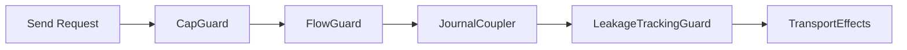

# Aura System Architecture

This document describes the current architecture and implementation patterns for Aura. It focuses on the effect system, authority model, guard chain enforcement, choreographic protocols, consensus integration, and crate layering. Formal definitions live in [Theoretical Model](002_theoretical_model.md) and domain specifications such as [Authority and Identity](102_authority_and_identity.md), [Journal](103_journal.md), and [Consensus](106_consensus.md).

## Overview

Aura is built around authorities, journals, and relational contexts. Each authority has its own journal namespace, and each relational context has its own journal namespace for shared state. Aura Consensus provides single operation agreement when monotone CRDT facts are not sufficient.

The journal is a product of two semilattices. Facts grow by join, and capability frontiers shrink by meet. The `Journal` type keeps these dimensions separate so runtime code can reason about them explicitly.

The architecture uses layered crates and an explicit guard chain for all network sends. The effect system provides explicit context propagation across async tasks. The guard chain enforces authorization, flow budgets, journal coupling, and leakage tracking before transport effects.

## 1. Authority and Relational Identity System

### 1.1 Authority model

An authority is an opaque cryptographic actor that can sign operations and hold state. It can contain multiple devices, but external parties only see authority public keys and journal facts.

```rust
pub struct AuthorityId(Uuid);
```

`AuthorityId` is an opaque UUID based identifier used to select the authority journal namespace. It does not encode membership or device structure.

### 1.2 Account authority structure

Account authorities maintain device membership using the commitment tree described in [Authority and Identity](102_authority_and_identity.md). The journal stores signed tree operations as facts. Reduction reconstructs the canonical tree state from these facts.

Account state uses `Policy` and `LeafNode` types from `aura-core`. Deterministic key derivation utilities provide context scoped keys without exposing the internal device set.

### 1.3 Relational context architecture

Relational contexts are shared journals for cross authority state. Each context has its own namespace and does not reveal participants.

```rust
pub struct ContextId(Uuid);
```

`ContextId` is an opaque UUID based identifier for that namespace. Participation is expressed by writing relational facts to the context journal.

### 1.4 Contextual identity properties

Identity is scoped to contexts. A device can participate in many contexts without linking them. Profile data and nickname suggestions live in the context journal.

## 2. Guard Chain and Flow Budget System

### 2.1 Guard chain architecture

All transport sends pass through a guard chain before any network effect. Guard evaluation uses a `GuardSnapshot` prepared from effect system state. Evaluation is pure and returns `EffectCommand` values.



The chain order matches the implementation in `aura-guards`. Each guard must succeed before effects are interpreted. This order enforces charge before send.

Guard responsibilities are listed below.

- CapGuard evaluates Biscuit capabilities.
- FlowGuard charges flow budgets and emits receipts.
- JournalCoupler commits facts alongside budget changes.
- LeakageTrackingGuard records privacy budget usage.

### 2.2 Flow budget system

Flow budgets limit send volume per context and peer. Only `spent` and `epoch` values are persisted as facts. The `limit` is computed at runtime from capabilities and policy.

```rust
pub struct FlowBudget {
    limit: u64,
    spent: u64,
    epoch: Epoch,
}
```

`FlowBudget` is a runtime view that combines derived limits with replicated counters. The journal only stores `spent` and `epoch` values.

### 2.3 Receipts and accountability

Flow budget charges emit receipts that can be verified by relays. Receipts include context, sender, receiver, epoch, and a hash chain link.

```rust
pub struct Receipt {
    pub ctx: ContextId,
    pub src: AuthorityId,
    pub dst: AuthorityId,
    pub epoch: Epoch,
    pub cost: u32,
    pub nonce: u64,
    pub prev: Hash32,
    pub sig: Vec<u8>,
}
```

Receipts allow forwarders to validate that prior hops paid their budget cost. The signature is stored as raw bytes to support multiple algorithms.

## 3. Async Effect System Architecture

### 3.1 Core principles

Effect traits live in `aura-core` and define async capabilities with explicit context. Handlers implement these traits for specific environments and compose into runtimes.

```rust
#[async_trait]
pub trait CryptoEffects {
    async fn hash(&self, data: &[u8]) -> [u8; 32];
    async fn hmac(&self, key: &[u8], data: &[u8]) -> [u8; 32];
}
```

This trait defines hashing and HMAC operations without exposing an implementation. The handler is chosen by the runtime and can be swapped for testing.

### 3.2 Effect trait classification

Effects are grouped by how they are implemented and composed.

- Infrastructure effects are implemented in `aura-effects`. Examples include `CryptoEffects`, `NetworkEffects`, `StorageEffects`, `PhysicalTimeEffects`, `RandomEffects`, and `TraceEffects`.
- Application effects encode domain logic in domain crates. Examples include `JournalEffects`, `AuthorizationEffects`, `FlowBudgetEffects`, and `LeakageEffects`.
- Composite effects are extension traits that combine lower level effects. Examples include `TreeEffects` and `LeakageChoreographyExt`.

`ReactiveEffects` is defined in `aura-core`. `ReactiveHandler` implements it in `aura-effects`. `AppCore` and `UnifiedHandler` in `aura-app` also implement it to integrate signals with application workflows.

### 3.3 Handler registration and interoperability

Handler composition uses `aura-composition` types such as `CompositeHandler`, `HandlerContext`, and `EffectRegistry`. `aura-protocol` re-exports `EffectRegistry` for convenience, and `aura-agent` uses it to assemble production effect systems.

`aura-effects` supplies concrete handlers such as `RealCryptoHandler`, `EncryptedStorage`, and `ReactiveHandler`. `aura-agent` wires these handlers with domain handlers to produce `AuraEffectSystem`. Feature crates depend on these abstractions without owning runtime assembly.

### 3.4 Unified time system

`TimeStamp` has four domains. `PhysicalClock` uses `PhysicalTime` with milliseconds since the Unix epoch and optional uncertainty. `LogicalClock` uses vector and Lamport clocks.

`OrderClock` uses a 32 byte token for opaque ordering. `Range` uses earliest and latest bounds with a confidence value.

`ProvenancedTime` wraps `TimeStamp` with optional proofs and origin. Ordering is explicit through `TimeStamp::compare` with an `OrderingPolicy`, and `sort_compare` is used for deterministic sorting. Time access happens through `PhysicalTimeEffects`, `LogicalClockEffects`, and `OrderClockEffects`.

### 3.5 Context propagation and guard integration

`EffectContext` is the operation scope and lives in `aura-core`. It carries authority id, context id, session id, execution mode, and metadata. `ContextSnapshot` provides a lighter view for handlers that do not need metadata.

Guard evaluators build `GuardSnapshot` from effect system state. They produce `EffectCommand` values that an interpreter executes. This separation keeps guard evaluation pure.

### 3.6 Impure function control

Application code must not call system time, randomness, or IO directly. These operations must flow through effect traits so tests and simulations can control them.

```rust
async fn op<E: PhysicalTimeEffects + RandomEffects>(effects: &E) -> Result<Nonce> {
    let now = effects.current_time().await;
    let bytes = effects.random_bytes(32).await?;
    Ok(Nonce { now, bytes })
}
```

This pattern keeps nondeterminism inside effect handlers and makes tests reproducible.

## 4. Choreographic System

### 4.1 Global protocol specification

Choreographies define global protocols using multi party session types. The `choreography!` macro in `aura-macros` generates local session types and effect bridge helpers.

```rust
choreography! {
    #[namespace = "ping_pong"]
    protocol PingPong {
        roles: Alice, Bob;
        Alice[guard_capability = "send_ping", flow_cost = 5] -> Bob: Ping(data: Vec<u8>);
        Bob[guard_capability = "send_pong", flow_cost = 5] -> Alice: Pong(response: Vec<u8>);
    }
}
```

The namespace attribute is required and must be unique within a compilation unit. Annotation fields compile into `EffectCommand` sequences that the guard chain enforces.

### 4.2 Session type integration

Projection yields `LocalSessionType` values executed by `AuraHandler` in `aura-protocol`. `AuraHandler` uses serialized parameters and results for trait object compatibility. Guard evaluation runs before transport sends for each message.

### 4.3 Extension effects and annotations

Annotations such as `guard_capability`, `flow_cost`, `journal_facts`, and `leak` are interpreted by extension effects. The guard chain combines these commands with runtime checks. This keeps policy declarative and uniform across protocols.

## 5. Consensus Integration Architecture

### 5.1 Single shot agreement model

Aura Consensus produces `CommitFact` entries that are inserted into journals. `CommitFact` includes prestate hash, operation hash, participant set, threshold signature, and a `ProvenancedTime` timestamp. The protocol is scoped to a single operation and does not maintain a global log.

### 5.2 Fast path and fallback

The fast path completes in one round trip when witnesses agree on prestate. The fallback path uses bounded gossip when witnesses disagree or initiators stall. Both paths yield the same `CommitFact` format.

### 5.3 Prestate binding

`ConsensusId` is derived from prestate hash, operation hash, and a nonce. This binding prevents reusing signatures across unrelated operations. See [Consensus](106_consensus.md) for protocol details.

## 6. 8 Layer Crate Architecture

### 6.1 Architectural layering

Aura uses eight layers with no cyclic dependencies.

- Layer 1 Foundation uses `aura-core` for effect traits, identifiers, and cryptography.
- Layer 2 Specification uses domain crates plus `aura-macros` and `aura-mpst`.
- Layer 3 Implementation uses `aura-effects` and `aura-composition`.
- Layer 4 Orchestration uses `aura-protocol`, `aura-guards`, `aura-consensus`, `aura-amp`, and `aura-anti-entropy`.
- Layer 5 Feature uses crates such as `aura-authentication`, `aura-chat`, `aura-invitation`, `aura-recovery`, `aura-relational`, `aura-rendezvous`, `aura-social`, and `aura-sync`.
- Layer 6 Runtime uses `aura-agent`, `aura-app`, and `aura-simulator`.
- Layer 7 Interface uses `aura-terminal` for CLI and TUI entry points.
- Layer 8 Testing uses `aura-testkit` and `aura-quint`.

FROST primitives live in `aura-core::crypto::tree_signing`. The legacy `aura-frost` crate is removed from the workspace.

### 6.2 Layer 2 invariants

Layer 2 defines semantics without runtime behavior.

- No handler composition or OS access.
- Domain facts are versioned and encoded with canonical DAG-CBOR.
- Fact reducers register with `FactRegistry`.
- Authorization uses typed operations and `ResourceScope` from `aura-core`.

### 6.3 Code location decision framework

The following guidance keeps logic in the correct layer.

- Single party stateless operations belong in `aura-effects`.
- Handler composition belongs in `aura-composition` or `aura-agent`.
- Multi party coordination belongs in `aura-protocol` and its Layer 4 subcrates.
- Domain specific logic belongs in domain crates.

### 6.4 Dependency management

Dependencies flow downward. `aura-core` depends on no other Aura crates. Domain crates depend only on `aura-core`. Higher layers depend on lower layers and do not reach upward.

## 7. Implementation Guidelines

### 7.1 Effect handler development

New effect traits live in `aura-core`. Infrastructure handlers live in `aura-effects`. Domain handlers live in domain crates and compose lower level effects.

### 7.2 Protocol design patterns

Use choreographies for multi party protocols. Express guard requirements through annotations and avoid manual guard calls. Keep context isolation by scoping all operations to `ContextId`.

### 7.3 Testing and simulation

`aura-testkit` provides mock handlers with deterministic behavior. `aura-simulator` provides controlled time and failure injection. Both use the same effect traits as production.

## 8. Database System

### 8.1 Journal and query mapping

The journal is the database, and CRDT merge provides replication. Biscuit Datalog is used as the query engine. Journal reduction views act like tables.

### 8.2 Query architecture

`AuraQuery` lives in `aura-effects` and wraps Biscuit authorizers. `QueryHandler` composes `JournalEffects`, `AuthorizationEffects`, and `ReactiveEffects`. Queries can inject an authority context and optional context facts.

### 8.3 Indexing layer

`IndexedJournalEffects` defines indexed lookups, Bloom filters, and Merkle proof support. The production implementation is `IndexedJournalHandler` in `aura-agent`. `AuraEffectSystem` implements `IndexedJournalEffects` by delegating to this handler.

## 9. Social Topology

Social topology models messages, homes, and neighborhoods and is defined in [Social Architecture](114_social_architecture.md). The app layer includes `HomeFlowBudget` constants for storage limits such as 10 MB per home, 200 KB per resident, and 1 MB per neighborhood. Moderation facts live in `aura-social` and are stored as relational facts.

## 10. Terminal User Interface

### 10.1 Architecture principles

`aura-terminal` provides CLI and TUI entry points. It uses `aura-app` for portable workflows and `aura-agent` for runtime effects. The TUI dispatches commands asynchronously and renders state derived from signals and views.

### 10.2 Reactive system

`ReactiveScheduler` in `aura-agent` batches journal fact processing with a default 5 ms window. It updates signal views that emit state into signals defined in `aura-app`. Dynamic values in `aura-agent` use a broadcast channel and an async `RwLock` to notify subscribers.

### 10.3 Effect bridge

The TUI uses bridge modules in `aura-app` to forward state to UI observers. Demo commands are compiled only with the development feature flag. Demo mode uses the simulator to run automated peers while the user controls the local agent.

## 11. Operation Categories

Aura classifies operations into categories A, B, and C to decide when consensus is required. Category A uses CRDTs with immediate local effect, Category B shows pending state until agreement, and Category C blocks until consensus completes. Agreement modes are orthogonal to these categories and are defined in [Operation Categories](107_operation_categories.md).

## Related Documents

- [Project Overview](000_project_overview.md)
- [Theoretical Model](002_theoretical_model.md)
- [Authority and Identity](102_authority_and_identity.md)
- [Journal](103_journal.md)
- [Relational Contexts](112_relational_contexts.md)
- [Privacy and Information Flow](003_information_flow_contract.md)
- [Transport and Information Flow](109_transport_and_information_flow.md)
- [Authorization](104_authorization.md)
- [Multi-party Session Types and Choreography](108_mpst_and_choreography.md)
- [Effect System and Runtime](105_effect_system_and_runtime.md)
- [Consensus](106_consensus.md)
- [Database Architecture](113_database.md)
- [Social Architecture](114_social_architecture.md)
- [CLI and Terminal User Interface](116_cli_tui.md)
- [Operation Categories](107_operation_categories.md)
- [Aura Crate Structure and Dependency Graph](999_project_structure.md)
- [Coordination Systems Guide](803_coordination_guide.md)
- [Development Patterns and Workflows](805_development_patterns.md)
- [Testing Guide](805_testing_guide.md)
- [Distributed Systems Contract](004_distributed_systems_contract.md)
- [Aura System Invariants](005_system_invariants.md)
