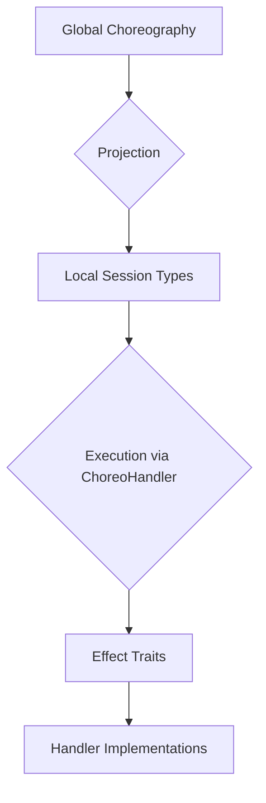
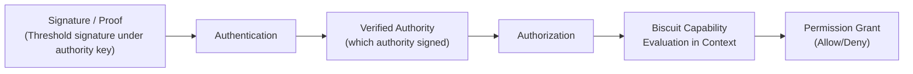

# Aura System Architecture

This document describes Aura’s system architecture and implementation patterns. It covers the async effect system, CRDT implementation patterns, choreographic protocol design, and crate organization principles, updated to align with the current authority and relational identity model.

Formal definitions live in [Theoretical Model](002_theoretical_model.md) and the specs for:

* Relational Identity
* Ratchet Tree Semilattice
* Journal System
* Aura Consensus

## Overview

Aura’s system architecture implements the mathematical foundations through practical patterns that avoid deadlocks and ensure distributed correctness. The architecture centers on:

* Authorities and their ratchet-tree-based internal state
* Journals as CRDT fact stores per authority and per RelationalContext
* RelationalContexts for cross-authority relationships
* Aura Consensus for single-operation strong agreement where CRDT alone is insufficient

The architecture consists of four integrated systems:

1. The async effect system for isolated services and deadlock-free execution.
2. The CRDT and journal architecture for conflict-free replication.
3. The choreographic protocol system for session-typed distributed coordination.
4. The crate organization that maintains clean layering and zero circular dependencies.

## Terminology & Layering

For architectural terms and concepts, see the project glossary.

### Effect System Runtime Objects

The effect system uses these canonical names:

* `EffectExecutor`: Stateless effect execution engine that dispatches to handlers.
* `ContextManager`: Isolated service managing execution contexts.
* `FlowBudgetManager`: Isolated service managing flow budgets per context-peer pair.
* `ReceiptManager`: Isolated service managing receipt chains.
* `AuraEffectSystem`: Coordinator that orchestrates handlers.
* `AuraHandler`: Unified trait interface for type-erased handlers.

### Effect Trait Categories

Core Effect Traits:

* `TimeEffects`, `CryptoEffects`, `StorageEffects`, `NetworkEffects`,
  `JournalEffects`, `ConsoleEffects`, `RandomEffects`

Extended Effect Traits:

* `SystemEffects`, `LedgerEffects`, `ChoreographicEffects`,
  `TreeEffects`, `AgentEffects`, `ReliabilityEffects`

### Data Layer Separation

* Journal: High-level CRDT fact management for each authority and each RelationalContext.
* Ledger: Low-level append and storage primitives used by the Journal.

The Journal stores facts. Aura Consensus and domain reductions assign meaning to those facts.

### Protocol Stack Layers

* Choreographies: Global protocol specifications, compiled via projection.
* Session Types: Local projections of choreographies with complete MPST infrastructure.
* Protocols: Manual async implementations that integrate with choreographies and guard chains.

### Authentication and Authorization Flow

* Authentication: Verifying signatures from authorities (accounts, guardian authorities, groups).
* Authorization: Evaluating Biscuit capabilities relative to context.
* Integration: Composed via an authorization bridge that uses the effect system and guard chain.

Identity is contextual and relational, not a global property of a key.

### Projection

Aura treats choreographies as the source of truth. `aura-macros` parses choreographic protocols, and rumpsteak-aura projection generates local session types. `aura-mpst` provides the `AuraHandler` implementation of `ChoreoHandler` that executes protocols via rumpsteak-aura’s interpreter. Guard chains and journal coupling are integrated through extension effects.

---

## 1. Async Effect System Architecture

### 1.1 Core Principles

Aura implements an async-first effect system that supports both native and WASM targets and avoids deadlocks through explicit context propagation and isolated state services.

Key design principles:

* Async-native: All effect operations are async.
* Explicit context: No ambient global state. Context travels explicitly.
* Builder-based initialization: Assembling handlers with async setup.
* No OS-thread assumptions: Works in browsers and embedded runtimes.
* Explicit lifecycle: Initialization, readiness, and shutdown phases.

### 1.2 Algebraic Effect Theory & Terminology

Effects define abstract capabilities:

```rust
#[async_trait]
pub trait CryptoEffects {
    async fn hash(&self, data: &[u8]) -> [u8; 32];
    async fn hmac(&self, key: &[u8], data: &[u8]) -> [u8; 32];
}
```

Handlers provide implementations:

```rust
pub struct RealCryptoHandler;

#[async_trait]
impl CryptoEffects for RealCryptoHandler {
    async fn hash(&self, data: &[u8]) -> [u8; 32] {
        // Note: pure hashing can also use aura_core::hash directly
        aura_core::hash::hash(data)
    }

    async fn hmac(&self, key: &[u8], data: &[u8]) -> [u8; 32] {
        // HMAC implementation
    }
}
```

Cross-cutting concerns like retry, backoff, and tracing are defined as explicit effect traits such as:

```rust
#[async_trait]
pub trait ReliabilityEffects {
    async fn with_retry<T, F>(&self, ctx: &EffectContext, f: F) -> Result<T>
    where
        F: Fn() -> Result<T> + Send;
}
```

Hashing that is pure and deterministic (e.g. Blake3) is not modelled as an effect. Use `aura_core::hash` directly for those cases.

### 1.3 Layered Effect Architecture

Layer 1: Interface (`aura-core`)

Contains:

* Effect trait definitions.
* Core identifiers such as `AuthorityId`, `ContextId`, `ContentId`.
* Core error types and semilattice traits.

No implementations live here.

Layer 2: Specification (domain crates)

Crates such as:

* `aura-journal`: Journal domain types and semilattice operations.

These crates define how state behaves but do not do I/O.

Layer 3: Implementation (`aura-effects`)

Provides stateless effect handlers:

* `MockCryptoHandler`, `MemoryStorageHandler`.
* `RealCryptoHandler`, `TcpNetworkHandler`, `FilesystemStorageHandler`.

No multi-party coordination logic. Only context-free operations.

Layer 4: Orchestration (`aura-protocol`)

Adds:

* `AuraHandlerAdapter`, `CompositeHandler`.
* `CrdtCoordinator`, synchronization primitives.
* Guard chains (CapGuard, FlowGuard, JournalCoupler).
* Aura Consensus integration.

This is where coordination happens.

Layer 5: Feature/Protocol

Crates such as:

* `aura-frost`: FROST keygen and signing ceremonies.
* `aura-sync`: journal synchronization, anti-entropy.

Layer 6: Runtime Composition (`aura-agent`, `aura-simulator`)

Assemble handlers and protocols into runnable agents. Provide APIs to embed Aura in applications or simulations.

Layer 7: User Interface (`aura-cli`, app frontends)

User-facing binaries that drive runtime composition.

Layer 8: Testing/Tools (`aura-testkit`, `aura-quint-api`)

Shared fixtures, model checking interfaces, and property tests.

#### Where does my code go?

* Stateless, single effect → `aura-effects`
* Multi-handler coordination, multi-party → `aura-protocol`
* Domain semilattice or journal logic → domain crate (`aura-journal`, etc.)
* End-to-end protocol logic → feature crate (`aura-frost`)

### 1.4 Async Architecture Components

#### Effect System Builder

`AuraEffectSystemBuilder` assembles handlers:

```rust
pub struct AuraEffectSystemBuilder {
    config: EffectSystemConfig,
    handlers: HashMap<TypeId, Arc<dyn Any + Send + Sync>>,
    container: Option<EffectContainer>,
}

impl AuraEffectSystemBuilder {
    pub fn new() -> Self {
        Self::default()
    }

    pub fn with_handler<T: 'static>(mut self, handler: Arc<T>) -> Self {
        self.handlers.insert(TypeId::of::<T>(), handler);
        self
    }

    pub async fn build(self) -> Result<AuraEffectSystem> {
        // Parallel initialization
        // ...
        Ok(AuraEffectSystem {
            handlers: self.handlers,
            lifecycle: LifecycleManager::new(),
        })
    }
}
```

This builder pattern allows composable handler assembly with async initialization support. Handlers are type-erased and stored by their type ID for runtime lookup.

#### Context Propagation System

Context flows explicitly:

```rust
#[derive(Clone, Debug)]
pub struct EffectContext {
    pub request_id: Uuid,
    pub local_device_id: LocalDeviceId, // internal to authority
    pub flow_budget: FlowBudget,
    pub trace_context: TraceContext,
    pub deadline: Option<Instant>,
    pub metadata: HashMap<String, String>,
}

#[async_trait]
pub trait ContextualNetworkEffects {
    async fn send_with_context(
        &self,
        ctx: &EffectContext,
        envelope: Envelope,
    ) -> Result<Receipt>;
}
```

Internally, task-local context simplifies async code but only wraps explicit passing:

```rust
tokio::task_local! {
    static EFFECT_CONTEXT: EffectContext;
}

pub async fn with_context<F, R>(ctx: EffectContext, f: F) -> R
where
    F: Future<Output = R>,
{
    EFFECT_CONTEXT.scope(ctx, f).await
}
```

#### Lifecycle Management

Lifecycle states are explicit:

```rust
pub struct LifecycleManager {
    state: Arc<AtomicU8>,
    components: Arc<RwLock<Vec<Arc<dyn LifecycleAware>>>>,
    start_time: Instant,
}
```

Transitions:

* Uninitialized → Initializing → Ready → ShuttingDown → Shutdown

Each component implements `LifecycleAware` for initialization and shutdown hooks.

### 1.5 Session Type Algebra Integration

Choreographies compile into local session types and then into effect calls:



The static path uses macros (`choreography!`) to generate strongly-typed Rust code. The dynamic path uses runtime interpretation for flexible composition.

### 1.6 SecureChannel Abstraction

Successful rendezvous or recovery handshakes yield `SecureChannel` objects:

* Transport: QUIC connection or equivalent.
* Metadata: authority identifiers, ContextId, epoch, channel ID.
* Policy: one active channel per (`ContextId`, peer authority).

Flow budgets, receipts, and epochs govern channel lifetime.

### 1.7 Guard Chain and Predicate

All network sends pass through the guard chain defined in [Authorization](109_authorization.md). CapGuard evaluates Biscuit tokens and local policy to derive the current `limit`. FlowGuard checks if `spent + cost <= limit`, and if successful, emits a charge fact (incrementing `spent`) to the journal and creates a receipt scoped to `(ContextId, source AuthorityId, dest AuthorityId, epoch)`. JournalCoupler applies any fact deltas atomically with the send.

Failure at any stage returns locally with no observable side effect. Capabilities remain outside the CRDT so JournalCoupler operates only on fact merges (including the `spent` counter updates).

---

## 2. CRDT Implementation Architecture

### 2.1 4-Layer Architecture

Aura’s CRDT system supports:

* Account journals (per authority).
* RelationalContext journals (per context).

Both are semilattices of facts under union, with deterministic reduction.

Layers:

1. Semantic Foundation: `JoinSemilattice`, `CvState`, `MvState`, CRDT messages.
2. Effect Interpretation: Coordinators and handlers enforcing CRDT laws over effects.
3. Choreographic Protocols: Anti-entropy, snapshot, and repair protocols that synchronize state.
4. Application CRDTs: Journal fact sets, account state semilattice, context state semilattices.

### 2.2 File Organization

* `aura-core/src/semilattice/`: semilattice traits.
* `aura-journal/src/semilattice/`: journal and authority-specific CRDTs.
* `aura-relational/src/semilattice/`: relational context CRDTs.
* `aura-protocol/src/effects/semilattice/`: CRDT coordinators and delivery effects.
* `aura-mpst` / `aura-protocol`: choreographies and runtime glue.

### 2.3 Generic Handlers

`CvHandler` for convergent state-based CRDTs:

```rust
pub struct CvHandler<S: CvState> {
    pub state: S,
}

impl<S: CvState> CvHandler<S> {
    pub fn on_recv(&mut self, msg: StateMsg<S>) {
        self.state = self.state.join(&msg.0);
    }
}
```

Operation-based handlers use causal context and deduplication. These are used where operations are lighter than full-state sync.

### 2.3.1 Causal Context

Causal context uses vector clocks and operation IDs. Actor IDs may be internal per authority (e.g. per device or per agent role), but these IDs do not leak outside authority or context boundaries.

Operations are buffered until causally ready, preserving CRDT correctness even under out-of-order delivery.

### 2.3.2 CRDT Coordinator

`CrdtCoordinator` multiplexes CV, delta, and CM handlers behind a single interface. Choreographies interact with `CrdtCoordinator`, which routes messages to the right handler based on a CRDT type tag.

### 2.4 Delivery Effects

Delivery effects coordinate with choreographic sends:

```rust
pub enum DeliveryEffect {
    CausalBroadcast { topic: TopicId },
    AtLeastOnce    { topic: TopicId },
    GossipTick     { topic: TopicId },
    ExchangeDigest,
}
```

Anti-entropy and Aura Consensus use these effects to drive reconciliation.

---

## 3. Aura Choreographic System

### 3.1 System Overview

Choreographies define global interaction patterns. Projection produces local session types and protocol code that:

* uses the effect system for I/O,
* calls guard chains for sends,
* triggers journal updates when needed,
* can invoke Aura Consensus where non-mergeable decisions exist.

### 3.2 Architecture Components

* DSL Parser: builds AST from `choreography!` macros.
* Projection Engine: generates local MPST types per role.
* Code Generation: produces strongly-typed Rust session types.
* Effect Handler Bridge: `ChoreoHandler` implementation backed by `AuraEffectSystem`.

Example:

```rust
choreography! {
    #[namespace = "ping_pong"]
    protocol PingPong {
        roles: Alice, Bob;
        Alice[guard_capability = "send_ping", flow_cost = 5] -> Bob: Ping(data: Vec<u8>);
        Bob[guard_capability = "send_pong", flow_cost = 5] -> Alice: Pong(response: Vec<u8>);
    }
}
```

### 3.3 Integration with Aura Effects

Generated code uses a handler adapter:

```rust
#[async_trait]
pub trait ChoreoHandler {
    type Role;
    type Endpoint;

    async fn send<M>(&mut self, ep: &mut Self::Endpoint, to: Self::Role, msg: &M) -> Result<()>
    where
        M: Serialize + Send + Sync;

    async fn recv<M>(&mut self, ep: &mut Self::Endpoint, from: Self::Role) -> Result<M>
    where
        M: DeserializeOwned + Send;
}
```

Guard chain and journal coupling are invoked by extensions bound to messages via annotations.

### 3.3.1 AuraHandler Implementation

`AuraHandler` is the concrete adapter between rumpsteak-aura and `AuraEffectSystem`. It maintains:

* role-to-authority mapping (local view of peers),
* `ContextId`s for each peer link,
* guard profiles for message types (capability requirement, cost, journal annotations),
* references to effect handlers.

For a send:

1. Look up guard profile for message type.
2. Use `ContextId` to determine budget and capabilities.
3. Run CapGuard, FlowGuard, JournalCoupler.
4. On success, call `NetworkEffects` to send.

Receipts can be attached to messages for multi-hop proofs.

---

## 4. Protocol Stack Architecture

### 4.1 Three-Layer Stack

* Choreographies: global.
* Session Types: local.
* Protocols: manual async functions combining session types and effect calls.

### 4.2 Components

Choreographies live in `aura-protocol/src/choreography/protocols/`. Session types live in `aura-mpst`. Protocols live alongside domain-specific crates (`aura-frost`, `aura-recovery`, `aura-sync`).

### 4.3 Implementation Patterns

Protocols can be:

* fully choreographic (specified in DSL), or
* hybrid (hand-written with some choreographic subprotocols).

Both use guard chains and journal coupling.

Aura Consensus is invoked by protocols when they must agree on a particular operation (e.g. tree update, RecoveryGrant, GuardianBinding).

---

## 5. Authentication vs Authorization Flow

### 5.1 Architecture Overview

Aura separates:

* Authentication: only about verifying that a signature belongs to some authority under a given key and tree commitment.
* Authorization: about whether an authority has the right to perform an action in a context, via Biscuit capabilities.

There is no global person identity. All identity is contextual.

### 5.2 Data Flow Architecture



Flow:

1. Authentication uses public keys from authority state (ratchet tree + reduction) to verify signatures.
2. Authorization evaluates Biscuit tokens against the requested action and context restrictions.
3. Guard chain enforces `need(message) ≤ Caps(ctx)` and `headroom(ctx, cost)` at send sites.

Guardian approvals are expressed as RecoveryGrants and GuardianBindings in RelationalContexts, not by special authn logic.

### 5.3 Effect System Integration

Authentication and authorization are implemented as effects:

* `AuthenticationEffects` – verifying signatures, loading public keys from authority state.
* `AuthorizationEffects` – verifying Biscuit tokens and evaluating capability logic.

The `authorization_bridge` composes these for high-level flows like “authenticate this operation and authorize it in this context.”

### 5.4 Formal Properties

Biscuit capabilities are attenunable and composable. Capability evaluation is monotone with respect to added caveats (more caveats means fewer permissions). Authentication and authorization layers remain decoupled. The bridge coordinates them.

---

## 6. Choreographic Protocol Design

### 6.1 Free Algebra Property

Choreographies expand into a `Program<R, M>` algebra with effects:

```rust
pub enum Effect<R, M> {
    Send { to: R, msg: M },
    Recv { from: R, msg_type: &'static str },
    Choose { at: R, label: Label },
    Parallel { programs: Vec<Program<R, M>> },
    End,
}
```

### 6.2 Algebraic Operators

Sequential composition, parallel composition, and choice form the core building blocks.

### 6.3 Usage Patterns

Protocols used for:

* threshold signing rounds,
* Aura Consensus instances,
* DKD negotiations,
* journal anti-entropy,
* recovery ceremonies via guardian RelationalContexts.

### 6.4 Capability-Guarded Transitions

Every SEND can be annotated with required capabilities and flow cost. Extensions ensure guard chain runs. These annotations are local to protocols and do not modify journal semilattices.

### 6.5 Journal-Coupled Transitions

Where a protocol emit needs to correspond to a state transition (e.g. AttestedOp insertion), JournalCoupler ensures atomic interplay between protocol step and journal update under chosen semantics (pessimistic vs optimistic).

### 6.6 Leakage Budgets

Leakage budgets tag operations with privacy cost. Policies bound total cost per epoch or per context. This governs padding, batching, and exposure decisions.

---

## 7. Crate Organization and Dependencies

### 7.1 Crate Hierarchy

Crates are layered:

* `aura-core` – traits, identifiers, semilattices.
* Domain crates – ratchet, journal, relational.
* `aura-effects` – stateless handlers.
* `aura-protocol` – orchestration, guard chains, Aura Consensus integration.
* Feature crates – FROST, DKD, recovery, sync.
* Runtime crates – `aura-agent`, `aura-simulator`.
* Apps – `aura-cli`, UI frontends.

### 7.2 Crate Boundary Rules

* No crate implements traits from a higher layer.
* No crate references UI from core.
* No circular dependencies.

### 7.3 Anti-Patterns

* Duplicating effect traits.
* Implementing effects inside domain or app crates.
* Mixing orchestration logic into `aura-effects`.
* Storing capabilities in the journal.

---

## 8. Implementation Guidelines

### 8.1 Creating Custom Effect Handlers

New effect traits go into `aura-core`. Their implementations belong in:

* `aura-effects` if stateless and single-party.
* `aura-protocol` if multi-party or coordinating multiple handlers.

### 8.2 Direct System Access

Production `aura-effects` handlers can perform OS operations like filesystem access, network I/O, or time queries. All such operations must be behind effect traits for testability.

### 8.3 Usage Patterns

Correct import patterns:

```rust
// Traits and types
use aura_core::effects::CryptoEffects;
use aura_core::ids::{AuthorityId, ContextId};

// Stateless implementations
use aura_effects::crypto::RealCryptoHandler;

// Coordination
use aura_protocol::handlers::CompositeHandler;

// Runtime assembly
use aura_agent::AuraAgent;
```

CRDT integration always composes from `JoinSemilattice` traits upwards, never bypassing semilattice laws.

---

## See Also

* Theoretical Foundations
* Relational Identity Specification
* Ratchet Tree Semilattice Specification
* Revised Journal Specification
* Authorities and RelationalContexts Specification


---

## Summary of Major Architecture Changes

### 1. Identity Model and Authority Model Updated

Original approach:

* Treated devices, accounts, guardians, groups, and identities as first-class roles.
* Mixed device-level identity with system logic.
* Guardians appeared as leaf roles in ratchet trees.

Revised approach:

* Identity is relational and contextual, not global.
* Authorities are opaque cryptographic actors.
* Guardianship and recovery moved entirely to RelationalContexts, not ratchet tree roles.
* No device-level public identifiers surface outside authorities.

### 2. Ratchet Tree Reframed as a Pure Intra-Authority Semilattice

Original approach:

* Ratchet tree integrated guardian leaves.
* Device IDs in tree ops.
* Tree updates tied to device-level signers.

Revised approach:

* Ratchet tree contains only device leaves and threshold policies.
* It is explicitly a semilattice of AttestedOps.
* Guardians and cross-authority relationships removed from the tree.

### 3. Journal System Completely Overhauled

Original approach:

* Journal stored device-signed facts, capabilities, trust relationships, timestamps.
* Capabilities lived inside a CRDT meet-semilattice.
* Intent pool and device-level threshold voting present.

Revised approach:

* Journal stores only facts: AttestedOps, SnapshotFacts, RelationalFacts, and FlowBudget spent counters (limits remain runtime-derived).
* No device signatures, no device IDs, no timestamps for correctness.
* Capabilities are Biscuit tokens, not CRDT meet semilattice elements.
* Capability refinement still uses semilattice semantics but this refinement happens inside Biscuit logic, at verification time, not in the replicated journal state. The semilattice lives inside the Biscuit evaluation logic, not in CRDT semilattice storage.
* RelationalContexts have their own journals and reductions.
* Capabilities can embed audit caveats or issue relational facts when formal delegation must be visible.

Note on capability recovery: If a device loses its capability tokens, they aren't recreated from Journal. They must be reissued.

Mitigation strategies include:
* Use RelationalContexts to attach consent-based identity metadata
* Use renewable session capabilities
* Issue static capabilities tied to DKD-derived context keys

### 4. Aura Consensus Integrated as the Only Strong Consensus

Original approach:

* Consensus logic mixed across various handlers and intent pools.
* Threshold support collection using device IDs.

Revised approach:

* Aura Consensus is the only strong-agreement mechanism.
* Used in authority updates and relational contexts.
* Intent pool removed entirely.
* Threshold signatures structured around authority roles, not devices.

### 5. RelationalContexts Added (Major Architectural Shift)

Original approach:

* No relational context abstraction.
* Cross-authority relationships handled ad hoc or through tree structure.

Revised approach:

* RelationalContexts define shared state between authorities.
* Guardian configuration and recovery built out of two relational contexts.
* Cross-authority operations use Aura Consensus with combined prestate hashes.
* Clean separation between physical and logical state machines.

### 6. Authorization Logic Corrected

Original approach:

* Capabilities stored in journal meet-semilattice.
* Sometimes conflated identity, permission, and device roles.

Revised approach:

* Authorization uses Biscuit capability tokens.
* No capability storage in journal.
* Authorization is entirely separate from authentication.
* Guard chain enforces Biscuit + budget + journal coupling.

### 7. Identifiers Overhauled

Original approach:

* DeviceId, GroupId, RelayId, DKDContextId, MemberId, etc.
* Many identifiers tied to device structure.

Revised approach:

* Only `AuthorityId`, `ContextId`, `SessionId`, `ContentId`.
* All user-facing names become local-only petnames.
* IDs reveal no operator or membership structure.

### 8. Crate Roles and Boundaries Updated

Original approach:

* Boundary between domain logic, protocol logic, and effects was ambiguous.
* Some components mixed device-level concerns and global identity concepts.

Revised approach has clear boundaries:

* `aura-core` = traits and types
* domain crates = ratchet/journal/relational logic
* `aura-effects` = stateless single-party handlers
* `aura-protocol` = multi-party orchestration + consensus
* feature crates = DKD, FROST, recovery
* runtime crates = assembly
* UI crates = entrypoints

### 9. Guardian and Recovery Model Rewritten

Original approach:

* Guardians encoded directly in ratchet tree.
* Recovery tied to guardian leaves.

Revised approach:

* Guardians are separate authorities.
* Guardian configuration = relational context.
* Recovery operations = second relational context.
* All cross-authority logic handled by relational facts.

### 10. Much Stronger Privacy Guarantees

Original approach:

* Device identifiers, trust relations, and group membership might leak.
* Identifiers embedded structural info.

Revised approach:

* Authorities are opaque.
* Contexts are opaque.
* No device or membership structure leaks.
* Identity is contextual and never global.
