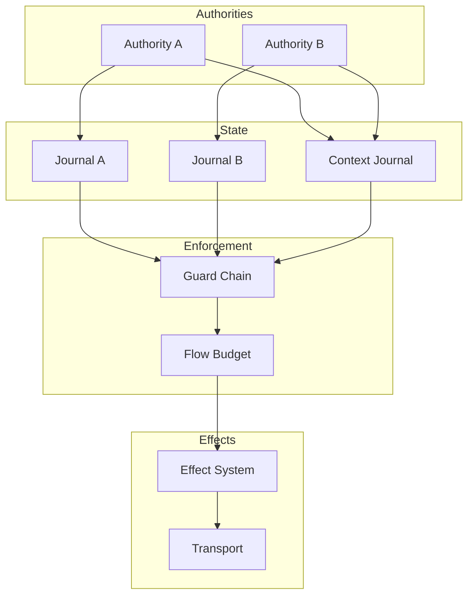
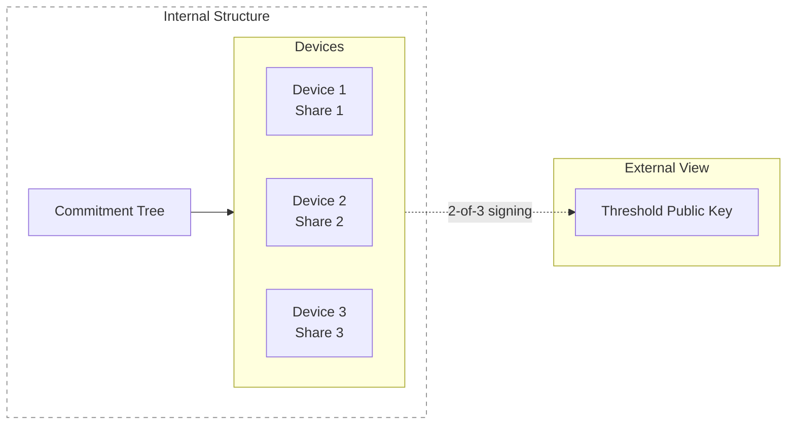
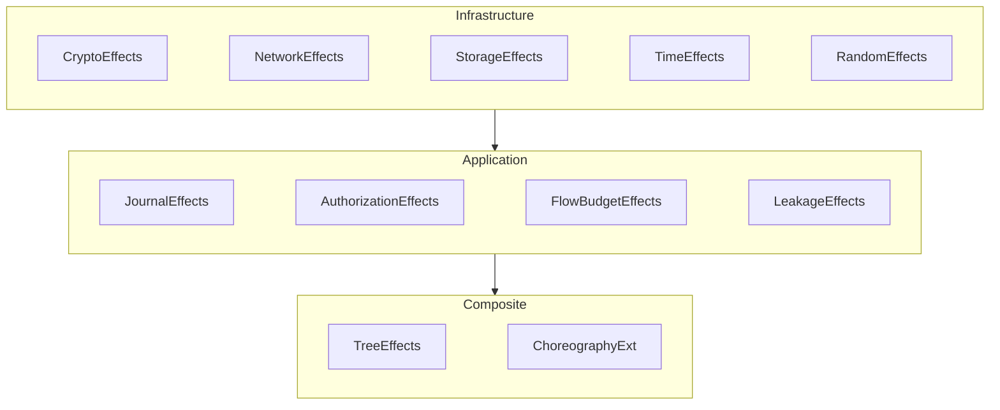
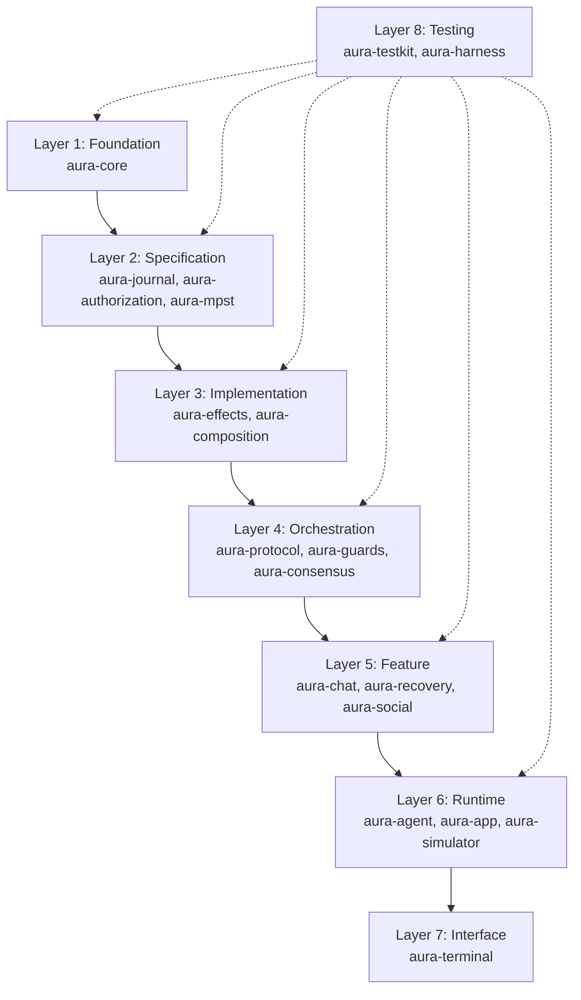

# System Architecture

This document gives an intuitive overview of Aura's architecture. It covers the core abstractions, data flow patterns, and component interactions that define the system. Formal definitions live in [Theoretical Model](002_theoretical_model.md), an overview of the implementation can be found in [Project Structure](999_project_structure.md).

## Overview

Aura is a peer-to-peer identity and communication system built on three pillars. Threshold cryptography distributes trust across multiple devices. Session-typed protocols ensure safe multi-party coordination. CRDT journals provide conflict-free replicated state.

The system operates without dedicated servers. Discovery, availability, and recovery are provided by the web of trust. Peers relay messages for each other based on social relationships. No single party can observe all communication or deny service.

Aura separates key generation from agreement. Fast paths provide immediate usability while durable shared state is always consensus-finalized.


```mermaid
flowchart TB
    subgraph Authorities
        A1[Authority A]
        A2[Authority B]
    end

    subgraph State
        J1[Journal A]
        J2[Journal B]
        JC[Context Journal]
    end

    subgraph Enforcement
        GC[Guard Chain]
        FB[Flow Budget]
    end

    subgraph Effects
        EF[Effect System]
        TR[Transport]
    end

    A1 --> J1
    A2 --> J2
    A1 & A2 --> JC
    J1 & J2 & JC --> GC
    GC --> FB
    FB --> EF
    EF --> TR
```

This diagram shows the primary data flow. Authorities own journals that store facts. The guard chain enforces authorization before any transport effect. The effect system provides the abstraction layer for all operations.

Every operation flows through the effect system. Every state change is replicated through journals. Every external action is authorized through guards. These three invariants define the architectural contract.

## 1. Dual Semilattice Model

Aura state consists of two complementary semilattices. Facts form a join-semilattice where information accumulates through the join operation. Capabilities form a meet-semilattice where authority restricts through the meet operation.

```rust
// Facts grow by join (⊔)
struct Journal {
    facts: FactSet,        // join-semilattice
    frontier: CapFrontier, // meet-semilattice
}
```

The `Journal` type keeps these dimensions separate. Facts can only grow. Capabilities can only shrink. This dual monotonicity provides convergence guarantees for replicated state.

Facts represent evidence that accumulates over time. Examples include signed operations, attestations, flow budget charges, and consensus commits. Once a fact is added, it cannot be removed. Garbage collection uses tombstones and reduction rather than deletion.

Capabilities represent authority that restricts over time. The system evaluates Biscuit tokens against policy to derive the current capability frontier. Delegation can only attenuate. No operation can widen capability scope. See [Theoretical Model](002_theoretical_model.md) for formal definitions of these lattices.

## 2. Authority and Identity Architecture

An authority is an opaque cryptographic actor. External parties see only public keys and signed facts. Internal device structure is hidden. This abstraction provides unlinkability across contexts.


```mermaid
flowchart LR
    subgraph External View
        PK[Threshold Public Key]
    end

    subgraph Authority [Internal Structure]
        direction TB
        CT[Commitment Tree]
        subgraph Devices
            direction LR
            D1[Device 1<br/>Share 1]
            D2[Device 2<br/>Share 2]
            D3[Device 3<br/>Share 3]
        end
        CT --> Devices
    end

    Devices -.->|2-of-3 signing| PK

    style Authority fill:transparent,stroke:#888,stroke-dasharray: 5 5
```

This diagram shows authority structure. Externally, observers see only the threshold public key. Internally, the commitment tree tracks device membership. Each device holds a key share. Threshold signing combines shares without exposing internal structure.

### 2.1 Account authorities

Account authorities maintain device membership using commitment trees. The journal stores signed tree operations as facts. Reduction reconstructs the canonical tree state from accumulated facts.

```rust
pub struct AuthorityId(Uuid);
```

`AuthorityId` is an opaque identifier for the authority namespace. It does not encode membership or reveal device count. Key derivation utilities provide context-scoped keys without exposing internal structure. See [Identifiers and Boundaries](101_identifiers_and_boundaries.md) for identifier semantics.

### 2.2 Relational contexts

Relational contexts are shared journals for cross-authority state. Each context has its own namespace and does not reveal participants to external observers.

```rust
pub struct ContextId(Uuid);
```

`ContextId` identifies the shared namespace. Participation is expressed by writing relational facts. Profile data, nicknames, and relationship state live in context journals. See [Authority and Identity](102_authority_and_identity.md) for commitment tree details and [Relational Contexts](112_relational_contexts.md) for context patterns.

### 2.3 Contextual identity

Identity is scoped to contexts. A device can participate in many contexts without linking them. Each context derives independent keys through deterministic key derivation. This prevents cross-context correlation by external observers.

## 3. Journal and State Reduction

The journal is the canonical state mechanism. All durable state is represented as facts in journals. Views are derived by reducing accumulated facts.

### 3.1 Journal namespaces

Journals are partitioned into namespaces. Authority namespaces store facts owned by a single authority. Context namespaces store facts shared across authorities participating in a relational context.

```rust
enum JournalNamespace {
    Authority(AuthorityId),
    Context(ContextId),
}
```

Namespace scoping provides isolation. Facts in one namespace cannot reference or affect facts in another namespace. Cross-namespace coordination requires explicit protocols.

### 3.2 Fact model

Facts are content-addressed immutable records. Each fact includes a type identifier, payload, attestation, and metadata. Facts are validated against type-specific rules before acceptance.

```rust
pub struct Fact {
    pub type_id: FactTypeId,
    pub payload: FactPayload,
    pub attestation: Attestation,
    pub metadata: FactMetadata,
}
```

Facts accumulate through CRDT merge. Duplicate facts are deduplicated by content hash. Conflicting facts are resolved by type-specific merge rules. The journal guarantees eventual consistency across replicas.

Attestations prove that an authority endorsed the fact. Threshold signatures require multiple devices to attest. Single-device signatures are used for local facts. The attestation type determines validation requirements.

### 3.3 State reduction

State reduction computes views from accumulated facts. Reducers are pure functions that transform fact sets into derived state. Reduction is deterministic and reproducible.

```rust
trait FactReducer {
    type State;
    fn reduce(facts: &FactSet) -> Self::State;
}
```

Reduction runs on demand or is cached for performance. Cached views are invalidated when new facts arrive. The reduction pipeline supports incremental updates for large fact sets. See [Journal](103_journal.md) for the complete reduction architecture.

### 3.4 Flow budget facts

Flow budgets track message emission per context and peer. Only `spent` and `epoch` values are stored as facts. The `limit` is computed at runtime from capability evaluation.

```rust
pub struct FlowBudget {
    limit: u64,   // derived from capabilities
    spent: u64,   // stored as facts
    epoch: Epoch, // stored as facts
}
```

Budget charges are facts that increment `spent`. Epoch rotation resets counters through new epoch facts. This design keeps replicated state minimal while enabling runtime limit computation.

## 4. Effect System Architecture

Effect traits define async capabilities with explicit context. Handlers implement these traits for specific environments. The effect system provides the abstraction layer between application logic and runtime behavior.


```mermaid
flowchart TB
    subgraph L3["Composite"]
        direction LR
        TRE[TreeEffects] ~~~ CHE[ChoreographyExt]
    end

    subgraph L2["Application"]
        direction LR
        JE[JournalEffects] ~~~ AE[AuthorizationEffects] ~~~ FE[FlowBudgetEffects] ~~~ LE[LeakageEffects]
    end

    subgraph L1["Infrastructure"]
        direction LR
        CE[CryptoEffects] ~~~ NE[NetworkEffects] ~~~ SE[StorageEffects] ~~~ TE[TimeEffects] ~~~ RE[RandomEffects]
    end

    L1 --> L2 --> L3
```

This diagram shows effect layering. Infrastructure effects wrap OS primitives. Application effects encode domain logic. Composite effects combine lower layers for convenience.

### 4.1 Effect trait classification

Infrastructure effects are implemented in `aura-effects`. These include `CryptoEffects`, `NetworkEffects`, `StorageEffects`, `PhysicalTimeEffects`, `RandomEffects`, and `TraceEffects`.

Application effects encode domain logic in domain crates. These include `JournalEffects`, `AuthorizationEffects`, `FlowBudgetEffects`, and `LeakageEffects`. Application effects compose infrastructure effects.

Composite effects are extension traits that combine multiple lower-level effects. These include `TreeEffects` for commitment tree operations and choreography extension traits for protocol execution.

### 4.2 Unified time system

The time system provides four domains for different use cases. `PhysicalClock` uses wall-clock time with optional uncertainty bounds. `LogicalClock` uses vector and Lamport clocks for causal ordering.

`OrderClock` uses opaque 32-byte tokens for deterministic ordering without temporal leakage. `Range` uses earliest and latest bounds for validity windows.

```rust
enum TimeStamp {
    PhysicalClock(PhysicalTime),
    LogicalClock(LogicalTime),
    OrderClock(OrderTime),
    Range(RangeTime),
}
```

Time access happens through `PhysicalTimeEffects`, `LogicalClockEffects`, and `OrderClockEffects`. Application code does not call system time directly. See [Effect System](105_effect_system.md) for handler implementation patterns.

### 4.3 Context propagation

`EffectContext` is the operation scope that flows through async call chains. It carries authority id, context id, session id, execution mode, and metadata.

```rust
pub struct EffectContext {
    pub authority: AuthorityId,
    pub context: Option<ContextId>,
    pub session: SessionId,
    pub mode: ExecutionMode,
    pub metadata: ContextMetadata,
}
```

Context propagation ensures that all operations within a call chain share the same scope. Guards access context to make authorization decisions. Handlers access context to route operations to the correct namespace.

### 4.4 Impure function control

Application code must not call system time, randomness, or IO directly. These operations must flow through effect traits. This constraint enables deterministic testing and simulation.

```rust
async fn operation<E: PhysicalTimeEffects + RandomEffects>(
    effects: &E
) -> Result<Nonce> {
    let now = effects.current_time().await;
    let bytes = effects.random_bytes(32).await?;
    Ok(Nonce { now, bytes })
}
```

The type signature makes dependencies explicit. Tests can inject mock handlers with controlled behavior. Simulations can replay exact sequences for debugging.

## 5. Guard Chain and Authorization

All transport sends pass through a guard chain before any network effect. The chain enforces authorization, budget accounting, journal coupling, and leakage tracking in a fixed sequence:

`CapabilityGuard` → `FlowBudgetGuard` → `JournalCouplingGuard` → `LeakageTrackingGuard` → `TransportEffects`

Each guard must succeed before the next executes. Failure at any guard blocks the send. This order enforces the charge-before-send invariant.

### 5.1 Guard responsibilities

CapabilityGuard evaluates Biscuit tokens against required capabilities. It verifies that the sender has authority to perform the requested operation. Biscuit caveats can restrict scope, time, or target.

FlowBudgetGuard charges flow budgets and emits receipts. It verifies that the sender has sufficient budget for the message cost. Budget charges are atomic with receipt generation.

JournalCouplingGuard commits facts alongside budget changes. It ensures that budget charges and other facts are durably recorded before the message leaves. This coupling provides atomicity.

LeakageTrackingGuard records privacy budget usage. It tracks information flow to different observer classes. Operations that exceed leakage budgets are blocked.

### 5.2 Receipts and accountability

Flow budget charges emit receipts. Receipts include context, sender, receiver, epoch, cost, and a hash chain link. Relays can verify that prior hops paid their budget cost.

```rust
pub struct Receipt {
    pub ctx: ContextId,
    pub src: AuthorityId,
    pub dst: AuthorityId,
    pub epoch: Epoch,
    pub cost: FlowCost,
    pub nonce: FlowNonce,
    pub prev: Hash32,
    pub sig: ReceiptSig,
}
```

The `prev` field links receipts in a per-hop chain. This chain provides accountability for multi-hop message forwarding. See [Transport and Information Flow](109_transport_and_information_flow.md) for receipt verification and [Authorization](104_authorization.md) for Biscuit integration.

## 6. Choreographic Protocols

Choreographies define global protocols using multi-party session types. The `choreography!` macro generates local session types and effect bridge helpers. Guard requirements are expressed through annotations.

### 6.1 Global protocol specification

A global type describes the entire protocol from a bird's-eye view. Each message specifies sender, receiver, payload type, and guard annotations.

```rust
choreography! {
    #[namespace = "key_rotation"]
    protocol KeyRotation {
        roles: Initiator, Witness1, Witness2;
        Initiator[guard_capability = "rotate", flow_cost = 10]
            -> Witness1, Witness2: Proposal(data: RotationData);
        Witness1[flow_cost = 5] -> Initiator: Vote(vote: bool);
        Witness2[flow_cost = 5] -> Initiator: Vote(vote: bool);
    }
}
```

The namespace attribute scopes the protocol. Annotations compile into guard requirements. The macro validates that the protocol is well-formed before generating code.

### 6.2 Projection and execution

Projection extracts each role's local view from the global type. The local view specifies what messages the role sends and receives. Execution interprets the local view against the effect system.

Adapter mode uses `AuraProtocolAdapter` with generated runners. VM mode uses `AuraChoreoEngine` with effect handlers. Both modes enforce guards before each message send. See [MPST and Choreography](108_mpst_and_choreography.md) for projection rules and execution models.

### 6.3 Annotation effects

Annotations drive guard chain behavior. `guard_capability` specifies required Biscuit capabilities. `flow_cost` specifies budget charges. `journal_facts` specifies facts to commit. `leak` specifies leakage budget allocation.

The guard chain interprets these annotations before each send. Annotation values are validated at compile time where possible. Runtime checks handle dynamic values.

## 7. Consensus and Agreement

Aura Consensus provides single-shot agreement for non-monotone operations. It produces `CommitFact` entries that are inserted into journals. The protocol is scoped to individual operations.

### 7.1 When consensus is needed

Monotone operations use CRDT merge without consensus. Facts accumulate through join. Capabilities restrict through meet. These operations converge without coordination.

Non-monotone operations require consensus. Examples include key rotation, membership changes, and authoritative state transitions. These operations cannot be safely executed with CRDT merge alone.

### 7.2 Operation categories

Operations are classified into categories A, B, and C. Category A uses CRDTs with immediate local effect. Category B shows pending state until agreement. Category C blocks until consensus completes.

```rust
enum OperationCategory {
    A, // CRDT, immediate
    B, // Pending until agreement
    C, // Blocking consensus
}
```

The category determines user experience and system behavior. See [Operation Categories](107_operation_categories.md) for classification rules and ceremony contracts.

### 7.3 Fast path and fallback

The fast path completes in one round trip when witnesses agree on prestate. Witnesses validate the operation, sign their shares, and return them to the initiator. The initiator aggregates shares into a threshold signature.

The fallback path activates when witnesses disagree or the initiator stalls. Bounded gossip propagates evidence until a quorum forms. Both paths yield the same `CommitFact` format.

### 7.4 CommitFact and journal integration

`CommitFact` represents a consensus decision. It includes prestate hash, operation hash, participant set, threshold signature, and timestamp.

```rust
pub struct CommitFact {
    pub consensus_id: ConsensusId,
    pub prestate: Hash32,
    pub operation: Hash32,
    pub participants: ParticipantSet,
    pub signature: ThresholdSignature,
    pub timestamp: ProvenancedTime,
}
```

CommitFacts are inserted into the relevant journal namespace. Reducers process CommitFacts to update derived state. The signature proves that a threshold of participants agreed.

The `consensus_id` binds the decision to a specific prestate and operation. This binding prevents reusing signatures across unrelated operations. Prestate binding ensures that consensus decisions apply to the expected state. See [Consensus](106_consensus.md) for protocol details.

## 8. Transport and Networking

Transport abstractions provide secure channels between authorities. The system does not assume persistent connections. Messages may be relayed through multiple hops.

### 8.1 SecureChannel abstraction

`SecureChannel` provides encrypted, authenticated communication between two authorities. Channels use context-scoped keys derived through DKD. Channel state is not stored in journals.

```rust
trait SecureChannel {
    async fn send(&self, msg: &[u8]) -> Result<()>;
    async fn recv(&self) -> Result<Vec<u8>>;
    fn peer(&self) -> AuthorityId;
}
```

Channels are established through rendezvous or direct connection. The abstraction hides transport details from application code. See [Rendezvous Architecture](111_rendezvous.md) for channel establishment.

### 8.2 Rendezvous and peer discovery

Rendezvous enables authorities to find each other without centralized directories. Rendezvous servers are untrusted relays that cannot read message content. Authorities publish encrypted envelopes that peers can retrieve.

The social topology provides routing hints. Home and neighborhood membership influences relay selection. Authorities prefer relays operated by trusted peers. Fallback uses public rendezvous servers when social relays are unavailable.

Envelope encryption ensures that rendezvous servers learn nothing about message content or recipients. The sender encrypts to the recipient's public key. The server sees only opaque blobs with timing metadata. See [Social Architecture](114_social_architecture.md) for topology details.

### 8.3 Asynchronous message patterns

AMP provides patterns for reliable asynchronous messaging. Messages may arrive out of order. Delivery may be delayed by offline peers. AMP handles acknowledgment, retry, and ordering.

Channels support both synchronous request-response and asynchronous fire-and-forget patterns. The pattern choice depends on operation requirements. See [Asynchronous Message Patterns](110_amp.md) for implementation details.

## 9. Crate Architecture

Aura uses eight layers with strict dependency ordering. Dependencies flow downward. No crate imports from a higher layer.


```mermaid
flowchart TB
    L1[Layer 1: Foundation<br/>aura-core]
    L2[Layer 2: Specification<br/>aura-journal, aura-authorization, aura-mpst]
    L3[Layer 3: Implementation<br/>aura-effects, aura-composition]
    L4[Layer 4: Orchestration<br/>aura-protocol, aura-guards, aura-consensus]
    L5[Layer 5: Feature<br/>aura-chat, aura-recovery, aura-social]
    L6[Layer 6: Runtime<br/>aura-agent, aura-app, aura-simulator]
    L7[Layer 7: Interface<br/>aura-terminal]
    L8[Layer 8: Testing<br/>aura-testkit, aura-harness]

    L1 --> L2 --> L3 --> L4 --> L5 --> L6 --> L7
    L8 -.-> L1 & L2 & L3 & L4 & L5 & L6
```

This diagram shows dependency flow. Testing crates can depend on any layer for test support.

### 9.1 Layer descriptions

**Layer 1, Foundation** — `aura-core` with effect traits, identifiers, and cryptographic utilities.

**Layer 2, Specification** — domain crates defining semantics without runtime. No OS access, no Tokio. Facts use DAG-CBOR.

**Layer 3, Implementation** — `aura-effects` for production handlers, `aura-composition` for handler assembly.

**Layer 4, Orchestration** — multi-party coordination via `aura-protocol`, `aura-guards`, `aura-consensus`, `aura-amp`, `aura-anti-entropy`.

**Layer 5, Feature** — end-to-end protocols. Each crate declares `OPERATION_CATEGORIES`. Runtime caches live in Layer 6.

**Layer 6, Runtime** — `aura-agent` for assembly, `aura-app` for portable logic, `aura-simulator` for deterministic simulation.

**Layer 7, Interface** — `aura-terminal` for CLI and TUI entry points.

**Layer 8, Testing** — `aura-testkit`, `aura-quint`, and `aura-harness` for test infrastructure.

### 9.2 Code location guidance

The layer determines where code belongs. Stateless single-party operations go in Layer 3. Multi-party coordination goes in Layer 4. Complete protocols go in Layer 5. Runtime assembly goes in Layer 6.

Effect traits are defined only in `aura-core`. Infrastructure handlers live in `aura-effects`. Mock handlers live in `aura-testkit`. This separation keeps the dependency graph clean.

For practical guidance on effects and handlers, see [Effects Guide](802_effects_guide.md). For choreography development, see [Choreography Guide](803_choreography_guide.md). For complete crate breakdown and dependency graph, see [Project Structure](999_project_structure.md).

## 10. Security Model

Aura's security model eliminates single points of trust. No central server holds keys or can read messages. Trust is distributed across devices and social relationships.

### 10.1 Threshold cryptography

Account authorities use threshold signatures. Key operations require a threshold of devices to participate. Compromising fewer than the threshold reveals nothing about the key.

FROST provides the threshold signature scheme. DKG distributes key shares without a trusted dealer. Key rotation and resharing maintain security as devices join or leave. See [Cryptographic Architecture](100_crypto.md) for implementation details.

The threshold is configurable per authority. A 2-of-3 threshold balances security and availability for typical users. Higher thresholds provide stronger security at the cost of requiring more devices to be online.

### 10.2 Capability-based authorization

Authorization uses Biscuit tokens with cryptographic attenuation. Capabilities can only be restricted, never expanded. Delegation chains are verifiable without contacting the issuer.

The guard chain enforces capabilities at runtime. Biscuit Datalog queries check predicates against facts. See [Authorization](104_authorization.md) for token structure and evaluation.

### 10.3 Context isolation

Contexts provide information flow boundaries. Keys are derived per-context. Facts are scoped to namespaces. Cross-context flow requires explicit bridge protocols.

Leakage tracking monitors information flow to observer classes. Operations that exceed privacy budgets are blocked. See [Privacy and Information Flow](003_information_flow_contract.md) for the leakage model.

## 11. Reactive State Management

The system uses reactive signals for state propagation. Journal changes trigger signal updates. UI components subscribe to signals. This pattern decouples state producers from consumers.

### 11.1 Signal architecture

`ReactiveEffects` defines the signal interface. `ReactiveHandler` implements batched processing with configurable windows. Signals carry typed state that observers can query.

```rust
trait ReactiveEffects {
    async fn emit<T: Signal>(&self, signal: T);
    async fn subscribe<T: Signal>(&self) -> Receiver<T>;
}
```

Signal emission is non-blocking. Handlers batch rapid updates to reduce overhead. Subscribers receive the latest state when they poll.

### 11.2 Journal to UI flow

Journal fact changes flow through reducers to signals. Reducers compute derived state from facts. Signals expose that state to UI observers. The flow is unidirectional and predictable.

The `aura-app` crate defines application signals. The `aura-terminal` crate consumes these signals for rendering. This separation keeps UI concerns out of core logic.

## 12. Error Handling

Errors are unified through the `AuraError` type in `aura-core`. Domain crates define specific error variants. Effects propagate errors through `Result` types.

### 11.1 Error classification

Errors are classified by recoverability. Transient errors may succeed on retry. Permanent errors indicate invalid operations. System errors indicate infrastructure failures.

```rust
pub enum ErrorKind {
    Transient,  // Retry may succeed
    Permanent,  // Invalid operation
    System,     // Infrastructure failure
}
```

Error classification guides retry behavior and user feedback. Transient errors trigger automatic retry with backoff. Permanent errors are reported to the user. System errors may require recovery procedures.

### 11.2 Error propagation

Effects propagate errors through `Result` types. Handlers convert low-level errors to domain errors. The error chain preserves context for debugging. Logging captures error details without exposing sensitive data.

```rust
async fn operation<E: JournalEffects>(effects: &E) -> Result<(), AuraError> {
    effects.merge_facts(facts)
        .await
        .map_err(|e| AuraError::journal(e, "merge failed"))?;
    Ok(())
}
```

Error context includes the operation name and relevant identifiers. Stack traces are available in debug builds. Production builds log structured error data for monitoring.

### 11.3 Consensus and recovery

Consensus failures have specific handling. Fast path failures fall back to gossip. Network partitions delay but do not corrupt state. Recovery procedures restore operation after failures.

The journal provides durability. Uncommitted facts are replayed after restart. Committed facts are immutable. This design simplifies recovery logic.

Device recovery uses guardian protocols. Guardians hold encrypted recovery shares. A threshold of guardians can restore account access. See [Relational Contexts](112_relational_contexts.md) for recovery patterns.
