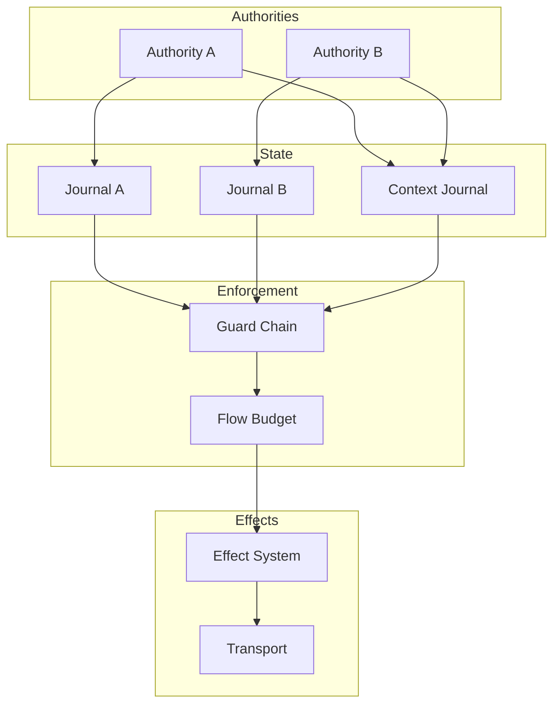
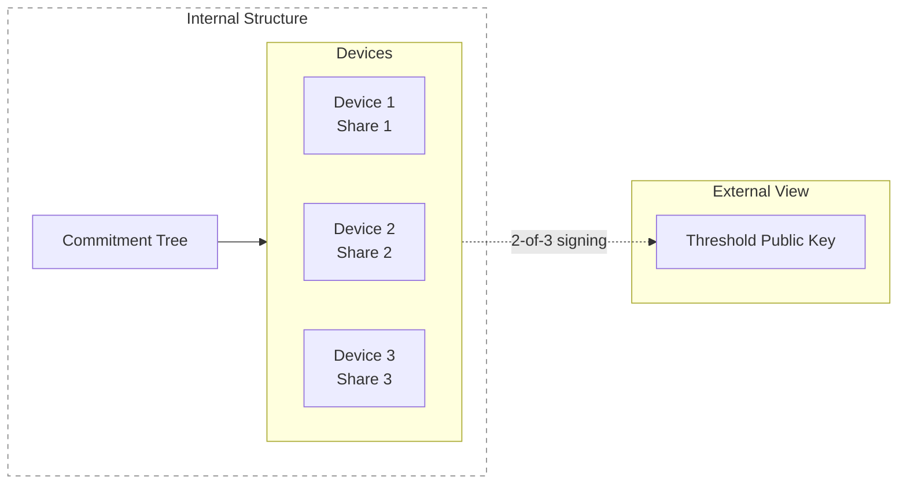
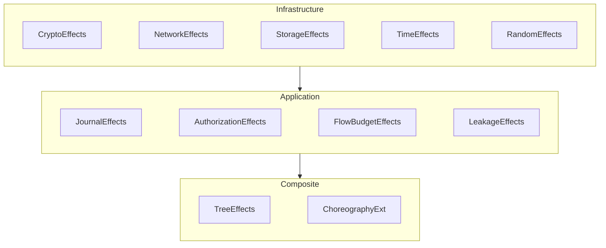

# System Architecture

This document gives an intuitive overview of Aura's architecture, covering core abstractions, information flow and component interactions. Formal definitions live in [Theoretical Model](002_theoretical_model.md). Crate organization are documented in [Project Structure](999_project_structure.md).

## Overview

Aura distributes identity and trust across devices and social relationships to enable private peer-to-peer communication.

The system is designed to operate without dedicated servers. Discovery, availability, and recovery are provided by the web of trust. Peers relay messages for one another based on social proximity. Without centralized routing, no single party can observe all traffic or deny service.


```mermaid
flowchart TB
    subgraph Authorities
        A1[Authority A]
        A2[Authority B]
    end

    subgraph State
        J1[Journal A]
        J2[Journal B]
        JC[Context Journal]
    end

    subgraph Enforcement
        GC[Guard Chain]
        FB[Flow Budget]
    end

    subgraph Effects
        EF[Effect System]
        TR[Transport]
    end

    A1 --> J1
    A2 --> J2
    A1 & A2 --> JC
    J1 & J2 & JC --> GC
    GC --> FB
    FB --> EF
    EF --> TR
```

This diagram shows the primary data flow. Authorities own journals that store facts. The guard chain enforces authorization before any transport effect. The effect system provides the abstraction layer for all operations.

Every operation flows through the effect system. Every state change is replicated through journals. Every external action is authorized through guards. These three invariants define the architectural contract.

## 1. State Model

### 1.1 Dual semilattice

Aura state consists of two complementary semilattices. Facts form a join-semilattice where information accumulates through the join operation. Capabilities form a meet-semilattice where authority restricts through the meet operation.

```rust
struct Journal {
    facts: FactSet,        // join-semilattice (⊔)
    frontier: CapFrontier, // meet-semilattice (⊓)
}
```

The `Journal` type keeps these dimensions separate. Facts can only grow. Capabilities can only shrink. This dual monotonicity provides convergence guarantees for replicated state.

Facts represent evidence that accumulates over time. Examples include signed operations, attestations, flow budget charges, and consensus commits. Once a fact is added, it cannot be removed. Garbage collection uses tombstones and reduction rather than deletion.

Capabilities represent authority that restricts over time. First-party
capability vocabulary is declared in typed families owned by the crates that
define the behavior. The system evaluates Biscuit tokens against policy to
derive the current capability frontier. Delegation can only attenuate. No
operation can widen capability scope. Token issuance is explicit, and guard
snapshots carry evaluated frontiers rather than declared capability families.
See [Theoretical Model](002_theoretical_model.md) for formal definitions of
these lattices.

### 1.2 Journals and namespaces

The journal is the canonical state mechanism. All durable state is represented as facts in journals. Views are derived by reducing accumulated facts.

Journals are partitioned into namespaces. Authority namespaces store facts owned by a single authority. Context namespaces store facts shared across authorities participating in a relational context. Facts in one namespace cannot reference or affect facts in another namespace. Cross-namespace coordination requires explicit protocols.

Facts are content-addressed immutable records. Each fact includes a type identifier, payload, attestation, and metadata. Facts accumulate through CRDT merge. Duplicate facts are deduplicated by content hash. Conflicting facts are resolved by type-specific merge rules.

Attestations prove that an authority endorsed the fact. Threshold signatures require multiple devices to attest. Single-device signatures are used for local facts. See [Journal](105_journal.md) for the complete specification.

### 1.3 State reduction

State reduction computes views from accumulated facts. Reducers are pure functions that transform fact sets into derived state. Reduction is deterministic and reproducible.

Reduction runs on demand or is cached for performance. Cached views are invalidated when new facts arrive. The reduction pipeline supports incremental updates for large fact sets. See [Journal](105_journal.md) for the reduction architecture.

### 1.4 Content addressing

All Aura artifacts are identified by the hash of their DAG-CBOR canonical encoding. Published digests are immutable. Journal merges and payload downloads verify digests before accepting data. See [Theoretical Model](002_theoretical_model.md) for the content addressing contract.

## 2. Identity and Trust

### 2.1 Authorities

An authority is an opaque cryptographic actor. External parties see only public keys and signed facts. Internal device structure is hidden. This abstraction provides unlinkability across contexts.


```mermaid
flowchart LR
    subgraph External View
        PK[Threshold Public Key]
    end

    subgraph Authority [Internal Structure]
        direction TB
        CT[Commitment Tree]
        subgraph Devices
            direction LR
            D1[Device 1<br/>Share 1]
            D2[Device 2<br/>Share 2]
            D3[Device 3<br/>Share 3]
        end
        CT --> Devices
    end

    Devices -.->|2-of-3 signing| PK

    style Authority fill:transparent,stroke:#888,stroke-dasharray: 5 5
```

Account authorities maintain device membership using commitment trees. The journal stores signed tree operations as facts. Reduction reconstructs the canonical tree state from accumulated facts. FROST provides the threshold signature scheme. DKG distributes key shares without a trusted dealer. Key rotation and resharing maintain security as devices join or leave. See [Cryptography](100_crypto.md) for threshold details.

### 2.2 Relational contexts

Relational contexts are shared journals for cross-authority state. Each context has its own namespace and does not reveal participants to external observers. Participation is expressed by writing relational facts. Profile data, nicknames, and relationship state live in context journals. See [Authority and Identity](102_authority_and_identity.md) for commitment tree details and [Relational Contexts](114_relational_contexts.md) for context patterns.

### 2.3 Contextual identity

Identity is scoped to contexts. A device can participate in many contexts without linking them. Each context derives independent keys through deterministic key derivation. This prevents cross-context correlation by external observers. See [Identifiers and Boundaries](101_identifiers_and_boundaries.md) for identifier semantics.

### 2.4 Social topology

Aura organizes social structure into three tiers. Messages are communication contexts for direct and group conversations. Homes are semi-public communities capped by storage constraints. Neighborhoods are collections of homes connected via 1-hop links.

The social topology shapes routing, relay selection, and governance. Authorities prefer relays operated by trusted peers within their home or neighborhood. Storage allocation is bounded per home, producing natural scarcity that scales with social investment. Local governance is encoded as capability-gated policy facts within each home's journal.

Access levels to a home follow the topology. Full access applies within the home. Partial access applies across 1-hop neighborhood links. Limited access applies at greater distances. See [Social Architecture](115_social_architecture.md) for the complete model.

## 3. Effects and Time

### 3.1 Effect system

Effect traits define async capabilities with explicit context. Handlers implement these traits for specific environments. The effect system provides the abstraction layer between application logic and runtime behavior.


```mermaid
flowchart TB
    subgraph L3["Composite"]
        direction LR
        TRE[TreeEffects] ~~~ CHE[ChoreographyExt]
    end

    subgraph L2["Application"]
        direction LR
        JE[JournalEffects] ~~~ AE[AuthorizationEffects] ~~~ FE[FlowBudgetEffects] ~~~ LE[LeakageEffects]
    end

    subgraph L1["Infrastructure"]
        direction LR
        CE[CryptoEffects] ~~~ NE[NetworkEffects] ~~~ SE[StorageEffects] ~~~ TE[TimeEffects] ~~~ RE[RandomEffects]
    end

    L1 --> L2 --> L3
```

Infrastructure effects wrap OS primitives including cryptography, networking, storage, time, and randomness. Application effects encode domain logic including journal operations, authorization, flow budgets, and leakage tracking. Composite effects combine lower layers for commitment tree operations and choreography execution.

Application code must not call system time, randomness, or IO directly. These operations must flow through effect traits. This constraint enables deterministic testing and simulation. See [Effect System](103_effect_system.md) for the full specification.

### 3.2 Time domains

The time system provides four domains for different use cases. `PhysicalClock` uses wall-clock time for cooldowns, receipts, and liveness. `LogicalClock` uses vector and Lamport clocks for causal ordering. `OrderClock` uses opaque tokens for deterministic ordering without temporal leakage. `Range` uses earliest and latest bounds for validity windows.

Time access happens exclusively through effect traits. Application code does not call system time directly. Cross-domain comparisons require explicit policy. See [Effect System](103_effect_system.md) for time domain details.

### 3.3 Context propagation

Every async call chain carries an `EffectContext` that identifies the authority, context, session, and execution mode. Guards access context to make authorization decisions. Handlers access context to route operations to the correct namespace. See [Effect System](103_effect_system.md) for the context model.

## 4. Authorization and Enforcement

### 4.1 Guard chain

All transport sends pass through a guard chain before any network effect. The chain enforces authorization, budget accounting, journal coupling, and leakage tracking in a fixed sequence:

`CapabilityGuard` → `FlowBudgetGuard` → `JournalCouplingGuard` → `LeakageTrackingGuard` → `TransportEffects`

Each guard must succeed before the next executes. Failure at any guard blocks the send. This order enforces the charge-before-send invariant. See [Authorization](106_authorization.md) for the full guard chain specification.

### 4.2 Capability model

Authorization uses Biscuit tokens with cryptographic attenuation. Capabilities can only be restricted, never expanded. Delegation chains are verifiable without contacting the issuer.

CapabilityGuard evaluates Biscuit tokens against required capabilities. It verifies that the sender has authority to perform the requested operation. Biscuit caveats can restrict scope, time, or target. See [Authorization](106_authorization.md) for token structure and evaluation.

### 4.3 Flow budgets and receipts

Flow budgets track message emission per context and peer. Only `spent` and `epoch` values are stored as facts. The `limit` is computed at runtime from capability evaluation through the meet-semilattice. This keeps replicated state minimal while enabling runtime limit computation.

FlowBudgetGuard charges budgets and emits receipts before each send. Budget charges are atomic with receipt generation. If `spent + cost > limit`, the send is blocked locally with no observable behavior. Epoch rotation resets counters through new epoch facts.

Receipts include context, sender, receiver, epoch, cost, and a hash chain link. The chain provides accountability for multi-hop message forwarding. Relays validate upstream receipts before forwarding and charge their own budgets before emitting. See [Transport and Information Flow](111_transport_and_information_flow.md) for receipt verification.

### 4.4 Context isolation and leakage tracking

Contexts provide information flow boundaries. Keys are derived per-context. Facts are scoped to namespaces. Cross-context flow requires explicit bridge protocols.

LeakageTrackingGuard records privacy budget usage per observer class. Observer classes include relationship, group, neighbor, and external. Operations that exceed leakage budgets are blocked. See [Privacy and Information Flow Contract](003_information_flow_contract.md) for the leakage model.

## 5. Protocols

### 5.1 Choreographic protocols

Choreographies define global protocols using multi-party session types. A
global type describes the entire protocol from an overview perspective. Each
message specifies sender, receiver, payload type, and guard annotations.

Annotations compile into guard chain requirements: `guard_capability` is the
canonical namespaced capability string admitted at the DSL boundary,
`flow_cost` specifies budget charges, `journal_facts` specifies facts to
commit, and `leak` specifies leakage budget allocation.

Projection extracts each role's local view from the global type. The local view specifies what messages the role sends and receives. Execution interprets the local view against the effect system. See [MPST and Choreography](110_mpst_and_choreography.md) for projection rules and the global type grammar.

### 5.2 Telltale VM

Production choreography execution uses the Telltale VM with a host bridge. Startup is manifest-driven and admitted by construction. Execution is bounded by deterministic step budgets derived from weighted measures of the local session type. The budget removes wall-clock coupling from safety enforcement and keeps bound checks replay-deterministic across native and WASM conformance lanes.

The VM supports canonical, hardening, and parity profiles. The canonical profile runs at concurrency 1 as the reference behavior. Hardening profiles test edge cases. Parity profiles compare native and WASM execution. See [MPST and Choreography](110_mpst_and_choreography.md) for runtime details.

### 5.3 Consensus and agreement

Aura Consensus provides single-shot agreement for non-monotone operations. Monotone operations use CRDT merge without consensus. Non-monotone operations such as key rotation, membership changes, and authoritative state transitions require consensus.

Operations are classified into categories A, B, and C. Category A uses CRDTs with immediate local effect. Category B shows pending state until agreement. Category C blocks until the consensus ceremony completes. See [Operation Categories](109_operation_categories.md) for classification rules.

The fast path completes in one round trip when witnesses agree on prestate. The fallback path activates when witnesses disagree or the initiator stalls. Bounded gossip propagates evidence until a quorum forms. Both paths yield the same `CommitFact` format.

`CommitFact` represents a consensus decision. It binds prestate hash, operation hash, participant set, threshold signature, and timestamp. CommitFacts are inserted into the relevant journal namespace. The prestate binding prevents reusing signatures across unrelated operations. Consensus failures fall back to gossip. Network partitions delay but do not corrupt state. See [Consensus](108_consensus.md) for protocol details.

### 5.4 Invitation lifecycle

Invitations establish new relationships. Contact invitations create direct messaging contexts. Channel invitations grant access to home channels. Guardian invitations bind recovery relationships.

Invitation creation is authorization-gated. Only the sender can cancel. Only the receiver can accept or decline. No invitation is resolved twice. Terminal states (accepted, declined, cancelled, expired) are immutable. Accepted invitations are backed by journal facts. Ceremony initiation is gated on acceptance. See [Relational Contexts](114_relational_contexts.md) for invitation patterns.

### 5.5 Recovery

Device recovery uses guardian protocols. Guardians hold encrypted recovery shares established through relational contexts. A threshold of guardians can restore account access by contributing their shares.

Recovery operates through the same consensus and session-type infrastructure as other protocols. The recovered authority retains its identity while rotating to new key material. See [Relational Contexts](114_relational_contexts.md) for recovery architecture.

## 6. Communication

### 6.1 Secure channels

`SecureChannel` provides encrypted, authenticated communication between two authorities. Channels use context-scoped keys derived through deterministic key derivation. Channel state is not stored in journals. Channels are established through rendezvous or direct connection. See [Rendezvous Architecture](113_rendezvous.md) for channel establishment.

### 6.2 Rendezvous

Rendezvous enables authorities to find each other without centralized directories. Rendezvous servers are untrusted relays that cannot read message content. Authorities publish encrypted envelopes that peers can retrieve. The social topology provides routing hints based on home and neighborhood membership. See [Rendezvous Architecture](113_rendezvous.md) for the full protocol.

### 6.3 Asynchronous messaging

AMP provides patterns for reliable asynchronous messaging. Messages may arrive out of order. Delivery may be delayed by offline peers. AMP handles acknowledgment, retry, and ordering. Channels support both synchronous request-response and asynchronous fire-and-forget patterns. See [Aura Messaging Protocol](112_amp.md) for details.

### 6.4 Anti-entropy

Journal state converges through anti-entropy after network partitions. Each peer periodically exchanges fact digests with its neighbors, identifies gaps, and selectively transfers missing facts. Because journals are CRDTs, merging facts from any peer is safe regardless of ordering. This process runs continuously in the background without coordination or agreement and ensures that connected peers eventually share the same fact set.

## 7. Runtime and Ownership

### 7.1 Ownership model

Aura uses four ownership categories to prevent multiple layers from co-owning the same semantic truth: `Pure` for reducers and validators, `MoveOwned` for handle and session transfer, `ActorOwned` for long-lived mutable runtime state, and `Observed` for projections and UI reads. Parity-critical mutation must be capability-gated. Parity-critical operations must terminate explicitly with typed success, failure, or cancellation. Errors are classified by recoverability and propagated through `Result` types. See [Ownership Model](122_ownership_model.md) for the full contract.

### 7.2 Structured concurrency

Actor-owned state is managed through a hierarchical task supervisor. Each service owns a rooted task group. Child tasks inherit cancellation from parents. Shutdown is hierarchical and parent-driven. All mutation of actor-owned state flows through bounded typed ingress rather than shared mutable access.

Session and endpoint transfer uses move-owned capabilities with monotone generation counters that reject stale access. Delegation atomically transfers the owner record and capability. This separation keeps supervision (who manages the lifecycle) distinct from session ownership (who may act on the state). See [Runtime](104_runtime.md) for the structured concurrency model.

### 7.3 Reactive state

The system uses reactive signals for state propagation. Journal fact changes flow through reducers to signals. Signals expose derived state to UI observers. The flow is unidirectional: facts are the source of truth, views are derived, and subscribers receive the latest state when they poll.

Subscription to an unregistered signal is a typed failure. Lagging subscribers may miss intermediate updates and resume from a newer snapshot. Reactive delivery is a transport for authoritative snapshots, not an alternate owner of semantic truth.

### 7.4 Workflow ownership

User-facing operations such as sending a message, accepting an invitation, or rotating a key are executed as workflows that progress through typed lifecycle phases to a terminal outcome. Each workflow has one authoritative lifecycle owner. Frontend and harness layers may submit commands and observe results, but they do not publish terminal truth. Ownership transfers through explicit handoff before the workflow begins awaited work. See [Ownership Model](122_ownership_model.md) for the semantic owner protocol.

## 8. Maintenance and Evolution

### 8.1 Snapshots and garbage collection

Snapshots bound storage size. A snapshot proposal announces a target epoch and a digest of the journal prefix. Devices verify the digest and contribute threshold signatures to complete the snapshot. Devices then prune facts and blobs whose epochs fall below the snapshot epoch. This pruning does not affect correctness because the snapshot represents a complete prefix.

### 8.2 OTA upgrades

OTA separates release distribution from activation. Release propagation is multi-directional and eventual. Activation is scope-bound and uses explicit epoch fences. Soft forks preserve compatibility. Hard forks require threshold-signed activation ceremonies scoped to the affected authority or context. See [Distributed Maintenance Architecture](116_maintenance.md) for the full upgrade model.

### 8.3 Epoch fencing

Epochs gate budget resets, receipt validity, and upgrade activation. Epoch rotation inserts a new epoch fact into the journal. All replicas treat an epoch change as effective once they observe it in the journal. This avoids hard clock synchronization requirements. Receipts are valid only within their epoch. Old epoch receipts cannot be replayed.

## References

- [Theoretical Model](002_theoretical_model.md): formal calculus and semilattice semantics
- [Privacy and Information Flow Contract](003_information_flow_contract.md): leakage budgets and privacy layers
- [Distributed Systems Contract](004_distributed_systems_contract.md): safety, liveness, and consistency guarantees
- [Cryptography](100_crypto.md): threshold signatures and key management
- [Identifiers and Boundaries](101_identifiers_and_boundaries.md): identifier semantics
- [Authority and Identity](102_authority_and_identity.md): commitment trees and relational contexts
- [Effect System](103_effect_system.md): effect traits and time domains
- [Runtime](104_runtime.md): lifecycle management and service composition
- [Journal](105_journal.md): fact storage and reduction
- [Authorization](106_authorization.md): guard chain and Biscuit integration
- [Consensus](108_consensus.md): single-shot agreement protocol
- [Operation Categories](109_operation_categories.md): A/B/C classification
- [MPST and Choreography](110_mpst_and_choreography.md): session types and projection
- [Transport and Information Flow](111_transport_and_information_flow.md): transport semantics
- [Aura Messaging Protocol](112_amp.md): reliable async messaging
- [Rendezvous Architecture](113_rendezvous.md): peer discovery and channel establishment
- [Relational Contexts](114_relational_contexts.md): cross-authority state and recovery
- [Social Architecture](115_social_architecture.md): homes, neighborhoods, and governance
- [Distributed Maintenance Architecture](116_maintenance.md): snapshots, GC, and OTA
- [Ownership Model](122_ownership_model.md): ownership categories and semantic owner protocol
- [Project Structure](999_project_structure.md): crate organization and dependency graph
