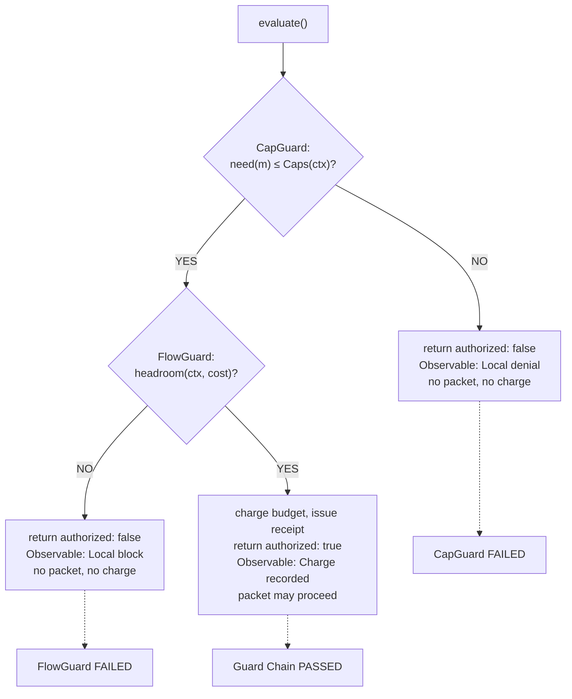
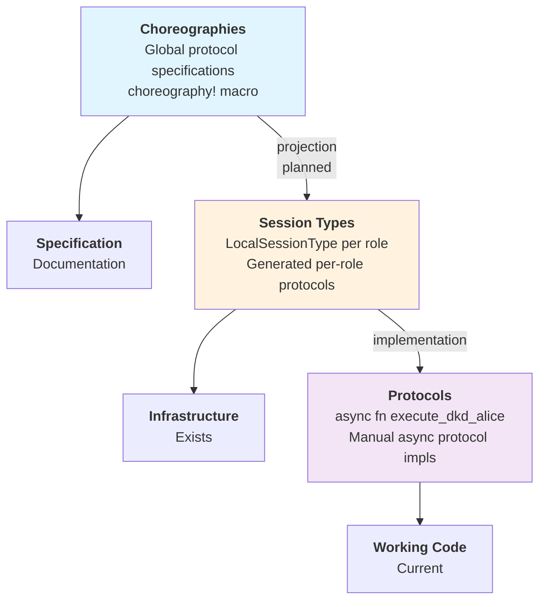
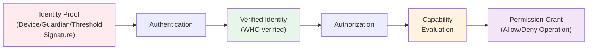

# Aura System Architecture

This document describes how to implement systems using Aura's theoretical foundations. It covers the effect system architecture, CRDT implementation patterns, choreographic protocol design, and crate organization principles.

## Overview

Aura's system architecture translates mathematical foundations into practical implementation patterns. Formal definitions live in [Aura Theoretical Foundations](001_theoretical_model.md).

1. Unified Effect System - Composable effect handlers with middleware support
2. CRDT Implementation Architecture - 4-layer system for conflict-free replication
3. Choreographic Protocol Design - Session-typed distributed coordination
4. Crate Organization - Clean dependency structure and separation of concerns

---

## Terminology & Layering

For all architectural terms and concepts, see the project glossary.

### Effect System Runtime Objects

The effect system uses these canonical names throughout the codebase:

- `AuraEffectSystem` - Main runtime façade for all effect operations
- `CompositeHandler` - Internal composition component within `AuraEffectSystem`
- `AuraHandler` - Unified trait interface for type-erased handlers

### Effect Trait Categories

Core Effect Traits provide foundational interfaces:
- `TimeEffects`, `CryptoEffects`, `StorageEffects`, `NetworkEffects`, `JournalEffects`, `ConsoleEffects`, `RandomEffects`

Extended Effect Traits provide higher-level interfaces:
- `SystemEffects`, `LedgerEffects`, `ChoreographicEffects`, `TreeEffects`, `AgentEffects`

### Data Layer Separation

- `Journal` - High-level CRDT state management
- `Ledger` - Low-level effect interface

See the journal system documentation for explanation of Journal vs Ledger architecture.

### Protocol Stack Layers

- Choreographies - Global protocol specifications executable via rumpsteak-aura bridge
- Session Types - Local projections of choreographies with complete infrastructure
- Protocols - Manual async implementations with choreographic integration

See Protocol Stack section below for detailed explanation.

### Auth/Authz Flow

- Authentication - Identity verification using `aura-verify` and `aura-authenticate`
- Authorization - Capability evaluation using `aura-wot`
- Integration - Clean composition via authorization bridge

See the authentication and authorization documentation for complete architecture details.

### Projection

Aura treats choreographies as the source of truth with working projection infrastructure and runtime bridge. `aura-mpst` provides choreography execution via rumpsteak projection with FlowBudget charges and leakage guards. The guard chain integrates with choreographic execution.

---

## 1. Unified Effect System Architecture

### 1.1 Core Principles

Aura uses a unified effect system architecture centered around the `AuraEffectSystem`.

Architecture Principles
- Unified - One effect system for all operations (choreography, agent, simulation)
- Middleware-Optional - Base system works directly, middleware adds enhancements when needed
- Context-Driven - Unified `AuraContext` flows through all operations
- Mode-Aware - Execution mode drives behavior (Testing, Production, Simulation)

### 1.2 Algebraic Effect Theory & Terminology

Aura uses algebraic effect terminology with strict separation between abstract interfaces and concrete implementations.

Effects define abstract capabilities as trait interfaces:
```rust
#[async_trait]
pub trait CryptoEffects {
    async fn blake3_hash(&self, data: &[u8]) -> [u8; 32];
}
```
Effect traits specify operations without implementation details. Multiple handlers can implement the same trait with different behaviors.

Effect Handlers provide concrete implementations:
```rust
pub struct RealCryptoHandler;
impl CryptoEffects for RealCryptoHandler {
    async fn blake3_hash(&self, data: &[u8]) -> [u8; 32] {
        blake3::hash(data).into()
    }
}
```
Handlers contain the actual business logic. Different handlers enable testing, production, and simulation modes.

Middleware wraps handlers with cross-cutting concerns:
```rust
pub struct RetryMiddleware<H> { inner: H, max_attempts: u32 }
```
Middleware implements effect traits by delegating to inner handlers with additional behavior like retry logic or metrics.

### 1.3 Layered Effect Architecture

The effect system is organized into 8 clean architectural layers with zero circular dependencies:

**1. Interface Layer (`aura-core`)**:
- Effect trait definitions only: `CryptoEffects`, `NetworkEffects`, `StorageEffects`, `TimeEffects`, `JournalEffects`, `ConsoleEffects`, `RandomEffects`
- Domain types: `DeviceId`, `AccountId`, `FlowBudget`, etc.
- Single source of truth for all effect interfaces
- Dependencies: Only `serde`, `uuid`, `thiserror`, `chrono` - no other Aura crates

**2. Specification Layer (Domain Crates + `aura-mpst`)**:
- Domain-specific types and semantics (`aura-crypto`, `aura-journal`, `aura-wot`, `aura-store`)
- MPST choreography specifications and session type extensions (`aura-mpst`)
- Domain logic and CRDT implementations (no effect handlers)

**3. Implementation Layer (`aura-effects`)** - The Standard Library:
- Context-free, stateless effect handlers that work in ANY execution context
- Mock handlers: `MockCryptoHandler`, `MockNetworkHandler`, `MemoryStorageHandler`
- Real handlers: `RealCryptoHandler`, `TcpNetworkHandler`, `FilesystemStorageHandler`
- Testing and production variants for each effect type
- Dependencies: `aura-core` + external libraries (tokio, blake3, etc.)
- What belongs here: Stateless, single-party, context-free operations
- What does NOT belong: Coordination, multi-handler composition, choreographic bridging

**4. Orchestration Layer (`aura-protocol`)**:
- Multi-party coordination primitives: `AuraHandlerAdapter`, `CompositeHandler`, `CrdtCoordinator`
- Stateful coordination: guard chains, middleware stacks, choreographic bridges
- Protocol-specific effect traits: `TreeEffects`, `LedgerEffects`, `ChoreographicEffects`, `SystemEffects`
- Reusable distributed protocols: anti-entropy, snapshot, threshold ceremony
- Enhanced handlers with coordination features: `EnhancedTimeHandler`, `GuardedJournalHandler`

**5. Feature/Protocol Layer (`aura-frost`, `aura-invitation`, `aura-recovery`)**:
- Complete end-to-end protocol implementations
- Feature-specific choreographies and business logic
- Not basic handlers, not complete applications - reusable protocol building blocks

**6. Runtime Composition Layer (`aura-agent`, `aura-simulator`)**:
- Assembles effect handlers and protocols into working agent runtimes
- **Important**: These are LIBRARIES, not binaries - they provide runtime APIs
- `aura-agent`: Production runtime composition
- `aura-simulator`: Deterministic testing runtime with controlled effects

**7. User Interface Layer (`aura-cli`, `app-console`, `app-wasm`)**:
- Binaries with `main()` entry points - what users actually run
- Drive the agent runtime from UI layer
- `aura-cli`: Terminal interface
- `app-console`: Web UI (planned)
- `app-wasm`: WebAssembly bindings for browser (planned)

**8. Testing/Tools Layer (`aura-testkit`, `aura-quint-api`)**:
- Cross-cutting test utilities and shared fixtures
- Formal verification integration

**Architectural Benefits**:
- Zero circular dependencies - clean unidirectional flow
- Standard library (`aura-effects`) for effect implementations
- Clear distinction: basic implementations vs coordination vs applications
- Easy testing with comprehensive mock handlers
- Obvious where new code belongs using the decision matrix (see Work Plan 013)

### 1.4 Session Type Algebra Integration

The unified effect system integrates with Aura's session type algebra for choreographic programming:

```mermaid
graph TD
    A[Session Type Algebra (Global Protocol)] --> B{Projection};
    B --> C[Local Session Types (Per-Role Protocols)];
    C --> D{Execution via Effect Interpreter Interface};
    D --> E[Effect Algebra (CryptoEffects, NetworkEffects, etc.)];
    E --> F[Interpretation by Handler Implementations];
```

Static Path generates direct effect calls from choreographies:
```rust
choreography! {
    protocol P2PDkd {
        roles: Alice, Bob;
        Alice -> Bob: Hello;
    }
}
```
The macro generates compile-time session types that map directly to effect system operations.

Dynamic Path interprets session types at runtime:
```rust
let Roles(mut alice, mut bob) = setup();
rumpsteak_aura::try_session(&mut alice, |session| async move {
    execute_alice_role(session, &effect_system).await
}).await?
```
Runtime interpretation provides flexibility for complex protocols that cannot be statically compiled.

### 1.5 SecureChannel Abstraction

Protocols that complete a rendezvous or recovery handshake return a `SecureChannel`. This abstraction:

- Wraps a QUIC connection plus metadata `(context, peer_device, epoch, channel_id)`
- Is managed by the transport layer so higher-level protocols obtain channels via `TransportEffects`
- Enforces a single active channel per `(context, peer_device)` and tears it down when FlowBudget reservations or epochs change

Lifecycle and invariants:
- Single active channel per `(ContextId, peer_device)`.
- Channel teardown on: `epoch(ctx)` rotation, capability shrink that invalidates `need(message) ≤ Caps(ctx)`, or context invalidation.
- Reconnect behavior: re-run rendezvous; budget reservations and receipts do not carry across epochs.
- Receipt scope: per-hop receipts are bound to `(ctx, src, dst, epoch)` and are never reused across channels or epochs.

See the rendezvous documentation for full lifecycle details.

### 1.6 Guard Chain and Predicate

All transport side effects must pass the following guard chain, in order:

1. CapGuard - authorization: `need(message) ≤ Caps(ctx)`
2. FlowGuard - budgeting: `headroom(ctx, cost)` (charge-before-send)
3. JournalCoupler - atomic commit of attested facts on success

Observable behavior:
- If CapGuard fails: deny locally, no packet emitted.
- If FlowGuard fails: block locally, no packet emitted (no observable without charge).
- If JournalCoupler fails: do not emit; the commit and send are coupled.

Definitions:
- `headroom(ctx, cost)` succeeds iff charging `(ctx, peer)` by `cost` in the current `epoch(ctx)` keeps `spent ≤ limit` and yields a signed receipt bound to the epoch.

See [Aura Theoretical Foundations](001_theoretical_model.md) for the formal contract and information flow model documentation for receipt and epoch details.

#### SendGuard Implementation

The guard chain is implemented by `SendGuardChain` in `crates/aura-protocol/src/guards/send_guard.rs`. This struct encapsulates the complete predicate evaluation:

```rust
pub struct SendGuardChain {
    message_capability: Capability,
    peer: DeviceId,
    cost: u32,
    context: ContextId,
    operation_id: Option<String>,
}
```

The evaluation proceeds through three phases:

Phase 1: Capability Guard evaluates `need(m) ≤ Caps(ctx)` by constructing a ProtocolGuard with the required capability and evaluating it against the effective capability set. If this check fails, the guard chain returns immediately with authorization denied and no flow budget charged.

Phase 2: Flow Guard evaluates `headroom(ctx, cost)` by checking whether the flow budget for the context-peer pair can accommodate the cost. If headroom is sufficient, the budget is charged and a signed receipt is issued. If this check fails, authorization is denied and no packet is emitted.

Phase 3: Result Assembly collects metrics including capability evaluation time, flow evaluation time, total time, and the number of capabilities checked. The result includes the authorization decision, the receipt if successful, and a human-readable denial reason if authorization failed.

Decision tree for guard failures:



The guard chain enforces three critical invariants:

Charge-Before-Send: The flow budget must be successfully charged before any transport send operation occurs. This ensures that no observable behavior happens without accounting.

No-Observable-Without-Charge: If flow budget charging fails, no send operation is performed. The denial is local and produces no network traffic.

Capability-Gated: All sends require the appropriate message capability. Missing capabilities result in immediate denial without attempting flow budget operations.

Usage pattern in protocol implementations:

```rust
let guard = create_send_guard(
    Capability::send_message(),
    context_id,
    peer_device,
    100,
).with_operation_id("frost_signing_round_1");

let result = guard.evaluate(&effect_system).await?;
if result.authorized {
    transport.send_with_receipt(message, result.receipt.unwrap()).await?;
} else {
    return Err(AuraError::permission_denied(&result.denial_reason.unwrap()));
}
```

The SendGuardChain provides convenience methods for common patterns. The `is_send_authorized` method returns a boolean authorization decision. The `authorize_send` method returns the receipt on success or an error on failure.

#### JournalCoupler Implementation

The JournalCoupler sits at the final stage of the guard chain and ensures that protocol operations atomically update the distributed journal state using CRDT operations. The implementation is in `crates/aura-protocol/src/guards/journal_coupler.rs`.

The complete guard chain flow:

```
CapGuard → FlowGuard → JournalCoupler → Protocol Execution
    ↓         ↓            ↓                    ↓
Check     Check       Apply journal      Execute with
caps      budget      deltas atomically  full context
```

The JournalCoupler coordinates two execution modes:

Pessimistic Mode: Execute the protocol operation first, then apply journal annotations only after the operation succeeds. This ensures that failed operations do not modify journal state. Journal updates are guaranteed to be consistent with successful protocol outcomes.

Optimistic Mode: Apply journal annotations first, then execute the protocol operation. This mode follows CRDT semantics where operations are monotonic. Even if the protocol operation fails after journal updates, the journal changes are considered committed and do not require rollback.

The coupling operation has three phases:

Phase 1 applies journal annotations according to the execution mode. In optimistic mode, annotations are applied before protocol execution. In pessimistic mode, annotations are applied after successful execution.

Phase 2 executes the protocol operation using the provided closure. The operation receives the effect system and may use any available effects.

Phase 3 assembles the result including the protocol return value, list of applied journal operations, updated journal state, and coupling metrics such as application time and retry attempts.

Journal operations are categorized into four types:

MergeFacts applies join-semilattice operations to add facts to the journal. This corresponds to knowledge accumulation where facts can only grow monotonically.

RefineCapabilities applies meet-semilattice operations to refine capabilities. This corresponds to authority restriction where capabilities can only shrink monotonically.

GeneralMerge applies both facts and capabilities in a single operation. This provides atomic updates to both journal components.

CustomOperation allows application-specific journal operations that may have custom semantics beyond the standard CRDT operations.

The journal coupler provides retry logic for transient failures. If a journal operation fails, it is retried up to a configured maximum number of attempts with exponential backoff. This handles temporary failures in distributed journal operations without requiring manual retry logic in protocol implementations.

Usage pattern with guard chain integration:

```rust
let mut coupler = JournalCoupler::new();
coupler.add_annotation(
    "frost_round_1".to_string(),
    JournalAnnotation::add_facts("FROST commitment recorded"),
);

let result = coupler.execute_with_coupling(
    "frost_round_1",
    &mut effect_system,
    |effects| async move {
        let commitment = compute_frost_commitment().await?;
        effects.broadcast_commitment(commitment).await?;
        Ok(commitment)
    }
).await?;

assert!(result.coupling_metrics.coupling_successful);
```

The JournalCoupler ensures that protocol operations maintain consistency between in-memory state and distributed journal state. When a protocol operation modifies shared state, the corresponding journal annotations ensure that all participants eventually observe the same state transitions through CRDT merge operations.

### 1.7 Hybrid Typed/Type-Erased Architecture

Aura uses a hybrid architecture that provides both typed effect traits and type-erased handlers:

Two Parallel APIs
1. Typed Effect Traits - For performance-critical code and hot paths
2. Type-Erased `dyn AuraHandler` - For dynamic composition and middleware

| Pattern | API | Overhead | Use Case |
|---------|-----|----------|----------|
| Direct typed traits | `handler.random_bytes(32)` | 0ns - Zero overhead | Hot loops, performance-critical |
| Type-erased → typed | `boxed.random_bytes(32)` | ~200ns - Serialization | Dynamic composition |
| Type-erased direct | `execute_effect(...)` | ~200ns - Serialization | Runtime effect selection |

#### AuraHandler Trait & Typed Bridge

The type-erased side is formalized in `crates/aura-protocol/src/handlers/erased.rs` as the `AuraHandler` trait. Concrete handlers (for testing, production, simulation) implement this trait, and `crates/aura-protocol/src/handlers/typed_bridge.rs` provides blanket implementations of every effect trait for `Arc<RwLock<Box<dyn AuraHandler>>>`. That bridge is what lets you call `CryptoEffects`/`NetworkEffects` on a type-erased handler without rewriting effect-specific glue. If you need to inspect or extend the dispatch surface, start with those two files.

Decision rule:
- Use typed traits directly on hot paths (zero overhead).
- Use `dyn AuraHandler` when you need middleware stacking, dynamic composition, or late binding.

Umbrella surface:
- Prefer an `AuraEffects` umbrella trait (re-exporting the core effect traits) in new code to keep call sites uniform. The typed bridge provides a blanket impl for `Arc<RwLock<Box<dyn AuraHandler>>>`.

### 1.8 Middleware Architecture

Middleware provides optional cross-cutting enhancements without affecting core protocols:
```rust
let with_retry = RetryMiddleware::new(base_handler, 3);
```
This wrapper provides retry functionality for transient failures. Common middleware includes retry logic, metrics collection, distributed tracing, and circuit breakers.

Operational guardrails (defaults):
- Retry: exponential backoff with jitter, ceiling 3 attempts; deterministic in simulation via seeded RNG.
- Circuit breaker: open after 5 consecutive failures for 30s (per peer/channel); half‑open probes respect FlowBudget.
- Metrics/observability: count denials for CapGuard/FlowGuard locally; do not export raw context identifiers.

### 1.9 Context Management

Context flows through handlers as internal state:
```rust
let handler = AuraEffectSystem::for_production(device_id)?;
let bytes = handler.random_bytes(32).await;
```

`AuraContext` enforces privacy isolation by preventing cross-context communication. Each handler instance owns context state including relationship IDs, DKD namespaces, and leakage counters. Messages are blocked unless sender and receiver contexts match.

### 1.10 Execution Modes

Effect systems support three execution modes:
```rust
let test_system = AuraEffectSystem::for_testing(device_id);
let prod_system = AuraEffectSystem::for_production(device_id)?;
let sim_system = AuraEffectSystem::for_simulation(device_id, 42);
```
Testing mode provides deterministic behavior. Production mode uses real implementations. Simulation mode enables controlled fault injection with seeded randomness.

### 1.11 Flow Budget Enforcement

Flow budgets prevent spam while maintaining privacy. Each context-peer pair has a `FlowBudget` with limit and spent counters stored in the journal. Transport effects check budgets before sending messages. Choreographies annotate operations with flow costs that are charged against available budgets.

Canonical type:
```
FlowBudget { limit: u64, spent: u64, epoch: Epoch }
```
Invariants: charge-before-send; no observable without charge; deterministic replenishment per epoch (see `docs/004_info_flow_model.md`). Cover traffic is explicitly deferred in 1.0; see `docs/004_info_flow_model.md` §Cover Traffic Strategy.

---

## 2. CRDT Implementation Architecture

### 2.1 4-Layer Architecture

Aura's CRDT system implements a **4-layer architecture** that separates:

1. **Semantic Foundation** - Core CRDT traits and message type definitions
2. **Effect Interpretation** - Composable handlers that enforce CRDT laws
3. **Choreographic Protocols** - Session-type communication patterns
4. **Application CRDTs** - Domain-specific implementations

### 2.2 File Organization

The CRDT architecture spans four layers:

**Foundation Layer** (`aura-core/src/semilattice/`) provides core traits (`JoinSemilattice`, `MeetSemiLattice`, `CvState`, `MvState`) and message types (`StateMsg<S>`, `MeetStateMsg<S>`, `OpWithCtx<Op,Ctx>`). Property-based tests validate algebraic laws.

**Effect Interpreter Layer** (`aura-protocol/src/effects/semilattice/`) implements coordination handlers for CRDT types: `CrdtCoordinator` orchestrates multiple CRDT handler types. The basic CRDT handlers themselves are provided by `aura-effects`. Delivery effects (`CausalBroadcast`, `AtLeastOnce`) manage message ordering and reliability in the orchestration layer.

**Choreographic Protocol Layer** (`aura-protocol/src/choreography/`) defines anti-entropy, snapshot, threshold, and tree coordination protocols. The runtime module provides `AuraHandlerAdapter` for testing, production, and simulation scaffolding.

**Application Semilattice Layer** (`aura-journal/src/semilattice/`) implements domain-specific CRDT types (`JournalMap`, `AccountState`, `DeviceRegistry`, `CapabilitySet`). Operation logs support replay and recovery.

Projection and runtime glue connecting these layers lives in `crates/aura-mpst/src/runtime.rs` and `crates/aura-protocol/src/handlers/rumpsteak_handler.rs`.

### 2.3 Generic Handlers

Generic handlers enforce CRDT laws through typed interfaces:

**CvRDT Handler** manages state-based CRDTs:
```rust
pub struct CvHandler<S: CvState> { pub state: S }
impl<S: CvState> CvHandler<S> {
    pub fn on_recv(&mut self, msg: StateMsg<S>) {
        self.state = self.state.join(&msg.0);
    }
}
```
State-based handlers merge incoming states using join operations that preserve CRDT convergence properties.

**Delta Handler** processes incremental updates:
```rust
pub struct DeltaHandler<S: CvState, D: Delta> {
    pub state: S,
    pub inbox: Vec<D>
}
```
Delta handlers batch updates for efficiency while maintaining causal consistency through ordering constraints.

**Operation Handler** applies operations with causal ordering:
```rust
pub struct CmHandler<S, Op, Id, Ctx> { pub state: S }
```
Operation-based handlers apply operations in causal order while preventing duplicate application through deduplication tracking.

### 2.3.1 Causal Context Implementation

The causal context system in aura-core/src/causal_context.rs provides vector clock based causal ordering for operation-based CRDTs. This ensures that operations are delivered in an order consistent with their causal dependencies, preventing anomalies from out-of-order delivery.

The VectorClock type implements standard vector clock semantics for tracking causality. Each actor maintains a logical clock value that increments with each local operation. The vector clock stores clock values for all known actors using a BTreeMap indexed by ActorId (which is DeviceId). The happens_before method implements the standard partial order where clock A happens before clock B if all entries in A are less than or equal to corresponding entries in B and at least one entry is strictly less. The concurrent_with method identifies concurrent operations that have no causal relationship. The update method merges two vector clocks by taking the maximum value for each actor, implementing the standard vector clock merge operation.

The CausalContext type extends vector clocks with explicit dependency tracking for fine-grained causal ordering. Each context contains a vector clock representing the causal time when the operation was created, a set of explicit operation dependencies that must be satisfied before delivery, and the actor identifier for the operation creator. The after constructor creates a new context that causally follows a previous context by cloning its vector clock and incrementing the actor's entry. The with_dependency method allows operations to declare explicit dependencies on prior operations beyond the vector clock's implicit causality.

The is_ready method determines whether an operation can be safely delivered given the current state. Readiness requires two conditions to hold. First, all explicit dependencies in the dependencies set must have been delivered and applied, verified through a caller-provided predicate. Second, the vector clock dependencies must be satisfied, meaning the current replica clock must dominate all entries in the operation's clock except for the sender's entry. This exception for the sender allows pipelining where a sender can emit multiple operations without waiting for acknowledgments, while still maintaining causal order from the receiver's perspective.

The CmHandler integrates with CausalContext through operation buffering and reordering. When an operation arrives with a CausalContext that is not yet ready, the handler places it in a pending queue. As operations are delivered and the current vector clock advances, the handler repeatedly checks pending operations for readiness. Once an operation becomes ready, it is removed from the pending queue and applied to the CRDT state. This buffering mechanism allows operations to arrive in any order while guaranteeing that application order respects causality.

The OperationId type provides stable identifiers for tracking dependencies. Each operation ID combines an actor identifier with a sequence number, creating a totally ordered set within each actor's operation stream. Operations can reference other operations by ID in their dependency sets, creating an explicit happens-before relation that complements the vector clock's implicit causality. This explicit dependency mechanism handles cases where vector clocks alone would permit premature delivery, such as when operations on different objects have semantic dependencies not captured by device-level causality.

### 2.3.2 CRDT Coordinator Implementation

The CRDT coordinator in aura-protocol/src/effects/semilattice/crdt_coordinator.rs provides unified choreographic access to all four CRDT handler types. This coordinator enables distributed protocols to synchronize state across CvRDT (state-based), CmRDT (operation-based), Delta-CRDT (delta-based), and MvRDT (meet-based) semantics through a single interface.

The coordinator uses an ergonomic builder pattern for setup. Applications can use convenience methods for common cases or chain multiple handlers for complex scenarios:

```rust
// Simple case: Convergent CRDT with initial state
let coordinator = CrdtCoordinator::with_cv_state(device_id, journal_state);

// Delta CRDT with compaction threshold
let coordinator = CrdtCoordinator::with_delta_threshold(device_id, 100);

// Multiple handlers chained together
let coordinator = CrdtCoordinator::new(device_id)
    .with_cv_handler(CvHandler::new())
    .with_delta_handler(DeltaHandler::with_threshold(50));
```

This selective registration avoids instantiating unused handler types while providing type-safe access to registered handlers. The coordinator tracks a device identifier and vector clock for causal ordering across all handler types.

Handler selection routes synchronization requests to the appropriate CRDT handler based on type tags. When a sync request arrives, the coordinator examines the CrdtType enum to determine whether the request targets convergent, commutative, delta, or meet handlers. The coordinator then delegates to the appropriate handler's merge or apply methods while maintaining causal consistency through vector clock updates. This routing logic centralizes CRDT type dispatch while preserving the distinct semantics of each handler type.

Synchronization proceeds through request-response cycles managed by the coordinator. The handle_sync_request method processes incoming synchronization requests by extracting the current state or operation log from the appropriate handler, serializing it using serde, and packaging it in a CrdtSyncResponse. The handle_sync_response method processes responses by deserializing the payload, validating the CRDT type matches expectations, and merging the received state or applying the received operations through the appropriate handler. Vector clocks are merged during both request and response handling to maintain causal consistency across replicas.

Integration with choreographic protocols occurs through the anti-entropy protocol types. The coordinator consumes CrdtSyncRequest and produces CrdtSyncResponse messages that the anti-entropy choreography exchanges between participants. This tight integration allows choreographies to synchronize CRDT state without knowledge of the specific CRDT types or handler implementations, treating synchronization as an abstract message exchange with the coordinator handling all type-specific logic internally.

### 2.4 Delivery Effects

```rust
// Delivery/order effects used alongside SessionSend/Recv
pub enum DeliveryEffect {
    CausalBroadcast { topic: TopicId },  // ensures happens-before delivery
    AtLeastOnce    { topic: TopicId },   // retries; dedup in handler
    GossipTick     { topic: TopicId },   // drive periodic exchange
    ExchangeDigest,                      // trigger repair subprotocol
}
```

Programs combine delivery effects with session operations for complete protocol execution:
```rust
let prog = Program::new()
    .choose("issue")
    .send(peer_id, op_message)
    .parallel(concurrent_sends)
    .end();
```
This creates atomic protocol sequences that maintain causal consistency across all participants.

---

## 3. Rumpsteak-Aura Choreographic System

### 3.1 System Overview

Rumpsteak-Aura is Aura's choreographic programming system. It enables writing distributed protocols as global specifications that automatically compile to local implementations for each participant.

The system translates global protocol descriptions into session-typed Rust code. This prevents communication errors like deadlocks while enabling optimization through asynchronous subtyping.

### 3.2 Architecture Components

**DSL Parser** converts choreographic syntax into Abstract Syntax Trees:
```rust
choreography! {
    PingPong {
        roles: Alice, Bob
        Alice -> Bob: Ping
        Bob -> Alice: Pong
    }
}
```
The parser validates role declarations and builds protocol trees from the textual specification.

**Projection Engine** transforms global protocols into local session types:
```rust
// Alice's projected view
LocalType::Send { to: Bob, message: Ping,
    continuation: LocalType::Receive { from: Bob, message: Pong, ... }
}
```
Each participant receives their specific protocol view without global coordination requirements.

**Code Generation** produces type-safe Rust implementations:
```rust
type Alice_Protocol = Send<Bob, Ping, Receive<Bob, Pong, End>>;
```
Generated session types enforce protocol compliance at compile time through the Rust type system.

**Effect Handler Bridge** connects session types to Aura's effect system:
```rust
pub trait ChoreoHandler {
    type Role;
    type Endpoint;
    async fn send<M>(&mut self, ep: &mut Self::Endpoint, to: Self::Role, msg: &M) -> Result<()>;
    async fn recv<M>(&mut self, ep: &mut Self::Endpoint, from: Self::Role) -> Result<M>;
}
```
Handlers implement protocol execution using different transport mechanisms while maintaining the same choreographic interface.

### 3.3 Integration with Aura Effects

Rumpsteak-Aura integrates with Aura's unified effect system through handler adapters. Choreographic operations map to effect system calls:

```rust
// Choreographic send operation
handler.send(&mut endpoint, role, &message).await?

// Maps to effect system
effects.network().send_message(peer_id, serialized_message).await?
```
The adapter layer handles serialization, context management, and capability checking.

Capability Guards ensure messages can only be sent when proper authorization exists. The guard condition `need(message) ≤ caps(context)` is verified before each send operation.

Journal Coupling automatically updates replicated state during protocol execution. State changes are atomic with message emission.

Leakage Budgets track privacy costs with annotations specifying external, neighbor, and group leakage limits.

### 3.3.1 AuraHandlerAdapter Implementation

The AuraHandlerAdapter provides the concrete bridge between choreographic session types and the Aura effect system. This adapter lives in aura-protocol/src/choreography/aura_handler_adapter.rs and serves as the primary integration point for executing rumpsteak-generated protocols.

The adapter maintains several key pieces of state to enable choreographic execution. The `device_id` field identifies the local participant executing the protocol. The `role_mapping` table converts choreographic role names like Alice or Bob into concrete DeviceId values representing physical devices in the network. The `flow_contexts` map associates each peer device with a ContextId governing budget and capability rules for that communication channel. The `guard_profiles` registry stores SendGuardProfile configurations for specific message types, specifying required capabilities, leakage budgets, delta facts for journal updates, and flow costs. The `default_guard` provides fallback settings when no message-specific profile exists.

The adapter exposes methods for protocol execution structured around the send and receive primitives. The send method accepts a target DeviceId and serializable message, retrieves the appropriate guard profile for the message type, configures FlowBudget enforcement using the flow context for the target peer, and invokes the full guard chain before delegating to NetworkEffects for actual transmission. The `recv_from` method accepts a sender DeviceId, uses NetworkEffects to retrieve the message bytes, and deserializes them into the expected message type with proper error handling. Both methods integrate with tracing for observability during protocol execution.

The adapter provides configuration methods to set up choreographic execution contexts. The `add_role_mapping` method registers the DeviceId for a given choreographic role name, enabling the adapter to resolve symbolic role references to concrete network endpoints. The `set_flow_context_for_peer` method associates a specific ContextId with a peer device, determining which budget and capability rules apply to communication with that peer. The `register_message_guard` method allows protocols to specify custom guard profiles for particular message types, controlling capabilities, flow costs, and journal coupling behavior on a per-message basis.

The adapter supports multiple execution modes through the ExecutionMode parameter during construction. Testing mode uses in-memory handlers with deterministic behavior for unit tests. Production mode connects to real network transports and persistent storage. Simulation mode enables fault injection and controlled non-determinism for property testing. The AuraHandlerAdapterFactory provides convenient constructors for each mode while hiding internal effect system setup details.

The adapter integrates with the complete guard chain through its send implementation. For each outgoing message, the adapter constructs a ProtocolGuard with the required capabilities from the message guard profile. It sets the FlowHint on the effect system to inform FlowGuard of the expected cost and context. The effect system then executes the full CapGuard to FlowGuard to JournalCoupler pipeline before allowing the message to reach the network layer. This ensures that every choreographic send operation respects capability constraints, budget limits, and journal consistency requirements without requiring explicit guard invocations in protocol code.

Receipt tracking provides cryptographic proof of budget charges for multi-hop scenarios. The adapter exposes a `latest_receipt` method that returns the Receipt generated by the most recent FlowGuard execution. Protocols can attach these receipts to relay messages, allowing downstream hops to verify that upstream participants properly charged their budgets. The receipt contains the context, source and destination devices, epoch, cost, and a signature binding all fields together, preventing budget inflation through receipt forgery or replay.

### 3.4 Runtime Execution Modes

**In-Memory Handler** provides fast testing with deterministic message delivery through in-process channels.

**Production Handler** implements network communication using QUIC connections and WebSocket fallbacks for real deployment scenarios.

**Simulation Handler** enables controlled testing with configurable fault injection including delays, message drops, and Byzantine failures.

---

## 4. Protocol Stack Architecture

### 4.1 Three-Layer Protocol Stack

Aura's protocol layer implements a three-tier architecture that separates global specifications from local implementations:



### 4.2 Protocol Stack Components

**Choreographies** - Global protocol specifications using `choreography!` macro:
- **Location**: [`crates/aura-protocol/src/choreography/protocols/`](../crates/aura-protocol/src/choreography/protocols/)
- **Example**: [`crates/aura-protocol/src/choreography/protocols/anti_entropy.rs`](../crates/aura-protocol/src/choreography/protocols/anti_entropy.rs)

**Session Types** - Local projections of choreographies:
- **Infrastructure**: [`crates/aura-mpst/`](../crates/aura-mpst/) provides complete MPST extensions
- **Runtime**: [`crates/aura-protocol/src/choreography/runtime/`](../crates/aura-protocol/src/choreography/runtime/)
- **Features**: Capability guards, journal coupling, leakage budgets

**Protocols** - Hybrid manual and choreographic implementations:
- **Pattern**: Effect-based implementations with guard chain enforcement

### 4.3 Protocol Implementation Patterns

Protocols can be implemented either as choreographies for specification clarity or as manual async implementations for flexibility. Both patterns integrate fully with the guard chain:

```rust
// Choreographic protocol specification
choreography! {
    protocol AntiEntropy {
        roles: Alice, Bob;
        Alice -> Bob: StateSync(delta) with_guards(cap_guard, flow_guard);
        Bob -> Alice: AckSync(receipt) with_journal_coupling;
    }
}

// Manual protocol implementation
async fn threshold_signing(effects: &AuraEffectSystem) -> Result<FrostResult> {
    // Implementation with guard chain enforcement
}
```

Both approaches produce the same observable behavior and integrate identically with the effect system.

### 4.4 MPST Extensions Integration

The session type infrastructure includes Aura-specific extensions:

**Capability Guards** verify authorization before message transmission. The condition `need(message) ≤ caps(context)` ensures proper permissions exist.

**Journal Coupling** atomically updates CRDT state with message emission. This prevents state divergence during protocol execution.

**Leakage Budgets** track privacy costs per operation with fine-grained external, neighbor, and group leakage accounting.

### 4.5 Effect System Integration

Choreographic protocols execute through the unified effect system for operations like message transmission, journal updates, and signature verification. This provides testability through mock effects, deterministic simulation, and clean protocol composition.

---

## 5. Authentication vs Authorization Flow

### 5.1 Architecture Overview

Aura maintains strict separation between authentication (WHO) and authorization (WHAT) while providing clean integration patterns. This separation enables independent testing, flexible policy evolution, and clear security boundaries.

**Authentication Layer**:
- **aura-verify** ([`crates/aura-verify/`](../crates/aura-verify/)) - Pure cryptographic identity verification
- **aura-authenticate** ([`crates/aura-authenticate/`](../crates/aura-authenticate/)) - Choreographic authentication protocols

**Authorization Layer**:
- **aura-wot** ([`crates/aura-wot/`](../crates/aura-wot/)) - Capability-based access control using meet-semilattice operations

**Integration Layer**:
- **authorization_bridge** ([`crates/aura-protocol/src/authorization_bridge.rs`](../crates/aura-protocol/src/authorization_bridge.rs)) - Clean composition without coupling

### 5.2 Data Flow Architecture



**Linear Data Flow**:
1. **Input**: `IdentityProof` (device signature, guardian signature, or threshold signature)
2. **AuthorizationContext**: evaluated capabilities for the active `ContextId`
3. **Predicate at send sites**: `need(m) ≤ Caps(ctx) ∧ headroom(ctx, cost)`

`AuthorizationContext` flows through sessions/effects so that each send site can evaluate the same predicate uniformly. Cap failures or headroom failures are handled locally with no network observable.
4. **Authentication**: `aura-verify::verify_identity_proof()` → `VerifiedIdentity`
5. **Authorization**: `aura-wot::evaluate_authorization()` → `PermissionGrant`
6. **Integration**: `authorization_bridge::authenticate_and_authorize()` orchestrates both layers

### 5.3 Effect System Integration

The auth/authz layers integrate seamlessly with Aura's unified effect system:

**Agent-Level Effects** ([`crates/aura-agent/src/handlers/auth.rs`](../crates/aura-agent/src/handlers/auth.rs)):
```rust
#[async_trait]
pub trait AuthenticationEffects: Send + Sync {
    async fn authenticate_device(&self) -> Result<AuthenticationResult>;
    async fn is_authenticated(&self) -> Result<bool>;
    async fn get_session_ticket(&self) -> Result<Option<SessionTicket>>;
}
```

**Protocol-Level Effects** (coordination layer in `aura-protocol`):
```rust
#[async_trait]
pub trait AgentEffects: Send + Sync {
    async fn verify_capability(&self, capability: &[u8]) -> Result<bool>;
    async fn evaluate_tree_operation(&self, op: &TreeOp) -> Result<PermissionGrant>;
    async fn authorize_operation(&self, request: AuthorizedOperationRequest) -> Result<PermissionGrant>;
}
```

### 5.4 Formal Properties

**Meet-Semilattice Capability Operations**:
- **Associativity**: `a.meet(b.meet(c)) == a.meet(b).meet(c)`
- **Commutativity**: `a.meet(b) == b.meet(a)`
- **Idempotence**: `a.meet(a) == a`
- **Monotonicity**: Capabilities can only be refined (reduced), never expanded

**Zero Coupling Guarantee**:
- Authentication layers never import authorization code
- Authorization layers never import authentication code
- Bridge orchestrates both through well-defined interfaces
- Each layer is independently testable with mocks

### 5.5 Implementation Details

See [`docs/101_auth_authz.md`](101_auth_authz.md) for complete architectural details and usage patterns.

---

## 6. Choreographic Protocol Design

### 6.1 Free Algebra Property

Choreographies expand into the `Program<R, M>` free algebra with effects for message passing, choice, parallelism, and control flow:

```rust
pub enum Effect<R, M> {
    Send { to: R, msg: M },
    Recv { from: R, msg_type: &'static str },
    Choose { at: R, label: Label },
    Parallel { programs: Vec<Program<R, M>> },
    End,
}
```

The polymorphic interpreter walks the AST and dispatches operations to AuraEffectSystem via handlers.

### 6.2 Algebraic Operators

**Sequential Composition** chains operations through continuation fields in protocol definitions or explicit sequencing in program algebra.

**Parallel Composition** executes multiple protocols concurrently using the `Parallel` effect with independent program branches.

**Choice Operations** enable branching protocols where one role selects from multiple options and other roles adapt accordingly.

### 6.3 Usage Patterns

**Choreographic Protocols** execute through the unified effect system for operations like threshold ceremonies and session management.

**Session Type Protocols** provide runtime validation through the MPST system with automatic role projection and type checking.

### 6.4 Capability-Guarded Transitions

MPST extensions include capability guards that verify `need(message) ≤ caps(context)` before allowing message transmission. The runtime enforces authorization through meet-semilattice capability checks.

### 6.5 Journal-Coupled Transitions

Protocol messages can trigger replicated state changes through journal coupling. The handler computes state deltas, applies them locally, then transmits the message atomically.

### 6.6 Leakage Budgets

Privacy budgets track external, neighbor, and group leakage costs per protocol transition. Handler policies enforce aggregate leakage thresholds through traffic shaping and padding decisions.

---

## 7. Crate Organization and Dependencies

### 7.1 Crate Hierarchy

The workspace uses layered dependencies from foundation types through domain logic to runtime composition. Core types flow upward through the effect system to choreographic coordination and finally to business logic crates and runtime composition.

### 7.2 Architectural Layers

**Interface Layer (`aura-core`)** provides core identifiers, effect trait definitions, and error handling - zero implementations.

**Implementation Layer (`aura-effects`)** provides standard effect handler implementations that work in any execution context - stateless, single-party operations.

**Specification Layer (Domain Crates)** contains domain-specific types and algorithms while implementing `aura-core` traits for their types.

**Orchestration Layer (`aura-protocol`)** implements multi-party coordination primitives, guard chains, and stateful choreographic bridges.

**Runtime Composition Layer (`aura-agent`, `aura-simulator`)** assembles handlers and protocols into complete working systems - libraries that applications use.

**User Interface Layer (`aura-cli`)** provides applications with main entry points that drive the runtime composition layer.

### 7.3 Crate Boundary Rules

**Interface Layer (`aura-core`)** contains only trait definitions and foundational types - zero implementations.

**Implementation Layer (`aura-effects`)** contains only context-free, stateless effect implementations - zero coordination logic.

**Orchestration Layer (`aura-protocol`)** contains only multi-party coordination and stateful composition - zero basic effect implementations.

**Runtime Composition** assembles components into working systems - libraries with APIs, not main entry points.

**User Interface** provides main entry points and drives runtime libraries - applications that users actually run.

### 7.4 Anti-Patterns to Avoid

**Duplicating Effect Traits** creates incompatible interfaces across crates and breaks composition.

**Effect Handler Duplication** violates separation of concerns when domain crates implement system-level handlers.

**Effect Handlers in Business Logic** breaks architectural boundaries. Domain crates should consume effects through dependency injection.

### 7.5 Crate Roles in Effect System Architecture

**Interface Definition (`aura-core`)** defines what operations exist through trait definitions - the vocabulary of capabilities.

**Standard Implementation (`aura-effects`)** provides how to do individual operations through context-free handlers - the standard library of implementations.

**Orchestration (`aura-protocol`)** provides how to coordinate operations across parties or handlers through stateful composition - the coordination primitives.

**Runtime Composition (`aura-agent`)** provides how to assemble components into working systems - the runtime libraries that applications use.

**Applications (`aura-cli`)** provide what users actually run - the main entry points that instantiate and drive runtime systems.

---

## 8. Implementation Guidelines

### 8.1 Creating Custom Middleware

Custom middleware wraps handlers to add cross-cutting functionality through macro-generated trait implementations that delegate to inner handlers.

### 8.2 Direct System Access

Production handlers implement real system operations and may bypass linting restrictions for legitimate system calls in controlled contexts.

### 8.3 Usage Patterns

**Correct Import Patterns**:
```rust
// Import effect traits from aura-core
use aura_core::effects::CryptoEffects;

// Import implementations from aura-effects
use aura_effects::crypto::RealCryptoHandler;

// Import coordination primitives from aura-protocol
use aura_protocol::handlers::CompositeHandler;

// Runtime composition from aura-agent
use aura_agent::AuraAgent;
```

**CRDT Integration** combines foundation types with effect handlers to provide composable semilattices with type safety and automatic conflict resolution.

## See Also

- `001_theoretical_foundations.md` - Mathematical foundations and formal model
- `003_distributed_applications.md` - Concrete applications and examples
- `000_overview.md` - Overall project architecture and goals
