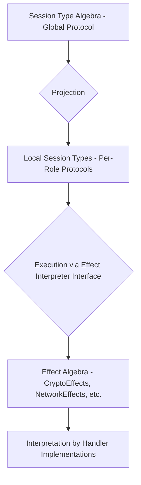
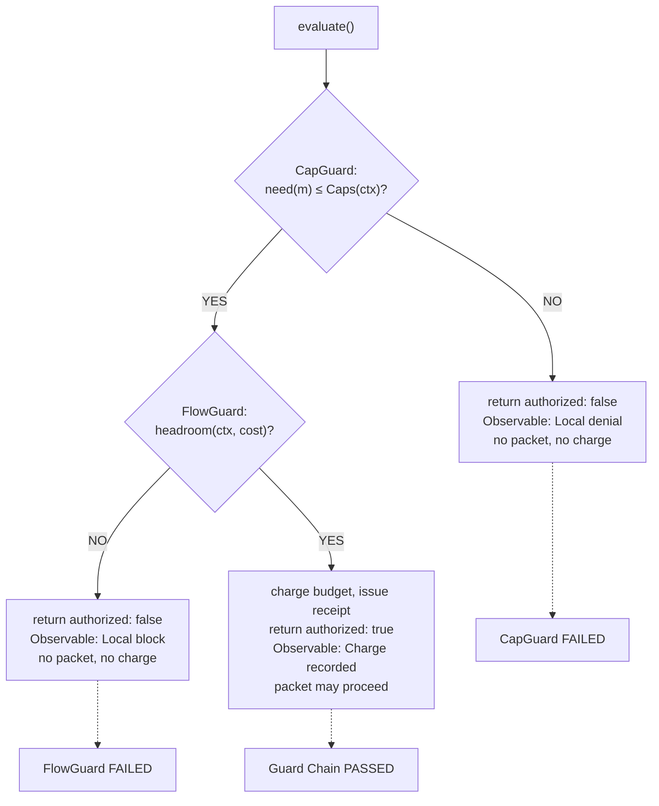
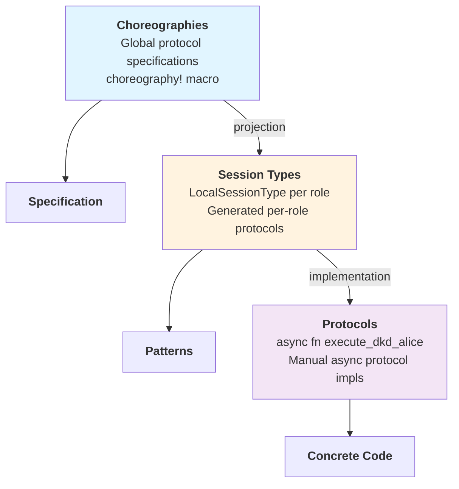
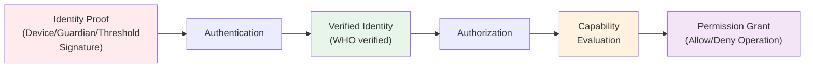

# Aura System Architecture

This document describes Aura's system architecture and implementation patterns. It covers the stateless effect system, CRDT implementation patterns, choreographic protocol design, and crate organization principles.

## Overview

Aura's system architecture implements mathematical foundations through practical patterns that eliminate deadlocks and ensure distributed system correctness. Formal definitions live in [Aura Theoretical Foundations](001_theoretical_model.md).

The architecture consists of four integrated systems. The stateless effect system provides deadlock-free execution through isolated state services. The CRDT implementation architecture offers conflict-free replication across four abstraction layers. The choreographic protocol system enables session-typed distributed coordination with compile-time safety. Crate organization maintains clean dependency structure with zero circular dependencies.

## Terminology & Layering

For all architectural terms and concepts, see the project glossary.

### Effect System Runtime Objects

The effect system uses these canonical names throughout the codebase:

- `EffectExecutor` - Stateless effect execution engine that dispatches to handlers
- `ContextManager` - Isolated service managing device contexts
- `FlowBudgetManager` - Isolated service managing flow budgets per context-peer pair
- `ReceiptManager` - Isolated service managing receipt chains
- `AuraEffectSystem` - Coordinator that orchestrates the above services
- `AuraHandler` - Unified trait interface for type-erased handlers

### Effect Trait Categories

Core Effect Traits provide foundational interfaces:
- `TimeEffects`, `CryptoEffects`, `StorageEffects`, `NetworkEffects`, `JournalEffects`, `ConsoleEffects`, `RandomEffects`

Extended Effect Traits provide higher-level interfaces:
- `SystemEffects`, `LedgerEffects`, `ChoreographicEffects`, `TreeEffects`, `AgentEffects`

### Data Layer Separation

- `Journal` - High-level CRDT state management
- `Ledger` - Low-level effect interface

See the journal system documentation for explanation of Journal vs Ledger architecture.

### Protocol Stack Layers

- Choreographies - Global protocol specifications executable via aura-choreography bridge
- Session Types - Local projections of choreographies with complete infrastructure
- Protocols - Manual async implementations with choreographic integration

See Protocol Stack section below for detailed explanation.

### Auth/Authz Flow

- Authentication - Identity verification using `aura-verify` and `aura-authenticate`
- Authorization - Capability evaluation using `aura-wot`
- Integration - Clean composition via authorization bridge

See the authentication and authorization documentation for complete architecture details.

### Projection

Aura treats choreographies as the source of truth using rumpsteak-aura's projection infrastructure. `aura-macros` parses choreographic protocols using `parse_choreography_str` and generates local session types using rumpsteak-aura's projection algorithms. `aura-mpst` provides the `AuraHandler` implementation of `ChoreoHandler` that executes protocols through rumpsteak-aura's interpreter. The guard chain integrates seamlessly with choreographic execution through extension effects registered in the `ExtensionRegistry`.

## 1. Async Effect System Architecture

### 1.1 Core Principles

Aura implements an async-first effect system designed for concurrent execution in both native and WASM environments. The architecture eliminates deadlocks through explicit context propagation and isolated state services.

**Key Design Principles:**
- **Async-Native Execution** - All effect operations are async, enabling natural concurrency
- **Explicit Context Propagation** - Context flows through operations as parameters, not ambient state
- **Builder Pattern Initialization** - Flexible handler composition with async initialization
- **WASM Compatibility** - No OS threads or system calls, works in browser environments
- **Lifecycle Management** - Explicit initialization and shutdown phases with health monitoring

### 1.2 Algebraic Effect Theory & Terminology

Aura uses algebraic effect terminology with strict separation between abstract interfaces and concrete implementations.

Effects define abstract capabilities as trait interfaces:
```rust
#[async_trait]
pub trait CryptoEffects {
    async fn hash(&self, data: &[u8]) -> [u8; 32];
    async fn hmac(&self, key: &[u8], data: &[u8]) -> [u8; 32];
}
```
Effect traits specify operations without implementation details. Multiple handlers can implement the same trait with different behaviors.

**Note on Hashing**: Pure cryptographic hashing (SHA-256) is NOT part of the effects system because it's deterministic and has no side effects. Instead, use the synchronous `aura_core::hash::{hash, hasher}` functions directly for all hashing operations.

Effect Handlers provide concrete implementations:
```rust
pub struct RealCryptoHandler;
impl CryptoEffects for RealCryptoHandler {
    async fn hash(&self, data: &[u8]) -> [u8; 32] {
        // Effects-based hashing for testing/mocking
        aura_core::hash::hash(data)
    }
    
    async fn hmac(&self, key: &[u8], data: &[u8]) -> [u8; 32] {
        // HMAC implementation
    }
}
```
Handlers contain the actual business logic. Different handlers enable testing, production, and simulation modes.

Cross-cutting concerns are implemented as explicit effect traits:
```rust
#[async_trait]
pub trait ReliabilityEffects {
    async fn with_retry<T>(&self, ctx: &EffectContext, operation: impl Fn() -> Result<T>) -> Result<T>;
}
```
Cross-cutting concerns use explicit dependency injection rather than wrapper patterns, maintaining clear separation between effect interfaces and their implementations.

### 1.3 Layered Effect Architecture

The effect system is organized into 8 clean architectural layers:

**Layer 1 - Interface** (`aura-core`) contains effect trait definitions only. This includes `CryptoEffects`, `NetworkEffects`, `StorageEffects`, `TimeEffects`, `JournalEffects`, `ConsoleEffects`, and `RandomEffects`. Domain types like `DeviceId`, `AccountId`, and `FlowBudget` live here. This layer serves as the single source of truth for all effect interfaces. Dependencies include only `serde`, `uuid`, `thiserror`, and `chrono` with no other Aura crates.

**Layer 2 - Specification** includes domain crates and `aura-mpst`. Domain-specific types and semantics exist in `aura-journal`, `aura-wot`, and `aura-store`. MPST choreography specifications and session type extensions live in `aura-mpst`. The `aura-macros` crate provides choreographic DSL parsing that wraps rumpsteak-aura's parser with Aura-specific extension effects. The `aura-mpst` crate implements `ChoreoHandler` and `ExtensibleHandler` traits for rumpsteak-aura integration. This layer contains domain logic and CRDT implementations but no effect handlers.

**Layer 3 - Implementation** (`aura-effects`) functions as the standard library. It provides context-free, stateless effect handlers that work in any execution context. Mock handlers include `MockCryptoHandler`, `MockNetworkHandler`, and `MemoryStorageHandler`. Real handlers include `RealCryptoHandler`, `TcpNetworkHandler`, and `FilesystemStorageHandler`. Testing and production variants exist for each effect type. Dependencies include `aura-core` plus external libraries like tokio and blake3. This layer contains stateless, single-party, context-free operations. It excludes coordination, multi-handler composition, and choreographic bridging.

**Layer 4 - Orchestration** (`aura-protocol`) provides multi-party coordination primitives. These include `AuraHandlerAdapter`, `CompositeHandler`, and `CrdtCoordinator`. Stateful coordination encompasses guard chains, cross-cutting effect implementations, and choreographic bridges. Protocol-specific effect traits include `TreeEffects`, `LedgerEffects`, `ChoreographicEffects`, and `SystemEffects`. Reusable distributed protocols cover anti-entropy, snapshot, and threshold ceremony. Enhanced handlers with coordination features include `EnhancedTimeHandler` and `GuardedJournalHandler`.

**Layer 5 - Feature/Protocol** (`aura-frost`, `aura-invitation`, `aura-recovery`) contains complete end-to-end protocol implementations. Feature-specific choreographies and business logic reside here. These components serve as reusable protocol building blocks, not basic handlers or complete applications.

**Layer 6 - Runtime Composition** (`aura-agent`, `aura-simulator`) assembles effect handlers and protocols into working agent runtimes. These are libraries, not binaries. They provide runtime APIs. `aura-agent` handles production runtime composition. `aura-simulator` manages deterministic testing runtime with controlled effects.

**Layer 7 - User Interface** (`aura-cli`, `app-console`, `app-wasm`) contains binaries with `main()` entry points. Users actually run these components. They drive the agent runtime from the UI layer. `aura-cli` provides terminal interface. `app-console` offers web UI (planned). `app-wasm` provides WebAssembly bindings for browser (planned).

**Layer 8 - Testing/Tools** (`aura-testkit`, `aura-quint-api`) provides cross-cutting test utilities and shared fixtures. Formal verification integration lives here.

#### Where does my code go?

Use this decision matrix to classify code and determine the correct crate:

| Code Pattern | Layer | Rationale | Example |
|--------------|-------|-----------|---------|
| Implements single effect trait method | `aura-effects` | Stateless, single operation, context-free | `CryptoEffects::sign()` → signature |
| Coordinates multiple effects/handlers | `aura-protocol` | Stateful composition, multi-handler orchestration | `AuraHandlerAdapter`, `CompositeHandler` |
| Multi-party coordination logic | `aura-protocol` | Distributed state, choreographic execution | `execute_anti_entropy()`, `consensus()` |
| Reusable protocol building block | `aura-protocol` | Coordination primitive used across applications | Anti-entropy, consensus, snapshot protocols |
| Application-specific protocol | Application crate | End-to-end functionality, user-facing | FROST ceremony in `aura-frost` |

Use these questions to classify borderline cases:

1. **Is it stateless or stateful?** Stateless → `aura-effects`, Stateful → `aura-protocol`
2. **Does it work for one party or multiple parties?** Single-party → `aura-effects`, Multi-party → `aura-protocol`
3. **Is it context-free or context-specific?** Context-free → `aura-effects`, Context-specific → `aura-protocol`
4. **Does it coordinate multiple handlers?** No → `aura-effects`, Yes → `aura-protocol`

The architecture provides several benefits. The standard library (`aura-effects`) handles effect implementations. Clear distinction exists between basic implementations, coordination, and applications. Easy testing uses comprehensive mock handlers. The location for new code is obvious using the decision matrix.

### 1.4 Async Architecture Components

The effect system uses modern async patterns for concurrent execution without deadlocks.

#### Effect System Builder

The `AuraEffectSystemBuilder` enables flexible initialization:

```rust
pub struct AuraEffectSystemBuilder {
    config: EffectSystemConfig,
    handlers: HashMap<TypeId, Arc<dyn Any + Send + Sync>>,
    container: Option<EffectContainer>,
}

impl AuraEffectSystemBuilder {
    pub fn new() -> Self {
        Self::default()
    }
    
    pub fn with_handler<T: 'static>(
        mut self, 
        handler: Arc<T>
    ) -> Self {
        self.handlers.insert(TypeId::of::<T>(), handler);
        self
    }
    
    pub async fn build(self) -> Result<AuraEffectSystem> {
        // Parallel initialization for performance
        let init_tasks = self.handlers.values()
            .map(|h| h.initialize())
            .collect::<Vec<_>>();
        
        futures::future::join_all(init_tasks).await;
        
        Ok(AuraEffectSystem { 
            handlers: self.handlers,
            lifecycle: LifecycleManager::new(),
        })
    }
}
```

#### Context Propagation System

Explicit context flows through all operations:

```rust
// Context propagates explicitly, no ambient state
#[derive(Clone, Debug)]
pub struct EffectContext {
    pub request_id: Uuid,
    pub device_id: DeviceId,
    pub flow_budget: FlowBudget,
    pub trace_context: TraceContext,
    pub deadline: Option<Instant>,
    pub metadata: HashMap<String, String>,
}

// Context-aware effect traits
#[async_trait]
pub trait ContextualNetworkEffects {
    async fn send_with_context(
        &self,
        ctx: &EffectContext,
        envelope: Envelope,
    ) -> Result<Receipt>;
}

// Task-local propagation for async operations
tokio::task_local! {
    static EFFECT_CONTEXT: EffectContext;
}

// Scoped context execution
pub async fn with_context<F, R>(ctx: EffectContext, f: F) -> R 
where
    F: Future<Output = R>,
{
    EFFECT_CONTEXT.scope(ctx, f).await
}
```

#### Lifecycle Management

The effect system manages initialization and shutdown explicitly:

```rust
pub struct LifecycleManager {
    state: Arc<AtomicU8>,  // EffectSystemState as u8
    components: Arc<RwLock<Vec<Arc<dyn LifecycleAware>>>>,
    start_time: Instant,
}

impl LifecycleManager {
    pub async fn initialize(&self) -> Result<()> {
        self.transition_to(EffectSystemState::Initializing)?;
        
        // Initialize components in registration order
        let components = self.components.read().await;
        for component in components.iter() {
            component.on_initialize().await?;
        }
        
        self.transition_to(EffectSystemState::Ready)?;
        Ok(())
    }
    
    pub async fn shutdown(&self) -> Result<()> {
        self.transition_to(EffectSystemState::ShuttingDown)?;
        
        // Shutdown in reverse order
        let components = self.components.read().await;
        for component in components.iter().rev() {
            component.on_shutdown().await?;
        }
        
        self.transition_to(EffectSystemState::Shutdown)?;
        Ok(())
    }
}
```

**Lifecycle States:**
- Uninitialized → Initializing → Ready → ShuttingDown → Shutdown
- Health checks monitor component status
- Graceful degradation on component failures
- Metrics track initialization and execution performance

### 1.5 Session Type Algebra Integration

The unified effect system integrates with Aura's session type algebra for choreographic programming.



The static path generates direct effect calls from choreographies. The macro converts choreographic specifications into compile-time session types that map directly to effect system operations. This approach provides zero-overhead execution for statically analyzable protocols.

```rust
choreography! {
    #[namespace = "p2p_dkd"]
    protocol P2PDkd {
        roles: Alice, Bob;
        Alice[guard_capability = "send_hello", flow_cost = 10] -> Bob: Hello(message: String);
    }
}
```

The dynamic path interprets session types at runtime. This approach provides flexibility for complex protocols that cannot be statically compiled. Runtime interpretation enables protocol composition and dynamic role assignment.

```rust
let Roles(mut alice, mut bob) = setup();
aura_choreography::try_session(&mut alice, |session| async move {
    execute_alice_role(session, &effect_system).await
}).await?
```

### 1.6 SecureChannel Abstraction

Protocols that complete a rendezvous or recovery handshake return a `SecureChannel`. This abstraction wraps a QUIC connection plus metadata including context, peer device, epoch, and channel ID. The transport layer manages channels so higher-level protocols obtain channels via `TransportEffects`. The system enforces a single active channel per context and peer device pair. Channels are torn down when FlowBudget reservations or epochs change.

The lifecycle maintains specific invariants. A single active channel exists per `ContextId` and peer device pair. Channel teardown occurs on `epoch(ctx)` rotation, capability shrink that invalidates `need(message) ≤ Caps(ctx)`, or context invalidation. Reconnect behavior requires re-running rendezvous. Budget reservations and receipts do not carry across epochs. Receipt scope binds per-hop receipts to context, source, destination, and epoch. Receipts are never reused across channels or epochs.

See the rendezvous documentation for full lifecycle details.

### 1.7 Guard Chain and Predicate

All transport side effects must pass the guard chain in order. CapGuard provides authorization by checking `need(message) ≤ Caps(ctx)`. FlowGuard handles budgeting through `headroom(ctx, cost)` with charge-before-send semantics. JournalCoupler ensures atomic commit of attested facts on success.

The observable behavior varies by failure type. CapGuard failure results in local denial with no packet emitted. FlowGuard failure causes local blocking with no packet emitted and no observable behavior without charge. JournalCoupler failure prevents emission since commit and send are coupled.

The `headroom(ctx, cost)` function succeeds when charging context and peer by cost in the current epoch keeps spent at or below limit. Success yields a signed receipt bound to the epoch.

See [Aura Theoretical Foundations](001_theoretical_model.md) for the formal contract and [Privacy and Information Flow](003_information_flow.md) for receipt and epoch details.

#### SendGuard Implementation

The guard chain is implemented by `SendGuardChain` in `crates/aura-protocol/src/guards/send_guard.rs`. This struct encapsulates the complete predicate evaluation:

```rust
pub struct SendGuardChain {
    message_capability: Capability,
    peer: DeviceId,
    cost: u32,
    context: ContextId,
    operation_id: Option<String>,
}
```

The evaluation proceeds through three phases:

**Phase 1:** Capability Guard evaluates `need(m) ≤ Caps(ctx)` by constructing a ProtocolGuard with the required capability and evaluating it against the effective capability set. If this check fails, the guard chain returns immediately with authorization denied and no flow budget charged.

**Phase 2:** Flow Guard evaluates `headroom(ctx, cost)` by checking whether the flow budget for the context-peer pair can accommodate the cost. If headroom is sufficient, the budget is charged and a signed receipt is issued. If this check fails, authorization is denied and no packet is emitted.

**Phase 3:** Result Assembly collects metrics including capability evaluation time, flow evaluation time, total time, and the number of capabilities checked. The result includes the authorization decision, the receipt if successful, and a human-readable denial reason if authorization failed.



The guard chain enforces three critical invariants. Charge-Before-Send requires flow budget charging before any transport send operation. This ensures no observable behavior occurs without accounting. No-Observable-Without-Charge prevents send operations when flow budget charging fails. The denial remains local and produces no network traffic. Capability-Gated requires appropriate message capability for all sends. Missing capabilities trigger immediate denial without attempting flow budget operations.

```rust
let guard = create_send_guard(
    Capability::send_message(),
    context_id,
    peer_device,
    100,
).with_operation_id("frost_signing_round_1");

let result = guard.evaluate(&effect_system).await?;
if result.authorized {
    transport.send_with_receipt(message, result.receipt.unwrap()).await?;
} else {
    return Err(AuraError::permission_denied(&result.denial_reason.unwrap()));
}
```

Protocol implementations use this pattern for guard chain integration. The `SendGuardChain` provides convenience methods for common patterns. The `is_send_authorized` method returns a boolean authorization decision. The `authorize_send` method returns the receipt on success or an error on failure.

#### JournalCoupler Implementation

The JournalCoupler sits at the final stage of the guard chain and ensures that protocol operations atomically update the distributed journal state using CRDT operations. The implementation is in `crates/aura-protocol/src/guards/journal_coupler.rs`.

The complete guard chain flow:

```
CapGuard → FlowGuard → JournalCoupler → Protocol Execution
    ↓         ↓            ↓                    ↓
Check     Check       Apply journal      Execute with
caps      budget      deltas atomically  full context
```

The JournalCoupler coordinates two execution modes:

**Pessimistic Mode:** Execute the protocol operation first, then apply journal annotations only after the operation succeeds. This ensures that failed operations do not modify journal state. Journal updates are guaranteed to be consistent with successful protocol outcomes.

**Optimistic Mode:** Apply journal annotations first, then execute the protocol operation. This mode follows CRDT semantics where operations are monotonic. Even if the protocol operation fails after journal updates, the journal changes are considered committed and do not require rollback.

The coupling operation has three phases:

**Phase 1** applies journal annotations according to the execution mode. In optimistic mode, annotations are applied before protocol execution. In pessimistic mode, annotations are applied after successful execution.

**Phase 2** executes the protocol operation using the provided closure. The operation receives the effect system and may use any available effects.

**Phase 3** assembles the result including the protocol return value, list of applied journal operations, updated journal state, and coupling metrics such as application time and retry attempts.

Journal operations are categorized into four types:

`MergeFacts` applies join-semilattice operations to add facts to the journal. This corresponds to knowledge accumulation where facts can only grow monotonically.

`RefineCapabilities` applies meet-semilattice operations to refine capabilities. This corresponds to authority restriction where capabilities can only shrink monotonically.

`GeneralMerge` applies both facts and capabilities in a single operation. This provides atomic updates to both journal components.

`CustomOperation` allows application-specific journal operations that may have custom semantics beyond the standard CRDT operations.

The journal coupler provides retry logic for transient failures. If a journal operation fails, it is retried up to a configured maximum number of attempts with exponential backoff. This handles temporary failures in distributed journal operations without requiring manual retry logic in protocol implementations.

Usage pattern with guard chain integration:

```rust
let mut coupler = JournalCoupler::new();
coupler.add_annotation(
    "frost_round_1".to_string(),
    JournalAnnotation::add_facts("FROST commitment recorded"),
);

let result = coupler.execute_with_coupling(
    "frost_round_1",
    &mut effect_system,
    |effects| async move {
        let commitment = compute_frost_commitment().await?;
        effects.broadcast_commitment(commitment).await?;
        Ok(commitment)
    }
).await?;

assert!(result.coupling_metrics.coupling_successful);
```

The JournalCoupler ensures that protocol operations maintain consistency between in-memory state and distributed journal state. When a protocol operation modifies shared state, the corresponding journal annotations ensure that all participants eventually observe the same state transitions through CRDT merge operations.

### 1.8 Handler Architecture

The effect system provides both typed traits and type-erased handlers through a unified dispatch mechanism.

| Pattern | API | Use Case |
|---------|-----|----------|
| Direct typed traits | `effects.random_bytes(32).await` | Performance-critical paths |
| Type-erased dispatch | `executor.execute(EffectType::Random, "bytes", &[32]).await` | Dynamic composition |
| Configuration-driven | `AuraEffectSystem::new(config)` | Runtime handler selection |

#### Handler Adapters

Handler adapters bridge between `aura-effects` implementations and the stateless executor:

```rust
// Adapter wraps stateless handlers for the executor
pub struct CryptoHandlerAdapter {
    handler: Arc<dyn CryptoEffects>,
    mode: ExecutionMode,
}

impl AuraHandler for CryptoHandlerAdapter {
    async fn execute(
        &self, 
        operation: &str, 
        params: &[u8], 
        context: &AuraContext
    ) -> Result<Vec<u8>, AuraHandlerError> {
        match operation {
            "hash" => {
                let data = bincode::deserialize(params)?;
                let hash = self.handler.hash(data).await;
                Ok(bincode::serialize(&hash)?)
            }
            "hmac" => {
                let (key, data) = bincode::deserialize(params)?;
                let mac = self.handler.hmac(key, data).await;
                Ok(bincode::serialize(&mac)?)
            }
            _ => Err(AuraHandlerError::UnsupportedOperation)
        }
    }
}
```

The adapter layer enables mode-specific handler selection while maintaining uniform dispatch through the stateless executor.

### 1.9 Cross-Cutting Effect Architecture

Cross-cutting concerns are implemented as explicit effect traits in the orchestration layer.

```rust
// Reliability effects in aura-protocol (Layer 4: Orchestration)
let result = reliability_effects.with_retry(&ctx, || {
    base_handler.operation().await
}).await?;
```

This approach provides retry functionality through explicit effect interfaces. Common cross-cutting concerns include reliability patterns, metrics collection, distributed tracing, and circuit breaking implemented as coordination primitives rather than wrapper patterns.

The system includes operational guardrails through explicit effect implementations. Retry uses exponential backoff with jitter and a ceiling of 3 attempts. Simulation mode provides deterministic behavior via seeded RNG. Circuit breakers open after 5 consecutive failures for 30 seconds per peer or channel. Half-open probes respect FlowBudget constraints. Metrics and observability count denials for CapGuard and FlowGuard locally. Raw context identifiers are not exported.

### 1.10 Context Management and Propagation

Context propagates explicitly through async operations with automatic tracing integration.

```rust
// Create context with tracing
let ctx = EffectContext::new()
    .with_device_id(device_id)
    .with_flow_budget(1000)
    .with_deadline(Instant::now() + Duration::from_secs(30));

// Execute with context propagation
with_context(ctx.clone(), async {
    // Context automatically available to nested operations
    let result = effects.network()
        .send_with_context(&current_context(), envelope)
        .await?;
    
    // Spawn tasks with inherited context
    let handle = spawn_with_context(async {
        // Child task inherits parent context
        process_response().await
    });
    
    handle.await?
}).await
```

**Context Features:**
- W3C trace context for distributed tracing
- Flow budget enforcement at operation boundaries
- Deadline propagation for timeout handling
- Metadata for custom application data
- Parent-child relationships for nested operations

### 1.11 Testing Infrastructure

The effect system provides first-class testing support through the `#[aura_test]` macro.

```rust
#[aura_test]
async fn test_protocol_execution() {
    // Effect system automatically initialized
    let envelope = create_test_envelope();
    
    // Time control for deterministic tests
    freeze_time();
    let result = effects.network().send(envelope).await?;
    advance_time_by(Duration::from_secs(5));
    
    // Network simulation
    let mut sim = NetworkSimulator::new();
    sim.add_latency(50..150);
    sim.add_packet_loss(0.05);
    
    // Effect snapshots for assertions
    let snapshot = effects.snapshot();
    assert_eq!(snapshot.network_calls(), 1);
}

// Test fixtures for common scenarios
let fixture = TestFixture::new()
    .with_mocks()
    .with_deterministic_time()
    .build();
```

**Configuration Features:**
- **Storage Integration**: Each mode includes appropriate storage configuration (temp dirs for testing, secure storage for production, deterministic paths for simulation)
- **Flow Budget Settings**: Different default limits per execution mode (10K test, 100K production, 50K simulation)  
- **Error Handling**: Production configuration can fail if storage setup fails, enabling proper error handling
- **Extensibility**: Custom configurations can be created using `EffectSystemConfig::new()`

**Storage Configuration:**
- **Testing**: Uses temporary directories with fixed test keys
- **Production**: Uses platform data directories with secure key management  
- **Simulation**: Uses deterministic paths based on seed for reproducible testing

### 1.12 Performance Optimizations

The async effect system includes comprehensive performance optimizations compatible with WASM.

```rust
// Parallel initialization (WASM-compatible)
let builder = ParallelInitBuilder::new(config)
    .with_metrics();
    
let (system, metrics) = builder.build().await?;
println!("Initialization speedup: {:.2}x", metrics.parallel_speedup);

// Effect caching
let cached_storage = CachingStorageHandler::new(base, 1000);
let data = cached_storage.retrieve("key").await?; // Cache hit after first access

// Allocation reduction
let atom = intern("frequently_used_string"); // String interning
let buffer = BUFFER_POOL.get_buffer(4096);   // Buffer pooling

// Lazy initialization
let lazy_system = LazyEffectSystem::new(config);
let system = lazy_system.get().await?; // Initialize on first access
```

**WASM Compatibility:**
- Uses `futures::join_all` instead of `tokio::spawn`
- Platform-agnostic time measurement
- No file I/O in core operations
- Compatible with `wasm-bindgen`

## 2. CRDT Implementation Architecture

### 2.1 4-Layer Architecture

Aura's CRDT system implements a 4-layer architecture that separates concerns across abstraction levels. The Semantic Foundation provides core CRDT traits and message type definitions. Effect Interpretation offers composable handlers that enforce CRDT laws. Choreographic Protocols define session-type communication patterns. Application CRDTs contain domain-specific implementations.

### 2.2 File Organization

The CRDT architecture spans four layers with clear file organization.

The Foundation Layer (`aura-core/src/semilattice/`) provides core traits including `JoinSemilattice`, `MeetSemiLattice`, `CvState`, and `MvState`. Message types include `StateMsg<S>`, `MeetStateMsg<S>`, and `OpWithCtx<Op,Ctx>`. Property-based tests validate algebraic laws.

The Effect Interpreter Layer (`aura-protocol/src/effects/semilattice/`) implements coordination handlers for CRDT types. The `CrdtCoordinator` orchestrates multiple CRDT handler types. Basic CRDT handlers are provided by `aura-effects`. Delivery effects including `CausalBroadcast` and `AtLeastOnce` manage message ordering and reliability in the orchestration layer.

The Choreographic Protocol Layer (`aura-protocol/src/choreography/`) defines anti-entropy, snapshot, threshold, and tree coordination protocols. The runtime module provides `AuraHandlerAdapter` for testing, production, and simulation scaffolding.

The Application Semilattice Layer (`aura-journal/src/semilattice/`) implements domain-specific CRDT types. These include `JournalMap`, `AccountState`, `DeviceRegistry`, and `CapabilitySet`. Operation logs support replay and recovery.

Projection and runtime glue connecting these layers lives in `crates/aura-mpst/src/runtime.rs` and `crates/aura-protocol/src/handlers/choreography_handler.rs`.

### 2.3 Generic Handlers

Generic handlers enforce CRDT laws through typed interfaces:

**CvRDT Handler** manages state-based CRDTs:
```rust
pub struct CvHandler<S: CvState> { pub state: S }
impl<S: CvState> CvHandler<S> {
    pub fn on_recv(&mut self, msg: StateMsg<S>) {
        self.state = self.state.join(&msg.0);
    }
}
```
State-based handlers merge incoming states using join operations that preserve CRDT convergence properties.

**Delta Handler** processes incremental updates:
```rust
pub struct DeltaHandler<S: CvState, D: Delta> {
    pub state: S,
    pub inbox: Vec<D>
}
```
Delta handlers batch updates for efficiency while maintaining causal consistency through ordering constraints.

**Operation Handler** applies operations with causal ordering:
```rust
pub struct CmHandler<S, Op, Id, Ctx> { pub state: S }
```
Operation-based handlers apply operations in causal order while preventing duplicate application through deduplication tracking.

### 2.3.1 Causal Context Implementation

The causal context system in aura-core/src/causal_context.rs provides vector clock based causal ordering for operation-based CRDTs. This ensures that operations are delivered in an order consistent with their causal dependencies, preventing anomalies from out-of-order delivery.

The VectorClock type implements standard vector clock semantics for tracking causality. Each actor maintains a logical clock value that increments with each local operation. The vector clock stores clock values for all known actors using a BTreeMap indexed by ActorId (which is DeviceId). The happens_before method implements the standard partial order where clock A happens before clock B if all entries in A are less than or equal to corresponding entries in B and at least one entry is strictly less. The concurrent_with method identifies concurrent operations that have no causal relationship. The update method merges two vector clocks by taking the maximum value for each actor, implementing the standard vector clock merge operation.

The CausalContext type extends vector clocks with explicit dependency tracking for fine-grained causal ordering. Each context contains a vector clock representing the causal time when the operation was created, a set of explicit operation dependencies that must be satisfied before delivery, and the actor identifier for the operation creator. The after constructor creates a new context that causally follows a previous context by cloning its vector clock and incrementing the actor's entry. The with_dependency method allows operations to declare explicit dependencies on prior operations beyond the vector clock's implicit causality.

The is_ready method determines whether an operation can be safely delivered given the current state. Readiness requires two conditions to hold. First, all explicit dependencies in the dependencies set must have been delivered and applied, verified through a caller-provided predicate. Second, the vector clock dependencies must be satisfied, meaning the current replica clock must dominate all entries in the operation's clock except for the sender's entry. This exception for the sender allows pipelining where a sender can emit multiple operations without waiting for acknowledgments, while still maintaining causal order from the receiver's perspective.

The CmHandler integrates with CausalContext through operation buffering and reordering. When an operation arrives with a CausalContext that is not yet ready, the handler places it in a pending queue. As operations are delivered and the current vector clock advances, the handler repeatedly checks pending operations for readiness. Once an operation becomes ready, it is removed from the pending queue and applied to the CRDT state. This buffering mechanism allows operations to arrive in any order while guaranteeing that application order respects causality.

The OperationId type provides stable identifiers for tracking dependencies. Each operation ID combines an actor identifier with a sequence number, creating a totally ordered set within each actor's operation stream. Operations can reference other operations by ID in their dependency sets, creating an explicit happens-before relation that complements the vector clock's implicit causality. This explicit dependency mechanism handles cases where vector clocks alone would permit premature delivery, such as when operations on different objects have semantic dependencies not captured by device-level causality.

### 2.3.2 CRDT Coordinator Implementation

The CRDT coordinator in aura-protocol/src/effects/semilattice/crdt_coordinator.rs provides unified choreographic access to all four CRDT handler types. This coordinator enables distributed protocols to synchronize state across CvRDT (state-based), CmRDT (operation-based), Delta-CRDT (delta-based), and MvRDT (meet-based) semantics through a single interface.

The coordinator uses an ergonomic builder pattern for setup. Applications can use convenience methods for common cases or chain multiple handlers for complex scenarios:

```rust
// Simple case: Convergent CRDT with initial state
let coordinator = CrdtCoordinator::with_cv_state(device_id, journal_state);

// Delta CRDT with compaction threshold
let coordinator = CrdtCoordinator::with_delta_threshold(device_id, 100);

// Multiple handlers chained together
let coordinator = CrdtCoordinator::new(device_id)
    .with_cv_handler(CvHandler::new())
    .with_delta_handler(DeltaHandler::with_threshold(50));
```

This selective registration avoids instantiating unused handler types while providing type-safe access to registered handlers. The coordinator tracks a device identifier and vector clock for causal ordering across all handler types.

Handler selection routes synchronization requests to the appropriate CRDT handler based on type tags. When a sync request arrives, the coordinator examines the CrdtType enum to determine whether the request targets convergent, commutative, delta, or meet handlers. The coordinator then delegates to the appropriate handler's merge or apply methods while maintaining causal consistency through vector clock updates. This routing logic centralizes CRDT type dispatch while preserving the distinct semantics of each handler type.

Synchronization proceeds through request-response cycles managed by the coordinator. The handle_sync_request method processes incoming synchronization requests by extracting the current state or operation log from the appropriate handler, serializing it using serde, and packaging it in a CrdtSyncResponse. The handle_sync_response method processes responses by deserializing the payload, validating the CRDT type matches expectations, and merging the received state or applying the received operations through the appropriate handler. Vector clocks are merged during both request and response handling to maintain causal consistency across replicas.

Integration with choreographic protocols occurs through the anti-entropy protocol types. The coordinator consumes CrdtSyncRequest and produces CrdtSyncResponse messages that the anti-entropy choreography exchanges between participants. This tight integration allows choreographies to synchronize CRDT state without knowledge of the specific CRDT types or handler implementations, treating synchronization as an abstract message exchange with the coordinator handling all type-specific logic internally.

### 2.4 Delivery Effects

```rust
// Delivery/order effects used alongside SessionSend/Recv
pub enum DeliveryEffect {
    CausalBroadcast { topic: TopicId },  // ensures happens-before delivery
    AtLeastOnce    { topic: TopicId },   // retries; dedup in handler
    GossipTick     { topic: TopicId },   // drive periodic exchange
    ExchangeDigest,                      // trigger repair subprotocol
}
```

Programs combine delivery effects with session operations for complete protocol execution:
```rust
let prog = Program::new()
    .choose("issue")
    .send(peer_id, op_message)
    .parallel(concurrent_sends)
    .end();
```
This creates atomic protocol sequences that maintain causal consistency across all participants.

## 3. Aura Choreographic System

### 3.1 System Overview

Aura's choreographic programming system enables writing distributed protocols as global specifications that automatically compile to local implementations for each participant.

The system translates global protocol descriptions into session-typed Rust code. This prevents communication errors like deadlocks while enabling optimization through asynchronous subtyping.

### 3.2 Architecture Components

**DSL Parser** converts choreographic syntax into Abstract Syntax Trees:
```rust
choreography! {
    #[namespace = "ping_pong"]
    protocol PingPong {
        roles: Alice, Bob;
        Alice[guard_capability = "send_ping", flow_cost = 5] -> Bob: Ping(data: Vec<u8>);
        Bob[guard_capability = "send_pong", flow_cost = 5] -> Alice: Pong(response: Vec<u8>);
    }
}
```
The parser validates role declarations and builds protocol trees from the textual specification.

**Projection Engine** transforms global protocols into local session types:
```rust
// Alice's projected view
LocalType::Send { to: Bob, message: Ping,
    continuation: LocalType::Receive { from: Bob, message: Pong, ... }
}
```
Each participant receives their specific protocol view without global coordination requirements.

**Code Generation** produces type-safe Rust implementations:
```rust
type Alice_Protocol = Send<Bob, Ping, Receive<Bob, Pong, End>>;
```
Generated session types enforce protocol compliance at compile time through the Rust type system.

**Effect Handler Bridge** connects session types to Aura's effect system:
```rust
pub trait ChoreoHandler {
    type Role;
    type Endpoint;
    async fn send<M>(&mut self, ep: &mut Self::Endpoint, to: Self::Role, msg: &M) -> Result<()>;
    async fn recv<M>(&mut self, ep: &mut Self::Endpoint, from: Self::Role) -> Result<M>;
}
```
Handlers implement protocol execution using different transport mechanisms while maintaining the same choreographic interface.

### 3.3 Integration with Aura Effects

Aura's choreographic system integrates with Aura's unified effect system through handler adapters. Choreographic operations map to effect system calls:

```rust
// Choreographic send operation
handler.send(&mut endpoint, role, &message).await?

// Maps to effect system
effects.network().send_message(peer_id, serialized_message).await?
```
The adapter layer handles serialization, context management, and capability checking.

Capability Guards ensure messages can only be sent when proper authorization exists. The guard condition `need(message) ≤ caps(context)` is verified before each send operation.

Journal Coupling automatically updates replicated state during protocol execution. State changes are atomic with message emission.

Leakage Budgets track privacy costs with annotations specifying external, neighbor, and group leakage limits.

### 3.3.1 AuraHandler Implementation

The `AuraHandler` provides the concrete bridge between rumpsteak-aura session types and the Aura effect system. This handler lives in aura-mpst/src/runtime.rs and implements both `ChoreoHandler` and `ExtensibleHandler` traits from rumpsteak-aura. It serves as the primary integration point for executing choreography-generated protocols through rumpsteak-aura's `interpret_extensible` function.

The adapter maintains several key pieces of state to enable choreographic execution. The `device_id` field identifies the local participant executing the protocol. The `role_mapping` table converts choreographic role names like Alice or Bob into concrete DeviceId values representing physical devices in the network. The `flow_contexts` map associates each peer device with a ContextId governing budget and capability rules for that communication channel. The `guard_profiles` registry stores SendGuardProfile configurations for specific message types, specifying required capabilities, leakage budgets, delta facts for journal updates, and flow costs. The `default_guard` provides fallback settings when no message-specific profile exists.

The adapter exposes methods for protocol execution structured around the send and receive primitives. The send method accepts a target DeviceId and serializable message, retrieves the appropriate guard profile for the message type, configures FlowBudget enforcement using the flow context for the target peer, and invokes the full guard chain before delegating to NetworkEffects for actual transmission. The `recv_from` method accepts a sender DeviceId, uses NetworkEffects to retrieve the message bytes, and deserializes them into the expected message type with proper error handling. Both methods integrate with tracing for observability during protocol execution.

The handler provides configuration methods to set up choreographic execution contexts. The `add_role_mapping` method registers the DeviceId for a given choreographic role name, enabling the handler to resolve symbolic role references to concrete network endpoints. The `set_flow_context_for_peer` method associates a specific ContextId with a peer device, determining which budget and capability rules apply to communication with that peer. The handler uses rumpsteak-aura's `ExtensionRegistry` to handle Aura-specific annotations through registered extension effects. Each annotation type (`guard_capability`, `flow_cost`, `journal_facts`) has corresponding extension effects (`CapabilityGuardEffect`, `FlowCostEffect`, `JournalFactsEffect`) that integrate seamlessly with protocol execution.

The handler supports multiple execution modes through factory methods during construction. Testing mode uses in-memory effects with deterministic behavior for unit tests. Production mode connects to real network transports and persistent storage. Simulation mode enables fault injection and controlled non-determinism for property testing. Each mode configures appropriate extension registries and effect handlers while maintaining the same `ChoreoHandler` interface.

The handler integrates with the complete guard chain through extension effects that execute automatically during protocol operations. When a message is annotated with capabilities, flow costs, or journal facts, the corresponding extension effects execute during the `send` operation through rumpsteak-aura's extension system. This ensures that every choreographic send operation respects capability constraints, budget limits, and journal consistency requirements without requiring explicit guard invocations in protocol code.

Receipt tracking provides cryptographic proof of budget charges for multi-hop scenarios. The adapter exposes a `latest_receipt` method that returns the Receipt generated by the most recent FlowGuard execution. Protocols can attach these receipts to relay messages, allowing downstream hops to verify that upstream participants properly charged their budgets. The receipt contains the context, source and destination devices, epoch, cost, and a signature binding all fields together, preventing budget inflation through receipt forgery or replay.

### 3.4 Runtime Execution Modes

The In-Memory Handler provides fast testing with deterministic message delivery through in-process channels.

The Production Handler implements network communication using QUIC connections and WebSocket fallbacks for real deployment scenarios.

The Simulation Handler enables controlled testing with configurable fault injection. It supports delays, message drops, and Byzantine failures.

## 4. Protocol Stack Architecture

### 4.1 Three-Layer Protocol Stack

Aura's protocol layer implements a three-tier architecture. This architecture separates global specifications from local implementations.



### 4.2 Protocol Stack Components

Choreographies provide global protocol specifications using the `choreography!` macro. They are located in `crates/aura-protocol/src/choreography/protocols/`. The anti-entropy protocol in `crates/aura-protocol/src/choreography/protocols/anti_entropy.rs` serves as an example.

Session Types represent local projections of choreographies. The `crates/aura-mpst/` crate provides complete MPST extensions. The runtime is implemented in `crates/aura-protocol/src/choreography/runtime/`. These types support capability guards, journal coupling, and leakage budgets.

Protocols implement hybrid manual and choreographic approaches. They follow the pattern of effect-based implementations with guard chain enforcement.

### 4.3 Protocol Implementation Patterns

Protocols can be implemented as choreographies for specification clarity or as manual async implementations for flexibility. Both patterns integrate fully with the guard chain.

```rust
/// Sealed supertrait for anti-entropy effects
pub trait AntiEntropyEffects: NetworkEffects + StorageEffects + JournalEffects {}
impl<T> AntiEntropyEffects for T where T: NetworkEffects + StorageEffects + JournalEffects {}

// Choreographic protocol specification
choreography! {
    #[namespace = "anti_entropy"]
    protocol AntiEntropy {
        roles: Alice, Bob;
        Alice[guard_capability = "sync_state", flow_cost = 100, journal_facts = "state_synced"]
        -> Bob: StateSync(delta: JournalDelta);
        Bob[guard_capability = "ack_sync", flow_cost = 20, journal_facts = "sync_acknowledged"]
        -> Alice: AckSync(receipt: SyncReceipt);
    }
}

// Manual protocol implementation
async fn threshold_signing(effects: &AuraEffectSystem) -> Result<FrostResult> {
    // Implementation with guard chain enforcement
}
```

Both approaches produce the same observable behavior and integrate identically with the effect system.

### 4.4 MPST Extensions Integration

The session type infrastructure includes Aura-specific extensions. Capability Guards verify authorization before message transmission. The condition `need(message) ≤ caps(context)` ensures proper permissions exist.

Journal Coupling atomically updates CRDT state with message emission. This prevents state divergence during protocol execution.

Leakage Budgets track privacy costs per operation. They provide fine-grained external, neighbor, and group leakage accounting.

### 4.5 Effect System Integration

Choreographic protocols execute through the unified effect system. They use it for message transmission, journal updates, and signature verification. This provides testability through mock effects. It also enables deterministic simulation and clean protocol composition.

## 5. Authentication vs Authorization Flow

### 5.1 Architecture Overview

Aura maintains strict separation between authentication (WHO) and authorization (WHAT). It provides clean integration patterns. This separation enables independent testing, flexible policy evolution, and clear security boundaries.

The Authentication Layer includes pure cryptographic identity verification via `aura-verify`. It also includes choreographic authentication protocols via `aura-authenticate`.

The Authorization Layer provides capability-based access control through `aura-wot`. This uses meet-semilattice operations for access control decisions.

The Integration Layer provides clean composition without coupling. The `authorization_bridge` in `crates/aura-protocol/src/authorization_bridge.rs` implements this pattern.

### 5.2 Data Flow Architecture



Linear Data Flow:
1. Input consists of `IdentityProof` which includes device signature, guardian signature, or threshold signature
2. AuthorizationContext provides evaluated capabilities for the active `ContextId`
3. Predicate at send sites validates `need(m) ≤ Caps(ctx) ∧ headroom(ctx, cost)`

The `AuthorizationContext` flows through sessions and effects. This allows each send site to evaluate the same predicate uniformly. Cap failures or headroom failures are handled locally with no network observable.

4. Authentication uses `aura-verify::verify_identity_proof()` to produce `VerifiedIdentity`
5. Authorization uses `aura-wot::evaluate_authorization()` to produce `PermissionGrant`
6. Integration uses `authorization_bridge::authenticate_and_authorize()` to orchestrate both layers

### 5.3 Effect System Integration

The auth/authz layers integrate seamlessly with Aura's unified effect system.

Agent-Level Effects are implemented in `crates/aura-agent/src/handlers/auth.rs`:
```rust
#[async_trait]
pub trait AuthenticationEffects: Send + Sync {
    async fn authenticate_device(&self) -> Result<AuthenticationResult>;
    async fn is_authenticated(&self) -> Result<bool>;
    async fn get_session_ticket(&self) -> Result<Option<SessionTicket>>;
}
```

Protocol-Level Effects provide coordination layer functionality in `aura-protocol`:
```rust
#[async_trait]
pub trait AgentEffects: Send + Sync {
    async fn verify_capability(&self, capability: &[u8]) -> Result<bool>;
    async fn evaluate_tree_operation(&self, op: &TreeOp) -> Result<PermissionGrant>;
    async fn authorize_operation(&self, request: AuthorizedOperationRequest) -> Result<PermissionGrant>;
}
```

### 5.4 Formal Properties

Meet-Semilattice Capability Operations include associativity where `a.meet(b.meet(c)) == a.meet(b).meet(c)`. They include commutativity where `a.meet(b) == b.meet(a)`. Idempotence means `a.meet(a) == a`. Monotonicity ensures capabilities can only be refined (reduced), never expanded.

The Zero Coupling Guarantee means authentication layers never import authorization code. Authorization layers never import authentication code. The bridge orchestrates both through well-defined interfaces.
- Each layer is independently testable with mocks

### 5.5 Implementation Details

See [`docs/101_auth_authz.md`](101_auth_authz.md) for complete architectural details and usage patterns.

## 6. Choreographic Protocol Design

### 6.1 Free Algebra Property

Choreographies expand into the `Program<R, M>` free algebra. This provides effects for message passing, choice, parallelism, and control flow:

```rust
pub enum Effect<R, M> {
    Send { to: R, msg: M },
    Recv { from: R, msg_type: &'static str },
    Choose { at: R, label: Label },
    Parallel { programs: Vec<Program<R, M>> },
    End,
}
```

The polymorphic interpreter walks the AST. It dispatches operations to AuraEffectSystem via handlers.

### 6.2 Algebraic Operators

Sequential Composition chains operations through continuation fields in protocol definitions. It can also use explicit sequencing in program algebra.

Parallel Composition executes multiple protocols concurrently. It uses the `Parallel` effect with independent program branches.

Choice Operations enable branching protocols. One role selects from multiple options and other roles adapt accordingly.

### 6.3 Usage Patterns

Choreographic Protocols execute through the unified effect system. They handle operations like threshold ceremonies and session management.

Session Type Protocols provide runtime validation through the MPST system. They include automatic role projection and type checking.

### 6.4 Capability-Guarded Transitions

MPST extensions include capability guards. These verify `need(message) ≤ caps(context)` before allowing message transmission. The runtime enforces authorization through meet-semilattice capability checks.

### 6.5 Journal-Coupled Transitions

Protocol messages can trigger replicated state changes through journal coupling. The handler computes state deltas and applies them locally. It then transmits the message atomically.

### 6.6 Leakage Budgets

Privacy budgets track external, neighbor, and group leakage costs per protocol transition. Handler policies enforce aggregate leakage thresholds. They use traffic shaping and padding decisions.

## 7. Crate Organization and Dependencies

### 7.1 Crate Hierarchy

The workspace uses layered dependencies from foundation types through domain logic to runtime composition. Core types flow upward through the effect system to choreographic coordination. They finally reach business logic crates and runtime composition.

### 7.2 Architectural Layers

The Interface Layer (`aura-core`) provides core identifiers, effect trait definitions, and error handling. It contains zero implementations.

The Implementation Layer (`aura-effects`) provides standard effect handler implementations. These work in any execution context using stateless, single-party operations.

The Specification Layer (Domain Crates) contains domain-specific types and algorithms. These implement `aura-core` traits for their types.

The Orchestration Layer (`aura-protocol`) implements multi-party coordination primitives. It includes guard chains and stateful choreographic bridges.

The Runtime Composition Layer (`aura-agent`, `aura-simulator`) assembles handlers and protocols into complete working systems. These are libraries that applications use.

The User Interface Layer (`aura-cli`) provides applications with main entry points. These drive the runtime composition layer.

### 7.3 Crate Boundary Rules

The Interface Layer (`aura-core`) contains only trait definitions and foundational types. It has zero implementations.

The Implementation Layer (`aura-effects`) contains only context-free, stateless effect implementations. It has zero coordination logic.

The Orchestration Layer (`aura-protocol`) contains only multi-party coordination and stateful composition. It has zero basic effect implementations.

Runtime Composition assembles components into working systems. These are libraries with APIs, not main entry points.

User Interface provides main entry points and drives runtime libraries. These are applications that users actually run.

### 7.4 Anti-Patterns to Avoid

Duplicating Effect Traits creates incompatible interfaces across crates and breaks composition.

Effect Handler Duplication violates separation of concerns. This happens when domain crates implement system-level handlers.

Effect Handlers in Business Logic breaks architectural boundaries. Domain crates should consume effects through dependency injection.

### 7.5 Crate Roles in Effect System Architecture

Interface Definition (`aura-core`) defines what operations exist through trait definitions. This provides the vocabulary of capabilities.

Standard Implementation (`aura-effects`) provides how to do individual operations through context-free handlers. This is the standard library of implementations.

Orchestration (`aura-protocol`) provides how to coordinate operations across parties or handlers. It uses stateful composition as the coordination primitives.

Runtime Composition (`aura-agent`) provides how to assemble components into working systems. These are runtime libraries that applications use.

Applications (`aura-cli`) provide what users actually run. These are main entry points that instantiate and drive runtime systems.

## 8. Implementation Guidelines

### 8.1 Creating Custom Effect Handlers

Custom cross-cutting functionality is implemented as explicit effect traits. New effect traits are defined in `aura-core` and implemented in the appropriate architectural layer based on their responsibility (stateless operations in `aura-effects`, coordination in `aura-protocol`, or runtime-specific concerns in runtime layers).

### 8.2 Direct System Access

Production handlers implement real system operations. They may bypass linting restrictions for legitimate system calls in controlled contexts.

### 8.3 Usage Patterns

**Correct Import Patterns**:
```rust
// Import effect traits from aura-core
use aura_core::effects::CryptoEffects;

// Import implementations from aura-effects
use aura_effects::crypto::RealCryptoHandler;

// Import coordination primitives from aura-protocol
use aura_protocol::handlers::CompositeHandler;

// Runtime composition from aura-agent
use aura_agent::AuraAgent;
```

CRDT Integration combines foundation types with effect handlers. This provides composable semilattices with type safety and automatic conflict resolution.

## See Also

See [Theoretical Foundations](001_theoretical_foundations.md) for mathematical foundations and formal model.
See [Distributed Applications](003_distributed_applications.md) for concrete applications and examples.
See [Overview](000_overview.md) for overall project architecture and goals.
