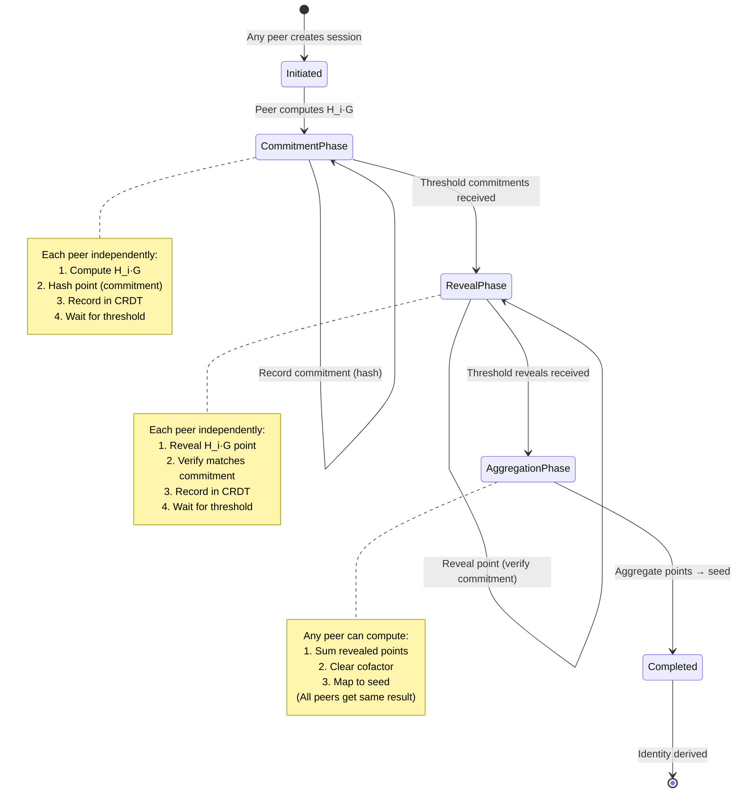
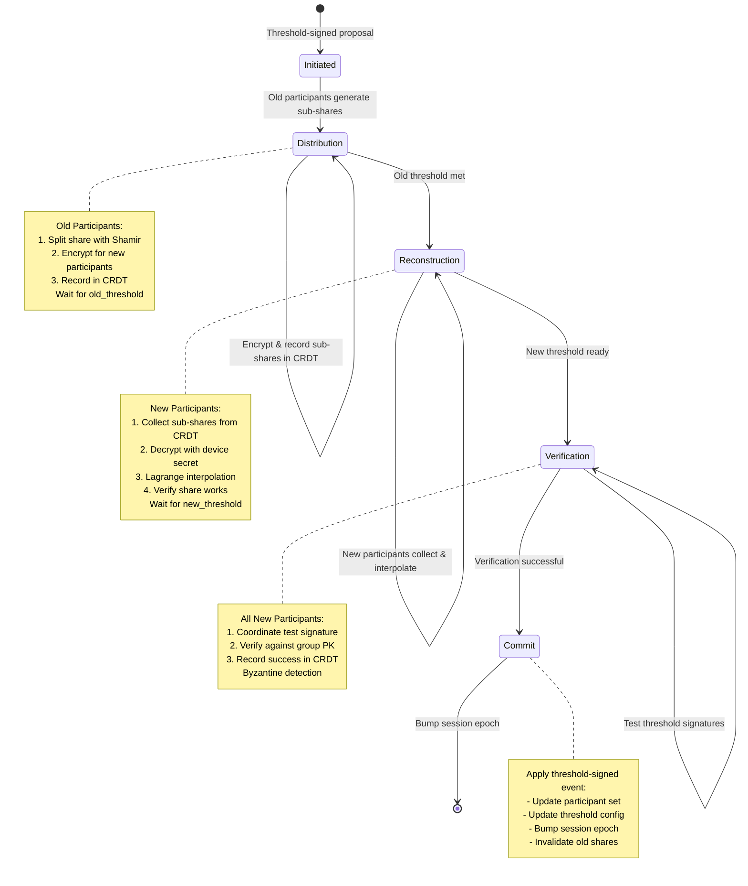

# Peer-to-Peer Threshold Protocols

**Status:** Design Specification  
**Version:** 1.0  
**Last Updated:** October 21, 2025

## Overview

This document specifies two critical peer-to-peer protocols for Aura:

1. **P2P Deterministic Key Derivation (DKD)** - Threshold-aggregated context identity derivation
2. **P2P Resharing Protocol** - Dynamic threshold adjustment and participant management

Both protocols are **truly peer-to-peer** with no coordinator role. All participants are equal peers, and coordination happens via the CRDT ledger (Automerge).

## Design Principles

### 1. No Coordinator Role
- All participants are equal peers
- Any peer can initiate a protocol session
- No single point of failure or bottleneck
- Protocol advances via distributed consensus

### 2. CRDT-Based Coordination
- Automerge CRDT provides shared state
- Eventually consistent across all participants
- Conflict-free concurrent operations
- Threshold conditions trigger state transitions

### 3. Asynchronous Participation
- Peers join when available
- Protocol progresses when threshold met (not all participants required)
- Tolerates network partitions and offline peers
- Graceful degradation

### 4. Byzantine Fault Tolerance
- Commitment-reveal scheme prevents manipulation
- Cryptographic verification at each phase
- Audit trail in CRDT ledger
- Threshold requirements provide fault tolerance

---

## Part 1: Peer-to-Peer DKD Protocol

### Problem Statement

The current DKD implementation allows single participants to derive context-specific keys, which defeats the threshold property. We need a protocol where:

- **At least M-of-N participants must cooperate** to derive a context identity
- **Derivation is deterministic** - same inputs always produce same output
- **No coordinator** - purely peer-to-peer coordination
- **Context isolation** - different contexts produce different identities

### Protocol Architecture

```
┌─────────────────────────────────────────────────────────┐
│           CRDT Ledger (Automerge)                       │
│                                                          │
│  DkdSessions: Map<ContextId, DkdSessionState>          │
│    ├─ context_capsule: ContextCapsule                  │
│    ├─ participants: Set<ParticipantId>                 │
│    ├─ threshold: usize                                 │
│    │                                                     │
│    ├─ Phase 1: Commitments                             │
│    │   └─ commitments: Map<PID, Hash>                  │
│    │                                                     │
│    ├─ Phase 2: Reveals                                 │
│    │   └─ revealed_points: Map<PID, Point>             │
│    │                                                     │
│    └─ Phase 3: Aggregation                             │
│        ├─ aggregated_point: Option<Point>              │
│        └─ derived_seed: Option<[u8; 32]>               │
└─────────────────────────────────────────────────────────┘
```

### State Machine



### CRDT State Structure

```rust
/// DKD session state stored in CRDT
#[derive(Debug, Clone, Serialize, Deserialize)]
pub struct DkdSessionState {
    /// Unique session identifier
    pub session_id: Uuid,
    
    /// Context capsule (domain, purpose, parameters)
    pub context_capsule: ContextCapsule,
    
    /// Participating devices
    pub participants: HashSet<ParticipantId>,
    
    /// Required threshold (M-of-N)
    pub threshold: usize,
    
    // === Phase 1: Commitment Phase ===
    /// Commitments: BLAKE3(H_i·G) from each participant
    pub commitments: HashMap<ParticipantId, [u8; 32]>,
    
    /// Flag: threshold commitments received
    pub commitment_threshold_met: bool,
    
    // === Phase 2: Reveal Phase ===
    /// Revealed points: H_i·G (compressed Edwards Y)
    pub revealed_points: HashMap<ParticipantId, Vec<u8>>,
    
    /// Flag: threshold reveals received
    pub reveal_threshold_met: bool,
    
    // === Phase 3: Aggregation Phase ===
    /// Aggregated point: Σ(H_i·G) (deterministic result)
    pub aggregated_point: Option<Vec<u8>>,
    
    /// Derived seed: BLAKE3(aggregated_point) (cached)
    pub derived_seed: Option<[u8; 32]>,
    
    // === Metadata ===
    pub initiated_at: u64,
    pub completed_at: Option<u64>,
}
```

### Protocol Phases

#### Phase 0: Initiation (Any Peer)

Any participant can initiate a DKD session for a context:

```rust
// Check if session already exists for this context
if !ledger.has_dkd_session(&capsule.context_id()) {
    ledger.initiate_dkd_session(DkdSessionState {
        session_id: Uuid::new_v4(),
        context_capsule: capsule.clone(),
        participants: self.get_active_participants(),
        threshold: self.config.threshold as usize,
        commitments: HashMap::new(),
        commitment_threshold_met: false,
        revealed_points: HashMap::new(),
        reveal_threshold_met: false,
        aggregated_point: None,
        derived_seed: None,
        initiated_at: current_timestamp(),
        completed_at: None,
    })?;
}
```

**Idempotency:** Multiple peers can attempt initiation; CRDT merges to single session.

#### Phase 1: Commitment Phase (Each Peer Independently)

Each participant computes and commits to their partial point:

```rust
// 1. Compute H_i = BLAKE3("aura.dkd.v1" || share_i || context_id)
let share = self.key_share.read().await;
let mut hasher = blake3::Hasher::new();
hasher.update(b"aura.dkd.v1");
hasher.update(&share.share.signing_share().to_bytes());
hasher.update(capsule.context_id().as_bytes());
let h_i = Scalar::from_hash(hasher);

// 2. Compute H_i·G (point on Ed25519 curve)
let partial_point = h_i * ED25519_BASEPOINT_TABLE;
let point_bytes = partial_point.compress().to_bytes();

// 3. Commit: hash the point (hiding)
let commitment = blake3::hash(&point_bytes);

// 4. Record commitment in CRDT
ledger.record_dkd_commitment(
    session_id,
    self.config.participant_id,
    commitment.into(),
)?;

// 5. Check if threshold commitments received (any peer can check)
let state = ledger.get_dkd_session(session_id)?;
if state.commitments.len() >= state.threshold 
    && !state.commitment_threshold_met {
    ledger.mark_dkd_commitments_complete(session_id)?;
}
```

**Security:** Commitment scheme prevents participants from choosing points based on others' contributions (binding and hiding).

**Synchronization:** Each peer waits (via CRDT sync) until `commitment_threshold_met` flag is set.

#### Phase 2: Reveal Phase (Each Peer Independently)

After threshold commitments, participants reveal their points:

```rust
// 1. Reveal partial point
ledger.record_dkd_reveal(
    session_id,
    self.config.participant_id,
    partial_point.to_vec(),
)?;

// 2. Verify reveals match commitments (Byzantine fault tolerance)
let state = ledger.get_dkd_session(session_id)?;
for (pid, point) in &state.revealed_points {
    let expected_commitment = blake3::hash(point);
    let actual_commitment = state.commitments.get(pid)
        .ok_or(DkdError::MissingCommitment)?;
    
    if expected_commitment.as_bytes() != actual_commitment {
        return Err(DkdError::CommitmentMismatch(*pid));
    }
}

// 3. Check if threshold reveals received
if state.revealed_points.len() >= state.threshold 
    && !state.reveal_threshold_met {
    ledger.mark_dkd_reveals_complete(session_id)?;
}
```

**Security:** Any peer can verify that revealed points match commitments. Mismatches indicate Byzantine behavior.

**Synchronization:** Each peer waits until `reveal_threshold_met` flag is set.

#### Phase 3: Aggregation (Any Peer, Deterministic)

Once threshold reveals received, any peer can compute the final result:

```rust
// 1. Aggregate points: P = Σ H_i·G (deterministic calculation)
let mut aggregated = EdwardsPoint::identity();

for (_, point_bytes) in state.revealed_points.iter()
    .take(state.threshold) {
    let point = CompressedEdwardsY::from_slice(point_bytes)
        .decompress()
        .ok_or(DkdError::InvalidPoint)?;
    aggregated += point;
}

// 2. Clear cofactor for Ed25519 (ensures prime-order subgroup)
let cleared = aggregated.mul_by_cofactor();

// 3. Map to scalar seed: BLAKE3(cleared_point)
let seed = blake3::hash(&cleared.compress().to_bytes());

// 4. Cache in CRDT (idempotent - all peers compute same result)
ledger.record_dkd_result(
    session_id,
    cleared.compress().to_bytes().to_vec(),
    seed.into(),
)?;
```

**Determinism:** All peers compute the same aggregated point and seed (given same inputs).

**Idempotency:** Result is cached in CRDT; multiple computations produce same value.

#### Phase 4: Identity Expansion (Local, Deterministic)

Each peer locally expands the seed to a full identity:

```rust
// Use HKDF to derive signing key from seed
let signing_key = expand_seed_with_hkdf(
    &derived_seed,
    &capsule.context_id(),
    "aura.dkd.identity.v1",
)?;

Ok(DerivedIdentity {
    context_id: capsule.context_id(),
    public_key: signing_key.verifying_key(),
    capsule: capsule.clone(),
    seed_fingerprint: blake3::hash(&derived_seed).as_bytes()[..8].try_into()?,
})
```

### Security Properties

| Property | Mechanism |
|----------|-----------|
| **Threshold Requirement** | At least M-of-N participants must contribute H_i·G points |
| **Determinism** | Same context + same share set → same derived identity |
| **Context Isolation** | H_i includes context_id, so different contexts produce different identities |
| **Binding** | Commitment scheme prevents changing H_i·G after seeing others' commitments |
| **Hiding** | Commitment hides H_i·G until reveal phase |
| **Byzantine Fault Tolerance** | Commitment verification detects malicious participants |
| **Forward Secrecy** | Resharing invalidates old shares, can't derive new contexts with old shares |

### Integration with Existing Systems

```rust
// === Application Integration ===
impl DeviceAgent {
    /// Derive context identity (replaces old single-device method)
    pub async fn derive_context_identity(
        &self,
        capsule: &ContextCapsule,
    ) -> Result<DerivedIdentity> {
        // Uses P2P DKD protocol
        self.derive_context_identity_p2p(capsule).await
    }
}

// === Example: BitChat Integration ===
let bitchat_capsule = ContextCapsule {
    domain: "com.bitchat".to_string(),
    purpose: "primary_identity".to_string(),
    params: CapsuleParams::default(),
};

// Requires threshold devices to cooperate
let identity = agent.derive_context_identity(&bitchat_capsule).await?;

// Use identity.public_key as BitChat identity
```

---

## Part 2: Peer-to-Peer Resharing Protocol

### Problem Statement

The current threshold configuration is static after DKG. We need a protocol for:

- **Adding new devices** without re-running full DKG
- **Removing devices** (e.g., lost/compromised)
- **Adjusting threshold** (e.g., 2-of-3 → 3-of-5)
- **Proactive secret refreshing** for forward secrecy
- **Recovery completion** (transferring shares from guardians to recovered devices)

### Protocol Architecture

```
┌─────────────────────────────────────────────────────────┐
│           CRDT Ledger (Automerge)                       │
│                                                          │
│  ResharingSessions: Map<Uuid, ResharingSessionState>   │
│    ├─ old_config: (participants, threshold)            │
│    ├─ new_config: (participants, threshold)            │
│    ├─ group_public_key: VerifyingKey                   │
│    │                                                     │
│    ├─ Phase 1: Sub-share Distribution                  │
│    │   ├─ sub_shares: Map<(Old,New), Encrypted>        │
│    │   └─ distribution_complete: Set<OldPID>           │
│    │                                                     │
│    ├─ Phase 2: New Share Reconstruction                │
│    │   └─ new_shares_ready: Set<NewPID>                │
│    │                                                     │
│    ├─ Phase 3: Verification                            │
│    │   ├─ verification_signatures: Map<PID, Sig>       │
│    │   └─ verification_complete: bool                  │
│    │                                                     │
│    └─ Phase 4: Commit                                  │
│        ├─ completed: bool                              │
│        └─ new_session_epoch: Option<u64>               │
└─────────────────────────────────────────────────────────┘
```

### State Machine



### CRDT State Structure

```rust
/// Resharing session state stored in CRDT
#[derive(Debug, Clone, Serialize, Deserialize)]
pub struct ResharingSessionState {
    /// Unique session identifier
    pub session_id: Uuid,
    
    // === Configuration ===
    /// Old participant set
    pub old_participants: HashSet<ParticipantId>,
    
    /// Old threshold (M-of-N)
    pub old_threshold: u16,
    
    /// New participant set
    pub new_participants: HashSet<ParticipantId>,
    
    /// New threshold (M'-of-N')
    pub new_threshold: u16,
    
    /// Group public key (remains constant)
    pub group_public_key: VerifyingKey,
    
    // === Phase 1: Sub-share Distribution ===
    /// Encrypted sub-shares: (from_old, to_new) → HPKE-encrypted sub-share
    pub sub_shares: HashMap<(ParticipantId, ParticipantId), Vec<u8>>,
    
    /// Old participants who've completed distribution
    pub distribution_complete: HashSet<ParticipantId>,
    
    // === Phase 2: New Share Reconstruction ===
    /// New participants who've reconstructed their shares
    pub new_shares_ready: HashSet<ParticipantId>,
    
    // === Phase 3: Verification ===
    /// Test signatures from new shares (proves shares work)
    pub verification_signatures: HashMap<ParticipantId, Vec<u8>>,
    
    /// Flag: verification successful
    pub verification_complete: bool,
    
    // === Phase 4: Result ===
    /// Flag: resharing completed
    pub completed: bool,
    
    /// New session epoch (invalidates old shares)
    pub new_session_epoch: Option<SessionEpoch>,
    
    // === Metadata ===
    pub initiated_at: u64,
    pub completed_at: Option<u64>,
    pub reason: String, // "add_device", "remove_device", "adjust_threshold", "recovery"
}
```

### Protocol Phases

#### Phase 0: Initiation (Threshold-Signed Proposal)

Resharing requires a threshold-signed proposal to prevent unauthorized changes:

```rust
// Create resharing proposal
let proposal = ResharingProposal {
    old_participants: current_devices,
    old_threshold: 2,
    new_participants: current_devices + new_device,
    new_threshold: 2,
    reason: "add_device".to_string(),
};

// Collect threshold signatures on proposal
let signatures = collect_threshold_signatures(&proposal).await?;

// Once threshold signatures received, initiate session
if signatures.len() >= old_threshold {
    ledger.initiate_resharing(ResharingSessionState {
        session_id: Uuid::new_v4(),
        // ... (from proposal)
    })?;
}
```

**Security:** Prevents single device from unilaterally changing configuration.

#### Phase 1: Sub-share Distribution (Old Participants)

Old participants split their shares and encrypt for new participants:

```rust
// Role check: am I an old participant?
let is_old_participant = state.old_participants.contains(&my_id);

if is_old_participant {
    let share = self.key_share.read().await;
    
    // Generate sub-shares using Shamir secret sharing
    // Polynomial of degree (new_threshold - 1) with current share as secret
    let secret_scalar = share.share.signing_share();
    let polynomial = Polynomial::from_secret(
        secret_scalar, 
        state.new_threshold as usize,
    )?;
    
    // Evaluate polynomial at each new participant's ID
    for new_id in &state.new_participants {
        let eval_point = Scalar::from(new_id.as_u16());
        let sub_share = polynomial.evaluate(&eval_point)?;
        
        // Get recipient's public key from ledger
        let recipient_pk = ledger.get_device_public_key(*new_id)?;
        
        // Encrypt with HPKE (same as guardian shares)
        let encrypted = encrypt_sub_share_for_recipient(
            &sub_share.to_bytes(),
            &recipient_pk,
            session_id,
        )?;
        
        // Record in CRDT
        ledger.record_resharing_sub_share(
            session_id,
            my_id,
            *new_id,
            encrypted,
        )?;
    }
    
    // Mark distribution complete
    ledger.mark_resharing_distribution_complete(session_id, my_id)?;
}
```

**Mathematics:** Each old participant creates a polynomial:
```
f_i(x) = share_i + a_1·x + a_2·x² + ... + a_{t'-1}·x^{t'-1}
```

Where `share_i` is their current share, and coefficients are random. They send `f_i(new_id)` to each new participant.

**Synchronization:** Wait until `distribution_complete.len() >= old_threshold`.

#### Phase 2: New Share Reconstruction (New Participants)

New participants collect sub-shares and reconstruct their shares:

```rust
// Role check: am I a new participant?
let is_new_participant = state.new_participants.contains(&my_id);

if is_new_participant {
    let device_secret = self.get_device_secret().await?;
    
    // Collect sub-shares addressed to me
    let mut received_sub_shares = Vec::new();
    for ((from_id, to_id), encrypted) in &state.sub_shares {
        if *to_id == my_id {
            // Decrypt with my device secret (HPKE)
            let decrypted = decrypt_sub_share(
                encrypted,
                &device_secret,
                session_id,
            )?;
            received_sub_shares.push((*from_id, decrypted));
        }
    }
    
    // Need at least old_threshold sub-shares
    if received_sub_shares.len() < state.old_threshold as usize {
        return Err(ResharingError::InsufficientSubShares);
    }
    
    // Lagrange interpolation to reconstruct my new share
    // Interpolate at x = my_id
    let x = Scalar::from(my_id.as_u16());
    let mut share_value = Scalar::zero();
    
    for (old_id, sub_share_bytes) in &received_sub_shares {
        let sub_share = Scalar::from_bytes(sub_share_bytes)?;
        
        // Lagrange coefficient λ_j(x)
        let mut numerator = Scalar::one();
        let mut denominator = Scalar::one();
        
        for (other_id, _) in &received_sub_shares {
            if other_id != old_id {
                let x_j = Scalar::from(other_id.as_u16());
                let x_m = Scalar::from(old_id.as_u16());
                
                numerator *= x - x_j;
                denominator *= x_m - x_j;
            }
        }
        
        let lambda = numerator * denominator.invert();
        share_value += lambda * sub_share;
    }
    
    // Create KeyShare with new configuration
    let new_share = KeyShare {
        participant_id: my_id,
        share: frost::keys::KeyPackage::from_secret_share(
            my_id.into(),
            share_value,
            state.group_public_key,
            state.new_threshold,
            state.new_participants.len() as u16,
        )?,
        threshold: state.new_threshold,
        total_participants: state.new_participants.len() as u16,
    };
    
    // Mark ready in CRDT
    ledger.mark_resharing_share_ready(session_id, my_id)?;
}
```

**Mathematics:** Each new participant receives `f_1(id), f_2(id), ..., f_t(id)` from `t` old participants. They compute:
```
new_share = Σ λ_j · f_j(id)
```

Where `λ_j` are Lagrange coefficients. This reconstructs the original secret (group private key) at their ID point.

**Synchronization:** Wait until `new_shares_ready.len() >= new_threshold`.

#### Phase 3: Verification (New Participants)

New participants prove their shares work via test signature:

```rust
if let Some(ref share) = new_share {
    // Generate test message
    let test_msg = format!("resharing-verification-{}", session_id);
    
    // Participate in threshold signing with new configuration
    // (Uses existing FROST signing protocol)
    let signing_session_id = Uuid::new_v4();
    
    // Round 1: Commitments
    let (nonces, commitments) = frost::round1::commit(
        share.share.signing_share(),
        &mut OsRng,
    );
    ledger.record_signing_commitment(signing_session_id, my_id, commitments)?;
    
    // Wait for threshold commitments...
    
    // Round 2: Signature shares
    let signature_share = frost::round2::sign(
        &signing_package,
        &nonces,
        &share.share,
    )?;
    ledger.record_signature_share(signing_session_id, my_id, signature_share)?;
    
    // Wait for threshold shares...
    
    // Aggregate signature (any peer can do this)
    let signature = frost::aggregate(&signature_shares, &signing_package)?;
    
    // Verify signature works
    if state.group_public_key.verify(test_msg.as_bytes(), &signature).is_err() {
        return Err(ResharingError::VerificationFailed);
    }
    
    // Record successful verification
    ledger.record_resharing_verification(
        session_id,
        my_id,
        signature.to_vec(),
    )?;
    
    // Check if threshold verifications received
    if state.verification_signatures.len() >= state.new_threshold as usize {
        ledger.mark_resharing_verified(session_id)?;
    }
}
```

**Security:** Test signature proves that:
1. At least `new_threshold` new shares are valid
2. They correctly reconstruct the group private key
3. The resharing was successful

**Byzantine Detection:** If test signature fails, at least one new share is invalid (protocol abort).

**Synchronization:** Wait until `verification_complete` flag is set.

#### Phase 4: Commit (Threshold-Signed Event)

Apply resharing result to CRDT ledger:

```rust
// Once verification complete, any participant can propose commit
let mut ledger = self.ledger.write().await;
let state = ledger.get_resharing_session(session_id)?;

if !state.completed {
    // Bump session epoch to invalidate old shares
    let new_epoch = ledger.state().session_epoch + 1;
    
    // Record completion
    ledger.complete_resharing(session_id, new_epoch)?;
    
    // Apply threshold-signed event to CRDT
    ledger.apply_event(Event::ResharingComplete {
        session_id,
        new_participants: state.new_participants.clone(),
        new_threshold: state.new_threshold,
        new_session_epoch: new_epoch,
        completed_at: current_timestamp(),
    })?;
}

// Update local key share if we're a new participant
if is_new_participant {
    let mut key_share = self.key_share.write().await;
    *key_share = new_share.unwrap();
}

// Old participants can zeroize their shares (forward secrecy)
if is_old_participant && !is_new_participant {
    let mut key_share = self.key_share.write().await;
    key_share.zeroize();
}
```

**Session Epoch:** Incrementing the session epoch invalidates all old shares. Old participants can no longer:
- Participate in threshold signing
- Participate in DKD
- Issue presence tickets

This provides **forward secrecy** - compromising old shares after resharing doesn't help.

### Security Properties

| Property | Mechanism |
|----------|-----------|
| **Authorization** | Resharing requires threshold-signed proposal |
| **Confidentiality** | Sub-shares encrypted with HPKE (IND-CCA2) |
| **Integrity** | Verification phase detects invalid shares |
| **Forward Secrecy** | Session epoch bump invalidates old shares |
| **Byzantine Fault Tolerance** | Test signature detects malicious participants |
| **Availability** | Only threshold participants needed (not all) |
| **Group Key Preservation** | Group public key remains constant |

### Use Cases

#### Use Case 1: Add New Device

```rust
// Scenario: User adds a laptop to existing phone + tablet setup
// Current: 2-of-2 (phone, tablet)
// Target: 2-of-3 (phone, tablet, laptop)

let new_device_id = register_new_device(&laptop_public_key).await?;

let session_id = Uuid::new_v4();
ledger.initiate_resharing(ResharingSessionState {
    session_id,
    old_participants: hashset![phone_id, tablet_id],
    old_threshold: 2,
    new_participants: hashset![phone_id, tablet_id, laptop_id],
    new_threshold: 2, // Keep same threshold
    group_public_key: account.group_public_key,
    reason: "add_device".to_string(),
    ...
})?;

// Phone and tablet distribute sub-shares to all three devices
// Laptop reconstructs its share
// All three verify
// Session epoch bumps
// Result: 2-of-3 setup, any two devices can operate
```

#### Use Case 2: Remove Compromised Device

```rust
// Scenario: Phone is lost/stolen
// Current: 2-of-3 (phone, tablet, laptop)
// Target: 2-of-2 (tablet, laptop)

let session_id = Uuid::new_v4();
ledger.initiate_resharing(ResharingSessionState {
    session_id,
    old_participants: hashset![phone_id, tablet_id, laptop_id],
    old_threshold: 2,
    new_participants: hashset![tablet_id, laptop_id],
    new_threshold: 2,
    group_public_key: account.group_public_key,
    reason: "remove_device".to_string(),
    ...
})?;

// Tablet and laptop (or any 2 of 3) participate
// Phone's share becomes invalid after session epoch bump
// Result: 2-of-2 setup, stolen phone can't do anything
```

#### Use Case 3: Adjust Threshold

```rust
// Scenario: User wants stricter security (more devices required)
// Current: 2-of-3 (phone, tablet, laptop)
// Target: 3-of-3 (phone, tablet, laptop)

let session_id = Uuid::new_v4();
ledger.initiate_resharing(ResharingSessionState {
    session_id,
    old_participants: hashset![phone_id, tablet_id, laptop_id],
    old_threshold: 2,
    new_participants: hashset![phone_id, tablet_id, laptop_id],
    new_threshold: 3, // Increase threshold
    group_public_key: account.group_public_key,
    reason: "adjust_threshold".to_string(),
    ...
})?;

// All devices participate (resharing requires old threshold = 2)
// Shares are refreshed with new threshold
// Result: 3-of-3 setup, all devices required for operations
```

#### Use Case 4: Recovery Completion

```rust
// Scenario: User lost all devices, guardians approved recovery
// Current: Guardians hold recovery shares (3-of-5)
// Target: New device gets share (1-of-1)

let session_id = Uuid::new_v4();
ledger.initiate_resharing(ResharingSessionState {
    session_id,
    old_participants: guardian_ids, // 5 guardians
    old_threshold: 3, // Recovery threshold
    new_participants: hashset![new_device_id],
    new_threshold: 1, // Single device initially
    group_public_key: account.group_public_key,
    reason: "recovery".to_string(),
    ...
})?;

// 3 guardians provide sub-shares to new device
// New device reconstructs share
// Guardians' shares invalidated (forward secrecy)
// Result: User regains access, guardians can't impersonate
```

### Integration with Recovery Protocol

The resharing protocol completes the recovery flow:

```rust
// In recovery::execute_recovery()
pub async fn execute_recovery(
    &mut self,
    request_id: Uuid,
) -> Result<()> {
    let request = self.active_requests.get(&request_id)
        .ok_or(RecoveryError::RequestNotFound)?;
    
    if request.status != RecoveryStatus::ReadyToExecute {
        return Err(RecoveryError::InvalidStatus);
    }
    
    // Step 1: Deliver recovery shares to guardians
    // (Already implemented via HPKE-encrypted packages)
    
    // Step 2: Initiate resharing session
    let resharing_session_id = Uuid::new_v4();
    self.ledger.initiate_resharing(ResharingSessionState {
        session_id: resharing_session_id,
        old_participants: request.guardians.keys().cloned().collect(),
        old_threshold: request.recovery_threshold,
        new_participants: request.recovered_devices.clone(),
        new_threshold: request.initial_threshold, // Start with low threshold
        group_public_key: self.ledger.state().group_public_key,
        reason: format!("recovery-{}", request_id),
        ...
    })?;
    
    // Step 3: Coordinate resharing
    // (Guardians and new device participate in P2P protocol)
    
    // Step 4: Mark recovery complete
    self.complete_recovery(request_id, resharing_session_id)?;
    
    Ok(())
}
```

---

## Implementation Plan

### Phase 1: Core Cryptographic Primitives (Week 1)
- [ ] Implement commitment-reveal scheme (BLAKE3-based)
- [ ] Implement Shamir secret sharing (polynomial evaluation)
- [ ] Implement Lagrange interpolation (share reconstruction)
- [ ] Unit tests for cryptographic operations

### Phase 2: CRDT State Management (Week 1-2)
- [ ] Add `DkdSessionState` to CRDT schema
- [ ] Add `ResharingSessionState` to CRDT schema
- [ ] Implement state transition methods in `AccountLedger`
- [ ] Add corresponding `Event` types for audit log

### Phase 3: P2P DKD Protocol (Week 2)
- [ ] Implement `derive_context_identity_p2p()` in `DeviceAgent`
- [ ] Implement commitment phase logic
- [ ] Implement reveal phase logic
- [ ] Implement aggregation phase logic
- [ ] Integration tests (2-of-3, 3-of-5 scenarios)

### Phase 4: P2P Resharing Protocol (Week 3)
- [ ] Implement `participate_in_resharing()` in `DeviceAgent`
- [ ] Implement sub-share distribution logic
- [ ] Implement share reconstruction logic
- [ ] Implement verification phase (test signatures)
- [ ] Integration tests (add device, remove device, adjust threshold)

### Phase 5: Recovery Integration (Week 3)
- [ ] Update `RecoveryManager::execute_recovery()` to use resharing
- [ ] End-to-end recovery test (guardians → new device)
- [ ] Test forward secrecy (guardians can't use old shares)

### Phase 6: CLI Commands (Week 4)
- [ ] `aura derive <context>` - Trigger P2P DKD
- [ ] `aura reshare add <device-id>` - Add device via resharing
- [ ] `aura reshare remove <device-id>` - Remove device via resharing
- [ ] `aura reshare threshold <new-threshold>` - Adjust threshold
- [ ] Status display for in-progress sessions

### Phase 7: Testing & Hardening (Week 4-5)
- [ ] Byzantine behavior tests (commitment mismatch, invalid shares)
- [ ] Network partition tests (some peers offline)
- [ ] Concurrent operation tests (DKD + resharing simultaneously)
- [ ] Performance benchmarks (latency, CRDT size)

---

## Security Considerations

### Threat Model

| Threat | Mitigation |
|--------|------------|
| **Malicious Participant** | Commitment-reveal scheme, verification phase |
| **Network MITM** | HPKE encryption, threshold signatures on events |
| **Compromised Old Share** | Session epoch bump, forward secrecy |
| **Denial of Service** | Only threshold required (not all participants) |
| **Replay Attack** | Session IDs, timestamps, monotonic epoch |
| **CRDT Poisoning** | Threshold-signed events, audit log |

### Assumptions

1. **Honest Majority:** At least threshold participants are honest (Byzantine fault tolerance assumption)
2. **Secure Channels:** CRDT sync is authenticated (e.g., via TLS + mutual auth)
3. **Device Secrets:** Device private keys are securely stored (e.g., secure enclave, TPM)
4. **Random Number Generation:** `OsRng` provides cryptographically secure randomness

### Future Enhancements

1. **Proactive Resharing:** Periodic automatic resharing for forward secrecy (cron-like)
2. **Batch DKD:** Derive multiple contexts in single protocol run (efficiency)
3. **Threshold Adjustable DKG:** Initial DKG with dynamic threshold built-in
4. **Zero-Knowledge Proofs:** Prove correct sub-share generation without revealing secret
5. **Post-Quantum:** Replace Ed25519 with post-quantum primitives (e.g., Kyber + Dilithium)

---

## References

- **FROST Threshold Signatures:** [IETF Draft](https://datatracker.ietf.org/doc/draft-irtf-cfrg-frost/)
- **Automerge CRDT:** [automerge.org](https://automerge.org/)
- **Shamir Secret Sharing:** Shamir, Adi. "How to Share a Secret." Communications of the ACM 22.11 (1979): 612-613.
- **HPKE (RFC 9180):** [Hybrid Public Key Encryption](https://www.rfc-editor.org/rfc/rfc9180.html)
- **Ed25519:** Bernstein et al. "High-speed high-security signatures." Journal of Cryptographic Engineering (2012).

---

## Appendix A: Mathematical Foundations

### Deterministic Key Derivation (DKD)

Given:
- `share_i`: Participant i's FROST signing share (scalar)
- `context_id`: Context identifier (string)

Each participant computes:
```
H_i = BLAKE3("aura.dkd.v1" || share_i || context_id)  (scalar)
P_i = H_i · G  (point on Ed25519 curve)
```

Aggregation (after threshold commitments/reveals):
```
P = P_1 + P_2 + ... + P_t  (point addition, need ≥ t participants)
P' = 8 · P  (cofactor clearing)
seed = BLAKE3(P')  (map to 256-bit seed)
```

**Determinism:** Same `share_i` set + same `context_id` → same `seed`

**Threshold:** Need at least `t` participants' `P_i` points to compute `P`

### Shamir Secret Sharing (Resharing)

Given:
- `s`: Secret to share (scalar)
- `t`: New threshold
- `n`: New total participants

Generate random polynomial of degree `t - 1`:
```
f(x) = s + a_1·x + a_2·x² + ... + a_{t-1}·x^{t-1}
```

Evaluate at each participant ID:
```
share_j = f(id_j)  for j = 1, 2, ..., n
```

**Reconstruction:** Given any `t` shares, reconstruct secret via Lagrange interpolation:
```
s = Σ λ_j · share_j

where λ_j = Π_{m≠j} (0 - x_m) / (x_j - x_m)  (Lagrange coefficient)
```

### Resharing Sub-share Aggregation

Old participant `i` with share `s_i` creates polynomial:
```
f_i(x) = s_i + random coefficients
```

New participant `j` receives `f_1(id_j), f_2(id_j), ..., f_t(id_j)` from `t` old participants.

Reconstruct share via Lagrange interpolation:
```
s_j = Σ λ_k · f_k(id_j)

    = Σ λ_k · [s_k + random]
    
    = Σ λ_k · s_k  (original secret reconstructed at id_j)
```

**Key Property:** The sum of old participants' polynomials evaluated at new ID reconstructs the original group secret.

---

## Appendix B: CRDT Event Schema

```rust
/// CRDT events for P2P protocols
#[derive(Debug, Clone, Serialize, Deserialize)]
pub enum Event {
    // ... existing events ...
    
    /// DKD session initiated
    DkdSessionInitiated {
        session_id: Uuid,
        context_id: String,
        participants: HashSet<ParticipantId>,
        threshold: usize,
        initiated_at: u64,
    },
    
    /// DKD commitment recorded
    DkdCommitment {
        session_id: Uuid,
        participant_id: ParticipantId,
        commitment: [u8; 32],
        recorded_at: u64,
    },
    
    /// DKD reveal recorded
    DkdReveal {
        session_id: Uuid,
        participant_id: ParticipantId,
        point: Vec<u8>,
        recorded_at: u64,
    },
    
    /// DKD result computed
    DkdResultComputed {
        session_id: Uuid,
        aggregated_point: Vec<u8>,
        derived_seed: [u8; 32],
        completed_at: u64,
    },
    
    /// Resharing session initiated
    ResharingInitiated {
        session_id: Uuid,
        old_config: (HashSet<ParticipantId>, u16),
        new_config: (HashSet<ParticipantId>, u16),
        reason: String,
        initiated_at: u64,
    },
    
    /// Resharing sub-share recorded
    ResharingSubShare {
        session_id: Uuid,
        from_participant: ParticipantId,
        to_participant: ParticipantId,
        encrypted_sub_share: Vec<u8>,
        recorded_at: u64,
    },
    
    /// Resharing distribution complete
    ResharingDistributionComplete {
        session_id: Uuid,
        participant_id: ParticipantId,
        completed_at: u64,
    },
    
    /// Resharing share ready
    ResharingShareReady {
        session_id: Uuid,
        participant_id: ParticipantId,
        ready_at: u64,
    },
    
    /// Resharing verification signature
    ResharingVerification {
        session_id: Uuid,
        participant_id: ParticipantId,
        signature: Vec<u8>,
        verified_at: u64,
    },
    
    /// Resharing complete
    ResharingComplete {
        session_id: Uuid,
        new_participants: HashSet<ParticipantId>,
        new_threshold: u16,
        new_session_epoch: SessionEpoch,
        completed_at: u64,
    },
}
```

---

## Appendix C: Error Types

```rust
/// DKD protocol errors
#[derive(Debug, thiserror::Error)]
pub enum DkdError {
    #[error("DKD session not found: {0}")]
    SessionNotFound(Uuid),
    
    #[error("Commitment missing for participant: {0:?}")]
    MissingCommitment(ParticipantId),
    
    #[error("Commitment mismatch for participant: {0:?}")]
    CommitmentMismatch(ParticipantId),
    
    #[error("Invalid point in reveal")]
    InvalidPoint,
    
    #[error("Insufficient participants (need threshold)")]
    InsufficientParticipants,
    
    #[error("DKD session timeout")]
    Timeout,
}

/// Resharing protocol errors
#[derive(Debug, thiserror::Error)]
pub enum ResharingError {
    #[error("Resharing session not found: {0}")]
    SessionNotFound(Uuid),
    
    #[error("Not authorized to participate")]
    NotAuthorized,
    
    #[error("Insufficient sub-shares received")]
    InsufficientSubShares,
    
    #[error("Share reconstruction failed")]
    ReconstructionFailed,
    
    #[error("Verification failed (invalid share)")]
    VerificationFailed,
    
    #[error("Resharing session timeout")]
    Timeout,
    
    #[error("Proposal not threshold-signed")]
    ProposalNotSigned,
}
```

---

**End of Specification**

