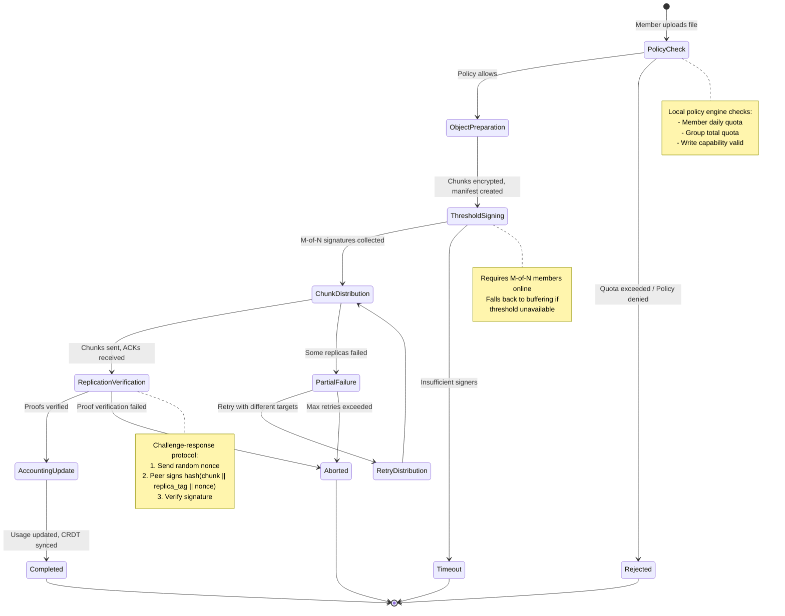

# Private DAOs and Group Storage

**Status:** Design Specification  
**Version:** 1.0  
**Last Updated:** October 21, 2025

## Overview

This document specifies how Aura's peer-to-peer threshold protocols enable **private DAOs** - groups that collectively govern shared resources (storage, assets, access control) through threshold cryptography and policy-based delegation.

Private DAOs extend the individual identity model (one person with multiple devices) to **collective identities** (multiple people governing shared resources). The same threshold primitives (DKG, DKD, resharing) that secure individual accounts now enable group coordination without central authorities.

**What This Document Covers:**

- Groups as threshold entities with derived secrets
- Policy-based resource governance using Biscuit tokens
- Delegated authority patterns (constitutional vs. operational)
- Group storage protocol layered on CRDT coordination
- User flows for different roles (members, admins, founders)
- Privacy properties for group coordination

**Integration with Existing Architecture:**

This design builds directly on `080_architecture_protocol_integration.md`:
- Groups use the same P2P protocols (DKG, DKD, resharing, threshold signing)
- Group state is a specialized CRDT ledger instance
- Storage is governed through threshold-signed policies
- Three-layer architecture applies to group operations

---

## Part 1: Groups as Threshold Entities

### Conceptual Model

A **group** is a threshold identity composed of N members where M-of-N agreement is required for critical operations. Groups have:

- **Threshold Identity**: Shared public key from P2P DKG
- **Derived Secrets**: Per-purpose keys via P2P DKD (messaging, storage, governance)
- **Policy Engine**: Rules governing resource access and operations
- **Shared State**: CRDT ledger tracking group operations and membership
- **Governed Resources**: Storage, assets, access control managed collectively

### Group Formation

```
┌─────────────────────────────────────────────────────────┐
│ Step 1: Distributed Key Generation (P2P DKG)            │
│                                                          │
│  Alice, Bob, Carol run DKG protocol                     │
│    → Group public key: G_pk                             │
│    → Each holds secret share: share_i                   │
│    → Threshold: 2-of-3                                  │
└─────────────────────────────────────────────────────────┘
                            ↓
┌─────────────────────────────────────────────────────────┐
│ Step 2: Derive Group Secrets (P2P DKD)                  │
│                                                          │
│  Context Capsule: "group.storage"                       │
│    → Run P2P DKD protocol (commitment → reveal → aggregate) │
│    → K_storage derived deterministically                │
│                                                          │
│  Context Capsule: "group.messaging"                     │
│    → K_messaging derived                                │
│                                                          │
│  Context Capsule: "group.governance"                    │
│    → K_governance derived                               │
└─────────────────────────────────────────────────────────┘
                            ↓
┌─────────────────────────────────────────────────────────┐
│ Step 3: Establish Initial Policies                      │
│                                                          │
│  Threshold-signed policy document:                      │
│    - Storage quota: 10GB                                │
│    - Member upload limit: 100MB/day                     │
│    - Eviction requires: 2-of-3 vote                     │
│    - Admin role delegated to: Alice                     │
│                                                          │
│  CRDT Event: GroupCreated {                             │
│    group_id,                                            │
│    members: [Alice, Bob, Carol],                        │
│    threshold: 2,                                        │
│    policies,                                            │
│    threshold_signature                                  │
│  }                                                       │
└─────────────────────────────────────────────────────────┘
```

### Group State Structure

```rust
/// Group state stored in CRDT
pub struct GroupState {
    /// Unique group identifier
    pub group_id: Uuid,
    
    /// Group public key (from DKG)
    pub group_public_key: VerifyingKey,
    
    /// Current member set
    pub members: HashMap<MemberId, MemberInfo>,
    
    /// Threshold configuration (M-of-N)
    pub threshold: u16,
    pub total_members: u16,
    
    /// Derived secret fingerprints (not the secrets themselves)
    pub derived_secrets: HashMap<String, SecretFingerprint>,
    
    /// Active policies
    pub policies: PolicySet,
    
    /// Delegated capabilities
    pub capabilities: HashMap<MemberId, Vec<Capability>>,
    
    /// Resource state
    pub resources: ResourceState,
    
    /// Session epoch (for invalidation)
    pub session_epoch: u64,
    
    /// Creation metadata
    pub created_at: u64,
}

pub struct MemberInfo {
    pub member_id: MemberId,
    pub device_ids: Vec<DeviceId>,
    pub roles: Vec<Role>,
    pub joined_at: u64,
}

pub struct ResourceState {
    /// Storage accounting
    pub storage_used: u64,
    pub storage_quota: u64,
    pub per_member_usage: HashMap<MemberId, u64>,
    
    /// Stored objects (CID → metadata)
    pub objects: HashMap<Cid, ObjectInfo>,
    
    /// Replication state
    pub replicas: HashMap<Cid, Vec<ReplicaInfo>>,
}
```

---

## Part 2: Policy-Based Resource Governance

### Policy Hierarchy

Groups govern resources through three tiers of authority:

#### Tier 1: Constitutional (Always Requires Threshold)

Critical operations that always require M-of-N member agreement:

- Add or remove members
- Change group threshold
- Grant new delegated capabilities
- Revoke delegated capabilities
- Dissolve the group
- Modify constitutional policies

**CRDT Event Example:**
```rust
Event::GrantCapability {
    grantee: Alice,
    capability: Capability {
        action: "manage_storage_quota",
        bounds: CapabilityBounds {
            max_quota: 100_000_000_000,  // 100GB
            expires_at: Some(timestamp),
        },
    },
    threshold_signature: <2-of-3 signed>,
    granted_at_epoch: 42,
}
```

#### Tier 2: Delegated (Specific Members Act Alone)

Operational authority delegated to trusted members:

- Adjust storage quotas (within bounds)
- Manage member permissions
- Moderate content
- Configure operational policies
- Emergency actions (with audit trail)

**Biscuit Token Example:**
```datalog
// Root capability (threshold-signed by group)
group_authority("manage_storage", "group_xyz");

// Delegated to Alice with bounds
allow(Alice, "adjust_quota", $new_quota) if
  group_authority("manage_storage", "group_xyz"),
  $new_quota <= 100_000_000_000,
  time.now() < expiry_date;
  
// Audit requirement
check if
  action_logged_to_crdt($action_id);
```

**CRDT Event Example:**
```rust
Event::AdjustStorageQuota {
    adjuster: Alice,
    old_quota: 10_000_000_000,
    new_quota: 20_000_000_000,
    capability_ref: event_hash,  // Points to GrantCapability event
    signature: <Alice's signature>,
    adjusted_at_epoch: 87,
}
```

#### Tier 3: Automatic (Anyone Can Do, Policy-Gated)

Member operations checked against policy but not requiring approval:

- Upload files (under daily quota)
- Read shared content
- Vote on proposals
- View group state
- Send messages

**Policy Check (Local):**
```rust
// Check if member can upload
fn can_upload(&self, member: &MemberId, size: u64) -> Result<()> {
    let member_usage = self.resources.per_member_usage.get(member)?;
    let member_daily_limit = self.policies.member_daily_upload_limit;
    
    if member_usage.today() + size > member_daily_limit {
        return Err(PolicyError::QuotaExceeded);
    }
    
    if self.resources.storage_used + size > self.resources.storage_quota {
        return Err(PolicyError::GroupQuotaExceeded);
    }
    
    Ok(())
}
```

### Capability Tree Structure

```
Group (2-of-3 threshold)
  │
  ├─ Constitutional Powers [Tier 1: Threshold Required]
  │   ├─ Add/Remove Members
  │   ├─ Change Threshold
  │   ├─ Grant Capabilities
  │   ├─ Revoke Capabilities
  │   └─ Dissolve Group
  │
  ├─ Admin Role [Tier 2: Delegated to Alice]
  │   ├─ Adjust Storage Quota (≤ 100GB)
  │   ├─ Change Upload Limits
  │   ├─ Moderate Content
  │   └─ Emergency Pause (24hr)
  │
  ├─ Moderator Role [Tier 2: Delegated to Bob]
  │   ├─ Delete Messages
  │   ├─ Mute Members (≤ 7 days)
  │   └─ Review Audit Log
  │
  └─ Member Role [Tier 3: Automatic]
      ├─ Upload (≤ 100MB/day)
      ├─ Read All Content
      ├─ Vote on Proposals
      └─ View Group State
```

---

## Part 3: Group Storage Protocol

### Architecture Overview

Group storage extends the individual storage model (from `001_spec.md`) with threshold coordination and policy governance.

```
┌─────────────────────────────────────────────────────────┐
│ Layer 3: Application API                                │
│                                                          │
│  group.store(payload, metadata)                         │
│  group.fetch(cid)                                       │
│  group.propose_eviction(cids)                           │
│  group.adjust_quota(new_quota)  // if delegated         │
└──────────────▲──────────────────────────────────────────┘
               │ compiles to
┌──────────────┴──────────────────────────────────────────┐
│ Layer 2: Orchestration (Storage Protocol)               │
│                                                          │
│  Storage Protocol Phases:                               │
│  ├─ Phase 0: Policy Check                               │
│  │   ├─ Check member quota                              │
│  │   ├─ Check group quota                               │
│  │   └─ Verify write capability                         │
│  │                                                       │
│  ├─ Phase 1: Object Preparation                         │
│  │   ├─ Derive K_object from K_group_storage            │
│  │   ├─ Encrypt chunks with K_object                    │
│  │   ├─ Create ObjectManifest with metadata             │
│  │   └─ Threshold-sign manifest (M-of-N)                │
│  │                                                       │
│  ├─ Phase 2: Chunk Distribution                         │
│  │   ├─ Select replica targets (from member devices)    │
│  │   ├─ Send chunks via Transport trait                 │
│  │   ├─ Collect acknowledgements                        │
│  │   └─ CRDT: RecordReplicaCommitment (per device)      │
│  │                                                       │
│  ├─ Phase 3: Replication Verification                   │
│  │   ├─ Challenge-response proof-of-storage             │
│  │   ├─ Verify signatures from replica holders          │
│  │   └─ CRDT: VerifyReplica (confirmed storage)         │
│  │                                                       │
│  └─ Phase 4: Accounting Update                          │
│      ├─ Update member usage counter                     │
│      ├─ Update group usage counter                      │
│      ├─ CRDT: StoreObjectComplete                       │
│      └─ Broadcast manifest to group                     │
└──────────────▲──────────────────────────────────────────┘
               │ compiles to
┌──────────────┴──────────────────────────────────────────┐
│ Layer 1: Execution (Primitive Operations)               │
│                                                          │
│  Cryptographic Primitives:                              │
│  ├─ DKD: derive_group_storage_key(context_capsule)      │
│  ├─ HKDF: derive_object_key(K_storage, object_id)       │
│  ├─ ChaCha20Poly1305: encrypt_chunk(chunk, K_object)    │
│  ├─ FROST: threshold_sign(manifest, shares)             │
│  └─ Ed25519: verify_replica_proof(proof, device_pk)     │
│                                                          │
│  CRDT Operations:                                       │
│  ├─ group_ledger.check_policy(member, action)           │
│  ├─ group_ledger.record_replica_commitment()            │
│  ├─ group_ledger.verify_replica()                       │
│  ├─ group_ledger.update_storage_accounting()            │
│  └─ group_ledger.store_object_complete()                │
│                                                          │
│  Local Storage (via Kv trait):                          │
│  ├─ indexer.put_object_manifest(cid, manifest)          │
│  ├─ indexer.store_chunk(chunk_id, encrypted_data)       │
│  ├─ indexer.update_quota_counters(member, size)         │
│  └─ indexer.record_replica_tag(cid, tag)                │
│                                                          │
│  Transport Operations (via Transport trait):            │
│  ├─ transport.send_chunk(peer, chunk, presence_ticket)  │
│  ├─ transport.verify_chunk_presence(peer, cid, nonce)   │
│  └─ transport.broadcast_manifest(group_members, manifest)│
└─────────────────────────────────────────────────────────┘
```

### Storage State Machine



### CRDT Events for Storage

```rust
/// Storage-related CRDT events
pub enum GroupEvent {
    // ... other group events
    
    /// Object storage initiated
    StoreObjectInitiated {
        cid: Cid,
        size: u64,
        uploader: MemberId,
        metadata: ObjectMetadata,
        initiated_at_epoch: u64,
    },
    
    /// Replica commitment recorded
    ReplicaCommitment {
        cid: Cid,
        device_id: DeviceId,
        replica_tag: Uuid,
        committed_at_epoch: u64,
        signature: Vec<u8>,
    },
    
    /// Replica verified via challenge-response
    ReplicaVerified {
        cid: Cid,
        device_id: DeviceId,
        replica_tag: Uuid,
        proof: ReplicaProof,
        verified_at_epoch: u64,
    },
    
    /// Storage operation completed
    StoreObjectCompleted {
        cid: Cid,
        manifest_cid: Cid,
        threshold_signature: Vec<u8>,
        member_usage_delta: HashMap<MemberId, u64>,
        group_usage_delta: u64,
        completed_at_epoch: u64,
    },
    
    /// Eviction proposal (requires threshold vote)
    ProposeEviction {
        proposal_id: Uuid,
        cids: Vec<Cid>,
        reason: String,
        proposer: MemberId,
        proposed_at_epoch: u64,
    },
    
    /// Eviction vote
    VoteEviction {
        proposal_id: Uuid,
        voter: MemberId,
        approve: bool,
        voted_at_epoch: u64,
        signature: Vec<u8>,
    },
    
    /// Eviction executed (after threshold approval)
    EvictionExecuted {
        proposal_id: Uuid,
        cids: Vec<Cid>,
        threshold_signature: Vec<u8>,
        space_freed: u64,
        executed_at_epoch: u64,
    },
}
```

---

## Part 4: User Flows

### Flow 1: Group Member Uploads File

**Scenario:** Dave (regular member) wants to upload a photo to the group chat.

**Happy Path:**

```
┌─────────────────────────────────────────────────────────┐
│ Step 1: Local Policy Check                              │
│                                                          │
│  Dave's device:                                         │
│    - Check daily quota: 45MB used / 100MB limit [x]       │
│    - Check group quota: 15GB used / 20GB limit [x]        │
│    - Check write capability: Member role [x]              │
│                                                          │
│  Decision: Proceed with upload                          │
└─────────────────────────────────────────────────────────┘
                            ↓
┌─────────────────────────────────────────────────────────┐
│ Step 2: Prepare Object                                  │
│                                                          │
│  Dave's device:                                         │
│    - Derive K_object from K_group_storage + metadata    │
│    - Encrypt photo chunks with K_object                 │
│    - Create ObjectManifest with inline metadata         │
│    - Display: "Uploading... waiting for group approval" │
└─────────────────────────────────────────────────────────┘
                            ↓
┌─────────────────────────────────────────────────────────┐
│ Step 3: Threshold Signing                               │
│                                                          │
│  Coordinate with other online members (Alice, Bob):     │
│    - Round 1: Commitment phase (FROST)                  │
│    - Round 2: Signature shares                          │
│    - Aggregate: Threshold signature on manifest         │
│                                                          │
│  Status: Manifest signed (2-of-3) [x]                     │
└─────────────────────────────────────────────────────────┘
                            ↓
┌─────────────────────────────────────────────────────────┐
│ Step 4: Distribute Chunks                               │
│                                                          │
│  Dave's device selects replica targets:                 │
│    - Alice's phone, Bob's laptop, Carol's desktop       │
│                                                          │
│  Send encrypted chunks via Transport:                   │
│    - Alice's phone: ACK received [x]                      │
│    - Bob's laptop: ACK received [x]                       │
│    - Carol's desktop: Timeout, retry with Dave's backup │
│    - Dave's backup: ACK received [x]                      │
│                                                          │
│  Status: 3 replicas confirmed                           │
└─────────────────────────────────────────────────────────┘
                            ↓
┌─────────────────────────────────────────────────────────┐
│ Step 5: Verify Replication                              │
│                                                          │
│  Challenge-response for each replica:                   │
│    - Generate nonce_1, send to Alice's phone            │
│    - Alice's phone: sign(hash(chunk || tag || nonce_1)) │
│    - Verify signature [x]                                 │
│    - Repeat for Bob and Dave's backup [x]                 │
│                                                          │
│  Status: All replicas verified                          │
└─────────────────────────────────────────────────────────┘
                            ↓
┌─────────────────────────────────────────────────────────┐
│ Step 6: Update Accounting                               │
│                                                          │
│  CRDT Event: StoreObjectCompleted {                     │
│    cid: bafy...,                                        │
│    manifest_cid: bafy...,                               │
│    threshold_signature: <2-of-3>,                       │
│    member_usage_delta: { Dave: +5MB },                  │
│    group_usage_delta: +5MB,                             │
│  }                                                       │
│                                                          │
│  Dave's device: "Photo uploaded [x]"                      │
│  Other members: See photo appear in chat                │
└─────────────────────────────────────────────────────────┘
```

**User Experience:**
- Dave: Selects photo → "Uploading..." (2-3 seconds) → "Sent [x]"
- Alice, Bob: Photo appears in chat immediately
- Carol: Photo appears when she comes online and syncs CRDT

**Error Handling:**

```
Scenario A: Quota exceeded
  → Dave's device: "Group storage full (20GB / 20GB). Ask an admin to increase quota."
  → Dave pings Alice (admin) via separate channel
  → Alice increases quota to 30GB (delegated action)
  → Dave retries upload successfully

Scenario B: Insufficient signers (only 1 of 3 online)
  → Dave's device: "Waiting for group members to come online..."
  → Upload buffered locally
  → When 2nd member comes online, threshold signing completes
  → Upload proceeds automatically

Scenario C: Replication failure
  → Some chunks failed to replicate
  → Retry with alternative targets
  → If still failing: "Upload incomplete, retrying later"
  → Background task retries when members online
```

---

### Flow 2: Admin Adjusts Storage Quota

**Scenario:** Alice (admin) needs to increase group storage quota because members are running out of space.

**Delegated Authority Flow:**

```
┌─────────────────────────────────────────────────────────┐
│ Step 1: Alice Opens Admin Panel                         │
│                                                          │
│  Display:                                               │
│    Group Storage                                        │
│    ├─ Used: 18.5 GB / 20 GB (92%)                      │
│    ├─ Your delegation: Can adjust up to 100GB          │
│    └─ [Increase Quota] button                          │
└─────────────────────────────────────────────────────────┘
                            ↓
┌─────────────────────────────────────────────────────────┐
│ Step 2: Alice Adjusts Quota                             │
│                                                          │
│  Alice:                                                 │
│    - Slides quota to 30GB                               │
│    - Clicks "Save"                                      │
│                                                          │
│  Alice's device:                                        │
│    - Verify delegation: check capability token [x]        │
│    - Check bounds: 30GB ≤ 100GB [x]                       │
│    - Sign: AdjustStorageQuota event                     │
│    - Publish to CRDT                                    │
└─────────────────────────────────────────────────────────┘
                            ↓
┌─────────────────────────────────────────────────────────┐
│ Step 3: Other Members Sync                              │
│                                                          │
│  Bob's device:                                          │
│    - Receive CRDT update                                │
│    - Verify Alice's signature [x]                         │
│    - Verify capability reference [x]                      │
│    - Verify bounds (30GB ≤ 100GB) [x]                     │
│    - Apply: Update local quota to 30GB                  │
│    - Audit log: "Alice increased quota to 30GB"         │
│                                                          │
│  Carol's device (when she comes online):                │
│    - Same verification and update                       │
└─────────────────────────────────────────────────────────┘
                            ↓
┌─────────────────────────────────────────────────────────┐
│ Step 4: Dave Can Now Upload                             │
│                                                          │
│  Dave's device:                                         │
│    - Sees notification: "Storage quota increased to 30GB"│
│    - Retries upload: 18.5GB + 5MB < 30GB [x]              │
│    - Upload proceeds successfully                       │
└─────────────────────────────────────────────────────────┘
```

**User Experience:**
- Alice: Opens admin panel → adjusts slider → saves (instant)
- Other members: Notification "Alice increased quota" (passive)
- Dave: "Upload succeeded" (didn't need to wait for approval)

**CRDT Event Sequence:**

```rust
// From group creation (threshold-signed)
Event 1 @ epoch 10:
  GrantCapability {
    grantee: Alice,
    capability: "manage_storage_quota",
    bounds: { max_quota: 100GB },
    threshold_signature: <2-of-3>,
  }

// Alice's delegated action (Alice-signed only)
Event 2 @ epoch 250:
  AdjustStorageQuota {
    adjuster: Alice,
    old_quota: 20GB,
    new_quota: 30GB,
    capability_ref: Event1.hash,
    signature: <Alice>,
  }
```

**Audit Trail:**

All members can view group history:
```
[Epoch 250] Alice increased storage quota 20GB → 30GB
[Epoch 248] Dave uploaded photo.jpg (5MB)
[Epoch 240] Bob uploaded video.mp4 (50MB)
[Epoch 200] Alice increased storage quota 10GB → 20GB
[Epoch 150] Carol joined group
[Epoch 100] Alice granted admin capability (expires 2025-12-31)
[Epoch 10]  Group created (Alice, Bob, Carol), threshold 2-of-3
```

---

### Flow 3: Eviction Proposal (Threshold Required)

**Scenario:** Group storage is 95% full. Bob proposes evicting old media files.

**Threshold Voting Flow:**

```
┌─────────────────────────────────────────────────────────┐
│ Step 1: Bob Creates Proposal                            │
│                                                          │
│  Bob's device:                                          │
│    - Lists old objects (> 6 months, infrequently accessed)│
│    - Selects 15 files totaling 8GB                      │
│    - Creates proposal: "Archive old media to free space"│
│    - Signs and publishes to CRDT                        │
│                                                          │
│  CRDT Event: ProposeEviction {                          │
│    proposal_id: uuid,                                   │
│    cids: [cid1, cid2, ..., cid15],                      │
│    reason: "Free space for new uploads",                │
│    proposer: Bob,                                       │
│  }                                                       │
└─────────────────────────────────────────────────────────┘
                            ↓
┌─────────────────────────────────────────────────────────┐
│ Step 2: Members Vote                                    │
│                                                          │
│  Alice's device:                                        │
│    - Notification: "Bob proposed evicting 15 old files" │
│    - Reviews list of files and thumbnails               │
│    - Votes: Approve [x]                                   │
│    - CRDT Event: VoteEviction { Alice, approve: true }  │
│                                                          │
│  Carol's device:                                        │
│    - Reviews proposal                                   │
│    - Votes: Approve [x]                                   │
│    - CRDT Event: VoteEviction { Carol, approve: true }  │
│                                                          │
│  Vote tally: 2-of-3 threshold met (Bob auto-approves as proposer)│
└─────────────────────────────────────────────────────────┘
                            ↓
┌─────────────────────────────────────────────────────────┐
│ Step 3: Execute Eviction                                │
│                                                          │
│  Any member's device (first to see threshold):          │
│    - Collect 2-of-3 approval signatures                 │
│    - Threshold-sign eviction execution                  │
│    - Publish: EvictionExecuted event                    │
│                                                          │
│  Each device:                                           │
│    - Delete local chunks for evicted CIDs               │
│    - Update storage accounting: -8GB                    │
│    - Update CRDT: RemoveReplica for each CID            │
│    - Display: "8GB freed, 20GB available"               │
└─────────────────────────────────────────────────────────┘
```

**User Experience:**
- Bob: Creates proposal → "Waiting for votes (1/2)"
- Alice & Carol: Notification → review files → vote (30 seconds each)
- All: "Proposal approved, 8GB freed" (automatic execution)

**Veto Scenario:**

```
Carol votes: Reject [x]
  → Threshold not met (1 approve, 1 reject)
  → Proposal enters "disputed" state
  → Options:
    a) Bob withdraws proposal
    b) Bob creates new proposal with different files
    c) Group discusses via messaging, re-votes later
```

---

### Flow 4: Revoking Delegated Authority

**Scenario:** Alice (admin) has been abusing her storage quota delegation. Bob and Carol vote to revoke it.

**Constitutional Change Flow:**

```
┌─────────────────────────────────────────────────────────┐
│ Step 1: Bob Proposes Revocation                         │
│                                                          │
│  Bob observes:                                          │
│    - Alice increased quota 5 times this week            │
│    - Group quota now at 80GB (started at 10GB)          │
│    - Bob considers this excessive                       │
│                                                          │
│  Bob creates proposal:                                  │
│    - Type: RevokeCapability                             │
│    - Target: Alice's "manage_storage_quota" capability  │
│    - Reason: "Excessive quota increases without discussion"│
│    - Publishes to CRDT                                  │
└─────────────────────────────────────────────────────────┘
                            ↓
┌─────────────────────────────────────────────────────────┐
│ Step 2: Group Discussion                                │
│                                                          │
│  Alice:                                                 │
│    "We needed more space for the project files!"        │
│                                                          │
│  Bob:                                                   │
│    "You increased quota without asking anyone"          │
│                                                          │
│  Carol:                                                 │
│    "I agree with Bob, this should require discussion"   │
│                                                          │
│  Alice:                                                 │
│    "Fair point, I should have communicated better"      │
└─────────────────────────────────────────────────────────┘
                            ↓
┌─────────────────────────────────────────────────────────┐
│ Step 3: Threshold Vote                                  │
│                                                          │
│  Bob votes: Approve (proposer auto-approves)            │
│  Carol votes: Approve                                   │
│  Alice votes: Approve (accepts revocation)              │
│                                                          │
│  Result: 3-of-3 unanimous (2-of-3 required)             │
└─────────────────────────────────────────────────────────┘
                            ↓
┌─────────────────────────────────────────────────────────┐
│ Step 4: Capability Revoked                              │
│                                                          │
│  CRDT Event: RevokeCapability {                         │
│    capability_ref: <points to original grant>,          │
│    reason: "Excessive use without consultation",        │
│    threshold_signature: <2-of-3>,                       │
│    revoked_at_epoch: 500,                               │
│  }                                                       │
│                                                          │
│  All devices:                                           │
│    - Update policy engine: Alice no longer has capability│
│    - Future AdjustStorageQuota from Alice → rejected    │
│    - Notification: "Alice's admin capability revoked"   │
└─────────────────────────────────────────────────────────┘
                            ↓
┌─────────────────────────────────────────────────────────┐
│ Step 5: New Governance Model                            │
│                                                          │
│  Group decides:                                         │
│    - Storage quota changes now require 2-of-3 vote      │
│    - OR delegate to Carol with stricter bounds          │
│    - OR grant Alice capability again with monitoring    │
│                                                          │
│  Decision encoded in new policy proposal                │
└─────────────────────────────────────────────────────────┘
```

**User Experience:**
- Bob: Creates revocation proposal → group discusses → votes → approved
- Alice: Receives notification → participates in discussion → accepts revocation
- Future: Alice tries to increase quota → "Permission denied, requires group vote"

---

## Part 5: Privacy Properties

### Threat Model for Private DAOs

Groups face unique privacy challenges compared to individual accounts:

| Threat | Impact | Mitigation |
|--------|--------|------------|
| **External Observer (Relay/ISP)** | Infers group existence, activity patterns | Encrypted CRDT events, padded messages, batched operations |
| **Former Member** | Retains historical group data | Session epoch bump on member removal, key rotation |
| **Compromised Member Device** | Accesses current group data | Limited by member's capabilities, audit trail for detection |
| **Curious Group Member** | Observes other members' behavior | Policy-based visibility, metadata minimization |
| **Traffic Analysis** | Correlates group members via network patterns | Tor/mixnet transport option, timing obfuscation |

### Privacy Layers

#### Layer 1: Content Privacy (Always Encrypted)

- All stored objects encrypted with K_object (derived from K_group_storage)
- Object manifests threshold-signed (authentication + integrity)
- Key envelopes HPKE-encrypted for specific devices
- No plaintext content ever leaves member devices

#### Layer 2: Metadata Privacy (Within Group)

- CRDT events visible to all group members
- Members can see:
  - Who uploaded what (member accountability)
  - Storage usage per member (quota enforcement)
  - Policy changes and votes (governance transparency)
- Members cannot see:
  - Content of encrypted objects
  - Other members' private keys/shares
  - Derived secrets (only fingerprints visible)

#### Layer 3: Relationship Privacy (External)

- Group existence hidden from external observers
- Member list not publicly discoverable
- Communication channels authenticated with presence tickets
- CRDT events encrypted with K_governance (only members can decrypt)

**CRDT Encryption:**

```rust
/// Group CRDT events are encrypted for member eyes only
pub struct EncryptedGroupEvent {
    pub group_id: Uuid,
    pub encrypted_payload: Vec<u8>,  // Encrypted with K_governance
    pub nonce: [u8; 24],
    pub epoch: u64,
}

impl GroupLedger {
    pub fn encrypt_event(&self, event: &GroupEvent) -> EncryptedGroupEvent {
        let plaintext = serialize(event);
        let ciphertext = chacha20poly1305::encrypt(
            &self.k_governance,
            &nonce,
            &plaintext,
        );
        
        EncryptedGroupEvent {
            group_id: self.group_id,
            encrypted_payload: ciphertext,
            nonce,
            epoch: self.current_epoch,
        }
    }
}
```

**Relay Observables vs. Hidden:**

```
Observable to Relay:
  - Two devices are communicating (network metadata)
  - Approximate message sizes (with padding)
  - Timing of communications
  - Presence of group_id (opaque UUID)

Hidden from Relay:
  - Group membership (who's in the group)
  - Message content (encrypted)
  - Event types (proposal vs. vote vs. upload)
  - Storage operations (hidden in encrypted events)
  - Relationship between groups (groups use separate UUIDs)
```

### Privacy-Preserving Patterns

#### Pattern 1: Padded Object Sizes

```rust
// Pad object manifests to fixed size buckets
const SIZE_BUCKETS: &[u64] = &[
    4_096,      // 4KB
    65_536,     // 64KB
    1_048_576,  // 1MB
    16_777_216, // 16MB
];

fn pad_manifest(manifest: &ObjectManifest) -> Vec<u8> {
    let serialized = serialize(manifest);
    let target_size = SIZE_BUCKETS.iter()
        .find(|&&size| size >= serialized.len())
        .unwrap_or(&SIZE_BUCKETS.last().unwrap());
    
    pad_to_size(serialized, *target_size)
}
```

Prevents observer from inferring object type/purpose from manifest size.

#### Pattern 2: Batched CRDT Sync

```rust
// Batch multiple events into single sync message
pub struct CrdtSyncBatch {
    pub events: Vec<EncryptedGroupEvent>,
    pub min_epoch: u64,
    pub max_epoch: u64,
    pub batch_signature: Vec<u8>,
}

// Sync on schedule, not per-event
async fn periodic_sync(&self) {
    let pending_events = self.collect_pending_events();
    let batch = CrdtSyncBatch::new(pending_events);
    
    // All events look the same to relay
    self.transport.sync_batch(batch).await?;
}
```

Prevents observer from correlating individual events with user actions.

#### Pattern 3: Member Anonymity (Within Group)

For sensitive groups (e.g., whistleblower coordination), members can be pseudonymous:

```rust
pub struct AnonymousMember {
    pub member_id: Uuid,  // Not linked to real identity
    pub device_keys: Vec<VerifyingKey>,
    pub joined_at: u64,
    // No name, email, or identifying information
}

// Members only know:
// - Group has N members with M threshold
// - Member X performed action Y (but X is a pseudonym)
// - Cannot link pseudonyms to real identities without out-of-band info
```

---

## Part 6: Implementation Strategy

### Phase 1: Group Primitives (4 weeks)

Build on existing threshold protocols from `080_architecture_protocol_integration.md`:

**Week 1-2: Group Formation & DKD**
- Extend P2P DKG to support group creation (already exists for individuals)
- Multi-context DKD for groups (K_storage, K_messaging, K_governance)
- Group CRDT ledger (specialized AccountLedger for groups)
- Basic membership operations (add/remove)

**Week 3-4: Policy Engine & Delegation**
- Biscuit token integration for capability delegation
- Policy evaluation engine (check quotas, verify capabilities)
- Constitutional vs. delegated operation split
- Audit log for governance transparency

**Deliverable:** Groups can form, derive secrets, and manage membership with policies.

---

### Phase 2: Group Storage (5 weeks)

**Week 5-6: Storage Protocol**
- Object encryption with K_group_storage
- Threshold signing for ObjectManifest
- Chunk distribution to member devices
- Replication verification (proof-of-storage)

**Week 7-8: Quota & Accounting**
- Per-member usage tracking
- Policy-gated upload admission control
- Eviction proposal/voting workflow
- CRDT events for storage operations

**Week 9: Integration & Testing**
- End-to-end upload/download flows
- Quota enforcement testing
- Multi-device replication testing
- Policy violation handling

**Deliverable:** Groups can collectively store and manage encrypted data.

---

### Phase 3: Privacy & UX (3 weeks)

**Week 10: Privacy Hardening**
- CRDT event encryption with K_governance
- Manifest padding to fixed sizes
- Batched CRDT sync
- Session epoch bump on member changes

**Week 11-12: User Experience**
- Clean APIs for all three layers
- Delegated admin workflows (quota adjustment)
- Proposal/voting UI patterns
- Audit log visualization

**Deliverable:** Production-ready private group storage with good UX.

---

## Part 7: Use Case Examples

### Use Case 1: Group Chat with Media Sharing

**Setup:**
- 5 friends create group chat
- Threshold: 3-of-5 for critical operations
- Alice designated as admin (delegated quota management)
- Initial quota: 10GB

**Daily Operations:**
- Members upload photos/videos (automatic, under quota)
- Threshold signing happens transparently (3 members usually online)
- Alice adjusts quota when needed (delegated, instant)

**Governance Events:**
- Add new member: Requires 3-of-5 vote
- Evict old media: Requires 3-of-5 vote
- Change admin: Requires 3-of-5 vote

---

### Use Case 2: Business Account

**Setup:**
- Company with 2 founders, 5 employees
- Threshold: 2-of-2 founders for critical operations
- Employees have read-only access (delegated capabilities)
- Storage for shared documents: 100GB

**Permissions:**
- Founders: Full access, can change policies
- Employees: Read all, write to /documents/, no policy changes
- External auditor: Read-only access (time-limited Biscuit token)

**Policy Examples:**
```datalog
// Founders can do anything
allow($founder, $action, $resource) if
  group_role($founder, "founder");

// Employees can read all
allow($employee, "read", $resource) if
  group_role($employee, "employee");

// Employees can write to /documents/ only
allow($employee, "write", $resource) if
  group_role($employee, "employee"),
  $resource.path.starts_with("/documents/");

// External auditor (time-limited)
allow($auditor, "read", $resource) if
  group_role($auditor, "auditor"),
  time.now() < auditor_access_expires;
```

---

### Use Case 3: Social Recovery Group

**Setup:**
- Alice's recovery group: 3 guardians (Bob, Carol, Dave)
- Threshold: 2-of-3 guardians to recover Alice's account
- Storage: Encrypted recovery shares + metadata

**Normal Operation:**
- Alice grants guardians read-only access to her public profile
- Guardians hold encrypted recovery shares
- No active coordination needed

**Recovery Event:**
- Alice loses all devices
- Alice contacts 2 guardians out-of-band
- Guardians approve recovery (2-of-3 threshold met)
- Recovery protocol executes (from `080_architecture_protocol_integration.md`)
- Alice regains access on new device

---

### Use Case 4: Private Lending Pool

**Setup:**
- 5 friends create lending pool
- Each contributes $1000 (5K total)
- Any member can borrow up to $500 (delegated)
- Larger loans require 3-of-5 vote

**Operations:**
- Bob borrows $300 for emergency (instant, delegated)
- Carol proposes borrowing $1500 for car (requires vote)
- Dave repays $200 loan (automatic accounting)

**Policies:**
```datalog
// Members can borrow up to limit
allow($member, "borrow", $amount) if
  group_member($member),
  $amount <= 500,
  member_outstanding_balance($member) + $amount <= member_borrow_limit($member);

// Large loans require vote
allow($member, "borrow", $amount) if
  $amount > 500,
  threshold_vote("approve_loan", $member, $amount, 3, 5);

// Automatic repayment from paycheck (optional)
trigger_repayment($member, $loan_id) if
  time.day_of_month() == 15,  // payday
  loan_outstanding($loan_id);
```

---

## Part 8: Security Considerations

### Threat Model Summary

| Threat | Mitigated By |
|--------|-------------|
| **External Eavesdropping** | All content encrypted, CRDT events encrypted, TLS channels |
| **Malicious Group Member** | Policy enforcement, audit logs, capability bounds, threshold votes |
| **Compromised Device** | Limited by device's capabilities, can't forge threshold signatures |
| **Former Member Access** | Session epoch bump, key rotation, share invalidation |
| **Relay Operator Surveillance** | Minimal metadata leakage, padded messages, batched operations |
| **Denial of Service** | Threshold requirement (only M-of-N needed), async operation |
| **Storage Exhaustion** | Quota enforcement, policy-gated admission, eviction protocols |
| **Capability Abuse** | Bounded delegation, audit trail, revocation via threshold vote |

### Security Properties Checklist

**Group Formation:**
- [ ] P2P DKG produces verifiable group public key
- [ ] Each member holds valid secret share
- [ ] Threshold parameter enforced (M ≤ N)
- [ ] Initial policies threshold-signed

**Storage Operations:**
- [ ] All objects encrypted with derived keys
- [ ] Manifests threshold-signed (M-of-N)
- [ ] Replication verified via challenge-response
- [ ] Quota enforcement (per-member and group)

**Policy Enforcement:**
- [ ] Constitutional changes require threshold
- [ ] Delegated operations within bounds
- [ ] Capability tokens verified before use
- [ ] Revoked capabilities rejected

**Privacy:**
- [ ] CRDT events encrypted for group only
- [ ] No group metadata leaked to relay
- [ ] Member list not publicly discoverable
- [ ] Former members can't decrypt new content

**Audit & Accountability:**
- [ ] All operations logged in CRDT
- [ ] Actions attributable to members/devices
- [ ] Threshold votes recorded immutably
- [ ] Policy changes traceable

---

## Conclusion

This specification demonstrates how Aura's peer-to-peer threshold protocols naturally extend from individual identity (one person, multiple devices) to collective identity (multiple people, shared governance).

**Key Design Principles:**

[x] **Reuse Existing Primitives** - Groups use the same DKG, DKD, resharing, threshold signing as individuals  
[x] **Layered Architecture** - Application APIs → Orchestration → Execution (same three layers)  
[x] **Policy-Based Governance** - Biscuit tokens encode delegated authority with bounds  
[x] **Threshold Coordination** - CRDT provides eventually consistent state without coordinator  
[x] **Privacy-Preserving** - Content encrypted, metadata encrypted, relationships hidden  
[x] **Practical UX** - Delegation makes daily operations smooth, threshold only for critical changes  

**Integration Points:**

- Builds on `080_architecture_protocol_integration.md` three-layer architecture
- Extends P2P protocols (DKG, DKD, resharing) to group context
- Reuses Transport abstraction for chunk distribution
- Leverages CRDT for group state coordination
- Applies session epoch pattern for member removal

**Next Steps:**

1. Implement group CRDT ledger (extend AccountLedger)
2. Add multi-context DKD for group secret derivation
3. Build policy engine with Biscuit token verification
4. Implement storage protocol with threshold signing
5. Add privacy features (CRDT encryption, padding, batching)
6. Create user-facing APIs for all three tiers of authority

This design provides the foundation for private coordination infrastructure that can power group chats, shared wallets, social recovery, lending pools, and other collective governance use cases - all with strong cryptographic guarantees and no central authority.

---

## References

- **Base Architecture:** `080_architecture_protocol_integration.md` - Three-layer architecture, P2P protocols, CRDT coordination
- **Storage Primitives:** `001_spec.md` - Encrypted object storage, chunking, replication
- **Threshold Protocols:** `070_p2p_threshold_protocols.md` - DKG, DKD, resharing specifications
- **Motivation:** `practical_private_daos.md` - Use cases and social primitives for private coordination
- **FROST Signatures:** [IETF Draft](https://datatracker.ietf.org/doc/draft-irtf-cfrg-frost/)
- **Biscuit Tokens:** [Biscuit Auth](https://www.biscuitsec.org/)
- **Automerge CRDT:** [automerge.org](https://automerge.org/)

