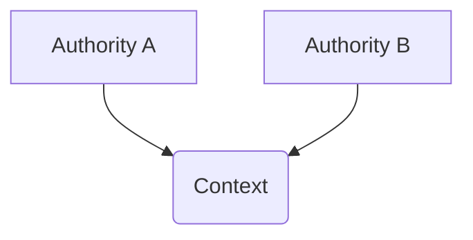

# Authority and Identity

This document describes the architecture of authorities and identity in Aura. It defines the authority model, the account authority model, the operator model, and the relational identity model. It explains how identity emerges through shared contexts rather than as a global property of keys.

## 1. Authority Model

An authority is a cryptographic actor represented by a public key. An authority hides its internal structure. An authority may contain one or more devices. An authority is the smallest unit that can sign facts or capabilities.

An authority has an internal journal namespace. The journal namespace stores facts relevant to that authority. The authority derives its state from deterministic reduction of that fact set. The authority does not expose any information about its devices or operators.

Devices are not exclusive to a single authority. A single device may hold threshold shares for multiple authorities at the same time. Joining a new authority adds signing capability for that authority without removing any existing authority memberships.

```rust
pub struct AuthorityId(Uuid);
```

This identifier selects the journal namespace associated with the authority. The identifier does not encode structure or membership. The authority publishes its current public key and root commitment inside its own journal.

Authorities can interact with other authorities through [relational contexts](103_relational_contexts.md). These interactions do not change the authority's internal structure. The authority remains isolated except where relational state is explicitly shared.

## 2. Account Authorities

An account authority is an authority with long term state. An account maintains device membership through its commitment tree. An account contains its own journal namespace. An account evolves through attested operations stored as facts.

An account authority uses a [commitment tree](101_accounts_and_commitment_tree.md) to define its internal threshold structure. The commitment tree stores device leaves and branch policies. The commitment tree determines which devices can sign operations under the account root. The account root commitment identifies the current state of the commitment tree.

Aura supports multiple key generation methods for account authorities: K1 (single-signer), K2 (dealer-based DKG), and K3 (quorum/BFT DKG). These are orthogonal to agreement modes (A1 provisional, A2 coordinator soft-safe, A3 consensus-finalized). Durable shared authority state must be finalized via A3, even when K1/K2 are used for local bootstrapping.

```rust
/// Authority trait representing an opaque cryptographic actor
pub trait Authority: Send + Sync {
    fn authority_id(&self) -> AuthorityId;
    fn public_key(&self) -> Ed25519VerifyingKey;
    fn root_commitment(&self) -> Hash32;
    async fn sign_operation(&self, operation: &[u8]) -> Result<Signature>;
    fn get_threshold(&self) -> u16;
    fn active_device_count(&self) -> usize;
}

/// Summary view of commitment tree state for external consumers
pub struct TreeStateSummary {
    epoch: Epoch,
    commitment: Hash32,
    threshold: u16,
    device_count: u32,
}
```

The `Authority` trait provides the external interface for authority operations. The `TreeStateSummary` provides a public view of tree state without exposing internal device structure. The reduction function computes the current state from the account journal. The account authority does not reveal device structure to external parties.

An account authority derives context specific keys using deterministic key derivation. These derived authorities represent application scoped identities. See [Core Systems Guide](802_core_systems_guide.md) for implementation examples. A derived authority does not expose any structure of the account authority.

## 3. Operators and Devices

An operator controls an authority by operating its devices. An operator is not represented in the protocol. Devices are internal to the authority and hold share material required for signing.

Devices produce partial signatures during threshold signing. The operator coordinates these partial signatures to produce the final signature.

The commitment tree manages device membership. The `AddLeaf` and `RemoveLeaf` operations modify device presence in the authority. Device identifiers do not appear outside the authority. No external party can link devices to authorities.

```rust
pub struct LeafNode {
    pub leaf_id: LeafId,
    pub device_id: DeviceId,
    pub role: LeafRole,  // Device or Guardian
    pub public_key: Vec<u8>,
    pub meta: Vec<u8>,
}
```

This leaf type is internal to the commitment tree. It is not visible outside the account authority. Leaf nodes support threshold signing but do not identify operators. The `role` field distinguishes between device leaves and guardian leaves for recovery purposes.

## 4. Relational Identity Model

Aura defines identity as contextual and relational. Identity exists only inside a specific relationship and does not exist globally. Authorities represent cryptographic actors rather than people. Identity emerges when two authorities form a shared context.

A shared context exists inside a relational context. A relational context stores relational facts that define how two authorities relate. Profile data may appear in a relational context if both authorities choose to share it. This profile data is scoped to that context and never becomes global.

```rust
pub struct ContextId(Uuid);
```

A `ContextId` identifies a relational context. It does not encode membership. It does not reveal which authorities participate. The context stores only the relational facts required by the participants.

Identity inside a context may include nickname suggestions or other profile attributes. These values are private to that context and no external party can observe them. See [Identifiers and Boundaries](105_identifiers_and_boundaries.md) for context isolation mechanisms. Nicknames (local mappings) allow a device to associate multiple authorities with a single local contact.

## 5. Authority Relationships

Authorities interact through relational contexts to create shared state. Relational contexts do not modify authority structure. Each relational context has its own journal. Facts in the relational context reference commitments of participating authorities.

Authorities may form long lived or ephemeral relationships. These relationships do not affect global identity. The authority model ensures that each relationship remains isolated. Each context provides a separate identity boundary.



This diagram shows two authorities interacting through a relational context. The context holds the relational facts that define the relationship. Neither authority exposes its internal structure to the other.

## 6. Privacy and Isolation

Authorities reveal no internal structure and contexts do not reveal participants. Identity exists only where authorities choose to share information. Nicknames remain local to devices. There is no global identifier for people or devices.

Every relationship is private to its participants. Each relationship forms its own identity layer. Authorities can operate in many contexts without linking those contexts together.

## 7. Summary

Authorities are cryptographic actors with private internal state. Accounts are authorities with commitment tree based state machines where operators control devices that implement authority operations. Identity emerges only inside relational contexts. No identifier in Aura encodes global identity since each context defines its own scope of identity meaning.

## See Also

- [Accounts and Commitment Tree](101_accounts_and_commitment_tree.md) - Implementation of account authority internal structure
- [Relational Contexts](103_relational_contexts.md) - Cross-authority relationship management
- [Identifiers and Boundaries](105_identifiers_and_boundaries.md) - Context isolation mechanisms
- [Core Systems Guide](802_core_systems_guide.md) - Practical implementation patterns
- [Privacy and Information Flow](003_information_flow_contract.md) - Privacy guarantees and isolation
