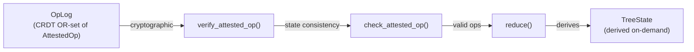
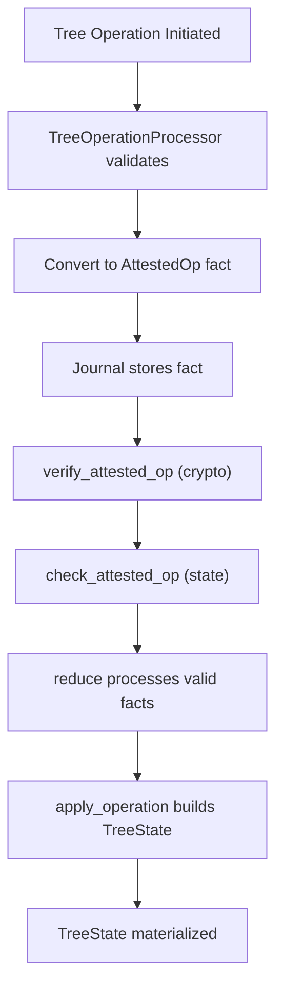
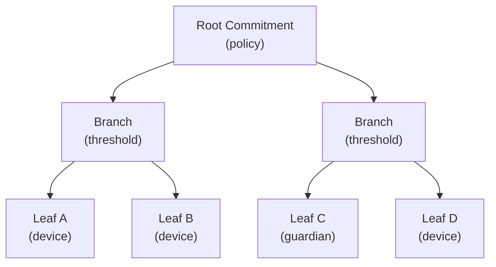

# Accounts and Commitment Tree

This document specifies the internal state machine of an account authority. It defines the commitment tree structure, available operations, reduction model, epoch semantics, and security properties. It describes when Aura Consensus is required and how the account state interacts with deterministic key derivation.

## 1. Account State Machine

An account authority maintains its internal state through a commitment tree and an account journal. The commitment tree defines device membership and threshold policies. The journal stores facts that represent signed tree operations. The reduction function reconstructs the canonical tree state from the accumulated fact set.

An account authority exposes a single public key. This public key is derived from the commitment tree root. The authority never exposes device structure. The account state changes only when an attested operation appears in the journal.

The `TreeState` structure represents the materialized state of an account at a specific epoch.

```rust
pub struct TreeState {
    pub epoch: Epoch,
    pub root_commitment: TreeHash32,
    pub branches: BTreeMap<NodeIndex, BranchNode>,
    pub leaves: BTreeMap<LeafId, LeafNode>,
    leaf_commitments: BTreeMap<LeafId, TreeHash32>,
    tree_topology: TreeTopology,
    branch_signing_keys: BTreeMap<NodeIndex, BranchSigningKey>,
}
```

The `epoch` field is monotonically increasing. The `root_commitment` is the hash of the entire tree structure. The `branches` map stores branch nodes by index. The `leaves` map stores leaf nodes by ID. The `leaf_commitments` map caches leaf commitment hashes. The `tree_topology` tracks parent-child relationships. The `branch_signing_keys` map stores FROST group public keys for verification.

TreeState is derived state and is never stored directly in the journal. It is computed on-demand from the OpLog via the reduction function.

A lightweight `TreeStateSummary` type in `aura-core` provides a public view with only `epoch`, `commitment`, `threshold`, and `device_count`. This summary hides internal device structure for external consumers while the full `TreeState` in `aura-journal` is used for internal operations.

```rust
pub struct BranchSigningKey {
    pub group_public_key: [u8; 32],
    pub key_epoch: Epoch,
}
```

A `BranchSigningKey` stores the FROST group public key for threshold signing at a branch node. The `key_epoch` tracks when the key was established via DKG. Signing keys are updated when membership changes under the branch or when policy changes affect the signing group.

## 2. Commitment Tree Structure

A commitment tree contains branch nodes and leaf nodes. A leaf node represents a device or guardian inside the account. A branch node represents a subpolicy with threshold requirements. Each node has an index and a commitment. The root node defines the account-level threshold policy.

```rust
pub enum NodeKind {
    Leaf(LeafNode),
    Branch,
}
```

This type defines leaf and branch variants. The `Leaf` variant contains a `LeafNode` with device information. The `Branch` variant is a marker indicating an internal node.

```rust
pub struct LeafNode {
    pub leaf_id: LeafId,
    pub device_id: DeviceId,
    pub role: LeafRole,
    pub public_key: Vec<u8>,
    pub meta: Vec<u8>,
}

pub enum LeafRole {
    Device,
    Guardian,
}
```

The `LeafNode` structure stores device information required for threshold signing. The `leaf_id` is a stable identifier across tree modifications. The `device_id` identifies the device within the authority. The `role` distinguishes devices from guardians. The `public_key` stores the serialized FROST key package or public key. The `meta` field stores optional opaque metadata.

```rust
pub struct BranchNode {
    pub node: NodeIndex,
    pub policy: Policy,
    pub commitment: TreeHash32,
}
```

The `BranchNode` structure stores policy data for internal nodes. The `node` field is the branch index. The `policy` defines the threshold requirement. The `commitment` is the cryptographic hash of the branch structure.

The commitment tree is ordered by node index. Children of a branch are ordered consistently for deterministic commitment calculation.

## 3. Tree Topology

The `TreeTopology` structure tracks parent-child relationships for efficient navigation.

```rust
pub struct TreeTopology {
    parent_pointers: BTreeMap<NodeIndex, NodeIndex>,
    children_pointers: BTreeMap<NodeIndex, BTreeSet<NodeIndex>>,
    leaf_parents: BTreeMap<LeafId, NodeIndex>,
    root_node: Option<NodeIndex>,
}
```

The `parent_pointers` map links nodes to their parents. The `children_pointers` map links parents to their children. The `leaf_parents` map links leaves to their parent branches. The `root_node` tracks the root of the tree.

This structure enables efficient path-to-root traversal and affected node computation during commitment updates.

## 4. Policies

A branch node contains a threshold policy. A policy describes the number of required signatures for authorization. Aura defines three policy forms.

```rust
pub enum Policy {
    Any,
    Threshold { m: u16, n: u16 },
    All,
}
```

The `Any` policy accepts one signature from any device under that branch. The `Threshold` policy requires `m` signatures out of `n` devices. The `All` policy requires all devices under the branch. Policies form a meet semilattice where the meet operation selects the stricter of two policies.

```rust
impl Policy {
    pub fn required_signers(&self, child_count: usize) -> u16 {
        match self {
            Policy::Any => 1,
            Policy::All => child_count as u16,
            Policy::Threshold { m, .. } => *m,
        }
    }
}
```

The `required_signers` method derives the concrete threshold from the policy given the current child count. This is used during signature verification to determine how many signers must have participated.

## 5. Tree Operations

Tree operations modify the commitment tree. Each operation references a parent epoch and parent commitment. Each operation is signed through threshold signing.

```rust
pub enum TreeOpKind {
    AddLeaf { leaf: LeafNode, under: NodeIndex },
    RemoveLeaf { leaf: LeafId, reason: u8 },
    ChangePolicy { node: NodeIndex, new_policy: Policy },
    RotateEpoch { affected: Vec<NodeIndex> },
}
```

The `AddLeaf` operation inserts a new leaf under a branch. The `RemoveLeaf` operation removes an existing leaf with a reason code. The `ChangePolicy` operation updates the policy of a branch. The `RotateEpoch` operation increments the epoch for affected nodes and invalidates derived context keys.

```rust
pub struct TreeOp {
    pub parent_epoch: Epoch,
    pub parent_commitment: TreeHash32,
    pub op: TreeOpKind,
    pub version: u16,
}
```

The `TreeOp` structure binds an operation to its parent state. The `parent_epoch` and `parent_commitment` prevent replay attacks. The `version` field enables protocol upgrades.

Each operation appears in the journal as an attested operation.

```rust
pub struct AttestedOp {
    pub op: TreeOp,
    pub agg_sig: Vec<u8>,
    pub signer_count: u16,
}
```

The `agg_sig` field stores the FROST aggregate signature. The `signer_count` records how many devices contributed. The signature validates under the parent root commitment. Devices refuse to sign if the local tree state does not match.

## 6. Tree Operation Verification

Tree operations use a two-phase verification model that separates cryptographic verification from state consistency checking.

### 6.1 Verification

The `verify_attested_op` function performs cryptographic signature checking only.

```rust
pub fn verify_attested_op(
    attested: &AttestedOp,
    signing_key: &BranchSigningKey,
    threshold: u16,
    current_epoch: Epoch,
) -> Result<(), VerificationError>;
```

Verification checks that the signer count meets the threshold requirement. It computes the binding message including the group public key. It verifies the FROST aggregate signature. Verification is self-contained and can be performed offline.

### 6.2 Check

The `check_attested_op` function performs full verification plus TreeState consistency.

```rust
pub fn check_attested_op<S: TreeStateView>(
    state: &S,
    attested: &AttestedOp,
    target_node: NodeIndex,
) -> Result<(), CheckError>;
```

Check verifies the operation cryptographically. It ensures the signing key exists for the target node. It validates the operation epoch matches state. It confirms the parent commitment matches state. Check is used during reduction and operation acceptance.

### 6.3 TreeStateView Trait

The `TreeStateView` trait abstracts over TreeState for verification.

```rust
pub trait TreeStateView {
    fn get_signing_key(&self, node: NodeIndex) -> Option<&BranchSigningKey>;
    fn get_policy(&self, node: NodeIndex) -> Option<&Policy>;
    fn child_count(&self, node: NodeIndex) -> usize;
    fn current_epoch(&self) -> Epoch;
    fn current_commitment(&self) -> TreeHash32;
}
```

This trait enables verification without a direct dependency on the journal crate.

### 6.4 Binding Message Security

The binding message includes the group public key to prevent signature reuse attacks.

```rust
pub fn compute_binding_message(
    attested: &AttestedOp,
    current_epoch: Epoch,
    group_public_key: &[u8; 32],
) -> Vec<u8>;
```

The binding message contains a domain separator, parent epoch and commitment for replay prevention, protocol version, current epoch, group public key, and serialized operation content. Including the group public key ensures signatures are bound to a specific signing group.

### 6.5 Error Types

Verification and check operations return typed errors.

```rust
pub enum VerificationError {
    MissingSigningKey(NodeIndex),
    InsufficientSigners { required: u16, provided: u16 },
    SignatureFailed(String),
    InvalidSignature(String),
    EpochMismatch { op_epoch: Epoch, current_epoch: Epoch },
    ParentCommitmentMismatch,
}

pub enum CheckError {
    VerificationFailed(VerificationError),
    KeyEpochMismatch { key_epoch: Epoch, current_epoch: Epoch },
    NodeNotFound(NodeIndex),
    PolicyNotFound(NodeIndex),
}
```

These errors provide precise information about verification failures.

## 7. Semilattice Model

The account journal is a join semilattice. It stores `AttestedOp` facts. All replicas merge fact sets using set union. The commitment tree state is recovered using deterministic reduction.

Reduction applies the following rules.

1. Group operations by parent state using `ParentKey`.
2. Select a single winner using a deterministic ordering based on operation hash.
3. Discard superseded operations.
4. Apply winners in parent epoch order.

```rust
pub struct ParentKey {
    pub epoch: Epoch,
    pub commitment: TreeHash32,
}
```

The `ParentKey` structure provides a hashable key for grouping operations by their parent state.

## 8. Conflict Resolution

Conflicts arise when multiple operations reference the same parent epoch and commitment. The reduction algorithm resolves conflicts using a total order on operations. The winning operation applies. Losing operations are ignored.

```rust
pub fn reduce(ops: &[AttestedOp]) -> Result<TreeState, ReductionError> {
    // 1. Build parent-child DAG
    let dag = build_dag(ops)?;

    // 2. Topological sort with tie-breaking
    let sorted_ops = topological_sort_with_tiebreak(&dag, ops)?;

    // 3. Apply operations in order
    let mut state = TreeState::new();
    for op in sorted_ops {
        apply_operation(&mut state, op)?;
    }

    Ok(state)
}
```

Conflict resolution uses operation hash as the tie-breaker. When multiple operations share the same parent, they are sorted by hash and the maximum hash wins. This ensures deterministic winner selection across all replicas.

## 9. Epochs

The epoch is an integer stored in the tree state. The epoch scopes deterministic key derivation. Derived keys depend on the current epoch. Rotation invalidates previous derived keys. The `RotateEpoch` operation updates the epoch for selected subtrees.

Epochs also scope flow budgets and context presence tickets. All context identities must refresh when the epoch changes.

## 10. Derived Context Keys

Derived context keys bind relationship data to the account state. The deterministic key derivation function uses the commitment tree root commitment and epoch. This ensures that all devices compute the same context keys.

Derived keys do not modify the tree state. They depend solely on reduced account state.

## 11. Interaction with Consensus

Consensus is used when a tree operation must have strong agreement across a committee. Consensus produces a commit fact containing a threshold signature. This fact becomes an attested operation in the journal.

Consensus is used when multiple devices must agree on the same prestate. Simple device-initiated changes may use local threshold signing. The account journal treats both cases identically.

Consensus references the root commitment and epoch of the account. This binds the commit fact to the current state.

## 12. Security Properties

The commitment tree provides fork resistance. Devices refuse to sign under mismatched parent commitments. The reduction function ensures that all replicas converge. Structural opacity hides device membership from external parties.

The threshold signature scheme prevents unauthorized updates. All operations must be signed by the required number of devices. An attacker cannot forge signatures or bypass policies.

The tree design ensures that no external party can identify device structure. The only visible values are the epoch and the root commitment.

## 13. Implementation Architecture

### 13.1 Core Architecture



This diagram shows the data flow from OpLog to TreeState. Operations are verified cryptographically first. Then they are checked for state consistency. Valid operations are reduced to produce the materialized TreeState.

### 13.2 Critical Invariants

The implementation enforces these rules.

1. TreeState is never stored in the journal. It is always derived on-demand via reduction.
2. OpLog is the only persisted tree data. All tree state can be recovered from the operation log.
3. Reduction is deterministic across all replicas. The same OpLog always produces the same TreeState.
4. DeviceId is authority-internal only. It is never exposed in public APIs.

### 13.3 Data Flow



This diagram shows the complete lifecycle of a tree operation from initiation to materialization.

### 13.4 Merkle Commitment Layout

The commitment tree commitment is a Merkle-style hash over ordered children. Leaves represent device shares. Branches represent threshold policies. The root commitment is the public authority commitment.



Each node commitment is computed over its ordered children plus its policy metadata. The root commitment is used in key derivation and verification.

### 13.5 Key Module Locations

Implementation files are in `aura-journal/src/commitment_tree/`.

- `state.rs`: TreeState structure and TreeStateView implementation
- `reduction.rs`: Deterministic reduction algorithm
- `operations.rs`: TreeOperationProcessor and TreeStateQuery
- `application.rs`: Operation application to TreeState
- `compaction.rs`: Garbage collection of superseded operations
- `attested_ops.rs`: AttestedOp fact handling

Verification code is in `aura-core/src/tree/verification.rs`. Type definitions are in `aura-core/src/tree/types.rs` and `aura-core/src/tree/policy.rs`.

## See Also

- [Authority and Identity](100_authority_and_identity.md) for the authority-centric identity model
- [Journal System](102_journal.md) for fact semantics and reduction flows
- [Consensus](104_consensus.md) for threshold signing and agreement
- [Cryptographic Architecture](116_crypto.md) for FROST and signing modes
