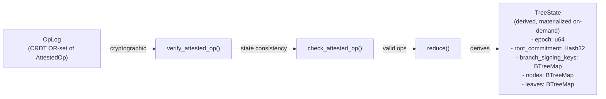
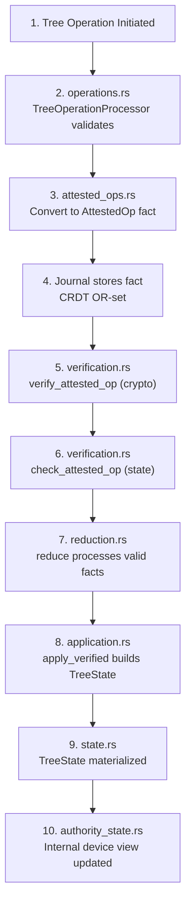
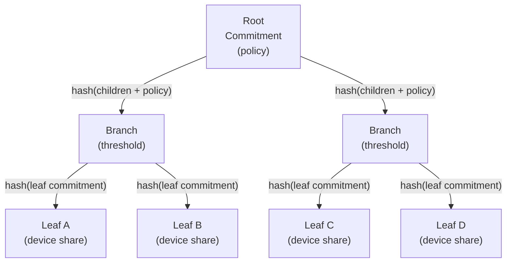

# Accounts and Commitment Tree

This document specifies the internal state machine of an account authority. It defines the commitment tree structure, available operations, reduction model, epoch semantics, and security properties. It describes when Aura Consensus is required and how the account state interacts with deterministic key derivation.

## 1. Account State Machine

An account authority maintains its internal state through a commitment tree and an account journal. The commitment tree defines device membership and threshold policies. The journal stores facts that represent signed tree operations. The reduction function reconstructs the canonical tree state from the accumulated fact set.

An account authority exposes a single public key. This public key is derived from the commitment tree root. The authority never exposes device structure. The account state changes only when an attested operation appears in the journal.

```rust
pub struct TreeState {
    pub epoch: Epoch,
    pub root_commitment: Hash32,
    pub branch_signing_keys: BTreeMap<NodeIndex, BranchSigningKey>,
}
```

This structure represents the reduced state of an account. The `epoch` and `root_commitment` are derived from the fact set. The `branch_signing_keys` map stores FROST group public keys for each branch node. External parties reference only the epoch and root commitment.

```rust
pub struct BranchSigningKey {
    pub group_public_key: [u8; 32],
    pub key_epoch: Epoch,
}
```

A `BranchSigningKey` stores the FROST group public key for threshold signing at a branch node. The `key_epoch` tracks when the key was established, allowing detection of stale keys after epoch rotation. Signing keys are derived from distributed key generation (DKG) among the devices under that branch.

## 2. Commitment Tree Structure

A commitment tree contains branch nodes and leaf nodes. A leaf node represents a device inside the account. A branch node represents a subpolicy. Each node has an index and a commitment. The root node defines the account-level threshold policy.

```rust
pub enum NodeKind {
    Leaf(LeafNode),
    Branch(BranchNode),
}
```

This type defines leaf and branch variants. Leaf nodes store device information required for threshold signing. Branch nodes store policy data. Each node contributes to the total commitment.

The commitment tree is ordered by node index. Children of a branch are ordered consistently. The ordering appears in the commitment calculation. This ensures identical structure across replicas.

## 3. Policies

A branch node contains a threshold policy. A policy describes the number of required signatures for authorization. Aura defines three policy forms.

```rust
pub enum Policy {
    Any,
    Threshold { m: u16, n: u16 },
    All,
}
```

This enum expresses the allowed policies. The `Any` policy accepts one signature from any device under that branch. The `Threshold` policy requires `m` signatures out of `n` devices. The `All` policy requires all devices under the branch. Policies form a meet semilattice. The meet selects the stricter of two policies.

The `required_signers()` method derives the concrete threshold from the policy given the current child count at the node:

```rust
impl Policy {
    pub fn required_signers(&self, child_count: usize) -> u16 {
        match self {
            Policy::Any => 1,
            Policy::All => child_count as u16,
            Policy::Threshold { m, .. } => *m,
        }
    }
}
```

This method is used during signature verification to determine how many signers must have participated in the threshold signing.

## 4. Tree Operations

Tree operations modify the commitment tree. Each operation references a parent epoch and parent commitment. Each operation is signed through threshold signing.

```rust
pub enum TreeOpKind {
    AddLeaf { leaf: LeafNode, under: NodeIndex },
    RemoveLeaf { leaf: LeafId, reason: u8 },
    ChangePolicy { node: NodeIndex, new_policy: Policy },
    RotateEpoch { affected: Vec<NodeIndex> },
}
```

These four operations modify device membership, branch policy, or epoch. The `AddLeaf` operation inserts a new leaf. The `RemoveLeaf` operation removes an existing leaf. The `ChangePolicy` operation updates the policy of a branch. The `RotateEpoch` operation increments the epoch for a set of nodes. Epoch rotation invalidates derived context keys.

Each operation appears in the journal as an attested operation.

```rust
pub struct AttestedOp {
    pub op: TreeOp,
    pub agg_sig: Vec<u8>,
    pub signer_count: u16,
}
```

The `agg_sig` field stores the FROST threshold signature produced by devices. The `signer_count` records how many devices contributed to the aggregate signature. The signature validates under the parent root commitment. Devices refuse to sign if the local tree state does not match.

## 4.1. Tree Operation Verification

Tree operations use a two-phase verification model that separates cryptographic verification from state consistency checking.

### Verification

**Verification** (`verify_attested_op`) performs cryptographic signature checking only:

1. Check signer count meets threshold requirement
2. Compute binding message (includes group public key)
3. Verify FROST aggregate signature

```rust
pub fn verify_attested_op(
    attested: &AttestedOp,
    signing_key: &BranchSigningKey,
    threshold: u16,
    current_epoch: Epoch,
) -> Result<(), VerificationError>;
```

Verification is self-contained. It can be performed with just the attested operation and the signing key. This enables offline verification and archival validation.

### Check

**Check** (`check_attested_op`) performs full verification plus TreeState consistency:

1. Verify the operation cryptographically
2. Ensure signing key exists for target node
3. Validate operation epoch matches state
4. Confirm parent commitment matches state

```rust
pub fn check_attested_op<S: TreeStateView>(
    state: &S,
    attested: &AttestedOp,
    target_node: NodeIndex,
) -> Result<(), CheckError>;
```

Check is used during reduction and operation acceptance. It ensures operations are both cryptographically valid and consistent with current state.

### Binding Message Security

The binding message includes the group public key to prevent signature reuse attacks:

```rust
pub fn compute_binding_message(
    attested: &AttestedOp,
    current_epoch: Epoch,
    group_public_key: &[u8; 32],
) -> Vec<u8>;
```

The binding message contains:
- Domain separator (`"TREE_OP_VERIFY"`)
- Parent epoch and commitment (replay prevention)
- Protocol version
- Current epoch
- **Group public key** (prevents key substitution attacks)
- Serialized operation content

Including the group public key ensures signatures are bound to a specific signing group. An attacker cannot substitute a different key they control and reuse a captured signature.

## 5. Semilattice Model

The account journal is a join semilattice. It stores `AttestedOp` facts. All replicas merge fact sets using set union. The commitment tree state is recovered using deterministic reduction.

Reduction applies the following rules.

1. Identify operations that reference the same parent state.
2. Select a single winner using a deterministic ordering:
   * Sort candidates by `(parent_commitment, op_hash)` where `op_hash = H(op_bytes || agg_sig)`.
   * If hashes match, break ties with the lexicographic ordering of `(agg_sig, op_bytes)`.
3. Discard superseded operations.
4. Apply winners in parent order.

This process yields a single tree state for any given fact set. All replicas with the same facts compute the same result.

## 6. Conflict Resolution

Conflicts arise when multiple operations reference the same parent epoch and commitment. The reduction algorithm resolves these conflicts using a total order on operations. The order is based on a stable hash. The winning operation applies. The losing operations are ignored for state calculation.

Conflict resolution ensures convergence. It also ensures that replicas remain consistent under concurrent updates.

### 6.1 Pseudocode

```rust
fn reduce_account(facts: &[AttestedOp]) -> TreeState {
    // Group ops by parent commitment + epoch
    let mut buckets: BTreeMap<ParentState, Vec<&AttestedOp>> = BTreeMap::new();
    for op in facts {
        let key = ParentState {
            commitment: op.op.parent_commitment,
            epoch: op.op.parent_epoch,
        };
        buckets.entry(key).or_default().push(op);
    }

    // Deterministic winner selection
    let mut winners: Vec<&AttestedOp> = Vec::new();
    for (_, ops) in buckets {
        let winner = ops.into_iter().max_by_key(|op| {
            let op_hash = hash(op);
            (op.op.parent_commitment, op_hash, op.agg_sig.clone(), op.op.clone())
        }).expect("non-empty bucket");
        winners.push(winner);
    }

    // Apply in parent order
    winners.sort_by_key(|op| op.op.parent_epoch);
    let mut state = TreeState::default();
    for op in winners {
        state = state.apply(op);
    }
    state
}
```

The implementation must follow this ordering so every replica reaches the same root commitment.

## 7. Epochs

The epoch is an integer stored in the tree state. The epoch scopes deterministic key derivation. Derived keys depend on the current epoch. Rotation invalidates previous derived keys. The `RotateEpoch` operation updates the epoch for selected subtrees.

Epochs also scope flow budgets and context presence tickets. All context identities must refresh when the epoch changes.

## 8. Derived Context Keys

Derived context keys bind relationship data to the account state. The deterministic key derivation function uses the commitment tree root commitment and epoch. This ensures that all devices compute the same context keys.

Derived keys do not modify the tree state. They depend solely on reduced account state.

## 9. Interaction with Consensus

Consensus is used when a tree operation must have strong agreement across a committee. Consensus produces a commit fact containing a threshold signature. This fact becomes an attested operation in the journal.

Consensus is used when multiple devices must agree on the same prestate. Simple device initiated changes may use local threshold signing. The account journal treats both cases identically.

Consensus references the root commitment and epoch of the account. This binds the commit fact to the current state.

## 10. Security Properties

The commitment tree provides fork resistance. Devices refuse to sign under mismatched parent commitments. The reduction function ensures that all replicas converge. Structural opacity hides device membership from external parties.

The threshold signature scheme prevents unauthorized updates. All operations must be signed by the required number of devices. An attacker cannot forge signatures or bypass policies.

The tree design ensures that no external party can identify device structure. The only visible values are the epoch and the root commitment.

## 11. Implementation Architecture

### Core Architecture Diagram



### Critical Invariants

The implementation enforces these fundamental rules:

1. **TreeState is NEVER stored in the journal** - It is always derived on-demand via reduction
2. **OpLog is the ONLY persisted tree data** - All tree state can be recovered from the operation log
3. **Reduction is DETERMINISTIC across all replicas** - Same OpLog always produces same TreeState
4. **DeviceId is authority-internal only** - Never exposed in public APIs (see `local_types.rs`)

### Data Flow



### Merkle Commitment Layout

The commitment tree commitment is a Merkle-style hash over ordered children; leaves represent device shares, branches represent threshold policies, and the root commitment is the public authority commitment.



Each node commitment is computed over its ordered children plus its policy metadata; the root commitment is the exported authority commitment used in key derivation and verification.

### Reduction Algorithm (reduction.rs)

The reduction function implements the deterministic conflict resolution described in §6:

```rust
fn reduce(facts: &[AttestedOp]) -> TreeState {
    // 1. Group ops by parent commitment + epoch
    // 2. Deterministic winner selection via H(op) ordering
    // 3. Apply winners in topological (parent) order
    // 4. Return materialized TreeState
}
```

### Operation Processing (operations.rs)

Three key abstractions for operation handling:

- **TreeOperationProcessor**: Validates and processes individual operations
- **BatchProcessor**: Efficient bulk operation processing
- **TreeStateQuery**: Query interface for derived tree state

### Compaction (compaction.rs)

Periodic garbage collection removes superseded operations:

```rust
fn compact(op_log: &[AttestedOp]) -> Vec<AttestedOp> {
    // 1. Reduce to current TreeState
    // 2. Identify superseded operations
    // 3. Return minimal op set that produces same state
}
```

Compaction reduces storage and speeds up reduction while preserving correctness.
