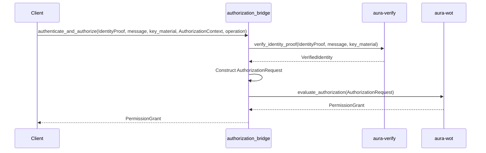

# Authentication vs Authorization

Aura maintains strict architectural separation between authentication (WHO) and authorization (WHAT) with clean integration patterns. Authentication verifies identity through cryptography. Authorization evaluates capabilities based on policy. These layers compose without coupling through the authorization bridge.

The authentication layer lives in `crates/aura-verify/` and `crates/aura-authenticate/`. The authorization layer lives in `crates/aura-wot/`. Integration occurs through `crates/aura-protocol/src/authorization_bridge.rs`.

See [Glossary](998_glossary.md) for terminology reference.

---

## Authentication Layer (WHO)

### aura-verify: Complete Identity Verification

The `aura-verify` crate provides complete identity verification combining cryptographic signatures and organizational device lifecycle. It answers "Did this key sign this message?" and "Is this device registered and active?"

Core responsibilities include:
- **Cryptographic verification**: Device, guardian, and threshold signature validation
- **Device registry management**: Device lifecycle tracking (Active, Suspended, Revoked)
- **Organizational identity**: Registration and status verification
- **Session ticket verification**: Authentication state management

**Cryptographic Verification Types:**
```rust
pub enum IdentityProof {
    Device { device_id: DeviceId, signature: Ed25519Signature },
    Guardian { guardian_id: GuardianId, signature: Ed25519Signature },
    Threshold(ThresholdSig),
}

pub struct VerifiedIdentity {
    pub proof_type: IdentityProofType,
    pub device_id: Option<DeviceId>,
    pub guardian_id: Option<GuardianId>,
    pub threshold_participants: Option<BTreeSet<DeviceId>>,
}

pub struct ThresholdSig {
    pub aggregated_signature: Vec<u8>,
    pub signer_indices: BTreeSet<usize>,
}
```

**Device Registry Types:**
```rust
pub struct IdentityVerifier {
    // Device registry service with lifecycle management
}

pub struct DeviceInfo {
    pub device_id: DeviceId,
    pub public_key: PublicKey,
    pub capabilities: CapabilitySet,
    pub status: DeviceStatus,
}

pub enum DeviceStatus {
    Active,
    Suspended,
    Revoked,
}

pub struct VerificationResult {
    pub verified: bool,
    pub confidence_score: f64,
}
```

**Key Functions:**
```rust
// Core verification function
pub fn verify_identity_proof(
    proof: &IdentityProof,
    message: &[u8],
    key_material: &KeyMaterial,
) -> Result<VerifiedIdentity, VerificationError>

// Device registry functions
impl IdentityVerifier {
    pub fn verify_device(&self, device_id: DeviceId) -> Result<DeviceInfo, Error>;
    pub fn update_device_status(&mut self, device_id: DeviceId, status: DeviceStatus) -> Result<(), Error>;
}

// Specific verification functions
pub fn verify_device_signature(device_id: DeviceId, signature: &[u8], message: &[u8]) -> Result<bool, Error>;
pub fn verify_guardian_signature(guardian_id: GuardianId, signature: &[u8], message: &[u8]) -> Result<bool, Error>;
pub fn verify_threshold_signature(threshold_sig: &ThresholdSig, message: &[u8]) -> Result<bool, Error>;
```

The verification combines cryptographic proof validation with organizational device lifecycle checks. It provides identity-only verification without policy evaluation.

### aura-authenticate: Choreographic Authentication Protocols

The `aura-authenticate` crate implements authentication ceremonies using choreographic programming. For complete choreographic programming documentation, see [Choreography System Reference](302_choreography_system.md). It defines multi-party session types for distributed authentication and coordinates protocol participants.

Responsibilities include device authentication ceremonies, session establishment with distributed coordination, and guardian authentication flows for recovery.

Authentication ceremonies use the choreographic protocol framework with roles like Requester, Authenticator, and Witness. For protocol composition patterns and implementation guidelines, see [Choreography System Reference](302_choreography_system.md#protocol-composition). The `AuthenticationResult` struct contains the verified identity, session ticket, and ceremony transcript.

This crate depends on `aura-verify` for cryptographic verification and adds choreographic coordination on top. The choreographic protocols use sealed supertraits for clean effect interfaces and guard capabilities for access control. The key components include:
```rust
/// Sealed supertrait for authentication effects
pub trait AuthenticationEffects: NetworkEffects + CryptoEffects + TimeEffects {}
impl<T> AuthenticationEffects for T where T: NetworkEffects + CryptoEffects + TimeEffects {}

// Choreographic authentication protocol
choreography! {
    #[namespace = "g_auth"]
    protocol GAuth {
        roles: Requester, Authenticator, Witness;
        
        Requester[guard_capability = "initiate_auth", flow_cost = 20] 
        -> Authenticator: AuthRequest(device_id: DeviceId, challenge: Vec<u8>);
        
        Authenticator[guard_capability = "respond_auth", flow_cost = 15, journal_facts = "auth_response_sent"] 
        -> Requester: AuthResponse(signature: Vec<u8>, session_ticket: SessionTicket);
    }
}

pub struct AuthenticationResult {
    pub verified_identity: VerifiedIdentity,
    pub session_ticket: SessionTicket,
    pub ceremony_transcript: Vec<AuthEvent>,
}
```

## Authorization Layer (WHAT)

### aura-wot: Capability-Based Authorization

The `aura-wot` crate implements capability-based access control using meet-semilattice operations. It answers "What is this identity allowed to do?" Capabilities follow mathematical laws where they can only shrink through intersection, never grow.

Responsibilities include:
- **Capability evaluation**: Computing effective capabilities through meet-semilattice operations
- **Policy enforcement**: Device-specific capability assignments
- **Delegation chains**: Proper capability attenuation through delegation
- **Storage and relay permissions**: Domain-specific authorization
- **Trust level evaluation**: Hierarchical trust assessment

**Key Types:**
```rust
pub enum Capability {
    Read, Write, Execute, Delegate, Admin, Relay, All, None
}

pub struct CapabilitySet {
    capabilities: BTreeSet<Capability>,
}

pub struct StoragePermission {
    content_read: bool,
    content_write: bool,
    // ... other storage permissions
}

pub struct RelayPermission {
    flow_budget_limit: u64,
    // ... other relay permissions
}

pub struct Policy {
    device_id: DeviceId,
    capabilities: CapabilitySet,
}

pub struct DelegationLink {
    delegator: DeviceId,
    delegatee: DeviceId,
    capabilities: CapabilitySet,
}

pub struct DelegationChain {
    links: Vec<DelegationLink>,
}

pub enum TrustLevel {
    None, Low, Medium, High
}
```

**Key Functions:**
```rust
// Core capability evaluation: Caps_eff := Policy ⊓ ⋂(Delegations) ⊓ ⋂(LocalChecks)
pub fn evaluate_capabilities(
    base_policy: &Policy,
    delegation_chains: &[DelegationChain],
    local_policy: &LocalPolicy,
) -> Result<CapabilitySet, Error>

pub fn effective_capabilities(context: &AuthorizationContext) -> CapabilitySet;
pub fn attenuate(caps: &CapabilitySet, restrictions: &CapabilitySet) -> CapabilitySet;

// Meet-semilattice operation (intersection only)
impl CapabilitySet {
    pub fn meet(&self, other: &CapabilitySet) -> CapabilitySet {
        CapabilitySet {
            capabilities: self.capabilities.intersection(&other.capabilities).cloned().collect()
        }
    }
}

// Domain-specific authorization
pub fn grants_storage_permission(caps: &CapabilitySet, required: &StoragePermission) -> bool;
pub fn evaluate_tree_operation_capabilities(
    operation: &TreeOp,
    context: &AuthorizationContext,
    policies: &PolicySet,
) -> Result<PermissionGrant, AuthorizationError>
```

**Meet-Semilattice Laws:**
All capability combinations use meet (⊓) operations that follow mathematical laws:

```rust
// Commutativity: a ⊓ b = b ⊓ a
assert_eq!(caps_a.meet(&caps_b), caps_b.meet(&caps_a));

// Associativity: (a ⊓ b) ⊓ c = a ⊓ (b ⊓ c)
assert_eq!(caps_a.meet(&caps_b).meet(&caps_c), caps_a.meet(&caps_b.meet(&caps_c)));

// Idempotency: a ⊓ a = a
assert_eq!(caps_a.meet(&caps_a), caps_a);

// Monotonicity: Capabilities only decrease or stay same
assert!(result_caps.is_subset_of(&original_caps));
```

The meet operation ensures capabilities can only shrink through intersection, never grow. This provides mathematical guarantees that delegation and policy restrictions are monotonically decreasing. Property-based tests verify these laws automatically.

## Integration: Authorization Bridge

The authorization bridge in `aura-protocol/src/authorization_bridge.rs` combines authentication and authorization in a clean composition pattern. It integrates `aura-verify` (identity proofs) with `aura-wot` (capabilities) to provide unified authorization decisions.

**Key Types:**
```rust
pub struct AuthorizationRequest {
    pub verified_identity: VerifiedIdentity,
    pub operation: TreeOp,
    pub context: AuthorizationContext,
}

pub struct AuthorizationContext {
    pub account_id: AccountId,
    pub base_capabilities: CapabilitySet,
    pub tree_context: TreeContext,
}

pub struct PermissionGrant {
    pub authorized: bool,
    pub effective_capabilities: CapabilitySet,
    pub denial_reason: Option<String>,
}
```



**Integration Functions:**
```rust
// Main authorization evaluation function
pub fn evaluate_authorization(
    request: AuthorizationRequest
) -> Result<PermissionGrant, AuthorizationError> {
    // 1. Extract entity ID (Device, Guardian, or Account)
    let entity_id = extract_entity_id(&request.verified_identity)?;
    
    // 2. Evaluate capabilities (aura-wot)
    let effective_caps = aura_wot::evaluate_capabilities(
        &base_policy,
        &delegation_chains,
        &local_policy
    )?;
    
    // 3. Return authorization decision
    Ok(PermissionGrant {
        authorized: operation_permitted(&request.operation, &effective_caps),
        effective_capabilities: effective_caps,
        denial_reason: None,
    })
}

// Combined identity + authorization in one step
pub fn authenticate_and_authorize(
    identity_proof: IdentityProof,           // FROM aura-verify
    message: &[u8],
    key_material: &KeyMaterial,
    authz_context: AuthorizationContext,     // FROM aura-wot
    operation: TreeOp,
    additional_signers: BTreeSet<DeviceId>,
    guardian_signers: BTreeSet<GuardianId>,
) -> Result<PermissionGrant, AuthorizationError> {
    // Step 1: Authentication - verify identity (WHO)
    let verified_identity = aura_verify::verify_identity_proof(
        &identity_proof,
        message,
        key_material
    )?;

    // Step 2: Authorization - evaluate capabilities (WHAT)
    let authz_request = AuthorizationRequest {
        verified_identity,
        operation,
        context: authz_context,
    };

    evaluate_authorization(authz_request)
}
```

**Integration Principles:**
- **Linear data flow**: No backtracking between authentication and authorization
- **Zero coupling**: Auth layers depend on interfaces, not implementations  
- **Composability**: Each layer can be used independently or combined
- **Testability**: Each layer tested independently before integration testing
- **Separation of concerns**: WHO (identity) is orthogonal to WHAT (authorization)
- **Meet-semilattice foundation**: All capability operations use intersection only

### Runtime Enforcement: Guard Chain and Send-Site Predicates

The guard system in `aura-protocol/src/guards/` enforces authorization at runtime. At every send site in a choreography, the runtime enforces a predicate and guard chain.

**Send-Site Predicate:** `need(operation) ≤ effective_capabilities ∧ headroom(context, cost)`

**Guard Chain Stages:**
1. **CapGuard**: Evaluates capability requirements using `aura-wot`
2. **FlowGuard**: Checks privacy budget availability and leakage limits  
3. **JournalCoupler**: Handles CRDT state updates and journal synchronization

```rust
// Guard chain types
pub struct ProtocolGuard {
    capability_requirements: CapabilitySet,
    delta_application: JournalDelta,
    leakage_budget: LeakageBudget,
}

pub struct GuardedExecutionResult {
    pub authorized: bool,
    pub guard_metrics: GuardMetrics,
}

// Send guard enforcement
pub fn create_send_guard(
    message: &Message,
    context: &ExecutionContext
) -> Result<SendGuard, GuardError> {
    // Enforces: need(msg) ≤ Caps(ctx) ∧ headroom(ctx, cost)
}

// Guarded execution
pub fn execute_with_effects(
    operation: &Operation,
    context: &Context
) -> Result<GuardedExecutionResult, Error>
```

If any guard fails, the step executes locally without sending network packets. This provides fail-safe authorization where operations degrade gracefully rather than failing completely.

See [System Architecture](002_system_architecture.md) section 1.6 for complete guard chain details.

## Effect System Integration

### Unified Effect Interfaces

The auth and authz layers integrate with Aura's effect system through unified traits. `AuthenticationEffects` provides device authentication, session ticket retrieval, and authentication status checking. `AgentEffects` provides capability verification, tree operation evaluation, and unified authorization operations.

Authentication effects interface:

```rust
#[async_trait]
pub trait AuthenticationEffects: Send + Sync {
    async fn authenticate_device(&self)
        -> Result<AuthenticationResult>;
    async fn is_authenticated(&self) -> Result<bool>;
    async fn get_session_ticket(&self)
        -> Result<Option<SessionTicket>>;
}
```

Agent effects use the authorization bridge internally. The `authorize_operation` method takes an operation request and returns a permission grant after both authentication and authorization.

### Runtime Composition

The `AuraEffectSystem` composes authentication and authorization effects. Production systems use real cryptographic verification. Testing systems use deterministic mocks. Simulation systems use seeded randomness.

Creating a production effect system and executing authorization:

```rust
let config = EffectSystemConfig::for_production(device_id)?;
let effects = AuraEffectSystem::new(config)?;
let result = effects.authorize_operation(request).await?;
```

The effect system handles all composition internally. Callers invoke unified interfaces without awareness of component separation.

## System Components

The authentication system consists of cryptographic identity verification through `aura-verify`, capability-based authorization through `aura-wot`, seamless integration through the authorization bridge, and effect system integration with unified traits.

Choreographic protocol infrastructure in `aura-authenticate` provides ceremony implementations for multi-party authentication scenarios. Advanced policies support fine-grained delegation with guardian coordination ceremonies, capability constraints, and delegated authority for specific operations.

## Usage Patterns

### Pure Authentication

Direct use of `aura-verify` for identity verification:

```rust
use aura_verify::{verify_identity_proof, IdentityProof};

let proof = IdentityProof::Device {
    device_id,
    signature
};
let verified = verify_identity_proof(
    &proof,
    message,
    &key_material
)?;
```

This pattern applies when only identity verification is needed without authorization evaluation.

### Pure Authorization

Direct use of `aura-wot` for capability evaluation:

```rust
use aura_wot::{
    evaluate_tree_operation_capabilities,
    AuthorizationContext
};

let grant = evaluate_tree_operation_capabilities(
    &tree_op,
    &authz_context,
    &policies
)?;
```

This pattern applies when authorization is needed with already-verified identity.

### Integrated Flow

Using the authorization bridge for complete authentication and authorization:

```rust
use aura_protocol::authorization_bridge::
    authenticate_and_authorize;

let permission = authenticate_and_authorize(
    identity_proof,
    message,
    &key_material,
    authz_context,
    tree_op,
    additional_signers,
    guardian_signers
)?;
```

This pattern integrates both layers in a single operation with no explicit composition required.

### Effect System Usage

Using unified effects for authentication and authorization:

```rust
let config = EffectSystemConfig::for_production(device_id)?;
let effects = AuraEffectSystem::new(config)?;
let result = effects.authorize_operation(request).await?;
```

The effect system abstracts all composition and handler selection. Callers interact with unified traits regardless of underlying implementation.

## Design Principles

Authentication and authorization separation provides clear responsibility boundaries. Authentication verifies identity through cryptography without policy knowledge. Authorization evaluates policy without cryptographic operations. The bridge orchestrates composition without coupling.

Meet-semilattice capabilities provide formal mathematical foundations. Property-based tests verify algebraic laws automatically. Choreographic protocols ensure deadlock-free distributed coordination.

Dependency injection and effect systems provide integration flexibility. Layers depend on interfaces not implementations. Each layer can be tested independently before testing integration points with mocks.

## Guardian-Specific Authorization

Guardian authorization for recovery operations uses specialized logic in `aura-protocol/src/handlers/guardian/authorization.rs`:

```rust
pub struct GuardianAuthorizationContext {
    pub recovery_context: RecoveryContext,
    pub threshold_requirements: ThresholdConfig,
}

pub enum RecoveryOperationType {
    DeviceKeyRecovery,
    AccountAccessRecovery, 
    GuardianSetModification,
    EmergencyFreeze,
}

pub struct GuardianThresholdResult {
    pub threshold_met: bool,
    pub signature_count: usize,
    pub required_count: usize,
}

pub fn evaluate_guardian_authorization(
    context: &GuardianAuthorizationContext,
    guardian_signatures: &[GuardianSignature]
) -> Result<GuardianThresholdResult, Error>
```

Guardian authorization combines:
1. **Guardian identity verification**: Using `aura-verify` for signature validation
2. **Guardian capability evaluation**: Using `aura-wot` for recovery permissions
3. **Threshold validation**: M-of-N approval collection and validation
4. **Recovery operation authorization**: Operation-specific permission checks

See [Glossary](998_glossary.md) for complete terminology. See [System Architecture](002_system_architecture.md) for effect system details. See [Journal System](105_journal_system.md) for journal and ledger separation.
