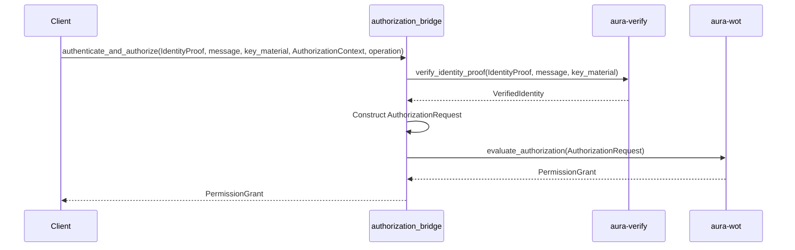

# Authentication vs Authorization Architecture

Aura maintains strict architectural separation between authentication (WHO) and authorization (WHAT) with clean integration patterns. Authentication verifies identity through cryptography. Authorization evaluates capabilities based on policy. These layers compose without coupling through the authorization bridge.

The authentication layer lives in `crates/aura-verify/` and `crates/aura-authenticate/`. The authorization layer lives in `crates/aura-wot/`. Integration occurs through `crates/aura-protocol/src/authorization_bridge.rs`.

See [Glossary](998_glossary.md) for terminology reference.

---

## Authentication Layer (WHO)

### aura-verify: Pure Cryptographic Identity Verification

The `aura-verify` crate provides stateless cryptographic verification. It verifies that a specific device, guardian, or threshold group signed a message. It contains no policy knowledge and maintains no authorization context.

Core responsibilities include device signature verification, guardian signature verification, threshold signature verification, and session ticket verification.

The `IdentityProof` enum represents proof types:
```rust
pub enum IdentityProof {
    Device { device_id: DeviceId, signature: Ed25519Signature },
    Guardian { guardian_id: GuardianId, signature: Ed25519Signature },
    Threshold(ThresholdSig),
}

pub struct VerifiedIdentity {
    pub proof_type: IdentityProofType,
    pub device_id: Option<DeviceId>,
    pub guardian_id: Option<GuardianId>,
    pub threshold_participants: Option<BTreeSet<DeviceId>>,
}

// Core verification function
pub fn verify_identity_proof(
    proof: &IdentityProof,
    message: &[u8],
    key_material: &KeyMaterial,
) -> Result<VerifiedIdentity, VerificationError>
```

The `verify_identity_proof` function takes a proof, message, and key material. It returns a `VerifiedIdentity` containing the verified party and proof type. The function performs only cryptographic verification without policy evaluation.

### aura-authenticate: Choreographic Authentication Protocols

The `aura-authenticate` crate implements authentication ceremonies using choreographic programming. For complete choreographic programming documentation, see [Choreography System Reference](302_choreography_system.md). It defines multi-party session types for distributed authentication and coordinates protocol participants.

Responsibilities include device authentication ceremonies, session establishment with distributed coordination, and guardian authentication flows for recovery.

Authentication ceremonies use the choreographic protocol framework with roles like Requester, Authenticator, and Witness. For protocol composition patterns and implementation guidelines, see [Choreography System Reference](302_choreography_system.md#protocol-composition). The `AuthenticationResult` struct contains the verified identity, session ticket, and ceremony transcript.

This crate depends on `aura-verify` for cryptographic verification and adds choreographic coordination on top. The choreographic protocols use sealed supertraits for clean effect interfaces and guard capabilities for access control. The key components include:
```rust
/// Sealed supertrait for authentication effects
pub trait AuthenticationEffects: NetworkEffects + CryptoEffects + TimeEffects {}
impl<T> AuthenticationEffects for T where T: NetworkEffects + CryptoEffects + TimeEffects {}

// Choreographic authentication protocol
aura_choreography! {
    #[namespace = "g_auth"]
    protocol GAuth {
        roles: Requester, Authenticator, Witness;
        
        Requester[guard_capability = "initiate_auth", flow_cost = 20] 
        -> Authenticator: AuthRequest(device_id: DeviceId, challenge: Vec<u8>);
        
        Authenticator[guard_capability = "respond_auth", flow_cost = 15, journal_facts = "auth_response_sent"] 
        -> Requester: AuthResponse(signature: Vec<u8>, session_ticket: SessionTicket);
    }
}

pub struct AuthenticationResult {
    pub verified_identity: VerifiedIdentity,
    pub session_ticket: SessionTicket,
    pub ceremony_transcript: Vec<AuthEvent>,
}
```

## Authorization Layer (WHAT)

### aura-wot: Capability-Based Authorization

The `aura-wot` crate implements capability-based access control using meet-semilattice operations. Capabilities follow laws where they can only shrink through intersection, never grow.

Responsibilities include capability operations following meet-semilattice laws, policy enforcement for tree operations, delegation chains with proper attenuation, and storage access control.

The `CapabilitySet` struct implements the meet operation:
```rust
pub struct CapabilitySet {
    capabilities: BTreeSet<Capability>,
}

impl CapabilitySet {
    // Meet-semilattice operation (intersection only)
    pub fn meet(&self, other: &CapabilitySet) -> CapabilitySet {
        CapabilitySet {
            capabilities: self.capabilities.intersection(&other.capabilities).cloned().collect()
        }
    }
}

pub fn evaluate_tree_operation_capabilities(
    operation: &TreeOp,
    context: &AuthorizationContext,
    policies: &PolicySet,
) -> Result<PermissionGrant, AuthorizationError>
```

The meet operation produces a result that is always a subset of both inputs. This ensures capabilities can only shrink through intersection. The `evaluate_tree_operation_capabilities` function takes a tree operation and authorization context and returns a permission grant.

Meet-semilattice laws hold for capability operations. Associativity means `a.meet(b.meet(c))` equals `a.meet(b).meet(c)`. Commutativity means `a.meet(b)` equals `b.meet(a)`. Idempotence means `a.meet(a)` equals `a`. Property-based tests verify these laws automatically.

## Integration: Authorization Bridge

The authorization bridge combines authentication and authorization in a clean composition pattern. It takes an identity proof, message, and authorization context. It verifies identity first, then evaluates authorization using the verified identity.



The `authenticate_and_authorize` function implements the integration:
```rust
pub fn authenticate_and_authorize(
    identity_proof: IdentityProof,           // FROM aura-verify
    message: &[u8],
    key_material: &KeyMaterial,
    authz_context: AuthorizationContext,     // FROM aura-wot
    operation: TreeOp,
    additional_signers: BTreeSet<DeviceId>,
    guardian_signers: BTreeSet<GuardianId>,
) -> Result<PermissionGrant, AuthorizationError> {
    // Step 1: Authentication - verify identity (WHO)
    let verified_identity = aura_verify::verify_identity_proof(
        &identity_proof,
        message,
        key_material
    )?;

    // Step 2: Authorization - evaluate capabilities (WHAT)
    let authz_request = AuthorizationRequest {
        verified_identity,
        operation,
        context: authz_context,
        additional_context: /* ... */
    };

    aura_wot::evaluate_authorization(authz_request)
}
```

Integration principles include linear data flow without backtracking, zero coupling between auth layers, and composability for scenarios requiring only authentication or only authorization. Each layer can be tested independently before testing the bridge with mocks.

### Guard Chain and Send-Site Predicates

At every send site in a choreography, the runtime enforces a predicate and guard chain. The predicate checks that required capabilities exist and headroom is available: `need(m) <= Caps(ctx) AND headroom(ctx, cost)`.

The guard chain enforces three stages in order. `CapGuard` evaluates capability requirements. `FlowGuard` checks privacy budget availability. `JournalCoupler` handles CRDT state updates. If any guard fails, the step executes locally without sending packets.

See [System Architecture](002_system_architecture.md) section 1.6 for guard chain details. See [Theoretical Foundations](001_theoretical_foundations.md) sections 2.4 and 5.3 for privacy contract theory.

## Effect System Integration

### Unified Effect Interfaces

The auth and authz layers integrate with Aura's effect system through unified traits. `AuthenticationEffects` provides device authentication, session ticket retrieval, and authentication status checking. `AgentEffects` provides capability verification, tree operation evaluation, and unified authorization operations.

Authentication effects interface:

```rust
#[async_trait]
pub trait AuthenticationEffects: Send + Sync {
    async fn authenticate_device(&self)
        -> Result<AuthenticationResult>;
    async fn is_authenticated(&self) -> Result<bool>;
    async fn get_session_ticket(&self)
        -> Result<Option<SessionTicket>>;
}
```

Agent effects use the authorization bridge internally. The `authorize_operation` method takes an operation request and returns a permission grant after both authentication and authorization.

### Runtime Composition

The `AuraEffectSystem` composes authentication and authorization effects. Production systems use real cryptographic verification. Testing systems use deterministic mocks. Simulation systems use seeded randomness.

Creating a production effect system and executing authorization:

```rust
let effects = AuraEffectSystem::for_production(device_id)?;
let result = effects.authorize_operation(request).await?;
```

The effect system handles all composition internally. Callers invoke unified interfaces without awareness of component separation.

## Implementation Status

Fully working components include pure cryptographic identity verification in `aura-verify`, capability-based authorization in `aura-wot`, clean integration through the authorization bridge, and effect system integration with unified traits.

Components in progress include choreographic protocol infrastructure in `aura-authenticate` with ceremony implementations pending, and advanced policies for fine-grained delegation.

Planned components include complex guardian coordination ceremonies, time-based and location-based capability constraints, and delegated authority for specific operations.

## Usage Patterns

### Pure Authentication

Direct use of `aura-verify` for identity verification:

```rust
use aura_verify::{verify_identity_proof, IdentityProof};

let proof = IdentityProof::Device {
    device_id,
    signature
};
let verified = verify_identity_proof(
    &proof,
    message,
    &key_material
)?;
```

This pattern applies when only identity verification is needed without authorization evaluation.

### Pure Authorization

Direct use of `aura-wot` for capability evaluation:

```rust
use aura_wot::{
    evaluate_tree_operation_capabilities,
    AuthorizationContext
};

let grant = evaluate_tree_operation_capabilities(
    &tree_op,
    &authz_context,
    &policies
)?;
```

This pattern applies when authorization is needed with already-verified identity.

### Integrated Flow

Using the authorization bridge for complete authentication and authorization:

```rust
use aura_protocol::authorization_bridge::
    authenticate_and_authorize;

let permission = authenticate_and_authorize(
    identity_proof,
    message,
    &key_material,
    authz_context,
    tree_op,
    additional_signers,
    guardian_signers
)?;
```

This pattern integrates both layers in a single operation with no explicit composition required.

### Effect System Usage

Using unified effects for authentication and authorization:

```rust
let effects = AuraEffectSystem::for_production(device_id)?;
let result = effects.authorize_operation(request).await?;
```

The effect system abstracts all composition and handler selection. Callers interact with unified traits regardless of underlying implementation.

## Design Principles

Authentication and authorization separation provides clear responsibility boundaries. Authentication verifies identity through cryptography without policy knowledge. Authorization evaluates policy without cryptographic operations. The bridge orchestrates composition without coupling.

Meet-semilattice capabilities provide formal mathematical foundations. Property-based tests verify algebraic laws automatically. Choreographic protocols ensure deadlock-free distributed coordination.

Dependency injection and effect systems provide integration flexibility. Layers depend on interfaces not implementations. Each layer can be tested independently before testing integration points with mocks.

See [Glossary](099_glossary.md) for complete terminology. See [System Architecture](002_system_architecture.md) for effect system details. See [Journal Architecture](105_journal.md) for journal and ledger separation.
