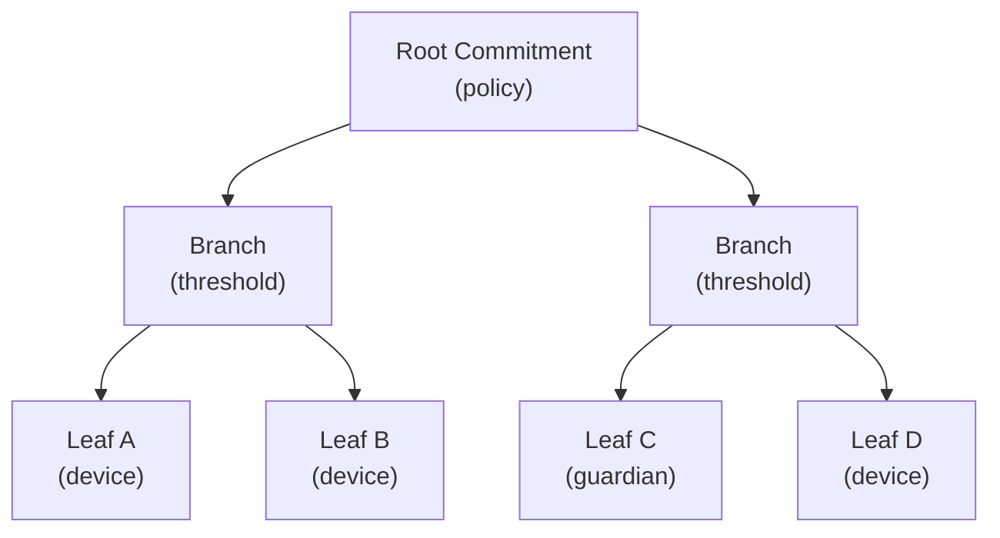
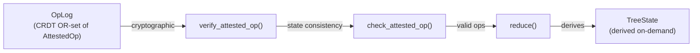
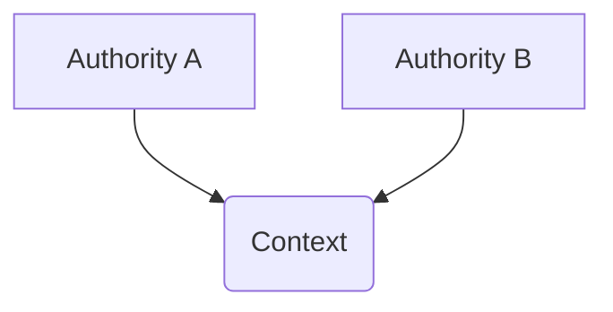
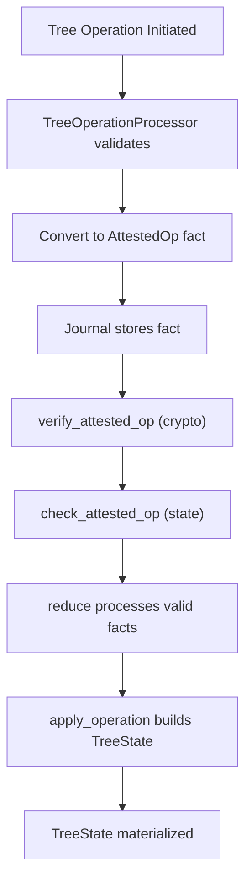

# Authority and Identity

This document describes the architecture of authorities and identity in Aura. It defines the authority model, account state machine, commitment tree structure, and relational identity model. Identity emerges through shared contexts rather than as a global property of keys.

## 1. Authority Model

An authority is a cryptographic actor represented by a public key. An authority hides its internal structure. An authority may contain one or more devices. An authority is the smallest unit that can sign facts or capabilities.

An authority has an internal journal namespace. The journal namespace stores facts relevant to that authority. The authority derives its state from deterministic reduction of that fact set.

Devices are not exclusive to a single authority. A single device may hold threshold shares for multiple authorities at the same time. Joining a new authority adds signing capability for that authority without removing any existing authority memberships.

```rust
pub struct AuthorityId(Uuid);
```

This identifier selects the journal namespace associated with the authority. The identifier does not encode structure or membership. The authority publishes its current public key and root commitment inside its own journal.

Authorities can interact with other authorities through [Relational Contexts](112_relational_contexts.md). These interactions do not change the authority's internal structure. The authority remains isolated except where relational state is explicitly shared.

## 2. Account Authorities

An account authority is an authority with long term state. An account maintains device membership through its commitment tree. An account contains its own journal namespace. An account evolves through attested operations stored as facts.

The commitment tree defines device membership and threshold policies. The journal stores facts that represent signed tree operations. The reduction function reconstructs the canonical tree state from the accumulated fact set.

An account authority exposes a single public key derived from the commitment tree root. The authority never exposes device structure. The account state changes only when an attested operation appears in the journal.

Aura supports multiple key generation methods for account authorities. K1 uses single-signer local key generation. K2 uses dealer-based DKG with a trusted coordinator. K3 uses quorum/BFT DKG with consensus-finalized transcripts. These are orthogonal to agreement modes (A1 provisional, A2 coordinator soft-safe, A3 consensus-finalized). Durable shared authority state must be finalized via A3.

```rust
pub trait Authority: Send + Sync {
    fn authority_id(&self) -> AuthorityId;
    fn public_key(&self) -> Ed25519VerifyingKey;
    fn root_commitment(&self) -> Hash32;
    async fn sign_operation(&self, operation: &[u8]) -> Result<Signature>;
    fn get_threshold(&self) -> u16;
    fn active_device_count(&self) -> usize;
}
```

The `Authority` trait provides the external interface for authority operations. The trait exposes only the public key, root commitment, and signing capabilities. The internal device structure remains hidden from external consumers.

An account authority derives context specific keys using deterministic key derivation. These derived authorities represent application scoped identities. See [Core Systems Guide](802_core_systems_guide.md) for implementation examples.

## 3. Account State Machine

The `TreeState` structure represents the materialized state of an account at a specific epoch.

```rust
pub struct TreeState {
    pub epoch: Epoch,
    pub root_commitment: TreeHash32,
    pub branches: BTreeMap<NodeIndex, BranchNode>,
    pub leaves: BTreeMap<LeafId, LeafNode>,
    leaf_commitments: BTreeMap<LeafId, TreeHash32>,
    tree_topology: TreeTopology,
    branch_signing_keys: BTreeMap<NodeIndex, BranchSigningKey>,
}
```

The `epoch` field is monotonically increasing. The `root_commitment` is the hash of the entire tree structure. The `branches` map stores branch nodes by index. The `leaves` map stores leaf nodes by ID.

The `leaf_commitments` map caches leaf commitment hashes. The `tree_topology` tracks parent-child relationships. The `branch_signing_keys` map stores FROST group public keys for verification.

TreeState is derived state and is never stored directly in the journal. It is computed on-demand from the OpLog via the reduction function.

```rust
pub struct TreeStateSummary {
    epoch: Epoch,
    commitment: Hash32,
    threshold: u16,
    device_count: u32,
}
```

The `TreeStateSummary` provides a public view with only epoch, commitment, threshold, and device count. This summary hides internal device structure for external consumers while the full TreeState is used for internal operations.

## 4. Commitment Tree Structure

A commitment tree contains branch nodes and leaf nodes. A leaf node represents a device or guardian inside the account. A branch node represents a subpolicy with threshold requirements. The root node defines the account-level threshold policy.

```rust
pub enum NodeKind {
    Leaf(LeafNode),
    Branch,
}
```

This type defines leaf and branch variants. The `Leaf` variant contains a `LeafNode` with device information. The `Branch` variant is a marker indicating an internal node.

```rust
pub struct LeafNode {
    pub leaf_id: LeafId,
    pub device_id: DeviceId,
    pub role: LeafRole,
    pub public_key: Vec<u8>,
    pub meta: Vec<u8>,
}

pub enum LeafRole {
    Device,
    Guardian,
}
```

The `LeafNode` structure stores device information required for threshold signing. The `leaf_id` is a stable identifier across tree modifications. The `device_id` identifies the device within the authority. The `role` distinguishes devices from guardians.

```rust
pub struct BranchNode {
    pub node: NodeIndex,
    pub policy: Policy,
    pub commitment: TreeHash32,
}
```

The `BranchNode` structure stores policy data for internal nodes. The `node` field is the branch index. The `policy` defines the threshold requirement. The `commitment` is the cryptographic hash of the branch structure.

```rust
pub struct BranchSigningKey {
    pub group_public_key: [u8; 32],
    pub key_epoch: Epoch,
}
```

A `BranchSigningKey` stores the FROST group public key for threshold signing at a branch node. The `key_epoch` tracks when the key was established via DKG. Signing keys are updated when membership changes under the branch or when policy changes affect the signing group.

## 5. Tree Topology

The `TreeTopology` structure tracks parent-child relationships for efficient navigation.

```rust
pub struct TreeTopology {
    parent_pointers: BTreeMap<NodeIndex, NodeIndex>,
    children_pointers: BTreeMap<NodeIndex, BTreeSet<NodeIndex>>,
    leaf_parents: BTreeMap<LeafId, NodeIndex>,
    root_node: Option<NodeIndex>,
}
```

The `parent_pointers` map links nodes to their parents. The `children_pointers` map links parents to their children. The `leaf_parents` map links leaves to their parent branches. The `root_node` tracks the root of the tree.

This structure enables efficient path-to-root traversal and affected node computation during commitment updates.



Each node commitment is computed over its ordered children plus its policy metadata. The root commitment is used in key derivation and verification. Leaves represent device shares. Branches represent threshold policies.

## 6. Policies

A branch node contains a threshold policy. A policy describes the number of required signatures for authorization.

```rust
pub enum Policy {
    Any,
    Threshold { m: u16, n: u16 },
    All,
}
```

The `Any` policy accepts one signature from any device under that branch. The `Threshold` policy requires `m` signatures out of `n` devices. The `All` policy requires all devices under the branch.

Policies form a meet semilattice where the meet operation selects the stricter of two policies.

```rust
impl Policy {
    pub fn required_signers(&self, child_count: usize) -> u16 {
        match self {
            Policy::Any => 1,
            Policy::All => child_count as u16,
            Policy::Threshold { m, .. } => *m,
        }
    }
}
```

The `required_signers` method derives the concrete threshold from the policy given the current child count. This is used during signature verification to determine how many signers must have participated.

## 7. Tree Operations

Tree operations modify the commitment tree. Each operation references a parent epoch and parent commitment. Each operation is signed through threshold signing.

```rust
pub enum TreeOpKind {
    AddLeaf { leaf: LeafNode, under: NodeIndex },
    RemoveLeaf { leaf: LeafId, reason: u8 },
    ChangePolicy { node: NodeIndex, new_policy: Policy },
    RotateEpoch { affected: Vec<NodeIndex> },
}
```

The `AddLeaf` operation inserts a new leaf under a branch. The `RemoveLeaf` operation removes an existing leaf with a reason code. The `ChangePolicy` operation updates the policy of a branch. The `RotateEpoch` operation increments the epoch for affected nodes and invalidates derived context keys.

```rust
pub struct TreeOp {
    pub parent_epoch: Epoch,
    pub parent_commitment: TreeHash32,
    pub op: TreeOpKind,
    pub version: u16,
}
```

The `TreeOp` structure binds an operation to its parent state. The `parent_epoch` and `parent_commitment` prevent replay attacks. The `version` field enables protocol upgrades.

```rust
pub struct AttestedOp {
    pub op: TreeOp,
    pub agg_sig: Vec<u8>,
    pub signer_count: u16,
}
```

The `agg_sig` field stores the FROST aggregate signature. The `signer_count` records how many devices contributed. The signature validates under the parent root commitment. Devices refuse to sign if the local tree state does not match.

## 8. Tree Operation Verification

Tree operations use a two-phase verification model that separates cryptographic verification from state consistency checking.

### 8.1 Cryptographic Verification

The `verify_attested_op` function performs cryptographic signature checking only.

```rust
pub fn verify_attested_op(
    attested: &AttestedOp,
    signing_key: &BranchSigningKey,
    threshold: u16,
    current_epoch: Epoch,
) -> Result<(), VerificationError>;
```

Verification checks that the signer count meets the threshold requirement. It computes the binding message including the group public key. It verifies the FROST aggregate signature. Verification is self-contained and can be performed offline.

### 8.2 State Consistency Check

The `check_attested_op` function performs full verification plus TreeState consistency.

```rust
pub fn check_attested_op<S: TreeStateView>(
    state: &S,
    attested: &AttestedOp,
    target_node: NodeIndex,
) -> Result<(), CheckError>;
```

Check verifies the operation cryptographically. It ensures the signing key exists for the target node. It validates that the operation epoch and parent commitment match state.

### 8.3 TreeStateView Trait

```rust
pub trait TreeStateView {
    fn get_signing_key(&self, node: NodeIndex) -> Option<&BranchSigningKey>;
    fn get_policy(&self, node: NodeIndex) -> Option<&Policy>;
    fn child_count(&self, node: NodeIndex) -> usize;
    fn current_epoch(&self) -> Epoch;
    fn current_commitment(&self) -> TreeHash32;
}
```

This trait abstracts over TreeState for verification. It enables verification without a direct dependency on the journal crate.

### 8.4 Binding Message Security

```rust
pub fn compute_binding_message(
    attested: &AttestedOp,
    current_epoch: Epoch,
    group_public_key: &[u8; 32],
) -> Vec<u8>;
```

The binding message contains a domain separator, parent epoch and commitment for replay prevention, protocol version, current epoch, group public key, and serialized operation content. Including the group public key ensures signatures are bound to a specific signing group.

### 8.5 Error Types

```rust
pub enum VerificationError {
    MissingSigningKey(NodeIndex),
    InsufficientSigners { required: u16, provided: u16 },
    SignatureFailed(String),
    InvalidSignature(String),
    EpochMismatch { op_epoch: Epoch, current_epoch: Epoch },
    ParentCommitmentMismatch,
}

pub enum CheckError {
    VerificationFailed(VerificationError),
    KeyEpochMismatch { key_epoch: Epoch, current_epoch: Epoch },
    NodeNotFound(NodeIndex),
    PolicyNotFound(NodeIndex),
}
```

These errors provide precise information about verification failures. `VerificationError` covers cryptographic issues. `CheckError` covers state consistency issues.

## 9. Reduction and Conflict Resolution

The account journal is a join semilattice. It stores `AttestedOp` facts. All replicas merge fact sets using set union. The commitment tree state is recovered using deterministic reduction.

Reduction applies the following rules. Group operations by parent state using `ParentKey`. Select a single winner using a deterministic ordering based on operation hash. Discard superseded operations. Apply winners in parent epoch order.

```rust
pub struct ParentKey {
    pub epoch: Epoch,
    pub commitment: TreeHash32,
}
```

The `ParentKey` structure provides a hashable key for grouping operations by their parent state.

Conflicts arise when multiple operations reference the same parent epoch and commitment. The reduction algorithm resolves conflicts using a total order on operations. The winning operation applies. Losing operations are ignored.

```rust
pub fn reduce(ops: &[AttestedOp]) -> Result<TreeState, ReductionError> {
    let dag = build_dag(ops)?;
    let sorted_ops = topological_sort_with_tiebreak(&dag, ops)?;
    let mut state = TreeState::new();
    for op in sorted_ops {
        apply_operation(&mut state, op)?;
    }
    Ok(state)
}
```

Conflict resolution uses operation hash as the tie-breaker. When multiple operations share the same parent, they are sorted by hash and the maximum hash wins. This ensures deterministic winner selection across all replicas.



This diagram shows the data flow from OpLog to TreeState. Operations are verified cryptographically first. Then they are checked for state consistency. Valid operations are reduced to produce the materialized TreeState.

## 10. Epochs and Derived Keys

The epoch is an integer stored in the tree state that scopes deterministic key derivation. Derived keys depend on the current epoch. Rotation invalidates previous derived keys. The `RotateEpoch` operation updates the epoch for selected subtrees.

Epochs also scope flow budgets and context presence tickets. All context identities must refresh when the epoch changes.

Derived context keys bind relationship data to the account state. The deterministic key derivation function uses the commitment tree root commitment and epoch. This ensures that all devices compute the same context keys. Derived keys do not modify the tree state.

## 11. Operators and Devices

An operator controls an authority by operating its devices. An operator is not represented in the protocol. Devices are internal to the authority and hold share material required for signing.

Devices produce partial signatures during threshold signing. The operator coordinates these partial signatures to produce the final signature.

The commitment tree manages device membership. The `AddLeaf` and `RemoveLeaf` operations modify device presence in the authority. Device identifiers do not appear outside the authority. No external party can link devices to authorities.

## 12. Relational Identity Model

Aura defines identity as contextual and relational. Identity exists only inside a specific relationship and does not exist globally. Authorities represent cryptographic actors rather than people. Identity emerges when two authorities form a shared context.

A shared context exists inside a relational context. A relational context stores relational facts that define how two authorities relate. Profile data may appear in a relational context if both authorities choose to share it. This profile data is scoped to that context.

```rust
pub struct ContextId(Uuid);
```

A `ContextId` identifies a relational context. It does not encode membership. It does not reveal which authorities participate. The context stores only the relational facts required by the participants.

Identity inside a context may include nickname suggestions or other profile attributes. These values are private to that context. See [Identifiers and Boundaries](101_identifiers_and_boundaries.md) for context isolation mechanisms. Nicknames (local mappings) allow a device to associate multiple authorities with a single local contact.

## 13. Authority Relationships

Authorities interact through relational contexts to create shared state. Relational contexts do not modify authority structure. Each relational context has its own journal. Facts in the relational context reference commitments of participating authorities.

Authorities may form long lived or ephemeral relationships. These relationships do not affect global identity. The authority model ensures that each relationship remains isolated.



This diagram shows two authorities interacting through a relational context. The context holds the relational facts that define the relationship. Neither authority exposes its internal structure to the other.

## 14. Privacy and Isolation

Authorities reveal no internal structure and contexts do not reveal participants. Identity exists only where authorities choose to share information. Nicknames remain local to devices. There is no global identifier for people or devices.

Every relationship is private to its participants. Each relationship forms its own identity layer. Authorities can operate in many contexts without linking those contexts together.

## 15. Interaction with Consensus

Consensus is used when a tree operation must have strong agreement across a committee. Consensus produces a commit fact containing a threshold signature. This fact becomes an attested operation in the journal.

Consensus is used when multiple devices must agree on the same prestate. Simple device-initiated changes may use local threshold signing. The account journal treats both cases identically.

Consensus references the root commitment and epoch of the account. This binds the commit fact to the current state.

## 16. Security Properties

The commitment tree provides fork resistance. Devices refuse to sign under mismatched parent commitments. The reduction function ensures that all replicas converge. Structural opacity hides device membership from external parties.

The threshold signature scheme prevents unauthorized updates. All operations must be signed by the required number of devices. An attacker cannot forge signatures or bypass policies.

The tree design ensures that no external party can identify device structure. The only visible values are the epoch and the root commitment.

## 17. Implementation Architecture

### 17.1 Critical Invariants

The implementation enforces these rules.

1. TreeState is never stored in the journal. It is always derived on-demand via reduction.
2. OpLog is the only persisted tree data. All tree state can be recovered from the operation log.
3. Reduction is deterministic across all replicas. The same OpLog always produces the same TreeState.
4. DeviceId is authority-internal only. It is never exposed in public APIs.

### 17.2 Data Flow



This diagram shows the complete lifecycle of a tree operation from initiation to materialization.

### 17.3 Key Module Locations

Implementation files are in `aura-journal/src/commitment_tree/`.

- `state.rs`: TreeState structure and TreeStateView implementation
- `reduction.rs`: Deterministic reduction algorithm
- `operations.rs`: TreeOperationProcessor and TreeStateQuery
- `application.rs`: Operation application to TreeState
- `compaction.rs`: Garbage collection of superseded operations
- `attested_ops.rs`: AttestedOp fact handling

Verification code is in `aura-core/src/tree/verification.rs`. Type definitions are in `aura-core/src/tree/types.rs` and `aura-core/src/tree/policy.rs`.

## See Also

- [Journal System](103_journal.md) for fact semantics and reduction flows
- [Relational Contexts](112_relational_contexts.md) for cross-authority relationship management
- [Consensus](106_consensus.md) for threshold signing and agreement
- [Identifiers and Boundaries](101_identifiers_and_boundaries.md) for context isolation mechanisms
- [Cryptographic Architecture](100_crypto.md) for FROST and signing modes
- [Core Systems Guide](802_core_systems_guide.md) for practical implementation patterns
- [Privacy and Information Flow](003_information_flow_contract.md) for privacy guarantees
