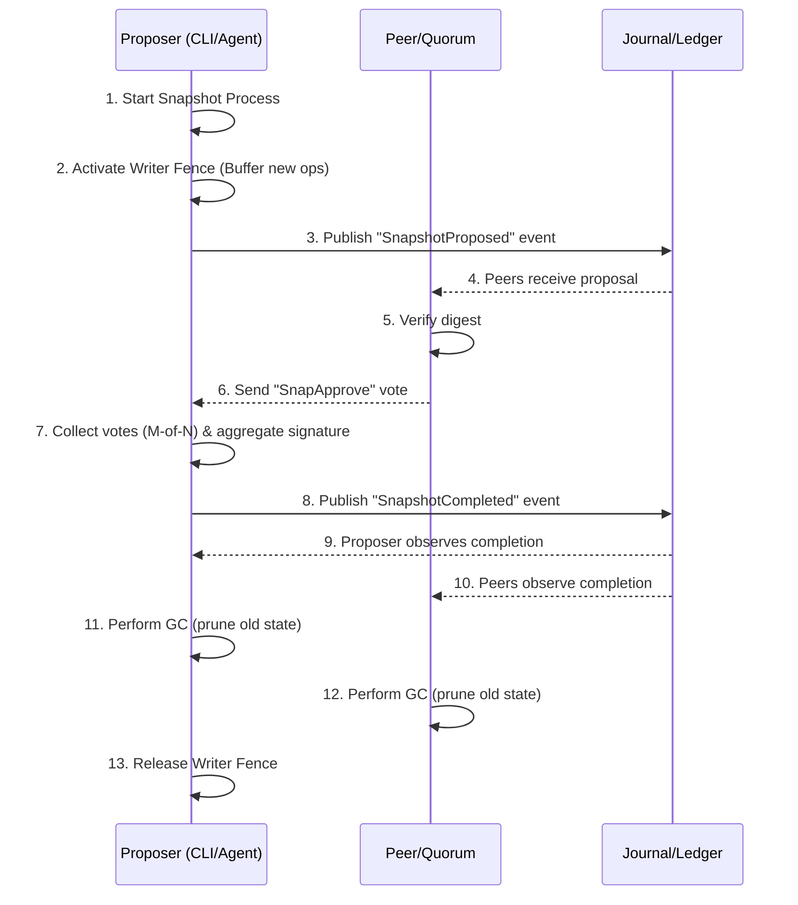

# Distributed Maintenance

Distributed maintenance provides snapshots, garbage collection, cache invalidation, and OTA upgrades while maintaining alignment with the system algebra. All maintenance operations emit facts into the journal CRDT so offline replicas converge. Maintenance facts model as join-semilattice data while constraints model as meet-semilattice predicates evaluated locally.

Every distributed flow is expressed as an MPST choreography binding capability guards and journal coupling following [Theoretical Foundations](001_theoretical_foundations.md). The implementation reuses existing effect interfaces for journal, storage, crypto, and network operations. Launch behavior favors determinism and manual control with sophistication deferred to OTA updates.

## Maintenance Events

The journal's `MaintenanceEvent` sum type includes four launch-time variants following CRDT rules with grow-only facts:

```rust
pub enum MaintenanceEvent {
    SnapshotProposed {
        proposal_id: Uuid,
        proposer: DeviceId,
        target_epoch: u64,
        state_digest: Hash32,
    },
    SnapshotCompleted {
        proposal_id: Uuid,
        snapshot: SnapshotV1,
        participants: BTreeSet<DeviceId>,
        threshold_signature: ThresholdSignature,
    },
    CacheInvalidated {
        keys: Vec<CacheKey>,
        epoch_floor: u64,
    },
    UpgradeActivated {
        package_id: Uuid,
        to_version: ProtocolVersion,
        activation_fence: IdentityEpochFence,
    },
}
```

Devices subscribe to these facts and update local state monotonically through join operations. GC eligibility, cache validity, and upgrade readiness compute via local meet predicates over accumulated facts.

## Snapshots and Garbage Collection



Snapshots bound the journal size. The operator runs `aura-cli snapshot propose` or the agent daemon crosses a 100 MB watermark. The proposer publishes `SnapshotProposed` with current identity epoch and state digest computed from the journal snapshot. The capability guard requires `need(snapshot_propose)`.

Peers recompute the digest and on success append vote facts signing the digest. The proposer aggregates an M-of-N signature and publishes `SnapshotCompleted`. During proposal, a writer fence buffers new operations locally preventing commits until the snapshot completes or is abandoned.

When a device observes `SnapshotCompleted` and verifies the signature, it drops journal segments whose operations precede the snapshot digest, deletes storage blobs whose tombstones predate the snapshot epoch, and deletes SBB envelopes tied to key-rotation epochs before snapshot epoch.

Restore fetches the latest `SnapshotCompleted` event and downloads the referenced snapshot blob via `StorageEffects`. It verifies the threshold signature and digest, hydrates local journal state, and replays the post-snapshot journal tail to catch up.

## Cache Invalidation

Every state mutation affecting derived data emits `CacheInvalidated` with cache keys and epoch floor. Clients maintain a map from cache key to epoch floor. Serving data requires the current identity epoch to exceed the cached epoch. Otherwise the client recomputes that entry from authoritative state.

This mechanism is purely local without requiring a replicated cache CRDT. The semantics follow meet-predicate patterns where serveable cache entries equal the join of state and the meet of epoch constraints.

## OTA Upgrades

Every device advertises two monotone sets in `DeviceMetadata`. `supported_protocols` contains protocol versions the device can execute derived from the installed binary. `upgrade_policy` is either `Manual` requiring operator approval or `Auto` allowing device consent.

The `UpgradeCoordinator` choreography handles upgrades. The admin publishes upgrade metadata with package ID, semantic version, artifact hash, and download URL. The `upgrade_kind` specifies whether this is a soft fork without activation fence or a hard fork including an identity-scoped activation fence.

For soft forks, devices fetch the artifact, verify the hash, and depending on policy either auto-acknowledge or wait for approval before appending a readiness fact. No cutover is enforced. For hard forks, once enough devices opt in and the account ratchet tree reaches the activation fence epoch, the admin writes `UpgradeActivated`. From that point the session runtime aborts any session whose identity epoch no longer satisfies the fence and orchestrators refuse to start sessions with peers lacking readiness.

Mobile apps and browser bundles use native app stores. The OTA protocol coordinates protocol logic that these binaries already contain. Operators must publish a binary including the new code path before opting the device into version V. Devices running older binaries keep `supported_protocols` capped until they download the updated app. Once the new binary installs the operator can mark readiness and OTA handles activation.

Before starting maintenance sessions the orchestrator inspects each participant's `supported_protocols` set. If any peer lacks the requested version, the call fails for soft forks or refuses entirely for hard forks once the fence is active.

Upgrades are single-wave at launch but devices can refuse by keeping `upgrade_policy = Manual` and withholding approval. If too many devices refuse, the admin can remove them via normal governance.

## Admin Replacement

Administrators can become unavailable or malicious. The `MaintenanceEvent::AdminReplaced` fact records the previous admin, new admin, and activation epoch. The `aura-agent::MaintenanceController::replace_admin_stub` appends this fact and persists it under `maintenance:admin_override` for local enforcement.

The `aura-cli admin replace` command exposes this operation to operators. Replicas treat the fact as a monotone declaration. Replay semantics allow users to refuse future admin-signed operations whose activation epoch precedes the recorded replacement epoch.

A future OTA will tie replacement facts into the capability lattice, trigger rekeying choreographies, and surface CLI UX for competing admin replacements. Until then, emitting the fact provides an escape hatch allowing users to coordinate out-of-band and rely on journal evidence in disputes.

## Epoch Handling

Maintenance sessions run under an `(identity_epoch, snapshot_epoch)` tuple passed through the choreography macro. Guards ensure the session operates on a consistent journal slice. Identity epochs are per-account not global. A session locks the subset of journal it reads and writes. If that identity epoch advances, the runtime aborts and the caller retries under the new epoch.

Snapshot completion sets `snapshot_epoch` to the identity epoch at the moment the snapshot fact appends. GC predicates require the local snapshot epoch to dominate the epoch of data being pruned. OTA activation refers to the same identity epoch fence. When `UpgradeActivated` appears, orchestrators compare the session epoch with the fence before executing.

## Backup and Restore

The CLI workflow exports the latest snapshot blob plus the last 1000 journal events, packages them into an encrypted TAR. The `aura-cli backup restore` command verifies snapshot signature and replays the journal tail. This is a user-facing wrapper around snapshot and restore primitives without new protocols.

## Evolution

Phase 1 ships the mechanisms above. Phase 2 adds lease-based GC evidence, replicated cache CRDT, and staged OTA rollouts. Phase 3 adds proxy re-encryption for old blobs, automatic snapshot triggers, and managed backups to external storage. Each phase builds on the day-one journal schema without foundational changes.

## Summary

Distributed maintenance ships snapshots with garbage collection, cache invalidation enforced locally, OTA upgrades distributing signed choreography and effect bundles, and epoch-scoped session guards. The CLI provides hooks for manual action with operator runbooks explaining invariants. The deterministic simulator executes maintenance choreographies with injected faults validating the implementation.
