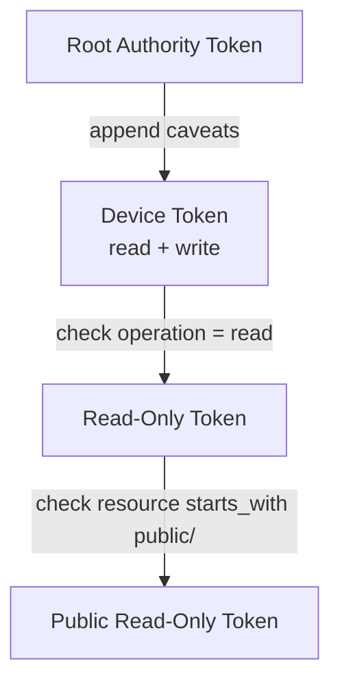

# Authorization

## Overview

Aura authorizes every observable action through Biscuit capability evaluation combined with sovereign policy and flow budgets. The authorization pipeline spans `AuthorizationEffects`, the guard chain, and receipt accounting. This document describes the data flow and integration points.

## Biscuit Capability Model

Biscuit tokens encode attenuation chains. Each attenuation step applies additional caveats that shrink authority through meet composition. Aura stores Biscuit material outside the replicated CRDT. Local runtimes evaluate tokens at send time and cache the resulting lattice element for the active `ContextId`.

Cached entries expire on epoch change or when policy revokes a capability. Policy data always participates in the meet. A token can only reduce authority relative to local policy.

This algorithm produces a meet-monotone capability frontier. Step 1 ensures provenance. Steps 2 and 3 ensure evaluation never widens authority. Step 4 feeds the guard chain with a cached outcome.

## Guard Chain

Authorization evaluation feeds the transport guard chain. All documents reference this section to avoid divergence.

This diagram shows the guard chain sequence. CapGuard performs Biscuit evaluation. FlowGuard charges the budget. JournalCoupler commits facts before transport.

Guard evaluation is pure and synchronous over a prepared `GuardSnapshot`. CapGuard reads the cached frontier and any inline Biscuit token already present in the snapshot. FlowGuard and JournalCoupler emit `EffectCommand` items rather than executing I/O directly. An async interpreter executes those commands in production or simulation.

Only after all guards pass does transport emit a packet. Any failure returns locally and leaves no observable side effect. DKG payloads require proportional budget charges before any transport send.

## Telltale Integration

Aura uses Telltale runtime admission and VM guard checkpoints. Runtime admission gates whether a runtime profile may execute. VM acquire and release guards gate per-session resource leases inside VM execution. The Aura guard chain remains the authoritative policy and accounting path for application sends.

Failure handling is layered. Admission failure rejects engine startup. VM acquire deny blocks the guarded VM action. Aura guard-chain failure denies transport and returns deterministic effect errors.

## Runtime Capability Admission

Aura uses a dedicated admission surface for theorem-pack and runtime capability checks before choreography execution. `RuntimeCapabilityEffects` in `aura-core` defines capability inventory queries and admission checks. `RuntimeCapabilityHandler` in `aura-effects` stores a boot-time immutable capability snapshot. The `aura-protocol::admission` module declares protocol requirements and maps them to capability keys.

Current protocol capability keys include `byzantine_envelope` for consensus ceremony admission, `termination_bounded` for sync epoch-rotation admission, `reconfiguration` for dynamic topology transfer paths, and `mixed_determinism` for cross-target mixed lanes.

Execution order is runtime capability admission first, then VM profile gates, then the Aura guard chain. Admission diagnostics must respect Aura privacy constraints. Production runtime paths must not emit plaintext capability inventory events. Admission failures use redacted capability references.

## Failure Handling and Caching

Runtimes cache evaluated capability frontiers per context and predicate with an epoch tag. Cache entries invalidate when journal policy facts change or when the epoch rotates.

CapGuard failures return `AuthorizationError::Denied` without charging flow or touching the journal. FlowGuard failures return `FlowError::InsufficientBudget` without emitting transport traffic. JournalCoupler failures surface as `JournalError::CommitAborted` and instruct the protocol to retry after reconciling journal state.

This isolation keeps the guard chain deterministic and side-channel free.

## Biscuit Token Workflow

Biscuit tokens provide cryptographically verifiable, attenuated delegation chains. The typical workflow creates root authority via `TokenAuthority::new(authority_id)`. Issue tokens via `authority.create_token(recipient_authority_id)`. Attenuate for delegation via `BiscuitTokenManager::attenuate_read()`. Authorize via `BiscuitAuthorizationBridge::authorize(&token, operation, &resource_scope)`.

This diagram shows token attenuation. Each block appends restrictions to the chain. Attenuation preserves the cryptographic signature chain while reducing authority.

Biscuit tokens are secure through cryptographic signature chains that prevent forgery. They support offline verification without contacting the issuer. Epoch rotation provides revocation by invalidating old tokens.

## Guard Chain Integration

Biscuit authorization integrates with the guard chain in three phases. Cryptographic verification calls `bridge.authorize(token, operation, resource_scope)` to perform Datalog evaluation. Guard evaluation prepares a `GuardSnapshot` asynchronously and then calls `guards.evaluate(&snapshot, &request)` synchronously. Effect execution interprets the `EffectCommand` items from the guard outcome.

If any phase fails, the operation returns an error without observable side effects.

## Authorization Scenarios

Biscuit tokens handle all authorization scenarios through cryptographic verification. Local device operations use device tokens with full capabilities. Cross-authority delegation uses attenuated tokens with resource restrictions. Policy enforcement integrates sovereign policy into Datalog evaluation.

API access control uses scoped tokens with operation restrictions. Guardian recovery uses guardian tokens with recovery capabilities. Storage operations use storage-scoped tokens with path restrictions. Relaying and forwarding use context tokens with relay permissions.

## Performance and Caching

Biscuit token authorization has predictable performance characteristics. Signature verification requires O(chain length) cryptographic operations. Authorization evaluation takes O(facts × rules) time for Datalog evaluation. Attenuation costs O(1) to append blocks.

Token results are cacheable with epoch-based invalidation. Cache authorization results per authority, token hash, and resource scope. Invalidate cache on epoch rotation or policy update.

## Security Model

Cryptographic signature verification prevents token forgery. Epoch scoping limits token lifetime and replay attacks. Attenuation preserves security while growing verification cost proportional to chain length. Root key compromise invalidates all derived tokens.

Authority-based `ResourceScope` prevents cross-authority access. Local sovereign policy integration provides an additional security layer. Guard chain isolation ensures authorization failures leak no sensitive information.

## Implementation References

The `Cap` type in `aura-core/src/domain/journal.rs` wraps serialized Biscuit tokens with optional root key storage. The `Cap::meet()` implementation computes capability intersection. Tokens from the same issuer return the more attenuated token. Tokens from different issuers return bottom.

`BiscuitAuthorizationBridge` in `aura-guards/src/authorization.rs` handles guard chain integration. `TokenAuthority` and `BiscuitTokenManager` in `aura-authorization/src/biscuit_token.rs` handle token creation and attenuation. `ResourceScope` in `aura-core/src/types/scope.rs` defines authority-centric resource patterns.

See [Transport and Information Flow](109_transport_and_information_flow.md) for flow budget details. See [Journal](103_journal.md) for fact commit semantics.
