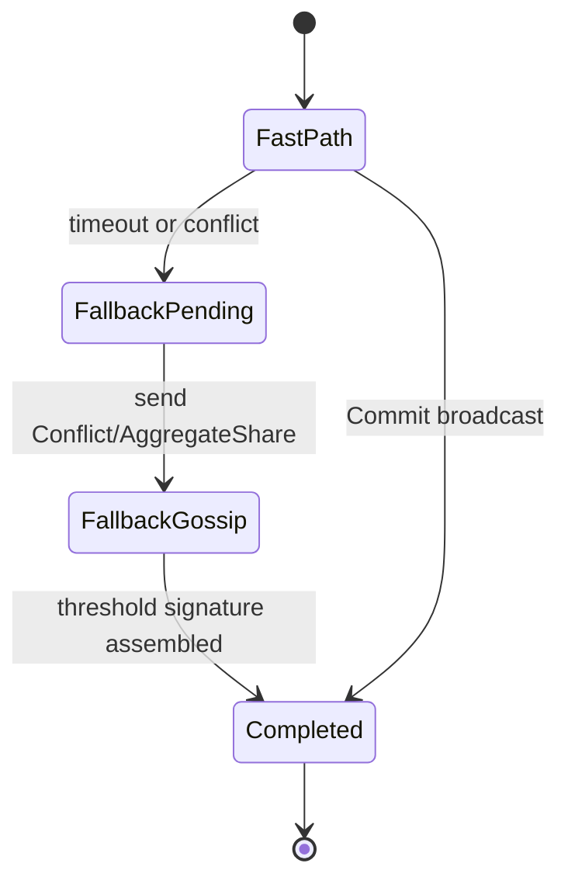

# Consensus

This document describes the architecture of Aura Consensus. It defines the problem model, protocol phases, data structures, and integration with [journals](102_journal.md). It explains how consensus provides single-shot agreement for non-monotone operations such as account updates or relational context operations.

## 1. Problem Model

Aura uses consensus only for operations that cannot be expressed as monotone growth. Consensus produces a commit fact. The commit fact is inserted into one or more [journals](102_journal.md) and drives deterministic reduction. Aura does not maintain a global log. Consensus operates in the scope of an authority or a relational context.

Consensus is single-shot. It agrees on a single operation and a single prestate. Commit facts are immutable and merge by join in journal namespaces.

A consensus instance uses a context-scoped committee. The committee contains witnesses selected by the authority or relational context. Committee members may be offline. The protocol completes even under partitions.

### 1.3 Consensus is NOT Linearizable by Default

**Important:** Aura Consensus is single-shot agreement, not log-based linearization.

Each consensus instance independently agrees on:
- A single operation
- A single prestate
- Produces a single commit fact

**Consensus does NOT provide:**
- Global operation ordering
- Sequential linearization across instances
- Automatic operation dependencies

**To sequence operations, use session types** (`docs/107_mpst_and_choreography.md`):

```rust
use aura_mpst::{choreography, Role};

#[choreography]
async fn sequential_device_updates<C: EffectContext>(
    ctx: &C,
    account: Role<Account>,
    witnesses: Vec<Role<Witness>>,
) -> Result<(), AuraError> {
    // Session type enforces ordering:
    // 1. Update policy (must complete first)
    let policy_commit = consensus_single_shot(
        ctx,
        account.clone(),
        witnesses.clone(),
        TreeOp::UpdatePolicy { new_policy },
        prestate1.hash(),
    ).await?;

    // 2. Remove device (uses policy_commit as prestate)
    // Session type prevents op2 from starting until op1 completes
    let prestate2 = account.read_tree_state(ctx).await?;
    assert_eq!(prestate2.hash(), policy_commit.result_id.prestate_hash);

    let remove_commit = consensus_single_shot(
        ctx,
        account,
        witnesses,
        TreeOp::RemoveLeaf { target: device_id },
        prestate2.hash(),
    ).await?;

    Ok(())
}
```

**Cross-reference:** See `docs/113_database.md` §8 for database transaction integration.

## 2. Core Protocol

Aura Consensus has two paths. The fast path completes in one round trip. The fallback path uses epidemic gossip and a threshold race. Both paths produce the same commit fact once enough matching witness shares exist.

The fast path uses direct communication. The initiator broadcasts an execute message. Witnesses run the operation against the prestate. Witnesses return FROST shares. The initiator aggregates shares and produces a threshold signature (via core FROST primitives in `aura-core::crypto::tree_signing`; consensus calls a thin adapter—`aura-frost` is deprecated).

The fallback path triggers when witnesses disagree or when the initiator stalls. Witnesses exchange share proposals using bounded fanout gossip. Any witness that assembles a valid threshold signature broadcasts a complete commit fact.

## 3. Common Structures and Notation

Consensus uses the following core concepts and notation throughout the protocol.

### Core Variables

* `cid : ConsensusId` - consensus instance identifier
* `Op` - operation being agreed on (application-defined)
* `prestate` - local pre-state for this instance (e.g., journal snapshot)
* `prestate_hash = H(prestate)` - hash of prestate
* `rid = H(Op, prestate)` - result identifier
* `t` - threshold; adversary controls `< t` key shares
* `W` - finite set of witnesses for this consensus instance

### Per-Instance Tracking

Each consensus participant maintains per-`cid` state. The `decided` flags prevent double-voting. Proposals are keyed by `(rid, prestate_hash)` to group matching shares.

### Equivocation Detection

Equivocation occurs when the same witness signs two different `rid` values under the same `(cid, prestate_hash)`. This violates safety. The protocol detects and excludes equivocating shares.

## 4. Data Structures

Consensus instances use identifiers for operations and results.

```rust
/// Consensus instance identifier (derived from prestate and operation)
pub struct ConsensusId(pub Hash32);

impl ConsensusId {
    pub fn new(prestate_hash: Hash32, operation_hash: Hash32, nonce: u64) -> Self {
        // Hash of domain separator, prestate, operation, and nonce
    }
}
```

This structure identifies consensus instances. The result is identified by `H(Op, prestate)` computed inline.

A commit fact contains full consensus evidence including the operation, threshold signature, and participant list. Participants are recorded as `AuthorityId` values to preserve device privacy.

```rust
/// From aura-protocol/src/consensus/types.rs
pub struct CommitFact {
    pub consensus_id: ConsensusId,
    pub prestate_hash: Hash32,
    pub operation_hash: Hash32,
    pub operation_bytes: Vec<u8>,
    pub threshold_signature: ThresholdSignature,
    pub group_public_key: Option<PublicKeyPackage>,
    pub participants: Vec<AuthorityId>,
    pub threshold: u16,
    pub timestamp: ProvenancedTime,
    pub fast_path: bool,
}
```

The commit fact is the output of consensus. Every peer merges `CommitFact` into its journal CRDT. A peer finalizes when it accepts a valid threshold signature and inserts the corresponding `CommitFact`.

The commit fact is inserted into the appropriate journal namespace. This includes account journals for account updates and relational context journals for cross-authority operations.

## 5. Prestate Model

Consensus binds operations to explicit prestates. A prestate hash commits to the current reduced state of all participants.

```rust
let prestate_hash = H(C_auth1, C_auth2, C_context);
```

This value includes root commitments of participating authorities. It may also include the current relational context commitment. Witnesses verify that their local reduced state matches the prestate hash. This prevents forks.

The result identifier binds the operation to the prestate.

```rust
let rid = H(Op, prestate);
```

Witnesses treat matching `(rid, prestate_hash)` pairs as belonging to the same bucket. The protocol groups shares by these pairs to detect agreement.

## 6. Fast Path Protocol

The fast path optimistically assumes agreement. It completes in one round trip when all participants share the same prestate.

### Messages

* `Execute(cid, Op, prestate_hash, evidΔ)` - initiator requests operation execution
* `WitnessShare(cid, rid, share, prestate_hash, evidΔ)` - witness returns threshold share
* `Commit(cid, rid, sig, attesters, evidΔ)` - initiator broadcasts commit fact
* `StateMismatch(cid, expected_pre_hash, actual_pre_hash, evidΔ)` - optional debugging signal

Each message carries evidence delta `evidΔ` for the consensus instance. Evidence propagates along with protocol messages.

### Initiator Protocol

The initiator `i` coordinates the fast path.

```
State at initiator i:
    cid       : ConsensusId       // fresh per instance
    Op        : Operation
    shares    : Map[WitnessId -> (rid, share, prestate_hash)]
    decided   : Map[ConsensusId -> Bool]   // initially decided[cid] = false
    W         : Set[WitnessId]
    t         : Nat
```

The initiator maintains per-witness shares and tracks decision status.

#### Start Operation

```
Start(cid, Op):
    prestate       := ReadState()
    prestate_hash  := H(prestate)
    decided[cid]   := false
    shares         := {}

    For all w in W:
        Send Execute(cid, Op, prestate_hash, EvidenceDelta(cid)) to w
```

The initiator reads local state and broadcasts the operation to all witnesses.

#### Process Witness Shares

```
On WitnessShare(cid, rid, share, prestate_hash, evidΔ) from w:
    MergeEvidence(cid, evidΔ)

    If decided[cid] = false and w not in shares:
        shares[w] := (rid, share, prestate_hash)

        // collect all shares for this specific (rid, prestate_hash)
        Hset := { (w', s') in shares | s'.rid = rid
                                     ∧ s'.prestate_hash = prestate_hash }

        If |Hset| ≥ t:
            sig := CombineShares( { s'.share | (_, s') in Hset } )
            attesters := { w' | (w', _) in Hset }

            CommitFact(cid, rid, sig, attesters)
            For all v in W:
                Send Commit(cid, rid, sig, attesters, EvidenceDelta(cid)) to v

            decided[cid] := true
```

The initiator collects shares. When `t` shares agree on `(rid, prestate_hash)`, it combines them into a threshold signature.

### Witness Protocol

Each witness `w` responds to execute requests.

```
State at witness w:
    proposals : Map[(rid, prestate_hash) -> Set[(WitnessId, Share)]]
    decided   : Map[ConsensusId -> Bool]
    timers    : Map[ConsensusId -> TimerHandle]
    W         : Set[WitnessId]
    t         : Nat
```

Witnesses maintain proposals and fallback timers.

#### Process Execute Request

```
On Execute(cid, Op, prestate_hash, evidΔ) from i:
    MergeEvidence(cid, evidΔ)

    if decided.get(cid, false) = true:
        return

    prestate := ReadState()
    if H(prestate) != prestate_hash:
        Send StateMismatch(cid, prestate_hash, H(prestate), EvidenceDelta(cid)) to i
        StartTimer(cid, T_fallback)
        return

    rid   := H(Op, prestate)
    share := ProduceShare(cid, rid)

    proposals[(rid, prestate_hash)] := { (w, share) }

    Send WitnessShare(cid, rid, share, prestate_hash, EvidenceDelta(cid)) to i

    StartTimer(cid, T_fallback)
```

Witnesses verify prestate agreement before computing shares. Mismatches trigger fallback timers.

#### Process Commit

```
On Commit(cid, rid, sig, attesters, evidΔ) from any v:
    if decided.get(cid, false) = false
       and VerifyThresholdSig(rid, sig, attesters):

        MergeEvidence(cid, evidΔ)
        CommitFact(cid, rid, sig, attesters)
        decided[cid] := true
        StopTimer(cid)
```

Witnesses accept valid commit facts from any source.

## 7. Evidence Propagation

Evidence is a CRDT keyed by `cid`. It monotonically accumulates attestations and signatures.

Evidence properties:

* Monotonicity: threshold signatures for `(cid, rid)` never conflict
* Idempotence: merging the same evidence multiple times is safe
* Convergence: all peers exchanging deltas converge to the same evidence

Abstract interface:

```
EvidenceDelta(cid):
    // Return a delta for the evidence CRDT for this cid
    return CRDT_Delta_for(cid)

MergeEvidence(cid, evidΔ):
    // Merge a delta into local evidence
    CRDT_Merge(cid, evidΔ)
```

Every protocol message carries `evidΔ`. This ensures evidence spreads with the protocol. Late-joining peers catch up by merging CRDT state.

## 8. Fallback Protocol

Fallback activates when the fast path stalls. Triggers include witness disagreement or initiator failure. Fallback uses leaderless gossip to complete consensus.

### Messages

* `Conflict(cid, conflicts, evidΔ)` - initiator seeds fallback with known conflicts
* `AggregateShare(cid, proposals, evidΔ)` - witnesses exchange proposal sets
* `ThresholdComplete(cid, rid, sig, attesters, evidΔ)` - any witness broadcasts completion

### Equivocation Detection

Equivocation means signing two different `rid` values under the same `(cid, prestate_hash)`.

```
HasEquivocated(proposals, witness, cid, pre_hash, new_rid):
    For each ((rid, ph), S) in proposals:
        if ph = pre_hash
           and rid ≠ new_rid
           and witness ∈ { w' | (w', _) in S }:
            return true
    return false
```

The protocol excludes equivocating shares from threshold computation.

### Fallback Gossip

Witnesses periodically exchange proposals with random peers.

```
OnPeriodic(cid) for fallback gossip when decided[cid] = false:
    peers := SampleRandomSubset(W \ {w}, k)

    For each p in peers:
        Send AggregateShare(cid, proposals, EvidenceDelta(cid)) to p
```

Gossip fanout `k` controls redundancy. Typical values are 3-5.

### Threshold Checking

Witnesses check for threshold completion after each update.

```
CheckThreshold(cid):
    if decided.get(cid, false) = true:
        return

    For each ((rid, pre_hash), S) in proposals:
        if |S| ≥ t:
            sig := CombineShares({ sh | (_, sh) in S })

            if VerifyThresholdSig(rid, sig):
                attesters := { w' | (w', _) in S }

                CommitFact(cid, rid, sig, attesters)

                For all v in W:
                    Send ThresholdComplete(cid, rid, sig, attesters, EvidenceDelta(cid)) to v

                decided[cid] := true
                return
```

Any witness reaching threshold broadcasts the commit fact. The first valid threshold signature wins.

## 9. Integration with Journals

Consensus emits commit facts. Journals merge commit facts using set union. Reduction interprets commit facts as confirmed non-monotone events.

Account journals integrate commit facts that represent tree operations. [Relational context](103_relational_contexts.md) journals integrate commit facts that represent guardian bindings or recovery grants.

Reduction remains deterministic. Commit facts simply appear as additional facts in the semilattice.

A commit fact is monotone even when the event it represents is non-monotone. This supports convergence.

## 10. Integration Points

Consensus is used for account tree operations that require strong agreement. Examples include membership changes and policy changes when local signing is insufficient.

Consensus is also used for relational context operations. Guardian bindings use consensus to bind authority state. Recovery grants use consensus to approve account modifications. Application specific relational contexts may also use consensus.

## 11. FROST Threshold Signatures

Consensus uses FROST to produce threshold signatures. Each witness holds a secret share. Witnesses compute partial signatures. The initiator or fallback proposer aggregates the shares. The final signature verifies under the group public key stored in the commitment tree. See [Accounts and Commitment Tree](101_accounts_and_commitment_tree.md) for details on the `TreeState` structure.

```rust
/// From aura-protocol/src/consensus/messages.rs
pub enum ConsensusMessage {
    SignShare {
        consensus_id: ConsensusId,
        share: PartialSignature,
        /// Optional commitment for the next consensus round (pipelining optimization)
        next_commitment: Option<NonceCommitment>,
        /// Epoch for commitment validation
        epoch: Epoch,
    },
    // ... other message variants
}
```

Witness shares validate only for the current consensus instance. They cannot be replayed. Witnesses generate only one share per `(consensus_id, prestate_hash)`.

The attester set in the commit fact contains only devices that contributed signing shares. This provides cryptographic proof of participation.

### 11.1 Integration with Tree Operation Verification

When consensus produces a commit fact for a tree operation, the resulting `AttestedOp` is verified using the two-phase model from `aura-core::tree::verification`:

1. **Verification** (`verify_attested_op`): Cryptographic check against the `BranchSigningKey` stored in TreeState
2. **Check** (`check_attested_op`): Full verification plus state consistency validation

The binding message includes the group public key to prevent signature reuse attacks. This ensures an attacker cannot substitute a different signing key and replay a captured signature. See [Tree Operation Verification](101_accounts_and_commitment_tree.md#41-tree-operation-verification) for details.

```rust
// Threshold derived from policy at target node
let threshold = state.get_policy(target_node)?.required_signers(child_count);

// Signing key from TreeState
let signing_key = state.get_signing_key(target_node)?;

// Verify against stored key and policy-derived threshold
verify_attested_op(&attested_op, signing_key, threshold, current_epoch)?;
```

## 12. FROST Commitment Pipeline Optimization

The pipelined commitment optimization reduces steady-state consensus from 2 RTT (round-trip times) to 1 RTT by bundling next-round nonce commitments with current-round signature shares.

### 12.1 Overview

The FROST pipelining optimization improves consensus performance by bundling next-round nonce commitments with current-round signature shares. This allows the coordinator to start the next consensus round immediately without waiting for a separate nonce commitment phase.

**Standard FROST Consensus (2 RTT)**:
1. **Execute → NonceCommit** (1 RTT): Coordinator sends execute request, witnesses respond with nonce commitments
2. **SignRequest → SignShare** (1 RTT): Coordinator sends aggregated nonces, witnesses respond with signature shares

**Pipelined FROST Consensus (1 RTT)** (after warm-up):
1. **Execute+SignRequest → SignShare+NextCommitment** (1 RTT): 
   - Coordinator sends execute request with cached commitments from previous round
   - Witnesses respond with signature share AND next-round nonce commitment

### 12.2 Core Components

**WitnessState** (`consensus/witness.rs`) manages persistent nonce state for each witness:

```rust
pub struct WitnessState {
    /// Precomputed nonce for the next consensus round
    next_nonce: Option<(NonceCommitment, NonceToken)>,
    
    /// Current epoch to detect when cached commitments become stale
    epoch: Epoch,
    
    /// Witness identifier
    witness_id: AuthorityId,
}
```

Key methods:
- `get_next_commitment()`: Returns cached commitment if valid for current epoch
- `take_nonce()`: Consumes cached nonce for use in current round
- `set_next_nonce()`: Stores new nonce for future use
- `invalidate()`: Clears cached state on epoch change

**Message Schema Updates**: The `SignShare` message now includes optional next-round commitment:

```rust
SignShare {
    consensus_id: ConsensusId,
    share: PartialSignature,
    /// Optional commitment for the next consensus round (pipelining optimization)
    next_commitment: Option<NonceCommitment>,
    /// Epoch for commitment validation
    epoch: Epoch,
}
```

**PipelinedConsensusOrchestrator** (integrated in `consensus/protocol.rs`) orchestrates the optimization:

```rust
pub struct PipelinedConsensusOrchestrator {
    /// Manager for witness nonce states
    witness_states: WitnessStateManager,
    
    /// Current epoch
    current_epoch: Epoch,
    
    /// Threshold required for consensus
    threshold: u16,
}
```

Key methods:
- `run_consensus()`: Determines fast path vs slow path based on cached commitments
- `can_use_fast_path()`: Checks if sufficient cached commitments available
- `handle_epoch_change()`: Invalidates all cached state on epoch rotation

### 12.3 Epoch Safety

All cached commitments are bound to epochs to prevent replay attacks:

1. **Epoch Binding**: Each commitment is tied to a specific epoch
2. **Automatic Invalidation**: Epoch changes invalidate all cached commitments
3. **Validation**: Witnesses reject commitments from wrong epochs

```rust
// Epoch change invalidates all cached nonces
if self.epoch != current_epoch {
    self.next_nonce = None;
    self.epoch = current_epoch;
    return None;
}
```

### 12.4 Fallback Handling

The system gracefully falls back to 2 RTT when:

1. **Insufficient Cached Commitments**: Less than threshold witnesses have cached nonces
2. **Epoch Change**: All cached commitments become invalid
3. **Witness Failures**: Missing or invalid next_commitment in responses
4. **Initial Bootstrap**: First round after startup (no cached state)

```rust
if has_quorum {
    // Fast path: 1 RTT using cached commitments
    self.run_fast_path(...)
} else {
    // Slow path: 2 RTT standard consensus
    self.run_slow_path(...)
}
```

### 12.5 Performance Impact

**Latency Reduction**:
- Before: 2 RTT per consensus
- After: 1 RTT per consensus (steady state)
- Improvement: 50% latency reduction

**Message Count**:
- Before: 4 messages per witness (Execute, NonceCommit, SignRequest, SignShare)
- After: 2 messages per witness (Execute+SignRequest, SignShare+NextCommitment)
- Improvement: 50% message reduction

**Trade-offs**:
- Memory: Small overhead for caching one nonce per witness
- Complexity: Additional state management and epoch tracking
- Bootstrap: First round still requires 2 RTT

### 12.6 Implementation Guidelines

**Adding Pipelining to New Consensus Operations**:

1. Update message schema: Add `next_commitment` and `epoch` fields to response messages
2. Generate next nonce: During signature generation, also generate next-round nonce
3. Cache management: Store next nonce in `WitnessState` for future use
4. Epoch handling: Always validate epoch before using cached commitments

**Example Witness Implementation**:

```rust
pub async fn handle_sign_request<R: RandomEffects + ?Sized>(
    &mut self,
    consensus_id: ConsensusId,
    aggregated_nonces: Vec<NonceCommitment>,
    current_epoch: Epoch,
    random: &R,
) -> Result<ConsensusMessage> {
    // Generate signature share
    let share = self.create_signature_share(consensus_id, aggregated_nonces)?;
    
    // Generate or retrieve next-round commitment
    let next_commitment = if let Some((commitment, _)) = self.witness_state.take_nonce(current_epoch) {
        // Use cached nonce
        Some(commitment)
    } else {
        // Generate fresh nonce
        let (nonces, commitment) = self.generate_nonce(random).await?;
        let token = NonceToken::from(nonces);
        
        // Cache for future
        self.witness_state.set_next_nonce(commitment.clone(), token, current_epoch);
        
        Some(commitment)
    };
    
    Ok(ConsensusMessage::SignShare {
        consensus_id,
        share,
        next_commitment,
        epoch: current_epoch,
    })
}
```

### 12.7 Security Considerations

1. **Nonce Reuse Prevention**: Each nonce is used exactly once and tied to specific epoch
2. **Epoch Isolation**: Nonces from different epochs cannot be mixed
3. **Forward Security**: Epoch rotation provides natural forward security boundary
4. **Availability**: Fallback ensures consensus continues even without optimization

### 12.8 Testing Strategy

**Unit Tests**:
- Epoch invalidation logic
- Nonce caching and retrieval
- Message serialization with new fields

**Integration Tests**:
- Fast path vs slow path selection
- Epoch transition handling
- Performance measurement

**Simulation Tests**:
- Network delay impact on 1 RTT vs 2 RTT
- Behavior under partial failures
- Convergence properties

### 12.9 Future Enhancements

1. **Adaptive Thresholds**: Dynamically adjust quorum requirements based on cached state
2. **Predictive Caching**: Pre-generate multiple rounds of nonces during idle time
3. **Compression**: Batch multiple commitments in single message
4. **Cross-Context Optimization**: Share cached state across related consensus contexts

## 13. Fallback Protocol Details

### Fallback Trigger

The initiator can proactively trigger fallback when it detects conflicts.

```
Fallback_Trigger_Initiator(cid):
    // Extract conflicts from shares (same prestate_hash, different rid)
    conflicts := Map[(rid, prestate_hash) -> Set[(w, share)]]

    For each (w, (rid, share, prestate_hash)) in shares:
        conflicts[(rid, prestate_hash)] :=
            conflicts.get((rid, prestate_hash), ∅) ∪ { (w, share) }

    For all w in W:
        Send Conflict(cid, conflicts, EvidenceDelta(cid)) to w
```

This optimization seeds fallback with known conflicts. Witnesses also start fallback independently on timeout.

### Fallback Message Handlers

Witnesses process fallback messages to accumulate shares.

```
On Conflict(cid, conflicts, evidΔ) from any peer:
    MergeEvidence(cid, evidΔ)

    For each ((rid, pre_hash), S) in conflicts:
        if not HasEquivocatedInSet(proposals, S, pre_hash):
            proposals[(rid, pre_hash)] :=
                proposals.get((rid, pre_hash), ∅) ∪ S

    CheckThreshold(cid)
    Fallback_Start(cid)
```

Conflict messages bootstrap the fallback phase. The witness merges non-equivocating shares.

```
On AggregateShare(cid, proposals', evidΔ) from any peer:
    MergeEvidence(cid, evidΔ)

    For each ((rid, pre_hash), S') in proposals':
        For each (w', sh') in S':
            if not HasEquivocated(proposals, w', cid, pre_hash, rid):
                proposals[(rid, pre_hash)] :=
                    proposals.get((rid, pre_hash), ∅) ∪ { (w', sh') }

    CheckThreshold(cid)
```

Aggregate shares spread proposal sets through gossip. Each witness checks for threshold after updates. Threshold-complete messages carry the final aggregated signature; once validated, the witness commits and stops its timers.

## 14. Safety Guarantees

Consensus satisfies agreement. At most one commit fact forms for a given `(cid, prestate_hash)`. The threshold signature ensures authenticity. No attacker can forge a threshold signature without the required number of shares.

Consensus satisfies validity. A commit fact references a result computed from the agreed prestate. All honest witnesses compute identical results. Malformed shares are rejected.

Consensus satisfies deterministic convergence. Evidence merges through CRDT join. All nodes accept the same commit fact.

### Binding Message Security

The binding message for tree operations includes the group public key. This prevents key substitution attacks where an attacker captures a valid signature and replays it with a different key they control. The full binding includes:
- Domain separator for domain isolation
- Parent epoch and commitment for replay prevention
- Protocol version for upgrade safety
- Current epoch for temporal binding
- **Group public key** for signing group binding
- Serialized operation content

This security property is enforced by `compute_binding_message()` in the verification module.

## 15. Liveness Guarantees

The fast path completes in one round trip when the initiator and witnesses are online. The fallback path provides eventual completion under asynchrony. Gossip ensures that share proposals propagate across partitions.

The protocol does not rely on stable leaders. No global epoch boundaries exist. Witnesses can rejoin by merging the journal fact set.

### Fallback State Diagram



- **FastPath**: initiator collecting shares.
- **FallbackPending**: timer expired or conflicting `(rid, prestate_hash)` observed.
- **FallbackGossip**: witnesses exchange proposal sets until `CheckThreshold` succeeds.
- **Completed**: commit fact accepted and timers stopped.

### Parameter Guidance

- `T_fallback`: set to roughly `2–3 ×` the median witness RTT. Too aggressive causes unnecessary fallback; too lax delays recovery when an initiator stalls.
- Gossip fanout `k`: use 3–5 peers per round for WAN deployments. Lower values reduce bandwidth but increase convergence time; higher values increase robustness at the cost of traffic.
- Gossip interval: 250–500 ms is a good default. Ensure at least a few gossip rounds occur before timers retrigger, giving the network time to converge.

These parameters should be tuned per deployment, but the ranges above keep fallback responsive without overwhelming the network.

## 16. Relation to FROST

Consensus uses FROST as the final stage of agreement. FROST ensures that only one threshold signature exists per result. FROST signatures provide strong cryptographic proof.

Consensus and FROST remain separate. Consensus orchestrates communication. FROST proves final agreement. Combining the two yields a single commit fact.

## 17. Operation Categories

Not all operations require consensus. Aura classifies operations into three categories based on their security requirements and execution timing.

### 17.1 Category A: Optimistic Operations

Operations that can proceed immediately without consensus. These use CRDT facts with eventual consistency.

**Characteristics:**
- Immediate local effect
- Background sync via anti-entropy
- Failure shows indicator, doesn't block functionality
- Partial success is acceptable

**Examples:**
- Send message (within established context)
- Create channel (within established relational context)
- Update channel topic
- Block/unblock contact
- Pin message

These operations work because the cryptographic context already exists. Keys derive deterministically from shared journal state. No new agreement is needed.

### 17.2 Category B: Deferred Operations

Operations that apply locally but require agreement for finalization. Effect is pending until confirmed.

**Characteristics:**
- Immediate local effect shown as "pending"
- Background ceremony for agreement
- Failure triggers rollback with user notification
- Multi-admin operations use this pattern

**Examples:**
- Change channel permissions (requires admin consensus)
- Remove channel member (may be contested)
- Transfer channel ownership
- Rename channel

### 17.3 Category C: Consensus-Gated Operations

Operations where partial state is dangerous. These block until consensus completes.

**Characteristics:**
- Operation does NOT proceed until consensus achieved
- Partial state would be dangerous or irrecoverable
- User must wait for confirmation

**Examples:**
- Guardian rotation (key shares distributed atomically)
- Recovery execution (account state replacement)
- OTA hard fork activation (breaking protocol change)
- Device revocation (security-critical removal)
- Add contact / Create group (establishes cryptographic context)
- Add member to group (changes group encryption keys)

These use Aura Consensus as described in this document.

### 17.4 Decision Tree

```
Does this operation establish or modify cryptographic relationships?
│
├─ YES: Does the user need to wait for completion?
│       │
│       ├─ YES (new context, key changes) → Category C (Consensus)
│       │   Examples: add contact, create group, guardian rotation
│       │
│       └─ NO (removal from existing context) → Category B (Deferred)
│           Examples: remove from group, revoke device
│
└─ NO: Does this affect other users' access or policies?
       │
       ├─ YES: Is this high-security or irreversible?
       │       │
       │       ├─ YES → Category B (Deferred)
       │       │   Examples: transfer ownership, delete channel
       │       │
       │       └─ NO → Category A (Optimistic)
       │           Examples: pin message, update topic
       │
       └─ NO → Category A (Optimistic)
           Examples: send message, create channel, block contact
```

### 17.5 Key Insight

**Ceremonies establish shared cryptographic context. Operations within that context are cheap.**

Once a relational context exists (established via Category C invitation ceremony), channels and messages within that context are Category A. The expensive part is establishing WHO is in the relationship. Once established, operations WITHIN the relationship derive keys deterministically from shared state.

See `work/optimistic.md` for detailed design and effect policy integration.

## 18. Summary

Aura Consensus produces monotone commit facts that represent non-monotone operations. It integrates with journals through set union. It uses FROST threshold signatures and CRDT evidence structures. It provides agreement, validity, and liveness. It supports authority updates and relational operations. It requires no global log and no central coordinator.
The helper `HasEquivocatedInSet` excludes conflict batches that contain conflicting signatures from the same witness. `Fallback_Start` transitions the local state machine into fallback mode and arms gossip timers. Implementations must provide these utilities alongside the timers described earlier.
