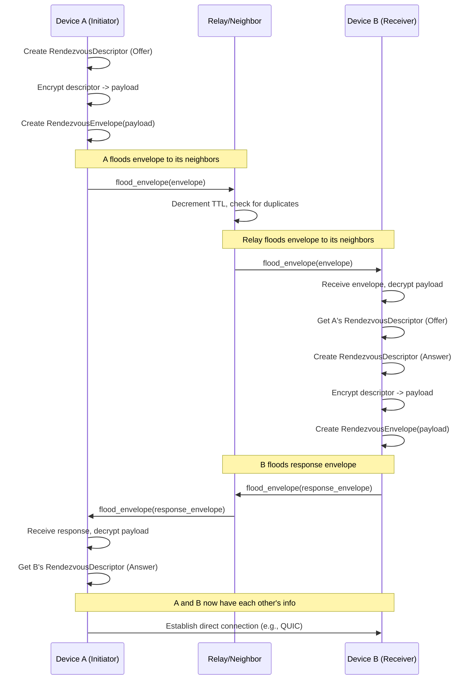

# Rendezvous

Rendezvous provides dependable peer discovery and connection setup between accounts while reusing primitives from the system architecture. The design favors simplicity over maximal privacy. Future releases can swap in richer privacy mechanics without rewriting the interfaces.

Each device runs a Rendezvous Manager exposing `establish_channel(AccountId)` returning a transport handle implementing `TransportEffects`. Internally the manager coordinates three subsystems. The Envelope Store keeps recent rendezvous offers and answers for every relationship in the unified journal. Entries are CRDT facts following join rules. The Neighbor Flooder pushes new envelopes to current neighbors using the same gossip loop replicating the journal. Flooding is per-context with only peers capable of seeing a relationship receiving envelopes. The Handshake Adapter consumes envelopes, charges flow-budget counters, and runs the data-plane handshake using Noise IKpsk2 over QUIC.

## Transport Strategy

Aura uses relay-first with STUN assistance achieving 95% plus connectivity without complex ICE coordination or TURN servers. QUIC is the primary transport for desktop and mobile using UDP-based multiplexed streams with built-in encryption. WebSocket runs over HTTP/HTTPS for firewall-friendly browser access. In-memory transport exists for testing only.

Connection attempts proceed in priority order with 2-second timeout before fallback. Direct QUIC works when local network access exists or one peer has a public IP handling 30% of cases. QUIC via STUN reflexive address uses NAT-mapped endpoints for 40-50% of cases. WebSocket relay via guardian or friend handles 20-30% of cases. The first successful connection is used.

STUN discovers the external IP and port mapping assigned by NATs. Devices query public STUN servers on startup caching the reflexive address with 5-minute TTL. The reflexive address appears in the `RendezvousDescriptor` as a transport hint. STUN failures are non-fatal as direct or relay still work.

For QUIC connections through NATs, a simple simultaneous open protocol performs hole-punching. Both peers include a `punch_nonce` in their offer and answer. Both peers simultaneously send small UDP packets to each other's reflexive address containing prefix, nonce, ephemeral public key, and MAC. NATs create bidirectional mappings when packets cross. The QUIC handshake completes using the punched path. This handles cone NATs and port-restricted NATs without full ICE machinery with symmetric NATs falling through to relay.

When direct connections fail, guardians or friends relay encrypted streams. End-to-end encryption means relays see only ciphertext. Relay requires `RelayCapability` in guardian or friend capabilities. Relay traffic counts against sender's flow budget. Guardians are preferred over friends.

## Data Structures

The journal records two structs per relationship:

```rust
struct RendezvousEnvelope {
    context: ContextId,
    role: OfferOrAnswer,
    epoch: EpochId,
    counter: u32,
    flow_cost: u32,
    payload_cid: Cid,
    publisher: DeviceId,
    signature: Signature,
}

struct RendezvousDescriptor {
    context: ContextId,
    transport_hints: Vec<TransportHint>,
    punch_nonce: Option<[u8; 32]>,
    handshake_psk: Uint256,
    validity: Interval,
    issuer: DeviceId,
    signature: Signature,
}

enum TransportHint {
    QuicDirect { addr: SocketAddr },
    QuicReflexive { addr: SocketAddr },
    WebSocketRelay { guardian_id: GuardianId },
    WebSocketDirect { url: String },
}
```

Payload bytes live in the encrypted blob store addressed by `payload_cid`. The envelope header is cleartext for gossip deduplication but the payload encrypts with `K_box` derived from pairwise RID. The `flow_cost` field expresses how much `FlowBudget` must be available before forwarding. The ledger entry `FlowBudget` with limit, spent, and epoch keys by context and neighbor device updating exactly once per successful forward.

## Protocol Flow



Device A needing to reach account B derives `context = RID_AB` and increments its rendezvous counter. A builds a `RendezvousDescriptor` with reachable transports and encrypts it with `K_box` then writes a new `RendezvousEnvelope` fact. Before the fact enters the journal, the manager charges `flow_cost` against every neighbor that will see the update. If any charge fails, publication defers until budget replenishes.

Neighbors pull the updated journal, validate the envelope signature, and store the blob locally. Per-hop receipts append so downstream relays prove the upstream hop charged its ledger slot preventing budget laundering.

Some device in account B decrypts the offer knowing `K_box` because it belongs to `RID_AB`. B selects its preferred transport hint, encrypts a response descriptor with the same context key, and publishes a `RendezvousEnvelope` fact. The flow-budget logic mirrors the offer path.

When A receives the answer, it extracts the PSK and transport hint then dials B via QUIC. Both sides run Noise IKpsk2 with context PSK bound into the transcript producing channel keys used by `TransportEffects`. The handshake result stores as `ConnectionDescriptor` so other subsystems reuse the live path.

Devices prune envelopes outside the validity window but keep CRDT histories to avoid conflicts. When a new device joins the account, existing devices replay the most recent descriptors so the newcomer gains immediate reachability. When the trust graph changes, capability revocations remove the ability to gossip envelopes for that context.

## Interfaces

The Rendezvous Manager exposes two functions. `publish_descriptor(ctx, transport)` executes when a transport hint changes. `establish_channel(account)` drives the full flow resolving the target account's RID, ensuring fresh envelopes exist, waiting for an answer, and returning a `SecureChannel`. Errors bubble up as structured `RendezvousError` variants: `Budget`, `Timeout`, `Auth`, `Transport`, and `Permission`.
