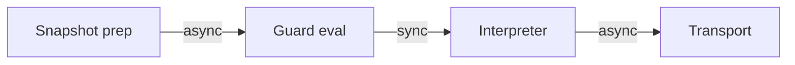
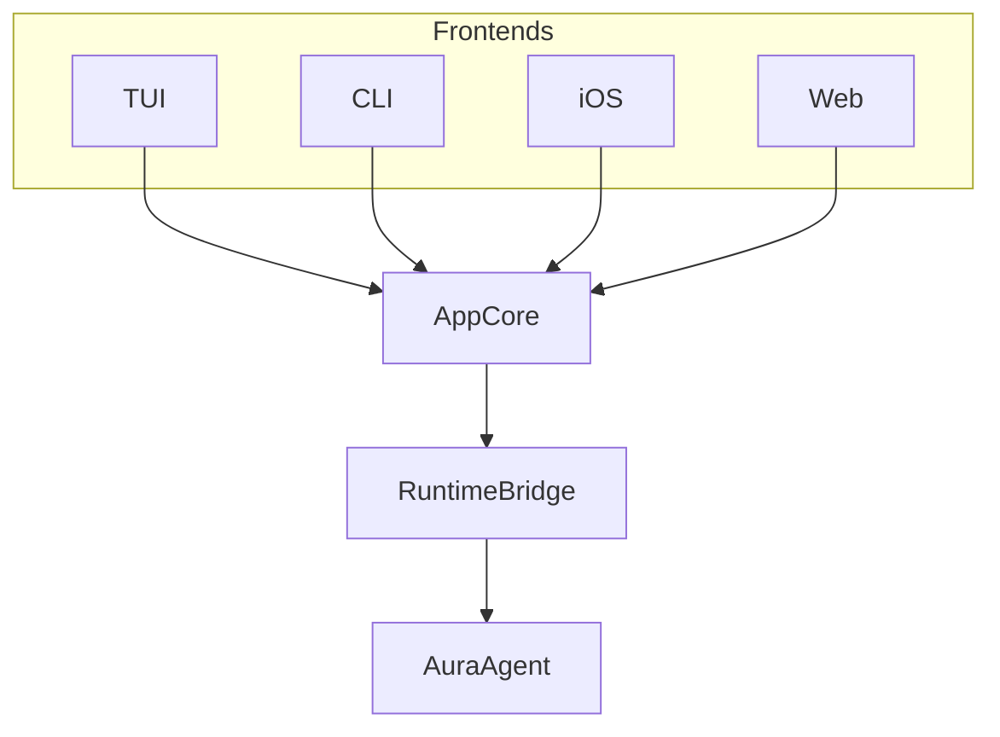

# Runtime

## Overview

The Aura runtime assembles effect handlers into working systems. It manages lifecycle, executes the guard chain, schedules reactive updates, and exposes services through `AuraAgent`. The `AppCore` provides a unified interface for all frontends.

This document covers runtime composition and execution. See [Effect System](103_effect_system.md) for trait definitions and handler design.
See [Ownership Model](122_ownership_model.md) for the repo-wide ownership
taxonomy.
The `aura-agent` crate-level runtime contract, including structured concurrency,
canonical ingress, ownership, typed errors, and CI policy gates, lives in
`crates/aura-agent/ARCHITECTURE.md`.

That contract is intentionally opinionated about the split of responsibilities:

- actor services own long-lived runtime supervision, lifecycle, and maintenance
- move semantics own session and endpoint ownership transfer

Those are related concerns, but they are not the same abstraction boundary.

For shared semantic operations, the split is stricter still:

- `aura-app::workflows` owns authoritative semantic lifecycle publication
- `aura-agent` owns long-lived runtime actors and readiness/state coordination
- frontend crates and the harness submit through sanctioned handoff boundaries
  and observe authoritative publication afterward

No runtime, frontend, or harness path should keep a parallel terminal
publication helper once the shared workflow owner has taken over.

The same visibility rule applies to runtime-owned mutation helpers. Raw VM
admission helpers, fragment ownership registry mutation, and the mutable
reconfiguration controller stay inside `aura-agent` runtime internals. Shared
consumers go through sanctioned ingress, session-owner, or manager surfaces.

## Ownership Categories In The Runtime

The runtime is the main place where Aura's ownership categories become concrete:

- long-lived runtime services, supervisors, readiness coordinators, and caches
  are `ActorOwned`
- session, endpoint, and delegation transfer surfaces are `MoveOwned`
- runtime views, projections, and exported state are `Observed`
- reducers, validators, and typed contracts remain `Pure`

Two runtime rules follow from that split:

1. Actor mailboxes are for mutation of actor-owned state, not as a substitute
   for move-style ownership transfer.
2. Runtime-facing lifecycle and readiness publication should be
   capability-gated and should terminate explicitly with typed success, failure,
   or cancellation.
3. Long-lived mutable async domains should be declared through
   `#[aura_macros::actor_owned(...)]`, and small parity-critical runtime
   lifecycle enums should prefer `#[aura_macros::ownership_lifecycle(...)]`
   over hand-written transition helpers.

## Structured Concurrency

`aura-agent` uses structured concurrency as the only production async model.

Rules:

- Every long-lived async subsystem has one named owner.
- Every owner has one rooted task group.
- Child tasks belong to exactly one task group.
- Detached fire-and-forget tasks are forbidden in production runtime code.
- Shutdown is hierarchical and parent-driven.

### Service Actor Pattern

Long-lived runtime services use actor ownership:

```rust
struct ServiceHandle {
    cmd_tx: mpsc::Sender<ServiceCommand>,
}

struct ServiceActor {
    state: ServiceState,
    cmd_rx: mpsc::Receiver<ServiceCommand>,
    tasks: TaskGroup,
}
```

Each actor maintains:

- Typed command channel for external requests.
- Single event loop driving all state transitions.
- Explicit lifecycle state machine.
- Owned child task group for internal loops.
- Authoritative health derived from actor state.

This actor layer is the runtime supervision layer. Use it for:

- service lifecycle
- task ownership
- shutdown ordering
- retries and maintenance loops
- health reporting

Do not treat actor mailboxes as the ownership-transfer primitive for sessions or delegated endpoints.

### Async Primitives

Preferred primitives:

- `aura-core::BoundedActorIngress` for declaring parity-critical actor ingress.
- crate-private service-actor handles/mailboxes in `aura-agent` for runtime
  command routing.
- `tokio::sync::oneshot` for typed request/reply acknowledgements.
- `tokio::sync::watch` for snapshots rather than command routing.
- `tokio::sync::Notify` for ownership-local wakeups.
- supervised task groups and actor loops rooted in `TaskSupervisor` /
  `TaskGroup`

Forbidden in production:

- Raw `tokio::spawn` and `spawn_local`.
- Ad hoc background loops without a task owner.
- Direct session mutation from non-owner tasks.
- Multi-writer service state as the default pattern.

The only sanctioned raw spawn implementation boundary in production runtime
code is `aura-agent`'s task registry. Other runtime code must go through
owned task-group APIs and retain or explicitly discard the returned owned task
handle.

## Lifecycle Management

`aura-agent` uses an explicit service lifecycle contract with authoritative
service states, structured task ownership, and deterministic teardown. The
crate-level runtime contract in `crates/aura-agent/ARCHITECTURE.md` is the
source of truth.

All long-lived services implement a shared lifecycle state machine:

- `new`: Initial state before startup.
- `starting`: Initialization in progress.
- `Running`: Actor alive and command path available.
- `stopping`: Graceful shutdown in progress.
- `Stopped`: No live owned tasks and no live command handling.
- `Failed`: Observable failure state.

Long-lived runtimes periodically prune caches and stale in-memory state through
owned service actors and supervised task groups. Domain crates expose cleanup
APIs but do not self-schedule. The agent runtime owns the scheduling model.

```rust
struct ServiceActor {
    state: ServiceState,
    cmd_rx: mpsc::Receiver<ServiceCommand>,
    tasks: TaskGroup,
}

impl ServiceActor {
    async fn run(&mut self) {
        while let Some(cmd) = self.cmd_rx.recv().await {
            match cmd {
                ServiceCommand::Start { reply } => {
                    self.state = ServiceState::Running;
                    let _ = reply.send(Ok(()));
                }
                ServiceCommand::Stop { reply } => {
                    self.state = ServiceState::Stopping;
                    self.tasks.shutdown().await;
                    self.state = ServiceState::Stopped;
                    let _ = reply.send(Ok(()));
                }
            }
        }
    }
}
```

This approach keeps time-based policy in the runtime layer and preserves deterministic testing. The simulator controls time directly. Layer 4 and 5 crates remain decoupled from runtime concerns.

### Runtime Timeout Policy

Runtime timeout behavior must preserve Aura's time-system contract:

- physical time drives local waiting, retry, and backoff policy
- logical, order, and provenanced time remain semantic ordering tools
- runtime owners publish typed timeout failure when local waiting is exhausted
- harness and simulation may scale timeout policy, but they should not invent a
  different semantic model

In practice this means:

- long-lived owners should consume a remaining timeout budget across nested
  stages instead of resetting fresh wall-clock literals at each call site
- retry loops should use shared backoff policy rather than duplicated sleeps
- timeout policy belongs to owner/coordinator code, not UI observation layers
- reducing timeout duration in tests or harness mode is acceptable; changing
  what timeout means is not
- runtime-facing workflow/task boundaries should carry `OperationTimeoutBudget`,
  `OwnedShutdownToken`, and `OwnedTaskSpawner` rather than raw `Duration`,
  raw cancellation traits, or ad hoc spawn helpers

## Guard Chain Execution

The runtime enforces guard chain sequencing defined in [Authorization](106_authorization.md). Each projected choreography message expands to three phases. First, snapshot preparation gathers capability frontier, budget headroom, and metadata. Second, pure guard evaluation runs synchronously over the snapshot. Third, command interpretation executes the resulting effect commands.



This diagram shows the guard execution flow. Snapshot preparation is async. Guard evaluation is pure and synchronous. Command interpretation is async and performs actual I/O.

### GuardSnapshot

The runtime prepares a `GuardSnapshot` immediately before entering the guard chain. It contains every stable datum a guard may inspect while remaining read-only.

```rust
pub struct GuardSnapshot {
    pub now: TimeStamp,
    pub caps: Cap,
    pub budgets: FlowBudgetView,
    pub metadata: MetadataView,
    pub rng_seed: [u8; 32],
}
```

Guards evaluate synchronously against this snapshot and the incoming request. They cannot mutate state or perform I/O. This keeps guard evaluation deterministic, replayable, and WASM-compatible.

### EffectCommands

Guards do not execute side effects directly. Instead, they return `EffectCommand` items for the interpreter to run. Each command is a minimal description of work.

```rust
pub enum EffectCommand {
    ChargeBudget {
        context: ContextId,
        authority: AuthorityId,
        peer: AuthorityId,
        amount: FlowCost,
    },
    AppendJournal { entry: JournalEntry },
    RecordLeakage { bits: u32 },
    StoreMetadata { key: String, value: String },
    SendEnvelope {
        to: NetworkAddress,
        peer_id: Option<uuid::Uuid>,
        envelope: Vec<u8>
    },
    GenerateNonce { bytes: usize },
}
```

Commands describe what happened rather than how. Interpreters can batch, cache, or reorder commands as long as the semantics remain intact. This vocabulary keeps the guard interface simple.

### EffectInterpreter

The `EffectInterpreter` trait encapsulates async execution of commands. Production runtimes hook it to `aura-effects` handlers. The simulator hooks deterministic interpreters that record events instead of hitting the network.

```rust
#[async_trait]
pub trait EffectInterpreter: Send + Sync {
    async fn execute(&self, cmd: EffectCommand) -> Result<EffectResult>;
    fn interpreter_type(&self) -> &'static str;
}
```

`ProductionEffectInterpreter` performs real I/O for storage, transport, and journal. `SimulationEffectInterpreter` records deterministic events and consumes simulated time. This design lets the guard chain enforce authorization, flow budgets, and journal coupling without leaking implementation details.

## Reactive Scheduling

The `ReactiveScheduler` in `aura-agent` processes journal facts and drives UI signal updates. It receives facts from multiple sources including journal commits, network receipts, and timers. It batches them in a 5ms window and drives all signal updates.

```
Intent → Fact Commit → FactPredicate → Query Invalidation → Signal Emit → UI Update
```

This flow shows how facts propagate to UI. Services emit facts rather than directly mutating view state. The scheduler processes fact batches and updates registered signal views. This eliminates dual-write bugs where different signal sources could desync.

### Signal Views

Domain signals are driven by signal views in the reactive scheduler. `ChatSignalView`, `ContactsSignalView`, and `InvitationsSignalView` process facts and emit full state snapshots to their respective signals.

```rust
// Define application signals
pub static CHAT_SIGNAL: LazyLock<Signal<ChatState>> =
    LazyLock::new(|| Signal::new("app:chat"));

// Bind signal to query at initialization
pub async fn register_app_signals_with_queries<R: ReactiveEffects>(
    handler: &R,
) -> Result<(), ReactiveError> {
    handler.register_query(&*CHAT_SIGNAL, ChatQuery::default()).await?;
    Ok(())
}
```

This example shows signal definition and query binding. Signals are defined as static lazy values. They are bound to queries during initialization. When facts change, queries invalidate and signals update automatically.

### Fact Processing

The scheduler integrates with the effect system through fact sinks. Facts flow from journal commits through the scheduler to signal views.

```rust
// In RuntimeSystem (aura-agent)
effect_system.attach_fact_sink(pipeline.fact_sender());

// The scheduler processes fact batches and updates signal views.
```

Terminal screens subscribe and automatically receive updates. This enables push-based UI updates without polling.

### UnifiedHandler

The `UnifiedHandler` composes Query and Reactive effects into a single cohesive handler. It holds a `QueryHandler`, a shared `ReactiveHandler`, and an optional capability context.

The `commit_fact` method adds a fact and invalidates affected queries. The `query` method checks capabilities and executes the query. `BoundSignal<Q>` pairs a signal with its source query for registration and invalidation tracking.

## Service Pattern

Domain crates define stateless handlers that take effect references per call. The agent layer wraps these with services that manage shared access.

### Handler Layer

Handlers in domain crates are stateless and return `GuardOutcome` values. They produce pure plans describing effect commands rather than performing I/O directly.

```rust
// aura-chat/src/fact_service.rs
pub struct ChatFactService;

impl ChatFactService {
    pub fn new() -> Self { Self }

    pub fn prepare_create_channel(
        &self,
        snapshot: &GuardSnapshot,
        channel_id: ChannelId,
        name: String,
    ) -> GuardOutcome {
        GuardOutcome::authorized(vec![
            EffectCommand::AppendJournal { entry: /* ... */ },
        ])
    }
}
```

This example shows a domain handler returning a guard outcome. The handler performs pure evaluation over the snapshot. It does not execute I/O or hold state. This keeps domain crates testable without tokio dependencies.

### Service Layer

Services in `aura-agent` wrap handlers, run guard evaluation, and interpret commands.

```rust
// aura-agent/src/handlers/chat_service.rs
pub struct ChatServiceApi {
    handler: ChatFactService,
    effects: Arc<AuraEffectSystem>,
}

impl ChatServiceApi {
    pub fn new(effects: Arc<AuraEffectSystem>) -> Self {
        Self {
            handler: ChatFactService::new(),
            effects,
        }
    }

    pub async fn create_group(
        &self,
        name: &str,
        creator_id: AuthorityId,
    ) -> AgentResult<ChatGroup> {
        let snapshot = self.effects.prepare_snapshot().await?;
        let outcome = self.handler.prepare_create_channel(
            &snapshot, ChannelId::new(), name.to_string(),
        );
        self.effects.interpret(outcome).await
    }
}
```

Services gather snapshots, call handlers, and interpret outcomes. They share the effect system via `Arc<AuraEffectSystem>`. Error normalization converts domain errors to `AgentError`.

### Agent API

The agent exposes services through accessor methods.

```rust
impl AuraAgent {
    pub fn chat(&self) -> ChatServiceApi {
        ChatServiceApi::new(self.runtime.effects())
    }

    pub fn sessions(&self) -> &SessionServiceApi { ... }
    pub fn auth(&self) -> &AuthServiceApi { ... }
    pub fn invitations(&self) -> &InvitationServiceApi { ... }
    pub fn recovery(&self) -> &RecoveryServiceApi { ... }
}
```

This pattern provides clean service access. Services are created on demand with no lazy-init overhead. The `ServiceRegistry` initializes all services during agent startup and holds `Arc` references to each.

## Session Management

The runtime manages the lifecycle of distributed protocols. Choreographies define protocol logic. Sessions represent single stateful executions of choreographies. The runtime uses structured concurrency with explicit session ownership.

### Session Ownership

Each active session or fragment has exactly one current local owner. The owner is either a per-session actor or an authoritative choreography runtime loop. This invariant is enforced through the canonical ingress pattern.

This is the move-semantics side of the runtime model:

- one current owner
- explicit transfer
- stale-owner rejection
- owner-routed session effects

Owner identity and capability are separate:

- ownership says who currently controls the fragment
- capability says what fragment-scoped work that owner may perform

```rust
enum SessionIngress {
    NetworkEnvelope(TransportEnvelope),
    Timer(SessionTimerEvent),
    Command(SessionCommand),
    DelegatedEndpoint(DelegationBundle),
}

struct SessionHandle {
    ingress_tx: mpsc::Sender<SessionIngress>,
}
```

Network, timer, and external events are queued before touching session state. Session ownership and task ownership move together. Session-bound effects execute only under the current owner.

The owner may be implemented by an actor, but the transfer of ownership is still an explicit move boundary rather than shared actor state.

### Ownership Transitions

Owner-visible state transitions:

- `Unowned -> Claimed`
- `Claimed -> Running`
- `Running -> DelegatingOut`
- `DelegatingOut -> Released`
- `Running -> Stopping`
- `Stopping -> Stopped`
- `Any -> Failed`

No transition may create overlapping owners.

### Session Interface

The `SessionManagementEffects` trait provides the abstract interface for all session operations.

```rust
pub trait SessionManagementEffects: Send + Sync {
    async fn create_choreographic_session(
        &self,
        session_type: SessionType,
        participants: Vec<ParticipantInfo>,
    ) -> Result<SessionId>;

    async fn send_choreographic_message(
        &self,
        session_id: SessionId,
        message: Vec<u8>,
    ) -> Result<()>;
}
```

This trait abstracts session management into an effect. Application logic remains decoupled from the underlying implementation. Sessions can use in-memory or persistent state.

### Session State

Concrete implementations act as the engine for the session system. Each session maintains:

- `SessionId` for unique identification.
- `SessionStatus` indicating the current phase.
- `Epoch` for coordinating state changes.
- Participant list.

Session creation and lifecycle are managed as choreographic protocols. The `SessionLifecycleChoreography` in `aura-protocol` ensures consistency across all participants.

### Telltale Integration

Aura executes production choreography sessions through the Telltale VM in Layer 6. Production startup is manifest-driven. Generated `CompositionManifest` metadata defines the protocol id, required capabilities, determinism profile reference, link constraints, and delegation constraints for each choreography. `AuraChoreoEngine` runs admitted VM sessions and exposes deterministic trace, replay, and envelope-validation APIs.

Runtime ownership is fragment-scoped. One admitted VM fragment has one local owner at a time. A choreography without link metadata is one fragment. A choreography with link metadata yields one fragment per linked bundle. Ownership claims, transfer, and release flow through `AuraEffectSystem` and `ReconfigurationManager`.

This is why the runtime uses both abstractions at once:

- actor services for host-side runtime structure
- explicit move-style ownership for fragment/session transfer

When delegation changes ownership, the runtime must also define whether the moved
capability is transferred intact or attenuated to a narrower scope. That decision
is part of the protocol/runtime contract, not a host-side convenience choice.

The synchronous callback boundary is `VmBridgeEffects`. `AuraVmEffectHandler` and `AuraQueuedVmBridgeHandler` use it for session-local payload queues, blocked receive snapshots, branch choices, and scheduler signals. Async transport, guard-chain execution, journal coupling, and storage remain outside VM callbacks in `vm_host_bridge` and service loops.

Dynamic reconfiguration follows the same rule. Runtime code must go through `ReconfigurationManager` for link and delegation so bundle evidence, capability admission, and coherence checks are enforced before any transfer occurs.

### VM Profiles

Telltale VM execution is configured through explicit runtime profiles. Use `build_vm_config(hardening, parity)` instead of ad-hoc `VMConfig` mutation.

`AuraVmHardeningProfile` controls safety posture. The `Dev` profile enables host contract assertions and full trace capture. The `Ci` profile enforces strict output predicate allow-lists and sequence replay mode. The `Prod` profile preserves safety checks with bounded overhead.

`AuraVmParityProfile` controls deterministic cross-target lanes. `NativeCooperative` provides the native parity baseline. `WasmCooperative` provides the WASM parity lane. Both use cooperative scheduling and strict effect determinism.

Determinism and scheduler policy are protocol-driven rather than ad hoc. Admission resolves the protocol class, applies the configured determinism tier and replay mode, validates the selected VM profile, and chooses scheduler controls from weighted measure plus guard-capacity signals. Production code should not mutate these settings directly after admission.

Operational envelopes are part of admission, not a host convention. Cooperative fragments run on the canonical VM. Replay-deterministic and envelope-bounded fragments select the threaded runtime only through the policy and admission path. Envelope-bounded fragments must provide admissible envelope artifacts or admission fails closed.

Mixed workloads are allowed. Cooperative and threaded fragments may coexist in the same runtime. The contract is per fragment. Envelope validation, diff capture, and fallback to canonical execution are also per fragment.

### Boundary Review Checklist

Use this checklist for any change to the Aura and Telltale boundary:

- Confirm that VM callbacks perform only synchronous `VmBridgeEffects` operations.
- Confirm that async transport, journal, storage, and guard work stay outside the callback path.
- Confirm that each admitted fragment has exactly one local owner at a time.
- Confirm that `delegate` and `link` flows use `ReconfigurationManager` and fragment ownership APIs.
- Confirm that threaded or envelope-bounded execution is selected only through policy and admission.
- Confirm that boundary changes add or update replay, conformance, and fault-path tests.

## Fact Registry

The `FactRegistry` provides domain-specific fact type registration and reduction for reactive scheduling. It lives in `aura-journal` and is integrated via `AuraEffectSystem::fact_registry()`.

### Registration

Domain crates register their fact types during effect system assembly.

```rust
registry.register(
    "chat",
    ChatFact::type_id(),
    |facts| ChatFact::reduce(facts),
);
```

This example shows `aura-chat` registering its fact type. Registered domains include Chat for message threading, Invitation for device invitations, Contact for relationship management, and Moderation for home and mute facts.

### Scheduling Integration

The reactive scheduler uses the registry to process domain facts. When facts arrive, the scheduler looks up the registered reducer. It applies the reducer to compute derived state and notifies reactive subscribers of state changes.

Production code obtains the registry via `effect_system.fact_registry()`. Tests may use `build_fact_registry()` for isolation. The registry assembly stays in Layer 6 rather than Layer 1.

## Delivery Policy

The `DeliveryPolicy` trait enables domain crates to define custom acknowledgment retention and garbage collection behavior. This keeps policy decisions in the appropriate layer while the journal provides generic ack storage.

Domain crates implement the trait to control acknowledgment lifecycle. Key methods include `min_retention` and `max_retention` for time bounds, `requires_ack` to check tracking needs, and `can_gc` to determine GC eligibility.

```rust
let chat_policy = ChatDeliveryPolicy {
    min_retention: Duration::from_secs(30 * 24 * 60 * 60),
    max_retention: Duration::from_secs(90 * 24 * 60 * 60),
};
effect_system.register_delivery_policy("chat", Arc::new(chat_policy));
```

This example shows domain-specific retention configuration. Chat messages retain acks for 30 to 90 days. Different domains can have vastly different retention needs. The maintenance system uses registered policies during GC passes.

## AppCore

The `AppCore` in `aura-app` provides a unified portable interface for all frontend platforms. It is headless and runtime-agnostic. It can run without a runtime bridge for offline or demo modes. It can be wired to a concrete runtime via the `RuntimeBridge` trait.

### Architecture

AppCore sits between frontends and a runtime bridge.



This diagram shows the AppCore architecture. Frontends import UI-facing types from `aura-app`. They may additionally depend on a runtime crate to obtain a concrete `RuntimeBridge`. This keeps `aura-app` portable while allowing multiple runtime backends.

### Construction Modes

AppCore supports two construction modes.

```rust
// Demo/Offline mode
let app = AppCore::new(config)?;

// Production mode
let agent = AgentBuilder::new()
    .with_config(agent_config)
    .with_authority(authority_id)
    .build_production()
    .await?;
let app = AppCore::with_runtime(config, agent.as_runtime_bridge())?;
```

Demo mode enables offline development and testing. Production mode provides full effect system capabilities. The runtime bridge exposes async capabilities for sync, signing, and protocols.

### Reactive Flow

All state changes flow through the reactive pipeline. Services emit facts rather than directly mutating view state. UI subscribes to signals using `signal.for_each()`. This preserves push semantics and avoids polling.

```
Local Intent ───┐
                │
Service Result ─┼──► Fact ──► Journal ──► Reduce ──► ViewState
                │                                      │
Remote Sync ────┘                                      ↓
                                               Signal<T> ──► UI
```

This flow shows the push-based reactive model. Facts from any source flow through the journal. Reduction computes view state. Signals push updates to UI subscribers.

### Runtime Access

When AppCore has a runtime, it provides access to runtime-backed operations.

```rust
if app.has_runtime() {
    let runtime = app.runtime().unwrap();
    let status = runtime.get_sync_status().await;
}
```

The runtime bridge exposes async capabilities while keeping `aura-app` decoupled from any specific runtime implementation. Frontends import app-facing types from `aura-app` and runtime types from `aura-agent` directly.
