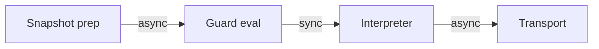
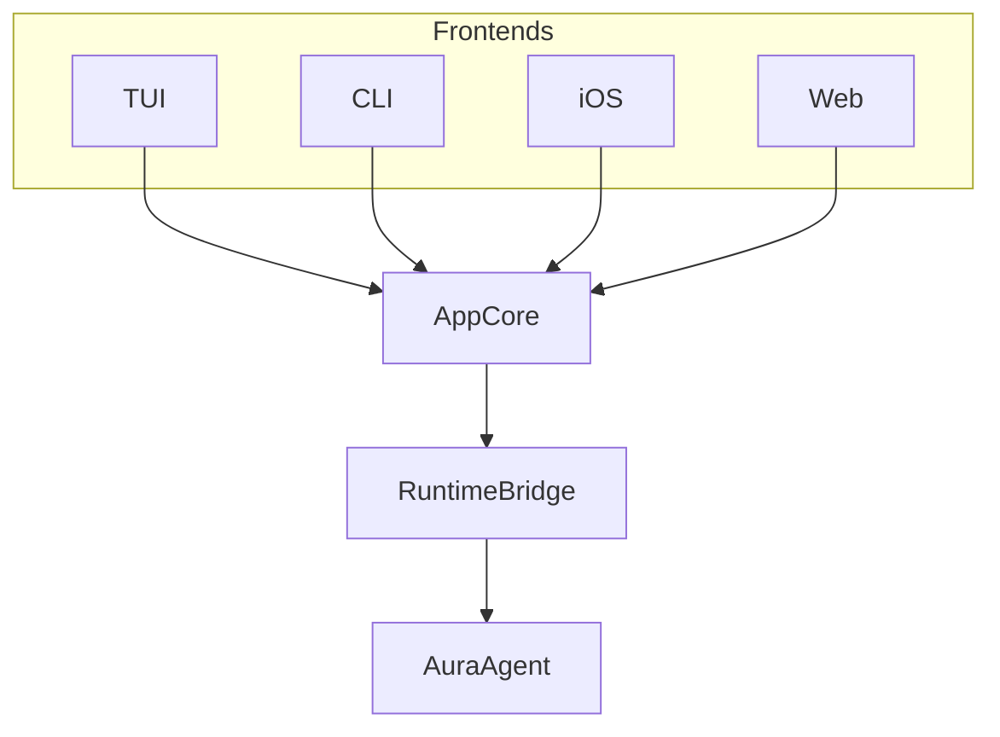

# Runtime

## Overview

The Aura runtime assembles effect handlers into working systems. It manages lifecycle, executes the guard chain, schedules reactive updates, and exposes services through `AuraAgent`. The `AppCore` provides a unified interface for all frontends.

This document covers runtime composition and execution. See [Effect System](103_effect_system.md) for trait definitions and handler design. See [Ownership Model](122_ownership_model.md) for the repo-wide ownership taxonomy. The `aura-agent` crate-level runtime contract, including structured concurrency, canonical ingress, ownership, typed errors, and CI policy gates, lives in `crates/aura-agent/ARCHITECTURE.md`.

That contract is intentionally opinionated about the split of responsibilities:

- actor services own long-lived runtime supervision, lifecycle, and maintenance
- move semantics own session and endpoint ownership transfer

Those are related concerns, but they are not the same abstraction boundary.

For shared semantic operations, the split is stricter still:

- `aura-app::workflows` owns authoritative semantic lifecycle publication
- `aura-agent` owns long-lived runtime actors and readiness/state coordination
- frontend crates and the harness submit through sanctioned handoff boundaries and observe authoritative publication afterward

No runtime, frontend, or harness path should keep a parallel terminal publication helper once the shared workflow owner has taken over.

The same visibility rule applies to runtime-owned mutation helpers. Raw VM admission helpers, fragment ownership registry mutation, and the mutable reconfiguration controller stay inside `aura-agent` runtime internals. Shared consumers go through sanctioned ingress, session-owner, or manager surfaces.

## Ownership Categories In The Runtime

The runtime is the main place where Aura's ownership categories become concrete:

- long-lived runtime services, supervisors, readiness coordinators, and caches
  are `ActorOwned`
- session, endpoint, and delegation transfer surfaces are `MoveOwned`
- runtime views, projections, and exported state are `Observed`
- reducers, validators, and typed contracts remain `Pure`

Two runtime rules follow from that split:

1. Actor mailboxes are for mutation of actor-owned state, not as a substitute
   for move-style ownership transfer.
2. Runtime-facing lifecycle and readiness publication should be
   capability-gated and should terminate explicitly with typed success, failure,
   or cancellation.
3. Long-lived mutable async domains should be declared through
   `#[aura_macros::actor_owned(...)]`, and small parity-critical runtime
   lifecycle enums should prefer `#[aura_macros::ownership_lifecycle(...)]`
   over hand-written transition helpers.

## Instrumentation Contract

All long-lived runtime services emit structured events from the following families: runtime startup/shutdown, service lifecycle transition, task spawn/completion/failure/abort, session claim/release/failure, ingress accepted/rejected/dropped, delegation start/commit/rollback/reject, link boundary route/reject, concurrency profile select/fallback, and invariant violation.

Required fields include `service`, `task`, `session_id`, `fragment_key`, `owner`, `from_owner`, `to_owner`, `profile`, `error_kind`, and `correlation_id` where applicable. These families ensure that runtime behavior is reconstructible from structured logs. Envelope admission, delegation witnesses, and fallback decisions must all be visible in instrumentation output.

## Structured Concurrency

`aura-agent` uses structured concurrency as the only production async model.

Rules:

- Every long-lived async subsystem has one named owner.
- Every owner has one rooted task group.
- Child tasks belong to exactly one task group.
- Detached fire-and-forget tasks are forbidden in production runtime code.
- Shutdown is hierarchical and parent-driven.

Runtime shutdown ordering remains an orchestration-level invariant, not a compile-time type property. Aura keeps a targeted integration check for the final shutdown sequence in `aura-agent::runtime::system`:
1. stop the reactive pipeline
2. cancel the runtime task tree
3. tear down services
4. shut down the lifecycle manager

That check is governance for the final runtime owner graph, not a replacement for the compile-time ownership model.

See [System Internals Guide](807_system_internals_guide.md) for implementation patterns and preferred primitives.

## Lifecycle Management

`aura-agent` uses an explicit service lifecycle contract with authoritative service states, structured task ownership, and deterministic teardown. The crate-level runtime contract in `crates/aura-agent/ARCHITECTURE.md` is the source of truth.

All long-lived services implement a shared lifecycle state machine:

- `new`: Initial state before startup.
- `starting`: Initialization in progress.
- `Running`: Actor alive and command path available.
- `stopping`: Graceful shutdown in progress.
- `Stopped`: No live owned tasks and no live command handling.
- `Failed`: Observable failure state.

Long-lived runtimes periodically prune caches and stale in-memory state through
owned service actors and supervised task groups. Domain crates expose cleanup
APIs but do not self-schedule. The agent runtime owns the scheduling model.

See [System Internals Guide](807_system_internals_guide.md) for service lifecycle implementation.

### Runtime Timeout Policy

Runtime timeout behavior must preserve Aura's time-system contract:

- physical time drives local waiting, retry, and backoff policy
- logical, order, and provenanced time remain semantic ordering tools
- runtime owners publish typed timeout failure when local waiting is exhausted
- harness and simulation may scale timeout policy, but they should not invent a different semantic model

In practice this means:

- long-lived owners should consume a remaining timeout budget across nested stages instead of resetting fresh wall-clock literals at each call site
- retry loops should use shared backoff policy rather than duplicated sleeps
- timeout policy belongs to owner/coordinator code, not UI observation layers
- reducing timeout duration in tests or harness mode is acceptable. Changing what timeout means is not.
- runtime-facing workflow/task boundaries should carry `OperationTimeoutBudget`, `OwnedShutdownToken`, and `OwnedTaskSpawner` rather than raw `Duration`, raw cancellation traits, or ad hoc spawn helpers
- parity-critical runtime waits should consume strong typed authoritative
  references once context is known. They must not re-derive ownership or
  context from weaker ids inside later readiness/wait helpers.

### Runtime Authority Discipline

Runtime-owned coordinators follow the same authority rule as app workflows:

- resolve authoritative typed input once at the boundary
- carry that typed input through later parity-critical readiness, retry, and
  terminal steps
- do not re-resolve context from raw ids after authoritative handoff
- do not keep fallback/default repair helpers on parity-critical paths

If a later step needs context, the API should require the strong typed
reference rather than accepting a raw identifier and looking it up again.

## Guard Chain Execution

The runtime enforces guard chain sequencing defined in [Authorization](106_authorization.md). Each projected choreography message expands to three phases. First, snapshot preparation gathers capability frontier, budget headroom, and metadata. Second, pure guard evaluation runs synchronously over the snapshot. Third, command interpretation executes the resulting effect commands.



This diagram shows the guard execution flow. Snapshot preparation is async. Guard evaluation is pure and synchronous. Command interpretation is async and performs actual I/O.

### GuardSnapshot

The runtime prepares a `GuardSnapshot` immediately before entering the guard chain. It contains every stable datum a guard may inspect while remaining read-only.

```rust
pub struct GuardSnapshot {
    pub now: TimeStamp,
    pub caps: Cap,
    pub budgets: FlowBudgetView,
    pub metadata: MetadataView,
    pub rng_seed: [u8; 32],
}
```

Guards evaluate synchronously against this snapshot and the incoming request. They cannot mutate state or perform I/O. This keeps guard evaluation deterministic, replayable, and WASM-compatible.

### EffectCommands

Guards do not execute side effects directly. Instead, they return `EffectCommand` items for the interpreter to run. Each command is a minimal description of work.

```rust
pub enum EffectCommand {
    ChargeBudget {
        context: ContextId,
        authority: AuthorityId,
        peer: AuthorityId,
        amount: FlowCost,
    },
    AppendJournal { entry: JournalEntry },
    RecordLeakage { bits: u32 },
    StoreMetadata { key: String, value: String },
    SendEnvelope {
        to: NetworkAddress,
        peer_id: Option<uuid::Uuid>,
        envelope: Vec<u8>
    },
    GenerateNonce { bytes: usize },
}
```

Commands describe what happened rather than how. Interpreters can batch, cache, or reorder commands as long as the semantics remain intact. This vocabulary keeps the guard interface simple.

### EffectInterpreter

The `EffectInterpreter` trait encapsulates async execution of commands. Production runtimes hook it to `aura-effects` handlers. The simulator hooks deterministic interpreters that record events instead of hitting the network.

```rust
#[async_trait]
pub trait EffectInterpreter: Send + Sync {
    async fn execute(&self, cmd: EffectCommand) -> Result<EffectResult>;
    fn interpreter_type(&self) -> &'static str;
}
```

`ProductionEffectInterpreter` performs real I/O for storage, transport, and journal. `SimulationEffectInterpreter` records deterministic events and consumes simulated time. This design lets the guard chain enforce authorization, flow budgets, and journal coupling without leaking implementation details.

## Reactive Scheduling

The `ReactiveScheduler` in `aura-agent` processes journal facts and drives UI signal updates. It receives facts from multiple sources including journal commits, network receipts, and timers. It batches them in a 5ms window and drives all signal updates.

```
Intent → Fact Commit → FactPredicate → Query Invalidation → Signal Emit → UI Update
```

This flow shows how facts propagate to UI. Services emit facts rather than directly mutating view state. The scheduler processes fact batches and updates registered signal views. This eliminates dual-write bugs where different signal sources could desync.

### Signal Views

Domain signals are driven by signal views in the reactive scheduler. `ChatSignalView`, `ContactsSignalView`, and `InvitationsSignalView` process facts and emit full state snapshots to their respective signals.

```rust
// Define application signals
pub static CHAT_SIGNAL: LazyLock<Signal<ChatState>> =
    LazyLock::new(|| Signal::new("app:chat"));

// Bind signal to query at initialization
pub async fn register_app_signals_with_queries<R: ReactiveEffects>(
    handler: &R,
) -> Result<(), ReactiveError> {
    handler.register_query(&*CHAT_SIGNAL, ChatQuery::default()).await?;
    Ok(())
}
```

This example shows signal definition and query binding. Signals are defined as static lazy values. They are bound to queries during initialization. When facts change, queries invalidate and signals update automatically.

### Fact Processing

The scheduler integrates with the effect system through fact sinks. Facts flow from journal commits through the scheduler to signal views.

```rust
// In RuntimeSystem (aura-agent)
effect_system.attach_fact_sink(pipeline.fact_sender());

// The scheduler processes fact batches and updates signal views.
```

Terminal screens subscribe and automatically receive updates. This enables push-based UI updates without polling.

### UnifiedHandler

The `UnifiedHandler` composes Query and Reactive effects into a single cohesive handler. It holds a `QueryHandler`, a shared `ReactiveHandler`, and an optional capability context.

The `commit_fact` method adds a fact and invalidates affected queries. The `query` method checks capabilities and executes the query. `BoundSignal<Q>` pairs a signal with its source query for registration and invalidation tracking.

## Service Pattern

The runtime uses a three-tier service architecture. Domain crates define stateless handlers that produce pure `GuardOutcome` plans without performing I/O. The agent layer wraps these handlers with services that gather snapshots, run guard evaluation, and interpret effect commands. The agent exposes services through typed accessor methods on `AuraAgent`, with a `ServiceRegistry` holding `Arc` references initialized at startup.

See [System Internals Guide](807_system_internals_guide.md) for the handler/service/API implementation pattern.

## Session Management

The runtime manages the lifecycle of distributed protocols. Choreographies define protocol logic. Sessions represent single stateful executions of choreographies. The runtime uses structured concurrency with explicit session ownership.

### Session Ownership

Each active session or fragment has exactly one current local owner. The owner is either a per-session actor or an authoritative choreography runtime loop. This invariant is enforced through the canonical ingress pattern.

This is the move-semantics side of the runtime model:

- one current owner
- explicit transfer
- stale-owner rejection
- owner-routed session effects

Owner identity and capability are separate:

- ownership says who currently controls the fragment
- capability says what fragment-scoped work that owner may perform

Network, timer, and external events are queued before touching session state. Session ownership and task ownership move together. Session-bound effects execute only under the current owner.

The owner may be implemented by an actor, but the transfer of ownership is still an explicit move boundary rather than shared actor state.

See [Choreography Development Guide](803_choreography_guide.md) for session ownership implementation.

### Ownership Transitions

Owner-visible state transitions:

- `Unowned -> Claimed`
- `Claimed -> Running`
- `Running -> DelegatingOut`
- `DelegatingOut -> Released`
- `Running -> Stopping`
- `Stopping -> Stopped`
- `Any -> Failed`

No transition may create overlapping owners.

### Session Interface

The `SessionManagementEffects` trait provides the abstract interface for all session operations. Application logic remains decoupled from the underlying implementation. Sessions can use in-memory or persistent state.

### Session State

Concrete implementations act as the engine for the session system. Each session maintains:

- `SessionId` for unique identification.
- `SessionStatus` indicating the current phase.
- `Epoch` for coordinating state changes.
- Participant list.

Session creation and lifecycle are managed as choreographic protocols. The `SessionLifecycleChoreography` in `aura-protocol` ensures consistency across all participants.

### Telltale Integration

Aura executes production choreography sessions through the Telltale protocol machine in Layer 6. Production startup is manifest-driven. Generated `CompositionManifest` metadata defines the protocol id, required capabilities, determinism profile reference, link constraints, and delegation constraints for each choreography. `AuraChoreoEngine` runs admitted protocol-machine sessions and exposes deterministic trace, replay, and envelope-validation APIs.

Aura is aligned with Telltale `10.0.0`'s public runtime model rather than a private compatibility surface. Runtime admission, canonical finalization, semantic handoff, and runtime-upgrade execution all use public protocol-machine concepts. Fail-closed receipt and authority handling is explicit at Aura's runtime boundaries, and timeout expiry is modeled from issued timeout witnesses rather than from late elapsed-time inference. For the upstream capability/finalization/runtime-upgrade contract, read Telltale `docs/38_capability_model.md`.

Runtime ownership is fragment-scoped. One admitted protocol fragment has one local owner at a time. A choreography without link metadata is one fragment. A choreography with link metadata yields one fragment per linked bundle. Ownership claims, transfer, and release flow through `AuraEffectSystem` and `ReconfigurationManager`.

This is why the runtime uses both abstractions at once:

- actor services for host-side runtime structure
- explicit move-style ownership for fragment/session transfer

When delegation changes ownership, the runtime must also define whether the moved capability is transferred intact or attenuated to a narrower scope. That decision is part of the protocol/runtime contract, not a host-side convenience choice.

The synchronous callback boundary is `VmBridgeEffects`. `AuraVmEffectHandler` and `AuraQueuedVmBridgeHandler` use it for session-local payload queues, blocked receive snapshots, branch choices, and scheduler signals. Async transport, guard-chain execution, journal coupling, and storage remain outside protocol-machine callbacks in `vm_host_bridge` and service loops.

Dynamic reconfiguration follows the same rule. Runtime code must go through `ReconfigurationManager` for link and delegation so bundle evidence, capability admission, and coherence checks are enforced before any transfer occurs.

Dynamic reconfiguration also carries typed upgrade artifacts end to end. When a delegation also performs a runtime upgrade, Aura persists the delegation fact, records the typed upgrade request/execution pair, and rejects missing source ownership or invalid upgrade evidence rather than repairing state implicitly.

### Runtime Profiles

Telltale protocol-machine execution is configured through two profile axes:

- **`AuraVmHardeningProfile`** controls safety posture: `Dev` (assertions + full trace), `Ci` (strict allow-lists + replay), `Prod` (safety checks with bounded overhead).
- **`AuraVmParityProfile`** controls deterministic cross-target lanes: `NativeCooperative` (native baseline) and `WasmCooperative` (WASM lane), both using cooperative scheduling and strict effect determinism.

Determinism and scheduler policy are protocol-driven. Admission resolves the protocol class, applies the configured determinism tier and replay mode, validates the selected runtime profile, and chooses scheduler controls. Production code should not mutate these settings directly after admission.

Mixed workloads are allowed. Cooperative and threaded fragments may coexist in the same runtime. The contract is per fragment.

See [System Internals Guide](807_system_internals_guide.md) for VM configuration patterns.

### Boundary Review Checklist

Changes to VM/Aura boundaries require review against the checklist in [System Internals Guide](807_system_internals_guide.md).

## Concurrency Profiles and Envelope Admission

`aura-agent` recognizes three runtime concurrency profiles for choreography work:

- **Canonical**: Exact single-owner reference path. Telltale canonical execution at concurrency `n = 1` is the reference behavior.
- **EnvelopeAdmitted**: Disjoint or admitted work preserving safety-visible meaning. Higher concurrency is a refinement only when it stays inside the admitted envelope relation.
- **Fallback**: Immediate degradation to canonical execution when envelope admission fails.

Correctness never depends on uncontrolled host scheduling. If the runtime cannot show that a path is envelope-safe, it serializes execution.

### Envelope Admission Contract

Operational envelope admission is a runtime gate, not a comment-level convention. The runtime must record and enforce:

- which determinism / concurrency profile was requested
- which evidence or certificate admitted the profile
- whether execution stayed canonical or entered an admitted refinement
- why fallback occurred when admission failed

Safety-visible observations must remain equivalent to the canonical reference. Every admitted step must have a declared witness path. Profile-side obligations must be checked before execution widens.

## Link and Delegate Boundaries

### Link Boundary

`link` is a static composition boundary. Linked bundles define ownership boundaries as well as composition boundaries. Linked protocols remain session-disjoint unless composition explicitly shares state. Cross-boundary effect routing is explicit. Ad hoc shared mutable state across linked boundaries is forbidden. `link` must preserve Telltale coherence and harmony obligations at runtime, not just compile-time compatibility.

A boundary object must carry enough information to answer:

- which bundle/fragment boundary this effect belongs to
- which owner capability scope is valid at that boundary
- whether a route crosses a boundary that requires explicit reconfiguration handling

Wrong-boundary routing is a runtime error and must be rejected before the VM observes the step.

### Delegate Boundary

`delegate` is an ownership-transfer boundary. Endpoint/session ownership transfer is atomic. Capability/effect context transfers with the endpoint. Stale-owner access after delegation is forbidden. Ambiguous local ownership is rejected before the VM observes the transfer. Fragment ownership and session footprint state move with the transfer rather than lagging behind it.

Transfer and attenuation are separate concepts:

- transfer changes the authoritative owner
- attenuation narrows the capability scope that moves with the new owner

If the runtime cannot state which one is happening and under which protocol rule, it must reject the delegation path.

A successful delegation must move one owned bundle: session owner record, owner capability, protocol fragment ownership, runtime footprint / reconfiguration state, and delegation audit witness. If these do not move together, the transfer is incomplete and must be treated as a runtime error.

### Theorem-pack / Invariant Alignment

The runtime must preserve coherence-sensitive session and edge state, harmony-sensitive reconfiguration steps, adequacy-relevant observable traces, determinism-profile obligations, and replay / communication identity stability across async ingress. Advanced runtime modes should be capability- and evidence-gated. Missing invariant evidence must cause rejection or fallback, never silent widening.

## Fact Registry

The `FactRegistry` provides domain-specific fact type registration and reduction for reactive scheduling. It lives in `aura-journal` and is integrated via `AuraEffectSystem::fact_registry()`. Registered domains include Chat for message threading, Invitation for device invitations, Contact for relationship management, and Moderation for home and mute facts.

Reactive subscription policy is explicit:
- subscribing to an unregistered signal fails fast with `ReactiveError::SignalNotFound`
- there is no implicit wait-for-registration or dead-stream fallback
- subscriber delivery is eventually consistent rather than lossless
- if a subscriber lags behind the bounded broadcast buffer, intermediate values may be dropped and the subscriber resumes from a newer snapshot after a lag warning is logged

Production code obtains the registry via `effect_system.fact_registry()`. Tests may use `build_fact_registry()` for isolation. The registry assembly stays in Layer 6 rather than Layer 1.

See [Effects and Handlers Guide](802_effects_guide.md) for fact registration patterns.

## Delivery Policy

The `DeliveryPolicy` trait enables domain crates to define custom acknowledgment retention and garbage collection behavior. This keeps policy decisions in the appropriate layer while the journal provides generic ack storage.

Domain crates implement the trait to control acknowledgment lifecycle. Key methods include `min_retention` and `max_retention` for time bounds, `requires_ack` to check tracking needs, and `can_gc` to determine GC eligibility.

```rust
let chat_policy = ChatDeliveryPolicy {
    min_retention: Duration::from_secs(30 * 24 * 60 * 60),
    max_retention: Duration::from_secs(90 * 24 * 60 * 60),
};
effect_system.register_delivery_policy("chat", Arc::new(chat_policy));
```

This example shows domain-specific retention configuration. Chat messages retain acks for 30 to 90 days. Different domains can have vastly different retention needs. The maintenance system uses registered policies during GC passes.

## AppCore

The `AppCore` in `aura-app` provides a unified portable interface for all frontend platforms. It is headless and runtime-agnostic. It can run without a runtime bridge for offline or demo modes. It can be wired to a concrete runtime via the `RuntimeBridge` trait.

### Architecture

AppCore sits between frontends and a runtime bridge.



This diagram shows the AppCore architecture. Frontends import UI-facing types from `aura-app`. They may additionally depend on a runtime crate to obtain a concrete `RuntimeBridge`. This keeps `aura-app` portable while allowing multiple runtime backends.

### Construction Modes

AppCore supports two construction modes: demo/offline mode (no runtime bridge, for development and testing) and production mode (wired to a concrete `RuntimeBridge` for full effect system capabilities).

See [Getting Started Guide](801_hello_world_guide.md) for AppCore usage.

### Reactive Flow

All state changes flow through the reactive pipeline. Services emit facts rather than directly mutating view state. UI subscribes to signals using `signal.for_each()`. This preserves push semantics and avoids polling.

```
Local Intent ───┐
                │
Service Result ─┼──► Fact ──► Journal ──► Reduce ──► ViewState
                │                                      │
Remote Sync ────┘                                      ↓
                                               Signal<T> ──► UI
```

This flow shows the push-based reactive model. Facts from any source flow through the journal. Reduction computes view state. Signals push updates to UI subscribers.

### Runtime Access

When AppCore has a runtime, it provides access to runtime-backed operations through the `RuntimeBridge` trait. The runtime bridge exposes async capabilities while keeping `aura-app` decoupled from any specific runtime implementation. Frontends import app-facing types from `aura-app` and runtime types from `aura-agent` directly.
