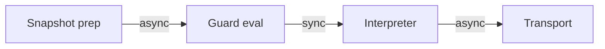
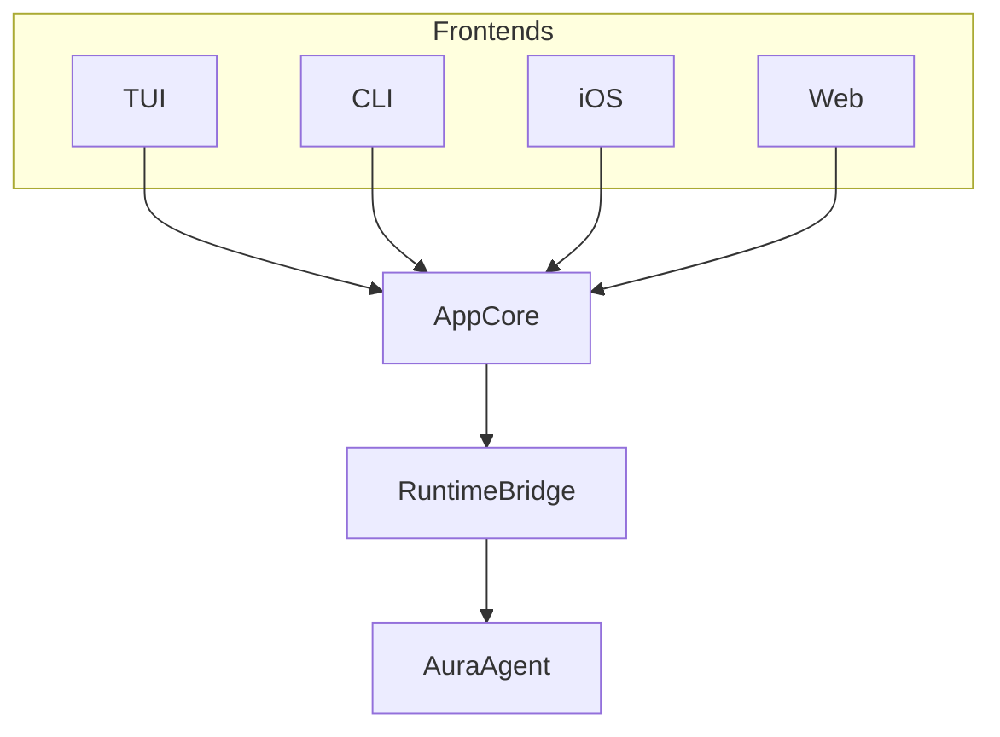

# Runtime

## Overview

The Aura runtime assembles effect handlers into working systems. It manages lifecycle, executes the guard chain, schedules reactive updates, and exposes services through `AuraAgent`. The `AppCore` provides a unified interface for all frontends.

This document covers runtime composition and execution. See [Effect System](103_effect_system.md) for trait definitions and handler design. See [Ownership Model](122_ownership_model.md) for the repo-wide ownership taxonomy. The `aura-agent` crate-level runtime contract, including structured concurrency, canonical ingress, ownership, typed errors, and CI policy gates, lives in `crates/aura-agent/ARCHITECTURE.md`.

That contract is intentionally opinionated about the split of responsibilities:

- actor services own long-lived runtime supervision, lifecycle, and maintenance
- move semantics own session and endpoint ownership transfer

Those are related concerns, but they are not the same abstraction boundary.

For shared semantic operations, the split is stricter still:

- `aura-app::workflows` owns authoritative semantic lifecycle publication
- `aura-agent` owns long-lived runtime actors and readiness/state coordination
- frontend crates and the harness submit through sanctioned handoff boundaries and observe authoritative publication afterward

No runtime, frontend, or harness path should keep a parallel terminal publication helper once the shared workflow owner has taken over.

The same visibility rule applies to runtime-owned mutation helpers. Raw VM admission helpers, fragment ownership registry mutation, and the mutable reconfiguration controller stay inside `aura-agent` runtime internals. Shared consumers go through sanctioned ingress, session-owner, or manager surfaces.

Enrollment setup export belongs to the signing runtime owner. Device identity,
key epoch, mode, policy and package are one coherent snapshot; frontend or
harness identity staging cannot substitute for this snapshot. The runtime
verifies and retains the signed request before returning its code. Export
failures preserve typed time, readiness, admission, proof and storage causes
across the app's runtime bridge. Signing recovery preserves prior verifier
identity and fails closed on incomplete persisted material, as specified in
[Cryptography](100_crypto.md).

Signing-material preparation, activation, recovery and rollback have one
serialized lifecycle owner. Activation validates the prospective context and
local membership before persisting the active epoch and exposing the context.
An active or historical epoch cannot be rolled back as a failed pending
rotation. Existing pending material cannot be silently replaced by a second
preparation for the same epoch.

Bootstrap publishes its signing context only after genesis completion. Its
pending/complete record is independent of the active key epoch, so persisted
keys cannot turn a failed tree commit into readiness on retry. A cached tree
operation without its persisted operation and index entry is insufficient
completion evidence. Legacy migration requires an existing authenticated
creation witness; restoration cannot silently recreate a missing lineage.

## Adaptive Privacy Runtime Ownership

Adaptive privacy policy is runtime-owned local state, not shared truth.

- the `Neighborhood Plane` and `Web of Trust Plane` provide permit and
  candidate inputs
- rendezvous descriptor views provide service-surface advertisement inputs
- `SelectionManagerService` fuses those inputs with local health and budget signals
  into runtime-local `LocalSelectionProfile` and `SelectionState`
- `LocalHealthObserverService` owns smoothing, hysteresis, and local health snapshots
- `MoveManager` owns bounded movement queues, replay windows, flush scheduling, congestion state, and the current routing profile used for `MoveEnvelope` delivery
- `HoldManager` owns held-object custody, selector rotation, bounded holder residency, local Hold GC, verified witness handling, and neighborhood-scoped provider scoring
- `AnonymousPathManager` owns reusable anonymous established-path lifecycle and
  protected encrypted establish-session state
- `CoverTrafficGeneratorService` owns cover-floor planning and reserved cover budget

This split is strict:

- final route, holder, and path reuse decisions are runtime-local
- those decisions must not be published as authoritative facts or descriptor
  fields
- retrieval, cover, accountability replies, and ordinary movement share one
  `MoveEnvelope` family where applicable rather than regaining separate
  transport families

The production adaptive policy is fixed by deployment rather than user configuration. The current fixed policy uses path-diversity floor `2`, cover floor `2` packets per second, delay gain denominator `3`, neighborhood hold retention window `120s`, and retrieval-capability rotation beginning `10s` before expiry. Development and simulation may tune those values, but production nodes do not expose per-user privacy knobs.

`LocalRoutingProfile::passthrough()` remains the pre-privacy baseline. It uses mixing depth `0`, delay `0`, cover rate `0`, and path diversity `1`. `Hold` remains active under passthrough because custody and selector retrieval are availability services rather than privacy-profile parameters.

### Transparent Onion Quarantine

`transparent_onion` is a debug, test, and simulation tool only.

- it may expose transparent anonymous setup and envelope headers for inspection
- the production runtime path is encrypted; transparent objects exist only on
  the explicit debug/simulation feature surface
- it must remain excluded from parity-critical harness and shared-flow lanes
- production policy ownership does not change when the feature is enabled
- the feature must not become an implicit dependency of browser, TUI, or
  conformance behavior

## Ownership Categories In The Runtime

The runtime is the main place where Aura's ownership categories become concrete:

- long-lived runtime services, supervisors, readiness coordinators, and caches
  are `ActorOwned`
- session, endpoint, and delegation transfer surfaces are `MoveOwned`
- runtime views, projections, and exported state are `Observed`
- reducers, validators, and typed contracts remain `Pure`

Two runtime rules follow from that split:

1. Actor mailboxes are for mutation of actor-owned state, not as a substitute
   for move-style ownership transfer.
2. Runtime-facing lifecycle and readiness publication should be
   capability-gated and should terminate explicitly with typed success, failure,
   or cancellation.
3. Long-lived mutable async domains should be declared through
   `#[aura_macros::actor_owned(...)]`, and small parity-critical runtime
   lifecycle enums should prefer `#[aura_macros::ownership_lifecycle(...)]`
   over hand-written transition helpers.

## Instrumentation Contract

All long-lived runtime services emit structured events from the following families: runtime startup/shutdown, service lifecycle transition, task spawn/completion/failure/abort, session claim/release/failure, ingress accepted/rejected/dropped, delegation start/commit/rollback/reject, link boundary route/reject, concurrency profile select/fallback, and invariant violation.

Required fields include `service`, `task`, `session_id`, `fragment_key`, `owner`, `from_owner`, `to_owner`, `profile`, `error_kind`, and `correlation_id` where applicable. These families ensure that runtime behavior is reconstructible from structured logs. Envelope admission, delegation witnesses, and fallback decisions must all be visible in instrumentation output.

## Structured Concurrency

`aura-agent` uses structured concurrency as the only production async model.

Rules:

- Every long-lived async subsystem has one named owner.
- Every owner has one rooted task group.
- Child tasks belong to exactly one task group.
- Detached fire-and-forget tasks are forbidden in production runtime code.
- Shutdown is hierarchical and parent-driven.

Runtime shutdown ordering remains an orchestration-level invariant, not a compile-time type property. Aura keeps a targeted integration check for the final shutdown sequence in `aura-agent::runtime::system`:
1. stop the reactive pipeline
2. cancel the runtime task tree
3. tear down services
4. shut down the lifecycle manager

That check is governance for the final runtime owner graph, not a replacement for the compile-time ownership model.

See [System Internals Guide](807_system_internals_guide.md) for implementation patterns and preferred primitives.

## Lifecycle Management

`aura-agent` uses an explicit service lifecycle contract with authoritative service states, structured task ownership, and deterministic teardown. The crate-level runtime contract in `crates/aura-agent/ARCHITECTURE.md` is the source of truth.

All long-lived services implement a shared lifecycle state machine:

- `new`: Initial state before startup.
- `starting`: Initialization in progress.
- `Running`: Actor alive and command path available.
- `stopping`: Graceful shutdown in progress.
- `Stopped`: No live owned tasks and no live command handling.
- `Failed`: Observable failure state.

Long-lived runtimes periodically prune caches and stale in-memory state through
owned service actors and supervised task groups. Domain crates expose cleanup
APIs but do not self-schedule. The agent runtime owns the scheduling model.

Required periodic work terminates with typed success, failure, or cancellation.
A timer or callback failure remains a failed task with its concrete source and
must be observable through owning service health and drain. An invalid interval
policy fails before invoking domain work. Intentional callback completion is
distinct from a failed callback. Supervisor clock failures are distinct from
observed drain deadline expiry.

Task-group supervision covers descendants even after callers drop their group
handles. Shutdown closes admission across the owned subtree before waiting;
late submissions cannot schedule work. Forced abort requests cancellation but
does not establish drain. Task registrations remain active until the owned
future and its resources have actually dropped. Descendant failures propagate
to ancestor health and retain their original cause. Group depth, live groups
and active tasks have explicit admission bounds; dead group entries are pruned.

See [System Internals Guide](807_system_internals_guide.md) for service lifecycle implementation.

### Runtime Timeout Policy

A choreography receive owns its local deadline for the lifetime of that receive
future. Inbox notifications cannot renew it, and dropping the future leaves no
registered timer resource. Required clock and sleep observations determine
expiry through the shared typed timeout budget. A zero configured receive timeout
remains immediate when no matching message is already queued.

Choreography session admission requires a successful physical clock read before
installing session state or task bindings. A failed read is a typed required-time
failure with its original source; zero is not substitute clock evidence.
Session retirement removes owned session resources even if its required clock
read fails. The clock failure remains primary, and any retirement failure is
retained as a separate typed cause. Duration metrics are updated only when the
required observation exists. Receive-timeout issuance and waiting preserve
native time-effect causes through the choreography error boundary.

Runtime timeout behavior must preserve Aura's time-system contract:

- physical time drives local waiting, retry, and backoff policy
- logical, order, and provenanced time remain semantic ordering tools
- runtime owners publish typed timeout failure when local waiting is exhausted
- required clock and backoff failures retain their actual cause and remain
  distinct from deadline expiry; an unavailable clock cannot fabricate an
  observed deadline or authorize timeout retry
- pending invitation lookup errors remain required failures even when observed
  pending or accepted history exists; history recovery requires a typed
  readiness exhaustion outcome, and clock or policy failures cannot select it
- runtime-to-app deadline errors retain the typed deadline cause through the
  standard error source chain; semantic observers classify deadlines from that
  cause rather than matching display text
- harness and simulation may scale timeout policy, but they should not invent a different semantic model

In practice this means:

- long-lived owners should consume a remaining timeout budget across nested stages instead of resetting fresh wall-clock literals at each call site
- enrollment retries and child VM attempts remain bounded by the ceremony's
  original deadline; restoration does not grant a new acceptance window
- retry loops should use shared backoff policy rather than duplicated sleeps
- timeout policy belongs to owner/coordinator code, not UI observation layers
- reducing timeout duration in tests or harness mode is acceptable. Changing what timeout means is not.
- runtime-facing workflow/task boundaries should carry `OperationTimeoutBudget`, `OwnedShutdownToken`, and `OwnedTaskSpawner` rather than raw `Duration`, raw cancellation traits, or ad hoc spawn helpers
- parity-critical runtime waits should consume strong typed authoritative
  references once context is known. They must not re-derive ownership or
  context from weaker ids inside later readiness/wait helpers.

### Runtime Authority Discipline

Runtime-owned coordinators follow the same authority rule as app workflows:

- resolve authoritative typed input once at the boundary
- carry that typed input through later parity-critical readiness, retry, and
  terminal steps
- do not re-resolve context from raw ids after authoritative handoff
- do not keep fallback/default repair helpers on parity-critical paths

If a later step needs context, the API should require the strong typed
reference rather than accepting a raw identifier and looking it up again.

## Guard Chain Execution

The runtime enforces guard chain sequencing defined in [Authorization](106_authorization.md). Each projected choreography message expands to three phases. First, snapshot preparation gathers capability frontier, budget headroom, and metadata. Second, pure guard evaluation runs synchronously over the snapshot. Third, command interpretation executes the resulting effect commands.


```mermaid
flowchart LR
    A[Snapshot prep] -->|async| B[Guard eval]
    B -->|sync| C[Interpreter]
    C -->|async| D[Transport]
```

This diagram shows the guard execution flow. Snapshot preparation is async. Guard evaluation is pure and synchronous. Command interpretation is async and performs actual I/O.

### GuardSnapshot

The runtime prepares a `GuardSnapshot` immediately before entering the guard chain. It contains every stable datum a guard may inspect while remaining read-only.

```rust
pub struct GuardSnapshot {
    pub now: TimeStamp,
    pub caps: Cap,
    pub budgets: FlowBudgetView,
    pub metadata: MetadataView,
    pub rng_seed: [u8; 32],
}
```

Guards evaluate synchronously against this snapshot and the incoming request. They cannot mutate state or perform I/O. This keeps guard evaluation deterministic, replayable, and WASM-compatible.

### EffectCommands

Guards do not execute side effects directly. Instead, they return `EffectCommand` items for the interpreter to run. Each command is a minimal description of work.

```rust
pub enum EffectCommand {
    ChargeBudget {
        context: ContextId,
        authority: AuthorityId,
        peer: AuthorityId,
        amount: FlowCost,
    },
    AppendJournal { entry: JournalEntry },
    RecordLeakage { bits: u32 },
    StoreMetadata { key: String, value: String },
    SendEnvelope {
        to: NetworkAddress,
        peer_id: Option<uuid::Uuid>,
        envelope: Vec<u8>
    },
    GenerateNonce { bytes: usize },
}
```

Commands describe what happened rather than how. Interpreters can batch, cache, or reorder commands as long as the semantics remain intact. This vocabulary keeps the guard interface simple.

### EffectInterpreter

The `EffectInterpreter` trait encapsulates async execution of commands. Production runtimes hook it to `aura-effects` handlers. The simulator hooks deterministic interpreters that record events instead of hitting the network.

```rust
#[async_trait]
pub trait EffectInterpreter: Send + Sync {
    async fn execute(&self, cmd: EffectCommand) -> Result<EffectResult>;
    fn interpreter_type(&self) -> &'static str;
}
```

`ProductionEffectInterpreter` performs real I/O for storage, transport, and journal. `SimulationEffectInterpreter` records deterministic events and consumes simulated time. This design lets the guard chain enforce authorization, flow budgets, and journal coupling without leaking implementation details.

## Reactive Scheduling

The `ReactiveScheduler` in `aura-agent` processes journal facts and drives UI signal updates. It receives facts from multiple sources including journal commits, network receipts, and timers. It batches them in a 5ms window and drives all signal updates.

```
Intent → Fact Commit → FactPredicate → Query Invalidation → Signal Emit → UI Update
```

This flow shows how facts propagate to UI. Services emit facts rather than directly mutating view state. The scheduler processes fact batches and updates registered signal views. This eliminates dual-write bugs where different signal sources could desync.

### Signal Views

Domain signals are driven by signal views in the reactive scheduler. `ChatSignalView`, `ContactsSignalView`, and `InvitationsSignalView` process facts and emit full state snapshots to their respective signals.

The six observed entity projections (chat, contacts, homes, invitations, recovery, and neighborhood) have one typed publication path through `aura-app::ProjectionOwner`. A synchronous delta updates the current graph value atomically and returns the committed value with a source revision. A full replacement derived from an earlier snapshot must compare that revision before publication; stale replacements do not emit. Failed deltas leave the graph value unchanged. `AppCore` copies a projection into `ViewState` only when its source revision is newer than the last copy, so a delayed refresh cannot regress the render snapshot.

App-owned navigation transitions that pair a homes selection with a neighborhood position share a gate with the homes mirror. The mirror revalidates the homes source revision after reconciliation and retries when a runtime publication arrives during the transition. The gate serializes local paired transitions; runtime publications remain graph-owned and are reconciled at the next mirror pass.

```rust
// Define application signals
pub static CHAT_SIGNAL: LazyLock<Signal<ChatState>> =
    LazyLock::new(|| Signal::new("app:chat"));

// Bind signal to query at initialization
pub async fn register_app_signals_with_queries<R: ReactiveEffects>(
    handler: &R,
) -> Result<(), ReactiveError> {
    handler.register_query(&*CHAT_SIGNAL, ChatQuery::default()).await?;
    Ok(())
}
```

This example shows signal definition and query binding. Signals are defined as static lazy values. They are bound to queries during initialization. When facts change, queries invalidate and signals update automatically.

### Fact Processing

The scheduler integrates with the effect system through fact sinks. Facts flow from journal commits through the scheduler to signal views.

```rust
// In RuntimeSystem (aura-agent)
effect_system.attach_fact_sink(pipeline.fact_sender());

// The scheduler processes fact batches and updates signal views.
```

Terminal screens subscribe and automatically receive updates. This enables push-based UI updates without polling.

### UnifiedHandler

The `UnifiedHandler` composes Query and Reactive effects into a single cohesive handler. It holds a `QueryHandler`, a shared `ReactiveHandler`, and an optional capability context.

The `commit_fact` method adds a fact and invalidates affected queries. The `query` method checks capabilities and executes the query. `BoundSignal<Q>` pairs a signal with its source query for registration and invalidation tracking.

## Service Pattern

The runtime uses a three-tier service architecture. Domain crates define stateless handlers that produce pure `GuardOutcome` plans without performing I/O. The agent layer wraps these handlers with services that gather snapshots, run guard evaluation, and interpret effect commands. The agent exposes services through typed accessor methods on `AuraAgent`, with a `ServiceRegistry` holding `Arc` references initialized at startup.

See [System Internals Guide](807_system_internals_guide.md) for the handler/service/API implementation pattern.

## Session Management

The runtime manages the lifecycle of distributed protocols. Choreographies define protocol logic. Sessions represent single stateful executions of choreographies. The runtime uses structured concurrency with explicit session ownership.

### Session Ownership

Each active session or fragment has exactly one current local owner. The owner is either a per-session actor or an authoritative choreography runtime loop. This invariant is enforced through the canonical ingress pattern.

This is the move-semantics side of the runtime model:

- one current owner
- explicit transfer
- stale-owner rejection
- owner-routed session effects

Owner identity and capability are separate:

- ownership says who currently controls the fragment
- capability says what fragment-scoped work that owner may perform

Network, timer, and external events are queued before touching session state. Session ownership and task ownership move together. Session-bound effects execute only under the current owner.

The owner may be implemented by an actor, but the transfer of ownership is still an explicit move boundary rather than shared actor state.

See [Choreography Development Guide](803_choreography_guide.md) for session ownership implementation.

### Ownership Transitions

Owner-visible state transitions:

- `Unowned -> Claimed`
- `Claimed -> Running`
- `Running -> DelegatingOut`
- `DelegatingOut -> Released`
- `Running -> Stopping`
- `Stopping -> Stopped`
- `Any -> Failed`

No transition may create overlapping owners.

### Session Interface

The `SessionManagementEffects` trait provides the abstract interface for all session operations. Application logic remains decoupled from the underlying implementation. Sessions can use in-memory or persistent state.

### Session State

Concrete implementations act as the engine for the session system. Each session maintains:

- `SessionId` for unique identification.
- `SessionStatus` indicating the current phase.
- `Epoch` for coordinating state changes.
- Participant list.

Session creation and lifecycle are managed as choreographic protocols. The `SessionLifecycleChoreography` in `aura-protocol` ensures consistency across all participants.

### Telltale Integration

Aura executes production choreography sessions through the Telltale protocol machine in Layer 6. Production startup is manifest-driven. Generated `CompositionManifest` metadata defines the protocol id, required capabilities, determinism profile reference, link constraints, and delegation constraints for each choreography. `AuraChoreoEngine` runs admitted protocol-machine sessions and exposes deterministic trace, replay, and envelope-validation APIs.

Aura is aligned with Telltale `10.0.0`'s public runtime model rather than a private compatibility surface. Runtime admission, canonical finalization, semantic handoff, and runtime-upgrade execution all use public protocol-machine concepts. Delegation witnesses now carry Telltale-native ownership receipts and post-upgrade reconfiguration snapshots rather than Aura-local transition wrappers. Fail-closed receipt and authority handling is explicit at Aura's runtime boundaries, and timeout expiry is modeled from issued timeout witnesses rather than from late elapsed-time inference. For the upstream capability/finalization/runtime-upgrade contract, read Telltale `docs/38_capability_model.md`.

Runtime ownership is fragment-scoped. One admitted protocol fragment has one local owner at a time. A choreography without link metadata is one fragment. A choreography with link metadata yields one fragment per linked bundle. Ownership claims, transfer, and release flow through `AuraEffectSystem` and `ReconfigurationManager`.

This is why the runtime uses both abstractions at once:

- actor services for host-side runtime structure
- explicit move-style ownership for fragment/session transfer

When delegation changes ownership, the runtime must also define whether the moved capability is transferred intact or attenuated to a narrower scope. That decision is part of the protocol/runtime contract, not a host-side convenience choice.

The synchronous callback boundary is `VmBridgeEffects`. `AuraVmEffectHandler` and `AuraQueuedVmBridgeHandler` use it for session-local payload queues, blocked receive snapshots, branch choices, and scheduler signals. Async transport, guard-chain execution, journal coupling, and storage remain outside protocol-machine callbacks in `vm_host_bridge` and service loops.

A received frame (`BlockedVmReceive`) is not `Clone`, and delivering it consumes it. The engine, not the caller, assigns each frame its inbound sequence: `AuraChoreoEngine` keeps one `SequenceOwner` per session edge, and that owner admits exactly the next sequence for each delivered frame. Replay-enforcing protocol profiles run Telltale in `CommunicationReplayMode::Nullifier` through the single seam `protocol_replay_mode`, so a duplicate frame faults as `DuplicateIdentity`. Fully deterministic profiles (which Telltale does not allow with nullifiers) enforce the engine-assigned per-edge sequence instead. Telltale 17 derives that nullifier with its built-in non-cryptographic model; Task 208 tracks a pluggable crypto-hash model.

Dynamic reconfiguration follows the same rule. Runtime code must go through `ReconfigurationManager` for link and delegation so bundle evidence, capability admission, and coherence checks are enforced before any transfer occurs.

Dynamic reconfiguration also carries typed upgrade artifacts end to end. When a delegation also performs a runtime upgrade, Aura persists the delegation fact, records the typed upgrade request/execution pair, and rejects missing source ownership or invalid upgrade evidence rather than repairing state implicitly.

### Runtime Profiles

Telltale protocol-machine execution is configured through two profile axes:

- **`AuraVmHardeningProfile`** controls safety posture: `Dev` (assertions + full trace), `Ci` (strict allow-lists + replay), `Prod` (safety checks with bounded overhead).
- **`AuraVmParityProfile`** controls deterministic cross-target lanes: `NativeCooperative` (native baseline) and `WasmCooperative` (WASM lane), both using cooperative scheduling and strict effect determinism.

Determinism and scheduler policy are protocol-driven. Admission resolves the protocol class, applies the configured determinism tier and replay mode, validates the selected runtime profile, and chooses scheduler controls. Production code should not mutate these settings directly after admission.

Mixed workloads are allowed. Cooperative and threaded fragments may coexist in the same runtime. The contract is per fragment.

See [System Internals Guide](807_system_internals_guide.md) for VM configuration patterns.

### Boundary Review Checklist

Changes to VM/Aura boundaries require review against the checklist in [System Internals Guide](807_system_internals_guide.md).

## Concurrency Profiles and Envelope Admission

`aura-agent` recognizes three runtime concurrency profiles for choreography work:

- **Canonical**: Exact single-owner reference path. Telltale canonical execution at concurrency `n = 1` is the reference behavior.
- **EnvelopeAdmitted**: Disjoint or admitted work preserving safety-visible meaning. Higher concurrency is a refinement only when it stays inside the admitted envelope relation.
- **Fallback**: Immediate degradation to canonical execution when envelope admission fails.

Correctness never depends on uncontrolled host scheduling. If the runtime cannot show that a path is envelope-safe, it serializes execution.

### Envelope Admission Contract

Operational envelope admission is a runtime gate, not a comment-level convention. The runtime must record and enforce:

- which determinism / concurrency profile was requested
- which evidence or certificate admitted the profile
- whether execution stayed canonical or entered an admitted refinement
- why fallback occurred when admission failed

Safety-visible observations must remain equivalent to the canonical reference. Every admitted step must have a declared witness path. Profile-side obligations must be checked before execution widens.

## Link and Delegate Boundaries

### Link Boundary

`link` is a static composition boundary. Linked bundles define ownership boundaries as well as composition boundaries. Linked protocols remain session-disjoint unless composition explicitly shares state. Cross-boundary effect routing is explicit. Ad hoc shared mutable state across linked boundaries is forbidden. `link` must preserve Telltale coherence and harmony obligations at runtime, not just compile-time compatibility.

A boundary object must carry enough information to answer:

- which bundle/fragment boundary this effect belongs to
- which owner capability scope is valid at that boundary
- whether a route crosses a boundary that requires explicit reconfiguration handling

Wrong-boundary routing is a runtime error and must be rejected before the VM observes the step.

### Delegate Boundary

`delegate` is an ownership-transfer boundary. Endpoint/session ownership transfer is atomic. Capability/effect context transfers with the endpoint. Stale-owner access after delegation is forbidden. Ambiguous local ownership is rejected before the VM observes the transfer. Fragment ownership and session footprint state move with the transfer rather than lagging behind it.

Transfer and attenuation are separate concepts:

- transfer changes the authoritative owner
- attenuation narrows the capability scope that moves with the new owner

If the runtime cannot state which one is happening and under which protocol rule, it must reject the delegation path.

A successful delegation must move one owned bundle: session owner record, owner capability, protocol fragment ownership, runtime footprint / reconfiguration state, and delegation audit witness. If these do not move together, the transfer is incomplete and must be treated as a runtime error.

### Theorem-pack / Invariant Alignment

The runtime must preserve coherence-sensitive session and edge state, harmony-sensitive reconfiguration steps, adequacy-relevant observable traces, determinism-profile obligations, and replay / communication identity stability across async ingress. Advanced runtime modes should be capability- and evidence-gated. Missing invariant evidence must cause rejection or fallback, never silent widening.

## Fact Registry

The `FactRegistry` provides domain-specific fact type registration and reduction for reactive scheduling. It lives in `aura-journal` and is integrated via `AuraEffectSystem::fact_registry()`. Registered domains include Chat for message threading, Invitation for device invitations, Contact for relationship management, and Moderation for home and mute facts.

Reactive subscription policy is explicit:
- signal source revisions are distinct from frontend semantic and render revisions; exports observing the same graph compare source revisions directly, while independent LAN runtimes compare each export to its own `AppCore` source revision and require their entity sets to converge
- application signal setup ensures every required signal individually; retry after partial setup preserves registered values and subscriptions
- query-bound signal setup registers the same required signal set; a failed query binding leaves no partial binding and a later retry can attach it without resetting the signal
- runtime refresh hooks attach one receiver per required signal and acknowledge every listener's startup before reporting readiness; failure rolls back the group and permits retry with a typed reactive failure
- chat and recovery have initial replay mirrors during hook installation; the runtime recovery projection also has an owned listener that copies later `RECOVERY_SIGNAL` revisions into the app view, so exported snapshots converge after replay
- each attached signal has one owned refresh loop: it receives an update, completes one refresh pass, then receives again; a second task cannot race that signal's refresh or clear its pending work
- detaching an `AppCore` runtime cancels its hook group before another generation attaches
- subscribing to an unregistered signal fails fast with `ReactiveError::SignalNotFound`
- there is no implicit wait-for-registration or dead-stream fallback
- subscriber delivery is eventually consistent rather than lossless
- if a subscriber lags behind the bounded broadcast buffer, intermediate values may be dropped and the subscriber resumes from a newer snapshot after a lag warning is logged
- a refresh pass reads current authoritative state after its trigger; updates that arrive during the pass remain in the bounded stream, and the next receive runs another pass against current state even if intermediate snapshots were dropped

Production code obtains the registry via `effect_system.fact_registry()`. Tests may use `build_fact_registry()` for isolation. The registry assembly stays in Layer 6 rather than Layer 1.

See [Effects and Handlers Guide](802_effects_guide.md) for fact registration patterns.

## Delivery Policy

The `DeliveryPolicy` trait enables domain crates to define custom acknowledgment retention and garbage collection behavior. This keeps policy decisions in the appropriate layer while the journal provides generic ack storage.

Domain crates implement the trait to control acknowledgment lifecycle. Key methods include `min_retention` and `max_retention` for time bounds, `requires_ack` to check tracking needs, and `can_gc` to determine GC eligibility.

```rust
let chat_policy = ChatDeliveryPolicy {
    min_retention: Duration::from_secs(30 * 24 * 60 * 60),
    max_retention: Duration::from_secs(90 * 24 * 60 * 60),
};
effect_system.register_delivery_policy("chat", Arc::new(chat_policy));
```

This example shows domain-specific retention configuration. Chat messages retain acks for 30 to 90 days. Different domains can have vastly different retention needs. The maintenance system uses registered policies during GC passes.

## AppCore

The `AppCore` in `aura-app` provides a unified portable interface for all frontend platforms. It is headless and runtime-agnostic. It can run without a runtime bridge for offline or demo modes. It can be wired to a concrete runtime via the `RuntimeBridge` trait.

### Architecture

AppCore sits between frontends and a runtime bridge.


```mermaid
flowchart TB
    subgraph Frontends
        A[TUI]
        B[CLI]
        C[iOS]
        D[Web]
    end
    A --> E[AppCore]
    B --> E
    C --> E
    D --> E
    E --> F[RuntimeBridge]
    F --> G[AuraAgent]
```

This diagram shows the AppCore architecture. Frontends import UI-facing types from `aura-app`. They may additionally depend on a runtime crate to obtain a concrete `RuntimeBridge`. This keeps `aura-app` portable while allowing multiple runtime backends.

### Construction Modes

AppCore supports two construction modes: demo/offline mode (no runtime bridge, for development and testing) and production mode (wired to a concrete `RuntimeBridge` for full effect system capabilities).

See [Hello World Guide](801_hello_world_guide.md) for AppCore usage.

### Reactive Flow

All state changes flow through the reactive pipeline. Services emit facts rather than directly mutating view state. UI subscribes to signals using `signal.for_each()`. This preserves push semantics and avoids polling.

```
Local Intent ───┐
                │
Service Result ─┼──► Fact ──► Journal ──► Reduce ──► ViewState
                │                                      │
Remote Sync ────┘                                      ↓
                                               Signal<T> ──► UI
```

This flow shows the push-based reactive model. Facts from any source flow through the journal. Reduction computes view state. Signals push updates to UI subscribers.

### Runtime Access

When AppCore has a runtime, it provides access to runtime-backed operations through the `RuntimeBridge` trait. The runtime bridge exposes async capabilities while keeping `aura-app` decoupled from any specific runtime implementation. Frontends import app-facing types from `aura-app` and runtime types from `aura-agent` directly.

### Enrollment restart and activation ownership

Enrollment recovery follows active signing-context restoration. Service startup alone does not establish signing readiness. An active enrollment retains its canonical invitation, original start time and deadline, participant inventory, prestate, setup binding, and exact pending signing-generation identity. Restoring those records does not establish acceptance. Original signed responses must be reverified against their retained setup verifier before an acceptance capability can be restored.

Activation owns one ceremony decision lease from its eligibility check through terminal settlement. Required durable preparation identifies the exact signed tree operation. Once irreversible preparation is retained, cancellation and timeout may not replace its owner; restart reconciles that exact operation and generation without adding a duplicate leaf. First terminal decisions are durably retained before becoming visible, and historical result observation grants no activation capability.

An enrollment allocation owns its reserved invitation identity before pending keys become visible. Completing registration establishes a process-local capability for launching the canonical initiator. Failed or unissued generation retirement retains the original decision, rejects already prepared activation, and releases the generation only after required key deletion succeeds. A historical retirement receipt permits observation of the original decision and never deletion of a later generation that reused its epoch.

Enrollment acceptance binds the original setup and the independently admitted signed trust manifest. Recovery selects the expected manifest and confirmation verifier from issuer-owned retention, revalidates the actual signed response at its original admission time, and does not deserialize an acceptance capability. Local serialization is not a guarantee of exclusive profile ownership between concurrent processes.

### Durable enrollment time windows

Enrollment execution retains the original allocated local deadline and acknowledged clock history across retries and restart. A child allowance cannot replace its parent's durable window. Required clock observations and sticky failures are durably acknowledged before protocol progression or terminal result publication. Missing retained observation state is a required recovery failure. A reimport preserves its original admitted window. Historical completed evidence retains its immutable acknowledged window and cannot grant fresh protocol or signing authority.

Owned ceremony maintenance terminates with a typed failure when required clock, storage, or timer effects fail. Health projections may describe that outcome, while the runtime retains its original error source.

### Native identity query failures

Required native identity and settings queries retain structural runtime failures and original IO/codec causes. Missing optional account configuration remains explicit absence; corruption cannot be interpreted as absence. Device inventory is derived from canonical device leaves, including a current device only when it is present there. Presentation contact counts and uninitialized threshold summaries do not prove runtime readiness.

### Native failure projection

Native runtime error category survives workflow context wrapping. Required settings queries and mutations accept structural native errors at their workflow failure boundary; source-free diagnostic errors do not satisfy that contract. Foreign notification payloads preserve a stable native code at their terminal projection boundary. Crypto and serialization failures remain distinct from Internal; semantic failures classify them as failed commands rather than fabricated timeout or invalid argument evidence.

### Native semantic failure codes

Native runtime crypto, serialization, storage, journal, and reactive failures have distinct semantic codes. Category-preserving workflow wrappers retain concrete error sources; foreign/shared operation snapshots retain the stable category code and operation domain. Generic crypto failure does not imply an authorization decision.

### Shared window contracts and admission phases

Physical execution and receipt-generation allowance use domain-separated checked half-open interval arithmetic. Physical owners retain a fixed positive-millisecond deadline; flow owners retain authorized generation progression and current/previous epoch policy. Serialized interval bounds are arithmetic evidence only. They do not admit protocol execution or confer signing authority.

Enrollment allocation retains the original window before execution becomes live. An interrupted allocation can retain its missing initial clock only while neither immutable live-boundary evidence nor canonical registration evidence exists, and only from the exact secure original allocation. The immutable live-boundary marker precedes registry insertion. Once that boundary is retained, missing clock history is a required failure; recovery cannot reconstruct a duration or start from current time. A historical record can acquire missing live-boundary evidence only when its original secure allocation and clock both validate.

Checkpoint acknowledgment preserves exact allocation identity and the same shared clock and exhaustion owner. The durable maximum observation and sticky failures cannot regress. The registry retains allocation continuity through the required checkpoint write. Terminal decisions may advance for the same allocation; they do not authorize a renewed window, and historical completed evidence does not grant fresh execution.

### Native account bootstrap failures

Account bootstrap never treats a failed configuration read as absent configuration. Required signing initialization propagates original native faults under its bounded operation window. Failure publication projects the native semantic category and returns the original error, preserving both failures if terminal publication itself fails. Account configuration and authority-record persistence remain separate writes and are not claimed as one transaction.

### Selected-profile physical resource binding

An exclusively owned native filesystem profile binds its lifetime ownership to actual lock and directory resources. Every attached writer and clone retains that physical directory binding; changing process working directory or replacing a pathname cannot reauthorize a different directory. A filesystem secure provider admits its wrapping key only under the selected owner's physical directory and retains the original provider key. Invalid persisted key material fails closed without replacement.

Reads and mutations reject descendant directory aliases. Durable acknowledgment concerns the actual held data and directory resources. An interrupted or failed acknowledgment can leave an uncertain publication outcome and requires validation of the canonical record. These single-record guarantees do not imply atomicity across selected-profile metadata, enrollment handoff, admission receipts, and signing activation. That multi-record transition requires its own durable recovery owner.

Required timeout checkpoints preserve storage and codec causes in `TimeoutBudgetError::CheckpointFailure`. This failure does not represent clock unavailability or elapsed time. Native and semantic classification follows its retained cause; unclassified checkpoint faults remain internal. Serialized diagnostics omit native error sources and grant no checkpoint authority.

### Required one-shot runtime work

Required owned tasks retain their concrete execution failure in supervisor health and drain. Terminal lifecycle settlement does not erase that failure. If terminal publication also fails, both causes remain available, with the original execution cause preserved in the standard error chain and the secondary publication cause retained as typed evidence.

Sync command service ownership requires source-preserving timer, shutdown-signal and runtime supervision outcomes. Every daemon run exit awaits service stop. Failed execution remains primary when stop also fails, with a separately retained typed cleanup cause. A failed timer or backward physical clock cannot publish a tick or successful shutdown. Native terminal diagnostics retain concrete sources; cloned source-bearing errors compare retained source identity rather than matching message text.

### VM host send ownership

The runtime owns one exclusive pending-send lease per VM bridge flush. It marks
a frame in flight immediately before the transport await, acknowledges only a
successful send, and retains failed or unattempted frames in their original
order. New callbacks enqueue behind retained frames. Cancellation or an
ambiguous failure leaves an unknown delivery outcome and prevents automatic
replay on that bridge. Configuration failure before delivery leaves frames
pending. Native session-not-started and destination-unreachable failures occur
before delivery and retain replay eligibility; retry still requires the
protocol owner's original admitted time window and exact request contract.

### Enrollment failure receipt ownership

An invitee publishes a failed enrollment readout only after verifying the
issuer's pinned signed terminal control and acknowledging the original owned
window checkpoint. The immutable failure receipt binds the exact manifest,
invitation, ceremony, physical device, signed reason, and frozen acknowledged
clock snapshot. Failure and confirmation receipts occupy distinct namespaces;
contradictory receipts are rejected. Repeated reads revalidate the original
admission and signed evidence without allocating another duration or issuing
activation authority.

An issuer records rejection only from a verified refusal capability and under
the same terminal decision gate as commitment and cancellation. The first
persisted terminal decision is immutable. Closing the VM is required on both
success and failure; a secondary close failure remains available structurally
alongside the original execution error.

### Parallel window observations

Parallel children of a physical timeout owner share observation ordering as well
as the original high-water mark and expiry state. Each required physical read,
its high-water update, and its durable acknowledgment form one owned sequence.
A later query cannot overtake an earlier incomplete query and fabricate rollback
from scheduling. Cancellation releases observation ownership; genuine backward
clock movement remains a sticky failure and the original deadline is unchanged.

### Required refresh failure ownership

Runtime-backed app refresh attachments retain their first source-bearing failure independently of instrumentation. Signal receipt, required refresh, and interval-provider failures have distinct typed stages, cancel the attachment, and fail runtime supervision. A failed attachment is not active readiness. Intentional attachment cancellation completes successfully. Reattachment cannot erase the enclosing runtime generation's retained supervision failure.

### Bounded attempt teardown

Selecting a bounded-attempt timeout cancels the borrowed operation, while its
owner retains the runtime resources needed for required teardown. The owner
closes the actual VM before returning or retrying. Closing does not renew the
operation window or authorize additional business work. A failed close remains
a typed terminal task failure alongside the original execution cause.

### Signed enrollment failure diagnostics

Native enrollment failures retain the verified terminal reason independently of
flat foreign diagnostics and preserve the original typed standard error source.
Rejected, cancelled, timed-out, choreography-failed, runtime-failed, and
superseded outcomes have distinct semantic projections. A remote signed failure
reason does not claim the original remote provider exception or grant retry,
activation, membership, or adoption authority. Diagnostic text cannot reconstruct
a reason or an authenticated terminal capability.

### Live pending enrollment registration custody

An initial pending enrollment registration belongs to the still-held physical signing-generation reservation. Its bindings and participant policy must match that allocation, and it cannot inject accepted participants or a prior terminal decision. The registration must continue the immutable original allocation's start, deadline and budget observation history. Recovery uses independently revalidated original durable evidence rather than manufacturing a live reservation from stored identifiers.

### Persistent enrollment allocation authorization

A held physical signing-generation reservation authorizes initial persistent enrollment allocation. Plain ceremony identifiers, policies or snapshots cannot substitute for that owner even when a reservation for the same generation exists. Generic guardian registration and nonpersistent state-model registration remain distinct from persistent enrollment admission. Verified recovery restores original evidence through its recovery owner and cannot reset the allocated lifetime through fresh generic registration.

Enrollment sender cancellation reads its required persisted sender record and
the exact retained issued manifest. Guard preparation precedes the terminal
CAS; local `InvitationCancelled` publication follows the actual durable
`Failed(Cancelled)` first decision. A different first terminal decision cannot
be changed, and a failed cancellation cannot publish a canceled invitation.
The resulting negative capability is bound to that invitation and ceremony;
it grants neither device membership nor profile activation. Cancellation
preserves the original deadline and acknowledged clock observations, including
sticky expiry and rollback. Required record, codec, guard, budget, and clock
failures retain their native cause and cannot be interpreted as absence.

### Pre-live enrollment clock continuity

Recovery of a device enrollment allocation uses protected original allocation and signing-generation evidence under the same runtime generation owner. A ceremony identifier selects that original; caller state cannot replace its start, deadline, or observation history. Live admission must checkpoint eligibility against the original clock before publication and reject terminated or expired allocations. Clock and generation profiles are owned mutable records with atomic initial publication. First terminal and retirement decisions remain lifetime-protected immutable evidence; a competing decision cannot be overwritten during recovery.

Cancellation preparation consumes required sender-record custody and borrows
retained issued control; observed invitation values cannot substitute. Both
retain the exact native runtime owner. Guard-issued preparation and the
tracker-issued negative terminal token must agree with the publication runtime,
including when authority and physical device identifiers are equal. A different
runtime cannot sign through borrowed control or publish its cancellation.
The required regular sender-record decoder rejects records larger than 1 MiB
before decoding; oversized and malformed data remain distinct typed failures.

Required sender enrollment custody combines the bounded regular record with its
separately retained secure original payload. Secure reads, decoding and exact
immutable metadata comparison must succeed before custody is minted; a redacted
record alone cannot substitute. Only regular lifecycle status overlays the
retained original. The regular decoder is bounded to 1 MiB and the retained
secret decoder to 4 MiB. Cancellation status publication redacts the hydrated
payload again and preserves the secure original bytes.

Supervised execution identity comes from successful bounded registry admission,
not from a caller identifier or an executor thread. Each registered future poll
and destructor has its original owned identity; nested scopes restore their
caller and cancellation cannot leave an ambient owner installed. Identity is
stable across suspension and executor migration and distinguishes sibling groups
with identical local task counters. Native and browser choreography session
bindings use that identity for supervised tasks. Identity observation grants no
ability to admit a task or enter an execution scope, and identity carries no
cryptographic peer, membership or signing authority.

### Forced VM owner retirement

Session owner authority includes the physical identity of the actual claim or
transfer. Session IDs, labels, generations and scopes are read-only observations
and cannot reconstruct that authority. A capability from another runtime is
invalid even when all of those observations are identical. Copying a current
capability retains its original claim; transfer invalidates all copies of the
previous claim.

A dropped move-owned VM session retires its exact registered choreography owner
and local fragment custody synchronously. Owner generation and scope validation
share the ownership-transfer lock order, so stale handles cannot retire a newer
owner. This resource retirement supplies no signed terminal decision and performs
no asynchronous close or physical-time observation. Ordinary paths retain the
required explicit close contract. Unknown transport delivery remains unknown;
retirement neither acknowledges nor replays pending frames.

Registered task destructors retain concrete retirement failures in the existing
service task health owner before cancellation completion and idle publication.
Task poll identity scopes remain lexical during destructors.

### Enrollment negative terminal notification

Authenticated enrollment cancellation uses the separately admitted finite
`aura.invitation.device_enrollment_terminal_notice` protocol. Its session identity
is domain separated from the request/response session and binds the original
invitation and admitted manifest digest. A notification never advances the
request/response VM's program counter. The wire envelope is untrusted: only the
independently pinned issuer signature and exact original manifest, invitation,
ceremony and physical-device bindings issue negative terminal evidence.

The issuer sends only after the durable cancelled terminal decision. The
receiver's listener belongs to the existing invitation service task tree and
shares the original admitted window's lease, checkpoint and observations. It
retains a distinct immutable signed failure receipt before reporting failure.
Negative evidence cannot authorize device adoption or committed recovery.
Cancellation and ordinary response races close their actual owned session slots;
forced drop retires exact session custody without claiming asynchronous close
or terminal evidence. Required failure causes remain in native observation and
service task health. Notification retries retain the original deadline and
only reconcile definitely unsent, exactly scoped transport failures.

### Exact notice identity and bounded execution

The original registered enrollment window retains a single sealed notice
identity from the actual retained issued control. It binds the canonical
manifest transcript and digest, including signed expiry, to the original
runtime and registered generation. Clones use the same binding; rebinding to a
different digest, transcript or expiry fails closed. Admitted notice guards
match the retained original expiry explicitly. No serialized value constructs
this runtime-local binding.

Enrollment progression preserves its original lexical owner and acceptance
window across delegated work. Caller futures have a bounded size independent
of executor stack settings; delegation cannot acquire a second execution owner
or extend the original window.

### Signed notice validity attenuation

Issuer notice execution is bounded by both the original registered ceremony
interval and signed manifest validity. An original owner derives its child
endpoint from one acknowledged physical observation; a later read cannot shift
that endpoint forward. The child shares original lease, observations and
checkpoint, and never renews the registration. An already elapsed manifest
validity is a retained typed domain expiry, not an invented clock failure or
retryable transport diagnosis. Active cancellation checks this signed validity
before the durable terminal CAS. Already-cancelled idempotent local replay
retains the first decision without authorizing a new expired notification.

### Required session teardown failures

Required VM close and runtime choreography close retain their concrete producer
errors through the standard error source chain. Forced retirement retains a VM
close failure even when exact ownership retirement succeeds. If both fail, the
close failure is primary and the ownership failure remains separately typed.
Cleanup failure cannot acknowledge successful terminal publication or remote
delivery. A provider that exposes only textual lifecycle detail retains that
limitation; wrapping it does not establish additional structured evidence.

### Enrollment custody ordering

All enrollment publication and activation owners share one physical signing
custody order: generation, tracker decision, then tree mutation. A composite
runtime capability retains the actual generation and decision guards for the
same effect system and tracker; a foreign runtime, a deserialized record or a
caller-supplied lock cannot manufacture that custody. Fresh roster preparation,
original allocation recovery and activation retain this owner through their
tree decision. Registration and supersession reuse the held decision instead
of reacquiring it. Verified signing activation requires the same physical
generation capability and does not acquire that guard a second time. Readiness,
immutable receipts and canonical identifiers remain evidence, rather than
substitutes for a held lifecycle owner.

### Original cancellation preparation scope

An active enrollment cancellation observes the actual original registered clock
and checkpoint owner. Its preparation authority is distinct from protocol
execution admission: it does not reacquire the execution lease or admit another
VM session. Required guard preparation, first terminal decision and local
publication share the original fixed deadline attenuated to signed validity.
Required observation acknowledgment precedes continuation, and a replaced clock
or allocation fails closed.

The complete cancellation ingress request has a separate local bound of five
seconds, covering selector lookup, active preparation and historical negative
publication. Active preparation is additionally bounded by the original
registered/signed interval; the tighter bound stops continuation. Neither bound can
extend enrollment validity or authorize protocol execution. An existing durable
Cancelled decision supplies a negative publication capability, preserving the
first decision and original interval without reopening execution or permitting
new expired notification signing.

An enrollment registration handoff retains the actual runtime owner reference.
Original protected record validation and matching logical identifiers alone do
not permit a different runtime to consume that live registration capability.
The generation decision lease can end after durable registration; the physical
owner binding continues through protocol and deferred delivery admission.

### Targeted VM disposal acknowledgment

Required VM retirement disposes only the owned target session, including live or
blocked coroutines, scheduling eligibility, handoffs and scoped communication
and resource state. Unrelated sessions remain usable. Host metadata removal
follows the actual backend acknowledgment. The cooperative backend retains
stable coroutine IDs through its existing index rebuild; the threaded backend
validates and rebuilds its explicit ID index after removal.

Threaded worker execution is joined by the engine's synchronous worker scope
before exclusive disposal begins. Acknowledgment means no target job remains;
it does not require destroying the shared pool or other sessions. Naturally
terminal session status and epoch are preserved, and repeated disposal returns
its original compact acknowledgment. New close epoch advancement is checked
only for a genuinely active target.

Concrete backend failure remains in the standard native source chain. Required
closure cannot succeed by parsing or suppressing an unsupported error, merely
removing host metadata, or disposing an entire engine containing other sessions.
Historical compact summaries and diagnostic traces follow the dependency's
explicit archive policy. Shared global guard state is not claimed as exclusively
owned by the target session. VM disposal is local cleanup and does not establish
remote delivery, a signed terminal decision or protocol completion.

### Final active enrollment inventory custody

The issuer captures final active verification material while the original generation, tracker decision and tree reservation remains held. The exporter requires that sealed capture and compares the exact manifest binding before signing; caller-supplied manifest tuples do not authorize export. Receiver admission requires the signed final inventory and authenticates its roster against baseline membership. Existing-peer recording retains its original registered issuance capability rather than reloading weaker identifiers. Exact nonroot package persistence remains required before nonroot enrollment can be admitted; an absent provider fails closed and cannot be replaced by the root package.

### Cancelled enrollment notification recovery

Post-bootstrap recovery distinguishes a retained Cancelled first decision from an
active enrollment registration. Pending generation secrets remain retired. A
separate move-owned notice capability binds the independently retained issued
manifest, actual runtime, immutable first decision, original clock checkpoint and
original execution semaphore. It authorizes only the finite signed terminal-notice
protocol; it grants no Request, Accept, Confirm, activation or membership authority.

Notification eligibility ends at the earlier of the original registered deadline
and the signed manifest expiry. Restoring a terminal decision does not renew either
bound. Required observation and checkpoint acknowledgment precede signing and
continuation. Signing uses the currently owned issuer identity only while its key
still matches the independently retained issuer verifier. Known original or signed expiry completes the finite recovery owner with a typed
eligibility-ended disposition and prevents further sends. Required clock,
checkpoint, signer, transport and teardown faults retain their original typed
cause through task failure and drain. Both preserve the Cancelled decision.

### Failed enrollment generation retirement

A failed generation retires its required secret inventory before publishing and
acknowledging the exact immutable retirement receipt. That receipt makes
retirement retries idempotent. The original protected allocation record remains
immutable evidence; generic secure deletion cannot release or rewrite it. An
explicitly mutable pending slot has a separate owned release contract. Immutable
participant wrapping secrets likewise require an explicit retirement lifetime.
Fresh allocation ownership must distinguish that history from its live pending
slot, including when the next canonical epoch is unchanged by a failed ceremony.

### Enrollment allocation history and live epoch slots

An enrollment allocation's original ordered policy, independent setup binding,
reserved invitation, prestate and clock interval are immutable history. Its
registered first decision has a separate immutable seal. An epoch-addressed
mutable live slot identifies the currently held allocation; neither its phase
flag nor its participant vector independently authorizes registration or recovery.
Required reads compare the slot against its protected original history and
registered seal before exposing a live generation capability. A registered seal
acknowledged before an interrupted slot update remains the first decision.

Retirement releases the mutable slot only after required cleanup and the exact
completed cleanup receipt are acknowledged. A negative decision recorded before
cleanup does not certify that cleanup completed. Replaying that decision permits
only cleanup of the same original generation, never resumed signing. Original
allocation and registration evidence remains protected when a later ceremony
allocates the same pending epoch. Legacy protected epoch records require explicit
original-history validation before migration into a separate mutable slot.

Participant wrapping secrets require generation-specific lifetime ownership.
Their creator custody must survive reconstruction under the original selected
profile and distinguish two ceremonies at the same pending epoch. A generic
Delete capability, namespace match or caller-supplied digest does not authorize
retirement of such a secret.

### Admitted enrollment clock publication

The original invitee admission interval is retained as immutable evidence,
separate from the mutable highwater checkpoint. Fresh admission retains the full
signed manifest interval beginning at the original recorded admission time.
Explicit migration of a legacy clock preserves its actually recorded attenuation;
it cannot extend that interval to the newer fresh policy.

Finishing an interrupted initial publication requires the original protected
admission, cryptographic revalidation and exclusive execution custody of the
actual runtime. It may publish only the original clock bytes. Required observation
and reimport do not allocate clocks. The immutable first-live decision ends this
initial completion authority: subsequent missing original or checkpoint records
fail closed, rather than deriving another clock from the current time. Required
publication, reread and checkpoint faults retain their concrete causes.

### Enrollment signing and response policies

An enrollment generation commits its signing threshold and ordered signing
roster separately from the remote response policy. The local issuer belongs to
the signing roster and is not a remote responder. The original allocation fixes
the response threshold and responder count before registration; subsequent
registration, recovery and interrupted completion compare those committed values
exactly. A signing threshold does not become response-policy evidence through
clamping recovered records. Historical allocations lacking a distinct protected
response-policy commitment require explicit proved migration before live reuse.

### Historical enrollment response-policy evidence

An old allocation without a distinct response commitment may acquire a separate
immutable supplement only from its original protected allocation and original
protected tracker registration. The supplement binds the exact bytes of both
records and retains the registration's response threshold and count directly.
Original subject, ceremony, epoch, prestate, setup and responder roster must
agree. Missing original proof cannot be replaced by arithmetic on the signing
threshold or a reconstructed participant count.

Explicit migration holds the actual generation owner. Required reads validate
the supplement and its original evidence without writing new authority. Neither
old allocation bytes nor the original clock interval are changed. Deserializing
an old allocation cannot reconstruct this verified supplemental authority;
missing or contradictory supplemental evidence fails closed.

### Verified enrollment parent heads

A commitment change within an epoch does not change the original signing-key
policy. An enrollment AddLeaf followed by RotateEpoch therefore has an
intermediate original-epoch parent head. Required verifier inventory captures
that exact parent only after its operation cryptographically verifies against
the independently admitted node key and policy. Neither an epoch match nor a
public package template independently authorizes a new parent commitment.

Sealed committed-transition and local-extension evidence retains the captured
inventory. Archive consumers require that evidence and its original manifest
binding before exposing verifier data. The immutable archive continues binding
the complete original committed-history digest and admitted public policies;
operation verification reconstructs exact intermediate heads. A replayed fence,
another node/epoch, substituted policy or divergent history cannot supply the
required evidence.

### Registered notice identity assignment

A registered enrollment window retains one runtime-local notice identity binding
for its original manifest digest, canonical transcript and expiration. Repeated
submission must compare all three fields against that original assignment;
contradictory submission cannot replace it. This binding is not decoded from peer
or storage data and does not establish signing authority or freshness on its own.

Registered enrollment execution-window admission requires the original registered
generation capability, bound to its actual runtime, tracker and signed canonical
invitation. An observed ceremony snapshot or a ceremony identifier alone cannot
reacquire execution custody. Pre-live allocation clock ownership and registered
execution ownership remain distinct stages.

### Original enrollment allocation policy

Device enrollment has a maximum original allocation interval of 600,000 physical
milliseconds. A signed quorum request must be validated against this same policy.
A longer setup-code validity interval cannot widen that allocation. Signed expiry
attenuates the active child while preserving the original interval and its
retained observation continuity.

### Enrollment allocation lifetime ownership

Enrollment wrapping births retain the authenticated rotation plan and original
immutable allocation scope. Read, activation and retirement capabilities bind to
the actual runtime registry. Negative cleanup retains original generation and
first-decision custody through provider acknowledgment before releasing the
generation. Restart recovers that original custody and deadline; same-epoch
reissuance cannot be retired by replaying an earlier allocation's negative owner.

### Configured provider fidelity

An explicitly configured runtime effect provider remains the provider for its
required operations throughout assembly and service ownership. Ordinary
storage configuration preserves unified encryption at rest and does not replace
secure allocation custody. A configured provider failure remains a failure of
that operation with its native cause. It cannot authorize selecting an implicit
default provider. Configured transport selection precedes emission; receive
absence permits inspection of another configured provider, while a typed fault
terminates that attempt. Synchronous and asynchronous builders have the same
provider-fidelity contract.

### Rendezvous identity selection failures

Local rendezvous descriptor and channel identity material is bound to the
selected runtime's active physical participant and epoch policy. The retained
identity context authorizes the canonical package read. Failure of that read
retains its concrete cause and prevents publication or channel preparation;
a companion package or historical epoch cannot replace failed authoritative
material. Contact response signing retains the original issued identity under
the same required physical package-read contract.

Filesystem lifetime initialization may finish an acknowledged pre-link intent
only under original selected profile custody and protected pre-live origin.
Staged observations do not count as acknowledged once-live metadata. Recovery
preserves the original root and finishes Preparing/Birth/Ready/Handed ordering
without a new root allocation; ambiguous, conflicting or missing live evidence
returns a retained failure.

Contact, guardian and channel invitation issuance captures its original physical
signer under the fresh reservation before publication. Subsequent export,
response and profile reopen load that protected identity and canonical sender
record; neither active-epoch replacement nor a historical search can repair
missing original evidence. The identity capability binds the actual runtime,
physical device, original epoch, invitation digest and public verifier. Export
preserves native selected-provider signing failures through its typed error chain.

Initial staged-publication recovery retains the opened source through link,
linked-target identity and ciphertext validation, then acknowledges the target
before removing staged evidence. Conflict or substitution cannot acknowledge
handoff. Interruption after link and before staged-name removal may leave two
names for one original private ciphertext inode. Only the exact original
source/target pair, authenticated under held profile custody, admits this
initialization exception; unrelated aliases and missing once-live targets fail.
Target acknowledgement precedes stage removal and its directory acknowledgement.
Stage inventories and exact target-prefix lookup stream entries under
retained directory descriptors, without imposing a total ordinary-record cap.
Traversal bounds follow the secure-storage namespace/key/subkey layout; full
native scan latency remains proportional to the stored directory inventory.

## Required shutdown completion provenance

Closing runtime admission establishes Stopping, not completed shutdown. A shutdown request observing an already closed owner fails with its native state and cannot publish Stopped. Recorded task-tree, service or lifecycle teardown failures retain Stopping. Only the internal successful completion path publishes Stopped; an observed activity handle cannot mint that state. The complete admitted-operation and owned-service drainage protocol remains a separate prerequisite for profile handoff.

### Contact confirmation operation windows

A Contact confirmation continuation retains the original acceptance operation's attenuated physical interval and observation owner. Retrying the same signed acceptance cannot renew that interval. Physical rollback after observed progress is a required failure even when the new timestamp is later than the original start. Required clock and sleep failures retain their native causes and do not become invitation expiry. A runtime-owned decision lease serializes required imported-state verification and the resulting materialization and status publication.

### Required current identity signing availability

A supported active threshold identity reports quorum-service unavailability only after its current native public verifier, exact ordered physical participant policy and actual local encrypted share have been validated together. Malformed or unsupported native packages remain cryptographic failures; missing local backing records remain storage failures with their original record location. A local share alone never establishes completed group signing.

Guardian recovery pair access is serialized by the original runtime's private
keypair lease. A response identity capability retains that runtime and its
zeroizing private bytes; partial or mismatched original evidence fails before
response publication. Both fresh writes must acknowledge before capability
issuance. The in-process lease is not a durable recovery witness for interrupted
initial pair publication or complete historical loss.

Required regular imported-invitation reads and terminal decisions share the
original runtime's imported-invitation decision lease across Contact and
Guardian handlers. Required Guardian response code reads bounded stored metadata,
retains native read/codec failures, and checks the imported invocation binding
before allocating recovery keys or opening the VM. A cached invitation cannot
turn failed backing reads into absence. VM, canonical codec, physical clock and
confirmation storage failures retain process-local original causes.

Guardian sender-code context and the receiver-local materialized context are
distinct. The response binds retained original payload fields and actual receiver
authority while retaining original code context/version as import evidence;
re-encoding a receiver-local projection cannot reconstruct the original code.

Guardian principal and receiver operations establish their original effect-backed
physical window before the first required import, key, or VM await. Preparation
and the VM loop consume the same budget and observation owner; waiting for import
custody cannot start a new window. Required clock/provider failures retain native
causes. Expiration/cancellation is failure evidence and does not acknowledge
session disposal or authorize a runtime/profile transfer.

Guardian VM terminal processing consumes the actual owned session and requires
its close acknowledgment before a successful return. A failed primary operation
and failed close retain both typed process-local causes; standard source traversal
follows the primary, while the terminal failure retains cleanup separately. The
primary timeout category survives a combined failure. Outer-window cancellation
may still force owner retirement; it is failure evidence, never close ACK or
completed runtime/profile drain.

### Original runtime shutdown window and retained operation admission

Public invitation, authentication, chat, OTA, recovery and session mutations
retain one admission lease from their actual runtime until completion or
cancellation. Admission closure and operation count changes are atomic. Each
runtime admits at most 256 simultaneous public operations; exhaustion rejects
before mutation and only the original lease's destruction releases its slot.
This local resource policy grants no ceremony, signing, or membership authority.

Shutdown closes admission and owns one required physical resource window of
30 seconds. It settles admitted operations before stopping their reactive
publication scheduler, then waits for actual supervised descendant destruction
and required service teardown under that same original window. Failed clock,
checkpoint, deadline, service, or destruction evidence withholds successful
stopped publication. Forced abort requests do not constitute destruction ACK.
Cancellation does not reopen the original runtime.

This shutdown contract does not establish transferable profile custody.
Unleased advanced effects, lower signing/bridge mutation routes, current
membership validation, provider-preserving profile reassembly and genuine
quorum signing require their own completed ownership boundaries.

Runtime admission observations expose state without authority to close admission
or publish shutdown completion. Closure remains internal to runtime ownership;
external callers use the sanctioned shutdown operation. Runtime operation leases
are issued through declaration-layer proof boundaries and retain the actual
activity gate; a foreign gate cannot authorize an original runtime continuation.

## Original runtime service-stop continuation

Successful public admission closure creates a move-only shutdown window tied to
the actual gate, effect system and task root. Required service disposal and health
acknowledgments consume that same original resource window; the common service
helper cannot allocate another deadline. Authority termination is published only
after all required pipeline, task-tree, service-health and lifecycle acknowledgments,
within the original window.
Provider, deadline and authority-state failures retain their native causes and
withhold successful runtime termination.

This contract does not authorize profile transfer. Internal service cleanup
windows and whole provider/registry/RNG reassembly require their own completed
owner integration before a full handoff can be acknowledged.

### Exact reactive publication observation

An exact processing target is issued by the original scheduler ingress after accepted ordered enqueue. Its queue envelope and retained processing observation are bound to that same ingress owner. The scheduler acknowledges only after all registered views complete the selected batch. Retained highwater allows exact completed targets to be observed despite coalesced or missed diagnostic notifications. Original scheduler failures retain their native causes for pending targets. Processing acknowledgment establishes completion of configured view updates; canonical commit provenance and protocol eligibility remain bound to their respective runtime-issued evidence.

Required Chat mutation and processing share one admitted operation owner and its original physical resource window. Runtime startup shares one physical resource window across service admission, start, health and required initial replay. Startup readiness requires that replay's exact target to be processed. Failed partial startup owns cleanup of its admitted services and retains primary and secondary failures. Optional descriptor publication has subsidiary supervision and cannot delay primary startup readiness. Latency diagnostics explicitly represent unavailable measurement rather than inventing physical timestamps.

Canonical runtime ingress retains the exact runtime captured by pipeline construction. A standalone scheduler cannot authorize runtime attachment, and a foreign runtime cannot adopt another pipeline's processing acknowledgment. Processing completion does not assert successful signal emission or application semantic readiness. Observers retain receive-only diagnostic subscriptions; a diagnostic notification never supplies publication sequence or processing authority.

### Runtime-issued command services

A public command's startup admission is handed into the actual registered
runtime service before the startup lease is released. Long-lived service
lifetime is owned by the runtime task root, rather than an ordinary admitted
operation held while awaiting user input. Each required command round has one
original effect-backed resource interval shared by its helper awaits. The local
public-operation resource policy is thirty seconds; it cannot replace or renew
a signed protocol interval or a stronger existing operation window.

Managed command cleanup acknowledges actual service stop and task completion
under the original shutdown owner before disposal of reactive processing and
root tasks. Required cleanup failure withholds whole-runtime completion.

### Local cleanup deadlines and terminal evidence

A resource deadline is a local physical-time budget chosen by its authoritative
owner. It cannot establish causal/protocol ordering, consensus finality, shared
Range validity, or distributed completion. Service progress publication requires
actual disposal/task acknowledgment and a bounded required observation under
the original shutdown owner. Observation-lock acquisition, clock access and
checkpoint retain that same fixed endpoint and selected provider. Expired,
unsupported or failed provider observations cannot publish successful cleanup.
Frontends and observers cannot substitute another clock, allocate a replacement
window, or turn timeout diagnostics into domain completion evidence.

### Prepared enrollment quorum ownership

Preparation retains the original issuer generation/tree reservation and protected
physical window while explicit participants approve the exact versioned intent.
An approved participant belongs to its actual active runtime/profile and current
native ordered signing policy. Provisional or merely matching authority ids
cannot provide participant custody; missing, malformed and foreign material
remain typed failures.

The issuer transfers only a restricted `HeldIssuerCompletionObserver` to its
registered completion holder. This move-only observer retains the original
protected clock/checkpoint continuation and exact result/task observation; it
carries no execution permit, arbitrary executor, child, nonce or raw-clock API.
The actual issuer task keeps execution custody. Participant and issuer task
handles remain owned by bounded runtime ingress until actual group destruction
acknowledgment under their original windows. Capacity is admitted before spawning.
Registry collisions and shutdown failures preserve original concrete causes and
never treat dropped handles as successful drainage.

A retained initial Request signature is immutable, independently reverified and
bound to the exact issued manifest, original runtime and current native signing
policy. Required execution eligibility expires with the original protected
window; cached signatures cannot renew it. Successful initial quorum initiation
does not prove later confirmation quorum, complete enrollment or restart custody.

### Device quorum signing for tree operations

An authority signature whose current policy needs more than one device (a tree
operation or a typed message such as a device-rotation proposal or commit) is
produced by `ThresholdSigningService::sign_with_device_quorum`. The coordinating
device sends each co-signer a request carrying the full signing context, proven
with the coordinator's own share. The co-signer authenticates it against the
coordinator's verifying share in its own retained current package, recomputes
the exact message from its own state, and only then consults its consent policy.
Every round packet is share-proven in both directions. Nonces exist only in
memory after consent and are consumed by the one share they produce. A threshold
of one signs locally; a raw `sign` call never starts a distributed round.

Consent is a device-local setting (`DeviceSigningConsent`): escalate to the user
on that device (the default) or sign automatically after verification. It is
stored locally, never replicated, and consulted on every request. An escalated
request waits as a pending signing request until the user approves or declines
it. A decline is a share-proven cancel that fails the coordinator's operation
with a typed refusal. Granular per-operation rules are future work.

A device-rotation participant accepts with a proof of its current share, which
the initiator checks against that device's verifying share. It stores its new
share wrapped like every other participant share. Both devices then activate the
same rotated package. The commit is the participant's final step: an applied,
verified commit completes its session.

### Confirmed import activation custody

Only the original durable confirmed enrollment capability can publish its
activation envelope. Key readers retain that original receipt or the reverified
committed profile receipt; raw authority, epoch and participant identifiers only
check the held reference. A committed profile may supply read custody for its
original device before reopening, but active subject signing still requires the
actual adopted runtime identity and explicit original-device approval.
The separate envelope leaves immutable signed import bytes unchanged. The
original birth anchor prevents missing-envelope recovery from refreshing nonce
or key custody. Repeated handoff reuses and verifies the exact original envelope,
and required readers preserve provider and codec sources.

Confirmed activation wrapping custody uses the same native allocation manager
as issuer generation custody, with distinct confirmed import origins on the
sealed birth and positive capabilities. Required reads verify the original
receipt, imported generation and exact allocation reference. A recovered original
scope without its required envelope is a storage failure; retry or reopening
cannot allocate a replacement wrapping secret for that scope.
