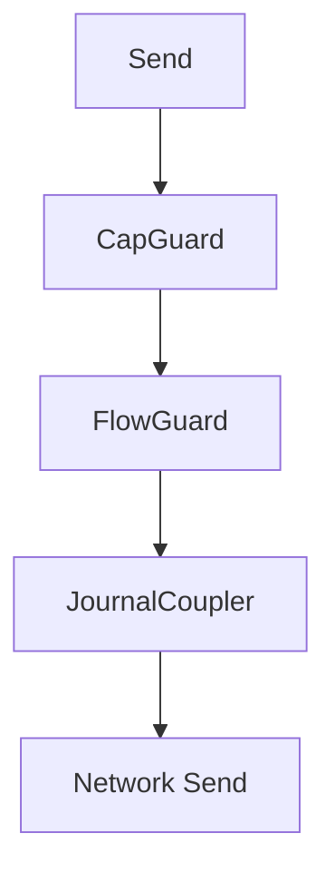

# Multi-party Session Types and Choreography

This document describes the architecture of choreographic protocols in Aura. It explains how global protocols are defined, projected, and executed. It defines the structure of local session types, the integration with the [effect system](106_effect_system_and_runtime.md), and the use of [guard chains](109_authorization.md) and journal coupling.

## 1. DSL and Projection

Aura defines global protocols using the `choreography!` macro. The macro parses a global specification into an abstract syntax tree. The macro produces code that represents the protocol as a choreographic structure.

Projection converts the global protocol into per-role local session types. Each local session type defines the exact sequence of sends and receives for a single role. Projection eliminates deadlocks and ensures that communication structure is correct.

```rust
choreography! {
    #[namespace = "example"]
    protocol Example {
        roles: A, B;
        A -> B: Msg(data: Vec<u8>);
        B -> A: Ack(code: u32);
    }
}
```

This snippet defines a global protocol with two roles. Projection produces a local type for `A` and a local type for `B`. Each local type enforces the required ordering at compile time.

## 2. Local Session Types

Local session types describe the allowed actions for a role. Each send and receive is represented as a typed operation. Local types prevent protocol misuse by ensuring that nodes follow the projected sequence.

Local session types embed type-level guarantees. These guarantees prevent message ordering errors. They prevent unmatched sends or receives. Each protocol execution must satisfy the session type.

```rust
type A_Local = Send<B, Msg, Receive<B, Ack, End>>;
```

This example shows the projected type for role `A`. The type describes that `A` must send `Msg` to `B` and then receive `Ack`.

## 3. Runtime Integration

Aura integrates session types with the effect system through `ChoreoHandler`. A handler executes sends and receives using effect traits. The handler manages serialization and deserialization of messages.

`AuraHandler` implements `ChoreoHandler` for Aura runtimes. It maps session operations to effect calls using `NetworkEffects`, `JournalEffects`, and other traits. A handler must be initialized with role mappings and context identifiers.

```rust
#[async_trait]
pub trait ChoreoHandler {
    async fn send<M>(&mut self, msg: &M) -> Result<()> where M: Serialize;
    async fn recv<M>(&mut self) -> Result<M> where M: DeserializeOwned;
}
```

This trait defines the interface for session type execution. Implementations call the underlying effects. They also apply guard chains and journal updates.

## 4. Extension Effects

Choreographies support annotations that modify runtime behavior. Extension effects interpret these annotations. Capability annotations attach required capabilities to a message. Flow cost annotations specify the budget cost of a message. Journal annotations define facts to insert into the journal.

Extension effects allow choreographies to express authorization and accounting rules. These rules apply before each send and receive.

```rust
// Annotation example
A[guard_capability = "sync", flow_cost = 10] -> B: SyncMsg;
```

This annotation specifies a capability requirement and a flow budget cost for the send action.

## 5. Guard Chain Integration

Each send action in a session type is evaluated through a [guard chain](109_authorization.md). The chain contains `CapGuard`, `FlowGuard`, and `JournalCoupler`. These guards enforce authorization and budget constraints.

`CapGuard` checks that the active capabilities satisfy the message requirements. `FlowGuard` checks that flow budget is available for the context and peer. `JournalCoupler` synchronizes journal updates with protocol execution.



This diagram shows the guard sequence for all send operations. Each guard must succeed for the message to be sent.

## 6. Execution Modes

Aura supports multiple execution modes for choreographies. In-memory execution uses mock handlers. Production execution uses real network and storage effects. Simulation execution uses deterministic time and fault injection.

Each mode implements the same handler interface. This ensures that protocol behavior remains consistent across environments. Testing uses deterministic handlers. Production uses optimized handlers.

```rust
let handler = AuraHandler::new_in_memory();
```

This example shows the creation of an in-memory handler for testing.

## 7. Example Protocols

Anti-entropy protocols synchronize CRDT state. They run as choreographies that exchange state deltas. Session types ensure that the exchange pattern follows causal and structural rules.

FROST ceremonies use choreographies to coordinate threshold signing. These ceremonies use the guard chain to enforce authorization rules.

Aura Consensus uses choreographic notation for fast path and fallback flows. Consensus choreographies define execute, witness, and commit messages. Session types ensure evidence propagation and correctness.

```rust
choreography! {
    #[namespace = "sync"]
    protocol AntiEntropy {
        roles: A, B;
        A -> B: Delta(data: Vec<u8>);
        B -> A: Ack(data: Vec<u8>);
    }
}
```

This anti-entropy example illustrates a minimal synchronization protocol.

## 8. Summary

Aura uses choreographic programming to define global protocols. Projection produces local session types. Session types enforce structured communication. Handlers execute protocol steps using effect traits. Extension effects provide authorization, budgeting, and journal updates. Execution modes support testing, simulation, and production. Choreographies define distributed coordination for CRDT sync, FROST signing, and consensus.
