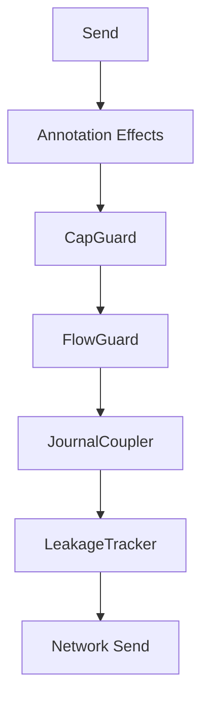

# Multi-party Session Types and Choreography

This document describes the architecture of choreographic protocols in Aura. It explains how global protocols are defined, projected, and executed. It defines the structure of local session types, the integration with the [effect system](106_effect_system_and_runtime.md), and the use of [guard chains](109_authorization.md) and journal coupling.

## 1. DSL and Projection

Aura defines global protocols using the `choreography!` macro. The macro parses a global specification into an abstract syntax tree. The macro produces code that represents the protocol as a choreographic structure.

Projection converts the global protocol into per-role local session types. Each local session type defines the exact sequence of sends and receives for a single role. Projection eliminates deadlocks and ensures that communication structure is correct.

```rust
choreography! {
    #[namespace = "example"]
    protocol Example {
        roles: A, B;
        A -> B: Msg(data: Vec<u8>);
        B -> A: Ack(code: u32);
    }
}
```

This snippet defines a global protocol with two roles. Projection produces a local type for `A` and a local type for `B`. Each local type enforces the required ordering at compile time.

## 2. Local Session Types

Local session types describe the allowed actions for a role. Each send and receive is represented as a typed operation. Local types prevent protocol misuse by ensuring that nodes follow the projected sequence.

Local session types embed type-level guarantees. These guarantees prevent message ordering errors. They prevent unmatched sends or receives. Each protocol execution must satisfy the session type.

```rust
type A_Local = Send<B, Msg, Receive<B, Ack, End>>;
```

This example shows the projected type for role `A`. The type describes that `A` must send `Msg` to `B` and then receive `Ack`.

## 3. Runtime Integration

Aura integrates session types with the effect system through `ChoreoHandler`. A handler executes sends and receives using effect traits. The handler manages serialization and deserialization of messages.

`AuraHandler` implements `ChoreoHandler` for Aura runtimes. It maps session operations to effect calls using `NetworkEffects`, `JournalEffects`, and other traits. A handler must be initialized with role mappings and context identifiers.

```rust
#[async_trait]
pub trait ChoreoHandler {
    async fn send<M>(&mut self, msg: &M) -> Result<()> where M: Serialize;
    async fn recv<M>(&mut self) -> Result<M> where M: DeserializeOwned;
}
```

This trait defines the interface for session type execution. Implementations call the underlying effects. They also apply guard chains and journal updates.

## 4. Choreography Annotations and Effect Commands

Choreographies support annotations that modify runtime behavior. The `choreography!` macro extracts these annotations and generates `EffectCommand` sequences. This is the **choreography-first architecture**: choreographic annotations are the canonical source of truth for guard requirements.

### Supported Annotations

| Annotation | Description | Generated Effect |
|------------|-------------|------------------|
| `guard_capability = "cap"` | Capability requirement | `StoreMetadata` (audit trail) |
| `flow_cost = N` | Flow budget charge | `ChargeBudget` |
| `journal_facts = "fact"` | Journal fact recording | `StoreMetadata` (fact key) |
| `journal_merge = true` | Request journal merge | `StoreMetadata` (merge flag) |
| `audit_log = "event"` | Audit trail entry | `StoreMetadata` (audit key) |
| `leak = "External"` | Leakage tracking | `RecordLeakage` |

### Annotation Syntax

```rust
// Single annotation
A[guard_capability = "sync"] -> B: SyncMsg;

// Multiple annotations
A[guard_capability = "sync", flow_cost = 10, journal_facts = "sync_started"] -> B: SyncMsg;

// Leakage annotation (multiple syntaxes supported)
A[leak = "External,Neighbor"] -> B: PublicMsg;
A[leak: External] -> B: PublicMsg;
```

### Effect Command Generation

The macro generates an `effect_bridge` module containing:

```rust
pub mod effect_bridge {
    use aura_core::effects::guard::{EffectCommand, EffectInterpreter};

    /// Convert annotations to effect commands
    pub fn annotation_to_commands(ctx: &EffectContext, annotation: ...) -> Vec<EffectCommand>;

    /// Execute commands through interpreter
    pub async fn execute_commands<I: EffectInterpreter>(
        interpreter: &I,
        ctx: &EffectContext,
        annotations: Vec<...>,
    ) -> Result<Vec<EffectResult>, String>;
}
```

### Integration with Effect Interpreters

Generated `EffectCommand` sequences execute through:
- **Production**: `ProductionEffectInterpreter` (aura-effects)
- **Simulation**: `SimulationEffectInterpreter` (aura-simulator)
- **Testing**: `BorrowedEffectInterpreter` / mock interpreters

This unified approach ensures consistent guard behavior across all execution environments.

## 5. Guard Chain Integration

Guard effects originate from two sources that share the same `EffectCommand` system:

1. **Choreographic Annotations** (compile-time): The `choreography!` macro generates `EffectCommand` sequences from annotations. These represent per-message guard requirements.

2. **Runtime Guard Chain** (send-site): The `GuardChain::standard()` evaluates pure guards against a `GuardSnapshot` at each protocol send site. This enforces invariants like charge-before-send.

### Guard Chain Sequence

The runtime guard chain contains `CapGuard`, `FlowGuard`, `JournalCoupler`, and `LeakageTracker`. These guards enforce authorization and budget constraints:

- `CapGuard` checks that the active capabilities satisfy the message requirements
- `FlowGuard` checks that flow budget is available for the context and peer
- `JournalCoupler` synchronizes journal updates with protocol execution
- `LeakageTracker` records metadata leakage per observer class

Guard evaluation is synchronous over a prepared `GuardSnapshot` and yields `EffectCommand` items. An async interpreter executes those commands, keeping guard logic pure while preserving charge-before-send.



This diagram shows the combined guard sequence. Annotation-derived effects execute first, then runtime guards validate and charge budgets before the send.

### Combined Execution

Use `execute_guarded_choreography()` from `aura_guards` to execute both annotation-derived commands and runtime guards atomically:

```rust
use aura_guards::{execute_guarded_choreography, GuardChain};

let result = execute_guarded_choreography(
    &effect_system,
    &request,
    annotation_commands,  // From choreography macro
    interpreter,
).await?;
```

## 6. Execution Modes

Aura supports multiple execution modes for choreographies. In-memory execution uses mock handlers. Production execution uses real network and storage effects. Simulation execution uses deterministic time and fault injection.

Each mode implements the same handler interface. This ensures that protocol behavior remains consistent across environments. Testing uses deterministic handlers. Production uses optimized handlers.

```rust
let handler = AuraHandler::new_in_memory();
```

This example shows the creation of an in-memory handler for testing.

## 7. Example Protocols

Anti-entropy protocols synchronize CRDT state. They run as choreographies that exchange state deltas. Session types ensure that the exchange pattern follows causal and structural rules.

FROST ceremonies use choreographies to coordinate threshold signing. These ceremonies use the guard chain to enforce authorization rules.

Aura Consensus uses choreographic notation for fast path and fallback flows. Consensus choreographies define execute, witness, and commit messages. Session types ensure evidence propagation and correctness.

```rust
choreography! {
    #[namespace = "sync"]
    protocol AntiEntropy {
        roles: A, B;
        A -> B: Delta(data: Vec<u8>);
        B -> A: Ack(data: Vec<u8>);
    }
}
```

This anti-entropy example illustrates a minimal synchronization protocol.

## 8. Operation Categories and Choreography Use

Not all multi-party operations require full choreographic specification. Aura classifies operations into categories that determine when choreography is necessary.

### 8.1 When to Use Choreography

**Category C (Consensus-Gated) Operations** - Full choreography required:
- Guardian rotation ceremonies
- Recovery execution flows
- OTA hard fork activation
- Device revocation
- Adding contacts / creating groups (establishing cryptographic context)
- Adding members to existing groups

These operations require explicit session types because:
- Partial execution is dangerous
- All parties must agree before effects apply
- Strong ordering guarantees are necessary

**Example - Invitation Ceremony:**
```rust
choreography! {
    #[namespace = "invitation"]
    protocol InvitationCeremony {
        roles: Sender, Receiver;
        Sender -> Receiver: Invitation(data: InvitationPayload);
        Receiver -> Sender: Accept(commitment: Hash32);
        // Context is now established
    }
}
```

### 8.2 When Choreography is NOT Required

**Category A (Optimistic) Operations** - No choreography needed:
- Send message (within established context)
- Create channel (within existing relational context)
- Update channel topic
- Block/unblock contact

These use simple CRDT fact emission because:
- Cryptographic context already exists
- Keys derive deterministically from shared state
- Eventual consistency is sufficient
- No coordination required

**Example - No choreography:**
```rust
// Just emit a fact - no ceremony needed
journal.append(ChannelCheckpoint {
    context: existing_context_id,
    channel: new_channel_id,
    chan_epoch: 0,
    base_gen: 0,
    window: 1024,
    ..
});
```

**Category B (Deferred) Operations** - May use lightweight choreography:
- Change channel permissions
- Remove channel member (may be contested)
- Transfer ownership

These may use a proposal/approval pattern but don't require the full ceremony infrastructure.

### 8.3 Decision Tree for Protocol Design

```
Is this operation establishing or modifying cryptographic relationships?
│
├─ YES → Use full choreography (Category C)
│        Define explicit session types and guards
│
└─ NO: Does this affect other users' policies/access?
       │
       ├─ YES: Is strong agreement required?
       │       │
       │       ├─ YES → Use lightweight choreography (Category B)
       │       │        Proposal/approval pattern
       │       │
       │       └─ NO → Use CRDT facts (Category A)
       │               Eventually consistent
       │
       └─ NO → Use CRDT facts (Category A)
               No coordination needed
```

See [Consensus - Operation Categories](104_consensus.md#17-operation-categories) for detailed categorization.

## 9. Summary

Aura uses choreographic programming to define global protocols. Projection produces local session types. Session types enforce structured communication. Handlers execute protocol steps using effect traits. Extension effects provide authorization, budgeting, and journal updates. Execution modes support testing, simulation, and production. Choreographies define distributed coordination for CRDT sync, FROST signing, and consensus.

Importantly, not all multi-party operations need choreography. Operations within established cryptographic contexts (channels, messages) use optimistic CRDT facts. Choreography is reserved for Category C operations where partial state would be dangerous.
