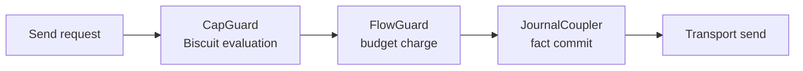

# Authorization Pipeline

## Overview

Aura authorizes every observable action through Biscuit capability evaluation combined with sovereign policy and flow budgets. The authorization pipeline spans `AuthorizationEffects`, the guard chain, and receipt accounting. This document describes the data flow and integration points so that all crates implement the same procedure.

## Biscuit Capability Model

Biscuit tokens encode attenuation chains. Each attenuation step applies additional caveats that shrink authority through meet composition. Aura stores Biscuit material outside the replicated CRDT. Local runtimes evaluate tokens at send time and cache the resulting lattice element for the active `ContextId`. Cached entries expire on epoch change or when policy revokes a capability. Policy data always participates in the meet so a token can only reduce authority relative to local policy.

```text
Evaluation(frontier, token):
1. Parse token and verify signature chain against authority public key.
2. Apply each caveat in order and intersect the result with `frontier`.
3. Intersect the result with sovereign policy for the target context.
4. Return the resulting `Cap` element for guard evaluation.
```

This algorithm produces a meet-monotone capability frontier. Step 1 ensures provenance. Steps 2 and 3 ensure no evaluation widens authority. Step 4 feeds the guard chain with a cached outcome.

## Guard Chain

Authorization evaluation feeds the transport guard chain. All documents reference this section to avoid divergence.



CapGuard invokes `AuthorizationEffects` with the cached frontier and any inline Biscuit token on the message. FlowGuard charges the `FlowBudget` fact for `(ContextId, peer)` and produces a signed receipt. JournalCoupler merges any journal deltas atomically with the send. Only after all guards pass does transport emit a packet. Any failure returns locally and leaves no observable side effect.

## Worked Example

```rust
async fn send_storage_put(
    authz: &dyn AuthorizationEffects,
    flow: &dyn FlowEffects,
    journal: &dyn JournalEffects,
    transport: &dyn TransportEffects,
    ctx: ContextId,
    peer: AuthorityId,
    token: Biscuit,
    payload: PutRequest,
) -> Result<()> {
    let cap_frontier = authz.evaluate_guard(token, CapabilityPredicate::StorageWrite)?;
    authz.ensure_allowed(&cap_frontier, CapabilityPredicate::StorageWrite)?;
    let receipt = flow.charge(ctx, peer, payload.flow_cost)?;
    journal.merge_facts(payload.delta.copy_with_receipt(receipt));
    transport.send(peer, Msg::new(ctx, payload, cap_frontier.summary()))?;
    Ok(())
}
```

This example evaluates a token, ensures the guard predicate holds, charges flow budget, merges the journal delta that records the receipt, and finally sends the message. Each interface call matches an effect trait so the same order applies across runtimes.

## Failure Handling and Caching

Runtimes cache evaluated capability frontiers per `(ContextId, CapabilityPredicate)` with an epoch tag. Cache entries invalidate when journal policy facts change or when the epoch rotates. CapGuard failures return `AuthorizationError::Denied` without charging flow or touching the journal. FlowGuard failures return `FlowError::InsufficientBudget` without emitting transport traffic. JournalCoupler failures surface as `JournalError::CommitAborted`, which instructs the protocol to retry after reconciling journal state. This isolation keeps the guard chain deterministic and side-channel free.
