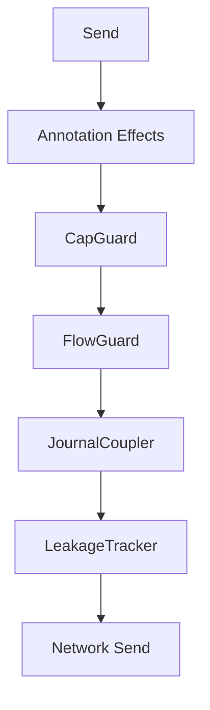

# MPST and Choreography

This document describes the architecture of choreographic protocols in Aura. It explains how global protocols are defined, projected, and executed. It defines the structure of local session types, the integration with the [Effect System](105_effect_system.md), and the use of [guard chains](104_authorization.md) and journal coupling.

## 1. DSL and Projection

Aura defines global protocols using the `choreography!` macro. The macro parses a global specification into an abstract syntax tree. The macro produces code that represents the protocol as a choreographic structure. The source of truth for protocols is a `.choreo` file stored **next to the Rust module** that loads it.

Projection converts the global protocol into per-role local session types. Each local session type defines the exact sequence of sends and receives for a single role. Projection eliminates deadlocks and ensures that communication structure is correct.

```rust
choreography!(include_str!("example.choreo"));
```

Example file: `example.choreo`
```
module example exposing (Example)

protocol Example =
  roles A, B
  A -> B : Msg(data: Vec<u8>)
  B -> A : Ack(code: u32)
```

This snippet defines a global protocol with two roles. Projection produces a local type for `A` and a local type for `B`. Each local type enforces the required ordering at compile time.

## 2. Local Session Types

Local session types describe the allowed actions for a role. Each send and receive is represented as a typed operation. Local types prevent protocol misuse by ensuring that nodes follow the projected sequence.

Local session types embed type-level guarantees. These guarantees prevent message ordering errors. They prevent unmatched sends or receives. Each protocol execution must satisfy the session type.

```rust
type A_Local = Send<B, Msg, Receive<B, Ack, End>>;
```

This example shows the projected type for role `A`. The type describes that `A` must send `Msg` to `B` and then receive `Ack`.

## 3. Runtime Integration

Aura executes production choreographies through the Telltale VM. The `choreography!` macro emits the global type, projected local types, role metadata, and composition metadata that the runtime uses to build VM code images. `AuraChoreoEngine` in `crates/aura-agent/src/runtime/choreo_engine.rs` is the production runtime surface.

Generated runners still expose role-specific execution helpers. Aura keeps those helpers for tests, focused migration utilities, and narrow tooling paths. They are not the production execution boundary.

Generated runtime artifacts also carry the data that production startup needs:
- `provide_message` for outbound payloads
- `select_branch` for choice decisions
- protocol id and determinism policy reference
- required capability keys
- link and delegation constraints

These values are sourced from runtime state such as params, journal facts, UI inputs, and manifest-driven admission state.

Aura has one production choreography backend:
- VM backend (`AuraChoreoEngine`) for admitted Telltale VM execution, replay, and parity checks.

Direct generated-runner execution is test and migration support only.

## 4. Choreography Annotations and Effect Commands

Choreographies support annotations that modify runtime behavior. The `choreography!` macro extracts these annotations and generates `EffectCommand` sequences. This follows the choreography-first architecture where choreographic annotations are the canonical source of truth for guard requirements.

### Supported Annotations

| Annotation | Description | Generated Effect |
|------------|-------------|------------------|
| `guard_capability = "cap"` | Capability requirement | `StoreMetadata` (audit trail) |
| `flow_cost = N` | Flow budget charge | `ChargeBudget` |
| `journal_facts = "fact"` | Journal fact recording | `StoreMetadata` (fact key) |
| `journal_merge = true` | Request journal merge | `StoreMetadata` (merge flag) |
| `audit_log = "event"` | Audit trail entry | `StoreMetadata` (audit key) |
| `leak = "External"` | Leakage tracking | `RecordLeakage` |

### Annotation Syntax

```rust
// Single annotation
A[guard_capability = "sync"] -> B: SyncMsg;

// Multiple annotations
A[guard_capability = "sync", flow_cost = 10, journal_facts = "sync_started"] -> B: SyncMsg;

// Leakage annotation (multiple syntaxes supported)
A[leak = "External,Neighbor"] -> B: PublicMsg;
A[leak: External] -> B: PublicMsg;
```

### Protocol Artifact Requirements

Aura binds choreography bundles to runtime capability requirements through generated `CompositionManifest` metadata and `aura-protocol::admission`. Production startup uses `open_manifest_vm_session_admitted(...)` so protocol id, capability requirements, determinism policy reference, and link constraints come from one canonical manifest.

Current registry mappings:

- `aura.consensus` -> `byzantine_envelope`
- `aura.sync.epoch_rotation` -> `termination_bounded`
- `aura.dkg.ceremony` -> `byzantine_envelope` + `termination_bounded`
- `aura.recovery.grant` -> `termination_bounded`

For lower-level VM tests, `AuraChoreoEngine::open_session_admitted(...)` remains available. Production services should use `open_manifest_vm_session_admitted(...)` instead.

### Dynamic Reconfiguration (`@link` + delegation)

Aura treats protocol reconfiguration as a first-class choreography concern. Static composition uses `@link` metadata in choreographies so compatible bundles can be merged at compile time. Runtime transfer uses delegation receipts and session-footprint coherence checks.

- `@link` annotations are parsed by `aura-mpst` and validated by `aura-macros` for import/export compatibility.
- `ReconfigurationManager` in `aura-agent` executes link/delegate operations and verifies coherence after each delegation.
- Delegation writes a `SessionDelegationFact` audit record to the relational journal.

This model is used by device migration and guardian handoff flows: session ownership moves without restarting the full choreography, while invariants remain checkable from persisted facts.

### Protocol Evolution Compatibility Policy

Aura classifies choreography evolution by comparing **baseline** and **candidate**
projections with `async_subtype(new_local, old_local)` for every shared role.

Compatibility rule:
- Compatible if `async_subtype` succeeds for every shared role.
- Breaking if `async_subtype` fails for any shared role.

Version bump rules:
- **Patch**: no projection-shape change (comments, docs, metadata-only updates).
- **Minor**: projection changes are present, but compatibility check passes for all shared roles.
- **Major**: any compatibility failure, role-set change, or protocol namespace replacement.

Reviewer decision table:

| Change type | Default classification | Required action |
|---|---|---|
| Additive branch (existing roles unchanged) | Minor if async-subtype passes | Run compatibility checker; bump minor on pass, major on fail |
| Payload narrowing/widening | Minor or Major based on async-subtype result | Treat checker as source of truth; bump major on any role failure |
| Role added/removed/renamed | Major | Bump major and treat as new protocol contract |
| Namespace change with same semantics | Major (new contract surface) | Register as new protocol namespace and keep old baseline until migration completes |

Operational notes:
- Compatibility checks are tooling/CI gates, never runtime hot-path logic.
- New protocol files without a baseline are not auto-classified; reviewers must explicitly approve initial versioning.
- Baseline/current checks are implemented by `scripts/check/protocol-compat.sh` and `just ci-protocol-compat`.

### Quantitative Termination Budgets

Aura derives deterministic step budgets from Telltale's weighted measure:

`W = 2 * sum(depth(local_type)) + sum(buffer_sizes)`

Runtime execution applies:

`max_steps = ceil(k_sigma(protocol) * W * budget_multiplier)`

Implementation points:

- `aura-mpst::termination` computes local-type depth, buffer weight, and weighted measure.
- `aura-protocol::termination` defines protocol classes (`consensus`, `sync`, `dkg`, `recovery`), calibrated `k_sigma` factors, and expected budget ranges.
- `AuraChoreoEngine` constructs a `TerminationBudget` at run start, checks budget consumption after every VM scheduler step, emits deterministic `BoundExceeded` failures, warns at >80% utilization, and logs multiplier divergence from computed bounds.

### Effect Command Generation

The macro generates an `effect_bridge` module containing:

```rust
pub mod effect_bridge {
    use aura_core::effects::guard::{EffectCommand, EffectInterpreter};

    /// Convert annotations to effect commands
    pub fn annotation_to_commands(ctx: &EffectContext, annotation: ...) -> Vec<EffectCommand>;

    /// Execute commands through interpreter
    pub async fn execute_commands<I: EffectInterpreter>(
        interpreter: &I,
        ctx: &EffectContext,
        annotations: Vec<...>,
    ) -> Result<Vec<EffectResult>, String>;
}
```

### Macro Output Contracts & Stability

The `choreography!` macro emits a stable, minimal surface intended for runtime integration.
Consumers should rely only on the contracts below. All other generated items are internal and
may change without notice.

**Stable contracts:**
- `effect_bridge::EffectBridgeContext` (context, authority, peer, timestamp)
- `effect_bridge::annotation_to_commands(...)`
- `effect_bridge::annotations_to_commands(...)`
- `effect_bridge::create_context(...)`
- `effect_bridge::execute_commands(...)`

**Stability rules:**
- The above names and signatures are **stable within a minor release series**.
- Additional helper functions may be added, but existing signatures will not change without a
  schema/version bump in the macro output.
- Generated role enums and protocol-specific modules are **not** part of the stable API surface.

### Integration with Effect Interpreters

Generated `EffectCommand` sequences execute through:
- **Production**: `ProductionEffectInterpreter` (aura-effects)
- **Simulation**: `SimulationEffectInterpreter` (aura-simulator)
- **Testing**: `BorrowedEffectInterpreter` / mock interpreters

This unified approach ensures consistent guard behavior across all execution environments.

## 5. Guard Chain Integration

Guard effects originate from two sources that share the same `EffectCommand` system:

1. **Choreographic Annotations** (compile-time): The `choreography!` macro generates `EffectCommand` sequences from annotations. These represent per-message guard requirements.

2. **Runtime Guard Chain** (send-site): The `GuardChain::standard()` evaluates pure guards against a `GuardSnapshot` at each protocol send site. This enforces invariants like charge-before-send.

### Guard Chain Sequence

The runtime guard chain contains `CapGuard`, `FlowGuard`, `JournalCoupler`, and `LeakageTracker`. These guards enforce authorization and budget constraints:

- `CapGuard` checks that the active capabilities satisfy the message requirements
- `FlowGuard` checks that flow budget is available for the context and peer
- `JournalCoupler` synchronizes journal updates with protocol execution
- `LeakageTracker` records metadata leakage per observer class

Guard evaluation is synchronous over a prepared `GuardSnapshot` and yields `EffectCommand` items. An async interpreter executes those commands, keeping guard logic pure while preserving charge-before-send.



This diagram shows the combined guard sequence. Annotation-derived effects execute first, then runtime guards validate and charge budgets before the send.

### Combined Execution

Use `execute_guarded_choreography()` from `aura_guards` to execute both annotation-derived commands and runtime guards atomically:

```rust
use aura_guards::{execute_guarded_choreography, GuardChain};

let result = execute_guarded_choreography(
    &effect_system,
    &request,
    annotation_commands,  // From choreography macro
    interpreter,
).await?;
```

## 6. Execution Modes

Aura supports multiple execution environments for the same choreography definitions. Production execution uses admitted VM sessions with real effect handlers. Simulation execution uses deterministic time and fault injection. Test utilities may use narrower runner surfaces when that improves isolation.

Each environment preserves the same protocol structure and admission semantics where applicable. Choreography execution also captures conformance artifacts for native/WASM parity testing. See [Test Infrastructure Reference](117_testkit.md) for artifact surfaces and effect classification.

## 7. Example Protocols

Anti-entropy protocols synchronize CRDT state. They run as choreographies that exchange state deltas. Session types ensure that the exchange pattern follows causal and structural rules.

FROST ceremonies use choreographies to coordinate threshold signing. These ceremonies use the guard chain to enforce authorization rules.

Aura Consensus uses choreographic notation for fast path and fallback flows. Consensus choreographies define execute, witness, and commit messages. Session types ensure evidence propagation and correctness.

```rust
choreography! {
    #[namespace = "sync"]
    protocol AntiEntropy {
        roles: A, B;
        A -> B: Delta(data: Vec<u8>);
        B -> A: Ack(data: Vec<u8>);
    }
}
```

This anti-entropy example illustrates a minimal synchronization protocol.

## 8. Operation Categories and Choreography Use

Not all multi-party operations require full choreographic specification. Aura classifies operations into categories that determine when choreography is necessary.

### 8.1 When to Use Choreography

**Category C (Consensus-Gated) Operations** - Full choreography required:
- Guardian rotation ceremonies
- Recovery execution flows
- OTA hard fork activation
- Device revocation
- Adding contacts / creating groups (establishing cryptographic context)
- Adding members to existing groups

These operations require explicit session types because:
- Partial execution is dangerous
- All parties must agree before effects apply
- Strong ordering guarantees are necessary

**Example - Invitation Ceremony:**
```rust
choreography! {
    #[namespace = "invitation"]
    protocol InvitationCeremony {
        roles: Sender, Receiver;
        Sender -> Receiver: Invitation(data: InvitationPayload);
        Receiver -> Sender: Accept(commitment: Hash32);
        // Context is now established
    }
}
```

### 8.2 When Choreography is NOT Required

**Category A (Optimistic) Operations** - No choreography needed:
- Send message (within established context)
- Create channel (within existing relational context)
- Update channel topic
- Block/unblock contact

These use simple CRDT fact emission because:
- Cryptographic context already exists
- Keys derive deterministically from shared state
- Eventual consistency is sufficient
- No coordination required

**Example - No choreography:**
```rust
// Just emit a fact - no ceremony needed
journal.append(ChannelCheckpoint {
    context: existing_context_id,
    channel: new_channel_id,
    chan_epoch: 0,
    base_gen: 0,
    window: 1024,
    ..
});
```

**Category B (Deferred) Operations** - May use lightweight choreography:
- Change channel permissions
- Remove channel member (may be contested)
- Transfer ownership

These may use a proposal/approval pattern but don't require the full ceremony infrastructure.

### 8.3 Decision Tree for Protocol Design

```
Is this operation establishing or modifying cryptographic relationships?
│
├─ YES → Use full choreography (Category C)
│        Define explicit session types and guards
│
└─ NO: Does this affect other users' policies/access?
       │
       ├─ YES: Is strong agreement required?
       │       │
       │       ├─ YES → Use lightweight choreography (Category B)
       │       │        Proposal/approval pattern
       │       │
       │       └─ NO → Use CRDT facts (Category A)
       │               Eventually consistent
       │
       └─ NO → Use CRDT facts (Category A)
               No coordination needed
```

See [Consensus - Operation Categories](106_consensus.md#17-operation-categories) for detailed categorization.

## 9. Choreography Inventory

This section lists all choreographies in the codebase with their locations and purposes.

### 9.1 Core Protocols

| Protocol | Location | Purpose |
|----------|----------|---------|
| AuraConsensus | `aura-consensus/src/protocol/choreography.choreo` | Fast path and fallback consensus |
| AmpTransport | `aura-amp/src/choreography.choreo` | Asynchronous message transport |

### 9.2 Rendezvous Protocols

| Protocol | Location | Purpose |
|----------|----------|---------|
| RendezvousExchange | `aura-rendezvous/src/protocol.rendezvous_exchange.choreo` | Direct peer discovery |
| RelayedRendezvous | `aura-rendezvous/src/protocol.relayed_rendezvous.choreo` | Relay-assisted connection |

### 9.3 Authentication Protocols

| Protocol | Location | Purpose |
|----------|----------|---------|
| GuardianAuthRelational | `aura-authentication/src/guardian_auth_relational.choreo` | Guardian authentication |
| DkdChoreography | `aura-authentication/src/dkd.choreo` | Distributed key derivation |

### 9.4 Recovery Protocols

| Protocol | Location | Purpose |
|----------|----------|---------|
| RecoveryProtocol | `aura-recovery/src/recovery_protocol.choreo` | Account recovery flow |
| GuardianMembershipChange | `aura-recovery/src/guardian_membership.choreo` | Guardian add/remove |
| GuardianCeremony | `aura-recovery/src/guardian_ceremony.choreo` | Guardian key ceremony |
| GuardianSetup | `aura-recovery/src/guardian_setup.choreo` | Initial guardian setup |

### 9.5 Invitation Protocols

| Protocol | Location | Purpose |
|----------|----------|---------|
| InvitationExchange | `aura-invitation/src/protocol.invitation_exchange.choreo` | Contact/channel invitation |
| GuardianInvitation | `aura-invitation/src/protocol.guardian_invitation.choreo` | Guardian invitation |
| DeviceEnrollment | `aura-invitation/src/protocol.device_enrollment.choreo` | Device enrollment |

### 9.6 Sync Protocols

| Protocol | Location | Purpose |
|----------|----------|---------|
| EpochRotationProtocol | `aura-sync/src/protocols/epochs.choreo` | Epoch rotation sync |

### 9.7 Runtime Protocols

| Protocol | Location | Purpose |
|----------|----------|---------|
| SessionCoordination | `aura-agent/src/handlers/sessions/coordination.choreo` | Session creation coordination |

## 10. Runtime Infrastructure

The runtime provides production choreographic execution through manifest-driven Telltale VM sessions.

### 10.1 ChoreographicEffects Trait

| Method | Purpose |
|--------|---------|
| `send_to_role_bytes` | Send message to specific role |
| `receive_from_role_bytes` | Receive message from specific role |
| `broadcast_bytes` | Broadcast to all roles |
| `start_session` | Initialize choreography session |
| `end_session` | Terminate choreography session |

`AuraVmEffectHandler` is the synchronous host boundary between the VM and Aura runtime services. `AuraQueuedVmBridgeHandler` provides queued outbound payloads and branch decisions for role-scoped VM sessions.

### 10.2 Wiring a Choreography

1. Store the protocol in a `.choreo` file next to the Rust module that loads it.
2. Use `choreography!(include_str!("..."))` to generate the protocol module, VM artifacts, and composition metadata.
3. Open the session with `open_manifest_vm_session_admitted(...)` from the runtime bridge or service layer.
4. Provide decision sources for `provide_message` and `select_branch` through the VM host bridge.

### 10.3 Decision Sourcing

Generated runners call `provide_message` for outbound payloads and `select_branch` for choice decisions. These are sourced from runtime state:

| Source Type | Examples |
|-------------|----------|
| Params | Consensus parameters, invitation payloads |
| Journal facts | Local state, authority commitments |
| Service state | Ceremony proposals, channel state |
| UI/Policy | Accept/reject decisions, commit/abort choices |

### 10.4 Integration Features

The runtime provides guard chain integration (CapGuard → FlowGuard → JournalCoupler), transport effects for message passing, manifest-driven admission, determinism policy enforcement, typed link and delegation checks, and session lifecycle management with metrics.

### 10.5 Output and Flow Policy Integration Points

Aura binds choreography execution to VM output/flow gates at the runtime boundary.

`AuraVmEffectHandler` tags VM-observable operations with output-condition predicate hints so `OutputConditionPolicy` can enforce commit visibility rules. The hardening profile allow-list admits only known predicates (transport send/recv, protocol choice/step, guard acquire/release). Unknown predicates are rejected in CI profiles.

Flow constraints are enforced with `FlowPolicy::PredicateExpr(...)` derived from Aura role/category constraints. This keeps pre-send flow checks aligned with Aura's information-flow contract while preserving deterministic replay behavior.

Practical integration points:

1. Choreography annotations declare intent (`guard_capability`, `flow_cost`, `journal_facts`, `leak`).
2. Macro output emits `EffectCommand` sequences.
3. Guard chain evaluates commands and budgets at send sites.
4. VM output/flow policies gate observable commits and cross-role message flow before transport effects execute.

This means choreography-level guard semantics and VM-level hardening are additive, not competing: annotations define required effects; policies constrain which effects are allowed to become observable.

## 11. Summary

Aura uses choreographic programming to define global protocols. Projection produces local session types. Session types enforce structured communication. Handlers execute protocol steps using effect traits. Extension effects provide authorization, budgeting, and journal updates. Execution modes support testing, simulation, and production. Choreographies define distributed coordination for CRDT sync, FROST signing, and consensus.

Not all multi-party operations need choreography. Operations within established cryptographic contexts use optimistic CRDT facts. Choreography is reserved for Category C operations where partial state would be dangerous.
