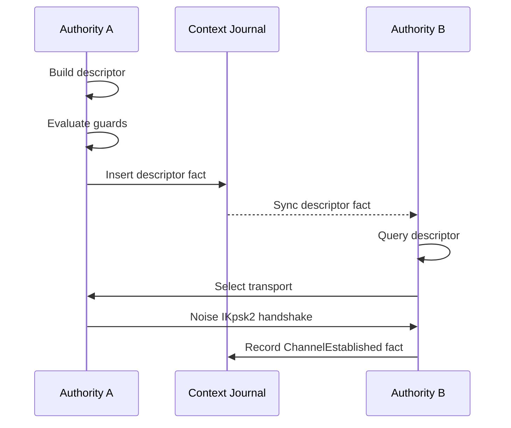

# Rendezvous Architecture

This document describes the rendezvous architecture in Aura. It explains peer discovery, descriptor propagation, transport selection, and channel establishment. It aligns with the authority and context model. It scopes all rendezvous behavior to relational contexts.

## 1. Overview

Rendezvous establishes secure channels between authorities. The `RendezvousService` exposes `publish_descriptor()` and `establish_channel()` methods. The service returns guard outcomes that the caller executes through an effect interpreter. Rendezvous operates inside a relational context and uses the context key for encryption. Descriptors appear as facts in the context journal. Propagation uses journal synchronization (`aura-sync`), not custom flooding.

Rendezvous does not establish global identity. All operations are scoped to a `ContextId`. A context defines which authorities may see descriptors. Only participating authorities have the keys required to decrypt descriptor payloads.

## 2. Architecture Changes

The refactored rendezvous crate follows Aura's evolved architecture:

1. **Guard Chain First**: All network sends flow through `CapGuard → FlowGuard → JournalCoupler → TransportEffects`
2. **Facts Not Flooding**: Descriptors are journal facts propagated via `aura-sync`, not custom flooding
3. **Standard Receipts**: Uses the system `Receipt` type with epoch binding and cost tracking
4. **Session-Typed Protocol**: Protocols expressed as MPST choreographies with guard annotations
5. **Unified Transport**: Channels established via `SecureChannel` with Noise IKpsk2

## 3. Transport Strategy

The transport layer uses a priority sequence of connection attempts. Direct QUIC is attempted first. QUIC using reflexive addresses via STUN is attempted next. WebSocket relay is attempted last. The first successful connection is used.

Aura uses relay-first fallback. Relays use guardians or designated peers. Relay traffic uses end-to-end encryption. Relay capabilities must be valid for the context.

STUN discovery identifies the external address of each participant. Devices query STUN servers periodically. The reflexive address appears in rendezvous descriptors as a transport hint. STUN failure does not prevent rendezvous because relay is always available.

## 4. Data Structures

### 4.1 Domain Facts

Rendezvous uses domain facts in the relational context journal. Facts are propagated via journal synchronization.

```rust
/// Rendezvous domain facts stored in context journals
pub enum RendezvousFact {
    /// Transport descriptor advertisement
    Descriptor(RendezvousDescriptor),

    /// Channel established acknowledgment
    ChannelEstablished {
        initiator: AuthorityId,
        responder: AuthorityId,
        channel_id: [u8; 32],
        epoch: u64,
    },
}
```

### 4.2 Transport Descriptors

```rust
/// Transport descriptor for peer discovery
pub struct RendezvousDescriptor {
    /// Authority publishing this descriptor
    pub authority_id: AuthorityId,
    /// Available transport endpoints
    pub transport_hints: Vec<TransportHint>,
    /// Handshake PSK derived from context
    pub handshake_psk_commitment: [u8; 32],
    /// Validity window
    pub valid_from: u64,
    pub valid_until: u64,
    /// Nonce for uniqueness
    pub nonce: [u8; 32],
}
```

### 4.3 Transport Hints

```rust
/// Transport endpoint hint
pub enum TransportHint {
    QuicDirect { addr: String },
    QuicReflexive { addr: String, stun_server: String },
    WebSocketRelay { relay_authority: AuthorityId },
}
```

## 5. MPST Choreographies

Rendezvous protocols are defined as MPST choreographies with guard annotations.

### 5.1 Direct Exchange Protocol

```rust
choreography! {
    #[namespace = "rendezvous_exchange"]
    protocol RendezvousExchange {
        roles: Initiator, Responder;

        // Initiator publishes descriptor (fact insertion, propagates via sync)
        Initiator[guard_capability = "rendezvous:publish",
                  flow_cost = 1,
                  journal_facts = "descriptor_offered"]
        -> Responder: DescriptorOffer(RendezvousDescriptor);

        // Responder publishes response descriptor
        Responder[guard_capability = "rendezvous:publish",
                  flow_cost = 1,
                  journal_facts = "descriptor_answered"]
        -> Initiator: DescriptorAnswer(RendezvousDescriptor);

        // Direct channel establishment
        Initiator[guard_capability = "rendezvous:connect",
                  flow_cost = 2]
        -> Responder: HandshakeInit(NoiseHandshake);

        Responder[guard_capability = "rendezvous:connect",
                  flow_cost = 2,
                  journal_facts = "channel_established"]
        -> Initiator: HandshakeComplete(NoiseHandshake);
    }
}
```

### 5.2 Relayed Protocol

```rust
choreography! {
    #[namespace = "relayed_rendezvous"]
    protocol RelayedRendezvous {
        roles: Initiator, Relay, Responder;

        Initiator[guard_capability = "rendezvous:relay",
                  flow_cost = 2]
        -> Relay: RelayRequest(RelayEnvelope);

        Relay[guard_capability = "relay:forward",
              flow_cost = 1,
              leak = "neighbor:1"]
        -> Responder: RelayForward(RelayEnvelope);

        Responder[guard_capability = "rendezvous:relay",
                  flow_cost = 2]
        -> Relay: RelayResponse(RelayEnvelope);

        Relay[guard_capability = "relay:forward",
              flow_cost = 1,
              leak = "neighbor:1"]
        -> Initiator: RelayComplete(RelayEnvelope);
    }
}
```

## 6. Descriptor Propagation

Descriptors propagate via journal synchronization. This replaces custom flooding.

1. Authority creates a `RendezvousFact::Descriptor` fact
2. Guard chain evaluates the publication request
3. On success, fact is inserted into the context journal
4. Journal sync (`aura-sync`) propagates facts to context participants
5. Peers query journal for peer descriptors

This model provides:
- **Deduplication**: Journal sync handles duplicate facts naturally
- **Ordering**: Facts have causal ordering via journal timestamps
- **Authorization**: Guard chain validates before insertion
- **Consistency**: Same propagation mechanism as other domain facts

## 7. Protocol Flow

The rendezvous sequence uses the context between two authorities.



## 8. Guard Chain Integration

All rendezvous operations flow through the guard chain.

### 8.1 Guard Capabilities

```rust
pub mod guards {
    pub const RENDEZVOUS_PUBLISH: &str = "rendezvous:publish";
    pub const RENDEZVOUS_CONNECT: &str = "rendezvous:connect";
    pub const RENDEZVOUS_RELAY: &str = "rendezvous:relay";
    pub const RELAY_FORWARD: &str = "relay:forward";
}
```

### 8.2 Flow Costs

```rust
pub const DESCRIPTOR_PUBLISH_COST: u32 = 1;
pub const HANDSHAKE_COST: u32 = 2;
pub const RELAY_REQUEST_COST: u32 = 2;
pub const RELAY_FORWARD_COST: u32 = 1;
```

### 8.3 Guard Evaluation

The service prepares a `GuardSnapshot` and evaluates guards synchronously. The outcome contains effect commands that the caller executes asynchronously.

```rust
// 1. Prepare snapshot
let snapshot = service.prepare_snapshot(context_id).await?;

// 2. Evaluate guards (pure, sync)
let outcome = guards.evaluate(&snapshot, &request);

// 3. Execute effect commands (async)
for cmd in outcome.effects {
    interpreter.exec(cmd).await?;
}
```

## 9. Secure Channel Establishment

After receiving a valid descriptor, the initiator selects a transport. Both sides run Noise IKpsk2 using the descriptor handshake key. Successful handshake yields a `SecureChannel`.

```rust
pub struct SecureChannel {
    /// Context this channel belongs to
    context_id: ContextId,
    /// Remote peer
    peer: AuthorityId,
    /// Current epoch (for key rotation)
    epoch: u64,
    /// Channel identifier
    channel_id: [u8; 32],
}
```

### 9.1 Key Rotation

Channels support epoch-based key rotation. When the epoch advances, channels rekey using the new context-derived PSK.

```rust
impl SecureChannel {
    pub fn needs_rotation(&self, current_epoch: u64) -> bool {
        self.epoch < current_epoch
    }

    pub async fn rotate(&mut self, new_epoch: u64, new_psk: &[u8]) -> AuraResult<()> {
        self.inner.rekey(new_psk).await?;
        self.epoch = new_epoch;
        Ok(())
    }
}
```

## 10. Service Interface

The rendezvous service coordinates descriptor publication and channel establishment.

```rust
impl<I: EffectInterpreter> RendezvousService<I> {
    /// Prepare to publish descriptor to context journal
    pub fn prepare_publish_descriptor(
        &self,
        context_id: ContextId,
        transport_hints: Vec<TransportHint>,
        snapshot: &GuardSnapshot,
    ) -> (RendezvousDescriptor, GuardOutcome);

    /// Prepare to establish channel with peer
    pub fn prepare_establish_channel(
        &self,
        context_id: ContextId,
        peer: AuthorityId,
        snapshot: &GuardSnapshot,
    ) -> GuardOutcome;
}
```

## 11. Failure Modes and Privacy

Failures occur during guard evaluation, descriptor validation, or transport establishment. These failures are local. No network packets reveal capability or budget failures.

Context isolation prevents unauthorized authorities from reading descriptors. Transport hints do not reveal authority structure. Relay identifiers reveal only the relay authority. Descriptor contents remain encrypted for transit.

## 12. Summary

Rendezvous provides encrypted peer discovery and channel establishment scoped to relational contexts. Descriptors propagate through journal synchronization with guard chain enforcement. Secure channels use Noise IKpsk2 and QUIC. All behavior remains private to the context and reveals no structural information. The architecture uses standard Aura primitives: domain facts, guard chains, MPST choreographies, and effect interpretation.
