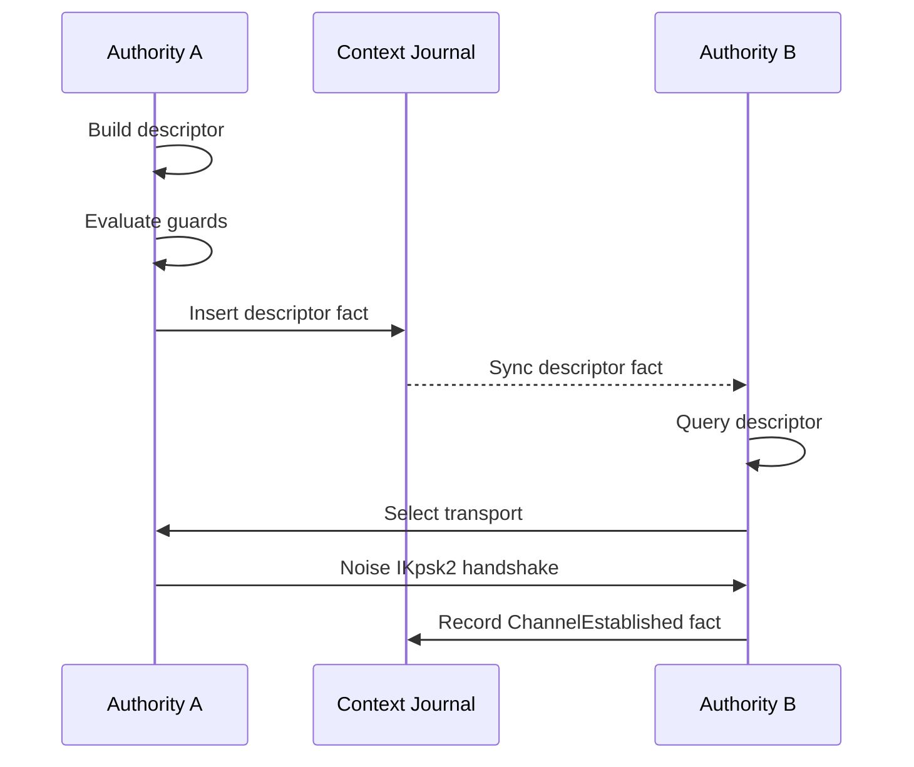

# Rendezvous Architecture

This document describes the rendezvous architecture in Aura. It explains peer discovery, descriptor propagation, transport selection, and channel establishment. It aligns with the authority and context model. It scopes all rendezvous behavior to relational contexts.

## 1. Overview

Rendezvous establishes secure channels between authorities. The `RendezvousService` exposes `prepare_publish_descriptor()` and `prepare_establish_channel()` methods. The service returns guard outcomes that the caller executes through an effect interpreter. Rendezvous operates inside a relational context and uses the context key for encryption. Descriptors appear as facts in the context journal. Propagation uses journal synchronization (`aura-sync`), not custom flooding.

Rendezvous does not establish global identity. All operations are scoped to a `ContextId`. A context defines which authorities may see descriptors. Only participating authorities have the keys required to decrypt descriptor payloads.

## 2. Architecture

The rendezvous crate follows Aura's fact-based architecture:

1. **Guard Chain First**: All network sends flow through guard evaluation before execution
2. **Facts Not Flooding**: Descriptors are journal facts propagated via `aura-sync`, not custom flooding
3. **Standard Receipts**: Uses the system `Receipt` type with epoch binding and cost tracking
4. **Session-Typed Protocol**: Protocols expressed as MPST choreographies with guard annotations
5. **Unified Transport**: Channels established via `SecureChannel` with Noise IKpsk2

### 2.1 Module Structure

```
aura-rendezvous/
├── src/
│   ├── lib.rs           # Public exports
│   ├── facts.rs         # RendezvousFact domain fact type
│   ├── protocol.rs      # MPST choreography definition
│   ├── service.rs       # RendezvousService (main coordinator)
│   ├── descriptor.rs    # Transport selector and builder
│   └── new_channel.rs   # SecureChannel, ChannelManager, Handshaker
```

## 3. Transport Strategy

The transport layer uses a priority sequence of connection attempts. Direct QUIC is attempted first. QUIC using reflexive addresses via STUN is attempted next. TCP direct is attempted next. WebSocket relay is attempted last. The first successful connection is used.

Aura uses relay-first fallback. Relays use guardians or designated peers. Relay traffic uses end-to-end encryption. Relay capabilities must be valid for the context.

STUN discovery identifies the external address of each participant. Devices query STUN servers periodically. The reflexive address appears in rendezvous descriptors as a transport hint. STUN failure does not prevent rendezvous because relay is always available.

## 4. Data Structures

### 4.1 Domain Facts

Rendezvous uses domain facts in the relational context journal. Facts are propagated via journal synchronization.

```rust
/// Rendezvous domain facts stored in context journals
pub enum RendezvousFact {
    /// Transport descriptor advertisement
    Descriptor(RendezvousDescriptor),

    /// Channel established acknowledgment
    ChannelEstablished {
        initiator: AuthorityId,
        responder: AuthorityId,
        channel_id: [u8; 32],
        epoch: u64,
    },

    /// Descriptor revocation
    DescriptorRevoked {
        authority_id: AuthorityId,
        nonce: [u8; 32],
    },
}
```

### 4.2 Transport Descriptors

```rust
/// Transport descriptor for peer discovery
pub struct RendezvousDescriptor {
    /// Authority publishing this descriptor
    pub authority_id: AuthorityId,
    /// Context this descriptor is for
    pub context_id: ContextId,
    /// Available transport endpoints
    pub transport_hints: Vec<TransportHint>,
    /// Handshake PSK commitment (hash of PSK)
    pub handshake_psk_commitment: [u8; 32],
    /// Validity window start (ms since epoch)
    pub valid_from: u64,
    /// Validity window end (ms since epoch)
    pub valid_until: u64,
    /// Nonce for uniqueness
    pub nonce: [u8; 32],
}
```

### 4.3 Transport Hints

```rust
/// Transport endpoint hint
pub enum TransportHint {
    /// Direct QUIC connection
    QuicDirect { addr: String },
    /// QUIC via STUN-discovered reflexive address
    QuicReflexive { addr: String, stun_server: String },
    /// WebSocket relay through a relay authority
    WebSocketRelay { relay_authority: AuthorityId },
    /// TCP direct connection
    TcpDirect { addr: String },
}
```

## 5. MPST Choreographies

Rendezvous protocols are defined as MPST choreographies with guard annotations.

### 5.1 Direct Exchange Protocol

```rust
choreography! {
    #[namespace = "rendezvous_exchange"]
    protocol RendezvousExchange {
        roles: Initiator, Responder;

        // Initiator publishes descriptor (fact insertion, propagates via sync)
        Initiator[guard_capability = "rendezvous:publish",
                  flow_cost = 1,
                  journal_facts = "descriptor_offered"]
        -> Responder: DescriptorOffer(RendezvousDescriptor);

        // Responder publishes response descriptor
        Responder[guard_capability = "rendezvous:publish",
                  flow_cost = 1,
                  journal_facts = "descriptor_answered"]
        -> Initiator: DescriptorAnswer(RendezvousDescriptor);

        // Direct channel establishment
        Initiator[guard_capability = "rendezvous:connect",
                  flow_cost = 2]
        -> Responder: HandshakeInit(NoiseHandshake);

        Responder[guard_capability = "rendezvous:connect",
                  flow_cost = 2,
                  journal_facts = "channel_established"]
        -> Initiator: HandshakeComplete(NoiseHandshake);
    }
}
```

### 5.2 Relayed Protocol

```rust
choreography! {
    #[namespace = "relayed_rendezvous"]
    protocol RelayedRendezvous {
        roles: Initiator, Relay, Responder;

        Initiator[guard_capability = "rendezvous:relay",
                  flow_cost = 2]
        -> Relay: RelayRequest(RelayEnvelope);

        Relay[guard_capability = "relay:forward",
              flow_cost = 1,
              leak = "neighbor:1"]
        -> Responder: RelayForward(RelayEnvelope);

        Responder[guard_capability = "rendezvous:relay",
                  flow_cost = 2]
        -> Relay: RelayResponse(RelayEnvelope);

        Relay[guard_capability = "relay:forward",
              flow_cost = 1,
              leak = "neighbor:1"]
        -> Initiator: RelayComplete(RelayEnvelope);
    }
}
```

## 6. Descriptor Propagation

Descriptors propagate via journal synchronization. This replaces custom flooding.

1. Authority creates a `RendezvousFact::Descriptor` fact
2. Guard chain evaluates the publication request
3. On success, fact is inserted into the context journal
4. Journal sync (`aura-sync`) propagates facts to context participants
5. Peers query journal for peer descriptors

This model provides:
- **Deduplication**: Journal sync handles duplicate facts naturally
- **Ordering**: Facts have causal ordering via journal timestamps
- **Authorization**: Guard chain validates before insertion
- **Consistency**: Same propagation mechanism as other domain facts

### 6.1 aura-sync Integration

The `aura-sync` crate provides a `RendezvousAdapter` that bridges peer discovery with rendezvous descriptors:

```rust
use aura_sync::infrastructure::RendezvousAdapter;

// Create adapter linking rendezvous to sync
let adapter = RendezvousAdapter::new(&rendezvous_service);

// Query peer info from cached descriptors
if let Some(peer_info) = adapter.get_peer_info(context_id, peer, now_ms) {
    if peer_info.has_direct_transport() {
        // Use direct connection
    }
}

// Check which peers need descriptor refresh
let stale_peers = adapter.peers_needing_refresh(context_id, now_ms);
```

## 7. Protocol Flow

The rendezvous sequence uses the context between two authorities.



## 8. Guard Chain Integration

All rendezvous operations flow through the guard chain.

### 8.1 Guard Capabilities

```rust
pub mod guards {
    pub const CAP_RENDEZVOUS_PUBLISH: &str = "rendezvous:publish";
    pub const CAP_RENDEZVOUS_CONNECT: &str = "rendezvous:connect";
    pub const CAP_RENDEZVOUS_RELAY: &str = "rendezvous:relay";
}
```

### 8.2 Flow Costs

```rust
pub const DESCRIPTOR_PUBLISH_COST: u32 = 1;
pub const CONNECT_DIRECT_COST: u32 = 2;
pub const CONNECT_RELAY_COST: u32 = 3;
pub const RELAY_FORWARD_COST: u32 = 1;
```

### 8.3 Guard Evaluation

The service prepares operations and returns `GuardOutcome` containing effect commands. The caller executes these commands.

```rust
// 1. Prepare snapshot of current state
let snapshot = GuardSnapshot {
    authority_id: alice,
    context_id: context,
    flow_budget_remaining: 100,
    capabilities: vec!["rendezvous:publish".into()],
    epoch: 1,
};

// 2. Prepare publication (pure, sync)
let outcome = service.prepare_publish_descriptor(
    &snapshot, context, transport_hints, now_ms
);

// 3. Check decision and execute effects
if outcome.decision.is_allowed() {
    for cmd in outcome.effects {
        execute_effect_command(cmd).await?;
    }
}
```

## 9. Secure Channel Establishment

After receiving a valid descriptor, the initiator selects a transport. Both sides run Noise IKpsk2 using a context-derived PSK. Successful handshake yields a `SecureChannel`.

### 9.1 Channel Structure

```rust
pub struct SecureChannel {
    /// Unique channel identifier
    channel_id: [u8; 32],
    /// Context this channel belongs to
    context_id: ContextId,
    /// Local authority
    local: AuthorityId,
    /// Remote peer
    remote: AuthorityId,
    /// Current epoch (for key rotation)
    epoch: u64,
    /// Channel state
    state: ChannelState,
}

pub enum ChannelState {
    Establishing,
    Active,
    Rotating,
    Closed,
    Error(String),
}
```

### 9.2 Channel Manager

The `ChannelManager` tracks active channels:

```rust
let mut manager = ChannelManager::new();

// Register a new channel
manager.register(channel);

// Find channel by context and peer
if let Some(ch) = manager.find_by_context_peer(context, peer) {
    if ch.is_active() {
        // Use channel
    }
}

// Advance epoch and mark channels for rotation
manager.advance_epoch(new_epoch);
```

### 9.3 Handshake Flow

The `Handshaker` state machine handles Noise IKpsk2:

```rust
// Initiator side
let mut initiator = Handshaker::new(HandshakeConfig {
    local: alice,
    remote: bob,
    context_id: context,
    psk: derived_psk,
    timeout_ms: 5000,
});

let init_msg = initiator.create_init_message(epoch)?;
// ... send init_msg to responder ...
initiator.process_response(&response_msg)?;
let result = initiator.complete(epoch, true)?;
let channel = initiator.build_channel(&result)?;
```

### 9.4 Key Rotation

Channels support epoch-based key rotation. When the epoch advances, channels rekey using the new context-derived PSK.

```rust
impl SecureChannel {
    pub fn needs_epoch_rotation(&self, current_epoch: u64) -> bool {
        self.epoch < current_epoch
    }

    pub fn rotate(&mut self, new_epoch: u64) -> AuraResult<()> {
        // Rekey the channel
        self.state = ChannelState::Rotating;
        self.epoch = new_epoch;
        self.needs_rotation = false;
        self.state = ChannelState::Active;
        Ok(())
    }
}
```

## 10. Service Interface

The rendezvous service coordinates descriptor publication and channel establishment.

```rust
impl RendezvousService {
    /// Create a new rendezvous service
    pub fn new(authority_id: AuthorityId, config: RendezvousConfig) -> Self;

    /// Prepare to publish descriptor to context journal
    pub fn prepare_publish_descriptor(
        &self,
        snapshot: &GuardSnapshot,
        context_id: ContextId,
        transport_hints: Vec<TransportHint>,
        now_ms: u64,
    ) -> GuardOutcome;

    /// Prepare to establish channel with peer
    pub fn prepare_establish_channel(
        &self,
        snapshot: &GuardSnapshot,
        context_id: ContextId,
        peer: AuthorityId,
        psk: &[u8; 32],
    ) -> AuraResult<GuardOutcome>;

    /// Prepare to handle incoming handshake
    pub fn prepare_handle_handshake(
        &self,
        snapshot: &GuardSnapshot,
        context_id: ContextId,
        initiator: AuthorityId,
        handshake: NoiseHandshake,
        psk: &[u8; 32],
    ) -> GuardOutcome;

    /// Cache a peer's descriptor (from journal sync)
    pub fn cache_descriptor(&mut self, descriptor: RendezvousDescriptor);

    /// Get a cached descriptor
    pub fn get_cached_descriptor(
        &self,
        context_id: ContextId,
        peer: AuthorityId,
    ) -> Option<&RendezvousDescriptor>;

    /// Check if our descriptor needs refresh
    pub fn needs_refresh(
        &self,
        context_id: ContextId,
        now_ms: u64,
        refresh_window_ms: u64,
    ) -> bool;
}
```

## 11. Effect Commands

The service returns `GuardOutcome` with effect commands to execute:

```rust
pub enum EffectCommand {
    /// Append fact to journal
    JournalAppend { fact: RendezvousFact },
    /// Charge flow budget
    ChargeFlowBudget { cost: u32 },
    /// Send handshake init message
    SendHandshake { peer: AuthorityId, message: HandshakeInit },
    /// Send handshake response
    SendHandshakeResponse { peer: AuthorityId, message: HandshakeComplete },
    /// Record operation receipt
    RecordReceipt { operation: String, peer: AuthorityId },
}
```

## 12. Failure Modes and Privacy

Failures occur during guard evaluation, descriptor validation, or transport establishment. These failures are local. No network packets reveal capability or budget failures.

Context isolation prevents unauthorized authorities from reading descriptors. Transport hints do not reveal authority structure. Relay identifiers reveal only the relay authority. Descriptor contents remain encrypted for transit.

## 13. Summary

Rendezvous provides encrypted peer discovery and channel establishment scoped to relational contexts. Descriptors propagate through journal synchronization with guard chain enforcement. Secure channels use Noise IKpsk2 and QUIC. All behavior remains private to the context and reveals no structural information. The architecture uses standard Aura primitives: domain facts, guard chains, MPST choreographies, and effect interpretation.
