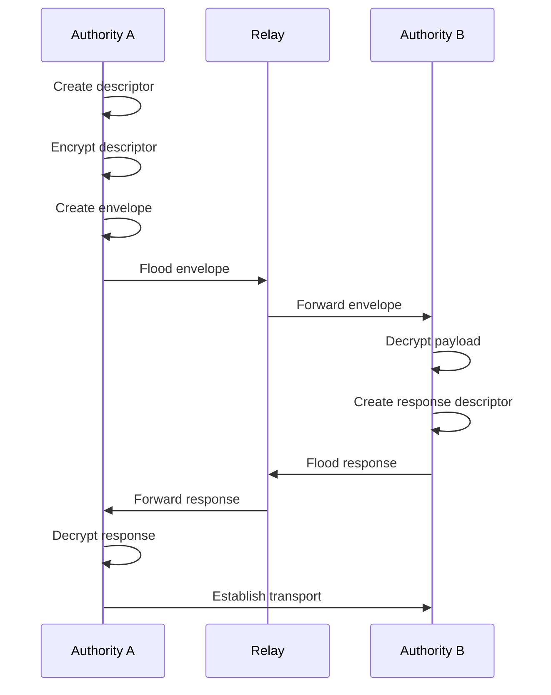

# Rendezvous Architecture

This document describes the rendezvous architecture in Aura. It explains peer discovery, envelope propagation, transport selection, and channel establishment. It aligns with the current authority and context model. It removes device identifiers from public structures. It scopes all rendezvous behavior to relational contexts.

## 1. Overview

Rendezvous establishes secure channels between authorities. Each authority uses a rendezvous manager that exposes `establish_channel(ContextId)`. The manager returns a handle implementing `TransportEffects`. Rendezvous operates inside a relational context and uses the context key for encryption. Envelopes appear as facts in the context journal. Flooding uses the same gossip loop that synchronizes journals.

Rendezvous does not establish global identity. All operations are scoped to a `ContextId`. A context defines which authorities may see envelopes. Only participating authorities have the keys required to decrypt descriptors.

## 2. Transport Strategy

The transport layer uses a priority sequence of connection attempts. Direct QUIC is attempted first. QUIC using reflexive addresses via STUN is attempted next. WebSocket relay is attempted last. The first successful connection is used.

Aura uses relay-first fallback. Relays use guardians or designated peers. Relay traffic uses end-to-end encryption. Relay capabilities must be valid for the context.

STUN discovery identifies the external address of each participant. Devices query STUN servers periodically. The reflexive address appears in rendezvous descriptors as a transport hint. STUN failure does not prevent rendezvous because relay is always available.

Hole punching uses simultaneous UDP packets. Each peer includes a `punch_nonce` in its descriptor. Both peers send packets containing the nonce and ephemeral keys. NATs allow these packets to establish bidirectional mappings. QUIC completes the handshake after mappings appear.

## 3. Data Structures

Rendezvous uses two fact types in the relational context journal. The envelope contains routing metadata. The descriptor contains transport information and handshake parameters. Payloads are encrypted using the context-derived key.

```rust
pub struct RendezvousEnvelope {
    pub context: ContextId,
    pub role: OfferOrAnswer,
    pub epoch: u64,
    pub counter: u32,
    pub flow_cost: u32,
    pub payload_cid: Cid,
    pub signature: Vec<u8>,
}
```

This structure defines an envelope stored in the context journal. The envelope header is visible for gossip. The payload is encrypted. The `flow_cost` field expresses the cost to forward the envelope.

```rust
pub struct RendezvousDescriptor {
    pub context: ContextId,
    pub transport_hints: Vec<TransportHint>,
    pub punch_nonce: Option<[u8; 32]>,
    pub handshake_psk: [u8; 32],
    pub validity: Interval,
    pub signature: Vec<u8>,
}
```

This structure defines a descriptor encrypted in the payload. The descriptor lists transport hints and handshake parameters. The `handshake_psk` binds Noise IKpsk2 to the context.

```rust
enum TransportHint {
    QuicDirect { addr: SocketAddr },
    QuicReflexive { addr: SocketAddr },
    WebSocketRelay { relay: AuthorityId },
    WebSocketDirect { url: String },
}
```

This enum defines transport options. Relay hints require valid relay capabilities.

## 4. Envelope Propagation

Envelopes propagate using the gossip loop. Each participant floods new envelopes to its neighbors. Neighbors forward envelopes if they have flow budget and if the envelope is new. Duplicate envelopes are ignored.

Encrypted payloads are stored in a content store keyed by `payload_cid`. Authorities decrypt payloads using the context key. Only participants in the relational context have the required keys.

Flow budget is charged before forwarding. Each hop charges its local flow budget for the `(context, neighbor)` pair. Flow failures prevent forwarding but do not reveal failures to the network.

Receipts document successful forwarding. Receipts allow downstream authorities to prove that upstream hops charged their budgets.

## 5. Protocol Flow

The rendezvous sequence uses the context between two authorities. Each authority derives a per-context key used for encryption and handshake.



A constructs a descriptor. A encrypts it with the context key. A publishes an envelope fact. Neighbors forward the envelope. B decrypts the descriptor and publishes a response. A receives the response and selects a transport. A completes a Noise IKpsk2 handshake with B.

## 6. Flow Budget Integration

Flow budgets limit the rate of envelope propagation. Each envelope includes a cost. The rendezvous manager charges this cost before sending or forwarding. Cost is scoped to `(ContextId, neighbor_authority)`.

The budget charge uses the guard chain. `CapGuard` ensures authorization for propagation. `FlowGuard` charges the budget. `JournalCoupler` inserts forwarding receipts into the journal. Guard evaluation runs over a prepared `GuardSnapshot` and returns `EffectCommand` items that an async interpreter executes so guards remain pure and no transport work occurs until the entire sequence succeeds.

```rust
pub struct Receipt {
    pub context: ContextId,
    pub from: AuthorityId,
    pub to: AuthorityId,
    pub epoch: u64,
    pub cost: u32,
    pub signature: Vec<u8>,
}
```

This structure defines per-hop receipts. Receipts verify that forwarding charged budget correctly.

## 7. Secure Channel Establishment

After receiving a valid descriptor, the initiator selects a transport. Both sides run Noise IKpsk2 using the descriptor handshake key. Successful handshake yields a `SecureChannel`. The channel binds the authorities and context.

```rust
pub struct SecureChannel {
    pub context: ContextId,
    pub peer: AuthorityId,
    pub channel_id: Uuid,
}
```

This structure represents a live channel. Channel failure triggers re-establishment. Channel keys refresh when epochs change.

## 8. Failure Modes and Privacy

Failures occur during budget charging, decryption, or transport establishment. These failures are local. No network packets reveal capability or budget failures.

Context isolation prevents unauthorized authorities from reading envelopes. Transport hints do not reveal authority structure. Relay identifiers reveal only the relay authority. Payload contents remain private.

## 9. Interfaces

The rendezvous manager exposes a publication function and a channel establishment function. The publication function creates updated descriptors. The establishment function drives the rendezvous process.

```rust
pub trait RendezvousEffects {
    async fn publish_descriptor(&self, context: ContextId) -> Result<()>;
    async fn establish_channel(&self, context: ContextId) -> Result<SecureChannel>;
}
```

This trait defines rendezvous behavior. Implementations manage envelopes, flow budgets, decryption, and transport negotiation.

## 10. Summary

Rendezvous provides encrypted peer discovery and channel establishment scoped to relational contexts. Envelopes propagate through context-aware gossip with flow budget enforcement. Secure channels use Noise IKpsk2 and QUIC. All behavior remains private to the context and reveals no structural information.
