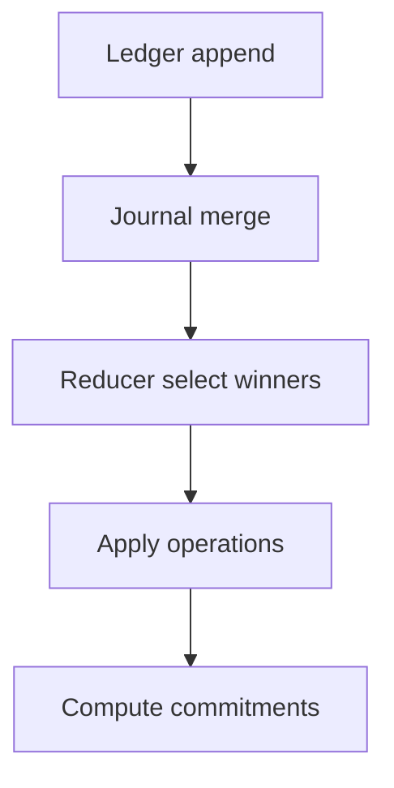

# State Reduction Flows

## Overview

Aura maintains two replicated state machines. Account journals describe commitment trees for authorities. Relational context journals describe cross-authority coordination. Both use the same fact-only semilattice and deterministic reducers. This document explains the full path from fact creation to reduced state so that implementations remain aligned.

## Fact Production

Account operations originate from local threshold signing or Aura Consensus. Relational context operations always run through Aura Consensus because multiple authorities must agree on the prestate. Each successful operation produces an `AttestedOp` fact. Flow-budget charges show up as additional attested operations (or relational facts in the relevant context) that increment the `spent` counter; limits are recomputed locally from Biscuit tokens and sovereign policy so they never appear as CRDT entries. Receipts that must be retained for accountability are stored as relational facts scoped to the context that emitted them. Implementations must only emit facts after verifying signatures and parent commitments.

## Reduction Pipeline

Ledger append writes facts durably. Journal merge unions the fact set. Reducers group operations by parent commitment, select deterministic winners (max hash or preference order), and then apply them. The final step recomputes commitments and epochs which downstream components treat as the canonical state. Both account and relational reducers follow the same pipeline even though their operation types differ.

## Coupling With Budgets And Receipts

Flow budgets replicate only the `spent` counter as facts. When FlowGuard charges a send it emits a fact that increases `spent`. Policy changes and Biscuit evaluation shrink the effective `limit` at runtime without emitting new facts, which keeps authority decisions local but deterministic. Receipts reference the current epoch commitment so reducers can reject stale receipts automatically. This coupling ensures that budget convergence follows the same semilattice as commitment tree operations without introducing extra mutation paths.
