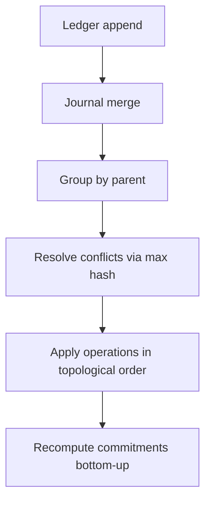

# State Reduction Flows

## Overview

Aura maintains two replicated state machines. Account journals describe commitment trees for authorities. Relational context journals describe cross-authority coordination. Both use the same fact-only semilattice and deterministic reducers. This document explains the full path from fact creation to reduced state so that implementations remain aligned.

## Fact Production

Account operations originate from local threshold signing or Aura Consensus. Relational context operations always run through Aura Consensus because multiple authorities must agree on the prestate. Each successful operation produces an `AttestedOp` fact. Receipts that must be retained for accountability are stored as `RendezvousReceipt` facts scoped to the context that emitted them. Implementations must only emit facts after verifying signatures and parent commitments.

## Reduction Pipeline



Ledger append writes facts durably. Journal merge unions the fact set. Reducers group operations by parent commitment, resolve conflicts deterministically using max hash tie-breaking (`H(op)` comparison), and then apply winners in topological order. The final step recomputes commitments bottom-up which downstream components treat as the canonical state. Both account and relational reducers follow the same pipeline even though their operation types differ.

### Max Hash Conflict Resolution

When multiple operations reference the same parent state (concurrent operations), the reducer selects a deterministic winner:

```rust
fn resolve_conflict(ops: &[AttestedOp]) -> &AttestedOp {
    // Hash each operation deterministically
    // Select the operation with the maximum hash value
    ops.iter().max_by_key(|op| hash_op(op)).unwrap()
}

fn hash_op(op: &AttestedOp) -> TreeHash32 {
    let mut hasher = hash::hasher();
    hasher.update(&op.op.parent_epoch.to_le_bytes());
    hasher.update(&op.op.parent_commitment);
    // Include all operation fields for uniqueness
    hasher.finalize()
}
```

This ensures all replicas select the same winner regardless of the order facts were received.

## Flow Budgets

Flow budgets track message sending allowances between authorities. The `FlowBudget` structure uses semilattice semantics for distributed convergence:

```rust
pub struct FlowBudget {
    pub limit: u64,   // Maximum allowed (meet-semilattice: min)
    pub spent: u64,   // Amount used (join-semilattice: max)
    pub epoch: Epoch, // Current epoch (max)
}

impl FlowBudget {
    pub fn merge(&self, other: &Self) -> Self {
        Self {
            limit: self.limit.min(other.limit),   // Meet: most restrictive
            spent: self.spent.max(other.spent),   // Join: highest observed
            epoch: self.epoch.max(other.epoch),   // Latest epoch
        }
    }
}
```

**Semantics:**
- `spent` uses join-semilattice (max) - charges only increase
- `limit` uses meet-semilattice (min) - most restrictive limit wins
- `epoch` advances monotonically; spent resets on epoch rotation

Flow budget tracking currently operates at the runtime layer via `FlowBudgetManager`. The `RelationalState` includes a `flow_budgets` map for future CRDT-based replication of budget state across replicas.

## Receipts and Accountability

Receipts reference the current epoch commitment so reducers can reject stale receipts automatically. The `RendezvousReceipt` fact type stores accountability proofs:

```rust
RendezvousReceipt {
    envelope_id: [u8; 32],
    authority_id: AuthorityId,
    timestamp: TimeStamp,
    signature: Vec<u8>,
}
```

Receipts are stored as relational facts scoped to the emitting context. This coupling ensures that receipt validity follows commitment tree epochs.

## TreeStateSummary Computation

Account reduction produces a `TreeStateSummary` representing the public view of the commitment tree:

```rust
pub struct TreeStateSummary {
    epoch: Epoch,
    commitment: Hash32,
    threshold: u16,
    device_count: u32,
}
```

The `TreeStateSummary` is a lightweight type that hides internal device structure. For the full internal representation with branches, leaves, and topology, see `TreeState` in `aura-journal::commitment_tree`.

Operations update TreeStateSummary as follows:
- **AddLeaf**: Increments `device_count`, recomputes commitment
- **RemoveLeaf**: Decrements `device_count`, recomputes commitment
- **UpdatePolicy**: Changes `threshold`, recomputes commitment
- **RotateEpoch**: Increments `epoch`, recomputes all commitments with new epoch binding

Commitment recomputation is efficient: only affected paths from modified nodes to the root are recalculated.

## RelationalState Computation

Context reduction produces a `RelationalState` capturing cross-authority relationships:

```rust
pub struct RelationalState {
    pub bindings: Vec<RelationalBinding>,
    pub flow_budgets: BTreeMap<(AuthorityId, AuthorityId, u64), u64>,
    pub channel_epochs: BTreeMap<ChannelId, ChannelEpochState>,
}
```

### AMP Channel Management

The relational reducer processes AMP (Asynchronous Message Protocol) channel facts:

- **AmpChannelCheckpoint**: Snapshots of channel state at a generation
- **AmpProposedChannelEpochBump**: Proposed epoch transitions (pending confirmation)
- **AmpCommittedChannelEpochBump**: Confirmed epoch transitions
- **AmpChannelPolicy**: Per-channel skip window overrides

Channel epoch state tracks:
```rust
pub struct ChannelEpochState {
    pub current_generation: u64,
    pub pending_bumps: Vec<ProposedBump>,
    pub skip_window: u64,
}
```

## Garbage Collection

Snapshots establish pruning boundaries. The GC algorithm uses safety margins:

- **Default skip window**: 1024 generations
- **Safety margin**: `skip_window / 2`
- **Pruning boundary**: `max_generation - (2 * skip_window) - safety_margin`

Example: With max_generation = 5000 and default window (1024):
```
boundary = 5000 - (2 * 1024) - 512 = 2440
```

Facts with generation ≤ 2440 can be safely pruned.

## Determinism Invariants

The reduction pipeline maintains strict determinism:

1. **No HashMap iteration** - All maps use BTreeMap for consistent ordering
2. **No system time** - OrderTime tokens provide opaque ordering
3. **No floating point** - All arithmetic uses exact integer/fixed-point
4. **Pure functions only** - Reducers have no side effects

These properties are verified by:
- `test_reduction_determinism()` - All fact permutations produce identical state
- `amp_reduction_order_independent()` - AMP channel reduction is order-independent
- Quint model checking for convergence properties

## References

- [Journal](102_journal.md) - Fact model and semilattice structure
- [Maintenance](111_maintenance.md) - Snapshot and GC pipeline details
- [Transport and Information Flow](108_transport_and_information_flow.md) - Receipt handling
