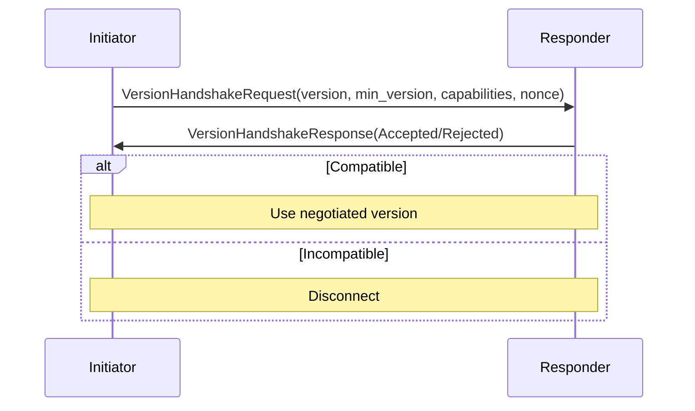

# Transport and Information Flow

This document describes the architecture of transport, guard chains, flow budgets, receipts, and information flow in Aura. It defines the secure channel abstraction and the enforcement mechanisms that regulate message transmission. It explains how context boundaries scope capabilities and budgets.

## 1. Transport Abstraction

Aura provides a transport layer that delivers encrypted messages between authorities. Each transport connection is represented as a `SecureChannel`. A secure channel binds a pair of authorities and a context identifier. A secure channel maintains isolation across contexts.

A secure channel exposes a send operation and a receive operation. The channel manages replay protection and handles connection teardown on epoch changes.

```rust
pub struct SecureChannel {
    pub context: ContextId,
    pub peer: AuthorityId,
    pub channel_id: Uuid,
}
```

This structure identifies a single secure channel. One channel exists per `(ContextId, peer)` pair. Channel metadata binds the channel to a specific context epoch.

## 2. Guard Chain

All transport sends pass through the guard chain defined in [Authorization](106_authorization.md). CapGuard evaluates Biscuit capabilities and sovereign policy. FlowGuard charges the per-context flow budget and produces a receipt. JournalCoupler records the accompanying facts atomically. Each stage must succeed before the next stage executes. Guard evaluation runs synchronously over a prepared `GuardSnapshot` and returns `EffectCommand` data. An async interpreter executes those commands so guards never perform I/O directly.

## 3. Flow Budget and Receipts

Flow budgets limit the amount of data that an authority may send within a context. The flow budget model defines a quota for each `(ContextId, peer)` pair. A reservation system protects against race conditions.

An authority must reserve budget before sending. A reservation locks a portion of the available budget. The actual charge occurs during the guard chain. If the guard chain succeeds, a receipt is created.

```rust
/// From aura-core/src/types/flow.rs
pub struct Receipt {
    pub ctx: ContextId,
    pub src: AuthorityId,
    pub dst: AuthorityId,
    pub epoch: Epoch,
    pub cost: FlowCost,
    pub nonce: FlowNonce,
    pub prev: Hash32,
    pub sig: ReceiptSig,
}
```

This structure defines a receipt. A receipt binds a cost to a specific context and epoch. The sender signs the receipt. The `nonce` ensures uniqueness and the `prev` field chains receipts for auditing. The recipient verifies the signature. Receipts support accountability in multi-hop routing.

## 4. Information Flow Budgets

Information flow budgets define limits on metadata leakage. Budgets exist for external leakage, neighbor leakage, and group leakage. Each protocol message carries leakage annotations. These annotations specify the cost for each leakage dimension.

Leakage budgets determine if a message can be sent. If the leakage cost exceeds the remaining budget, the message is denied. Enforcement uses padding and batching strategies. Padding hides message size. Batching hides message frequency.

```rust
pub struct LeakageBudget {
    pub external: u32,
    pub neighbor: u32,
    pub in_group: u32,
}
```

This structure defines the leakage budget for a message. Leakage costs reduce the corresponding budget on successful send.

## 5. Context Integration

Capabilities and flow budgets are scoped to a `ContextId`. Each secure channel associates all guard decisions with its context. A capability is valid only for the context in which it was issued. A flow budget applies only within the same context.

Derived context keys bind communication identities to the current epoch. When the account epoch changes, all context identities must refresh. All secure channels for the context must be renegotiated.

```rust
pub struct ChannelContext {
    pub context: ContextId,
    pub epoch: u64,
    pub caps: Vec<Capability>,
}
```

This structure defines the active context state for a channel. All guard chain checks use these values.

## 6. Failure Modes and Observability

The guard chain defines three categories of failure. A denial failure occurs when capability requirements are not met. A block failure occurs when a flow budget check fails. A commit failure occurs when journal coupling fails.

Denial failures produce no observable behavior. Block failures also produce no observable behavior. Commit failures prevent sending and produce local error logs. None of these failures result in network traffic.

This design ensures that unauthorized or over-budget sends do not produce side channels.

## 7. Security Properties

Aura enforces no observable behavior without charge. A message cannot be sent unless flow budget is charged first. Capability gated sends ensure that each message satisfies authorization rules. Receipts provide accountability for multi-hop forwarding.

The network layer does not reveal authority structure. Context identifiers do not reveal membership. All metadata is scoped to individual relationships.

## 8. Secure Channel Lifecycle

Secure channels follow a lifecycle aligned with rendezvous and epoch semantics.

Establishment begins with rendezvous per [Rendezvous Architecture](113_rendezvous.md) to exchange descriptors inside the [Relational Contexts](114_relational_contexts.md) journal. Each descriptor contains transport hints, a handshake PSK derived from the context key, and a `punch_nonce`. Once both parties receive offer/answer envelopes, they perform Noise IKpsk2 using context-derived keys and establish a QUIC or relay-backed channel bound to `(ContextId, peer)`.

During steady state, the guard chain enforces CapGuard, FlowGuard, and JournalCoupler for every send. FlowBudget receipts created on each hop are inserted into the [Relational Contexts](114_relational_contexts.md) journal so downstream peers can audit path compliance.

When the account or context epoch changes, the channel detects the mismatch, tears down the existing Noise session, and triggers rendezvous to derive fresh keys. Existing receipts are marked invalid for the new epoch, preventing replay. Channels close explicitly when contexts end or when FlowGuard hits the configured budget limit. Receipts emitted during teardown propagate through the relational context journal so guardians or auditors can verify all hops charged their budgets. Tying establishment and teardown to relational context journals ensures receipts become part of the same fact set tracked in [Distributed Maintenance Architecture](116_maintenance.md).

## 9. Privacy-by-Design Patterns

Privacy-by-design is enforced through context isolation, fixed-size envelopes, and flow budgets as defined in sections 1-7. All messages are scoped to a `ContextId` or `RelationshipId` with no cross-context routing. Capability hints are blinded before network transmission. The guard chain ensures unauthorized and over-budget sends produce no network traffic or timing side channels.

See [Effects and Handlers Guide](802_effects_guide.md) for privacy-aware implementation patterns.

## 10. Sync Status and Delivery Tracking

The system exposes sync status for Category A (optimistic) operations through `Propagation` state (Local, Syncing, Complete, Failed) and `Acknowledgment` records per peer. Delivery status is derived from consistency metadata, not stored directly. Read receipts are semantic (user viewed the message) and distinct from transport-level delivery acknowledgments.

Category B operations use proposal/approval state. Category C operations use ceremony completion status. Lifecycle modes (A1/A2/A3) apply within these categories: A1/A2 updates are usable immediately but provisional until A3 consensus finalization.

See [Operation Categories](109_operation_categories.md) for the full consistency metadata type definitions. See [Effects and Handlers Guide](802_effects_guide.md) for delivery tracking patterns.

## 11. Anti-Entropy Sync Protocol

Anti-entropy implements journal synchronization between peers. The protocol exchanges digests, plans reconciliation, and transfers operations.

### 11.1 Sync Phases

A sync round begins by loading the local `Journal` and operation log, then computing a `JournalDigest` for the local state. The digest is exchanged with the peer. The two digests are compared to determine whether the states are equal, whether one side is behind, or whether they have diverged. Missing operations are then pulled or pushed in batches. Applied operations are converted to a journal delta, merged with the local journal, and persisted once per round.

### 11.2 Digest Format

```rust
pub struct JournalDigest {
    pub operation_count: u64,
    pub last_epoch: Epoch,
    pub operation_hash: Hash32,
    pub fact_hash: Hash32,
    pub caps_hash: Hash32,
}
```

The `operation_count` is the number of operations in the local op log. The `last_epoch` is the max parent_epoch observed. The `operation_hash` is computed by streaming op fingerprints in deterministic order. The `fact_hash` and `caps_hash` use canonical serialization (DAG-CBOR) then hash.

### 11.3 Reconciliation Actions

| Digest Comparison | Action |
|-------------------|--------|
| Equal | No-op |
| LocalBehind | Request missing ops |
| RemoteBehind | Push ops |
| Diverged | Push + pull |

Retry behavior follows `AntiEntropyConfig.retry_policy` with exponential backoff. Failures are reported with structured phase context attributable to a specific phase and peer.

See [Choreography Development Guide](803_choreography_guide.md) for anti-entropy implementation.

## 12. Protocol Version Negotiation

All choreographic protocols participate in version negotiation during connection establishment.

### 12.1 Version Handshake Flow



See [Choreography Development Guide](803_choreography_guide.md) for version handshake implementation.

### 12.2 Handshake Outcomes

| Outcome | Response Contents |
|---------|-------------------|
| Compatible | `negotiated_version` (min of both peers), shared `capabilities` |
| Incompatible | `reason`, peer version, optional `upgrade_url` |

### 12.3 Protocol Capabilities

| Capability | Min Version | Description |
|------------|-------------|-------------|
| `ceremony_supersession` | 1.0.0 | Ceremony replacement tracking |
| `version_handshake` | 1.0.0 | Protocol version negotiation |
| `fact_journal` | 1.0.0 | Fact-based journal sync |

## 13. Summary

The transport, guard chain, and information flow architecture enforces strict control over message transmission. Secure channels bind communication to contexts. Guard chains enforce authorization, budget, and journal updates. Flow budgets and receipts regulate data usage. Leakage budgets reduce metadata exposure. Privacy-by-design patterns ensure minimal metadata exposure and context isolation. All operations remain private to the context and reveal no structural information.

Sync status and delivery tracking provide user visibility into Category A operation propagation. Anti-entropy provides the underlying sync mechanism with digest-based reconciliation. Version negotiation ensures protocol compatibility across peers. Delivery receipts enable message read status for enhanced UX.
