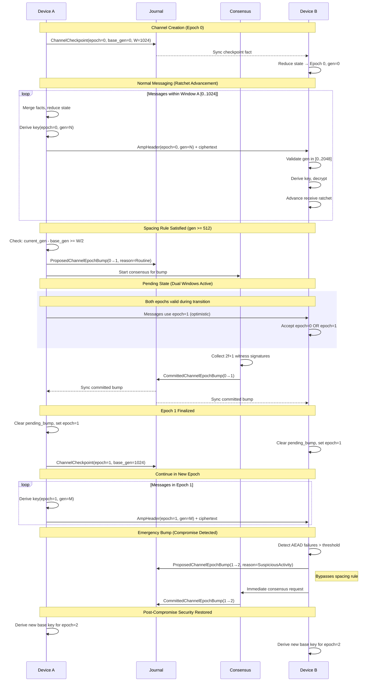
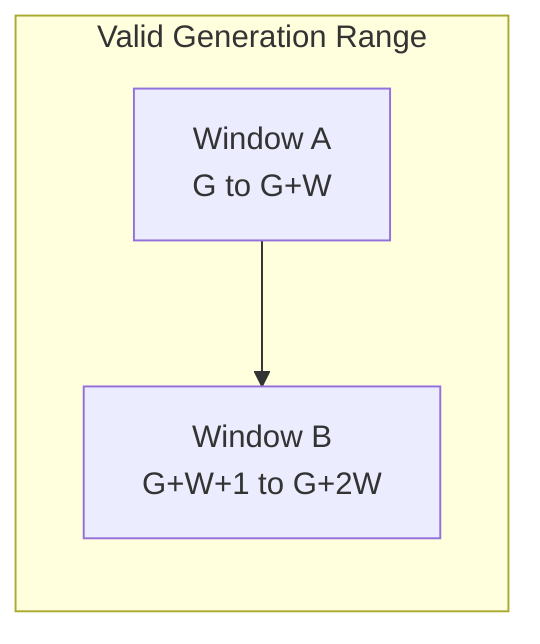

# Aura Messaging Protocol (AMP)

AMP is a secure asynchronous messaging protocol for Aura. It operates within relational contexts and channels. The protocol provides strong post-compromise security and bounded forward secrecy without head-of-line blocking.

## 1. Scope and Goals

AMP assumes shared state in joint semilattice journals is canonical. Secrets derive locally from shared state combined with authority keys. Ratchet operations remain deterministic and recoverable.

The protocol targets four properties. No head-of-line blocking occurs during message delivery. Strong post-compromise security restores confidentiality after key exposure. Bounded forward secrecy limits exposure within skip windows. Deterministic recovery enables key rederivation from journal state.

## 2. Channel Lifecycle Surface

The `AmpChannelEffects` trait defines the canonical API for AMP channel lifecycle and messaging. This trait lives in `aura-core::effects::amp`.

```rust
#[async_trait]
pub trait AmpChannelEffects: Send + Sync {
    async fn create_channel(&self, params: ChannelCreateParams) -> Result<ChannelId, AmpChannelError>;
    async fn close_channel(&self, params: ChannelCloseParams) -> Result<(), AmpChannelError>;
    async fn join_channel(&self, params: ChannelJoinParams) -> Result<(), AmpChannelError>;
    async fn leave_channel(&self, params: ChannelLeaveParams) -> Result<(), AmpChannelError>;
    async fn send_message(&self, params: ChannelSendParams) -> Result<AmpCiphertext, AmpChannelError>;
}
```

The `create_channel` method writes an AMP checkpoint and policy for a context-scoped channel. The `close_channel` method records a terminal epoch bump and policy closure. The `join_channel` and `leave_channel` methods record membership facts. The `send_message` method derives current channel state and returns `AmpCiphertext` containing the header and encrypted payload.

### 2.1 Implementations

The runtime implementation uses `AmpChannelCoordinator` in `aura-protocol::amp::channel_lifecycle`. The simulator implementation uses `SimAmpChannels` in `aura-simulator::amp`. The testkit provides `MockEffects` implementing `AmpChannelEffects` for deterministic unit tests.

### 2.2 TUI Wiring

The TUI routes `EffectCommand` variants through an optional `AmpChannelEffects` handle. Commands include `CreateChannel`, `CloseChannel`, and `SendMessage`. Events including `ChannelCreated`, `ChannelClosed`, and `MessageReceived` drive view updates.

Demo mode injects the simulator handler into `SimulatedBridge`. Alice and Carol agents use the same lifecycle as real clients while Bob remains human-controlled.

## 3. Terminology

### 3.1 Aura Terms

An authority is an account authority with a commitment tree and FROST keys. A relational context is shared state between authorities identified by `ContextId`. A journal is a CRDT OR-set of facts with monotone growth and deterministic reduction.

### 3.2 AMP Terms

A channel is a messaging substream scoped to a relational context. The channel epoch bounds post-compromise security and serves as the KDF base. The ratchet generation is a monotone position derived from reduced journal state. The skip window defines out-of-order tolerance with a default of 1024 generations.

A checkpoint is a journal fact anchoring ratchet windows. The alternating ratchet maintains two overlapping windows at boundaries. A pending bump is a proposed epoch transition awaiting consensus.

## 4. Fact Structures

AMP uses facts inserted into the relational context journal. All facts are monotone. Reduction determines canonical state.

### 4.1 Channel Checkpoint

```rust
pub struct ChannelCheckpoint {
    pub context: ContextId,
    pub channel: ChannelId,
    pub chan_epoch: u64,
    pub base_gen: u64,
    pub window: u32,
    pub ck_commitment: Hash32,
    pub skip_window_override: Option<u32>,
}
```

Reduction chooses one canonical checkpoint per context, channel, and epoch tuple. The valid ratchet generation set is the union of two windows. Window A spans from `base_gen` to `base_gen + window`. Window B spans from `base_gen + window + 1` to `base_gen + 2 * window`. Checkpoints enable deterministic recovery and serve as garbage collection anchors.

### 4.2 Proposed and Committed Epoch Bumps

```rust
pub struct ProposedChannelEpochBump {
    pub context: ContextId,
    pub channel: ChannelId,
    pub parent_epoch: u64,
    pub new_epoch: u64,
    pub bump_id: Hash32,
    pub reason: ChannelBumpReason,
}

pub struct CommittedChannelEpochBump {
    pub context: ContextId,
    pub channel: ChannelId,
    pub parent_epoch: u64,
    pub new_epoch: u64,
    pub chosen_bump_id: Hash32,
    pub consensus_id: Hash32,
}
```

Proposed bumps represent optimistic ratchet phase transitions. Committed bumps are finalized by Aura Consensus with 2f+1 witnesses. The new epoch always equals parent epoch plus one. Only one committed bump exists per parent epoch.

### 4.3 Channel Bump Reason

```rust
pub enum ChannelBumpReason {
    Routine,
    SuspiciousActivity,
    ConfirmedCompromise,
}
```

The `Routine` variant indicates cadence-based maintenance. The `SuspiciousActivity` variant indicates detected anomalies such as AEAD failures or ratchet conflicts. The `ConfirmedCompromise` variant requires immediate post-compromise security restoration. Both suspicious activity and confirmed compromise bypass routine spacing rules.

## 5. Derived Channel State

Reduction yields a `ChannelEpochState` struct containing the canonical epoch and derived state.

```rust
pub struct ChannelEpochState {
    pub chan_epoch: u64,
    pub pending_bump: Option<PendingBump>,
    pub last_checkpoint_gen: u64,
    pub current_gen: u64,
    pub skip_window: u32,
}

pub struct PendingBump {
    pub parent_epoch: u64,
    pub new_epoch: u64,
    pub bump_id: Hash32,
    pub reason: ChannelBumpReason,
}
```

The `chan_epoch` field holds the current canonical epoch. The `pending_bump` field holds an in-progress transition if one exists. The `last_checkpoint_gen` and `current_gen` fields track ratchet positions. The `skip_window` field determines out-of-order tolerance.

### 5.1 Skip Window Computation

The skip window derives from three sources in priority order. The checkpoint `skip_window_override` takes precedence. The channel policy fact applies if no override exists. The default of 1024 applies otherwise.

### 5.2 Critical Invariants

Before sending, a device must merge latest facts, reduce channel state, and use updated epoch and generation values. No device may send under stale epochs. Only one bump from epoch e to e+1 may be pending at a time. The new epoch always equals parent epoch plus one.

### 5.3 Ratchet Generation Semantics

The `ratchet_gen` value is not a local counter. It derives from reduced journal state. All devices converge to the same ratchet position after merging facts. Generation advances only when send or receive events occur consistent with checkpoint and dual-window rules. This guarantees deterministic recovery and prevents drift across devices.

## 6. Channel Epoch Bump Lifecycle

### 6.1 States

A channel has two states. The stable state indicates the epoch is finalized. The pending state indicates an optimistic bump awaits commitment.

### 6.2 Spacing Rule for Routine Bumps

AMP enforces a spacing rule for routine bumps. Let `base_gen` be the anchor generation from the canonical checkpoint. Let `current_gen` be the current ratchet generation. Let W be the skip window.

A routine bump from epoch e to e+1 requires `current_gen - base_gen >= W / 2`. With default W of 1024, this threshold equals 512 generations. This spacing ensures structural transitions do not occur too frequently.

Emergency bumps bypass this rule. Examples include multiple AEAD failures, conflicting ratchet commitments, unexpected epoch values, and explicit compromise signals.

### 6.3 State Transitions

In the stable state, if the spacing rule is satisfied and no bump is pending, the device inserts a `ProposedChannelEpochBump` and starts consensus. The device enters the pending state and uses the new epoch with alternating windows.

In the pending state, upon observing a committed bump, the device sets the new epoch and clears the pending bump. It may emit a new checkpoint and returns to the stable state.

### 6.4 Complete Lifecycle Sequence

The following diagram shows the complete double ratchet and epoch bump lifecycle between two devices.



This diagram illustrates four phases of the protocol. Channel creation establishes the initial checkpoint at epoch 0. Normal messaging advances the ratchet generation within dual windows. Routine bumps occur when spacing rules are satisfied and follow the consensus path. Emergency bumps bypass spacing for immediate post-compromise security.

## 7. Ratchet Windows

AMP uses an always-dual window model. Every checkpoint defines two consecutive skip windows providing a continuous valid range of 2W generations.

### 7.1 Window Layout

Given base generation G and skip window W, two windows are defined. Window A spans G to G+W. Window B spans G+W+1 to G+2W. The valid generation set is the union of both windows.



This design eliminates boundary issues. No mode switches are required. The implementation remains simple with robust asynchronous tolerance.

### 7.2 Window Shifting

When a new checkpoint is issued, the new base generation is chosen far enough ahead per the spacing rule. The dual-window layout guarantees overlap with prior windows. Garbage collection can safely prune older checkpoints when they no longer affect valid generation ranges.

## 8. Sending Messages

### 8.1 Message Header

```rust
pub struct AmpHeader {
    pub context: ContextId,
    pub channel: ChannelId,
    pub chan_epoch: u64,
    pub ratchet_gen: u64,
}
```

The header contains the context identifier, channel identifier, current epoch, and current generation. These fields form the additional authenticated data for AEAD encryption.

### 8.2 Send Procedure

Before sending, a device merges new facts and reduces channel state. It asserts that the current generation is within the valid generation set. It asserts the channel epoch is current.

If the spacing rule is satisfied and no bump is pending, the device proposes a new bump. The device derives the message key using a KDF with the channel base key, generation, and direction.

The device creates an `AmpHeader`, encrypts the payload with AEAD using the message key and header as additional data, and performs the guard chain. Guard evaluation runs over a prepared `GuardSnapshot` and emits `EffectCommand` items for async interpretation. The device then advances the local ratchet generation.

## 9. Receiving Messages

When receiving, a device merges new facts and reduces channel state. It checks that the message epoch is either the current or pending epoch. It checks that the generation is within the valid generation set.

The device rederives the message key using the same KDF parameters. It decrypts the payload using AEAD with the message key and header. It advances the local receive ratchet.

Messages outside valid windows or with unsupported epochs are rejected.

## 10. Recovery and Garbage Collection

### 10.1 Recovery

To recover, a device loads the relational context journal. It reduces to the latest committed epoch, checkpoint, and skip window. It rederives the channel base key from context root key, channel identifier, and epoch. It rederives ratchet state from the checkpoint and window generations.

### 10.2 Garbage Collection

AMP garbage collection maintains protocol safety while reclaiming storage. GC operates on checkpoints, proposed bumps, and committed bumps.

A checkpoint at generation G with window W can be pruned when a newer checkpoint exists at G' where G' exceeds G+2W. The newer checkpoint coverage must not overlap with the old checkpoint coverage. All messages within the old window must be processed or beyond the recovery horizon.

A proposed bump can be pruned when a committed bump supersedes it or when the epoch becomes stale. Committed bumps are retained as consensus evidence until full snapshot compaction.

### 10.3 Pruning Boundary

The safe pruning boundary for checkpoints is computed as the maximum checkpoint generation minus 2W minus a safety margin. The recommended safety margin is W/2 or 512 generations with default settings.

GC triggers when journal size exceeds threshold, checkpoint count exceeds maximum, manual compaction is requested, or snapshot creation initiates. See [Maintenance](111_maintenance.md) for integration with the Aura snapshot system.

## 11. Security Properties

### 11.1 Forward Secrecy

Forward secrecy is bounded by the skip window size of 1024 within each epoch. Older epochs use independent base keys.

### 11.2 Post-Compromise Security

Channel epoch bumps heal compromise of channel secret state. Context epoch bumps provide stronger PCS by healing compromise of context state.

### 11.3 No Head-of-Line Blocking

The protocol accepts out-of-order messages up to W generations. Dual windows absorb boundary drift.

### 11.4 No Ratchet Forks

Consensus finalizes each epoch step. The epoch chain is always linear and monotone.

### 11.5 Deterministic Recovery

Checkpoints anchor the ratchet. Facts represent all shared state. Keys are always rederived deterministically.

## 12. Governance

The skip window size W is governable via policy facts. Bump cadence and post-compromise security triggers can be governed by context policies.

## 13. Failure Modes

AMP drops messages only when they fall outside the cryptographically safe envelope. These failures are intentional safeguards.

### 13.1 Generation Out of Window

A message is dropped if its generation lies outside the valid generation set. Causes include stale sender state, aged messages post-GC, or invalid generations from attackers.

### 13.2 Epoch Mismatch

Messages are rejected when the header epoch is inconsistent with reduced epoch state. This includes epochs that are too old, non-linear epochs, or replays from retired epochs.

### 13.3 AEAD Failure

If AEAD decryption fails, messages are dropped. Repeated failures contribute to suspicious-event classification and may trigger emergency PCS.

### 13.4 Beyond Recovery Horizon

Messages older than the current checkpoint window cannot be decrypted because older checkpoints have been garbage collected. This is an intentional forward secrecy tradeoff.

### 13.5 Policy-Enforced Invalidity

After context epoch bumps or high-severity PCS events, messages from previous context epochs are intentionally dropped.

## See Also

- [Transport and Information Flow](108_transport_and_information_flow.md) for guard chain enforcement
- [Consensus](104_consensus.md) for epoch bump finalization
- [Journal System](102_journal.md) for fact semantics and reduction
- [Maintenance](111_maintenance.md) for snapshot and GC integration
