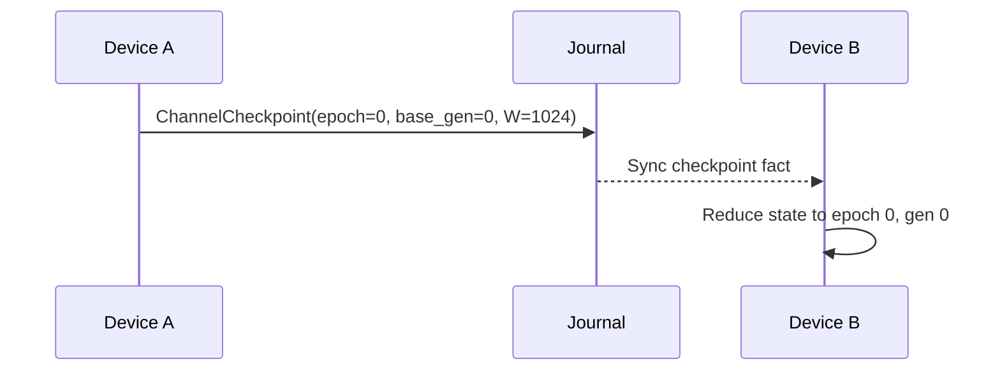
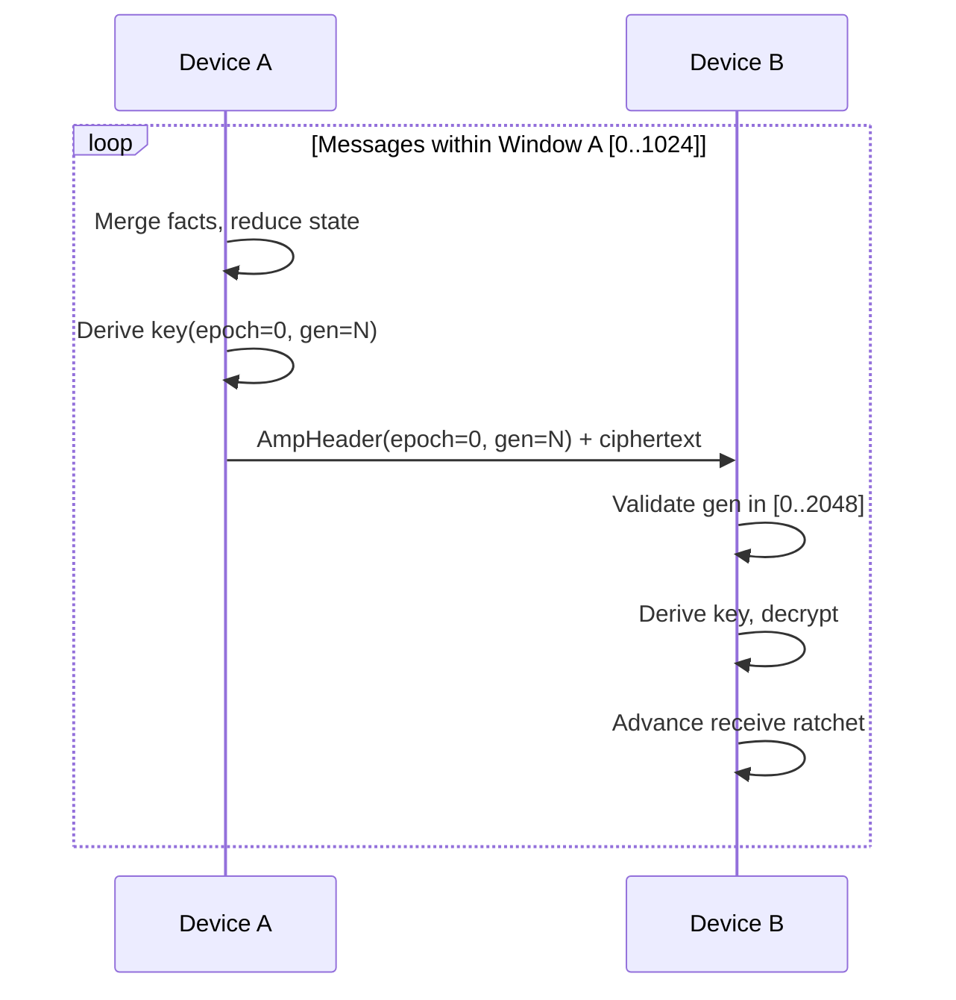
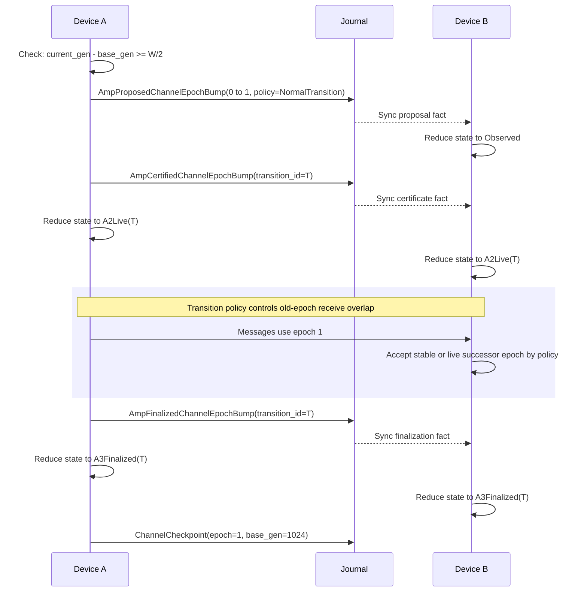
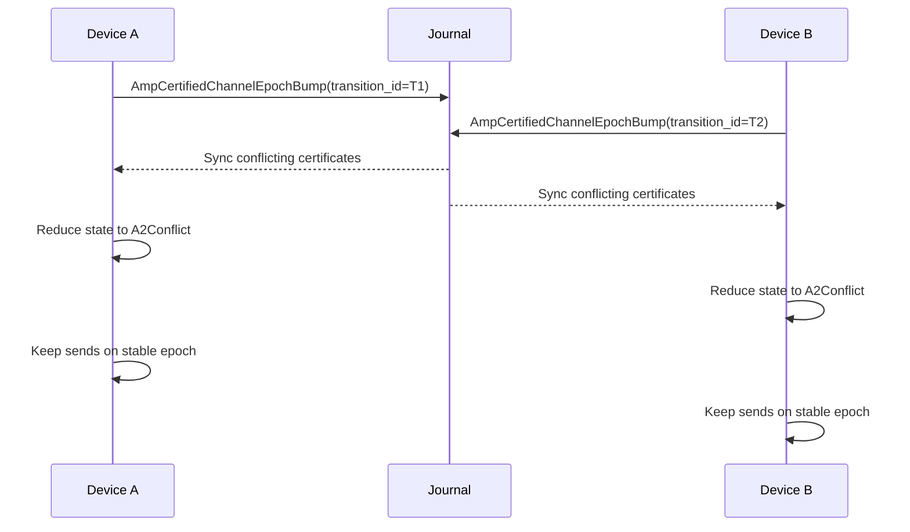
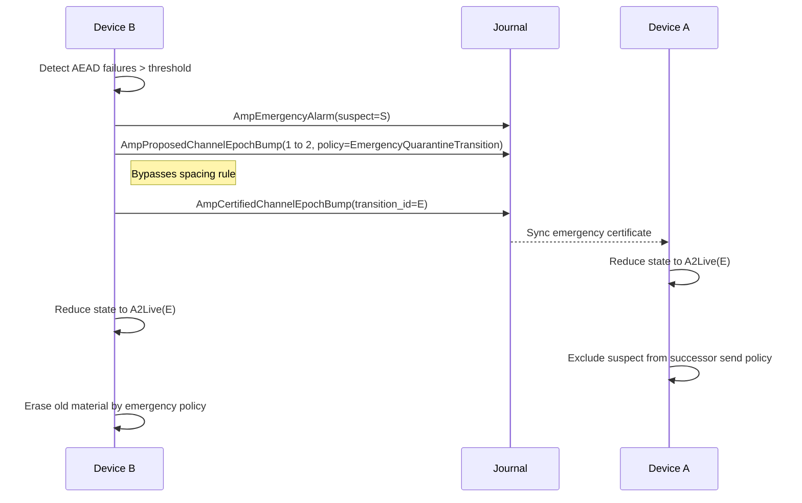

# Aura Messaging Protocol (AMP)

AMP is a secure asynchronous messaging protocol for Aura. It operates within relational contexts and channels. The protocol provides strong post-compromise security and bounded forward secrecy without head-of-line blocking.

## 1. Scope and Goals

AMP assumes shared state in joint semilattice journals is canonical. Secrets derive locally from shared state combined with authority keys. Ratchet operations remain deterministic and recoverable.

The protocol targets four properties. No head-of-line blocking occurs during message delivery. Strong post-compromise security restores confidentiality after key exposure. Bounded forward secrecy limits exposure within skip windows. Deterministic recovery enables key rederivation from journal state.

### 1.1 Design Requirements

AMP addresses constraints that existing messaging protocols cannot satisfy.

Deterministic recovery requires all ratchet state to be derivable from replicated facts. The journal is the only durable state. Secrets derive from reduced journal state combined with authority keys. No device may maintain ratchet state that cannot be recovered by other devices in the authority.

Multi-device authorities require support for concurrent message sends from different devices within the same authority. External parties cannot observe which device sent a message. All devices must converge to the same ratchet position after merging facts.

Selective consistency requires both eventual consistency for message sends and strong agreement for durable epoch transitions. The protocol cannot assume a central ordering service.

Authorization integration requires every message send to pass through a guard chain before reaching the network. Authorization failure must prevent key derivation. Budget charges must be atomic with the send.

### 1.2 Optimistic Operations Within Contexts

Channels are encrypted substreams within an existing relational context. The relational context, established via invitation ceremony, already provides the shared secret foundation. No new key agreement is needed. Channel creation is local: a device emits a `ChannelCheckpoint` fact into the existing context journal. Members must already share the context.

Channel creation and messaging are Category A operations. Both parties already derived the context root via the invitation ceremony. Channel facts sync via normal journal anti-entropy. Key derivation is deterministic: `KDF(ContextRoot, ChannelId, epoch)` produces the `ChannelBaseKey`. The cryptographic foundation was established when the relationship was created. See [Operation Categories](109_operation_categories.md) for the full classification.

### 1.2.1 Bootstrap Messaging (Dealer Key, Provisional)

For newly-created channels where the group key ceremony has not completed yet, AMP supports a bootstrap epoch using a trusted-dealer key (K2/A1). This enables participants to exchange encrypted messages immediately without waiting for consensus-finalized group keys.

The dealer generates a bootstrap key (`K_boot`) during channel creation and emits an `AmpChannelBootstrap` fact recording the bootstrap metadata but not the key itself. The dealer distributes `K_boot` per invitee over a Noise IKpsk2 channel established through rendezvous, authenticated by identity keys and a PSK derived from the relational context. Participants store `K_boot` locally in secure storage keyed by `(context, channel, bootstrap_id)`. Messages in epoch 0 use `K_boot` for encryption and decryption.

Messages are encrypted but confidentiality is provisional and dealer-trusted. `K_boot` never appears in the journal. Only the `bootstrap_id` hash is recorded. Late joiners do not receive `K_boot` and therefore cannot read bootstrap-epoch messages.

After the group key ceremony completes, the channel bumps to the next epoch. Messages in epoch 1 and later use the canonical group key derivation. Bootstrap messages remain decryptable only to members who stored `K_boot`.

### 1.3 AMP Lifecycle (A1/A2/A3)

AMP channel epoch transitions use the `A1 -> A2 -> A3` agreement ladder with an AMP-specific live-state rule. This rule applies only to AMP channel epoch and membership state inside a relational context. It does not modify authority-root membership, account commitment trees, device enrollment, guardian rotation, or recovery execution.

| Level | AMP meaning | Send authority |
|-------|-------------|----------------|
| A1 | A syntactically valid `AmpProposedChannelEpochBump` fact exists. | No successor-epoch sends. |
| A2 | Exactly one valid unsuppressed `AmpCertifiedChannelEpochBump` exists for the parent epoch. | Successor is live for AMP send and receive policy. |
| A3 | Consensus-backed finalization selected one transition as durable. | Successor is durable and live. |

The normal path finalizes the same `transition_id` that was previously exposed as A2 live. See [Operation Categories](109_operation_categories.md) for the agreement taxonomy and [Consensus](108_consensus.md) for consensus evidence binding.

## 2. Channel Lifecycle Surface

The `AmpChannelEffects` trait defines the canonical API for AMP channel lifecycle and messaging. This trait lives in `aura-core::effects::amp`.

```rust
#[async_trait]
pub trait AmpChannelEffects: Send + Sync {
    async fn create_channel(&self, params: ChannelCreateParams) -> Result<ChannelId, AmpChannelError>;
    async fn close_channel(&self, params: ChannelCloseParams) -> Result<(), AmpChannelError>;
    async fn join_channel(&self, params: ChannelJoinParams) -> Result<(), AmpChannelError>;
    async fn leave_channel(&self, params: ChannelLeaveParams) -> Result<(), AmpChannelError>;
    async fn send_message(&self, params: ChannelSendParams) -> Result<AmpCiphertext, AmpChannelError>;
}
```

The `create_channel` method writes an AMP checkpoint and policy for a context-scoped channel. The `close_channel` method records a terminal epoch bump and policy closure. The `join_channel` and `leave_channel` methods record membership facts. The `send_message` method derives current channel state and returns `AmpCiphertext` containing the header and encrypted payload.

### 2.1 Implementations

The runtime implementation uses `AmpChannelCoordinator` in `aura-protocol::amp::channel_lifecycle`. The simulator implementation uses `SimAmpChannels` in `aura-simulator::amp`. The testkit provides `MockEffects` implementing `AmpChannelEffects` for deterministic unit tests.

## 3. Terminology

### 3.1 Aura Terms

An authority is an account authority with a commitment tree and FROST keys. A relational context is shared state between authorities identified by `ContextId`. A journal is a CRDT OR-set of facts with monotone growth and deterministic reduction.

### 3.2 AMP Terms

A channel is a messaging substream scoped to a relational context. The channel epoch bounds post-compromise security and serves as the KDF base. The ratchet generation is a monotone position derived from reduced journal state. The skip window defines out-of-order tolerance with a default of 1024 generations.

A checkpoint is a journal fact anchoring ratchet windows. The alternating ratchet maintains two overlapping windows at boundaries. A transition proposal is an observed request to move from a parent epoch to a successor epoch.

An AMP transition identity binds `context_id`, `channel_id`, `parent_epoch`, `parent_commitment`, `successor_epoch`, `successor_commitment`, `membership_commitment`, and `transition_policy`. The typed digest over this tuple is the `transition_id`. All proposal, certificate, commit, abort, conflict, and supersession facts for the same transition must bind the same `transition_id`.

An A2 certificate is a witness-backed `AmpCertifiedChannelEpochBump` fact. An A3 finalization is an `AmpFinalizedChannelEpochBump` fact backed by consensus evidence. A live successor is the single successor exposed by deterministic reduction for current AMP traffic. A durable successor is the successor finalized by A3 evidence.

## 4. Commitment Tree Integration

The commitment tree defines authority structure and provides the foundation for key derivation. Each authority maintains an internal tree with branch nodes and leaf nodes. Leaf nodes represent devices holding threshold signing shares. Branch nodes represent subpolicies expressed as m-of-n thresholds.

```rust
pub struct TreeState {
    pub epoch: Epoch,
    pub root_commitment: TreeHash32,
    pub branches: BTreeMap<NodeIndex, BranchNode>,
    pub leaves: BTreeMap<LeafId, LeafNode>,
}
```

The `TreeState` represents the result of reducing all operations in the OpLog. The `epoch` field scopes all derived keys. The `root_commitment` field is a Merkle hash over the ordered tree structure. External parties see only the epoch and root commitment.

Tree operations modify device membership and policies. The `AddLeaf` operation inserts a new device. The `RemoveLeaf` operation removes an existing device. The `ChangePolicy` operation updates threshold requirements. The `RotateEpoch` operation increments the epoch and invalidates all derived keys.

Each operation appears in the journal as an attested operation signed by the required threshold of devices. The tree supports concurrent updates through deterministic conflict resolution.

Multiple Concurrent Ops → Group by Parent Commitment → Select Winner by Hash Order → Apply in Epoch Order → Single `TreeState`

The channel base key for a given `ChannelId` and epoch derives as `KDF(TreeRoot, ChannelId, epoch)`. All devices in the authority compute the same base key.

## 5. Fact Structures

AMP uses facts inserted into the relational context journal. All facts are monotone. Reduction determines canonical state.

### 5.1 Channel Checkpoint

```rust
pub struct ChannelCheckpoint {
    pub context: ContextId,
    pub channel: ChannelId,
    pub chan_epoch: u64,
    pub base_gen: u64,
    pub window: u32,
    pub ck_commitment: Hash32,
    pub skip_window_override: Option<u32>,
}
```

Reduction chooses one canonical checkpoint per context, channel, and epoch tuple. The valid ratchet generation set is the union of two windows. Window A spans from `base_gen` to `base_gen + window`. Window B spans from `base_gen + window + 1` to `base_gen + 2 * window`. Checkpoints enable deterministic recovery and serve as garbage collection anchors.

### 5.2 Channel Epoch Transition Facts

```rust
pub struct ProposedChannelEpochBump {
    pub context: ContextId,
    pub channel: ChannelId,
    pub parent_epoch: u64,
    pub new_epoch: u64,
    pub bump_id: Hash32,
    pub reason: ChannelBumpReason,
    pub parent_commitment: Hash32,
    pub successor_commitment: Hash32,
    pub membership_commitment: Hash32,
    pub transition_policy: AmpTransitionPolicy,
    pub transition_id: Hash32,
}
```

`AmpProposedChannelEpochBump` records A1 observed state. It is useful evidence for operators and reducers. It does not authorize successor-epoch sends by itself.

```rust
pub struct CertifiedChannelEpochBump {
    pub identity: AmpTransitionIdentity,
    pub transition_id: Hash32,
    pub witness_payload_digest: Hash32,
    pub committee_digest: Hash32,
    pub threshold: u16,
    pub fault_bound: u16,
    pub witness_signatures: Vec<AmpTransitionWitnessSignature>,
    pub equivocation_refs: BTreeSet<Hash32>,
    pub excluded_authorities: BTreeSet<AuthorityId>,
    pub readable_state_destroyed: bool,
}
```

`AmpCertifiedChannelEpochBump` records A2 soft-safe evidence. The certificate binds the exact parent prestate, successor epoch, successor membership, transition policy, witness committee, threshold, and witness signatures. If it is the only valid unsuppressed certificate for the parent epoch, reduction exposes the successor as live.

```rust
pub struct CommittedChannelEpochBump {
    pub context: ContextId,
    pub channel: ChannelId,
    pub parent_epoch: u64,
    pub new_epoch: u64,
    pub chosen_bump_id: Hash32,
    pub consensus_id: Hash32,
    pub transcript_ref: Option<Hash32>,
}
```

`AmpCommittedChannelEpochBump` is the legacy committed-bump shape. It remains part of the protocol fact set for compatibility and recovery fixtures. New transition-aware reducers use the canonical transition fields when they are present.

```rust
pub struct FinalizedChannelEpochBump {
    pub identity: AmpTransitionIdentity,
    pub transition_id: Hash32,
    pub consensus_id: Hash32,
    pub transcript_ref: Option<Hash32>,
    pub excluded_authorities: BTreeSet<AuthorityId>,
    pub readable_state_destroyed: bool,
}
```

`AmpFinalizedChannelEpochBump` records A3 durability for one transition. The `transcript_ref` optionally links the transition to a DKG transcript for key ceremony coordination.

### 5.3 Transition Evidence Facts

AMP transition reduction also consumes `AmpTransitionAbort`, `AmpTransitionConflict`, `AmpTransitionSupersession`, and `AmpEmergencyAlarm` facts. These facts suppress unsafe live exposure, record equivocation evidence, authorize replacement paths, and surface emergency suspicion without changing authority-root membership.

Abort and supersession facts include an `AmpTransitionSuppressionScope`. The `A2LiveOnly` scope suppresses live use but does not by itself reject later A3 evidence. The `A2AndA3` scope suppresses both live use and durable finalization for the affected transition.

### 5.4 Channel Bump Reason and Transition Policy

```rust
pub enum ChannelBumpReason {
    Routine,
    SuspiciousActivity,
    ConfirmedCompromise,
}
```

The `Routine` variant indicates cadence-based maintenance. The `SuspiciousActivity` variant indicates detected anomalies such as AEAD failures or ratchet conflicts. The `ConfirmedCompromise` variant requires immediate post-compromise security restoration. Both suspicious activity and confirmed compromise bypass routine spacing rules.

`AmpTransitionPolicy` refines these reasons into `NormalTransition`, `AdditiveTransition`, `SubtractiveTransition`, `EmergencyQuarantineTransition`, and `EmergencyCryptoshredTransition`. The policy determines old-epoch receive overlap, suspect exclusion, and cryptoshred behavior after an A2 live successor is exposed.

## 6. Derived Channel State

Reduction yields a `ChannelEpochState` struct containing the stable epoch, optional live transition, bootstrap metadata, and ratchet position.

```rust
pub struct ChannelEpochState {
    pub chan_epoch: u64,
    pub pending_bump: Option<PendingBump>,
    pub bootstrap: Option<ChannelBootstrap>,
    pub last_checkpoint_gen: u64,
    pub current_gen: u64,
    pub skip_window: u32,
    pub transition: Option<AmpTransitionReduction>,
}
```

`chan_epoch` is the stable reduced epoch. `pending_bump` is derived only when exactly one unsuppressed A2 certificate exposes a live successor. It is not derived from proposal order or local preference.

```rust
pub enum AmpTransitionReductionStatus {
    Observed,
    A2Live,
    A2Conflict,
    A3Finalized,
    A3Conflict,
    Aborted,
    Superseded,
}
```

The status describes the reducer result for one parent prestate. `Observed` has no live successor. `A2Live` exposes one live successor. `A3Finalized` exposes one durable successor. Conflict, abort, and supersession states suppress live use unless explicit replacement evidence selects a valid successor.

```rust
pub struct PendingBump {
    pub parent_epoch: u64,
    pub new_epoch: u64,
    pub bump_id: Hash32,
    pub reason: ChannelBumpReason,
    pub transition_id: Hash32,
    pub transition_policy: AmpTransitionPolicy,
}
```

`PendingBump` is the compatibility projection for the live A2 successor. The richer transition reduction remains available through `RelationalState::amp_transitions` and `ChannelEpochState::transition`. See [Journal](105_journal.md) for the reducer contract.

### 6.1 Skip Window Computation

The skip window derives from three sources in priority order. The checkpoint `skip_window_override` takes precedence. The channel policy fact applies if no override exists. The default of 1024 applies otherwise. The skip window size and bump cadence are governable via context policy facts.

### 6.2 Critical Invariants

Before sending, a device must merge latest facts, reduce channel state, and use updated epoch and generation values. No device may send under stale epochs. A proposal alone never authorizes successor-epoch sends.

For each parent epoch and parent commitment, reduction must expose at most one live successor. If two valid A2 certificates conflict and no fact resolves the conflict, the reducer exposes no live successor. Reducers must not choose a winner by arrival order, local preference, wall-clock time, network connectivity, or hash tie-breaking.

A3 finalization may make the same transition durable. If A3 evidence conflicts with already-live A2 evidence, the reducer must surface conflict state rather than silently selecting one path. Emergency transition facts remain channel-scoped and do not alter authority-root membership.

### 6.3 Ratchet Generation Semantics

The `ratchet_gen` value is not a local counter. It derives from reduced journal state. All devices converge to the same ratchet position after merging facts. Generation advances only when send or receive events occur consistent with checkpoint and dual-window rules. This guarantees deterministic recovery and prevents drift across devices.

## 7. Three-Level Key Architecture

AMP separates key evolution across three levels. Authority epochs provide identity-level post-compromise security. Channel epochs provide channel-level post-compromise security. Ratchet generations provide bounded forward secrecy within each epoch.

### 7.1 Authority Epochs

Authority epochs rotate the threshold key shares via DKG ceremony. Rotation invalidates all derived context keys. This is the strongest form of post-compromise security.

Authority epoch rotation occurs approximately daily or upon confirmed compromise. The rotation is independent of messaging activity. All relational contexts must re-derive their shared secrets after rotation.

### 7.2 Channel Epochs

Channel epochs provide post-compromise security at the channel level. Each epoch uses an independent base key derived from the tree root. Epoch rotation invalidates all keys from the previous epoch. The rotation is atomic. All devices observe the same epoch after merging journal facts.

The epoch transition lifecycle has observed, live, durable, conflict, abort, and supersession states. The stable epoch remains the durable baseline until reduction exposes a single live successor or a single durable successor. This single-live-successor invariant ensures linear AMP traffic for each parent epoch.

### 7.3 Ratchet Generations

Ratchet generations provide forward secrecy within each epoch. Message keys derive from the channel base key, generation, and direction.

```rust
pub struct AmpHeader {
    pub context: ContextId,
    pub channel: ChannelId,
    pub chan_epoch: u64,
    pub ratchet_gen: u64,
}
```

The `AmpHeader` contains the routing and ratchet information. The `chan_epoch` field identifies which base key to use. The `ratchet_gen` field identifies which generation key to derive. This header becomes the AEAD additional data.

Ratchet generation is not a local counter. It derives from reduced journal state. Devices compute the current generation by examining send and receive events in the reduced context state. All devices converge to the same ratchet position after merging facts.

## 8. Channel Epoch Bump Lifecycle

### 8.1 Reducer States

A channel has a stable epoch plus reducer-derived transition state. `Observed` means proposals exist but do not affect send authority. `A2Live` means one certified successor is live for AMP traffic. `A3Finalized` means one successor is durable.

`A2Conflict` and `A3Conflict` expose no live successor. `Aborted` suppresses the affected transition. `Superseded` records an authorized replacement path and derives live state from the replacement only when the replacement has valid evidence.

### 8.2 Spacing Rule for Routine Bumps

AMP enforces a spacing rule for routine bumps. Let `base_gen` be the anchor generation from the canonical checkpoint. Let `current_gen` be the current ratchet generation. Let W be the skip window.

A routine bump from epoch e to e+1 requires `current_gen - base_gen >= W / 2`. With default W of 1024, this threshold equals 512 generations. This spacing ensures structural transitions do not occur too frequently.

Emergency transitions bypass this rule. Examples include multiple AEAD failures, conflicting ratchet commitments, unexpected epoch values, and explicit compromise signals.

### 8.3 State Transitions

In stable state, if the spacing rule is satisfied and no transition is live, a device may insert `AmpProposedChannelEpochBump`. The channel remains on the stable epoch until an A2 certificate or A3 finalization becomes reducer-visible.

When the reducer observes exactly one valid unsuppressed `AmpCertifiedChannelEpochBump`, the successor becomes `A2Live`. New sends cut over to the successor epoch. Receives follow the transition policy for stable-plus-successor overlap.

When the reducer observes valid `AmpFinalizedChannelEpochBump` evidence for one successor, the successor becomes durable. The device may emit a new checkpoint for the successor epoch. Conflict, abort, and supersession evidence can suppress live use or durable use according to its scope.

### 8.4 Complete Lifecycle Sequence

The lifecycle has four common phases: channel creation, normal messaging, routine transition, and emergency transition.

Channel creation establishes the initial checkpoint at epoch 0.


```mermaid
sequenceDiagram
    participant A as Device A
    participant J as Journal
    participant B as Device B
    A->>J: ChannelCheckpoint(epoch=0, base_gen=0, W=1024)
    J-->>B: Sync checkpoint fact
    B->>B: Reduce state to epoch 0, gen 0
```

This sequence records the initial checkpoint. The checkpoint anchors recovery and the first dual ratchet window.


```mermaid
sequenceDiagram
    participant A as Device A
    participant B as Device B
    loop Messages within Window A [0..1024]
        A->>A: Merge facts, reduce state
        A->>A: Derive key(epoch=0, gen=N)
        A->>B: AmpHeader(epoch=0, gen=N) + ciphertext
        B->>B: Validate gen in [0..2048]
        B->>B: Derive key, decrypt
        B->>B: Advance receive ratchet
    end
```

Normal messaging advances the ratchet generation within dual windows.


```mermaid
sequenceDiagram
    participant A as Device A
    participant J as Journal
    participant B as Device B
    A->>A: Check: current_gen - base_gen >= W/2
    A->>J: AmpProposedChannelEpochBump(0 to 1, policy=NormalTransition)
    J-->>B: Sync proposal fact
    B->>B: Reduce state to Observed
    A->>J: AmpCertifiedChannelEpochBump(transition_id=T)
    J-->>B: Sync certificate fact
    A->>A: Reduce state to A2Live(T)
    B->>B: Reduce state to A2Live(T)
    rect rgb(240, 240, 255)
        Note over A,B: Transition policy controls old-epoch receive overlap
        A->>B: Messages use epoch 1
        B->>B: Accept stable or live successor epoch by policy
    end
    A->>J: AmpFinalizedChannelEpochBump(transition_id=T)
    J-->>B: Sync finalization fact
    A->>A: Reduce state to A3Finalized(T)
    B->>B: Reduce state to A3Finalized(T)
    A->>J: ChannelCheckpoint(epoch=1, base_gen=1024)
```

This sequence shows the key distinction between live and durable state. The A2 certificate can drive traffic before A3 finalization. A3 finalization later commits the same transition as durable.

Conflicting certificates suppress live use until facts prove a single winner.


```mermaid
sequenceDiagram
    participant A as Device A
    participant J as Journal
    participant B as Device B
    A->>J: AmpCertifiedChannelEpochBump(transition_id=T1)
    B->>J: AmpCertifiedChannelEpochBump(transition_id=T2)
    J-->>A: Sync conflicting certificates
    J-->>B: Sync conflicting certificates
    A->>A: Reduce state to A2Conflict
    B->>B: Reduce state to A2Conflict
    A->>A: Keep sends on stable epoch
    B->>B: Keep sends on stable epoch
```

This sequence prevents silent fork selection. The reducer must not choose between conflicting valid certificates without explicit abort, conflict, supersession, or finalization evidence.

Emergency transitions bypass spacing for post-compromise containment.


```mermaid
sequenceDiagram
    participant B as Device B
    participant J as Journal
    participant A as Device A
    B->>B: Detect AEAD failures > threshold
    B->>J: AmpEmergencyAlarm(suspect=S)
    B->>J: AmpProposedChannelEpochBump(1 to 2, policy=EmergencyQuarantineTransition)
    Note right of B: Bypasses spacing rule
    B->>J: AmpCertifiedChannelEpochBump(transition_id=E)
    J-->>A: Sync emergency certificate
    A->>A: Reduce state to A2Live(E)
    B->>B: Reduce state to A2Live(E)
    A->>A: Exclude suspect from successor send policy
    B->>B: Erase old material by emergency policy
```

Emergency quarantine excludes the suspect from the successor epoch once A2 evidence is live. Emergency cryptoshred also destroys ordinary pre-emergency readable state at the A2 live boundary. A3 finalization confirms durability but does not delay the emergency cutover.

## 9. Ratchet Windows

AMP uses an always-dual window model. Every checkpoint defines two consecutive skip windows providing a continuous valid range of 2W generations.

### 9.1 Window Layout

Given base generation G and skip window W, two windows are defined. Window A spans G to G+W. Window B spans G+W+1 to G+2W. The valid generation set is the union of both windows.

```rust
// Window layout for checkpoint at generation G with window W
let window_a = G..(G + W);
let window_b = (G + W + 1)..(G + 2*W);
let valid_gen_set = window_a.union(window_b);
```

Window A `[G .. G+W]` → Window B `[G+W+1 .. G+2W]`

This design eliminates boundary issues. No mode switches are required. The implementation remains simple with robust asynchronous tolerance.

### 9.2 Window Shifting

When a new checkpoint is issued, the new base generation is chosen far enough ahead per the spacing rule. The dual-window layout guarantees overlap with prior windows. Garbage collection can safely prune older checkpoints when they no longer affect valid generation ranges.

### 9.3 Asynchronous Delivery

The dual window design solves the asynchronous delivery problem. Messages may arrive out of order by up to W generations. During additive and ordinary non-removal transitions, messages may be accepted under either the stable epoch or the single reducer-exposed live successor epoch.

Message derivation uses a KDF chain similar to Signal's construction but with key differences. AMP derives all ratchet state deterministically from replicated journal facts rather than device-local databases. This enables complete recovery across multiple devices without coordination.

Subtractive, revocation, quarantine, and cryptoshred transitions use stricter old-epoch handling. Removed or suspected authorities must not retain indefinite send authority while the network is slow. See [Transport and Information Flow](111_transport_and_information_flow.md) for the data-plane acceptance contract.

## 10. Sending Messages

### 10.1 Message Header

```rust
pub struct AmpHeader {
    pub context: ContextId,
    pub channel: ChannelId,
    pub chan_epoch: u64,
    pub ratchet_gen: u64,
}
```

The header contains the context identifier, channel identifier, current epoch, and current generation. These fields form the additional authenticated data for AEAD encryption.

### 10.2 Reduce-Before-Send Rule

Before sending a message, a device must merge the latest journal facts. It must reduce the channel state to get the stable epoch, live successor, and generation. It must verify that the generation is within the valid window. Only then can it derive the message key and encrypt.

### 10.3 Send Procedure

Before sending, a device merges new facts and reduces channel state. It asserts that the current generation is within the valid generation set. It chooses the stable epoch unless reduction exposes exactly one `A2Live` or `A3Finalized` successor.

If the spacing rule is satisfied and no transition is live, the device may propose a new transition. The proposal is not send authority. The device derives the message key using a KDF with the channel base key, generation, and direction.

The device creates an `AmpHeader`, encrypts the payload with AEAD using the message key and header as additional data, and performs the guard chain. Guard evaluation runs over a prepared `GuardSnapshot` and emits `EffectCommand` items for async interpretation. The device then advances the local ratchet generation.

Emergency policies add sender membership checks at the send boundary. A suspect excluded by a live emergency successor cannot keep sending under the old epoch through local ratchet state.

## 11. Receiving Messages

When receiving, a device merges new facts and reduces channel state. It checks that the message epoch is the stable epoch or the single reducer-exposed successor epoch. It checks that the sender belongs to the membership commitment for that exact epoch. It checks that the generation is within the valid generation set.

The device rederives the message key using the same KDF parameters. It decrypts the payload using AEAD with the message key and header. It advances the local receive ratchet.

Messages outside valid windows or with unsupported epochs are rejected. Subtractive and cryptoshred transitions reject old-epoch traffic more aggressively than additive transitions. Quarantine transitions allow only minimal old-epoch grace when the transition policy explicitly permits it.

## 12. Guard Chain Integration

AMP integrates with Aura's guard chain for authorization and flow control. Every message send passes through `CapabilityGuard`, `FlowBudgetGuard`, `JournalCouplingGuard`, and `LeakageTrackingGuard` before reaching the transport.

Guard evaluation runs over a prepared `GuardSnapshot` and produces `EffectCommand` items. An async interpreter executes those commands only after the entire guard chain succeeds. Unauthorized or over-budget sends never touch the network.

```rust
let outcome = guard_chain.evaluate(&snapshot, &request);

if !outcome.is_authorized() {
    return Err(AuraError::authorization_failed("Guard denied"));
}

for cmd in outcome.effects {
    interpreter.execute(cmd).await?;
}
```

The snapshot captures the current capability frontier and flow budget state. Each guard emits `EffectCommand` items instead of performing I/O. The interpreter executes the resulting commands in production or simulation. Any failure returns locally without observable effects.

### 12.1 Flow Budgets

Flow budgets are replicated as spent counters in the journal. The `spent` counter for a context and peer pair is a monotone fact. The `limit` computes at runtime from Biscuit capabilities and sovereign policy. Before sending, the flow budget guard checks that `spent + cost <= limit`.

### 12.2 Receipts

Receipts provide accountability for multi-hop forwarding. Each relay hop produces a receipt containing the context, source, destination, epoch, cost, and signature. The receipt proves that the relay charged its budget before forwarding.

## 13. Recovery and Garbage Collection

### 13.1 Recovery

To recover, a device loads the relational context journal. It reduces to the latest stable epoch, any reducer-exposed live successor, the latest checkpoint, and the skip window. It rederives the channel base key from context root key, channel identifier, and selected epoch. It rederives ratchet state from the checkpoint and window generations.

Load journal facts -> reduce to `TreeState` -> reduce to `ChannelEpochState` -> compute checkpoint -> derive base key -> ready to message

The recovery process requires no coordination. The device does not need to contact other participants. It does not need to request missing state. It only needs access to the journal facts. Once reduction completes, the device has the same view as all other participants.

### 13.2 Garbage Collection

AMP garbage collection maintains protocol safety while reclaiming storage. GC operates on checkpoints, transition proposals, certificates, finalizations, aborts, conflicts, supersessions, and emergency alarms.

A checkpoint at generation G with window W can be pruned when a newer checkpoint exists at G' where G' exceeds G+2W. The newer checkpoint coverage must not overlap with the old checkpoint coverage. All messages within the old window must be processed or beyond the recovery horizon.

A transition proposal can be pruned when finalization, abort, or supersession evidence makes it stale. A2 certificates and A3 finalizations are retained as evidence until full snapshot compaction. Conflict evidence must remain available while it can affect live successor exposure.

### 13.3 Pruning Boundary

The safe pruning boundary for checkpoints is computed as the maximum checkpoint generation minus 2W minus a safety margin. The recommended safety margin is W/2 or 512 generations with default settings.

GC triggers when journal size exceeds threshold, checkpoint count exceeds maximum, manual compaction is requested, or snapshot creation initiates. See [Distributed Maintenance Architecture](116_maintenance.md) for integration with the Aura snapshot system.

## 14. Security Properties

### 14.1 Forward Secrecy

Forward secrecy is bounded by the skip window size of 1024 within each epoch. Within a single epoch, an attacker who compromises a device learns at most W future message keys. Older epochs use independent base keys. Compromise of epoch e reveals nothing about epoch e-1.

### 14.2 Post-Compromise Security

Post-compromise security operates at two levels. Channel epoch bumps heal compromise of channel secret state. Context epoch bumps provide stronger PCS by healing compromise of context state. Channel bumps are frequent and cheap. Context bumps are rare and expensive.

The dual window mechanism provides continuous post-compromise healing. When an emergency transition becomes A2 live, the new epoch uses a fresh base key. Messages sent under the new epoch cannot be decrypted with the old base key. Emergency cryptoshred destroys ordinary pre-emergency readable state according to local retention policy.

Emergency transitions protect future traffic and reduce future readable remnants on honest devices. They do not retroactively protect data already seen, decrypted, or exfiltrated before cutover.

### 14.3 No Head-of-Line Blocking

The protocol accepts out-of-order messages up to W generations. Dual windows absorb boundary drift.

### 14.4 No Ratchet Forks

Deterministic reduction exposes at most one live successor for each parent epoch. A3 consensus finalizes durability. Conflicting valid A2 certificates suppress live exposure rather than creating two ratchet branches.

### 14.5 Deterministic Recovery

Checkpoints anchor the ratchet. Facts represent all shared state. Keys are always rederived deterministically. This property enables true multi-device messaging. All devices in an authority see the same messages. All devices can send and receive without coordinating who is currently active. The authority appears as a single messaging entity to external parties.

## 15. Failure Modes

AMP drops messages only when they fall outside the cryptographically safe envelope. These failures are intentional safeguards.

### 15.1 Generation Out of Window

A message is dropped if its generation lies outside the valid generation set. Causes include stale sender state, aged messages post-GC, or invalid generations from attackers.

### 15.2 Epoch Mismatch

Messages are rejected when the header epoch is inconsistent with reduced epoch state. This includes epochs that are too old, non-linear epochs, or replays from retired epochs.

### 15.3 AEAD Failure

If AEAD decryption fails, messages are dropped. Repeated failures contribute to suspicious-event classification and may trigger `AmpEmergencyAlarm` and emergency transition proposal facts.

### 15.4 Beyond Recovery Horizon

Messages older than the current checkpoint window cannot be decrypted because older checkpoints have been garbage collected. This is an intentional forward secrecy tradeoff.

### 15.5 Policy-Enforced Invalidity

After context epoch bumps or high-severity PCS events, messages from previous context epochs are intentionally dropped. After subtractive, quarantine, or cryptoshred transitions, messages from old channel epochs may also be rejected by transition policy.

## 16. Message Delivery Tracking

AMP integrates with Aura's consistency metadata system for delivery tracking. The transport layer supports opt-in acknowledgment tracking through `FactOptions`. Peers send `FactAck` responses upon successful processing. Acks are stored in the journal's ack table and garbage-collected when the delivery policy determines they are no longer needed.

Read receipts are distinct from delivery acknowledgments. Delivery indicates the message was received and decrypted. Read indicates the user viewed the message. Read receipts are opt-in per contact and emit a `ChatFact::MessageRead` fact.

Delivery acknowledgments leak timing metadata. Applications should batch acknowledgments to reduce timing precision. Read receipts should default to disabled. High-sensitivity contexts can disable acks entirely. See [Operation Categories](109_operation_categories.md) for consistency type definitions and [User Interface](117_user_interface.md) for status indicators.

## See Also

- [Transport and Information Flow](111_transport_and_information_flow.md) for guard chain enforcement and AMP data-plane acceptance
- [Consensus](108_consensus.md) for epoch transition finalization
- [Journal](105_journal.md) for fact semantics and AMP transition reduction
- [Distributed Maintenance Architecture](116_maintenance.md) for snapshot and GC integration
- [Authority and Identity](102_authority_and_identity.md) for tree operation details
- [User Interface](117_user_interface.md) for UI delivery status display
