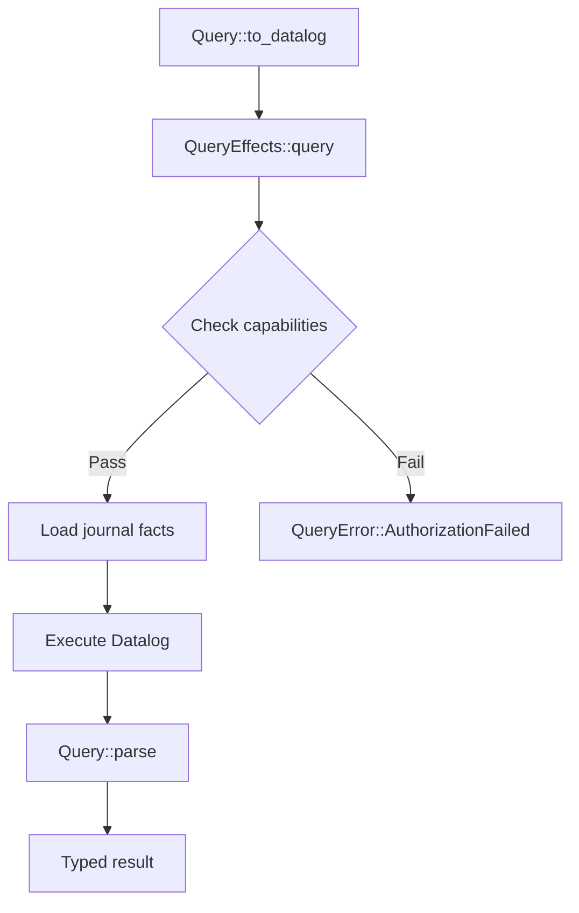
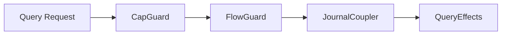

# Database Architecture

This document specifies the architecture for Aura's query system. The journal is the database. Datalog is the query language. Biscuit provides authorization.

## 1. Core Principles

### 1.1 Database-as-Journal Equivalence

Aura's fact-based journal functions as the database. There is no separate database layer. The equivalence maps traditional database concepts to Aura components.

Aura treats database state as a composite of the fact journal and the capability frontier. Query execution always combines the reduced fact state with the current capability lattice (the `JournalState` composite) to enforce authorization and isolate contexts.

| Traditional Database | Aura Component |
|---------------------|----------------|
| Table | Journal reduction view |
| Row | Fact implementing `JoinSemilattice` |
| Transaction | Atomic fact append |
| Index | Merkle trees and Bloom filters |
| Query | Datalog program evaluation |
| Replication | `CrdtCoordinator` with delta sync |

### 1.2 Authority-First Data Model

Aura's database is partitioned by cryptographic authorities. An `AuthorityId` owns facts that implement `JoinSemilattice`. State is derived from those facts.

Data is naturally sharded by authority. Cross-authority operations require explicit choreography. Privacy is the default because no cross-authority visibility exists without permission.

## 2. Query System

### 2.1 Query Trait

The `Query` trait defines typed queries that compile to Datalog:

```rust
pub trait Query: Send + Sync + Clone + 'static {
    /// The result type of this query
    type Result: Clone + Send + Sync + Default + 'static;

    /// Compile this query to a Datalog program
    fn to_datalog(&self) -> DatalogProgram;

    /// Get required Biscuit capabilities for authorization
    fn required_capabilities(&self) -> Vec<QueryCapability>;

    /// Get fact predicates for invalidation tracking
    fn dependencies(&self) -> Vec<FactPredicate>;

    /// Parse Datalog bindings to typed result
    fn parse(bindings: DatalogBindings) -> Result<Self::Result, QueryParseError>;

    /// Unique identifier for caching and subscriptions
    fn query_id(&self) -> String;
}
```

This design separates query definition from execution, enabling:
- Portable query definitions across runtimes
- Authorization checking before execution
- Reactive subscriptions via dependency tracking

### 2.2 Datalog Types

Queries compile to `DatalogProgram`, the intermediate representation:

```rust
pub struct DatalogProgram {
    pub rules: Vec<DatalogRule>,
    pub facts: Vec<DatalogFact>,
    pub goal: Option<String>,
}

pub struct DatalogRule {
    pub head: DatalogFact,
    pub body: Vec<DatalogFact>,
}

pub struct DatalogFact {
    pub predicate: String,
    pub args: Vec<DatalogValue>,
}

pub enum DatalogValue {
    String(String),
    Integer(i64),
    Boolean(bool),
    Variable(String),
    Symbol(String),
    Null,
}
```

Programs convert to Datalog source via `to_datalog_source()`:

```rust
let program = DatalogProgram::new(vec![
    DatalogRule::new(DatalogFact::new("active_user", vec![DatalogValue::var("name")]))
        .when(DatalogFact::new("user", vec![DatalogValue::var("name")]))
        .when(DatalogFact::new("online", vec![DatalogValue::var("name")]))
])
.with_goal("active_user($name)");

let source = program.to_datalog_source();
// Output:
// active_user($name) :- user($name), online($name).
// ?- active_user($name).
```

### 2.3 Fact Predicates

`FactPredicate` patterns determine query invalidation:

```rust
pub struct FactPredicate {
    pub name: String,
    pub arg_patterns: Vec<Option<String>>,
}

impl FactPredicate {
    /// Match any fact with the given name
    pub fn named(name: impl Into<String>) -> Self;

    /// Match facts with specific argument constraints
    pub fn with_args(name: impl Into<String>, args: Vec<(&str, &str)>) -> Self;

    /// Check if this predicate matches another
    pub fn matches(&self, other: &FactPredicate) -> bool;
}
```

When facts change, subscriptions matching the predicate re-evaluate.

### 2.4 Query Capabilities

Authorization integrates with Biscuit via `QueryCapability`:

```rust
pub struct QueryCapability {
    pub resource: String,
    pub action: String,
    pub constraints: Vec<(String, String)>,
}

impl QueryCapability {
    pub fn read(resource: impl Into<String>) -> Self;
    pub fn list(resource: impl Into<String>) -> Self;
    pub fn with_constraint(self, key: impl Into<String>, value: impl Into<String>) -> Self;
    pub fn to_biscuit_check(&self) -> String;
}
```

Capabilities convert to Biscuit checks:

```rust
let cap = QueryCapability::read("channels").with_constraint("owner", "alice");
assert_eq!(
    cap.to_biscuit_check(),
    "check if right(\"channels\", \"read\"), owner == \"alice\""
);
```

## 3. Query Effects

### 3.1 QueryEffects Trait

`QueryEffects` executes queries against the journal:

```rust
#[async_trait]
pub trait QueryEffects: Send + Sync {
    /// Execute a one-shot typed query
    async fn query<Q: Query>(&self, query: &Q) -> Result<Q::Result, QueryError>;

    /// Execute a raw Datalog program
    async fn query_raw(&self, program: &DatalogProgram) -> Result<DatalogBindings, QueryError>;

    /// Subscribe to query updates when facts change
    fn subscribe<Q: Query>(&self, query: &Q) -> QuerySubscription<Q::Result>;

    /// Pre-check authorization
    async fn check_capabilities(&self, capabilities: &[QueryCapability]) -> Result<(), QueryError>;

    /// Trigger re-evaluation for matching subscriptions
    async fn invalidate(&self, predicate: &FactPredicate);
}
```

### 3.2 Query Execution Flow



### 3.3 Reactive Subscriptions

`QuerySubscription` wraps `SignalStream` for live updates:

```rust
pub struct QuerySubscription<T: Clone + Send + 'static> {
    stream: SignalStream<T>,
    query_id: String,
}

impl<T: Clone + Send + 'static> QuerySubscription<T> {
    pub fn query_id(&self) -> &str;
    pub fn try_recv(&mut self) -> Option<T>;
    pub async fn recv(&mut self) -> Result<T, QueryError>;
}
```

Usage pattern:

```rust
let mut subscription = effects.subscribe(&ChannelsQuery::default());
while let Ok(channels) = subscription.recv().await {
    println!("Channels updated: {} total", channels.len());
}
```

### 3.4 Query Isolation

`QueryIsolation` specifies consistency requirements for queries:

```rust
pub enum QueryIsolation {
    /// See all facts including uncommitted (CRDT state) - fastest
    ReadUncommitted,
    /// Only see facts with consensus commit
    ReadCommitted { wait_for: Vec<ConsensusId> },
    /// Snapshot at specific prestate (time-travel query)
    Snapshot { prestate_hash: Hash32 },
    /// Wait for all pending consensus in scope
    ReadLatest { scope: ResourceScope },
}
```

Usage:

```rust
// Fast query - may see uncommitted facts
let result = effects.query(&ChannelsQuery::default()).await?;

// Wait for specific consensus before querying
let result = effects.query_with_isolation(
    &ChannelsQuery::default(),
    QueryIsolation::ReadCommitted { wait_for: vec![consensus_id] },
).await?;
```

### 3.5 Query Statistics

`QueryStats` provides execution metrics:

```rust
pub struct QueryStats {
    pub execution_time: Duration,
    pub facts_scanned: u32,
    pub facts_matched: u32,
    pub cache_hit: bool,
    pub isolation_used: QueryIsolation,
    pub consensus_wait_time: Option<Duration>,
}
```

Usage:

```rust
let (channels, stats) = effects.query_with_stats(&ChannelsQuery::default()).await?;
println!("Query took {:?}, scanned {} facts", stats.execution_time, stats.facts_scanned);
```

### 3.6 Query Errors

```rust
pub enum QueryError {
    AuthorizationFailed { reason: String },
    MissingCapability { capability: String },
    ExecutionError { reason: String },
    ParseError(QueryParseError),
    SubscriptionNotFound { query_id: String },
    JournalError { reason: String },
    HandlerUnavailable,
    Internal { reason: String },
    ConsensusTimeout { consensus_id: ConsensusId },
    SnapshotNotAvailable { prestate_hash: Hash32 },
    IsolationNotSupported { reason: String },
}
```

## 4. Concrete Query Examples

### 4.1 ChannelsQuery

```rust
#[derive(Clone, Default)]
pub struct ChannelsQuery {
    pub channel_type: Option<String>,
}

impl Query for ChannelsQuery {
    type Result = Vec<Channel>;

    fn to_datalog(&self) -> DatalogProgram {
        DatalogProgram::new(vec![
            DatalogRule::new(DatalogFact::new(
                "channel",
                vec![
                    DatalogValue::var("id"),
                    DatalogValue::var("name"),
                    DatalogValue::var("type"),
                ],
            ))
            .when(DatalogFact::new(
                "channel_fact",
                vec![
                    DatalogValue::var("id"),
                    DatalogValue::var("name"),
                    DatalogValue::var("type"),
                ],
            )),
        ])
        .with_goal("channel($id, $name, $type)")
    }

    fn required_capabilities(&self) -> Vec<QueryCapability> {
        vec![QueryCapability::list("channels")]
    }

    fn dependencies(&self) -> Vec<FactPredicate> {
        vec![FactPredicate::named("channel_fact")]
    }

    fn parse(bindings: DatalogBindings) -> Result<Self::Result, QueryParseError> {
        bindings.rows.iter().map(|row| {
            Ok(Channel {
                id: row.get_string("id")
                    .ok_or(QueryParseError::MissingField { field: "id".into() })?
                    .to_string(),
                name: row.get_string("name")
                    .ok_or(QueryParseError::MissingField { field: "name".into() })?
                    .to_string(),
                channel_type: row.get_string("type").map(String::from),
            })
        }).collect()
    }
}
```

### 4.2 MessagesQuery

```rust
#[derive(Clone)]
pub struct MessagesQuery {
    pub channel_id: String,
    pub limit: Option<usize>,
}

impl Query for MessagesQuery {
    type Result = Vec<Message>;

    fn to_datalog(&self) -> DatalogProgram {
        DatalogProgram::new(vec![
            DatalogRule::new(DatalogFact::new(
                "message",
                vec![
                    DatalogValue::var("id"),
                    DatalogValue::var("content"),
                    DatalogValue::var("sender"),
                    DatalogValue::var("timestamp"),
                ],
            ))
            .when(DatalogFact::new(
                "message_fact",
                vec![
                    DatalogValue::String(self.channel_id.clone()),
                    DatalogValue::var("id"),
                    DatalogValue::var("content"),
                    DatalogValue::var("sender"),
                    DatalogValue::var("timestamp"),
                ],
            )),
        ])
        .with_goal("message($id, $content, $sender, $timestamp)")
    }

    fn required_capabilities(&self) -> Vec<QueryCapability> {
        vec![QueryCapability::read("messages")
            .with_constraint("channel", &self.channel_id)]
    }

    fn dependencies(&self) -> Vec<FactPredicate> {
        vec![FactPredicate::with_args(
            "message_fact",
            vec![("channel_id", &self.channel_id)],
        )]
    }

    fn parse(bindings: DatalogBindings) -> Result<Self::Result, QueryParseError> {
        // Parse message rows...
    }
}
```

## 5. Indexing Layer

### 5.1 IndexedJournalEffects

The `IndexedJournalEffects` trait extends `JournalEffects` with efficient lookups:

```rust
pub trait IndexedJournalEffects: JournalEffects {
    async fn facts_by_predicate(&self, predicate: &str) -> AuraResult<Vec<Fact>>;
    async fn facts_by_authority(&self, authority: &AuthorityId) -> AuraResult<Vec<Fact>>;
    async fn facts_in_range(&self, start: TimeStamp, end: TimeStamp) -> AuraResult<Vec<Fact>>;
    fn might_contain(&self, predicate: &str, value: &Value) -> bool;
}
```

The `might_contain` method uses Bloom filters for fast negative answers.

### 5.2 Index Structure

```rust
pub struct AuthorityIndex {
    merkle_tree: MerkleTree<FactHash>,
    predicate_filters: BTreeMap<String, BloomFilter>,
    by_predicate: BTreeMap<String, Vec<FactId>>,
    by_authority: BTreeMap<AuthorityId, Vec<FactId>>,
    by_time: BTreeMap<TimeStamp, Vec<FactId>>,
}
```

- **Merkle trees**: Integrity verification
- **Bloom filters**: Fast membership tests (<1% false positive rate)
- **B-trees**: Ordered lookups (O(log n))

Indexes update on fact commit. Performance target: <10ms for 10k facts.

## 6. Biscuit Integration

### 6.1 AuraQuery Wrapper

`AuraQuery` wraps Biscuit's authorizer for query execution:

```rust
pub struct AuraQuery {
    authorizer: biscuit_auth::Authorizer,
}

impl AuraQuery {
    pub fn add_journal_facts(&mut self, facts: &[Fact]) -> Result<()> {
        for fact in facts {
            self.authorizer.add_fact(fact.to_biscuit_fact()?)?;
        }
        Ok(())
    }

    pub fn query(&self, rule: &str) -> Result<Vec<biscuit_auth::Fact>> {
        self.authorizer.query(rule)
    }
}
```

### 6.2 Guard Chain Integration

Database operations flow through the guard chain:



1. **CapGuard**: Evaluates Biscuit token authorization
2. **FlowGuard**: Charges budget for query cost
3. **JournalCoupler**: Logs query execution
4. **QueryEffects**: Executes the query

Each guard must succeed before the next executes.

## 7. Transaction Model

### 7.1 Coordination Matrix

Database operations use two orthogonal dimensions:

| | Single Authority | Cross-Authority |
|---|---|---|
| **Monotone** | Direct fact insertion (0 RTT) | CRDT merge via anti-entropy (0 RTT + sync) |
| **Consensus** | Single-authority consensus (1-2 RTT) | Multi-authority consensus (2-3 RTT) |

### 7.2 Examples

- **Monotone + Single**: Append message to own channel (`journal.insert_fact()`)
- **Monotone + Cross-Authority**: Guardian adds trust fact (`journal.insert_relational_fact()`)
- **Consensus + Single**: Remove device from account (`consensus_single_shot()`)
- **Consensus + Cross-Authority**: Recovery grant with guardian approval (`federated_consensus()`)

Aura Consensus is not linearizable by default. Each consensus instance independently agrees on a single operation and prestate. To sequence operations, use session types (see [MPST and Choreography](107_mpst_and_choreography.md)).

Agreement modes are orthogonal to the coordination matrix: A1 (provisional) and A2 (soft-safe) may provide immediate usability, but any durable shared database state must be A3 (consensus-finalized) with prestate binding. Soft-safe windows should be bounded with convergence certificates and explicit reversion facts.

BFT-DKG integration: When key material is required (K3), the database must bind
operations to a consensus‑finalized `DkgTranscriptCommit`. This ensures the
transaction prestate and the cryptographic prestate are aligned.

### 7.3 Mutation Receipts

`MutationReceipt` indicates how a mutation was coordinated:

```rust
pub enum MutationReceipt {
    /// Monotone operation completed immediately via CRDT merge
    Immediate {
        fact_ids: Vec<FactId>,
        timestamp: PhysicalTime,
    },
    /// Non-monotone operation submitted to consensus
    Consensus {
        consensus_id: ConsensusId,
        prestate_hash: Hash32,
        submit_latency: Duration,
    },
}
```

Usage pattern:

```rust
let receipt = effects.mutate(operation).await?;
match receipt {
    MutationReceipt::Immediate { fact_ids, .. } => {
        // Facts are immediately visible
        println!("{} facts created", fact_ids.len());
    }
    MutationReceipt::Consensus { consensus_id, .. } => {
        // Wait for consensus completion before querying
        let result = effects.query_with_isolation(
            &MyQuery::default(),
            QueryIsolation::read_committed(consensus_id),
        ).await?;
    }
}
```

## 8. Temporal Database Model

Aura uses a Datomic-inspired immutable database model where all changes are represented as append-only facts with temporal metadata.

### 8.1 Core Concepts

Facts are never deleted. They are either:
- **Asserted**: Added to a scope
- **Retracted**: Marked as no longer valid (but remain queryable in history)
- **Epoch-bumped**: Bulk invalidation of facts in a scope
- **Checkpointed**: Snapshotted for temporal queries

Facts are organized in hierarchical scopes:

```rust
// Scope path examples
"authority:abc123"                    // Authority-level
"authority:abc123/chat"               // Named sub-scope
"authority:abc123/chat/channel:xyz"   // Typed sub-scope
```

Facts progress through finality levels:

```rust
pub enum Finality {
    Local,                           // Written locally only
    Replicated { ack_count: u16 },   // Acknowledged by N peers
    Checkpointed,                    // In a durable checkpoint
    Consensus { proof: ConsensusId }, // Confirmed via consensus
    Anchored { anchor: AnchorProof }, // External chain anchor
}
```

### 8.2 Fact Operations

```rust
pub enum FactOp {
    /// Assert a new fact
    Assert { content: FactContent, scope: Option<ScopeId> },

    /// Mark a specific fact as retracted
    Retract { target: FactId, reason: RetractReason },

    /// Invalidate all facts in scope before new epoch
    EpochBump { scope: ScopeId, new_epoch: Epoch, checkpoint: Option<Hash32> },

    /// Create a queryable snapshot
    Checkpoint { scope: ScopeId, state_hash: Hash32, supersedes: Vec<FactId> },
}
```

Monotonic vs non-monotonic:
- `Assert` and `Checkpoint` are monotonic (no coordination required)
- `Retract` and `EpochBump` are non-monotonic (may require consensus)

### 8.3 FactEffects Trait

The write interface for the temporal database:

```rust
#[async_trait]
pub trait FactEffects: Send + Sync {
    /// Apply a single fact operation
    async fn apply_op(&self, op: FactOp, scope: &ScopeId) -> Result<FactReceipt, FactError>;

    /// Apply a transaction atomically
    async fn apply_transaction(&self, tx: Transaction) -> Result<TransactionReceipt, FactError>;

    /// Wait for finality level
    async fn wait_for_finality(&self, fact_id: FactId, target: Finality) -> Result<Finality, FactError>;

    /// Configure scope finality requirements
    async fn configure_scope(&self, config: ScopeFinalityConfig) -> Result<(), FactError>;

    /// Query with temporal constraints
    async fn query_temporal(&self, scope: &ScopeId, temporal: TemporalQuery)
        -> Result<Vec<TemporalFact>, FactError>;
}
```

### 8.4 Transactions

For atomic operations, facts can be grouped:

```rust
let tx = Transaction::new(ScopeId::authority("abc"))
    .with_op(FactOp::assert(content1))
    .with_op(FactOp::assert(content2))
    .with_op(FactOp::retract(old_id, RetractReason::Superseded { by: new_id }))
    .with_finality(Finality::Checkpointed);

let receipt = effects.apply_transaction(tx).await?;
```

Hybrid transaction model:
- Simple monotonic operations: Direct `apply_op()` (no transaction overhead)
- Atomic operations: Explicit `Transaction` grouping when needed

### 8.5 Temporal Queries

Query facts with respect to time:

```rust
pub enum TemporalQuery {
    /// Database state at a point in time
    AsOf(TemporalPoint),
    /// Changes since a point in time (delta)
    Since(TemporalPoint),
    /// Full history over a time range
    History { from: TemporalPoint, to: TemporalPoint },
}

pub enum TemporalPoint {
    Physical(PhysicalTime),         // Wall-clock time
    Order(OrderTime),               // Opaque order token
    AfterTransaction(TransactionId), // After specific transaction
    AtEpoch { scope: ScopeId, epoch: Epoch }, // At scope epoch
    Now,                            // Current state
}
```

Usage:

```rust
// Query current state
let facts = effects.query_temporal(&scope, TemporalQuery::current()).await?;

// Time-travel query
let historical = effects.query_temporal(
    &scope,
    TemporalQuery::as_of(TemporalPoint::Physical(past_time)),
).await?;

// Get changes since last sync
let delta = effects.query_temporal(
    &scope,
    TemporalQuery::since(TemporalPoint::AfterTransaction(last_tx_id)),
).await?;
```

### 8.6 Finality Configuration

Per-scope finality with operation override:

```rust
let config = ScopeFinalityConfig::new(ScopeId::parse("authority:abc/payments")?)
    .with_default(Finality::Checkpointed)      // Default for this scope
    .with_minimum(Finality::replicated(2))      // Minimum required
    .with_cascade(true)                         // Inherit to child scopes
    .with_override(ContentFinalityOverride::new(
        "high_value_transfer",
        Finality::consensus(ConsensusId([0; 32])), // Require consensus for transfers
    ));

effects.configure_scope(config).await?;
```

## 9. Consistency Metadata

Query results include consistency metadata that tracks the agreement, propagation, and acknowledgment status of each fact.

### 9.1 ConsistencyMap

The `ConsistencyMap` type provides per-item consistency status in query results:

```rust
pub struct ConsistencyMap {
    entries: HashMap<String, Consistency>,
}

impl ConsistencyMap {
    pub fn get(&self, id: &str) -> Option<&Consistency>;
    pub fn is_finalized(&self, id: &str) -> bool;
    pub fn acked_by(&self, id: &str) -> Option<&[AckRecord]>;
}
```

### 9.2 Querying with Consistency

Use `query_with_consistency()` to get both results and consistency metadata:

```rust
let (messages, consistency) = handler.query_with_consistency(&MessagesQuery::default()).await?;

for msg in &messages {
    let status = if consistency.is_finalized(&msg.id) {
        "finalized"
    } else {
        "pending"
    };
    println!("{}: {}", msg.content, status);
}
```

### 9.3 QueryStats with Consistency

`QueryStats` now includes a `ConsistencyMap` for tracking consistency of scanned facts:

```rust
let (result, stats) = handler.query_with_stats(&query).await?;
if stats.consistency.any_finalized() {
    println!("Some results are finalized");
}
```

### 9.4 Consistency Dimensions

Each `Consistency` entry tracks three orthogonal dimensions:

| Dimension | Type | Purpose |
|-----------|------|---------|
| Agreement | `Agreement` | A1/A2/A3 finalization level |
| Propagation | `Propagation` | Gossip/sync status to peers |
| Acknowledgment | `Acknowledgment` | Per-peer delivery confirmation |

See [Consistency Metadata](121_consistency_metadata.md) for full details on these types and their usage.

## 10. Implementation Location

| Component | Location |
|-----------|----------|
| `Query` trait | `aura-core/src/query.rs` |
| `QueryEffects` trait | `aura-core/src/effects/query.rs` |
| `FactEffects` trait | `aura-core/src/effects/fact.rs` |
| `QueryIsolation` | `aura-core/src/query.rs` |
| `QueryStats` | `aura-core/src/query.rs` |
| `MutationReceipt` | `aura-core/src/query.rs` |
| `ConsensusId`, `FactId` | `aura-core/src/query.rs` |
| `ConsistencyMap` | `aura-core/src/domain/consistency.rs` |
| `Agreement`, `Propagation` | `aura-core/src/domain/` |
| Temporal types | `aura-core/src/domain/temporal.rs` |
| `ScopeId`, `Finality` | `aura-core/src/domain/temporal.rs` |
| `FactOp`, `Transaction` | `aura-core/src/domain/temporal.rs` |
| `TemporalQuery`, `TemporalPoint` | `aura-core/src/domain/temporal.rs` |
| `AuraQuery` wrapper | `aura-effects/src/database/query.rs` |
| `QueryHandler` | `aura-effects/src/query/handler.rs` |
| Concrete queries | `aura-app/src/queries/` |
| `IndexedJournalEffects` | `aura-core/src/effects/indexed_journal.rs` |

## See Also

- [Journal System](102_journal.md) - Fact storage and reduction
- [Consistency Metadata](121_consistency_metadata.md) - Agreement, propagation, acknowledgment
- [State Reduction](120_state_reduction.md) - Reduction pipeline details
- [Authorization](109_authorization.md) - Biscuit token evaluation
- [Effect System](106_effect_system_and_runtime.md) - Effect implementation patterns
