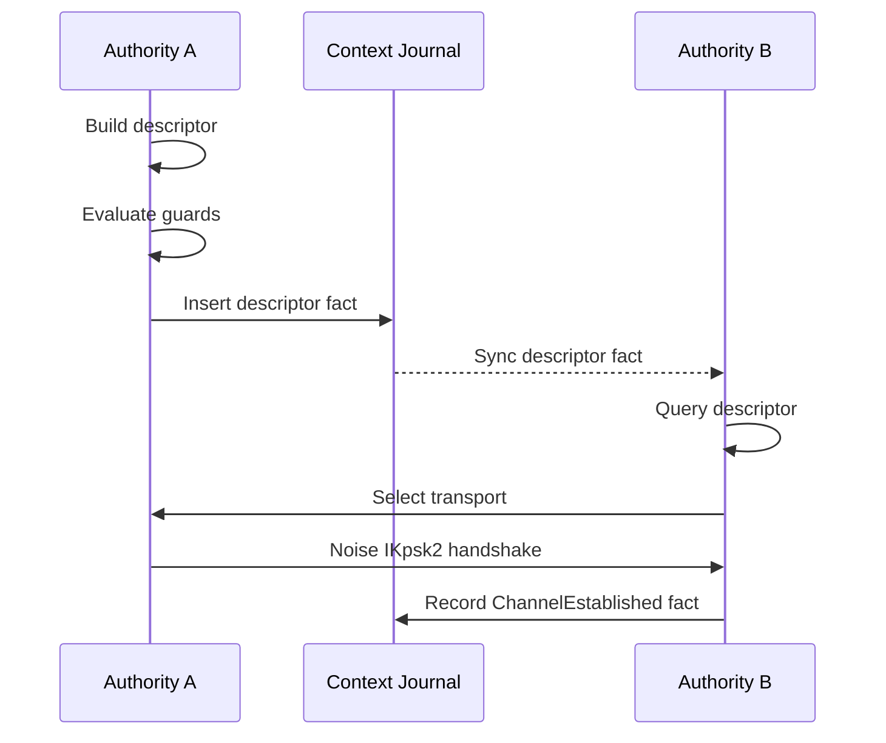

# Rendezvous Architecture

This document describes the rendezvous architecture in Aura. It explains peer discovery, descriptor propagation, service-surface advertisement, connectivity selection, channel establishment, and relay-to-direct holepunch upgrades. It aligns with the authority and context model. It scopes all rendezvous behavior to relational contexts.

## 1. Overview

Rendezvous establishes secure channels between authorities. The `RendezvousService` exposes `prepare_publish_descriptor()` and `prepare_establish_channel()` methods. The service returns guard outcomes that the caller executes through an effect interpreter. Rendezvous operates inside a relational context and uses the context key for encryption. Descriptors appear as facts in the context journal. Propagation uses journal synchronization (`aura-sync`), not custom flooding.

Rendezvous owns descriptor semantics, publication, validation, and establish bootstrap. It does not own the long-lived mutable descriptor cache. The runtime in `aura-agent` owns that cache and passes descriptor snapshots into peer-discovery views.

Rendezvous does not establish global identity. All operations are scoped to a `ContextId`. A context defines which authorities may see descriptors. Only participating authorities have the keys required to decrypt descriptor payloads.

Rendezvous descriptor exchange can run in provisional (A1) or soft-safe (A2) modes to enable rapid connectivity under poor network conditions, but durable channel epochs and membership changes must be finalized via consensus (A3). Soft-safe flows should emit convergence and reversion facts so participants can reason about reversion risk while channels are warming.

### 1.1 Secure‑Channel Lifecycle (A1/A2/A3)

- **A1**: Provisional `Descriptor` / handshake facts allow immediate connectivity.
- **A2**: Coordinator soft‑safe convergence certs indicate bounded divergence.
- **A3**: `ChannelEstablished` is finalized by consensus and accompanied by a `CommitFact`.

Rendezvous must treat A1/A2 outputs as provisional until A3 evidence is merged.
See [Consensus](108_consensus.md) for commit evidence binding.

## 2. Architecture

The rendezvous crate follows Aura's fact-based architecture:

1. **Guard Chain First**: All network sends flow through guard evaluation before execution
2. **Facts Not Flooding**: Descriptors are journal facts propagated via `aura-sync`, not custom flooding
3. **Standard Receipts**: Uses the system `Receipt` type with epoch binding and cost tracking
4. **Session-Typed Protocol**: Protocols expressed as MPST choreographies with guard annotations
5. **Unified Transport**: Channels established via `SecureChannel` with Noise IKpsk2

### 2.1 Module Structure

```
aura-rendezvous/
├── src/
│   ├── lib.rs           # Public exports
│   ├── facts.rs         # RendezvousFact domain fact type
│   ├── protocol.rs      # MPST choreography definition
│   ├── service.rs       # RendezvousService (main coordinator)
│   ├── descriptor.rs    # Transport selector and builder
│   └── new_channel.rs   # SecureChannel, ChannelManager, Handshaker
```

## 3. Connectivity and Service Advertisement

Rendezvous descriptors carry two kinds of information. One surface describes concrete connectivity endpoints. The other surface describes abstract service families such as `Establish`, `Move`, and `Hold`. These surfaces must remain separate.

Connectivity endpoints describe how a peer may be reached. Service advertisements describe what the peer is willing to provide. Runtime policy combines both surfaces with local permit state, health, and trust evidence. Descriptor publication itself does not commit the final route choice.

The current implementation still derives split connectivity and service-surface views from legacy `TransportHint` compatibility data. That compatibility layer is temporary. New code should consume `LinkEndpoint`, `ServiceDescriptor`, `EstablishPath`, and `MovePath` views rather than treating transport hints as final routing policy.

### 3.1 Holepunching and Upgrade Policy

Aura uses a relay-first, direct-upgrade model for NAT traversal:

1. Start on relay as soon as both peers have a valid descriptor path.
2. Exchange direct/reflexive candidates from descriptor facts.
3. Launch bounded direct upgrade attempts (holepunch) in the background.
4. Promote to direct when a recoverable direct path succeeds. Otherwise remain on relay.

Retry state is tracked with typed generations (`CandidateGeneration`, `NetworkGeneration`) and bounded backoff (`AttemptBudget`, `BackoffWindow`) in `PeerConnectionActor`. Generation changes reset retry budgets, which avoids stale retry loops after interface/NAT changes.

Recoverability is evaluated from local binding/interface provenance, not from reflexive addresses alone. This prevents treating stale external mappings as viable direct paths.

Operationally:

- Relay path is the safety baseline.
- Direct holepunch is an optimization path.
- Network changes can trigger a fresh upgrade cycle without dropping relay connectivity.

## 4. Data Structures

### 4.1 Domain Facts

Rendezvous uses domain facts in the relational context journal. Facts are propagated via journal synchronization.

```rust
/// Rendezvous domain facts stored in context journals
pub enum RendezvousFact {
    /// Transport descriptor advertisement
    Descriptor(RendezvousDescriptor),

    /// Channel established acknowledgment
    ChannelEstablished {
        initiator: AuthorityId,
        responder: AuthorityId,
        channel_id: [u8; 32],
        epoch: u64,
    },

    /// Descriptor revocation
    DescriptorRevoked {
        authority_id: AuthorityId,
        nonce: [u8; 32],
    },
}
```

### 4.2 Rendezvous Descriptors

```rust
/// Rendezvous descriptor for peer discovery
pub struct RendezvousDescriptor {
    /// Authority publishing this descriptor
    pub authority_id: AuthorityId,
    /// Context this descriptor is for
    pub context_id: ContextId,
    /// Legacy connectivity hints used to derive split views
    pub transport_hints: Vec<TransportHint>,
    /// Handshake PSK commitment (hash of PSK derived from context)
    pub handshake_psk_commitment: [u8; 32],
    /// Public key for Noise IK handshake (Ed25519 public key)
    pub public_key: [u8; 32],
    /// Validity window start (ms since epoch)
    pub valid_from: u64,
    /// Validity window end (ms since epoch)
    pub valid_until: u64,
    /// Nonce for uniqueness
    pub nonce: [u8; 32],
    /// What the peer wants to be called (optional, for UI purposes)
    pub nickname_suggestion: Option<String>,
}
```

`RendezvousDescriptor` is the authoritative shared object in the journal. Callers derive `LinkEndpoint` and `ServiceDescriptor` views from it. This keeps the fact schema stable during migration while preventing route policy from hardening into the fact format.

### 4.3 Split Connectivity and Service Surfaces

```rust
pub struct LinkEndpoint {
    pub protocol: LinkProtocol,
    pub address: Option<String>,
    pub relay_authority: Option<AuthorityId>,
}

pub struct ServiceDescriptor {
    pub header: ServiceDescriptorHeader,
    pub kind: ServiceDescriptorKind,
}

pub struct EstablishPath {
    pub route: Route,
}

pub struct MovePath {
    pub route: Route,
}
```

`LinkEndpoint` answers how a peer may be reached. `ServiceDescriptor` answers what service family is being advertised. Runtime-owned selection state combines these views with local policy and social inputs. The selected provider should observe only the generic service action, not the social reason it was chosen.

`EstablishPath` and `MovePath` are the explicit path objects consumed by current bootstrap and movement flows. They are derived from descriptor views plus runtime-local policy, but they remain socially neutral: home, neighborhood, guardian, friend, and similar provider roles must not appear in the path schema itself.

## 5. MPST Choreographies

Rendezvous protocols are defined as MPST choreographies with guard annotations.

### 5.1 Direct Exchange Protocol

```rust
choreography! {
    #[namespace = "rendezvous_exchange"]
    protocol RendezvousExchange {
        roles: Initiator, Responder;

        // Initiator publishes descriptor (fact insertion, propagates via sync)
        Initiator[guard_capability = "rendezvous:publish",
                  journal_facts = "descriptor_offered"]
        -> Responder: DescriptorOffer(RendezvousDescriptor);

        // Responder publishes response descriptor
        Responder[guard_capability = "rendezvous:publish",
                  journal_facts = "descriptor_answered"]
        -> Initiator: DescriptorAnswer(RendezvousDescriptor);

        // Direct channel establishment
        Initiator[guard_capability = "rendezvous:connect",
        -> Responder: HandshakeInit(NoiseHandshake);

        Responder[guard_capability = "rendezvous:connect",
                  journal_facts = "channel_established"]
        -> Initiator: HandshakeComplete(NoiseHandshake);
    }
}
```

### 5.2 Relayed Protocol

```rust
choreography! {
    #[namespace = "relayed_rendezvous"]
    protocol RelayedRendezvous {
        roles: Initiator, Relay, Responder;

        Initiator[guard_capability = "rendezvous:relay",]
        -> Relay: RelayRequest(RelayEnvelope);

        Relay[guard_capability = "relay:forward",
              leak = "neighbor:1"]
        -> Responder: RelayForward(RelayEnvelope);

        Responder[guard_capability = "rendezvous:relay"]
        -> Relay: RelayResponse(RelayEnvelope);

        Relay[guard_capability = "relay:forward",
              leak = "neighbor:1"]
        -> Initiator: RelayComplete(RelayEnvelope);
    }
}
```

## 6. Descriptor Propagation

Descriptors propagate via journal synchronization. This replaces custom flooding.

1. Authority creates a `RendezvousFact::Descriptor` fact
2. Guard chain evaluates the publication request
3. On success, fact is inserted into the context journal
4. Journal sync (`aura-sync`) propagates facts to context participants
5. Peers query journal for peer descriptors

This model provides:
- **Deduplication**: Journal sync handles duplicate facts naturally
- **Ordering**: Facts have causal ordering via journal timestamps
- **Authorization**: Guard chain validates before insertion
- **Consistency**: Same propagation mechanism as other domain facts

### 6.1 aura-sync Integration

The `aura-sync` crate provides a `RendezvousAdapter` that bridges peer discovery with runtime-owned descriptor snapshots:

```rust
use aura_sync::infrastructure::RendezvousAdapter;

// Create adapter using the local authority identity.
let adapter = RendezvousAdapter::new(local_authority);

// Query peer info from a runtime-owned descriptor snapshot.
if let Some(peer_info) = adapter.get_peer_info(&descriptors, context_id, peer, now_ms) {
    if peer_info.has_direct_transport() {
        // Use direct connection
    }
}

// Check which peers need descriptor refresh
let stale_peers = adapter.peers_needing_refresh(&descriptors, context_id, now_ms);
```

The adapter is a pure view helper. It does not own or mutate the cache. The runtime cache stays in `aura-agent`.

### 6.2 Social Inputs and Route Selection

Rendezvous may consume socially rooted provider inputs, but it does not own social topology or trust evaluation. The `Neighborhood Plane` and `Web of Trust Plane` produce permit and candidate inputs. The runtime combines those inputs with descriptor views and local policy.

This separation is required for privacy. Shared descriptor facts must not expose route classes such as "friend relay" or "neighborhood hold". The selected provider should observe only the generic service action. See [Social Architecture](115_social_architecture.md) for the plane split.

## 7. Protocol Flow

The rendezvous sequence uses the context between two authorities.



## 8. Guard Chain Integration

All rendezvous operations flow through the guard chain.

### 8.1 Guard Capabilities

```rust
pub mod guards {
    pub const CAP_RENDEZVOUS_PUBLISH: &str = "rendezvous:publish";
    pub const CAP_RENDEZVOUS_CONNECT: &str = "rendezvous:connect";
    pub const CAP_RENDEZVOUS_RELAY: &str = "rendezvous:relay";
}
```

### 8.2 Flow Costs

```rust
pub const DESCRIPTOR_PUBLISH_COST: u32 = 1;
pub const CONNECT_DIRECT_COST: u32 = 2;
pub const CONNECT_RELAY_COST: u32 = 3;
pub const RELAY_FORWARD_COST: u32 = 1;
```

### 8.3 Guard Evaluation

The service prepares operations and returns `GuardOutcome` containing effect commands. The caller executes these commands.

```rust
// 1. Prepare snapshot of current state
let snapshot = GuardSnapshot {
    authority_id: alice,
    context_id: context,
    flow_budget_remaining: 100,
    capabilities: vec!["rendezvous:publish".into()],
    epoch: 1,
};

// 2. Prepare publication (pure, sync)
let outcome = service.prepare_publish_descriptor(
    &snapshot, context, transport_hints, now_ms
);

// 3. Check decision and execute effects
if outcome.decision.is_allowed() {
    for cmd in outcome.effects {
        execute_effect_command(cmd).await?;
    }
}
```

## 9. Secure Channel Establishment

After receiving a valid descriptor, the initiator selects a transport. Both sides run Noise IKpsk2 using a context-derived PSK. Successful handshake yields a `SecureChannel`.

### 9.1 Channel Structure

```rust
pub struct SecureChannel {
    /// Unique channel identifier
    channel_id: [u8; 32],
    /// Context this channel belongs to
    context_id: ContextId,
    /// Local authority
    local: AuthorityId,
    /// Remote peer
    remote: AuthorityId,
    /// Current epoch (for key rotation)
    epoch: u64,
    /// Channel state
    state: ChannelState,
    /// Agreement mode (A1/A2/A3) for the channel lifecycle
    agreement_mode: AgreementMode,
    /// Whether reversion is still possible
    reversion_risk: bool,
    /// Whether the channel needs key rotation
    needs_rotation: bool,
    /// Bytes sent on this channel (for flow budget tracking)
    bytes_sent: u64,
    /// Bytes received on this channel
    bytes_received: u64,
}

pub enum ChannelState {
    Establishing,
    Active,
    Rotating,
    Closed,
    Error(String),
}
```

### 9.2 Channel Manager

The `ChannelManager` tracks active channels:

```rust
let mut manager = ChannelManager::new();

// Register a new channel
manager.register(channel);

// Find channel by context and peer
if let Some(ch) = manager.find_by_context_peer(context, peer) {
    if ch.is_active() {
        // Use channel
    }
}

// Advance epoch and mark channels for rotation
manager.advance_epoch(new_epoch);
```

### 9.3 Handshake Flow

The `Handshaker` state machine handles Noise IKpsk2:

```rust
// Initiator side
let mut initiator = Handshaker::new(HandshakeConfig {
    local: alice,
    remote: bob,
    context_id: context,
    psk: derived_psk,
    timeout_ms: 5000,
});

let init_msg = initiator.create_init_message(epoch)?;
// ... send init_msg to responder ...
initiator.process_response(&response_msg)?;
let result = initiator.complete(epoch, true)?;
let channel = initiator.build_channel(&result)?;
```

### 9.4 Key Rotation

Channels support epoch-based key rotation. When the epoch advances, channels rekey using the new context-derived PSK.

```rust
impl SecureChannel {
    pub fn needs_epoch_rotation(&self, current_epoch: u64) -> bool {
        self.epoch < current_epoch
    }

    pub fn rotate(&mut self, new_epoch: u64) -> AuraResult<()> {
        // Rekey the channel
        self.state = ChannelState::Rotating;
        self.epoch = new_epoch;
        self.needs_rotation = false;
        self.state = ChannelState::Active;
        Ok(())
    }
}
```

## 10. Service Interface

The rendezvous service coordinates descriptor publication and channel establishment.

```rust
impl RendezvousService {
    /// Create a new rendezvous service
    pub fn new(authority_id: AuthorityId, config: RendezvousConfig) -> Self;

    /// Prepare to publish descriptor to context journal
    pub fn prepare_publish_descriptor(
        &self,
        snapshot: &GuardSnapshot,
        context_id: ContextId,
        transport_hints: Vec<TransportHint>,
        now_ms: u64,
    ) -> GuardOutcome;

    /// Prepare to establish channel with peer
    pub fn prepare_establish_channel(
        &self,
        snapshot: &GuardSnapshot,
        context_id: ContextId,
        peer: AuthorityId,
        psk: &[u8; 32],
    ) -> AuraResult<GuardOutcome>;

    /// Prepare to handle incoming handshake
    pub fn prepare_handle_handshake(
        &self,
        snapshot: &GuardSnapshot,
        context_id: ContextId,
        initiator: AuthorityId,
        handshake: NoiseHandshake,
        psk: &[u8; 32],
    ) -> GuardOutcome;

    /// Cache a peer's descriptor (from journal sync)
    pub fn cache_descriptor(&mut self, descriptor: RendezvousDescriptor);

    /// Get a cached descriptor
    pub fn get_cached_descriptor(
        &self,
        context_id: ContextId,
        peer: AuthorityId,
    ) -> Option<&RendezvousDescriptor>;

    /// Check if our descriptor needs refresh
    pub fn needs_refresh(
        &self,
        context_id: ContextId,
        now_ms: u64,
        refresh_window_ms: u64,
    ) -> bool;
}
```

## 11. Effect Commands

The service returns `GuardOutcome` with effect commands to execute:

```rust
pub enum EffectCommand {
    /// Append fact to journal
    JournalAppend { fact: RendezvousFact },
    /// Charge flow budget
    ChargeFlowBudget { cost: FlowCost },
    /// Send handshake init message
    SendHandshake { peer: AuthorityId, message: HandshakeInit },
    /// Send handshake response
    SendHandshakeResponse { peer: AuthorityId, message: HandshakeComplete },
    /// Record operation receipt
    RecordReceipt { operation: String, peer: AuthorityId },
}
```

## 12. Failure Modes and Privacy

Failures occur during guard evaluation, descriptor validation, or transport establishment. These failures are local. No network packets reveal capability or budget failures.

Context isolation prevents unauthorized authorities from reading descriptors. Transport hints do not reveal authority structure. Relay identifiers reveal only the relay authority. Descriptor contents remain encrypted for transit.

## 13. Summary

Rendezvous provides encrypted peer discovery and channel establishment scoped to relational contexts. Descriptors propagate through journal synchronization with guard chain enforcement. Secure channels use Noise IKpsk2 and QUIC. All behavior remains private to the context and reveals no structural information. The architecture uses standard Aura primitives: domain facts, guard chains, MPST choreographies, and effect interpretation.
