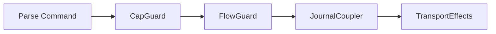

# Social Architecture

This document defines Aura's social organization model using a digital urban metaphor. The system layers social organization, privacy, consent, and governance into three tiers: messages, homes, and neighborhoods.

## 1. Overview

### 1.1 Design Goals

The model produces human-scaled social structures with natural scarcity based on physical analogs. Organic community dynamics emerge from bottom-up governance. The design aligns with Aura's consent-based privacy guarantees and capability-based authorization.

### 1.2 Three-Tier Structure

Messages are communication contexts. Direct messages are private relational contexts. Home messages are semi-public messaging for home residents.

Homes are semi-public communities capped by storage constraints. Each home has a 10 MB total allocation. Residents allocate storage to participate.

Neighborhoods are collections of homes connected via adjacency and traversal policies. Homes donate storage to neighborhood infrastructure.

### 1.3 Terminology

An authority (`AuthorityId`) is the cryptographic identity that holds capabilities and participates in consensus. A nickname is a local mapping from an authority to a human-understandable name. Each device maintains its own nickname mappings. There is no global username registry.

A nickname suggestion (`nickname_suggestion`) is metadata an authority optionally shares when connecting with someone. Users configure a default suggestion sent to all new connections. Users can share different suggestions with different people or opt out entirely.

### 1.4 Unified Naming Pattern

The codebase uses a consistent naming pattern across entities (contacts, devices, discovered peers). The `EffectiveName` trait in `aura-app/src/views/naming.rs` defines the resolution order:

1. **Local nickname** (user-assigned override) if non-empty
2. **Shared nickname_suggestion** (what entity wants to be called) if non-empty
3. **Fallback identifier** (truncated authority/device ID)

This pattern ensures consistent display names across all UI surfaces while respecting both local preferences and shared suggestions.

## 2. Message Types

### 2.1 Direct Messages

Direct messages are small private relational contexts built on AMP. There is no public frontage or traversal. All participants must be explicitly added. New members do not receive historical message sync.

### 2.2 Home Messages

Home messages are semi-public messaging for home residents. They use the same AMP infrastructure as direct messages. When a new resident joins, current members send a window of recent messages.

Membership is tied to home residency. Leaving the home revokes access. Multiple channels may exist per home for different purposes.

```rust
pub struct HomeMessage {
    home_id: HomeId,
    channel: String,
    content: Vec<u8>,
    author: AuthorityId,
    timestamp: TimeStamp,
}
```

The message structure identifies the home, channel, content, author, and timestamp. Historical sync is configurable, typically the last 500 messages.

## 3. Home Architecture

### 3.1 Home Structure

A home is a relational context with its own journal. The total storage allocation is 10 MB. Capability templates define visitor, frontage, guest, resident, and steward patterns. Local governance is encoded via policy facts.

```rust
pub struct Home {
    pub home_id: HomeId,
    pub storage_limit: u64,
    pub max_residents: u8,
    pub neighborhood_limit: u8,
    pub residents: Vec<AuthorityId>,
    pub stewards: Vec<(AuthorityId, StewardCapabilities)>,
    pub storage_budget: HomeStorageBudget,
}
```

The home structure contains the identifier, storage limit, configuration limits, resident list, steward list with capabilities, and storage budget tracking.

### 3.2 Residency

Home membership derives from possessing capability bundles, meeting entry requirements defined by policy, and allocating resident-specific storage. In v1, each user belongs to exactly one home.

Joining a home follows a defined sequence. The authority requests capability. Home governance approves using local policy via Biscuit evaluation and consensus. The authority accepts the capability bundle and allocates storage. Historical home messages sync from current residents.

### 3.3 Stewardship

Stewards emerge via governance decisions in the home. Steward capability bundles include moderation, pin and unpin operations, and governance facilitation. Stewardship is auditable because capability issuance is visible via relational facts.

## 4. Neighborhood Architecture

### 4.1 Neighborhood Structure

A neighborhood is a relational context linking multiple homes. It contains a combined pinned infrastructure pool equal to the number of homes times 1 MB. An adjacency graph connects homes. Traversal and inter-home policy logic define movement rules.

```rust
pub struct Neighborhood {
    pub neighborhood_id: NeighborhoodId,
    pub member_homes: Vec<HomeId>,
    pub adjacencies: Vec<(HomeId, HomeId)>,
}
```

The neighborhood structure contains the identifier, member homes, and adjacency edges.

### 4.2 Home Membership

Homes donate 1 MB of their budget per neighborhood joined. In v1, each home may join a maximum of 4 neighborhoods. This limits adjacency graph complexity and effect delegation routing.

## 5. Position and Traversal

### 5.1 Position Structure

Position is represented as a structured type.

```rust
pub struct TraversalPosition {
    pub neighborhood: Option<NeighborhoodId>,
    pub current_home: Option<HomeId>,
    pub depth: TraversalDepth,
    pub context_id: ContextId,
    pub entered_at: TimeStamp,
}

pub enum TraversalDepth {
    Street,
    Frontage,
    Interior,
}
```

The position tracks current neighborhood, current home, traversal depth, context for capabilities, and entry time. Street depth allows seeing frontage with no interior access. Frontage depth allows limited interaction. Interior depth provides full resident-level access.

### 5.2 Movement Rules

Movement is possible when a Biscuit capability authorizes entry, neighborhood policy allows traversal along an adjacency edge, and home frontage or invitations allow deeper entry. Traversal does not replicate pinned data. Visitors operate on ephemeral local state.

Traversal does not reveal global identity. Only contextual identities within encountered homes are visible.

## 6. Storage Constraints

### 6.1 Block-Level Allocation

Homes have a fixed size of 10 MB total. Allocation depends on neighborhood participation.

| Neighborhoods | Donation | Resident Storage | Public Space |
|---------------|----------|------------------|--------------|
| 1             | 1.0 MB   | 1.6 MB           | 7.4 MB       |
| 2             | 2.0 MB   | 1.6 MB           | 6.4 MB       |
| 3             | 3.0 MB   | 1.6 MB           | 5.4 MB       |
| 4             | 4.0 MB   | 1.6 MB           | 4.4 MB       |

More neighborhood connections mean less local storage for home culture. This creates meaningful trade-offs.

### 6.2 Flow Budget Integration

Storage constraints are enforced via the flow budget system.

```rust
pub struct HomeFlowBudget {
    pub home_id: String,
    pub resident_count: u8,
    pub resident_storage_spent: u64,
    pub neighborhood_count: u8,
    pub neighborhood_donations: u64,
    pub pinned_storage_spent: u64,
}
```

The spent counters are persisted as journal facts. The count fields track current membership. Limits are derived at runtime from home policy and Biscuit capabilities. Resident storage limit is 1.6 MB for 8 residents at 200 KB each.

## 7. Fact Schema

### 7.1 Home Facts

Home facts enable Datalog queries.

```datalog
home(home_id, created_at, storage_limit).
home_config(home_id, max_residents, neighborhood_limit).
resident(authority_id, home_id, joined_at, storage_allocated).
steward(authority_id, home_id, granted_at, capabilities).
pinned_content(content_hash, home_id, pinned_by, pinned_at, size_bytes).
```

These facts express home existence, configuration, residency, stewardship, and pinned content.

### 7.2 Neighborhood Facts

Neighborhood facts express neighborhood existence, home membership, adjacency, and traversal permissions.

```datalog
neighborhood(neighborhood_id, created_at).
home_member(home_id, neighborhood_id, joined_at, donated_storage).
adjacent(home_a, home_b, neighborhood_id).
traversal_allowed(from_home, to_home, capability_requirement).
```

### 7.3 Query Examples

Queries use Biscuit Datalog.

```datalog
residents_of(Home) <- resident(Auth, Home, _, _).

visitable(Target) <-
    resident(Me, Current, _, _),
    adjacent(Current, Target, _),
    traversal_allowed(Current, Target, Cap),
    has_capability(Me, Cap).
```

The first query finds all residents of a home. The second finds homes a user can visit from their current position.

## 8. IRC-Style Commands

### 8.1 User Commands

User commands are available to all participants.

| Command | Description | Capability |
|---------|-------------|------------|
| `/msg <user> <text>` | Send private message | `send_dm` |
| `/me <action>` | Send action | `send_message` |
| `/nick <name>` | Update contact suggestion | `update_contact` |
| `/who` | List participants | `view_members` |
| `/leave` | Leave current context | `leave_context` |

### 8.2 Moderator Commands

Moderator commands require steward capabilities.

| Command | Description | Capability |
|---------|-------------|------------|
| `/kick <user>` | Remove from home | `moderate:kick` |
| `/ban <user>` | Ban from home | `moderate:ban` |
| `/mute <user>` | Silence user | `moderate:mute` |
| `/pin <msg>` | Pin message | `pin_content` |

### 8.3 Command Execution

Commands execute through the guard chain.



The command is parsed into a structured type. CapGuard checks capability requirements. FlowGuard charges the moderation action budget. JournalCoupler commits the action fact. TransportEffects notifies affected parties.

## 9. Governance

### 9.1 Home Governance

Homes govern themselves through capability issuance, consensus-based decisions, stewardship roles, and moderation. Home governance uses Aura Consensus for irreversible or collective decisions.

### 9.2 Neighborhood Governance

Neighborhoods govern home admission, adjacency graph maintenance, traversal rules, and shared civic norms. High-stakes actions use Aura Consensus.

## 10. Privacy Model

### 10.1 Contextual Identity

Identity in Aura is contextual and relational. Joining a home reveals a home-scoped identity. Leaving a home causes that contextual identity to disappear. Profile data shared inside a context stays local to that context.

### 10.2 Consent Model

Disclosure is consensual. The device issues a join request. Home governance approves using local policy. The authority accepts the capability bundle. This sequence ensures all participation is explicit.

## 11. V1 Constraints

For the initial release, the model is simplified with three constraints.

Each user resides in exactly one home. This eliminates multi-residency complexity and allows core infrastructure to stabilize.

Each home has a maximum of 8 residents. This human-scale limit enables strong community bonds and manageable governance.

Each home may join a maximum of 4 neighborhoods. This limits adjacency graph complexity and effect delegation routing overhead.

## 12. Infrastructure Roles

Homes and neighborhoods provide infrastructure services beyond social organization. The `aura-social` crate implements these roles through materialized views and relay selection.

### 12.1 Home Infrastructure

Homes provide data availability and relay services for residents:

- **Data Replication**: Home residents replicate pinned data across available devices. The `HomeAvailability` type coordinates replication factor and failover.
- **Message Relay**: Home peers serve as first-hop relays for unknown destinations. The `SocialTopology::home_peers()` method returns available relays.
- **Storage Coordination**: The `StorageService` enforces storage budgets per resident and tracks usage facts.

### 12.2 Neighborhood Infrastructure

Neighborhoods enable multi-hop routing and cross-home coordination:

- **Descriptor Propagation**: Neighborhood adjacency edges define descriptor propagation paths. Adjacent homes exchange routing information.
- **Traversal Capabilities**: `TraversalAllowedFact` grants movement between homes. Traversal depth limits constrain routing overhead.
- **Multi-Hop Relay**: When home-level relay fails, neighborhood traversal provides alternate paths.

### 12.3 Progressive Discovery Layers

The `aura-social` crate implements a four-layer discovery model:

| Layer | Priority | Resources Required | Flow Cost |
|-------|----------|-------------------|-----------|
| Direct | 0 | Known peer relationship | Minimal |
| Home | 1 | Home peers available | Low |
| Neighborhood | 2 | Neighborhood traversal | Medium |
| Rendezvous | 3 | Global flooding | High |

Discovery layer selection uses `SocialTopology::discovery_layer()`:

```rust
let topology = SocialTopology::new(local_authority, home, neighborhoods);
let layer = topology.discovery_layer(&target);
```

Lower priority layers are preferred when available. This creates economic incentives to establish social relationships before communication.

### 12.4 Relay Selection

The `RelayCandidateBuilder` generates relay candidates based on social topology:

```rust
let builder = RelayCandidateBuilder::from_topology(topology);
let candidates = builder.build_candidates(&context, &reachability);
```

Candidates are returned in priority order: home peers first, then neighborhood peers, then guardians. Reachability checks filter unreachable peers.

## See Also

[Database Architecture](113_database.md) describes fact storage and queries. [Transport and Information Flow](109_transport_and_information_flow.md) covers AMP messaging. [Authorization](104_authorization.md) describes capability evaluation. [Rendezvous Architecture](111_rendezvous.md) details the four-layer discovery model integration.
