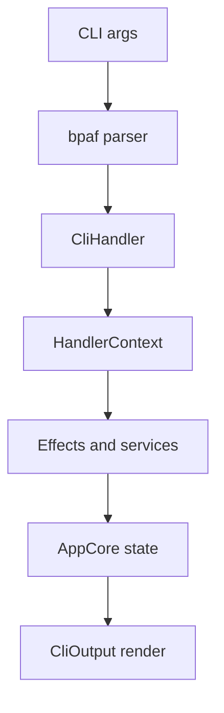
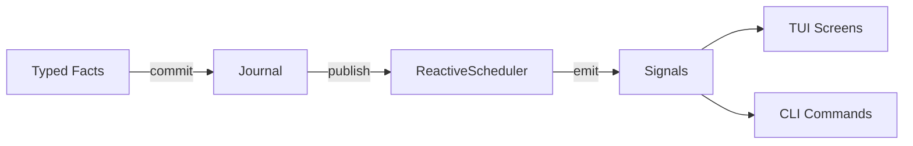
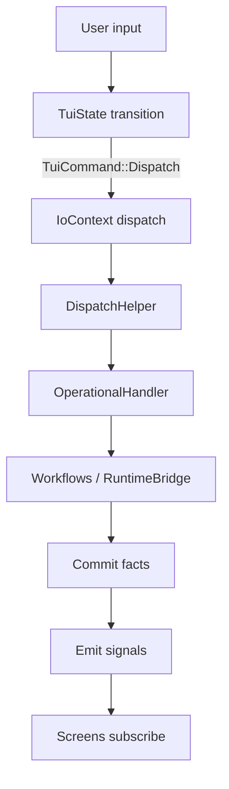

# CLI and Terminal User Interface

This document describes the `aura-terminal` user interface layer. It covers the non-interactive CLI commands and the iocraft-based TUI. It also describes how both frontends share `aura-app` through `AppCore` and the reactive signal system.

Demo mode is compiled only with `--features development`.

## Goals and constraints

The CLI and the TUI are thin frontends over `AppCore`. They should not become alternate application runtimes. They should also avoid owning long-lived domain state.

Both frontends must respect the guard chain, journaling, and effect system boundaries described in [Aura System Architecture](001_system_architecture.md). The CLI optimizes for scriptability and stable output. The TUI optimizes for deterministic navigation with reactive domain data.

## Concepts

- Command. A user-invoked operation such as `aura status` or `aura chat send`.
- Handler. A CLI implementation function that uses `HandlerContext` and returns `CliOutput`.
- Screen. A routed view that renders domain data and local UI state.
- Modal. A blocking overlay that captures focus. Modals are queued and only one can be visible at a time.
- Toast. A transient notification. Toasts are queued and only one can be visible at a time.
- Signal. A reactive stream of domain values from `aura-app`.
- Intent. A journaled application command dispatched through `AppCore.dispatch` (legacy in the TUI). Most TUI actions are runtime-backed workflows via `IoContext`.

## Running

Run the CLI and the TUI from the development shell.

### CLI

The CLI entry point is `crates/aura-terminal/src/main.rs`. Commands are parsed by bpaf and dispatched to `CliHandler` and the handler modules.

```bash
nix develop
aura status -c ./aura.toml
aura chat list
```

This enters the Nix development environment and runs two example commands. CLI commands return structured `CliOutput` and then render it to stdout and stderr.

### TUI production

The production TUI command is `aura tui`.

```bash
nix develop
aura tui
```

This launches the production TUI and enters fullscreen mode.

### TUI demo

To run the demo, compile with `--features development` and pass `--demo`.

```bash
nix develop
cargo run -p aura-terminal --features development -- aura tui --demo
```

This launches a deterministic demo environment with simulated peers.

### Useful flags and environment variables

CLI:
- `aura -v` enables verbose output and logs
- `aura -c CONFIG` selects a global config file

TUI:
- `aura tui --data-dir DIR` sets the Aura data directory. It falls back to `AURA_PATH`.
- `aura tui --device-id DEVICE` selects the device identifier for the session.
- `AURA_TUI_ALLOW_STDIO=1` disables fullscreen stderr redirection. It is intended for debugging.
- `AURA_TUI_LOG_PATH` overrides the TUI log file location.

## Architecture overview

The CLI and the TUI share the same backend boundary. Both construct an `AppCore` value and use it as the primary interface to domain workflows and views. Both also rely on `aura-agent` for effect handlers and runtime services.

The user interface split is:
- `crates/aura-app` provides portable domain logic, reactive state, and signals through `AppCore`.
- `crates/aura-terminal/src/cli/` defines bpaf parsers and CLI argument types.
- `crates/aura-terminal/src/handlers/` implements CLI commands and shared terminal glue.
- `crates/aura-terminal/src/tui/` implements iocraft UI code and deterministic navigation.

## Relationship to `aura-app`

`AppCore` is the shared boundary for both frontends. It owns reactive state and provides stable APIs for dispatching intents and reading derived views. Frontends should use the `aura_app::ui` facade (especially `aura_app::ui::signals` and `aura_app::ui::workflows`) as the public API surface.

The frontends use `AppCore` in two ways:
- Trigger work by calling `AppCore.dispatch(intent)` or by calling effect-backed handlers that ultimately produce journaled facts.
- Read state by reading views or by subscribing to signals for push-based updates.

This split keeps domain semantics centralized. It also makes it possible to reuse the same workflows in multiple user interfaces.

## Time system in UI

UI code must never read OS clocks (for example, `SystemTime::now()` or `Instant::now()`). All wall-clock needs must flow through algebraic effects (`PhysicalTimeEffects` via the handler/effect system). Demo mode and relative-time UI (e.g., “Synced Xm ago”) must be driven by runtime time so simulations remain deterministic.

Aura time domains are: `PhysicalClock` (wall time), `LogicalClock` (causality), `OrderClock` (privacy-preserving ordering), and `Range` (validity windows). When attested time is required, use `ProvenancedTime`/`TimeAttestationEffects` rather than embedding OS timestamps in UI state.

Ordering across domains must be explicit: use `TimeStamp::compare(policy)` (never compare raw ms) when you need deterministic ordering across mixed time domains.

## Shared infrastructure in `aura-terminal`

CLI commands are parsed in `crates/aura-terminal/src/cli/commands.rs` and routed through `crates/aura-terminal/src/main.rs`. Implementations live under `crates/aura-terminal/src/handlers/` and use `HandlerContext` from `crates/aura-terminal/src/handlers/handler_context.rs`. Handler functions typically return `CliOutput` for testable rendering.

The TUI launcher lives in `crates/aura-terminal/src/handlers/tui.rs`. It sets up tracing and constructs the `IoContext` and callback registry. The fullscreen stdio policy is defined in `crates/aura-terminal/src/handlers/tui_stdio.rs`.

## CLI execution model

The CLI is request and response. Each command parses arguments, runs one handler, and exits. Long-running commands such as daemon modes should still use the same effect boundaries.



This diagram shows the main CLI path from parsing to rendering. Some handlers also read derived state from `AppCore` after effects complete.

## Reactive data model

The reactive system follows a fact-based architecture where typed facts are the source of truth for UI state.

### Signals as single source of truth

ReactiveEffects signals (CHAT_SIGNAL, CONTACTS_SIGNAL, RECOVERY_SIGNAL, etc.) are the canonical source for all UI state. They are updated by the `ReactiveScheduler` processing typed facts from the journal.



The data flow is:
1. **Typed facts** (`aura_journal::fact::Fact`) are committed to the journal
2. **ReactiveScheduler** processes committed facts via registered `ReactiveView` implementations
3. **SignalViews** (e.g., `ContactsSignalView`, `ChatSignalView`) update their internal state and emit snapshots to signals
4. **UI components** subscribe to signals and render the current state

This architecture ensures a single source of truth and eliminates dual-write bugs. Code that needs to update UI state must commit facts (production) or emit directly to signals (demo/test).

### ViewState is internal

`AppCore` contains an internal `ViewState` used for legacy compatibility and non-signal use cases. ViewState changes do not propagate to signals. The signal forwarding infrastructure was removed in favor of scheduler-driven updates.

For compile-time safety, there are no public methods on `AppCore` to mutate ViewState for UI-affecting state. Code that needs to update what the UI displays must:

1. **Production**: Commit facts via `RuntimeBridge.commit_relational_facts()`. Facts flow through the scheduler to signals.
2. **Demo/Test**: Emit directly to signals via `ReactiveEffects::emit()`. This is explicit and type-safe.

This design prevents the "dual-write" bug class where code updates ViewState expecting UI changes, but signals remain unchanged.

The CLI usually reads state at a point in time. It can still use signals for watch-like commands or daemon commands. When a command needs continuous updates, it should subscribe to the relevant signals and render incremental output.

### Reading and subscribing to signals

Signals are accessed through `AppCore`'s `ReactiveEffects` implementation. Read the current value with `read()` and subscribe for updates with `subscribe()`.

```rust
// Read current state from signal
let contacts = {
    let core = app_core.read().await;
    core.read(&*CONTACTS_SIGNAL).await.unwrap_or_default()
};

// Subscribe for ongoing updates
let mut stream = {
    let core = app_core.read().await;
    core.subscribe(&*CONTACTS_SIGNAL)
};

while let Ok(state) = stream.recv().await {
    render_contacts(&state);
}
```

For initial render, read the current signal value first to avoid a blank frame. Then subscribe for updates. This pattern is used heavily by TUI screens.

### Subscriptions and ownership

Long-lived subscriptions that drive global TUI elements live in `crates/aura-terminal/src/tui/screens/app/subscriptions.rs`. Screen-local subscriptions should live with the screen module.

Subscriptions should be owned by the component that renders the data. A subscription should not mutate `TuiState` unless it is updating navigation, focus, or overlay state.

### Connection status (peer count)

The footer "connected peers" count is a UI convenience signal. It must represent how many of your contacts are online, not a seeded or configured peer list.

- Source: `CONNECTION_STATUS_SIGNAL` (emitted by `aura_app::ui::workflows::system::refresh_account()`).
- Contact set: read from `CONTACTS_SIGNAL` (signal truth), not from `ViewState` snapshots.
- Online check: `RuntimeBridge::is_peer_online(contact_id)` (best-effort). Demo uses a shared in-memory transport. Production can use real transport channel health.

## Deterministic UI model

The TUI separates domain state from UI state. Domain state is push-based and comes from `aura-app` signals. UI state is deterministic and lives in `TuiState`.

Navigation, focus, input buffers, modal queues, and toast queues are updated by a pure transition function. The entry point is `crates/aura-terminal/src/tui/state/mod.rs`. The runtime executes `TuiCommand` values in `crates/aura-terminal/src/tui/runtime.rs`.

## Dispatch bridge

The TUI dispatch path uses `IoContext` in `crates/aura-terminal/src/tui/context/io_context.rs`.

Today the TUI uses a runtime-backed dispatch model: `IoContext` routes `EffectCommand` to `DispatchHelper` and `OperationalHandler`. Most domain-affecting behavior occurs through `aura-app` workflows that call `RuntimeBridge` (which commits facts and drives signals).



This diagram shows the primary TUI dispatch path. Operational commands may also emit operational signals such as `SYNC_STATUS_SIGNAL`, `CONNECTION_STATUS_SIGNAL`, and `ERROR_SIGNAL`.

## Screens, modals, and callbacks

The root iocraft component is in `crates/aura-terminal/src/tui/screens/app/shell.rs`. Global modals live in `crates/aura-terminal/src/tui/screens/app/modal_overlays.rs`. Long-lived signal subscriptions for the shell live in `crates/aura-terminal/src/tui/screens/app/subscriptions.rs`.

Modals and toasts are routed through explicit queues in `TuiState`. The modal enum is `QueuedModal` in `crates/aura-terminal/src/tui/state/modal_queue.rs`. Avoid per-modal `visible` flags.

Invitation codes are managed from the Contacts workflow (modals), not via a dedicated routed Invitations screen.

Callbacks are registered in `crates/aura-terminal/src/tui/callbacks/`. Asynchronous results are surfaced through `UiUpdate` in `crates/aura-terminal/src/tui/updates.rs`. Prefer subscribing to domain signals when a signal already exists.

## Fullscreen I/O policy

Writing to stderr while iocraft is in fullscreen can corrupt the terminal buffer. The TUI redirects stderr away from the terminal while fullscreen is active. Tracing is written to a log file.

The policy is enforced with type-level stdio tokens in `crates/aura-terminal/src/handlers/tui_stdio.rs`. The token used before fullscreen is consumed while iocraft is running. This prevents accidental `println!` and `eprintln!` calls in the fullscreen scope.

This policy aligns with [Privacy and Information Flow](003_information_flow_contract.md) and [Effect System and Runtime](106_effect_system_and_runtime.md).

## Errors and user feedback

Domain and dispatch failures are emitted through `aura_app::ui::signals::ERROR_SIGNAL`. The app shell subscribes to this signal and renders errors as queued toasts. When the account setup modal is active, errors are routed into the modal instead of creating a toast.

UI-only failures use `UiUpdate::OperationFailed`. This is used primarily for account file operations that occur before AppCore dispatch.

CLI commands should return errors through `TerminalResult` and render them through `CliOutput`. Avoid printing error text directly from deep helper functions. Prefer returning structured error types.

## Invariants and common pitfalls

The state machine owns navigation, focus, and overlay visibility. Screen components should render `TuiState` and should not mutate it directly. They should send events and let the state machine decide transitions.

The domain owns the reactive state. Avoid caching domain data in `TuiState`. Prefer subscribing to `aura-app` signals and deriving view props inside the screen component.

### Single source of truth invariants

- **Signals are the source of truth** for UI state, not ViewState.
- **Facts drive signals** in production. Commit facts via RuntimeBridge.
- **Direct emission** is only for demo/test scenarios via `ReactiveEffects::emit()`.
- **No ViewState mutation for UI state**. AppCore has no public methods to mutate ViewState for UI-affecting state.

### Common pitfalls

- Calling `println!` and `eprintln!` while fullscreen is active
- Storing domain state in `TuiState` instead of subscribing to signals
- Adding per-modal `visible` flags instead of using `QueuedModal` and the modal queue
- Using `UiUpdate` as a general event bus instead of subscribing to signals
- Expecting ViewState changes to appear in the UI. ViewState does not propagate to signals.
- Emitting directly to domain signals in production code. Use fact commits instead.

## Testing strategy

The CLI should be tested with handler unit tests and structured output assertions. Prefer pure formatting helpers and `CliOutput` snapshots over stdout capture.

The deterministic boundary for the TUI is the state machine. Prefer unit tests that call `transition()` directly for navigation and modal behavior. For headless terminal event tests, use `TuiRuntime<T>` from `crates/aura-terminal/src/tui/runtime.rs` with a mock `TerminalEffects` handler.

## Code map

```
crates/aura-terminal/src/
  main.rs
  cli/
    commands.rs
  handlers/
    mod.rs
    handler_context.rs
    tui.rs
    tui_stdio.rs
  tui/
    context/
    screens/
      app/
        shell.rs
        modal_overlays.rs
        subscriptions.rs
    state/
    runtime.rs
    hooks.rs
    effects/
    components/
```

This map shows the primary module boundaries for the CLI and the TUI. CLI logic should live under `handlers/` and `cli/`. TUI view logic should live under `tui/`.

## Demo mode

Demo mode is under `crates/aura-terminal/src/demo/`. It compiles only with `--features development`. Production builds should not require demo-only types or props.

### Demo architecture

Demo mode uses the same fact-based pipeline as production where possible:

- **Guardian bindings**: Committed as `RelationalFact::GuardianBinding` facts through `RuntimeBridge.commit_relational_facts()`. These flow through the scheduler to update `CONTACTS_SIGNAL`.
- **Chat messages**: Emitted directly to `CHAT_SIGNAL` via `ReactiveEffects::emit()`. Sealed message facts would require cryptographic infrastructure not available in demo.
- **Recovery approvals**: Emitted directly to `RECOVERY_SIGNAL`. Production would use consensus-based `RecoveryGrant` facts.

The `DemoSignalCoordinator` in `crates/aura-terminal/src/demo/signal_coordinator.rs` handles bidirectional event routing between the TUI and simulated agents (Alice and Carol).

### Demo shortcuts

Demo mode supports convenience shortcuts. Invite code entry supports `Ctrl+a` and `Ctrl+l` when demo codes are present.

## Testing

Run tests inside the development shell.

### Standard

```bash
just test-crate aura-terminal
```

This runs the `aura-terminal` test suite in the standard project workflow.

### Offline

For offline testing, use the workspace offline mode.

```bash
CARGO_NET_OFFLINE=true cargo test -p aura-terminal --tests --offline
```

This runs the full `aura-terminal` test suite without network access.

## Message status indicators

Chat messages display delivery status and finalization indicators in the message bubble header. Status is derived from the unified consistency metadata types in `aura_core::domain`.

### Status indicator legend

```
Symbol  Meaning              Color      Animation   Source
────────────────────────────────────────────────────────────────
  ◐     Syncing/Sending      Blue       Pulsing     Propagation::Local
  ◌     Pending              Gray       None        Agreement::Provisional
  ✓     Sent                 Green      None        Propagation::Complete
  ✓✓    Delivered            Green      None        Acknowledgment.acked_by includes recipient
  ✓✓    Read                 Blue       None        ChatFact::MessageRead
  ⚠     Unconfirmed          Yellow     None        Agreement::SoftSafe (pending A3)
  ✗     Failed               Red        None        Propagation::Failed
  ◆     Finalized            Muted      None        Agreement::Finalized
```

### Delivery status lifecycle

Messages progress through the following states:

| Status | Icon | Meaning |
|--------|------|---------|
| Sending | ◐ | Message being transmitted (Propagation::Local) |
| Sent | ✓ | Synced to all known peers (Propagation::Complete) |
| Delivered | ✓✓ | Recipient acked via transport protocol |
| Read | ✓✓ (blue) | Recipient viewed message (ChatFact::MessageRead) |
| Failed | ✗ | Sync failed (Propagation::Failed with retry) |

Delivery status is derived from `OptimisticStatus` consistency metadata:

```rust
use aura_core::domain::{Propagation, Acknowledgment, OptimisticStatus};

fn delivery_icon(status: &OptimisticStatus, expected_peers: &[AuthorityId]) -> &'static str {
    match &status.propagation {
        Propagation::Local => "◐",
        Propagation::Syncing { .. } => "◐",
        Propagation::Failed { .. } => "✗",
        Propagation::Complete => {
            // Check if all expected peers have acked
            let delivered = status.acknowledgment
                .as_ref()
                .map(|ack| expected_peers.iter().all(|p| ack.acked_by.contains(p)))
                .unwrap_or(false);
            if delivered { "✓✓" } else { "✓" }
        }
    }
}
```

The transport layer implements ack tracking via `ack_tracked` on facts. When `ack_tracked = true`, recipients send `FactAck` responses that are recorded in the journal's ack table. Read receipts are semantic (user viewed) and use `ChatFact::MessageRead`.

### Agreement and finalization

Agreement level affects display:

| Agreement | Display | Meaning |
|-----------|---------|---------|
| Provisional (A1) | Normal | Usable but may change |
| SoftSafe (A2) | ⚠ badge | Coordinator-safe with convergence cert |
| Finalized (A3) | ◆ badge | Consensus-finalized, durable |

The finalization indicator (◆) appears when a message achieves A3 consensus (2f+1 witnesses). This indicates the message is durably committed and cannot be rolled back.

### Implementation notes

Status indicators are rendered in `MessageBubble` (`crates/aura-terminal/src/tui/components/message_bubble.rs`). The consistency metadata flows from `ChatState` through the `CHAT_SIGNAL` to the TUI. The `ChatState` includes `OptimisticStatus` for each message, which contains:

- `agreement`: Current A1/A2/A3 level
- `propagation`: Sync status (Local, Syncing, Complete, Failed)
- `acknowledgment`: Which peers have acked (for delivery tracking)

See [Consistency Metadata](121_consistency_metadata.md) for the full type definitions and [AMP Protocol](112_amp.md) for the acknowledgment flow.

## See also

- [Aura System Architecture](001_system_architecture.md)
- [Privacy and Information Flow](003_information_flow_contract.md)
- [Effect System and Runtime](106_effect_system_and_runtime.md)
- [AMP Protocol](112_amp.md) for message delivery acknowledgments
- [Operation Categories](117_operation_categories.md) for status tracking patterns
