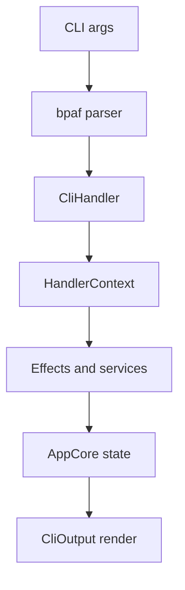
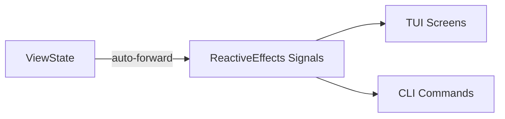
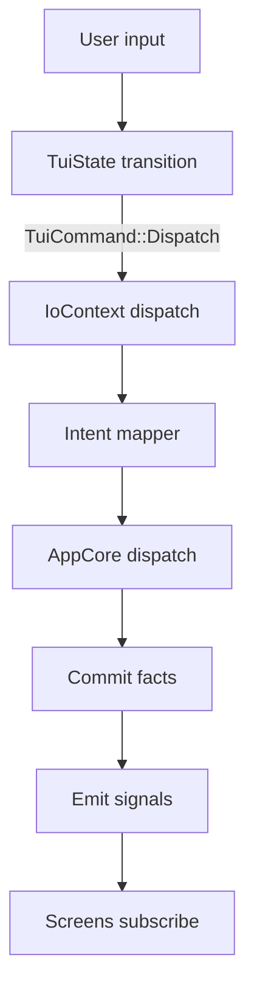

# CLI and Terminal User Interface

This document describes the `aura-terminal` user interface layer. It covers the non-interactive CLI commands and the iocraft-based TUI. It also describes how both frontends share `aura-app` through `AppCore` and the reactive signal system.

Demo mode is compiled only with `--features development`.

## Goals and constraints

The CLI and the TUI are thin frontends over `AppCore`. They should not become alternate application runtimes. They should also avoid owning long-lived domain state.

Both frontends must respect the guard chain, journaling, and effect system boundaries described in [Aura System Architecture](001_system_architecture.md). The CLI optimizes for scriptability and stable output. The TUI optimizes for deterministic navigation with reactive domain data.

## Concepts

- Command. A user-invoked operation such as `aura status` or `aura chat send`.
- Handler. A CLI implementation function that uses `HandlerContext` and returns `CliOutput`.
- Screen. A routed view that renders domain data and local UI state.
- Modal. A blocking overlay that captures focus. Modals are queued and only one can be visible at a time.
- Toast. A transient notification. Toasts are queued and only one can be visible at a time.
- Signal. A reactive stream of domain values from `aura-app`.
- Intent. A journaled application command dispatched through `AppCore.dispatch`.

## Running

Run the CLI and the TUI from the development shell.

### CLI

The CLI entry point is `crates/aura-terminal/src/main.rs`. Commands are parsed by bpaf and dispatched to `CliHandler` and the handler modules.

```bash
nix develop
aura status -c ./aura.toml
aura chat list
```

This enters the Nix development environment and runs two example commands. CLI commands return structured `CliOutput` and then render it to stdout and stderr.

### TUI production

The production TUI command is `aura tui`.

```bash
nix develop
aura tui
```

This launches the production TUI and enters fullscreen mode.

### TUI demo

To run the demo, compile with `--features development` and pass `--demo`.

```bash
nix develop
cargo run -p aura-terminal --features development -- aura tui --demo
```

This launches a deterministic demo environment with simulated peers.

### Useful flags and environment variables

CLI:
- `aura -v` enables verbose output and logs
- `aura -c CONFIG` selects a global config file

TUI:
- `aura tui --data-dir DIR` sets the Aura data directory. It falls back to `AURA_PATH`.
- `aura tui --device-id DEVICE` selects the device identifier for the session.
- `AURA_TUI_ALLOW_STDIO=1` disables fullscreen stderr redirection. It is intended for debugging.
- `AURA_TUI_LOG_PATH` overrides the TUI log file location.

## Architecture overview

The CLI and the TUI share the same backend boundary. Both construct an `AppCore` value and use it as the primary interface to domain workflows and views. Both also rely on `aura-agent` for effect handlers and runtime services.

The user interface split is:
- `crates/aura-app` provides portable domain logic, reactive state, and signals through `AppCore`.
- `crates/aura-terminal/src/cli/` defines bpaf parsers and CLI argument types.
- `crates/aura-terminal/src/handlers/` implements CLI commands and shared terminal glue.
- `crates/aura-terminal/src/tui/` implements iocraft UI code and deterministic navigation.

## Relationship to `aura-app`

`AppCore` is the shared boundary for both frontends. It owns reactive state and provides stable APIs for dispatching intents and reading derived views. It also defines the signal catalog in `aura_app::signal_defs`.

The frontends use `AppCore` in two ways:
- Trigger work by calling `AppCore.dispatch(intent)` or by calling effect-backed handlers that ultimately produce journaled facts.
- Read state by reading views or by subscribing to signals for push-based updates.

This split keeps domain semantics centralized. It also makes it possible to reuse the same workflows in multiple user interfaces.

## Shared infrastructure in `aura-terminal`

CLI commands are parsed in `crates/aura-terminal/src/cli/commands.rs` and routed through `crates/aura-terminal/src/main.rs`. Implementations live under `crates/aura-terminal/src/handlers/` and use `HandlerContext` from `crates/aura-terminal/src/handlers/handler_context.rs`. Handler functions typically return `CliOutput` for testable rendering.

The TUI launcher lives in `crates/aura-terminal/src/handlers/tui.rs`. It sets up tracing and constructs the `IoContext` and callback registry. The fullscreen stdio policy is defined in `crates/aura-terminal/src/handlers/tui_stdio.rs`.

## CLI execution model

The CLI is request and response. Each command parses arguments, runs one handler, and exits. Long-running commands such as daemon modes should still use the same effect boundaries.



This diagram shows the main CLI path from parsing to rendering. Some handlers also read derived state from `AppCore` after effects complete.

## Reactive data model

The reactive system is owned by `aura-app`. Domain state is maintained in `ViewState` (`aura-app/src/views/state.rs`), which uses `futures-signals` `Mutable<T>` for reactive updates. Signals are defined in `aura_app::signal_defs` and are automatically derived from ViewState changes via the signal forwarding infrastructure.

### ViewState as single source of truth

ViewState is the canonical source for all domain state. ReactiveEffects signals (CHAT_SIGNAL, CONTACTS_SIGNAL, etc.) are automatically updated when ViewState changes. This pattern eliminates the dual-write bug class where ViewState and signals could become desynchronized.



External code should update state through AppCore methods (like `add_contact()`, `set_contact_guardian_status()`) rather than emitting directly to signals. The SignalForwarder in `aura-app/src/core/signal_sync.rs` subscribes to ViewState's Mutable signals and forwards changes to ReactiveEffects signals automatically.

The CLI usually reads state at a point in time. It can still use signals for watch-like commands or daemon commands. When a command needs continuous updates, it should subscribe to the relevant signals and render incremental output.

### Two-phase subscription

Subscriptions follow a two-phase pattern. Read the current value first. Then subscribe for updates.

```rust
let current = {
    let core = app_core.read().await;
    core.views().snapshot().contacts  // Read from ViewState
};

let mut stream = {
    let core = app_core.read().await;
    core.subscribe(&*CONTACTS_SIGNAL)  // Subscribe for updates
};
```

This pattern avoids an initial blank render and avoids missing updates between initial load and subscription. It is used heavily by screens, and it is also suitable for CLI commands that want a live stream.

### Subscriptions and ownership

Long-lived subscriptions that drive global TUI elements live in `crates/aura-terminal/src/tui/screens/app/subscriptions.rs`. Screen-local subscriptions should live with the screen module.

Subscriptions should be owned by the component that renders the data. A subscription should not mutate `TuiState` unless it is updating navigation, focus, or overlay state.

## Deterministic UI model

The TUI separates domain state from UI state. Domain state is push-based and comes from `aura-app` signals. UI state is deterministic and lives in `TuiState`.

Navigation, focus, input buffers, modal queues, and toast queues are updated by a pure transition function. The entry point is `crates/aura-terminal/src/tui/state_machine.rs`. The runtime executes `TuiCommand` values in `crates/aura-terminal/src/tui/runtime.rs`.

## Dispatch bridge and intents

The TUI dispatch path uses `IoContext` in `crates/aura-terminal/src/tui/context/io_context.rs`. It maps UI actions to intent-based dispatch through `AppCore` where possible. It also supports operational commands for local behavior.

The intent path is the default. It keeps UI-driven work aligned with journaling and guard evaluation. Use the operational path only for local or test-only behavior.



This diagram shows the default journaled TUI path. The operational path bypasses journal commits. It still emits signals and errors for UI updates.

## Screens, modals, and callbacks

The root iocraft component is in `crates/aura-terminal/src/tui/screens/app/shell.rs`. Global modals live in `crates/aura-terminal/src/tui/screens/app/modal_overlays.rs`. Long-lived signal subscriptions for the shell live in `crates/aura-terminal/src/tui/screens/app/subscriptions.rs`.

Modals and toasts are routed through explicit queues in `TuiState`. The modal enum is `QueuedModal` in `crates/aura-terminal/src/tui/state_machine.rs`. Avoid per-modal `visible` flags.

Callbacks are registered in `crates/aura-terminal/src/tui/callbacks/`. Asynchronous results are surfaced through `UiUpdate` in `crates/aura-terminal/src/tui/updates.rs`. Prefer subscribing to domain signals when a signal already exists.

## Fullscreen I/O policy

Writing to stderr while iocraft is in fullscreen can corrupt the terminal buffer. The TUI redirects stderr away from the terminal while fullscreen is active. Tracing is written to a log file.

The policy is enforced with type-level stdio tokens in `crates/aura-terminal/src/handlers/tui_stdio.rs`. The token used before fullscreen is consumed while iocraft is running. This prevents accidental `println!` and `eprintln!` calls in the fullscreen scope.

This policy aligns with [Privacy and Information Flow](003_information_flow_contract.md) and [Effect System and Runtime](106_effect_system_and_runtime.md).

## Errors and user feedback

Domain and dispatch failures are surfaced as errors. Errors are emitted through `aura_app::signal_defs::ERROR_SIGNAL`. Screens can render errors as toasts or modal content.

CLI commands should return errors through `TerminalResult` and render them through `CliOutput`. Avoid printing error text directly from deep helper functions. Prefer returning structured error types.

## Invariants and common pitfalls

The state machine owns navigation, focus, and overlay visibility. Screen components should render `TuiState` and should not mutate it directly. They should send events and let the state machine decide transitions.

The domain owns the reactive state. Avoid caching domain data in `TuiState`. Prefer subscribing to `aura-app` signals and deriving view props inside the screen component.

Common pitfalls:
- Calling `println!` and `eprintln!` while fullscreen is active
- Storing domain state in `TuiState` instead of subscribing to signals
- Adding per-modal `visible` flags instead of using `QueuedModal` and the modal queue
- Using `UiUpdate` as a general event bus instead of subscribing to signals

## Testing strategy

The CLI should be tested with handler unit tests and structured output assertions. Prefer pure formatting helpers and `CliOutput` snapshots over stdout capture.

The deterministic boundary for the TUI is the state machine. Prefer unit tests that call `transition()` directly for navigation and modal behavior. For headless terminal event tests, use `TuiRuntime<T>` from `crates/aura-terminal/src/tui/runtime.rs` with a mock `TerminalEffects` handler.

## Code map

```
crates/aura-terminal/src/
  main.rs
  cli/
    commands.rs
  handlers/
    mod.rs
    handler_context.rs
    tui.rs
    tui_stdio.rs
  tui/
    context/
    screens/
      app/
        shell.rs
        modal_overlays.rs
        subscriptions.rs
    state_machine.rs
    runtime.rs
    hooks.rs
    effects/
    components/
```

This map shows the primary module boundaries for the CLI and the TUI. CLI logic should live under `handlers/` and `cli/`. TUI view logic should live under `tui/`.

## Demo mode

Demo mode is under `crates/aura-terminal/src/demo/`. It compiles only with `--features development`. Production builds should not require demo-only types or props.

Demo mode supports convenience shortcuts. Invite code entry supports `Ctrl+a` and `Ctrl+l` when demo codes are present.

## Testing

Run tests inside the development shell.

### Standard

```bash
just test-crate aura-terminal
```

This runs the `aura-terminal` test suite in the standard project workflow.

### Offline

For offline testing, use the workspace offline mode.

```bash
CARGO_NET_OFFLINE=true cargo test -p aura-terminal --tests --offline
```

This runs the full `aura-terminal` test suite without network access.

## See also

- [Aura System Architecture](001_system_architecture.md)
- [Privacy and Information Flow](003_information_flow_contract.md)
- [Effect System and Runtime](106_effect_system_and_runtime.md)
