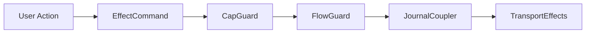

# Terminal User Interface

This document specifies the ratatui-based TUI for the Aura CLI. The TUI provides an IRC-like chat interface with support for threshold account management, guardian relationships, recovery coordination, and demo mode.

## 1. Architecture

### 1.1 Design Principles

The TUI is stateless between sessions. All state derives from the effect system and the local store. The architecture uses real effects throughout for end-to-end testing fidelity.

Query subscriptions use existing journal and CRDT infrastructure. Conditional compilation excludes simulator and demo code from production builds. The architecture uses Biscuit for queries and the existing guard chain for authorization.

### 1.2 Module Structure

The TUI lives in `aura-cli/src/tui/`. The structure separates concerns into screens, components, reactive infrastructure, and effects.

```
tui/
├── mod.rs           # Public exports
├── app.rs           # Main application
├── input.rs         # Input handling
├── styles.rs        # Theming
├── commands.rs      # IRC command parser
├── screens/         # Screen implementations
├── components/      # Reusable widgets
├── reactive/        # Query and view types
├── effects/         # Effect bridge
└── demo/            # Demo mode (feature-gated)
```

The demo module compiles only with the development feature flag.

## 2. State Management

### 2.1 Ephemeral State

The TUI maintains ephemeral state that is rebuilt each session.

```rust
pub struct TuiState {
    pub current_screen: ScreenType,
    pub screen_stack: Vec<ScreenType>,
    pub focused: FocusTarget,
    pub input_mode: InputMode,
    pub input_buffer: String,
    pub command_history: Vec<String>,
    pub notifications: VecDeque<Toast>,
    pub scroll_positions: HashMap<ScreenType, usize>,
    #[cfg(feature = "development")]
    pub demo_state: Option<DemoState>,
}
```

This structure tracks navigation, input, and transient UI elements. Demo state compiles only with the development feature.

### 2.2 Input Modes

The TUI supports three input modes.

```rust
pub enum InputMode {
    Normal,
    Editing,
    Command,
}
```

Normal mode handles tab navigation and arrow keys. Editing mode handles text input. Command mode handles the command palette.

### 2.3 Local Store

User preferences persist via encrypted local storage in `aura-store`.

```rust
pub struct LocalStore {
    path: PathBuf,
    cipher: ChaCha20Poly1305,
}

pub struct LocalData {
    pub display_name: String,
    pub theme: ThemePreference,
    pub known_contacts: Vec<ContactCache>,
    pub recent_channels: Vec<ChatGroupId>,
    pub last_active_channel: Option<ChatGroupId>,
}
```

The local store encrypts data at rest using keys derived from the authority. This is reusable across CLI commands.

## 3. Effect Bridge

### 3.1 Bridge Structure

The effect bridge connects the TUI to the real effect system.

```rust
pub struct EffectBridge {
    ctx: EffectContext,
    effects: Arc<AuraEffectSystem>,
    command_tx: mpsc::UnboundedSender<EffectCommand>,
    result_rx: mpsc::UnboundedReceiver<EffectResult>,
    event_rx: broadcast::Receiver<AuraEvent>,
}
```

Commands dispatch asynchronously. Results return via channel. Events stream from the effect system to the TUI.

### 3.2 Effect Commands

Commands represent user actions.

```rust
pub enum EffectCommand {
    CreateAuthority(ThresholdConfig),
    LoadAuthority(AuthorityId),
    CreateInvitation(InvitationRequest),
    AcceptInvitation(InvitationId),
    SendMessage(ChatGroupId, String),
    CreateChannel(ChannelConfig),
    RequestGuardian(AuthorityId),
    AcceptGuardianRequest(RequestId),
    InitiateRecovery(RecoveryRequest),
    ApproveRecovery(RecoveryApproval),
}
```

The bridge dispatches these commands to the effect system and handles responses.

### 3.3 Events

Events flow from the effect system to the TUI.

```rust
pub enum AuraEvent {
    MessageReceived(ChatMessage),
    InvitationReceived(InvitationEnvelope),
    GuardianRequestReceived(GuardianRequest),
    RecoveryStatusChanged(RecoveryStatus),
    ChannelUpdated(ChatGroupId),
}
```

The TUI subscribes to events and updates reactive views accordingly.

## 4. Reactive System

### 4.1 Dynamic Values

The `Dynamic<T>` type represents observable values.

```rust
pub struct Dynamic<T> {
    inner: Arc<DynamicInner<T>>,
}

impl<T: Clone + Send + Sync + 'static> Dynamic<T> {
    pub fn get(&self) -> T;
    pub fn subscribe(&self) -> broadcast::Receiver<T>;
    pub fn map<U, F>(&self, f: F) -> Dynamic<U>;
}
```

Subscribers receive updates when values change. The map function creates derived dynamics.

### 4.2 Query Types

Query types generate Biscuit Datalog strings.

```rust
pub struct ChannelsQuery {
    pub authority_id: AuthorityId,
}

impl ChannelsQuery {
    pub fn to_datalog(&self) -> String {
        format!(r#"
            ?channels <- channels()
            where authority({}), can_read({}, ?channels)
        "#, self.authority_id, self.authority_id)
    }
}
```

Query types for channels, messages, guardians, recovery, and invitations follow this pattern.

### 4.3 View Types

View types aggregate reactive state for screens.

```rust
pub struct ChatView {
    pub channels: Dynamic<Vec<ChannelSummary>>,
    pub active_channel: Dynamic<Option<ChatGroupId>>,
    pub messages: Dynamic<Vec<ChatMessage>>,
    pub members: Dynamic<Vec<MemberInfo>>,
}

pub struct GuardiansView {
    pub guardians: Dynamic<GuardianStatus>,
    pub pending_requests: Dynamic<Vec<GuardianRequest>>,
    pub recovery_state: Dynamic<Option<RecoveryState>>,
}
```

Views subscribe to journal facts via database effects. Query execution uses Biscuit Datalog. Results cache via CRDT handlers.

### 4.4 Delta Streaming

Lists use delta streaming for efficient updates.

```rust
pub enum Delta<T> {
    Reset(Vec<T>),
    Insert { index: usize, item: T },
    Remove { index: usize },
    Update { index: usize, item: T },
    Batch(Vec<Delta<T>>),
}
```

Facts are append-only. The insert and update variants handle most cases. Remove applies only to derived views.

## 5. Screens

### 5.1 Screen Types

The TUI provides screens for different workflows.

| Screen | Purpose |
|--------|---------|
| Welcome | Login or account creation |
| Onboarding | Account setup wizard |
| Chat | IRC-style messaging |
| Contacts | Contact management |
| Guardians | Guardian dashboard |
| Recovery | Recovery flow |
| Settings | Configuration |
| Invitations | Invitation handling |

### 5.2 Chat Screen Layout

The chat screen uses an IRC-style layout.

```
+------------------------------------------------------------------+
| Status                                                           |
+-------------+-----------------------------------------+----------+
| Channels    |  Messages                               | Members  |
+-------------+-----------------------------------------+----------+
| Input                                                            |
+------------------------------------------------------------------+
```

The status bar shows account information. The sidebar shows channels and guardian status. The main area shows messages. The input area handles message composition.

### 5.3 Navigation

Navigation uses simple tab-based controls.

| Key | Action |
|-----|--------|
| Tab | Cycle focus |
| Arrows | Navigate within panel |
| Enter | Select or activate |
| Esc | Cancel or back |
| / | Open command input |
| ? | Help overlay |

The architecture supports future vim mode extension.

## 6. Component System

### 6.1 Component Trait

Components implement a common trait.

```rust
pub trait Component {
    fn update(&mut self, msg: Message) -> Option<Message>;
    fn view(&self, frame: &mut Frame, area: Rect);
}

pub trait Focusable: Component {
    fn focus(&mut self);
    fn blur(&mut self);
    fn is_focused(&self) -> bool;
}
```

Components handle updates and render views. Focusable components participate in tab navigation.

### 6.2 Core Components

The TUI provides reusable components.

| Component | Purpose |
|-----------|---------|
| ChannelList | Sidebar channel navigation |
| MessageList | Scrollable message display |
| MessageInput | Text input with history |
| StatusBar | Account and connection status |
| Toast | Notification display |
| Modal | Dialog presentation |
| CommandPalette | Command search |

### 6.3 Focus Management

The `FocusManager` handles tab navigation.

```rust
pub struct FocusManager {
    targets: Vec<FocusTarget>,
    current: usize,
}

impl FocusManager {
    pub fn focus_next(&mut self);
    pub fn focus_prev(&mut self);
    pub fn current(&self) -> FocusTarget;
}
```

Focus cycles through registered targets. Components respond to focus and blur events.

## 7. Demo Mode

### 7.1 Feature Flag

Demo mode compiles only with the development feature.

```toml
[features]
default = []
development = [
    "dep:aura-simulator",
    "dep:aura-testkit",
]
```

Production builds exclude simulator and testkit dependencies. Expected savings are 4 to 6 MB.

### 7.2 Demo Configuration

Demo mode configures simulated participants.

```rust
#[cfg(feature = "development")]
pub struct DemoConfig {
    pub simulator: SimulatorHandle,
    pub alice: SimulatedAuthority,
    pub charlie: SimulatedAuthority,
    pub current_phase: DemoPhase,
    pub auto_advance: bool,
}
```

The simulator automates Alice and Charlie. Bob is human-controlled.

### 7.3 Demo Phases

The demo follows eight phases matching the recovery demonstration.

| Phase | Description |
|-------|-------------|
| 1 | Alice and Charlie setup via simulator |
| 2 | Bob creates 2-of-3 account |
| 3 | Guardian setup with automated approval |
| 4 | Group chat with automated responses |
| 5 | Simulated device loss |
| 6 | Recovery initiation |
| 7 | Guardian coordination |
| 8 | Post-recovery verification |

Each phase advances based on user actions and simulator responses.

## 8. Implementation Location

The TUI implementation lives in `aura-cli/src/tui/`. Screen implementations live in the screens subdirectory. Components live in the components subdirectory. Reactive types live in the reactive subdirectory. Effect integration lives in the effects subdirectory.

Demo mode code lives in the demo subdirectory and compiles only with the development feature.

## 9. Integration

### 9.1 Database Integration

The TUI uses the database layer for reactive queries.

| TUI Concept | Database Component |
|-------------|-------------------|
| Query execution | Biscuit Datalog |
| Fact subscriptions | JournalEffects |
| View caching | CvHandler |
| Delta sync | DeltaHandler |
| Authorization | Guard chain |

Query subscriptions flow through the database effects. Updates propagate to dynamic views.

### 9.2 Guard Chain Integration

TUI operations flow through the guard chain.



Commands dispatch through the effect bridge. Guards enforce authorization and budget constraints. Journal commits persist state changes.

## See Also

[Database Architecture](113_database.md) describes query execution. [Social Architecture](114_social_architecture.md) covers blocks and neighborhoods. [Effect System and Runtime](106_effect_system_and_runtime.md) details effect implementation.
