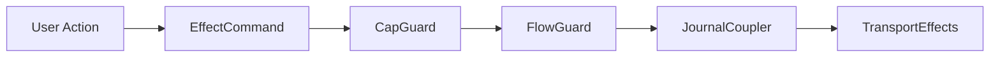

# Terminal User Interface

This document specifies the iocraft-based TUI for `aura-terminal`. The TUI provides an IRC-like chat interface with support for threshold account management, guardian relationships, recovery coordination, and demo mode.

Demo mode code is conditionally compiled with the `development` feature flag.

## 1. Architecture

### 1.1 Design Principles

The TUI is stateless between sessions. All state derives from the effect system and the local store. The architecture uses real effects throughout for end-to-end testing fidelity.

Query subscriptions use existing journal and CRDT infrastructure. Conditional compilation excludes simulator and demo code from production builds. The architecture uses Biscuit for queries and the existing guard chain for authorization.

### 1.2 iocraft Component Architecture

The TUI uses iocraft's React-like component model for declarative rendering and built-in event handling.

**Component Model**
- **Declarative**: Components are functions annotated with `#[component]` that return element trees
- **Props-based**: Components receive typed Props structs for configuration
- **Hooks**: State management via `use_state`, `use_context`, `use_async`, and custom hooks
- **Fullscreen mode**: iocraft manages terminal setup/teardown and event loop internally

**State Management**
- **Local state**: `use_state::<T>()` for component-local mutable state
- **Context**: `use_context::<AppCoreContext>()` for shared AppCore access
- **Signal subscription**: `use_future` + `signal.for_each()` for push-based reactive updates
- **Snapshots**: `snapshot()` for initial state, signals for live updates

**Event Handling**
- **Keyboard events**: iocraft's built-in handler with `KeyEvent` matching
- **Focus management**: Native focus tracking per component
- **Callbacks**: Props include `on_*` callbacks for parent-child communication

**Example Component with Signal Subscription**
```rust
#[derive(Default, Props)]
pub struct ChatScreenProps {
    pub channels: Vec<Channel>,      // Initial data from props (fallback)
    pub messages: Vec<Message>,
    pub on_send: Option<SendCallback>,
}

#[component]
pub fn ChatScreen(props: &ChatScreenProps, mut hooks: Hooks) -> impl Into<AnyElement<'static>> {
    // Try to get AppCoreContext for reactive signal subscription
    let app_ctx = hooks.try_use_context::<AppCoreContext>();

    // Initialize reactive state from props (used when no context or as initial values)
    let reactive_messages = hooks.use_state({
        let initial = props.messages.clone();
        move || initial
    });

    // Subscribe to chat signal updates if AppCoreContext is available
    if let Some(ctx) = app_ctx {
        hooks.use_future({
            let mut reactive_messages = reactive_messages.clone();
            let app_core = ctx.app_core.clone();
            async move {
                use futures_signals::signal::SignalExt;

                // Get signal from AppCore (brief lock, then release)
                let signal = {
                    let core = app_core.read().await;
                    core.chat_signal()
                };

                // Subscribe - runs until component unmounts
                signal.for_each(|chat_state| {
                    // Convert and update state - triggers re-render
                    let messages = chat_state.messages.iter()
                        .map(|m| Message::from(m))
                        .collect();
                    reactive_messages.set(messages);
                    async {}
                }).await;
            }
        });
    }

    // Use reactive state for rendering
    let messages = reactive_messages.read().clone();

    element! {
        Box(flex_direction: FlexDirection::Column) {
            BorderedSection(title: "Messages") {
                #(for msg in messages.iter() {
                    element! {
                        Text(content: format!("{}: {}", msg.sender, msg.content))
                    }
                })
            }
            KeyHints(hints: vec![("↑↓←→", "Navigate"), ("Enter", "Send")])
        }
    }
}
```

**Data Flow Summary**:
```
User Input → iocraft Event Handler → AppCoreContext.dispatch() → Effects →
Facts → ViewState (Mutable<T>) → Signal emit → use_future callback →
State<T>.set() → Component Re-render (automatic)
```

**Key Insights**:
- iocraft handles the render loop internally
- Components use `try_use_context::<AppCoreContext>()` to access AppCore
- Signal subscription via `use_future` + `signal.for_each()` is push-based (no polling!)
- State updates via `state.set()` trigger automatic re-renders
- Props provide initial/fallback data; signals provide live updates

## 2. State Management

### 2.1 Ephemeral State

The TUI maintains ephemeral state that is rebuilt each session.

```rust
pub struct TuiState {
    pub current_screen: ScreenType,
    pub screen_stack: Vec<ScreenType>,
    pub focused: FocusTarget,
    pub input_mode: InputMode,
    pub input_buffer: String,
    pub command_history: Vec<String>,
    pub notifications: VecDeque<Toast>,
    pub scroll_positions: HashMap<ScreenType, usize>,
    #[cfg(feature = "development")]
    pub demo_state: Option<DemoState>,
}
```

This structure tracks navigation, input, and transient UI elements. Demo state compiles only with the development feature.

### 2.2 Input Modes

The TUI supports three input modes.

```rust
pub enum InputMode {
    Normal,
    Editing,
    Command,
}
```

Normal mode handles tab navigation and arrow keys. Editing mode handles text input. Command mode handles the command palette.

### 2.3 Local Store

User preferences persist via encrypted local storage in `aura-store`.

```rust
pub struct LocalStore {
    path: PathBuf,
    cipher: ChaCha20Poly1305,
}

pub struct LocalData {
    pub display_name: String,
    pub theme: ThemePreference,
    pub known_contacts: Vec<ContactCache>,
    pub recent_channels: Vec<ChatGroupId>,
    pub last_active_channel: Option<ChatGroupId>,
}
```

The local store encrypts data at rest using keys derived from the authority. This is reusable across CLI commands.

## 3. Effect Bridge

### 3.1 Architecture

The effect bridge connects the TUI to AppCore via two dispatch paths:

1. **Intent Commands** (journaled): SendMessage, CreateChannel, etc.
   - Mapped via `command_to_intent()` to Intent types
   - Dispatched through `AppCore.dispatch(Intent)`
   - Flow through guard chain and commit facts

2. **Operational Commands** (non-journaled): Ping, ForceSync, ListPeers, etc.
   - Handled by `OperationalHandler`
   - Update signals directly without journaling

### 3.2 Effect Commands

Commands represent user actions dispatched via `IoContext.dispatch()`:

```rust
pub enum EffectCommand {
    // Chat operations
    SendMessage { channel: String, content: String },
    CreateChannel { name: String, topic: Option<String>, members: Vec<String> },
    SetTopic { channel: String, text: String },
    RetryMessage { message_id: String, channel: String, content: String },

    // Invitation operations
    CreateInvitation { invitation_type: String, message: Option<String>, ttl_secs: Option<u64> },
    AcceptInvitation { invitation_id: String },
    DeclineInvitation { invitation_id: String },
    ImportInvitation { code: String },

    // Recovery operations
    StartRecovery,
    InviteGuardian { contact_id: Option<String> },
    SubmitGuardianApproval { guardian_id: String },

    // Settings operations
    UpdateMfaPolicy { require_mfa: bool },
    UpdateNickname { name: String },
    UpdateThreshold { threshold_k: u8, threshold_n: u8 },
    AddDevice { device_name: String },
    RemoveDevice { device_id: String },

    // Contact operations
    UpdateContactPetname { contact_id: String, petname: String },
    ToggleContactGuardian { contact_id: String },
    StartDirectChat { contact_id: String },
    InviteLanPeer { authority_id: String, address: String },

    // Block operations
    SendBlockInvitation { contact_id: String },
    MovePosition { neighborhood_id: String, block_id: String, depth: String },
    GrantSteward { target: String },
    RevokeSteward { target: String },

    // Operational (non-journaled)
    Ping,
    ForceSync,
    ListPeers,
}
```

### 3.3 Events

Events flow from the effect system to the TUI for demo mode inter-agent communication:

```rust
pub enum AuraEvent {
    MessageReceived { channel: String, sender: String, content: String },
    InvitationReceived { invitation_id: String, from: String },
    GuardianRequestReceived { request_id: String, from: String },
    RecoveryStatusChanged { status: String },
    ChannelUpdated { channel_id: String },
    PeerDiscovered { authority_id: String, address: String },
}
```

Events can be filtered via `EventFilter` for targeted subscriptions.

## 4. Reactive System Architecture

### 4.1 Three-Layer Stratification

The reactive system is structured in three distinct layers, each with clear responsibilities:

**Level 0: Facts (Journal)**
- Grow-only fact lattice stored in the journal
- Source of truth for all application data
- Append-only, immutable operations
- Facts flow from effect system commits
- Domain facts stored via `RelationalFact::Generic` with type-specific payloads
- Examples: `ChatFact::MessageSent` (via Generic), `RelationalFact::GuardianBinding`
- Domain fact types: `aura_chat::ChatFact`, `aura_invitation::InvitationFact`, `aura_relational::ContactFact`

**Level 1: Views (Reactive Layer)**
- Derived state computed from journal facts
- `Dynamic<T>` wrappers for observable values
- FRP combinators for composition (`map`, `combine`, `filter`)
- Delta-based incremental updates
- Deterministic and simulatable
- Examples: `ChatView`, `GuardiansView`, `RecoveryView`

**Level 2: UI (Screen Layer)**
- iocraft components driven by Level 1 reactive views via IoContext
- Ephemeral local state via `use_state` hooks (cursor position, scroll, input buffer)
- No business logic - pure presentation
- Screen types: Chat, Block, Contacts, Recovery, etc.

**Critical Principle:** State flows downward only (Facts → Views → UI). UI never writes directly to facts. User actions trigger effects, which commit facts, which update views, which re-render UI.

### 4.2 Data Flow Pipeline

The complete reactive pipeline:

```
┌─────────────┐
│ User Action │ (key press, mouse click)
└──────┬──────┘
       │
       ▼
┌─────────────┐
│   Command   │ (IRC command or UI action)
└──────┬──────┘
       │
       ▼
┌─────────────┐
│   Effect    │ (via EffectBridge)
└──────┬──────┘
       │
       ▼
┌─────────────┐
│  Guard Chain│ (CapGuard → FlowGuard → JournalCoupler)
└──────┬──────┘
       │
       ▼
┌─────────────┐
│  Fact Commit│ (journal.insert_fact())
└──────┬──────┘
       │
       ▼
┌─────────────┐
│ Fact Stream │ (FactStreamAdapter batches facts, 5ms window)
└──────┬──────┘
       │
       ▼
┌──────────────┐
│ReactScheduler│ (topological sort, glitch-free updates)
└──────┬───────┘
       │
       ▼
┌──────────────┐
│  Reduction   │ (facts → deltas via ViewReduction trait)
└──────┬───────┘
       │
       ▼
┌──────────────┐
│ Delta Apply  │ (view.apply_delta() updates state)
└──────┬───────┘
       │
       ▼
┌──────────────┐
│ View Update  │ (broadcast::Sender<ViewUpdate>)
└──────┬───────┘
       │
       ▼
┌──────────────┐
│Screen Update │ (screen subscribes, re-renders)
└──────────────┘
```

**Key Performance Characteristics:**
- **Batching:** Facts accumulated in 5ms window to reduce update churn
- **Topological Ordering:** Views updated in dependency order (no glitches)
- **Delta Propagation:** Only changed data propagates (not full snapshots)
- **Event-Driven:** Zero CPU usage when idle (no polling)

### 4.3 Reactive State Types

The TUI uses view types from `aura_app::views` and reactive primitives from `aura_agent::reactive`:

**View Types** (from `aura_app::views`):
```rust
// Chat views
pub use aura_app::views::chat::{Channel, ChannelType, Message};
pub use aura_app::views::contacts::Contact;
pub use aura_app::views::invitations::{Invitation, InvitationDirection, InvitationStatus, InvitationType};
pub use aura_app::views::recovery::{Guardian, GuardianStatus, RecoveryApproval, RecoveryState};
```

**Query Types** (from `aura_app::queries`):
```rust
pub use aura_app::queries::{
    ChannelsQuery, ContactsQuery, GuardiansQuery,
    InvitationsQuery, MessagesQuery, RecoveryQuery,
};
```

**Reactive Primitives** (from `aura_agent::reactive`):
```rust
pub use aura_agent::reactive::Dynamic;
pub use aura_agent::reactive::ReactiveScheduler;
```

**TUI-Specific View Types** (from `tui::reactive::views`):
```rust
// Neighborhood and block types
pub struct BlockInfo { id: String, name: Option<String>, resident_count: usize, ... }
pub struct NeighborhoodBlock { id: String, name: String, adjacencies: Vec<BlockAdjacency>, ... }
pub struct Resident { id: String, display_name: String, role: ResidentRole, ... }

// Traversal state
pub enum TraversalDepth { Street, Lobby, Interior }
pub struct TraversalPosition { neighborhood_id: String, block_id: Option<String>, depth: TraversalDepth }
```

**Key Properties**:
- **Canonical view types** from `aura_app` ensure consistency across all interfaces
- **Query types** implement Datalog generation for fact retrieval
- **TUI-specific types** extend canonical types with presentation concerns
- **Dynamic<T>** provides reactive updates via futures-signals

### 4.4 Adding a New Reactive View

To add a new reactive view to the TUI, follow these steps:

**Step 1: Define Fact Types** (if needed)
Add new fact types to `aura-journal/src/fact.rs`:

```rust
pub enum RelationalFact {
    // ... existing variants

    /// New fact type for your domain
    YourNewFact {
        field1: SomeId,
        field2: String,
        // ...
    },
}
```

**Step 2: Define View State Types**
Add view types in `aura-terminal/src/tui/reactive/views.rs`:

```rust
use crate::tui::reactive::signals::{ReactiveState, ReactiveVec};

#[derive(Clone)]
pub struct YourView {
    items: ReactiveVec<YourItem>,
    selected: ReactiveState<Option<String>>,
    status: ReactiveState<YourStatus>,
}

impl YourView {
    pub fn new() -> Self {
        Self {
            items: ReactiveVec::new(),
            selected: ReactiveState::new(None),
            status: ReactiveState::new(YourStatus::default()),
        }
    }

    // Synchronous getters
    pub fn items(&self) -> Vec<YourItem> {
        self.items.get_cloned()
    }

    pub fn selected(&self) -> Option<String> {
        self.selected.get()
    }

    // Signal exposure for reactive UI
    pub fn items_signal(&self) -> impl SignalVec<Item = YourItem> {
        self.items.signal_vec()
    }

    pub fn selected_signal(&self) -> impl Signal<Item = Option<String>> {
        self.selected.signal()
    }
}
```

**Note**: No `broadcast::Sender` needed - signals handle notifications automatically!

**Step 3: Define Delta Types**
Add delta types in `aura-agent/src/reactive/scheduler.rs`:

```rust
pub enum YourDelta {
    ItemCreated { id: ItemId, data: ItemData },
    ItemUpdated { id: ItemId, changes: Changes },
    ItemDeleted { id: ItemId },
}
```

**Step 4: Implement Reduction Function**
Add reduction logic in `aura-agent/src/reactive/scheduler.rs`:

```rust
pub struct YourReduction;

impl ViewReduction<YourDelta> for YourReduction {
    fn reduce(&self, facts: &[Fact]) -> Vec<YourDelta> {
        let mut deltas = Vec::new();

        for fact in facts {
            if let FactContent::Relational(RelationalFact::YourNewFact { field1, field2 }) = &fact.content {
                deltas.push(YourDelta::ItemCreated {
                    id: field1.clone(),
                    data: field2.clone(),
                });
            }
        }

        deltas
    }
}
```

**Step 5: Implement `apply_delta()` Method**
Add delta application in your view:

```rust
impl YourView {
    pub async fn apply_delta(&self, delta: YourDelta) {
        let mut state = self.state.write().await;

        match delta {
            YourDelta::ItemCreated { id, data } => {
                state.items.push(YourItem { id, data });
                let _ = self.update_tx.send(YourViewUpdate::ItemAdded);
            }
            // ... other delta cases
        }
    }
}
```

**Step 6: Register with ReactiveScheduler**
Wire your view into the scheduler in `aura-terminal/src/tui/context.rs`:

```rust
// Create view adapter
let your_adapter = ViewAdapter::new(
    "your_view",
    YourReduction,
    Arc::clone(&your_view),
);

// Register with scheduler
scheduler.register_view(Box::new(your_adapter)).await?;
```

**Step 7: Subscribe in Screen Component**
Use iocraft's `use_future` hook to subscribe to signals:

```rust
#[component]
pub fn YourScreen(props: &YourScreenProps, mut hooks: Hooks) -> impl Into<AnyElement<'static>> {
    // Get AppCoreContext for signal access
    let app_ctx = hooks.try_use_context::<AppCoreContext>();

    // Initialize state from props (fallback for demo mode)
    let reactive_items = hooks.use_state({
        let initial = props.items.clone();
        move || initial
    });

    // Subscribe to signal updates when context is available
    if let Some(ctx) = app_ctx {
        hooks.use_future({
            let mut reactive_items = reactive_items.clone();
            let app_core = ctx.app_core.clone();
            async move {
                use futures_signals::signal::SignalExt;

                // Get signal (brief lock then release)
                let signal = {
                    let core = app_core.read().await;
                    core.your_signal()
                };

                // Subscribe - updates State<T> which triggers re-render
                signal.for_each(|new_state| {
                    let items = new_state.items.iter()
                        .map(|i| YourItem::from(i))
                        .collect();
                    reactive_items.set(items);
                    async {}
                }).await;
            }
        });
    }

    // Render using reactive state
    let items = reactive_items.read().clone();

    element! {
        Box(flex_direction: FlexDirection::Column) {
            #(for item in items.iter() {
                element! { Text(content: item.name.clone()) }
            })
        }
    }
}
```

**Key Pattern**: The `use_future` hook spawns an async task bound to the component's
lifetime. When the signal emits, `state.set()` updates iocraft's State, triggering
an automatic re-render. No polling required!

### 4.5 Debugging Reactive Issues

Common reactive system debugging scenarios:

**Problem: Views not updating**

1. **Check fact journal:** Are facts being inserted?
   ```bash
   RUST_LOG=aura_core::effects::journal=trace cargo run
   ```

2. **Check scheduler:** Are deltas being produced?
   ```bash
   RUST_LOG=aura_agent::reactive::scheduler=trace cargo run
   ```

3. **Check view subscriptions:** Are screens receiving updates?
   ```bash
   RUST_LOG=aura_terminal::tui::reactive=trace cargo run
   ```

4. **Verify fact stream:** Is FactStreamAdapter batching and flushing?
   ```rust
   // In code:
   let stats = fact_stream.stats().await;
   println!("Pending: {}, Subscribers: {}",
       stats.pending_batch_size,
       stats.subscriber_count);
   ```

**Problem: Glitches (inconsistent intermediate states)**

- Enable topological sort debugging:
  ```bash
  RUST_LOG=aura_agent::reactive::scheduler::topo=debug cargo run
  ```
- Check for circular dependencies in view DAG
- Verify reduction functions are deterministic

**Problem: Performance lag**

1. **Check batch window:** Is 5ms too long/short for your use case?
   ```rust
   let config = SchedulerConfig {
       batch_window_ms: 10,  // Increase if too many micro-updates
       // ...
   };
   ```

2. **Profile reduction functions:** Are they O(n²) or worse?
   ```bash
   cargo flamegraph -p aura-terminal --bin aura -- tui
   ```

3. **Check delta granularity:** Are you sending full snapshots instead of deltas?
   - Ensure `apply_delta()` does incremental updates, not full replacements

**Debugging Tools:**

- `ReactiveScheduler::stats()` - Get metrics on batch sizes, update counts
- `FactStreamAdapter::stats()` - Monitor fact streaming health
- Enable tracing in all reactive modules for detailed logs

### 4.6 Query Types

Query types generate Biscuit Datalog strings.

```rust
pub struct ChannelsQuery {
    pub authority_id: AuthorityId,
}

impl ChannelsQuery {
    pub fn to_datalog(&self) -> String {
        format!(r#"
            ?channels <- channels()
            where authority({}), can_read({}, ?channels)
        "#, self.authority_id, self.authority_id)
    }
}
```

Query types for channels, messages, guardians, recovery, and invitations follow this pattern.

### 4.3 View Types

View types aggregate reactive state for screens.

```rust
pub struct ChatView {
    pub channels: Dynamic<Vec<ChannelSummary>>,
    pub active_channel: Dynamic<Option<ChatGroupId>>,
    pub messages: Dynamic<Vec<ChatMessage>>,
    pub members: Dynamic<Vec<MemberInfo>>,
}

pub struct GuardiansView {
    pub guardians: Dynamic<GuardianStatus>,
    pub pending_requests: Dynamic<Vec<GuardianRequest>>,
    pub recovery_state: Dynamic<Option<RecoveryState>>,
}
```

Additional views support other screens:

| View | Purpose |
|------|---------|
| WelcomeView | Account existence and authority ID |
| BlockView | Block info, residents, channels, storage |
| ContactsView | Contacts list, suggestion policy |
| NeighborhoodView | Blocks, adjacencies, traversal position |
| RecoveryView | Recovery status and approvals |
| InvitationsView | Pending and sent invitations |

Views subscribe to journal facts via database effects. Query execution uses Biscuit Datalog. Results cache via CRDT handlers.

### 4.4 View Synchronization

The `sync_screens()` method in the main loop synchronizes cached view data to screen state. Views provide non-blocking `cached_*()` accessors that return `Option<T>`. The sync loop converts view types to screen types and updates screen state for rendering.

### 4.5 Delta Streaming

Lists use delta streaming for efficient updates.

```rust
pub enum Delta<T> {
    Reset(Vec<T>),
    Insert { index: usize, item: T },
    Remove { index: usize },
    Update { index: usize, item: T },
    Batch(Vec<Delta<T>>),
}
```

Facts are append-only. The insert and update variants handle most cases. Remove applies only to derived views.

## 5. Screens

### 5.1 Screen Types

The TUI provides seven screens accessible via number keys (1-7) or Tab/Shift-Tab:

| Screen | Key | Purpose |
|--------|-----|---------|
| Block | 1 | Home block view with residents, messages, and storage |
| Chat | 2 | IRC-style messaging with channels |
| Contacts | 3 | Contact management and petnames |
| Neighborhood | 4 | Neighborhood navigation and block discovery |
| Invitations | 5 | Invitation management (create, import, accept) |
| Settings | 6 | Account settings, devices, and MFA policy |
| Recovery | 7 | Guardian management and recovery coordination |

Account creation is handled via a modal overlay (`AccountSetupModal`) rather than a separate screen.

### 5.2 Chat Screen Layout

The chat screen uses an IRC-style layout.

```
+------------------------------------------------------------------+
| Status                                                           |
+-------------+-----------------------------------------+----------+
| Channels    |  Messages                               | Members  |
+-------------+-----------------------------------------+----------+
| Input                                                            |
+------------------------------------------------------------------+
```

The status bar shows account information. The sidebar shows channels and guardian status. The main area shows messages. The input area handles message composition.

### 5.3 Navigation

Navigation uses vim-style and arrow key controls with screen switching via number keys:

| Key | Action |
|-----|--------|
| 1-7 | Switch to screen (Block, Chat, Contacts, Neighborhood, Invitations, Settings, Recovery) |
| Tab / Shift-Tab | Next/Previous screen |
| ↑↓ or j/k | Navigate up/down in lists |
| ←→ or h/l | Switch panels or navigate left/right |
| Enter | Select or confirm |
| Esc | Cancel, close modal, or exit insert mode |
| i | Enter insert mode (for text input) |
| ? | Toggle help modal |
| q | Quit application |

Screen-specific key hints are displayed in the footer bar. The help modal (`?`) shows context-sensitive shortcuts for the current screen.

## 6. Component System

### 6.1 iocraft Component Pattern

Components use the iocraft `#[component]` macro for declarative rendering.

```rust
#[derive(Default, Props)]
pub struct ListProps<'a, T: Clone> {
    pub items: Cow<'a, [T]>,
    pub selected: usize,
    pub render_item: Option<Handler<'static, (usize, T), AnyElement<'static>>>,
}

#[component]
pub fn List<T: Clone + 'static>(props: &ListProps<T>, hooks: Hooks) -> impl Into<AnyElement<'static>> {
    let mut selected = hooks.use_state(|| props.selected);

    element! {
        Box(flex_direction: FlexDirection::Column) {
            #(for (i, item) in props.items.iter().enumerate() {
                let is_selected = i == *selected;
                element! {
                    Text(
                        content: format!("{} {}", if is_selected { ">" } else { " " }, item),
                        weight: if is_selected { Weight::Bold } else { Weight::Normal }
                    )
                }
            })
        }
    }
}
```

Components are pure functions that return element trees. Hooks provide state and context access.

### 6.2 Core Components

The TUI provides reusable iocraft components organized by category:

**Layout Components**
| Component | Purpose |
|-----------|---------|
| Panel | Container with optional border and title |
| SimpleCard | Card container with header/footer slots |
| Scrollable | Scrollable content area with scroll indicators |
| List | Navigable list with selection highlight and wrap-around |

**Input Components**
| Component | Purpose |
|-----------|---------|
| TextInput | Single-line text input with cursor |
| Textarea | Multi-line text input |
| MessageInput | Chat message composer with history |

**Display Components**
| Component | Purpose |
|-----------|---------|
| StyledText | Text with style variants (muted, bold, etc.) |
| KeyValue | Label-value pair display |
| Badge | Status badge with color |
| Heading | Section heading with optional divider |
| StatusIndicator | Status dot with label |
| MessageBubble | Chat message display |
| EmptyState | Empty/loading/no-results states |

**Modal Components**
| Component | Purpose |
|-----------|---------|
| ConfirmModal | Yes/No confirmation dialog |
| InputModal | Single input prompt |
| TextInputModal | Text input with validation |
| FormModal | Multi-field form dialog |
| HelpModal | Keyboard shortcuts overlay |
| AccountSetupModal | Account creation flow |
| ThresholdModal | Threshold configuration |
| ChatCreateModal | New channel creation |
| InvitationCreateModal | Create invitation |
| InvitationImportModal | Import invitation code |
| InvitationCodeModal | Display invitation code |
| ChannelInfoModal | Channel details and members |
| ContactSelectModal | Contact picker |

**Navigation Components**
| Component | Purpose |
|-----------|---------|
| KeyHintsBar | Footer bar with keyboard shortcuts |
| CommandPalette | Command search and execution |
| StatusBar | Sync status and peer count |

**Notification Components**
| Component | Purpose |
|-----------|---------|
| Toast | Individual notification |
| ToastContainer | Toast stack manager |

**Specialized Components**
| Component | Purpose |
|-----------|---------|
| DiscoveredPeersPanel | LAN peer discovery list |
| DemoHintBar | Demo mode hints and codes |

### 6.3 Focus Management

iocraft handles focus natively within each component.

```rust
#[component]
pub fn Screen(props: &ScreenProps, hooks: Hooks) -> impl Into<AnyElement<'static>> {
    let mut focus = hooks.use_state(|| FocusTarget::List);

    hooks.use_terminal_events({
        move |event| match event {
            TerminalEvent::Key(KeyEvent { code: KeyCode::Tab, .. }) => {
                focus.set(focus.get().next());
            }
            _ => {}
        }
    });

    element! {
        Box {
            List(focused: *focus == FocusTarget::List)
            MessageInput(focused: *focus == FocusTarget::Input)
        }
    }
}
```

Focus state is managed per-screen via `use_state`. Components receive a `focused` prop and style accordingly.

## 7. Demo Mode

### 7.1 Feature Flag

Demo mode compiles only with the development feature.

```toml
[features]
default = []
development = [
    "dep:aura-simulator",
    "dep:aura-testkit",
]
```

Production builds exclude simulator and testkit dependencies. Expected savings are 4 to 6 MB.

### 7.2 Demo Configuration

Demo mode configures simulated participants.

```rust
#[cfg(feature = "development")]
pub struct DemoConfig {
    pub simulator: SimulatorHandle,
    pub alice: SimulatedAuthority,
    pub charlie: SimulatedAuthority,
    pub current_phase: DemoPhase,
    pub auto_advance: bool,
}
```

The simulator automates Alice and Charlie. Bob is human-controlled.

### 7.3 Demo Phases

The demo follows eight phases matching the recovery demonstration.

| Phase | Description |
|-------|-------------|
| 1 | Alice and Charlie setup via simulator |
| 2 | Bob creates 2-of-3 account |
| 3 | Guardian setup with automated approval |
| 4 | Group chat with automated responses |
| 5 | Simulated device loss |
| 6 | Recovery initiation |
| 7 | Guardian coordination |
| 8 | Post-recovery verification |

Each phase advances based on user actions and simulator responses.

## 8. Implementation Location

The TUI implementation lives in `aura-terminal/src/tui/`. Screen implementations live in the screens subdirectory. Components live in the components subdirectory. Reactive types live in the reactive subdirectory. Effect integration lives in the effects subdirectory.

Demo mode code lives in the demo subdirectory and compiles only with the development feature.

## 9. Integration

### 9.1 Database Integration

The TUI uses the database layer for reactive queries.

| TUI Concept | Database Component |
|-------------|-------------------|
| Query execution | Biscuit Datalog |
| Fact subscriptions | JournalEffects |
| View caching | CvHandler |
| Delta sync | DeltaHandler |
| Authorization | Guard chain |

Query subscriptions flow through the database effects. Updates propagate to dynamic views.

### 9.2 Guard Chain Integration

TUI operations flow through the guard chain.



Commands dispatch through the effect bridge. Guards enforce authorization and budget constraints. Journal commits persist state changes.

## See Also

[Database Architecture](113_database.md) describes query execution. [Social Architecture](114_social_architecture.md) covers blocks and neighborhoods. [Effect System and Runtime](106_effect_system_and_runtime.md) details effect implementation.
