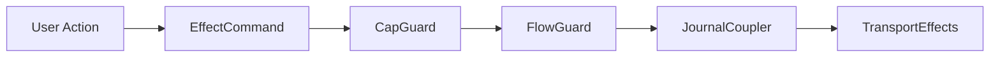

# Terminal User Interface

This document specifies the iocraft-based TUI for `aura-terminal`. The TUI provides an IRC-like chat interface with support for threshold account management, guardian relationships, recovery coordination, and demo mode.

Demo mode code is conditionally compiled with the `development` feature flag.

## 1. Architecture

### 1.1 Design Principles

The TUI is stateless between sessions. All state derives from the effect system and the local store. The architecture uses real effects throughout for end-to-end testing fidelity.

Query subscriptions use existing journal and CRDT infrastructure. Conditional compilation excludes simulator and demo code from production builds. The architecture uses Biscuit for queries and the existing guard chain for authorization.

### 1.2 Three-Layer Architecture for Shared Logic

aura-terminal follows a three-layer architecture pattern to share business logic between CLI and TUI:

**Layer 1: aura-app (Pure Domain Logic)**
- Core business logic (budget calculations, state management)
- Portable across all frontends (CLI, TUI, iOS, Android, Web)
- No UI dependencies or terminal-specific code
- Example: `aura-app/src/budget.rs` - BlockFlowBudget with allocation logic

**Layer 2: handlers/ (Shared CLI+TUI Logic)**
- Business logic specific to aura-terminal but shared between CLI and TUI
- Returns structured data (CliOutput, formatted strings)
- Example: `handlers/budget.rs` - `get_current_budget()`, `format_budget_status()`
- Handlers build data; separate layer handles I/O

**Layer 3: tui/ or cli/ (Presentation Layer)**
- UI-specific rendering and interaction
- TUI adds visual enhancements (colors, progress bars, reactive updates)
- CLI renders to stdout/stderr
- Example: `tui/flow_budget.rs` - FlowBudgetView with warning states

**Example: Budget Display**
```rust
// Layer 1: aura-app/src/budget.rs
pub struct BlockFlowBudget { /* allocation logic */ }

// Layer 2: handlers/budget.rs (shared)
pub async fn get_current_budget(app_core: &Arc<RwLock<AppCore>>) -> BlockFlowBudget { /* ... */ }
pub fn format_budget_status(budget: &BlockFlowBudget) -> String { /* CLI format */ }

// Layer 3a: CLI uses handlers directly
let budget = budget::get_current_budget(&app_core).await;
println!("{}", budget::format_budget_status(&budget));

// Layer 3b: TUI adds visual enhancements
let budget = budget::get_current_budget(&app_core).await;
let view = FlowBudgetView::from_budget(budget); // adds colors, warnings
```

**Key Principle**: TUI-specific code lives in `tui/`, shared logic lives in `handlers/`, pure domain logic lives in `aura-app`. This maximizes code reuse and portability.

### 1.3 iocraft Component Architecture

The TUI uses iocraft's React-like component model for declarative rendering and built-in event handling.

**Component Model**
- **Declarative**: Components are functions annotated with `#[component]` that return element trees
- **Props-based**: Components receive typed Props structs for configuration
- **Hooks**: State management via `use_state`, `use_context`, `use_async`, and custom hooks
- **Fullscreen mode**: iocraft manages terminal setup/teardown and event loop internally

**State Management**
- **Local state**: `use_state::<T>()` for component-local mutable state
- **Context**: `use_context::<AppCoreContext>()` for shared AppCore access
- **Signal subscription**: `use_future` with two-phase pattern (read current, then subscribe)
- **Push-based updates**: Signals emit via `core.emit()`, screens receive via `subscribe()` stream

**Event Handling**
- **Keyboard events**: iocraft's built-in handler with `KeyEvent` matching
- **Focus management**: Native focus tracking per component
- **Callbacks**: Props include `on_*` callbacks for parent-child communication

**Example Component with Signal Subscription**
```rust
#[derive(Default, Props)]
pub struct ChatScreenProps {
    pub channels: Vec<Channel>,      // Empty defaults from shell
    pub messages: Vec<Message>,      // Screens subscribe to signals for actual data
    pub on_send: Option<SendCallback>,
}

#[component]
pub fn ChatScreen(props: &ChatScreenProps, mut hooks: Hooks) -> impl Into<AnyElement<'static>> {
    // Try to get AppCoreContext for reactive signal subscription
    let app_ctx = hooks.try_use_context::<AppCoreContext>();

    // Initialize reactive state from props (empty defaults)
    let reactive_messages = hooks.use_state({
        let initial = props.messages.clone();
        move || initial
    });

    // Subscribe to CHAT_SIGNAL if AppCoreContext is available
    if let Some(ref ctx) = app_ctx {
        hooks.use_future({
            let mut reactive_messages = reactive_messages.clone();
            let app_core = ctx.app_core.clone();
            async move {
                // FIRST: Read current signal value to catch up on any changes
                {
                    let core = app_core.read().await;
                    if let Ok(chat_state) = core.read(&*CHAT_SIGNAL).await {
                        let messages: Vec<Message> = chat_state.messages
                            .iter()
                            .map(|m| Message::from(m))
                            .collect();
                        reactive_messages.set(messages);
                    }
                }

                // THEN: Subscribe for future updates
                let mut stream = {
                    let core = app_core.read().await;
                    core.subscribe(&*CHAT_SIGNAL)
                };

                // Subscribe - runs until component unmounts
                while let Ok(chat_state) = stream.recv().await {
                    let messages: Vec<Message> = chat_state.messages
                        .iter()
                        .map(|m| Message::from(m))
                        .collect();
                    reactive_messages.set(messages);
                }
            }
        });
    }

    // Use reactive state for rendering
    let messages = reactive_messages.read().clone();

    element! {
        Box(flex_direction: FlexDirection::Column) {
            BorderedSection(title: "Messages") {
                #(for msg in messages.iter() {
                    element! {
                        Text(content: format!("{}: {}", msg.sender, msg.content))
                    }
                })
            }
            KeyHints(hints: vec![("↑↓←→", "Navigate"), ("Enter", "Send")])
        }
    }
}
```

**Data Flow Summary**:
```
User Input → iocraft Event Handler → IoContext.dispatch() →
Intent/Operational Handler → Facts/Signal Emission →
Signal<T> stream → use_future callback → State<T>.set() →
Component Re-render (automatic)
```

**Key Insights**:
- **Single Pattern**: All screens use the same two-phase reactive pattern
- **Phase 1**: Read current signal value on mount via `core.read(&*SIGNAL)`
- **Phase 2**: Subscribe to updates via `core.subscribe(&*SIGNAL)` stream
- Shell passes **empty defaults** as props; screens get real data from signals
- iocraft handles the render loop internally
- Components use `try_use_context::<AppCoreContext>()` to access AppCore
- Signal subscription via `use_future` is push-based (**no polling!**)
- State updates via `state.set()` trigger automatic re-renders
- Effect handlers emit signals after operations complete

## 2. State Management

### 2.1 Ephemeral State

The TUI maintains ephemeral state that is rebuilt each session.

```rust
pub struct TuiState {
    pub current_screen: ScreenType,
    pub screen_stack: Vec<ScreenType>,
    pub focused: FocusTarget,
    pub input_mode: InputMode,
    pub input_buffer: String,
    pub command_history: Vec<String>,
    pub notifications: VecDeque<Toast>,
    pub scroll_positions: HashMap<ScreenType, usize>,
    #[cfg(feature = "development")]
    pub demo_state: Option<DemoState>,
}
```

This structure tracks navigation, input, and transient UI elements. Demo state compiles only with the development feature.

### 2.2 Input Modes

The TUI supports three input modes.

```rust
pub enum InputMode {
    Normal,
    Editing,
    Command,
}
```

Normal mode handles tab navigation and arrow keys. Editing mode handles text input. Command mode handles the command palette.

### 2.3 Local Store

User preferences persist via encrypted local storage in `aura-store`.

```rust
pub struct LocalStore {
    path: PathBuf,
    cipher: ChaCha20Poly1305,
}

pub struct LocalData {
    pub display_name: String,
    pub theme: ThemePreference,
    pub known_contacts: Vec<ContactCache>,
    pub recent_channels: Vec<ChatGroupId>,
    pub last_active_channel: Option<ChatGroupId>,
}
```

The local store encrypts data at rest using keys derived from the authority. This is reusable across CLI commands.

## 3. Effect Bridge

### 3.1 Architecture

The effect bridge connects the TUI to AppCore via two dispatch paths:

1. **Intent Commands** (journaled): SendMessage, CreateChannel, etc.
   - Mapped via `command_to_intent()` to Intent types
   - Dispatched through `AppCore.dispatch(Intent)`
   - Flow through guard chain and commit facts

2. **Operational Commands** (non-journaled): Ping, ForceSync, ListPeers, etc.
   - Handled by `OperationalHandler`
   - Update signals directly without journaling

### 3.2 Effect Commands

Commands represent user actions dispatched via `IoContext.dispatch()`:

```rust
pub enum EffectCommand {
    // Chat operations
    SendMessage { channel: String, content: String },
    CreateChannel { name: String, topic: Option<String>, members: Vec<String> },
    SetTopic { channel: String, text: String },
    RetryMessage { message_id: String, channel: String, content: String },

    // Invitation operations
    CreateInvitation { invitation_type: String, message: Option<String>, ttl_secs: Option<u64> },
    AcceptInvitation { invitation_id: String },
    DeclineInvitation { invitation_id: String },
    ImportInvitation { code: String },

    // Recovery operations
    StartRecovery,
    InviteGuardian { contact_id: Option<String> },
    SubmitGuardianApproval { guardian_id: String },

    // Settings operations
    UpdateMfaPolicy { require_mfa: bool },
    UpdateNickname { name: String },
    UpdateThreshold { threshold_k: u8, threshold_n: u8 },
    AddDevice { device_name: String },
    RemoveDevice { device_id: String },

    // Contact operations
    UpdateContactPetname { contact_id: String, petname: String },
    ToggleContactGuardian { contact_id: String },
    StartDirectChat { contact_id: String },
    InviteLanPeer { authority_id: String, address: String },

    // Block operations
    SendBlockInvitation { contact_id: String },
    MovePosition { neighborhood_id: String, block_id: String, depth: String },
    GrantSteward { target: String },
    RevokeSteward { target: String },

    // Operational (non-journaled)
    Ping,
    ForceSync,
    ListPeers,
}
```

### 3.3 Events

Events flow from the effect system to the TUI for demo mode inter-agent communication:

```rust
pub enum AuraEvent {
    MessageReceived { channel: String, sender: String, content: String },
    InvitationReceived { invitation_id: String, from: String },
    GuardianRequestReceived { request_id: String, from: String },
    RecoveryStatusChanged { status: String },
    ChannelUpdated { channel_id: String },
    PeerDiscovered { authority_id: String, address: String },
}
```

Events can be filtered via `EventFilter` for targeted subscriptions.

## 4. Reactive Signal Architecture

### 4.1 Single Consistent Pattern

**aura-terminal uses a single consistent reactive pattern for all UI-to-agent communication.**

All screens follow the same two-phase subscription pattern:

**Phase 1: Read Current Value**
```rust
let core = app_core.read().await;
if let Ok(state) = core.read(&*SIGNAL_NAME).await {
    // Set initial state from current signal value
    reactive_state.set(convert_to_ui_type(state));
}
```

**Phase 2: Subscribe for Updates**
```rust
let mut stream = {
    let core = app_core.read().await;
    core.subscribe(&*SIGNAL_NAME)
};

while let Ok(new_state) = stream.recv().await {
    // Update state when signal emits - triggers re-render
    reactive_state.set(convert_to_ui_type(new_state));
}
```

**Signal Types** (from `aura_app::signal_defs`):
- `CHAT_SIGNAL: Signal<ChatState>` - Messages and channels
- `CONTACTS_SIGNAL: Signal<ContactsState>` - Contact list
- `RECOVERY_SIGNAL: Signal<RecoveryState>` - Guardian status
- `INVITATIONS_SIGNAL: Signal<InvitationsState>` - Pending invitations
- `BLOCK_SIGNAL: Signal<BlockState>` - Block residents and storage
- `BLOCKS_SIGNAL: Signal<BlocksState>` - Multiple blocks
- `NEIGHBORHOOD_SIGNAL: Signal<NeighborhoodState>` - Neighbor blocks
- `DISCOVERED_PEERS_SIGNAL: Signal<DiscoveredPeersState>` - LAN peers
- `SETTINGS_SIGNAL: Signal<SettingsState>` - Account settings
- `CONNECTION_STATUS_SIGNAL: Signal<ConnectionStatus>` - Network status
- `SYNC_STATUS_SIGNAL: Signal<SyncStatus>` - Sync progress
- `ERROR_SIGNAL: Signal<Option<AppError>>` - Error notifications

**Critical Principle:** State flows downward only (Effects → Signals → UI). UI never writes directly to signals. User actions dispatch commands via `IoContext`, which trigger effects, which emit signals, which update screens.

### 4.2 Data Flow Pipeline

The complete reactive pipeline:

```
┌─────────────┐
│ User Action │ (key press, UI interaction)
└──────┬──────┘
       │
       ▼
┌─────────────┐
│ IoContext   │ (dispatch command)
└──────┬──────┘
       │
       ├──────────────────┐
       │                  │
       ▼                  ▼
┌─────────────┐    ┌─────────────┐
│   Intent    │    │ Operational │ (Ping, ListPeers, etc.)
│  Dispatch   │    │   Handler   │
└──────┬──────┘    └──────┬──────┘
       │                  │
       ▼                  │
┌─────────────┐           │
│ Guard Chain │           │
│ + Journal   │           │
└──────┬──────┘           │
       │                  │
       ├──────────────────┘
       │
       ▼
┌─────────────┐
│Signal Emit  │ (core.emit(&*SIGNAL, state))
└──────┬──────┘
       │
       ▼
┌─────────────┐
│   Screens   │ (subscribe via use_future)
│  Re-render  │ (reactive_state.set() triggers update)
└─────────────┘
```

**Key Performance Characteristics:**
- **Push-Based:** Signals push updates to subscribers (zero polling overhead)
- **Two-Phase:** Read current value on mount, then subscribe for changes
- **Async Streams:** `subscribe()` returns tokio broadcast receiver
- **Event-Driven:** Zero CPU usage when idle (no polling loops)
- **Automatic Re-render:** `state.set()` in iocraft triggers component update

### 4.3 Screen Implementation Pattern

Every screen in aura-terminal follows the same implementation pattern:

**1. Define Screen Props**
```rust
#[derive(Default, Props)]
pub struct ChatScreenProps {
    // Domain data (empty defaults from shell)
    pub channels: Vec<Channel>,
    pub messages: Vec<Message>,

    // View state from TuiState (REQUIRED - compile-time enforced)
    pub view: ChatViewProps,

    // Callbacks
    pub on_send: Option<SendCallback>,
}
```

**2. Subscribe to Signal in Component**
```rust
#[component]
pub fn ChatScreen(props: &ChatScreenProps, mut hooks: Hooks) -> impl Into<AnyElement<'static>> {
    let app_ctx = hooks.try_use_context::<AppCoreContext>();

    let reactive_messages = hooks.use_state({
        let initial = props.messages.clone();
        move || initial
    });

    if let Some(ref ctx) = app_ctx {
        hooks.use_future({
            let mut reactive_messages = reactive_messages.clone();
            let app_core = ctx.app_core.clone();
            async move {
                // Phase 1: Read current value
                {
                    let core = app_core.read().await;
                    if let Ok(state) = core.read(&*CHAT_SIGNAL).await {
                        reactive_messages.set(convert_to_ui_type(state));
                    }
                }

                // Phase 2: Subscribe for updates
                let mut stream = {
                    let core = app_core.read().await;
                    core.subscribe(&*CHAT_SIGNAL)
                };

                while let Ok(state) = stream.recv().await {
                    reactive_messages.set(convert_to_ui_type(state));
                }
            }
        });
    }

    let messages = reactive_messages.read().clone();

    // Render using reactive state...
}
```

**State Type Mapping**:

| Signal | State Type | Screen | UI Types |
|--------|-----------|--------|----------|
| CHAT_SIGNAL | ChatState | ChatScreen | Channel, Message |
| CONTACTS_SIGNAL | ContactsState | ContactsScreen | Contact |
| RECOVERY_SIGNAL | RecoveryState | RecoveryScreen | Guardian, RecoveryStatus |
| INVITATIONS_SIGNAL | InvitationsState | InvitationsScreen | Invitation |
| BLOCK_SIGNAL | BlockState | BlockScreen | Resident, BlockBudget |
| NEIGHBORHOOD_SIGNAL | NeighborhoodState | NeighborhoodScreen | BlockSummary |
| SETTINGS_SIGNAL | SettingsState | SettingsScreen | Device, MfaPolicy |
| DISCOVERED_PEERS_SIGNAL | DiscoveredPeersState | ContactsScreen | DiscoveredPeerInfo |

**View Types** (from `aura_app::views`):
```rust
// Import canonical view types from aura-app
pub use aura_app::views::chat::{Channel, ChannelType, Message};
pub use aura_app::views::contacts::Contact;
pub use aura_app::views::invitations::{Invitation, InvitationDirection, InvitationStatus};
pub use aura_app::views::recovery::{Guardian, GuardianStatus, RecoveryApproval};
pub use aura_app::views::block::{Resident, ResidentRole};
```

**TUI-Specific Types** (from `aura_terminal::tui::types`):
```rust
// UI-specific wrappers and extensions
pub struct Device { id: String, name: String, is_current: bool, last_seen: Option<u64> }
pub struct BlockBudget { used_bytes: u64, total_bytes: u64, resident_count: u8 }
pub struct BlockSummary { id: String, name: String, member_count: usize, ... }
pub struct DiscoveredPeerInfo { authority_id: String, address: String, method: String, ... }

// Status enums
pub enum ContactStatus { Active, Pending, Blocked }
pub enum RecoveryStatus { NotStarted, InProgress, Completed, Failed }
pub enum MfaPolicy { Disabled, SensitiveOnly, Always }
```

**Key Properties**:
- **Canonical view types** from `aura_app::views` ensure consistency
- **Signal types** from `aura_app::signal_defs` provide reactive state
- **TUI types** extend canonical types with presentation concerns
- **No polling**: All updates are push-based via signals

### 4.4 Adding a New Screen with Reactive Signal

To add a new screen to the TUI, follow these steps:

**Step 1: Define Signal and State Type**
Add to `aura-app/src/signal_defs.rs`:

```rust
use once_cell::sync::LazyLock;
use crate::effects::reactive::Signal;

/// State for your new screen
#[derive(Clone, Debug)]
pub struct YourState {
    pub items: Vec<YourItem>,
    pub selected_id: Option<String>,
    pub status: String,
}

impl Default for YourState {
    fn default() -> Self {
        Self {
            items: Vec::new(),
            selected_id: None,
            status: String::from("ready"),
        }
    }
}

/// Signal for your screen
pub static YOUR_SIGNAL: LazyLock<Signal<YourState>> =
    LazyLock::new(|| Signal::new("app:your_feature"));
```

**Step 2: Register Signal**
Add to `register_app_signals()` in `aura-app/src/signal_defs.rs`:

```rust
pub async fn register_app_signals(core: &AppCore) -> Result<(), AuraError> {
    // ... existing registrations
    core.register_signal(&*YOUR_SIGNAL, YourState::default()).await?;
    Ok(())
}
```

**Step 3: Emit Signal from Effect Handler**
In your effect handler (e.g., `operational/your_handler.rs`):

```rust
pub async fn handle_your_operation(
    command: &EffectCommand,
    app_core: &Arc<RwLock<AppCore>>,
) -> Option<OpResult> {
    match command {
        EffectCommand::YourOperation { .. } => {
            // Perform operation...

            // Emit signal to update UI
            emit_your_signal(app_core).await;

            Some(Ok(OpResponse::Ok))
        }
        _ => None,
    }
}

async fn emit_your_signal(app_core: &Arc<RwLock<AppCore>>) {
    let core = app_core.read().await;

    // Query current state from runtime
    let items = get_your_items_from_runtime(&core).await;

    let state = YourState {
        items,
        selected_id: None,
        status: String::from("ready"),
    };

    let _ = core.emit(&*YOUR_SIGNAL, state).await;
}
```

**Step 4: Create Screen Component**
Add to `aura-terminal/src/tui/screens/your_screen/screen.rs`:

```rust
use aura_app::signal_defs::YOUR_SIGNAL;
use aura_core::effects::reactive::ReactiveEffects;
use crate::tui::hooks::AppCoreContext;

#[derive(Default, Props)]
pub struct YourScreenProps {
    pub items: Vec<YourItem>,      // Empty defaults from shell
    pub view: YourViewProps,       // View state from TuiState
}

#[component]
pub fn YourScreen(props: &YourScreenProps, mut hooks: Hooks) -> impl Into<AnyElement<'static>> {
    let app_ctx = hooks.try_use_context::<AppCoreContext>();

    let reactive_items = hooks.use_state({
        let initial = props.items.clone();
        move || initial
    });

    // Subscribe to YOUR_SIGNAL if AppCoreContext is available
    if let Some(ref ctx) = app_ctx {
        hooks.use_future({
            let mut reactive_items = reactive_items.clone();
            let app_core = ctx.app_core.clone();
            async move {
                // Phase 1: Read current value
                {
                    let core = app_core.read().await;
                    if let Ok(state) = core.read(&*YOUR_SIGNAL).await {
                        let items: Vec<YourItem> = state.items
                            .iter()
                            .map(|i| YourItem::from(i))
                            .collect();
                        reactive_items.set(items);
                    }
                }

                // Phase 2: Subscribe for updates
                let mut stream = {
                    let core = app_core.read().await;
                    core.subscribe(&*YOUR_SIGNAL)
                };

                while let Ok(state) = stream.recv().await {
                    let items: Vec<YourItem> = state.items
                        .iter()
                        .map(|i| YourItem::from(i))
                        .collect();
                    reactive_items.set(items);
                }
            }
        });
    }

    let items = reactive_items.read().clone();

    element! {
        Box(flex_direction: FlexDirection::Column) {
            #(for item in items.iter() {
                element! { Text(content: item.name.clone()) }
            })
        }
    }
}
```

**Key Pattern**: The two-phase approach ensures screens always have current data:
1. **Phase 1** catches up on changes that happened while the screen was unmounted
2. **Phase 2** subscribes for future updates via tokio broadcast channel
3. `state.set()` triggers automatic iocraft re-render (no polling!)

### 4.5 Debugging Reactive Issues

Common reactive system debugging scenarios:

**Problem: Screens not updating**

1. **Check signal emission:** Are signals being emitted after operations?
   ```bash
   RUST_LOG=aura_app=debug,aura_terminal::tui::effects=debug cargo run
   ```
   Look for: `Emitting signal: app:chat`, `Signal emitted successfully`

2. **Check screen subscription:** Is the screen subscribed to the signal?
   - Verify `if let Some(ref ctx) = app_ctx` is true
   - Verify `core.subscribe(&*SIGNAL)` is being called
   - Check for errors in the `use_future` async block

3. **Check signal registration:** Is the signal registered in `register_app_signals()`?
   ```rust
   // In aura-app/src/signal_defs.rs
   core.register_signal(&*YOUR_SIGNAL, YourState::default()).await?;
   ```

4. **Check AppCoreContext availability:**
   ```rust
   // Add debug logging in screen component
   if let Some(ref ctx) = app_ctx {
       tracing::debug!("AppCoreContext available, subscribing to signal");
   } else {
       tracing::warn!("No AppCoreContext - using props only");
   }
   ```

**Problem: Screen shows stale data on mount**

- **Phase 1 missing:** Screen must read current value before subscribing
  ```rust
  // FIRST: Read current value
  {
      let core = app_core.read().await;
      if let Ok(state) = core.read(&*SIGNAL).await {
          reactive_state.set(state);
      }
  }
  // THEN: Subscribe for updates
  ```

**Problem: Performance lag**

1. **Check for excessive re-renders:**
   ```bash
   RUST_LOG=iocraft=debug cargo run
   ```

2. **Profile signal emission frequency:**
   - Are handlers emitting on every operation, or batching?
   - Consider debouncing rapid updates

3. **Check conversion overhead:**
   - Is type conversion in `map(|i| YourItem::from(i))` expensive?
   - Profile with `cargo flamegraph`

**Debugging Tools:**

- `RUST_LOG=aura_app=trace` - See all signal operations
- `RUST_LOG=aura_terminal::tui=trace` - See screen lifecycle
- Add debug logging in `use_future` blocks to verify subscription

### 4.6 Best Practices

**DO:**
- ✅ Use the two-phase pattern (read current, then subscribe) in all screens
- ✅ Pass empty defaults as props from shell
- ✅ Emit signals after all operations that change state
- ✅ Use `if let Some(ref ctx)` to avoid moving AppCoreContext
- ✅ Convert signal state types to UI types in the subscription callback
- ✅ Register all signals in `register_app_signals()` with default values

**DON'T:**
- ❌ Poll for data - use signal subscriptions instead
- ❌ Skip Phase 1 (reading current value) - screens will show stale data on mount
- ❌ Pass real data as props - shell should pass empty defaults only
- ❌ Update state directly - always dispatch commands via IoContext
- ❌ Subscribe without checking AppCoreContext availability
- ❌ Forget to emit signals after operations complete

## 5. Screens

### 5.1 Screen Types

The TUI provides seven screens accessible via number keys (1-7) or Tab/Shift-Tab:

| Screen | Key | Purpose |
|--------|-----|---------|
| Block | 1 | Home block view with residents, messages, and storage |
| Chat | 2 | IRC-style messaging with channels |
| Contacts | 3 | Contact management and petnames |
| Neighborhood | 4 | Neighborhood navigation and block discovery |
| Invitations | 5 | Invitation management (create, import, accept) |
| Settings | 6 | Account settings, devices, and MFA policy |
| Recovery | 7 | Guardian management and recovery coordination |

Account creation is handled via a modal overlay (`AccountSetupModal`) rather than a separate screen.

### 5.2 Chat Screen Layout

The chat screen uses an IRC-style layout.

```
+------------------------------------------------------------------+
| Status                                                           |
+-------------+-----------------------------------------+----------+
| Channels    |  Messages                               | Members  |
+-------------+-----------------------------------------+----------+
| Input                                                            |
+------------------------------------------------------------------+
```

The status bar shows account information. The sidebar shows channels and guardian status. The main area shows messages. The input area handles message composition.

### 5.3 Navigation

Navigation uses vim-style and arrow key controls with screen switching via number keys:

| Key | Action |
|-----|--------|
| 1-7 | Switch to screen (Block, Chat, Contacts, Neighborhood, Invitations, Settings, Recovery) |
| Tab / Shift-Tab | Next/Previous screen |
| ↑↓ or j/k | Navigate up/down in lists |
| ←→ or h/l | Switch panels or navigate left/right |
| Enter | Select or confirm |
| Esc | Cancel, close modal, or exit insert mode |
| i | Enter insert mode (for text input) |
| ? | Toggle help modal |
| q | Quit application |

Screen-specific key hints are displayed in the footer bar. The help modal (`?`) shows context-sensitive shortcuts for the current screen.

## 6. Component System

### 6.1 iocraft Component Pattern

Components use the iocraft `#[component]` macro for declarative rendering.

```rust
#[derive(Default, Props)]
pub struct ListProps<'a, T: Clone> {
    pub items: Cow<'a, [T]>,
    pub selected: usize,
    pub render_item: Option<Handler<'static, (usize, T), AnyElement<'static>>>,
}

#[component]
pub fn List<T: Clone + 'static>(props: &ListProps<T>, hooks: Hooks) -> impl Into<AnyElement<'static>> {
    let mut selected = hooks.use_state(|| props.selected);

    element! {
        Box(flex_direction: FlexDirection::Column) {
            #(for (i, item) in props.items.iter().enumerate() {
                let is_selected = i == *selected;
                element! {
                    Text(
                        content: format!("{} {}", if is_selected { ">" } else { " " }, item),
                        weight: if is_selected { Weight::Bold } else { Weight::Normal }
                    )
                }
            })
        }
    }
}
```

Components are pure functions that return element trees. Hooks provide state and context access.

### 6.2 Core Components

The TUI provides reusable iocraft components organized by category:

**Layout Components**
| Component | Purpose |
|-----------|---------|
| Panel | Container with optional border and title |
| SimpleCard | Card container with header/footer slots |
| Scrollable | Scrollable content area with scroll indicators |
| List | Navigable list with selection highlight and wrap-around |

**Input Components**
| Component | Purpose |
|-----------|---------|
| TextInput | Single-line text input with cursor |
| Textarea | Multi-line text input |
| MessageInput | Chat message composer with history |

**Display Components**
| Component | Purpose |
|-----------|---------|
| StyledText | Text with style variants (muted, bold, etc.) |
| KeyValue | Label-value pair display |
| Badge | Status badge with color |
| Heading | Section heading with optional divider |
| StatusIndicator | Status dot with label |
| MessageBubble | Chat message display |
| EmptyState | Empty/loading/no-results states |

**Modal Components**
| Component | Purpose |
|-----------|---------|
| ConfirmModal | Yes/No confirmation dialog |
| InputModal | Single input prompt |
| TextInputModal | Text input with validation |
| FormModal | Multi-field form dialog |
| HelpModal | Keyboard shortcuts overlay |
| AccountSetupModal | Account creation flow |
| ThresholdModal | Threshold configuration |
| ChatCreateModal | New channel creation |
| InvitationCreateModal | Create invitation |
| InvitationImportModal | Import invitation code |
| InvitationCodeModal | Display invitation code |
| ChannelInfoModal | Channel details and members |
| ContactSelectModal | Contact picker |

**Navigation Components**
| Component | Purpose |
|-----------|---------|
| KeyHintsBar | Footer bar with keyboard shortcuts |
| CommandPalette | Command search and execution |
| StatusBar | Sync status and peer count |

**Notification Components**
| Component | Purpose |
|-----------|---------|
| Toast | Individual notification |
| ToastContainer | Toast stack manager |

**Specialized Components**
| Component | Purpose |
|-----------|---------|
| DiscoveredPeersPanel | LAN peer discovery list |
| DemoHintBar | Demo mode hints and codes |

### 6.3 Focus Management

iocraft handles focus natively within each component.

```rust
#[component]
pub fn Screen(props: &ScreenProps, hooks: Hooks) -> impl Into<AnyElement<'static>> {
    let mut focus = hooks.use_state(|| FocusTarget::List);

    hooks.use_terminal_events({
        move |event| match event {
            TerminalEvent::Key(KeyEvent { code: KeyCode::Tab, .. }) => {
                focus.set(focus.get().next());
            }
            _ => {}
        }
    });

    element! {
        Box {
            List(focused: *focus == FocusTarget::List)
            MessageInput(focused: *focus == FocusTarget::Input)
        }
    }
}
```

Focus state is managed per-screen via `use_state`. Components receive a `focused` prop and style accordingly.

## 7. Demo Mode

### 7.1 Feature Flag

Demo mode compiles only with the development feature.

```toml
[features]
default = []
development = [
    "dep:aura-simulator",
    "dep:aura-testkit",
]
```

Production builds exclude simulator and testkit dependencies. Expected savings are 4 to 6 MB.

### 7.2 Demo Configuration

Demo mode configures simulated participants.

```rust
#[cfg(feature = "development")]
pub struct DemoConfig {
    pub simulator: SimulatorHandle,
    pub alice: SimulatedAuthority,
    pub carol: SimulatedAuthority,
    pub current_phase: DemoPhase,
    pub auto_advance: bool,
}
```

The simulator automates Alice and Carol. Bob is human-controlled.

### 7.3 Demo Phases

The demo follows eight phases matching the recovery demonstration.

| Phase | Description |
|-------|-------------|
| 1 | Alice and Carol setup via simulator |
| 2 | Bob creates 2-of-3 account |
| 3 | Guardian setup with automated approval |
| 4 | Group chat with automated responses |
| 5 | Simulated device loss |
| 6 | Recovery initiation |
| 7 | Guardian coordination |
| 8 | Post-recovery verification |

Each phase advances based on user actions and simulator responses.

## 8. Implementation Location

The TUI implementation follows a modular architecture across multiple directories:

### Directory Structure

```
aura-terminal/src/
├── handlers/            # Shared CLI+TUI business logic (Layer 2)
│   ├── budget.rs       # Budget queries and formatting (shared)
│   ├── recovery.rs     # Recovery handlers (shared)
│   ├── invite.rs       # Invitation handlers (shared)
│   ├── status.rs       # Status command handler
│   └── mod.rs
├── tui/                # TUI-specific code (Layer 3)
│   ├── screens/        # Screen modules (one per screen)
│   │   ├── app/       # Root application and shell
│   │   │   ├── shell.rs     # Main TUI shell component
│   │   │   ├── modal_overlays.rs  # Global modals (help, account setup)
│   │   │   └── mod.rs
│   │   ├── chat/      # Chat screen
│   │   │   ├── screen.rs    # Main screen component
│   │   │   ├── modal.rs     # Screen-specific modals
│   │   │   └── mod.rs
│   │   ├── contacts/  # Contacts screen
│   │   ├── block/     # Block screen
│   │   ├── neighborhood/  # Neighborhood screen
│   │   ├── invitations/   # Invitations screen
│   │   ├── recovery/      # Recovery screen
│   │   ├── settings/      # Settings screen
│   │   └── mod.rs
│   ├── components/    # Reusable UI components
│   │   ├── list.rs, panel.rs, text_input.rs  # Core widgets
│   │   ├── modal.rs         # Modal container
│   │   └── *_template.rs    # Reusable modal templates
│   ├── callbacks/     # Unified callback types
│   │   ├── types.rs         # Callback type aliases
│   │   └── factories.rs     # Callback creation helpers
│   ├── effects/       # TUI command dispatching (NOT effect traits)
│   │   ├── operational/     # Operational handlers (emit signals)
│   │   └── dispatcher.rs    # Command routing
│   ├── flow_budget.rs # TUI-specific budget display (colors, warnings)
│   ├── updates.rs     # TuiState update functions
│   ├── state_machine.rs  # Event handling state machine
│   ├── types.rs       # TUI-specific types
│   └── theme.rs       # Colors, spacing, constants
```

**Note on `tui/effects/`**: This directory contains TUI command dispatching logic (EffectCommand routing, operational handlers), **not** effect trait definitions. Effect traits live in `aura-core`. Previously, there was a `handlers/effects/` directory with unused CLI-specific effect traits (CliEffects, ConfigEffects, OutputEffects) which was removed in favor of the cleaner CliOutput pattern.

### Key Principles

- **Three-layer architecture**: aura-app (domain) → handlers/ (shared) → tui/ (presentation)
- **One screen = one subdirectory**: Each screen has `screen.rs` + optional `modal.rs`
- **Shared components**: Reusable widgets in `components/`
- **Unified callbacks**: All callback types in `callbacks/`
- **Signal-based**: All screens subscribe to signals from `aura-app`
- **No polling**: Shell passes empty defaults, screens get real data from signals
- **Shared handlers**: Business logic in `handlers/` is reused by both CLI and TUI

### Demo Mode

Demo mode code lives in `aura-terminal/src/demo/` and compiles only with the `development` feature flag.

## 9. Integration

### 9.1 Database Integration

The TUI uses the database layer for reactive queries.

| TUI Concept | Database Component |
|-------------|-------------------|
| Query execution | Biscuit Datalog |
| Fact subscriptions | JournalEffects |
| View caching | CvHandler |
| Delta sync | DeltaHandler |
| Authorization | Guard chain |

Query subscriptions flow through the database effects. Updates propagate to dynamic views.

### 9.2 Guard Chain Integration

TUI operations flow through the guard chain.



Commands dispatch through the effect bridge. Guards enforce authorization and budget constraints. Journal commits persist state changes.

## See Also

[Database Architecture](113_database.md) describes query execution. [Social Architecture](114_social_architecture.md) covers blocks and neighborhoods. [Effect System and Runtime](106_effect_system_and_runtime.md) details effect implementation.
