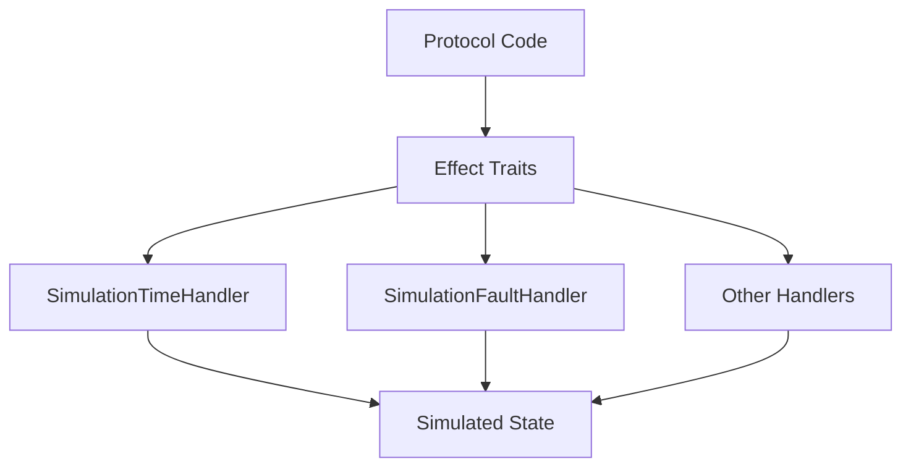

# Simulation Infrastructure Reference

This document describes the architecture of `aura-simulator`, the simulation crate that provides deterministic protocol testing through effect handler composition, fault injection, and scenario execution.

## Overview

The `aura-simulator` crate occupies Layer 6 in the Aura architecture. It enables testing distributed protocols under controlled conditions. The simulator uses a handler-based architecture rather than a monolithic simulation engine.

The crate provides four capabilities. It offers specialized effect handlers for simulation control. It includes a middleware system for fault injection. It supports TOML-based scenario definitions. It integrates with Quint for model-based testing.

## Simulation Modes

The simulator provides two execution modes. TOML scenarios are human-written declarative test scripts that specify operations, assertions, and fault injection. Quint actions are model-generated traces from formal specifications that exercise state-space coverage.

Simulation is an alternate runtime substrate for testing and verification. It does not replace the harness, which executes real frontends. Shared semantic contracts live in `aura-app` and are consumed by both simulation and harness execution.

## Handler-Based Architecture

The simulator composes effect handlers rather than wrapping them in a central engine. Each simulated participant uses its own handler instances. This approach aligns with Aura's stateless effect architecture.



Handlers implement effect traits from `aura-core`. Protocol code calls effect methods without knowing whether handlers are production or simulation instances.

## Simulation Handlers

### SimulationTimeHandler

This handler provides deterministic time control.

```rust
use aura_simulator::handlers::SimulationTimeHandler;
use aura_core::effects::PhysicalTimeEffects;
use std::time::Duration;

let mut time = SimulationTimeHandler::new();
time.jump_to_time(Duration::from_secs(10));
let now = time.physical_time().await?;
```

Time starts at zero and advances only through explicit `jump_to_time` calls or `sleep_ms` invocations. The `sleep_ms` method returns immediately after advancing simulated time by the scaled duration. This enables testing timeout behavior without wall-clock delays. Use `set_acceleration` to adjust time scaling.

### SimulationFaultHandler

This handler injects faults into protocol execution.

```rust
use aura_simulator::handlers::SimulationFaultHandler;
use aura_core::{AuraFault, AuraFaultKind, FaultEdge};
use std::time::Duration;

let faults = SimulationFaultHandler::new(42); // seed for determinism

// Inject a message delay fault
let delay_fault = AuraFault {
    fault: AuraFaultKind::MessageDelay { delay_ms: 200 },
    edge: FaultEdge::new("*", "*"),
};
faults.inject_fault(delay_fault, Some(Duration::from_secs(60)))?;

// Inject a message drop fault
let drop_fault = AuraFault {
    fault: AuraFaultKind::MessageDrop { probability: 0.1 },
    edge: FaultEdge::new("*", "*"),
};
faults.inject_fault(drop_fault, None)?; // permanent
```

Fault types include `MessageDelay`, `MessageDrop`, `MessageCorruption`, `NodeCrash`, `NetworkPartition`, `FlowBudgetExhaustion`, and `JournalCorruption`. Faults can be temporary (with duration) or permanent. The handler implements `ChaosEffects` for async fault injection.

### SimulationScenarioHandler

This handler manages scenario-driven testing.

```rust
use aura_simulator::handlers::{
    SimulationScenarioHandler,
    ScenarioDefinition,
    TriggerCondition,
    InjectionAction,
};

let mut scenarios = SimulationScenarioHandler::new();
scenarios.add_scenario(ScenarioDefinition {
    name: "partition".to_string(),
    trigger: TriggerCondition::AfterTime(Duration::from_secs(5)),
    action: InjectionAction::PartitionNetwork {
        group_a: vec![device1, device2],
        group_b: vec![device3],
    },
});
```

Scenarios define triggered actions based on time or protocol state. They enable testing recovery from transient failures.

### SimulationEffectComposer

This type composes handlers into complete simulation environments.

```rust
use aura_simulator::handlers::SimulationEffectComposer;
use aura_core::DeviceId;

let device_id = DeviceId::new_from_entropy([1u8; 32]);
let composer = SimulationEffectComposer::for_testing(device_id).await?;
let env = composer
    .with_time_control()
    .with_fault_injection()
    .build()?;
```

The composer provides a builder pattern for handler configuration. It produces an effect system instance suitable for simulation.

## TOML Scenario System

TOML scenarios provide human-readable integration tests with fault injection.

### File Format

Scenario files live in the `scenarios/` directory.

```toml
[metadata]
name = "dkd_basic_derivation"
description = "Basic P2P deterministic key derivation"
version = "1.0"

[[phases]]
name = "setup"
actions = [
    { type = "create_participant", id = "alice" },
    { type = "create_participant", id = "bob" },
]

[[phases]]
name = "derivation"
actions = [
    { type = "run_choreography", choreography = "p2p_dkd", participants = ["alice", "bob"] },
]

[[phases]]
name = "verification"
actions = [
    { type = "verify_property", property = "derived_keys_match" },
]

[[properties]]
name = "derived_keys_match"
property_type = "safety"
expression = "alice.derived_key == bob.derived_key"
```

Each scenario has metadata, ordered phases, and property definitions. Phases contain action sequences that execute in order.

### Action Types

| Action | Parameters | Description |
|--------|------------|-------------|
| `create_participant` | `id` | Create a simulated participant |
| `run_choreography` | `choreography`, `participants` | Execute a choreographic protocol |
| `verify_property` | `property` | Check a named property |
| `simulate_data_loss` | `participant`, `percentage` | Delete random stored data |
| `apply_network_condition` | `condition`, `duration` | Apply network fault |
| `advance_time` | `duration` | Advance simulated time |

### Execution

The `SimulationScenarioHandler` executes TOML scenarios.

```rust
use aura_simulator::handlers::SimulationScenarioHandler;

let handler = SimulationScenarioHandler::new();
let result = handler.execute_file("scenarios/core_protocols/dkd_basic.toml").await?;
assert!(result.all_properties_passed());
```

Execution proceeds phase by phase. Failures stop execution and report the failing action.

## Configuration System

The simulator uses configuration types from `aura_simulator::types`.

### SimulatorConfig

```rust
use aura_simulator::types::{SimulatorConfig, NetworkConfig};
use aura_core::DeviceId;

let config = SimulatorConfig {
    seed: 42,
    deterministic: true,
    time_scale: 1.0,
    network: Some(NetworkConfig {
        latency: std::time::Duration::from_millis(50),
        packet_loss_rate: 0.02,
        bandwidth_bps: Some(1_000_000),
    }),
    ..Default::default()
};
```

### NetworkConfig

Network configuration controls simulated network conditions.

| Field | Type | Description |
|-------|------|-------------|
| `latency` | `Duration` | Base network latency |
| `packet_loss_rate` | `f64` | Probability of dropping messages |
| `bandwidth_bps` | `Option<u64>` | Bytes per second limit |

### SimulatorContext

The `SimulatorContext` tracks execution state during simulation runs.

```rust
use aura_simulator::types::SimulatorContext;

let context = SimulatorContext::new("scenario_id".into(), "run_123".into())
    .with_seed(42)
    .with_participants(3, 2)
    .with_debug(true);

println!("Tick: {}", context.tick);
println!("Timestamp: {:?}", context.timestamp);
```

The context advances through `advance_tick` and `advance_time` methods.

## Async Host Boundary

The `AsyncSimulatorHostBridge` provides an async request/resume interface for Telltale integration.

### Design

```rust
use aura_simulator::{AsyncHostRequest, AsyncSimulatorHostBridge};

let mut host = AsyncSimulatorHostBridge::new(42);
host.submit(AsyncHostRequest::VerifyAllProperties);
let entry = host.resume_next().await?;
```

The bridge maintains deterministic ordering through FIFO processing and monotone sequence IDs.

### Determinism Constraints

The async host boundary enforces several constraints. Requests process in submission order. Each request receives a unique monotone sequence ID. No wall-clock time affects host decisions. Transcript entries enable replay comparison.

### Transcript Artifacts

## Adaptive Privacy Phase 6 Evidence

Phase 6 adaptive-privacy validation uses one deterministic artifact lane instead
of ad hoc local sweeps. Run:

```bash
just ci-adaptive-privacy-phase6
```

That lane writes the canonical archive under
`artifacts/adaptive-privacy/phase6/` with:

- `tuning_report.json` for the provisional-vs-fixed policy comparison
- `matrix_results.json` for the canonical Phase 6 validation matrix
- `control-plane/` telltale-backed parity reports for anonymous path
  establishment and reply-block accountability
- `parity/report.json` for the generic telltale parity lane used by the same
  archive contract

These artifacts are the evidence source for tuned adaptive-privacy constants.
They are observational outputs, not new semantic truth.

```rust
use aura_simulator::AsyncHostTranscriptEntry;

let entry = host.resume_next().await?;
assert_eq!(entry.sequence, 0);
assert!(entry.request.is_verify_properties());
```

Transcript entries record request/response pairs. They enable sync-versus-async host parity testing.

## Factory Abstraction

The `SimulationEnvironmentFactory` trait decouples simulation from effect system internals.

```rust
use aura_core::effects::{SimulationEnvironmentFactory, SimulationEnvironmentConfig};

let config = SimulationEnvironmentConfig {
    seed: 42,
    authority_id,
    device_id: Some(device_id),
    test_mode: true,
};
let effects = factory.create_simulation_environment(config).await?;
```

This abstraction enables stable simulation code across effect system changes. Only the factory implementation requires updates when internals change.

## Quint Integration

The `quint` module provides integration with Quint formal specifications. See [Formal Verification Reference](120_verification.md) for complete details.

## Telltale Parity Integration

The simulator exposes telltale parity as an artifact-level boundary. The boundary lives in `aura_simulator::telltale_parity`. Default simulator execution does not run the protocol machine directly.

### Entry Points

Use `TelltaleParityInput` and `TelltaleParityRunner` when both baseline and candidate artifacts are already in memory. Use `run_telltale_parity_file_lane` with `TelltaleParityFileRun` for file-driven CI workflows.

The file lane accepts baseline and candidate artifact paths, a comparison profile, and an output report path. It emits one stable JSON report artifact.

Protocol-critical control-plane lifecycles should use the dedicated telltale
control-plane lanes instead of reimplementing the same ownership/timeout/replay
lifecycle in Aura-local simulator scenario state. Use
`run_telltale_control_plane_file_lane` with `TelltaleControlPlaneFileRun` for:

- `anonymous_path_establish`
- `reply_block_accountability`

Those simulator lanes correspond to the current adaptive-privacy control-plane
protocol inventory in `aura-agent`:

- "AnonymousPathEstablishProtocol"
- "MoveReceiptReplyBlockProtocol"
- "HoldDepositReplyBlockProtocol"
- "HoldRetrievalReplyBlockProtocol"
- "HoldAuditReplyBlockProtocol"

Bootstrap and stale-node re-entry are not part of these lanes because they
remain runtime-local bootstrap/hint logic rather than canonical multi-party
control protocols.

### Canonical Surface Mapping

Telltale parity lanes use one canonical mapping:

| Telltale Event Family | Aura Surface | Normalization |
|-----------------------|-------------|---------------|
| `observable` | `observable` | identity |
| `scheduler_step` | `scheduler_step` | tick normalization |
| `effect` | `effect` | envelope classification |

Reports use schema `aura.telltale-parity.report.v1`.

For Telltale 11-backed lanes, Aura can also invoke an upstream simulator runner
first and attach the resulting sidecar automatically. Use
`run_telltale_parity_with_runner(...)` or
`run_telltale_control_plane_with_runner(...)` and configure the runner command
with `AURA_TELLTALE_SIMULATOR_RUNNER` when the executable is not on the shell
search path.

### Expected Outputs

The simulator telltale parity lane writes:

```text
artifacts/telltale-parity/report.json
```

The report includes:

- comparison classification (`strict` or `envelope_bounded`)
- first mismatch surface
- first mismatch step index
- full differential comparison payload
- optional semantic summary derived from upstream Telltale 11 context
- optional upstream Telltale 11 run context when the Aura runner path is used

### Environment Bridge

Aura now exposes a small environment bridge for simulator-local state that is
being migrated toward Telltale 11 terminology. The current migrated slice is:

- adaptive-privacy movement profiles -> mobility profiles
- sync opportunities -> link-admission observations
- provider saturation -> node-capability observations

Use `SimulationScenarioHandler::environment_snapshot()` and
`SimulationScenarioHandler::environment_trace()` to inspect the migrated bridge
surface.

### ITF Trace Format

ITF (Informal Trace Format) traces come from Quint model checking. Each trace captures a sequence of states and transitions.

```json
{
  "#meta": {
    "format": "ITF",
    "source": "quint",
    "version": "1.0"
  },
  "vars": ["phase", "participants", "messages"],
  "states": [
    {
      "#meta": { "index": 0 },
      "phase": "Setup",
      "participants": [],
      "messages": []
    },
    {
      "#meta": { "index": 1, "action": "addParticipant" },
      "phase": "Setup",
      "participants": ["alice"],
      "messages": []
    }
  ]
}
```

Each state represents a model state. Transitions between states correspond to actions.

ITF traces capture non-deterministic choices for replay:

```json
{
  "#meta": {
    "index": 3,
    "action": "selectLeader",
    "nondet_picks": { "leader": "bob" }
  }
}
```

The `nondet_picks` field records choices made by Quint. Replay uses these values to seed `RandomEffects`.

### ITFLoader

```rust
use aura_simulator::quint::itf_loader::ITFLoader;

let trace = ITFLoader::load("trace.itf.json")?;
for (i, state) in trace.states.iter().enumerate() {
    let action = state.meta.action.as_deref();
    let picks = &state.meta.nondet_picks;
}
```

The loader validates trace format and extracts typed state.

### GenerativeSimulator

```rust
use aura_simulator::quint::generative_simulator::GenerativeSimulator;

let simulator = GenerativeSimulator::new(config)?;
let result = simulator.replay_trace(&trace).await?;
```

The generative simulator replays ITF traces through real effect handlers.

## Module Structure

```
aura-simulator/
├── src/
│   ├── handlers/           # Simulation effect handlers
│   │   ├── time_control.rs
│   │   ├── fault_simulation.rs
│   │   ├── scenario.rs
│   │   └── effect_composer.rs
│   ├── middleware/         # Effect interception
│   ├── quint/              # Quint integration
│   │   ├── itf_loader.rs
│   │   ├── action_registry.rs
│   │   ├── state_mapper.rs
│   │   └── generative_simulator.rs
│   ├── scenarios/          # Scenario execution
│   ├── async_host.rs       # Async host boundary
│   └── testkit_bridge.rs   # Testkit integration
├── tests/                  # Integration tests
└── examples/               # Usage examples
```

## Related Documentation

See [Simulation Guide](805_simulation_guide.md) for how to write simulations. See [Testing Guide](804_testing_guide.md) for conformance testing. See [Formal Verification Reference](120_verification.md) for Quint integration details.
