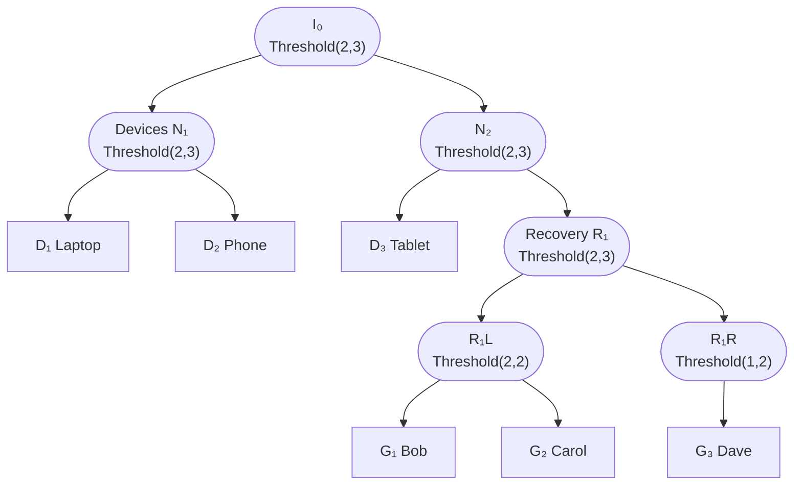
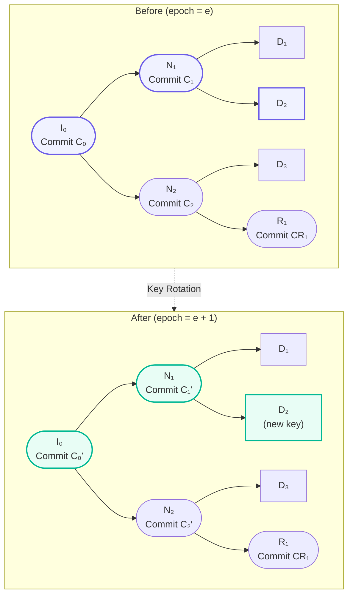

# Aura Journal: Threshold Identity and Ledger System

## Executive Summary

The Aura Journal implements a two-layer architecture that separates authentication (who you are) from the replicated history of operations. The system consists of a **ratchet tree** for threshold identity management and a **journal ledger** for immutable operation history.

Rather than encoding everything in a single CRDT structure, the Journal maintains:
1. **Ratchet Tree**: A left-balanced binary tree (LBBT) containing devices and guardians with threshold policies on branch nodes
2. **Journal Ledger**: A session-typed CRDT log storing immutable `TreeOp` entries that record tree mutations

This separation provides clear responsibilities: the tree handles authentication (membership and thresholds), while the ledger provides ordering, convergence, and audit trails.

**Current Implementation**:
- **Ratchet Tree**: Left-balanced binary tree with deterministic indices (TreeKEM-inspired structure)
- **Journal Ledger**: Session-typed CRDT map storing `TreeOp` entries by epoch
- **TreeSession Choreography**: Orchestrated protocols for tree mutations (add/remove/rotate)
- **Intent Pool**: OR-set for staging proposed operations with high availability
- **Capability System**: Explicit capability references issued as part of `TreeOp`s
- **Threshold Signatures**: Multi-signatures attest all tree operations
- Implemented backend: Ed25519 + FROST + Blake3

---

## 1. Architecture and Design

### 1.1 Design Principles

The Journal implements a clean two-layer architecture that separates concerns:

| Layer | Responsibility | Implementation |
|-------|---------------|----------------|
| **Ratchet Tree** | Authentication - "Who you are" | Left-balanced binary tree with threshold policies |
| **Journal Ledger** | History - "What happened" | Session-typed CRDT log of immutable `TreeOp` entries |
| **TreeSession** | Coordination - "How changes happen" | Choreographed protocols with threshold signatures |
| **Intent Pool** | Availability - "Staging proposed changes" | OR-set of proposed operations |

This separation provides:
- **Clear responsibilities**: Tree handles identity, ledger handles history
- **Explicit operations**: Every tree mutation produces a signed, auditable `TreeOp`
- **Structured identity**: Left-balanced layout gives deterministic node indices
- **High availability**: Intent pool allows offline proposal staging
- **Convergence**: Session-type algebra ensures deterministic merging

### 1.2 Cryptographic Modularity

The Journal separates **structure** from **cryptographic realization**:

| Component | Dependency | Implementation |
|-----------|-----------|-----------------|
| **Node policy logic** (Threshold{m,n}, Contains edges) | None | Pure structural semantics |
| **CRDT merge rules** | None | Deterministic via Automerge |
| **Structural invariants** (acyclic, m-of-n semantics) | None | Graph validation |
| **Commitment derivation** | Hash function (Blake3) | Generic hash-based design |
| **Threshold share operations** | Threshold-crypto libraries | External FROST/SSS implementations |
| **AEAD wrapping of node secrets** | AES-GCM + KDF | Standard crypto primitives |
| **Capability token verification** | Signature scheme | External token library |

**Result**: 80-90% of the system (data structure, policies, CRDT merges, capability model, recovery logic) is **curve-agnostic**. Only threshold and key derivation layers depend on specific cryptographic backends.

#### Pluggable Crypto Architecture

**Current Implementation** (MVP):
- Single backend: Ed25519 with Blake3 hashing
- External threshold-crypto library for share operations
- Minimal versioning: backend identifiers (Ed25519V1, Blake3V1) prevent compatibility issues

**Extension Points** (for future phases):
- BLS12_381 for threshold signatures
- Alternative hash functions (SHA256, Poseidon)
- Post-quantum signature schemes
- Domain-specific optimizations (ZK-friendly hashes, hardware acceleration)

All backend changes remain isolated from the core Journal semantics—the graph structure and CRDT properties continue to work with any underlying cryptographic backend.

### 1.3 Ratchet Tree Structure

The Journal uses a **left-balanced binary tree (LBBT)** with deterministic node indices, inspired by TreeKEM but adapted for threshold identities:

#### Node Types

```text
LeafNode {
  leaf_id: LeafId,            // Stable index assigned via LBBT rules
  role: Device | Guardian,    // Fixed semantics
  public_key: KeyPackage,     // E2E or signing key bundle
  meta: LeafMeta,             // Display name, platform hints
}

BranchNode {
  node_id: NodeIndex,         // Implicit from tree position
  policy: All | Any | Threshold { m, n },
  commitment: Hash,           // Hash(branch tag || epoch || left || right)
}
```

#### Policies and Structure

- **Policies live only on branch nodes**: Leaves inherit the policy of their ancestor path
- **Left-balanced layout**: Every node gets a deterministic `NodeIndex` as in TreeKEM
- **Fixed semantics**: Device vs Guardian roles are explicit, not policy-dependent

#### Example Tree Structure



This tree shows:
- **Device subtree**: Devices occupy the lowest available leaves under threshold branch nodes
- **Recovery subtree**: Guardians are organized using binary splitting to preserve structural invariants
- **Threshold policies**: Each branch node specifies the m-of-n requirement for its subtree
- **Deterministic structure**: LBBT rules ensure consistent tree layout across replicas

#### Graph Structure

Two edge types compose the graph:
- **Contains**: Participates in key derivation; must form an acyclic tree
- **GrantsCapability**: Binds capability tokens to resources; non-deriving

#### Commitment Derivation

Each node has a **commitment** computed with ordered children to enforce structural identity:

```
Commit(branch_node) = H(
    "BRANCH",
    node_index,
    epoch,
    policy_tag,
    left_child_commitment,
    right_child_commitment
)

Commit(leaf_node) = H(
    "LEAF", 
    leaf_index, 
    epoch, 
    public_key
)
```

This commitment scheme:
- **Enforces structure**: Ordered pair of children prevents topological ambiguity  
- **Enables verification**: Node indices make tree structure cryptographically verifiable
- **Supports auditing**: Commitments provide tamper-evident tree snapshots
- **Deterministic**: Same tree structure always produces same commitment

#### Threshold Unwrap/Wrap

When ≥m valid shares are present for a node:
1. Shares are verified against the node's commitment
2. The node secret is reconstructed using the threshold-crypto library
3. The reconstructed secret serves as the parent's key derivation input (KEK)
4. Parent secrets can then be unwrapped, enabling upward propagation

**Anti-replay**: Shares bind to `(node_id, epoch, policy_hash)`. Rotation increments epoch, invalidating old shares.

#### CRDT Friendliness

The graph structure merges deterministically via session-type-based consensus:
- Children are stored as sets (deterministically ordered during derivation)
- Concurrent add/remove merges via session-type agreement protocols
- Policy updates merge deterministically: for same `n`, higher `m` wins
- Share contributions accumulate; duplicates from same source replace previous entries
- Epoch-based share binding prevents replay after rotation

#### Local Views

Each device materializes only what it needs by starting at a chosen root node:
- Walks only Contains edges for key derivation
- References edges import commitments only (no secrets)
- Gives identities, groups, and guardians each an **eventually consistent** view

#### Guardian & Recovery Modeling

Recovery is modeled as a subtree:
- A **Recovery** node sits under an Identity root with `Threshold{g_m, g_n}`
- Guardian nodes are children under the recovery node
- Recovery = satisfying the recovery subtree's threshold, which rewraps up to identity

Guardians use capability tokens with:
- Resource scope: `journal://recovery/{node_id}/epoch/{epoch}`
- Time bounds: Standard token expiration fields prevent indefinite access
- Revocation: Standard token library revocation prevents compromised guardians

#### Safety Invariants

The Journal maintains these invariants:
1. **Acyclic Contains**: Contains edges form a DAG (enforced on operation application)
2. **Deterministic Order**: Children sorted by NodeId during derivation
3. **Share Binding**: Shares bind to `(node_id, epoch)` for anti-replay
4. **Epoch Increment**: Rotation increments epoch, invalidating old shares
5. **Forward Secrecy**: Old secrets become unrecoverable after rotation
6. **Post-Compromise Security**: New secrets generated with fresh randomness

---

## 2. Integration with Aura's Architecture

### 2.1 Architectural Layers

The Journal integrates seamlessly within Aura's clean architecture:

```
┌──────────────────────────────────────────────────┐
│ aura-agent (Layer 3: Device Runtime)             │
│ - Device-side flows (add_device, recover, etc.)  │
│ - Materializes IdentityView / GroupView          │
│ - Integrates capability token library            │
└──────────────────┬───────────────────────────────┘
                   │
┌──────────────────▼───────────────────────────────┐
│ External Capability Library (Mature OCAP Impl)   │
│ - TokenIssuer/TokenVerifier                      │
│ - Resource scoping: journal://node/{id}          │
│ - Standard delegation, attenuation, revocation   │
└──────────────────┬───────────────────────────────┘
                   │
┌──────────────────▼───────────────────────────────┐
│ aura-authentication (Layer 1: WHO Verification)  │
│ - Verifies capability token signatures           │
│ - No changes from Journal integration            │
└──────────────────┬───────────────────────────────┘
                   │
┌──────────────────▼───────────────────────────────┐
│ aura-journal (Layer 0: Journal Implementation)   │
│ - Merklized threshold signature tree (CRDT)      │
│ - Automerge for deterministic CRDT operations    │
│ - Petgraph for graph algorithms                  │
│ - Threshold-crypto for share operations          │
│ - Handlers and middleware for composition        │
└──────────────────┬───────────────────────────────┘
                   │
┌──────────────────▼───────────────────────────────┐
│ aura-types (Foundation Layer)                    │
│ - NodeId, NodeKind, NodePolicy type definitions  │
│ - EdgeId, EdgeKind definitions                   │
│ - Canonical types for all Journal primitives     │
└──────────────────────────────────────────────────┘
```

### 2.2 Integration with Existing Systems

#### aura-choreography (Choreographic Coordination)

The choreography infrastructure orchestrates distributed Journal operations:

**Share Contribution Protocol**: Coordinates M-of-N threshold operations
- Flexible agreement: M devices sufficient for most operations
- Split-brain resolution: Shares accumulate via session-type consensus; first group to reach M valid shares unlocks the secret
- Pattern: Initiator broadcasts intent → collect M shares → apply via choreographic witness

**Rotation Protocol**: Orchestrates node secret rotation
- Stricter requirements for epoch changes only: May want ⌊(N+M)/2⌋ + 1
- Conflicting rotations resolve deterministically: Higher epoch wins (session type ensures ordering)
- Pattern: Initiator broadcasts rotate intent → collect M+ acks → commit rotation

**Recovery Ceremony Protocol**: Coordinates guardian-assisted recovery
- Uses guardian subtree from Journal structure
- Guardians contribute shares per Journal policy
- Validates guardian capability tokens before share acceptance

#### aura-crypto (Cryptography Layer)

The cryptography layer provides building blocks; Journal composes them:
- **FROST & DKD**: Used for threshold signing and key derivation
- **HPKE**: Used for guardian share encryption
- **AES-GCM**: Used for node secret wrapping
- **Shamir SSS**: Used for share splitting via external libraries

No custom crypto code—all cryptographic operations use existing aura-crypto primitives and external verified libraries.

#### aura-store (Storage)

Store operations use keys derived from unwrapped Journal identity secrets. No changes to storage layer.

#### aura-transport (Communication)

Transport ships Journal operations as CRDT deltas. No changes required.

---

## 3. Data Model

### 3.1 TreeOp Structure

The journal ledger stores immutable `TreeOp` entries that record all tree mutations:

```rust
#[derive(Debug, Clone, Serialize, Deserialize)]
pub struct TreeOp {
    /// Strictly increasing epoch counter
    pub epoch: u64,
    /// Type of operation performed
    pub op: TreeOpKind,
    /// Node indices affected by this operation  
    pub affected_indices: Vec<NodeIndex>,
    /// New commitments after the operation
    pub new_commitments: Vec<(NodeIndex, Hash)>,
    /// Capability references issued by this operation
    pub capability_refs: Vec<CapabilityRef>,
    /// Threshold signatures attesting this operation
    pub attestation: MultiSignature,
    /// When this operation was authored
    pub authored_at: Timestamp,
    /// Device that authored this operation
    pub author: DeviceId,
}

#[derive(Debug, Clone, Serialize, Deserialize)]
pub enum TreeOpKind {
    /// Add a new leaf to the tree
    AddLeaf,
    /// Remove a leaf from the tree  
    RemoveLeaf,
    /// Rotate secrets along a path
    RotatePath,
    /// Update branch policies
    RefreshPolicy,
    /// Grant recovery capability
    RecoveryGrant,
    /// Bump epoch to invalidate credentials
    EpochBump,
}
```

### 3.2 Node Structure

```rust
#[derive(Debug, Clone, Serialize, Deserialize)]
pub enum Node {
    Leaf(LeafNode),
    Branch(BranchNode),
}

#[derive(Debug, Clone, Serialize, Deserialize)]
pub struct LeafNode {
    /// Stable index assigned via LBBT rules
    pub leaf_id: LeafId,
    /// Device or Guardian role
    pub role: LeafRole,
    /// E2E or signing key bundle
    pub public_key: KeyPackage,
    /// Display name, platform hints, etc.
    pub meta: LeafMeta,
}

#[derive(Debug, Clone, Serialize, Deserialize)]
pub struct BranchNode {
    /// Implicit from tree position
    pub node_id: NodeIndex,
    /// Threshold policy for this subtree
    pub policy: Policy,
    /// Cryptographic commitment 
    pub commitment: Hash,
}

#[derive(Debug, Clone, Serialize, Deserialize)]
pub enum Policy {
    /// All children must participate
    All,
    /// Any one child can participate
    Any,
    /// M-of-N threshold requirement
    Threshold { m: u8, n: u8 },
}
```

### 3.3 Capability References

Capability tokens are issued as part of TreeOps, providing explicit authorization:

```rust
#[derive(Debug, Clone, Serialize, Deserialize)]
pub struct CapabilityRef {
    /// Unique capability identifier
    pub id: CapabilityId,
    /// Resource this capability grants access to
    pub resource: ResourceUri, // e.g., journal://recovery/{leaf}#{epoch}
    /// When this capability expires
    pub expires_at: Timestamp,
    /// Cryptographic signature over the capability
    pub signature: CapabilitySig,
}
```

### 3.4 Intent Pool Structure

The intent pool stages proposed operations for high availability:

```rust
#[derive(Debug, Clone, Serialize, Deserialize)]
pub struct Intent {
    /// Unique intent identifier
    pub intent_id: IntentId,
    /// Proposed tree operation
    pub op: TreeOpKind,
    /// Nodes that will be affected
    pub path_span: Vec<NodeIndex>,
    /// Tree snapshot this intent was based on
    pub snapshot_commitment: Hash,
    /// Priority for deterministic ranking
    pub priority: u64,
    /// Device that authored this intent
    pub author: DeviceId,
}
```

### 3.4 Edge Types

```rust
#[derive(Debug, Clone, Serialize, Deserialize)]
pub enum EdgeKind {
    /// Parent-child containment (acyclic, participates in derivation)
    Contains,
    /// OCAP binding (capability token → resource)
    GrantsCapability,
}

#[derive(Debug, Clone, Serialize, Deserialize)]
pub struct KeyEdge {
    /// Unique edge identifier
    pub id: EdgeId,
    /// Source node
    pub from: NodeId,
    /// Target node
    pub to: NodeId,
    /// Edge semantics
    pub kind: EdgeKind,
}
```

### 3.5 Example Structures

**Simple Identity (2-of-3)**:
```
Identity(Alice)[Threshold{2,3}]
  ├─ Device(Laptop)[leaf]
  ├─ Device(Phone)[leaf]
  └─ Device(Tablet)[leaf]
```

**Identity with Guardian Recovery**:
```
Identity(Alice)[Threshold{2,3}]
  ├─ Device(Laptop)[leaf]
  ├─ Device(Phone)[leaf]
  ├─ Device(Tablet)[leaf]
  └─ Recovery(Alice)[Threshold{2,3}]
       ├─ Guardian(Bob)[leaf]
       ├─ Guardian(Carol)[leaf]
       └─ Guardian(Dave)[leaf]
```

**Private Group with Messaging**:
```
Group(ProjectTeam)[Threshold{2,3}, messaging_key: encrypted]
  ├─ Member(Alice) ──(Contains)──► Identity(Alice)
  ├─ Member(Bob)   ──(Contains)──► Identity(Bob)
  └─ Member(Carol) ──(Contains)──► Identity(Carol)
```

---

## 4. Operations

The Journal supports these tree operations through TreeSession choreography:

### 4.1 Tree Operations

**AddLeaf**: Insert a new device or guardian
- TreeSession loads current tree snapshot
- New leaf publishes KeyPackage  
- Path from leaf to root is recalculated
- Produces `TreeOp::AddLeaf` with affected indices and new commitments

**RemoveLeaf**: Remove a device or guardian
- Blanks the leaf and rebalances (swap with last leaf to maintain LBBT)
- Runs RotatePath for affected path to ensure forward secrecy
- Produces `TreeOp::RemoveLeaf`

**RotatePath**: Generate fresh secrets for a path
- Initiator selects leaf and invites required co-path holders
- Share round produces fresh secrets for each node on the direct path
- Produces `TreeOp::RotatePath` with updated commitments
- Increments epoch to invalidate old shares

### 4.2 Key Rotation Flow

The key rotation process demonstrates how TreeSessions coordinate tree mutations:



**Key Rotation Process**:
1. **Snapshot**: Initiator captures latest commitment `C_epoch`
2. **Proposal**: `RotatePath { leaf_id, snapshot: C_epoch }` broadcast to peers  
3. **Share Round**: Path participants derive fresh secrets (kept inside session)
4. **Finalize**: New commitments computed, threshold signature attests update, epoch increments
5. **Ledger Commit**: Append `TreeOp::RotatePath` with new root commitment

The blue highlighted nodes show the ancestor path participating in rotation. The green nodes show refreshed commitments after the TreeSession finalizes and bumps the epoch.

### 4.2 Edge Operations

**AddEdge**: Establish relationship between nodes
- `Contains`: Creates derivation link (checked for acyclicity)
- `GrantsCapability`: Binds OCAP token to journal resource

**RemoveEdge**: Break relationship (soft delete with tombstone)
- Enables CRDT-friendly edge removal
- Contains removal triggers re-derivation

### 4.3 Threshold Operations

**ContributeShare**: Device contributes share toward unwrapping node
- Validated against node commitment
- Accumulated in Automerge structure
- When ≥m valid shares present, node unwraps automatically

### 4.4 Group Operations

**SendGroupMessage**: Encrypted message to group members
- Encrypted with unwrapped group messaging key
- Sender proves group membership via threshold participation

---

## 5. Security Properties

### 5.1 Topological Security

- **Acyclic Contains**: Enforced at operation application time
- **References Isolation**: No secrets cross References edges—only commitments
- **Deterministic Ordering**: Children sorted by NodeId for stable commitments

### 5.2 Cryptographic Security

- **Forward Secrecy**: Old secrets unrecoverable after rotation (epoch bump)
- **Post-Compromise Security**: New secrets independent of old material (fresh randomness)
- **Threshold Correctness**: <m shares fail, ≥m shares succeed (via threshold-crypto library)
- **Anti-Replay**: Shares bind to `(node_id, epoch, policy_hash)`

### 5.3 Authorization Security

- **OCAP-Gated**: All topology mutations require valid capability tokens
- **Revocation**: Revoked tokens prevent further operations
- **Delegation**: Delegated tokens carry subset of permissions

---

## 6. Usage Examples

### Creating an Identity with 3 Devices

```rust
// Create 3 device nodes
let laptop = KeyNode::new(device_id_1, NodeKind::Device, NodePolicy::Any);
let phone = KeyNode::new(device_id_2, NodeKind::Device, NodePolicy::Any);
let tablet = KeyNode::new(device_id_3, NodeKind::Device, NodePolicy::Any);

// Create identity with 2-of-3 threshold
let identity = KeyNode::new(
    identity_id,
    NodeKind::Identity,
    NodePolicy::Threshold { m: 2, n: 3 },
);

// Add to journal via CRDT
account_state.add_journal_node(laptop)?;
account_state.add_journal_node(phone)?;
account_state.add_journal_node(tablet)?;
account_state.add_journal_node(identity)?;

// Add derivation edges
account_state.add_journal_edge(KeyEdge::new(identity_id, device_id_1, EdgeKind::Contains))?;
account_state.add_journal_edge(KeyEdge::new(identity_id, device_id_2, EdgeKind::Contains))?;
account_state.add_journal_edge(KeyEdge::new(identity_id, device_id_3, EdgeKind::Contains))?;
```

### Adding a Guardian for Recovery

```rust
// Create guardian node
let guardian = KeyNode::new(guardian_id, NodeKind::Guardian, NodePolicy::Any);

// Create recovery subtree
let recovery = KeyNode::new(
    recovery_id,
    NodeKind::Identity,
    NodePolicy::Threshold { m: 2, n: 5 },
);

// Add nodes and edges
account_state.add_journal_node(guardian)?;
account_state.add_journal_node(recovery)?;
account_state.add_journal_edge(KeyEdge::new(identity_id, recovery_id, EdgeKind::Contains))?;
account_state.add_journal_edge(KeyEdge::new(recovery_id, guardian_id, EdgeKind::Contains))?;

// Bind capability token to recovery resource
let token = create_capability_token(
    "journal://recovery/{recovery_id}/epoch/1",
    guardian_public_key,
    expires_at,
);
account_state.grant_capability(token.id, recovery_id)?;
```

### Group Messaging

```rust
// Create group node with messaging key
let group = KeyNode::new(
    group_id,
    NodeKind::Group,
    NodePolicy::Threshold { m: 2, n: 3 },
);
group.enc_messaging_key = Some(wrapped_group_key);

// Add member references
for member_identity in members {
    account_state.add_journal_edge(
        KeyEdge::new(group_id, member_identity, EdgeKind::Contains),
    )?;
}

// Send encrypted message
account_state.send_group_message(group_id, encrypted_content, sender_proof)?;
```

---

## 7. Future Extensions

The Journal is designed for future enhancement:

### Phase 8+ Opportunities

1. **K-Ary Auto-Balancing**: Automatic tree rebalancing for large groups
2. **Alternative Curves**: BLS12_381, Pallas/Vesta, post-quantum signatures
3. **Composite Groups**: Group-in-group nesting for organization hierarchies
4. **Advanced Messaging**: Integration with additional group messaging protocols
5. **Optimization**: Incremental materialization and caching strategies
6. **Formal Verification**: Automated proofs of security properties

All future enhancements remain compatible with the core Journal structure and CRDT semantics.

---

## 9. Conclusion

The Journal implements a clean two-layer architecture that separates authentication (ratchet tree) from operation history (ledger). By **making every transition explicit**, the Journal achieves:

- **Clear Separation of Concerns**: Tree handles identity, ledger handles history, choreography handles coordination
- **Explicit Auditability**: Every tree mutation produces a signed, immutable `TreeOp` 
- **Deterministic Structure**: Left-balanced binary tree with verifiable commitments
- **High Availability**: Intent pool allows offline operation staging and eventual execution
- **Threshold-Native Design**: Multi-signatures attest all operations, aligning with relational trust model
- **Future-Proof Architecture**: Tree operations and ledger structure support rich extensions

This revision addresses the complexity issues from the previous unified graph approach while maintaining the core benefits of threshold identity and social recovery.
