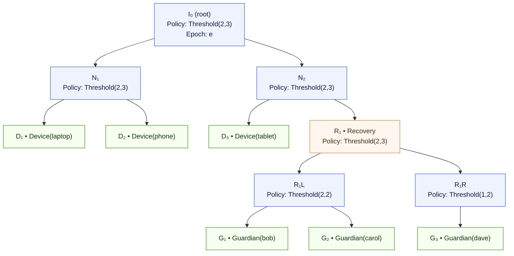

# Aura Ratchet Tree with Threshold Signing: Revised Spec

## Scope

This document defines a ratchet tree with threshold signing and a journal ledger of operations. It specifies data types, protocol outputs, journal representation, reduction, policy lattice, privacy, garbage collection, and minimal APIs. It follows a model where sessions coordinate work and the journal stores only attested facts.

## Model

Authentication is a tree of devices and guardians. History is an append-only ledger of attested operations. Sessions run multi-party protocols. A session produces one attested operation or produces nothing. The journal holds only attested operations. The journal never stores shares or transcripts.

## Data Types

```rust
pub type Epoch = u64;
pub type Hash32 = [u8; 32];

#[repr(u16)]
pub enum Policy {
    Any,                    // 1-of-n
    Threshold { m: u16, n: u16 },
    All,                    // n-of-n
}

pub struct LeafId(pub u32);
pub struct NodeIndex(pub u32);

pub enum LeafRole { Device, Guardian }

pub struct LeafNode {
    pub leaf_id: LeafId,
    pub role: LeafRole,
    pub public_key: Vec<u8>,    // serialized key package
    pub meta: Vec<u8>,          // optional opaque metadata
}

pub enum NodeKind { Leaf(LeafNode), Branch }

pub struct BranchNode {
    pub node: NodeIndex,
    pub policy: Policy,
    pub commitment: Hash32,
}

pub struct TreeCommitment(pub Hash32);

pub enum TreeOpKind {
    AddLeaf { leaf: LeafNode, under: NodeIndex },
    RemoveLeaf { leaf: LeafId, reason: u8 },
    ChangePolicy { node: NodeIndex, new_policy: Policy },
    RotateEpoch { affected: Vec<NodeIndex> }, // hint only
}

pub struct TreeOp {
    pub parent_epoch: Epoch,
    pub parent_commitment: Hash32, // or parent CID
    pub op: TreeOpKind,
    pub version: u16,
}

pub struct AttestedOp {
    pub op: TreeOp,
    pub agg_sig: Vec<u8>,          // FROST aggregate signature
    pub signer_count: u16,         // cardinality only
}
```

## Commitments

Branch commitment:

```
CommitBranch = H(
  "BRANCH", version, node_index, epoch,
  policy_hash, left_commitment, right_commitment
)
```

Leaf commitment:

```
CommitLeaf = H("LEAF", version, leaf_index, epoch, pubkey_hash)
```

Children are ordered by `NodeIndex`. The epoch and version are always included.

## Policy Lattice

Policies form a meet-semilattice. The partial order is “more restrictive is smaller”.

* Any ≥ Threshold{m1,n} if m1 ≥ 1
* Threshold{m2,n} ≤ Threshold{m1,n} if m2 ≥ m1 and n equal
* All ≤ Threshold{n,n}

The meet selects the stricter policy.

## Journal Integration

The journal stores `AttestedOp` items as facts in the underlying CRDT system. Each `TreeOp` references a parent by `(parent_epoch, parent_commitment)` or by a parent CID. The ledger does not store authors. The ledger does not store share material. Time stamps are optional and are not used for ordering.

### Journal Storage Model

Tree operations integrate with the journal's dual-layer architecture:

```rust
type OpLog = OrSet<AttestedOp>;  // Join-semilattice for operation facts
type TreeState = ReducedState;   // Derived from operation log
```

Operations are stored as facts that only accumulate. Tree state is computed on-demand through deterministic reduction. The journal's CRDT properties ensure eventual consistency across replicas without requiring consensus protocols.

### Operation Persistence

The journal implements a two-phase storage pattern for tree operations:

1. **Intent Phase**: Proposed operations stored in volatile intent pool
2. **Commitment Phase**: Attested operations appended to durable fact log

This separation allows coordination protocols to proceed without blocking the durable journal state.

## Reduction

Let the set of attested ops be `S`. Build a DAG using parent references. Topologically sort by ancestry. If multiple children share the same parent, resolve a single winner. Use the maximum of `H(op)` as the tie breaker. Mark others as superseded. Apply winners in order and update the tree state and commitment at each step. The result is a unique `TreeState`.

Required properties:

* Resolver is deterministic on all nodes.
* Application is total for valid operations.
* Invalid operations are rejected during application.

### Journal Reduction Integration

Tree state reduction leverages the journal's CRDT foundation:

```rust
fn reduce(journal: &Journal) -> Result<TreeState, Error> {
    let ops = journal.facts.get_namespace("tree_ops")?;
    let sorted = topological_sort(ops)?;
    apply_operations_deterministically(sorted)
}
```

Reduction is a pure function over the operation log. Multiple replicas computing reduction over the same operation set always produce identical tree states. This property emerges from the journal's semilattice laws and deterministic conflict resolution.

## Tree Diagram



## Epoch and Ratchet

After any applied operation, derive a new epoch or reuse the current one. A pure epoch advance is `RotateEpoch`. New per-epoch FROST shares are derived off chain and are not recorded. Bind shares and nonces to `(node_id, epoch, policy_hash)` to avoid replay.

## Operations

`AddLeaf` inserts a device or guardian under a branch. `RemoveLeaf` blanks a leaf and updates affected path. `ChangePolicy` applies a stricter or equal policy. `RotateEpoch` refreshes secrets along a path or globally. Each operation is produced by a session that collects at least `m` valid partial signatures for the current policy at the relevant root. The aggregate signature verifies against the group public key that is committed in the tree.

## Intent Lifecycle

Intents use a typestate lattice: `Proposed < Attesting < Finalized` or `Aborted`. Store only the most recent state per `intent_id`. The intent store is not part of the durable journal. It is a local cache or a volatile CRDT with compaction. Only `AttestedOp` enters the journal.

## Authorization

Authorization is external to the tree. The effective capability is a meet over local policy and delegations in the web of trust. Capability checks occur before a device sends a partial signature or a proposal. Tree operations do not embed capability tokens. Policy changes in the tree represent durable authority changes.

## Privacy

Sessions run under a relationship context or a group context. Messages are padded. Timing and batching follow configured leakage budgets. The journal does not include author identities. The journal includes signer count only. Parent binding and aggregate signatures are sufficient for validity.

## Garbage Collection

Define a snapshot as `(epoch, commitment, roster, policy_at_nodes)`. Define a compaction `h` that replaces the prefix of the ledger with the snapshot and keeps later operations. `h` is a join-preserving retraction. It satisfies `h(x ⊔ y) = h(x) ⊔ h(y)` and `h(x) ≤ x`. Store snapshot metadata as a compact fact. Old clients may refuse pruning and still merge later facts.

### Journal Snapshot Integration

Snapshots extend the journal's CRDT model through join-preserving retractions:

```rust
pub struct Snapshot {
    pub cut_epoch: Epoch,
    pub tree_commitment: Hash32,
    pub compacted_state: TreeState,
    pub retention_policy: RetentionPolicy,
}
```

Snapshot application maintains semilattice properties. Future fact merges remain valid after compaction. The journal continues operating with reduced history while preserving all convergence guarantees.

## Recovery

Recovery is a subtree under an identity. Initiate recovery by committing `RecoveryInitiated { t0, cooldown }`. Commit recovery after the cooldown with a threshold signature from the recovery subtree. Both steps are attested operations. Cooldown prevents fast takeovers. Revocation of recovery participants is a `RemoveLeaf` in the recovery subtree.

## Tree Application

`apply(attested_op)` performs:

1. Verify aggregate signature against the committed group key for the parent state.
2. Recompute commitments for all nodes in the affected path.
3. Update epoch if `RotateEpoch` or if the operation policy requires an epoch advance.
4. Validate invariants: acyclicity of `Contains`, ordered children, stricter or equal policy.

If any step fails, reject the operation.

## Invariants

Facts only grow. Authority only shrinks. Contexts do not mix. A reduction of any finite valid set `S` yields a unique `TreeState`. An aggregate signature always binds to the parent epoch and commitment. A snapshot never widens authority. A policy meet never expands permissions.

## Synchronization Programs

Tree synchronization implements four choreographic programs that coordinate distributed state management. Each program interacts with the journal through CRDT operations while maintaining privacy and convergence guarantees.

### Anti-Entropy Protocol

Operation log synchronization uses digest-based anti-entropy:

```rust
struct AEState {
    have: BloomDigest,    // Local operation digest
    want: Vec<Cid>,       // Missing operation identifiers
}
```

Protocol exchanges digests and transfers missing operations. The journal's OR-set semantics ensure convergent operation logs across all participants.

### Operation Broadcast

Immediate dissemination of newly committed operations:

```rust
// Choreography sketch
// Producer -> Neighbors: NewCid{cid}
// Neighbors -> Producer: Need{cid?} 
// Producer -> Neighbors: Op{attested_op}
```

Reduces operation propagation latency after threshold ceremonies complete. Integrates with journal's fact append mechanism for atomic commitment.

### Threshold Ceremonies

Multi-party coordination for operation attestation:

```rust
// Roles: Coordinator, Signers, Observers
// Protocol produces single AttestedOp or nothing
// Success: append to journal operation log
// Failure: no journal modification
```

Sessions coordinate partial signature collection and aggregation. Only successful ceremonies append attested operations to the journal.

### Snapshot Coordination

Distributed garbage collection through threshold approval:

```rust
// Proposer -> Quorum: SnapProposal{cut}
// Quorum -> Proposer: Approve{partial}
// Result: Snapshot fact + journal compaction
```

Snapshots implement join-preserving retractions over the journal state. Compaction reduces history while preserving future merge semantics.

## Minimal APIs

```rust
// aura-crypto
fn frost_sign_part(share: &Share, msg: &[u8], nonce: &Nonce) -> Partial;
fn frost_aggregate(parts: &[Partial]) -> Vec<u8>;
fn frost_verify_agg(pk_group: &[u8], msg: &[u8], agg_sig: &[u8]) -> bool;

// aura-journal
fn append_attested(op: AttestedOp) -> Result<Cid, Error>;
fn reduce(all: &[AttestedOp]) -> Result<TreeState, Error>;
fn snapshot(state: &TreeState) -> Snapshot;

// aura-protocol  
trait ThresholdCeremony {
    fn propose(&self, op: TreeOpKind) -> Result<ProposalId, Error>;
    fn contribute(&self, pid: ProposalId, part: Partial) -> Result<(), Error>;
    fn aggregate(&self, pid: ProposalId) -> Result<AttestedOp, Error>;
}

// Synchronization programs
trait AntiEntropy {
    fn sync_with(&self, peer: PeerId) -> Result<(), Error>;
}

trait Broadcaster {
    fn announce(&self, cid: Cid) -> Result<(), Error>;
}

trait Snapshots {
    fn propose_and_commit(&self, cut: Cut) -> Result<Snapshot, Error>;
}
```

## Testing

Property tests cover policy meet laws, resolver determinism, reduction confluence, aggregate signature correctness, replay rejection, snapshot retraction, and privacy budgets in simulated sessions.
