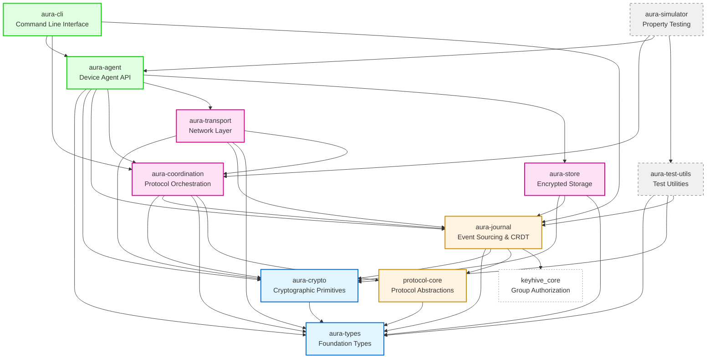
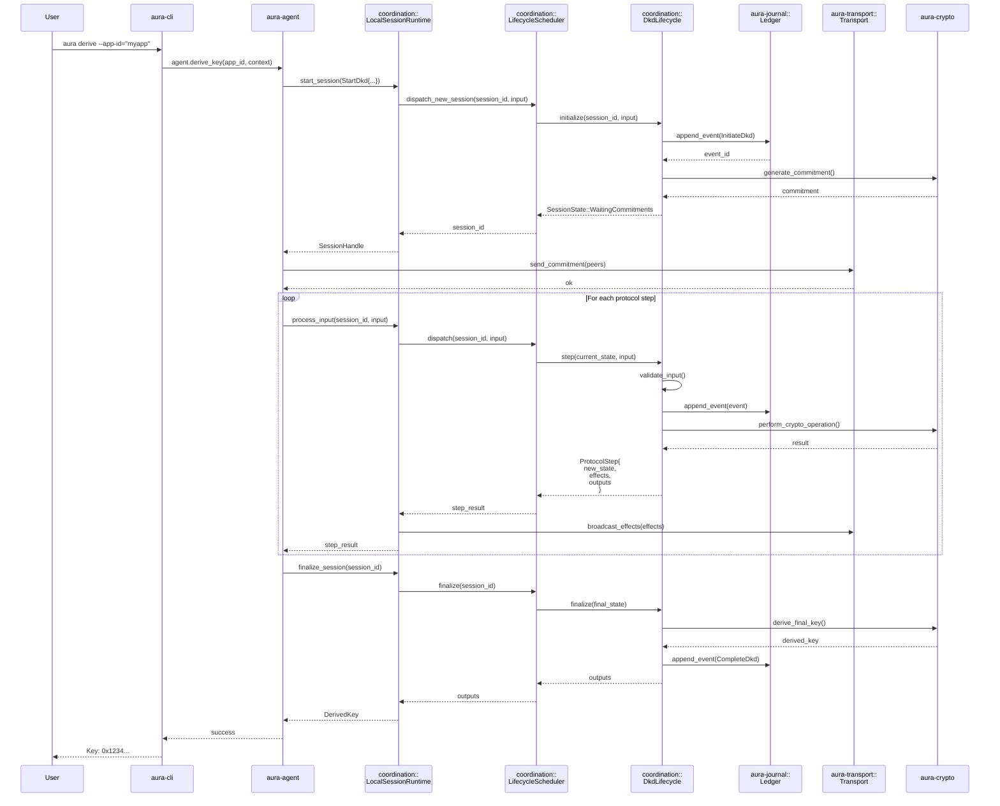
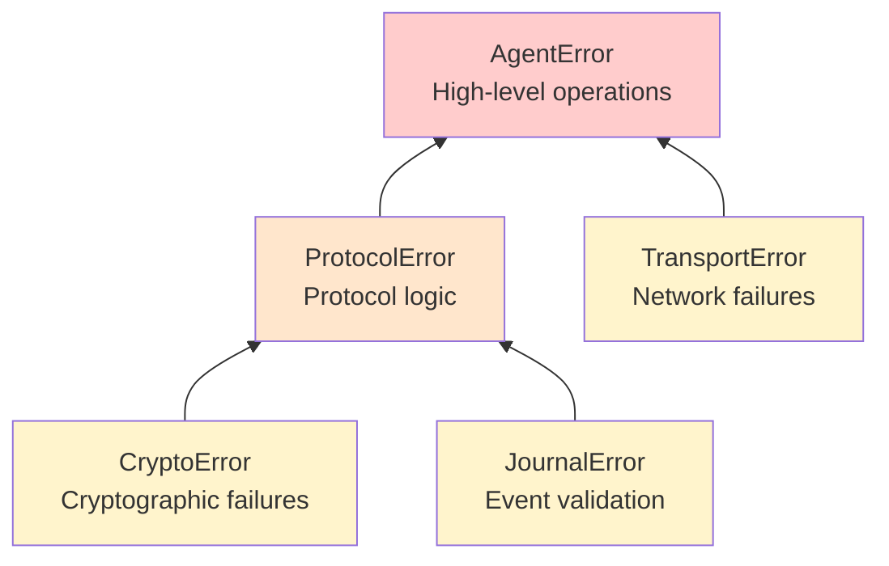

# Inter-Crate Architecture and Protocol Lifecycle

## Overview

Aura is structured as a modular workspace with clear separation of concerns across multiple crates. This document describes the dependency relationships, APIs exposed between crates, and the complete code path for a protocol lifecycle execution.

## Crate Dependency Graph

The following diagram shows the dependency structure of the core Aura crates. Foundation crates are at the bottom, with higher-level orchestration crates building on top.



## Crate Responsibilities and APIs

### Foundation Layer

#### `aura-types`
**Purpose**: Shared type definitions used across all crates

**Exports**:
- `AccountId`, `DeviceId`, `GuardianId` - Core identity types
- `SessionId`, `ProtocolId` - Protocol identifiers
- `IndividualId`, `CapabilityId` - Capability system types
- Error types and common utilities

**Dependencies**: None (foundation crate)

---

#### `aura-crypto`
**Purpose**: Cryptographic primitives and operations

**Exports**:
- `Effects` trait for deterministic operations
- Key derivation: `derive_encryption_key()`, `derive_signing_key()`
- FROST primitives: Key generation, signing, verification
- Sealing/unsealing: `seal_data()`, `unseal_data()`
- Signature types: `Ed25519SigningKey`, `Ed25519Signature`

**Dependencies**: `aura-types`

**Key APIs**:
```rust
// Key derivation
pub fn derive_encryption_key(
    root_key: &[u8],
    spec: &KeyDerivationSpec
) -> Result<EncryptionKey>;

// FROST operations
pub fn frost_keygen(
    threshold: u16,
    participant_count: u16,
    effects: &Effects
) -> Result<FrostKeyPackage>;

// Data sealing
pub fn seal_data(data: &[u8], key: &EncryptionKey) -> Result<SealedData>;
```

---

### Core Protocol Layer

#### `protocol-core`
**Purpose**: Unified protocol lifecycle abstractions

**Exports**:
- `ProtocolLifecycle` trait - Core protocol interface
- `ProtocolDescriptor` - Protocol metadata and registration
- `ProtocolInput`, `ProtocolStep` - Execution primitives
- `SessionState`, `StateWitness` - Typestate enforcement
- `ProtocolCapabilities`, `ProtocolEffects` - Capability system

**Dependencies**: `aura-types`

**Key Traits**:
```rust
#[async_trait]
pub trait ProtocolLifecycle: Send + Sync {
    /// Register the protocol descriptor
    fn descriptor(&self) -> ProtocolDescriptor;
    
    /// Initialize a new session
    async fn initialize(
        &self,
        session_id: SessionId,
        input: ProtocolInput
    ) -> Result<SessionState>;
    
    /// Process a protocol step
    async fn step(
        &self,
        state: SessionState,
        input: ProtocolInput
    ) -> Result<ProtocolStep>;
    
    /// Finalize and extract outputs
    async fn finalize(&self, state: SessionState) -> Result<Vec<u8>>;
}
```

---

#### `aura-journal`
**Purpose**: Event-sourced account state with CRDT semantics

**Exports**:
- `Ledger` - Main journal interface
- `Event`, `EventType` - Event definitions
- `EventAuthorization` - Cryptographic event validation
- `AccountState` - Derived state from event log
- Capability tokens and delegation chains
- Group state and CGKA integration (via `keyhive_core`)

**Dependencies**: `aura-types`, `aura-crypto`, `protocol-core`, `keyhive_core`

**Key APIs**:
```rust
impl Ledger {
    /// Append a new event to the ledger
    pub fn append_event(&mut self, event: Event) -> Result<()>;
    
    /// Derive current account state
    pub fn derive_state(&self) -> Result<AccountState>;
    
    /// Get all events for a session
    pub fn events_for_session(&self, session_id: SessionId) -> Vec<Event>;
    
    /// Verify event authorization chain
    pub fn verify_event(&self, event: &Event) -> Result<()>;
}
```

---

### Coordination & Transport Layer

#### `aura-coordination`
**Purpose**: Distributed protocol orchestration and execution

**Exports**:
- `LocalSessionRuntime` - Per-device session coordinator
- `LifecycleScheduler` - Protocol lifecycle manager
- Protocol implementations:
  - `DkdLifecycle` - Deterministic key derivation
  - `ResharingLifecycle` - Threshold resharing
  - `RecoveryLifecycle` - Guardian recovery
  - `LockingLifecycle` - Distributed locking
  - `FrostLifecycle` - FROST DKG and signing
- Session types for compile-time protocol safety

**Dependencies**: `aura-types`, `aura-crypto`, `aura-journal`, `protocol-core`

**Key APIs**:
```rust
impl LocalSessionRuntime {
    /// Start a new protocol session
    pub async fn start_session(
        &self,
        command: SessionCommand
    ) -> Result<SessionId>;
    
    /// Send an input to a running session
    pub async fn process_input(
        &self,
        session_id: SessionId,
        input: ProtocolInput
    ) -> Result<ProtocolStep>;
    
    /// Get session status
    pub fn get_session_status(
        &self,
        session_id: SessionId
    ) -> Option<SessionStatus>;
}

impl LifecycleScheduler {
    /// Register a protocol lifecycle
    pub fn register(&mut self, lifecycle: Arc<dyn ProtocolLifecycle>);
    
    /// Dispatch an input to the appropriate protocol
    pub async fn dispatch(
        &self,
        session_id: SessionId,
        input: ProtocolInput
    ) -> Result<ProtocolStep>;
}
```

---

#### `aura-transport`
**Purpose**: Network abstraction with pluggable backends

**Exports**:
- `Transport` trait - Core transport interface
- `CapabilityTransportAdapter` - Capability-aware transport
- Implementations:
  - `MemoryTransport` - In-memory for testing
  - `HttpsRelayTransport` - HTTPS relay for production
  - `NoiseTcpTransport` - Encrypted TCP
  - `SimpleTcpTransport` - Basic TCP
- Presence tickets and peer discovery

**Dependencies**: `aura-types`, `aura-crypto`, `aura-journal`, `aura-coordination`

**Key Traits**:
```rust
#[async_trait]
pub trait Transport: Send + Sync + Clone {
    /// Send a message to a peer
    async fn send(
        &self,
        to: &IndividualId,
        message: Vec<u8>
    ) -> Result<()>;
    
    /// Receive the next message
    async fn receive(&self) -> Result<(IndividualId, Vec<u8>)>;
    
    /// Check presence of a peer
    async fn check_presence(&self, peer: &IndividualId) -> Result<bool>;
}

impl CapabilityTransportAdapter<T: Transport> {
    /// Send with capability verification
    pub async fn send_with_capability(
        &self,
        to: &IndividualId,
        message: Vec<u8>,
        capability: &CapabilityToken
    ) -> Result<()>;
}
```

---

#### `aura-store`
**Purpose**: Encrypted blob storage orchestration

**Exports**:
- `BlobStore` - Encrypted blob storage interface
- Chunking and reassembly
- Encryption key derivation from journal
- Metadata management

**Dependencies**: `aura-types`, `aura-crypto`, `aura-journal`

**Key APIs**:
```rust
impl BlobStore {
    /// Store encrypted data
    pub async fn store(
        &mut self,
        data: &[u8],
        metadata: BlobMetadata
    ) -> Result<BlobId>;
    
    /// Retrieve and decrypt data
    pub async fn retrieve(&self, blob_id: &BlobId) -> Result<Vec<u8>>;
    
    /// Delete a blob
    pub async fn delete(&mut self, blob_id: &BlobId) -> Result<()>;
}
```

---

### Application Layer

#### `aura-agent`
**Purpose**: High-level device agent API with session types

**Exports**:
- `Agent<State>` - Session-typed agent with compile-time safety
- Agent states: `Uninitialized`, `Idle`, `Coordinating`, `Failed`
- `AgentFactory` - Agent construction with dependency injection
- `Storage` trait and `ProductionStorage` implementation
- Transport adapters: `CoordinationTransportAdapter`

**Dependencies**: All core crates (`aura-types`, `aura-crypto`, `aura-journal`, `aura-coordination`, `aura-transport`, `aura-store`)

**Key APIs**:
```rust
impl Agent<Uninitialized> {
    /// Bootstrap a new account
    pub async fn bootstrap(
        self,
        config: BootstrapConfig
    ) -> Result<Agent<Idle>>;
}

impl Agent<Idle> {
    /// Derive an encryption key
    pub async fn derive_key(
        &mut self,
        app_id: String,
        context: String
    ) -> Result<DerivedKey>;
    
    /// Store data with capability tokens
    pub async fn store_data(
        &mut self,
        data: &[u8],
        required_capabilities: Vec<String>
    ) -> Result<BlobId>;
    
    /// Start a protocol session (transitions to Coordinating)
    pub async fn start_protocol(
        self,
        protocol: ProtocolType
    ) -> Result<Agent<Coordinating>>;
}

impl Agent<Coordinating> {
    /// Complete the protocol (transitions back to Idle)
    pub async fn complete_protocol(
        self
    ) -> Result<Agent<Idle>>;
}
```

---

#### `aura-cli`
**Purpose**: Command-line interface for agent operations

**Exports**:
- CLI commands: `init`, `status`, `derive`, `threshold`, `scenarios`
- Configuration management
- Multi-device orchestration

**Dependencies**: `aura-agent`, `aura-coordination`, `aura-journal`

---

### Testing & Tooling

#### `aura-test-utils`
**Purpose**: Shared test utilities and factories

**Exports**:
- Test factories for keys, ledgers, events
- Mock implementations of traits
- Deterministic randomness for testing

**Dependencies**: `aura-types`, `aura-crypto`, `aura-journal`

---

#### `aura-simulator`
**Purpose**: Property-based testing and chaos engineering

**Exports**:
- Scenario engine for multi-agent simulations
- Property monitors for invariant checking
- Quint integration for formal verification
- Chaos injection (network partitions, Byzantine behavior)

**Dependencies**: `aura-coordination`, `aura-agent`, `aura-test-utils`

---

## Protocol Lifecycle: Complete Code Path

This section describes the complete execution flow for a protocol from initiation to completion, showing how the request flows through the crate boundaries.

### High-Level Flow



### Detailed Code Path Breakdown

#### Phase 1: Request Initiation (CLI → Agent)

**Location**: `crates/cli/src/commands/threshold.rs` → `crates/agent/src/agent/session.rs`

1. User invokes CLI command: `aura derive --app-id="myapp" --context="key1"`
2. CLI parses arguments and constructs `DeriveKeyParams`
3. CLI creates/loads an `Agent<Idle>` from configuration
4. CLI calls `agent.derive_key(app_id, context)`

**API Boundary**:
```rust
// crates/agent/src/agent/session.rs
impl Agent<Idle> {
    pub async fn derive_key(
        &mut self,
        app_id: String,
        context: String
    ) -> Result<DerivedKey>
```

---

#### Phase 2: Session Creation (Agent → Runtime)

**Location**: `crates/agent/src/agent/session.rs` → `crates/coordination/src/local_runtime.rs`

1. Agent validates inputs and gathers participant list
2. Agent constructs `SessionCommand::StartDkd`
3. Agent sends command to `LocalSessionRuntime` via channel

**API Boundary**:
```rust
// crates/coordination/src/local_runtime.rs
impl LocalSessionRuntime {
    pub async fn start_session(
        &self,
        command: SessionCommand
    ) -> Result<SessionId>
```

---

#### Phase 3: Lifecycle Registration & Dispatch (Runtime → Scheduler)

**Location**: `crates/coordination/src/local_runtime.rs` → `crates/coordination/src/lifecycle_scheduler.rs`

1. Runtime generates unique `SessionId`
2. Runtime extracts protocol type from command
3. Runtime dispatches to `LifecycleScheduler`
4. Scheduler looks up registered `ProtocolLifecycle` for protocol type

**API Boundary**:
```rust
// crates/coordination/src/lifecycle_scheduler.rs
impl LifecycleScheduler {
    pub async fn dispatch_new_session(
        &self,
        session_id: SessionId,
        input: ProtocolInput
    ) -> Result<SessionState>
```

---

#### Phase 4: Protocol Initialization (Scheduler → Lifecycle)

**Location**: `crates/coordination/src/lifecycle_scheduler.rs` → `crates/coordination/src/protocols/dkd_lifecycle.rs`

1. Scheduler calls `lifecycle.initialize(session_id, input)`
2. Lifecycle validates participants and threshold
3. Lifecycle creates initial `SessionState`
4. Lifecycle generates initial protocol data (e.g., commitment)

**API Boundary**:
```rust
// crates/coordination/src/protocols/dkd_lifecycle.rs
#[async_trait]
impl ProtocolLifecycle for DkdLifecycle {
    async fn initialize(
        &self,
        session_id: SessionId,
        input: ProtocolInput
    ) -> Result<SessionState>
```

---

#### Phase 5: Event Logging (Lifecycle → Journal)

**Location**: `crates/coordination/src/protocols/dkd_lifecycle.rs` → `crates/journal/src/ledger.rs`

1. Lifecycle constructs `Event` (e.g., `InitiateDkdSessionEvent`)
2. Lifecycle signs event with device signing key
3. Lifecycle appends event to `Ledger`
4. Ledger validates event authorization chain
5. Ledger persists event to CRDT log

**API Boundary**:
```rust
// crates/journal/src/ledger.rs
impl Ledger {
    pub fn append_event(&mut self, event: Event) -> Result<()>
```

---

#### Phase 6: Cryptographic Operations (Lifecycle → Crypto)

**Location**: `crates/coordination/src/protocols/dkd_lifecycle.rs` → `crates/crypto/src/frost.rs` or `crates/crypto/src/dkd.rs`

1. Lifecycle calls crypto primitives (commitment, key derivation, signing)
2. Crypto module performs operation with `Effects` for determinism
3. Crypto returns result (commitment, derived key, signature)

**API Boundary**:
```rust
// crates/crypto/src/dkd.rs
pub fn generate_dkd_commitment(
    device_id: &DeviceId,
    nonce: &[u8],
    effects: &Effects
) -> Result<Commitment>

// crates/crypto/src/frost.rs
pub fn frost_keygen(
    threshold: u16,
    participant_count: u16,
    effects: &Effects
) -> Result<FrostKeyPackage>
```

---

#### Phase 7: State Transition (Lifecycle → Scheduler → Runtime)

**Location**: Protocol lifecycle returns through scheduler to runtime

1. Lifecycle constructs `ProtocolStep` with:
   - New `SessionState`
   - `ProtocolEffects` to broadcast
   - Any immediate outputs
2. Scheduler updates session state map
3. Runtime processes effects (send messages, store data)

**Data Structure**:
```rust
// crates/protocol-core/src/lifecycle.rs
pub struct ProtocolStep {
    pub new_state: SessionState,
    pub effects: Vec<ProtocolEffect>,
    pub outputs: Vec<Vec<u8>>,
    pub witness: StateWitness,
}
```

---

#### Phase 8: Network Communication (Runtime → Transport)

**Location**: `crates/coordination/src/local_runtime.rs` → `crates/transport/src/core/traits.rs`

1. Runtime extracts broadcast effects from `ProtocolStep`
2. Runtime serializes protocol messages
3. Runtime calls `Transport::send()` for each peer
4. Transport implementation handles network delivery

**API Boundary**:
```rust
// crates/transport/src/core/traits.rs
#[async_trait]
pub trait Transport {
    async fn send(
        &self,
        to: &IndividualId,
        message: Vec<u8>
    ) -> Result<()>
```

---

#### Phase 9: Receiving Peer Messages (Transport → Runtime → Scheduler)

**Location**: Reverse flow from transport through runtime to scheduler

1. Transport receives message from peer
2. Runtime deserializes message to `ProtocolInput`
3. Runtime calls `scheduler.dispatch(session_id, input)`
4. Scheduler calls `lifecycle.step(current_state, input)`
5. Process repeats from Phase 6

**API Boundary**:
```rust
// crates/coordination/src/lifecycle_scheduler.rs
impl LifecycleScheduler {
    pub async fn dispatch(
        &self,
        session_id: SessionId,
        input: ProtocolInput
    ) -> Result<ProtocolStep>
```

---

#### Phase 10: Protocol Finalization (Scheduler → Lifecycle → Journal)

**Location**: Final protocol state reached

1. Agent detects final state and calls finalize
2. Scheduler calls `lifecycle.finalize(final_state)`
3. Lifecycle extracts final outputs (derived key, signature, etc.)
4. Lifecycle appends completion event to journal
5. Lifecycle cleans up session state

**API Boundary**:
```rust
// crates/coordination/src/protocols/dkd_lifecycle.rs
#[async_trait]
impl ProtocolLifecycle for DkdLifecycle {
    async fn finalize(&self, state: SessionState) -> Result<Vec<u8>>
```

---

#### Phase 11: Result Propagation (Runtime → Agent → CLI)

**Location**: Final return through the stack

1. Runtime returns `DerivedKey` to agent
2. Agent updates internal state to `Idle`
3. Agent returns result to CLI
4. CLI formats and displays result to user

**Final Output**:
```
✓ Key derived successfully
  App ID: myapp
  Context: key1
  Key: 0x1234567890abcdef...
  Participants: 3
  Threshold: 2
```

---

## State Transitions and Typestate Safety

The protocol lifecycle uses Rust's type system to enforce valid state transitions at compile time.

```mermaid
stateDiagram-v2
    [*] --> Uninitialized: Agent::new()
    
    Uninitialized --> Idle: bootstrap()
    
    Idle --> Coordinating: start_protocol()
    Idle --> Idle: derive_key()<br/>store_data()<br/>retrieve_data()
    
    Coordinating --> Idle: complete_protocol()
    Coordinating --> Failed: protocol_error()
    
    Failed --> Idle: recover()
    Failed --> [*]: terminate()
    
    Idle --> [*]: shutdown()
    
    note right of Uninitialized
        No operations allowed
        Only bootstrap() available
    end note
    
    note right of Idle
        Most operations available
        Cannot access protocol state
    end note
    
    note right of Coordinating
        Limited operations
        Protocol-specific API
        Waiting for completion
    end note
    
    note right of Failed
        Recovery operations only
        Diagnostic access
    end note
```

### Typestate Enforcement Example

```rust
// This compiles - valid state transition
let agent: Agent<Uninitialized> = AgentFactory::create(...).await?;
let agent: Agent<Idle> = agent.bootstrap(config).await?;
let derived_key = agent.derive_key(app_id, context).await?;

// This does NOT compile - invalid state
let agent: Agent<Uninitialized> = AgentFactory::create(...).await?;
// ERROR: method `derive_key` not found for `Agent<Uninitialized>`
let derived_key = agent.derive_key(app_id, context).await?;

// This does NOT compile - state consumed
let agent: Agent<Idle> = agent.bootstrap(config).await?;
let agent_coordinating: Agent<Coordinating> = agent.start_protocol(...).await?;
// ERROR: value `agent` moved, cannot use after move
agent.derive_key(app_id, context).await?;
```

---

## Cross-Cutting Concerns

### Error Propagation

Errors flow upward through the stack, with each layer adding context:



### Dependency Injection and Testing

Each layer accepts trait objects for dependencies, enabling:
- **Production**: Real implementations (HTTPS transport, persistent storage)
- **Testing**: Mock implementations (in-memory transport, mock storage)
- **Simulation**: Controlled chaos (delayed messages, Byzantine behavior)

```rust
// Agent construction with dependency injection
let agent = AgentFactory::new()
    .with_transport(transport)  // Any impl Transport
    .with_storage(storage)      // Any impl Storage
    .build(device_id, account_id)
    .await?;

// Testing with mocks
let transport = MemoryTransport::new();
let storage = MockStorage::new();
let agent = AgentFactory::new()
    .with_transport(transport)
    .with_storage(storage)
    .build(device_id, account_id)
    .await?;
```

---

## Summary

### Key Architectural Principles

1. **Layered Architecture**: Clear separation between foundation, core, coordination, and application layers
2. **Dependency Inversion**: Higher layers depend on traits, not concrete implementations
3. **Protocol Abstraction**: `protocol-core` provides unified interface for all protocols
4. **Event Sourcing**: `aura-journal` provides authoritative log of all state changes
5. **Typestate Safety**: Session types enforce valid operations at compile time
6. **Testability**: Dependency injection enables comprehensive testing
7. **Clean APIs**: Each crate exposes minimal, well-defined APIs

### Critical Code Paths

The protocol lifecycle follows this path through crates:
1. **CLI** → User interface and command parsing
2. **Agent** → High-level API and session management
3. **Runtime** → Per-device coordination
4. **Scheduler** → Protocol lifecycle dispatch
5. **Lifecycle** → Protocol implementation
6. **Journal** → Event persistence
7. **Crypto** → Cryptographic operations
8. **Transport** → Network communication

Each boundary is well-defined with clear ownership and minimal coupling, enabling independent development, testing, and evolution of each component.

