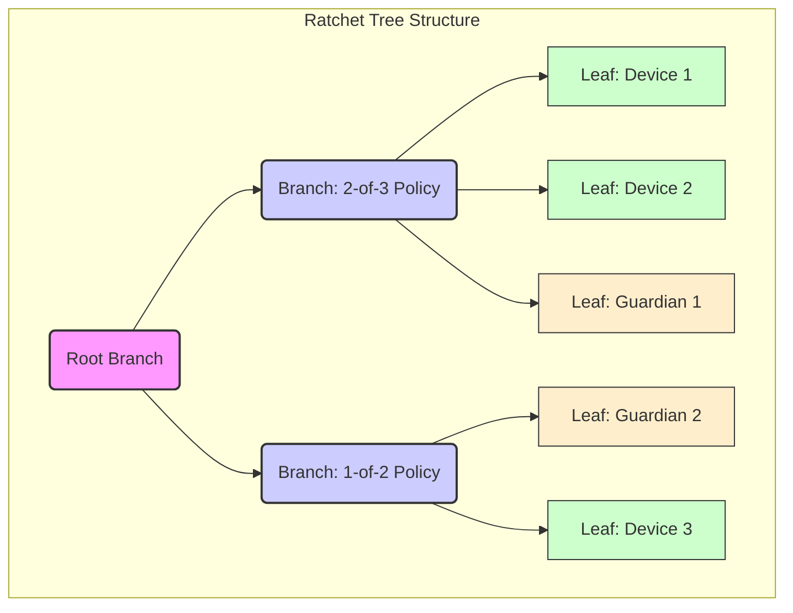

# Ratchet Tree

A ratchet tree manages authentication of devices and guardians. History is an append-only ledger of attested operations. Sessions coordinate work and produce exactly one attested operation or nothing. The journal stores only attested operations never storing shares or transcripts.

## Data Types



```rust
pub type Epoch = u64;
pub type Hash32 = [u8; 32];

#[repr(u16)]
pub enum Policy {
    Any,                    // 1-of-n
    Threshold { m: u16, n: u16 },
    All,                    // n-of-n
}

pub struct LeafId(pub u32);
pub struct NodeIndex(pub u32);

pub enum LeafRole { Device, Guardian }

pub struct LeafNode {
    pub leaf_id: LeafId,
    pub role: LeafRole,
    pub public_key: Vec<u8>,
    pub meta: Vec<u8>,
}

pub enum NodeKind { Leaf(LeafNode), Branch }

pub struct BranchNode {
    pub node: NodeIndex,
    pub policy: Policy,
    pub commitment: Hash32,
}

pub enum TreeOpKind {
    AddLeaf { leaf: LeafNode, under: NodeIndex },
    RemoveLeaf { leaf: LeafId, reason: u8 },
    ChangePolicy { node: NodeIndex, new_policy: Policy },
    RotateEpoch { affected: Vec<NodeIndex> },
}

pub struct TreeOp {
    pub parent_epoch: Epoch,
    pub parent_commitment: Hash32,
    pub op: TreeOpKind,
    pub version: u16,
}

pub struct AttestedOp {
    pub op: TreeOp,
    pub agg_sig: Vec<u8>,
    pub signer_count: u16,
}
```

## Commitments

Branch commitments compute as the hash of branch identifier, version, node index, epoch, policy hash, and child commitments. Leaf commitments compute as the hash of leaf identifier, version, leaf index, epoch, and public key hash. Children order by `NodeIndex`. Epoch and version always include.

## Policy Lattice

Policies form a meet-semilattice where more restrictive is smaller. Any is greater than or equal to `Threshold{m1, n}` if `m1 >= 1`. `Threshold{m2, n}` is less than or equal to `Threshold{m1, n}` if `m2 >= m1` with equal `n`. All is less than or equal to `Threshold{n, n}`. The meet selects the stricter policy.

## Journal Integration

The journal stores `AttestedOp` items as facts in the CRDT system. Each `TreeOp` references a parent by epoch and commitment or by parent CID. The ledger stores no authors and stores no share material. Timestamps are optional and not used for ordering.

Tree operations integrate with the journal's dual-layer architecture. Operations store as facts that only accumulate. Tree state derives from operation logs through deterministic reduction. The journal's CRDT properties ensure eventual consistency without requiring consensus protocols.

## Reduction

Build a DAG from parent references and topologically sort by ancestry. If multiple children share the same parent, resolve a single winner using maximum hash as tie breaker. Mark others as superseded. Apply winners in order and update tree state and commitment. The result is unique `TreeState`.

The resolver is deterministic on all nodes. Application is total for valid operations. Invalid operations reject during application. Tree state reduction leverages the journal's CRDT foundation through pure function over the operation log. Multiple replicas computing reduction over the same operation set produce identical tree states emerging from semilattice laws and deterministic conflict resolution.

## Privacy and Garbage Collection

Devices outside a context cannot observe or modify operations within that context. Tree operations delete on the schedule specified by [Information Flow Budget](103_info_flow_budget.md). Snapshots establish high-water marks for garbage collection. Operations predating a snapshot are eligible for pruning.

## Minimal APIs

Core operations include loading the current tree state, proposing new tree operations, verifying operation signatures, and computing tree commitments. The session-based coordination pattern ensures all mutations flow through attested operations in the journal.
