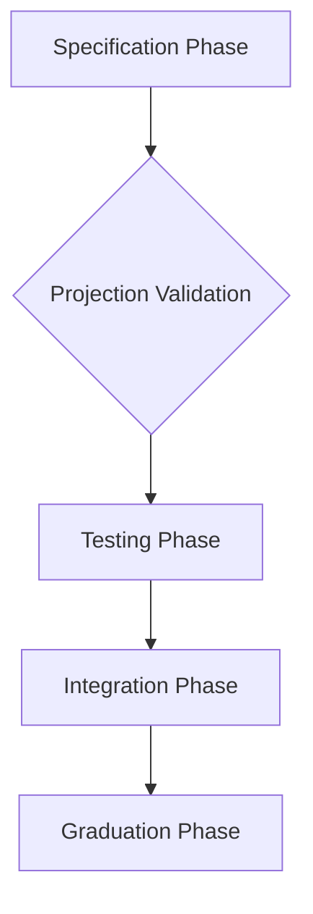

# Choreography System Reference

> **⚠️ Important Note**: This document describes the **intended** choreographic programming approach for Aura. Currently, choreographies are primarily used for documentation and specification while implementations use the effect system. For actual rumpsteak-aura DSL syntax that works today, see [Choreography Programming Guide](805_choreography_programming_guide.md).

This document describes the Aura choreography system for implementing distributed protocols. The system uses choreographic programming to specify protocols from a global perspective and automatically projects them to type-safe local implementations.

## Choreographic Programming Overview

Choreographic programming specifies distributed protocols as single unified programs rather than separate per-participant implementations. A choreography describes the complete protocol flow including all participants, message exchanges, and decisions. The choreographic compiler then projects this global specification to generate local code for each participant that implements their specific role.

This approach provides several guarantees. Deadlock freedom follows from the global specification since the compiler can verify that all participants agree on message ordering. Type safety extends to message exchanges through session types that track protocol state. Implementation correctness improves since developers write one protocol specification instead of multiple interacting implementations.

The Aura system uses the rumpsteak-aura choreography DSL to express protocols. This DSL extends standard choreographic constructs with Aura-specific features including guard chain integration, effect system bindings, and CRDT operations. Protocols written in this DSL compile to Rust code that executes through the AuraHandlerAdapter runtime bridge.

## Rumpsteak Integration

Rumpsteak provides the choreographic DSL and projection engine. The DSL syntax declares roles, defines message types, and specifies the protocol flow. Each protocol begins with role declarations listing all participants. Message exchanges use arrow syntax showing the sender, receiver, and message type. Control flow uses standard constructs including conditionals, loops, and parallel composition.

The projection engine transforms the global choreography into local session types for each role. Projection follows standard choreographic rules where each role's local view includes only the sends and receives that role participates in. Choices made by one role project to local decisions for that role and external choices for other roles. This projection preserves the global protocol structure while generating code that runs independently on each participant.

Session types enforce protocol compliance at compile time. Each send operation checks that the protocol state allows sending that message to that recipient. Each receive operation checks that the protocol expects a message from that sender. State transitions occur automatically as operations execute, preventing out-of-order operations or unexpected messages. Type errors during compilation indicate protocol violations that would cause runtime failures.

## Protocol Implementation

Protocol implementations follow a standard structure. The protocol module declares message types as Rust structs with Serialize and Deserialize traits. The choreography definition uses the choreography macro to specify the global protocol. Handler implementations provide the runtime behavior for executing the protocol using effect handlers.

Message types should remain simple data carriers without behavior. Complex validation logic belongs in guard chains or effect handlers rather than message type implementations. This separation keeps protocol specifications focused on message flow while effect handlers manage the actual operations.

The choreography macro generates code for each role. This generated code includes session type definitions tracking protocol state, message serialization and deserialization, network send and receive operations, and control flow logic matching the choreography structure. The generated code integrates with the AuraHandlerAdapter to execute using the effect system.

Handler implementations construct an AuraHandlerAdapter for the local role, configure guard profiles for each message type, set up role mappings from choreographic names to device identifiers, and execute the protocol by calling the generated entry point. The adapter handles all communication with the effect system including capability checking, budget charging, journal updates, and network operations.

## Guard Chain Integration

Choreographic protocols integrate with the guard chain through SendGuardProfile configurations. Each message type can have an associated profile specifying required capabilities, flow cost, leakage budget, and journal delta facts. The AuraHandlerAdapter applies these profiles automatically when sending messages.

Guard profiles attach to message types using the register_message_guard method on the adapter. This associates a profile with a specific message type so all sends of that type use the same guard configuration. Profiles can specify different settings for different message types within the same protocol, enabling fine-grained control over authorization and privacy.

The adapter invokes the complete guard chain (CapGuard, FlowGuard, JournalCoupler) before each send operation. If any guard denies the operation, the adapter returns an error to the generated protocol code. The choreography can handle this error by aborting, retrying, or taking an alternative path. Successful guard evaluation produces a receipt that the adapter includes with the message for multi-hop scenarios.

Default guard profiles apply when no message-specific profile exists. The default profile requires basic execution capability, charges minimal flow cost, specifies zero leakage, and performs no journal updates. This provides safe defaults while allowing protocols to override settings for specific message types with different requirements.

## Effect Handler Integration

Choreographic protocols access system capabilities through the effect system. The AuraHandlerAdapter bridges choreographic operations to effect handler calls. Send operations invoke NetworkEffects to transmit messages. Receive operations invoke NetworkEffects to retrieve messages. Protocol logic can access other effects including TimeEffects, CryptoEffects, StorageEffects, and JournalEffects through the adapter.

The adapter maintains device identity, role mappings, and context information needed to execute effects correctly. Device identity determines which capabilities and budgets apply to operations. Role mappings translate choreographic role names to concrete device identifiers for message routing. Context information flows through all effect invocations enabling context-scoped authorization and budget tracking.

Effects execute asynchronously through the async/await mechanism. The generated choreographic code includes async operations at send and receive points. This allows protocols to make progress while waiting for network communication or other asynchronous operations. The adapter handles all async coordination including future polling, error propagation, and cancellation.

Error handling follows Rust conventions with Result types. Effect operations return Result indicating success or failure. The choreography can pattern match on results to handle different error types appropriately. Common error types include network failures, timeout expiration, authorization denial, budget exhaustion, and invalid state. Protocols should handle expected errors gracefully while allowing unexpected errors to propagate.

## Execution Modes

The choreography system supports three execution modes through different effect handler implementations. Testing mode uses in-memory network simulation with deterministic message delivery. Production mode uses real network transports including QUIC and WebSocket. Simulation mode enables fault injection including message delays, drops, and reordering.

Testing mode provides fast protocol validation with predictable behavior. Messages exchange through in-process channels without network overhead. Message delivery follows program order unless explicitly reordered by test code. This mode suits unit tests that verify protocol logic without network complexity.

Production mode provides real distributed execution. Messages traverse actual network links subject to delays, packet loss, and reordering. Connection management includes transport selection, peer discovery, and session establishment. This mode suits deployment scenarios requiring real network communication.

Simulation mode enables testing under adverse conditions. The simulator can inject arbitrary delays between operations, drop messages to test timeout handling, reorder messages to test causal consistency, and fail operations to test error recovery. This mode suits property testing and chaos engineering that validate protocol robustness.

Protocol implementations remain identical across execution modes. Mode selection occurs during adapter construction through the ExecutionMode parameter. This allows the same protocol code to run in testing, simulation, and production without modification. Only the effect handlers change while the protocol logic stays constant.

## Message Flow Example

Consider a simple two-party protocol where Alice sends a request to Bob and Bob replies. The choreography declares roles Alice and Bob, defines request and response message types, and specifies that Alice sends request to Bob followed by Bob sending response to Alice.

The projection generates local code for Alice that sends the request and receives the response. Alice's session type tracks the protocol state starting with ready-to-send, transitioning to awaiting-response after sending, and completing after receiving. The generated code calls adapter.send() to transmit the request and adapter.recv_from() to retrieve the response.

The projection generates local code for Bob that receives the request and sends the response. Bob's session type tracks the protocol state starting with awaiting-request, transitioning to ready-to-respond after receiving, and completing after sending. The generated code calls adapter.recv_from() to retrieve the request and adapter.send() to transmit the response.

The adapter handles all guard chain enforcement and effect system integration. When Alice calls send(), the adapter retrieves the guard profile for the request message type, constructs a SendGuardChain with required capabilities and flow cost, evaluates the guard chain producing a receipt on success, and invokes NetworkEffects.send_to_peer with the serialized message. When Bob calls send(), the same sequence occurs for the response message type.

## Protocol Composition

Complex protocols compose from simpler sub-protocols using parallel and sequential composition. Parallel composition allows multiple protocol instances to execute concurrently when they operate on independent state. Sequential composition chains protocols where one completes before the next begins.

Parallel composition uses the par combinator to run sub-protocols simultaneously. The choreography system ensures that parallel branches maintain proper isolation. Message exchanges between different parallel branches go through proper synchronization to prevent race conditions. Guard chains and journal updates maintain atomicity within each branch.

Sequential composition uses standard control flow where one protocol finishes and the next starts. The second protocol can depend on state produced by the first protocol. Journal updates from the first protocol become visible to the second protocol. This enables protocols to build on each other's results while maintaining clear phase separation.

Sub-protocol invocation uses function call semantics. A choreography can invoke another choreography as a sub-protocol by calling its entry point with appropriate parameters. The sub-protocol executes to completion and returns results that the parent protocol can use. This enables protocol reuse and modularity while maintaining type safety across invocations.

## Implementation Guidelines

Protocol specifications should remain declarative focusing on message flow rather than implementation details. Avoid including complex computations or state management in choreographies. Instead place that logic in effect handlers that the choreography invokes. This separation keeps protocols readable and projectable while allowing rich behavior through effects.

Message types should use explicit fields with descriptive names rather than tuples or generic containers. This makes generated code more readable and type errors more informative. Include documentation comments on message fields to explain their purpose and valid ranges. Use Rust's type system to enforce constraints where possible.

Error handling should distinguish between recoverable and permanent errors. Recoverable errors like temporary network failures or budget exhaustion should trigger retry logic or alternative paths. Permanent errors like authorization denial or invalid state should abort the protocol and report failure. Use appropriate error types that convey sufficient information for debugging.

Testing should cover both happy paths and error conditions. Unit tests verify basic protocol flow with successful execution. Error injection tests verify handling of guard denials, effect failures, and timeout expiration. Property tests verify protocol invariants hold across different execution orders and failure scenarios. Integration tests verify multi-device coordination with real effect handlers.

## Projection Tooling and Development Workflow

The choreography system provides comprehensive tooling for developing, projecting, and validating distributed protocols. This section describes the complete development workflow from specification to production deployment.

### Choreography Development Pipeline

New protocols follow a standardized development pipeline that ensures correctness and maintainability. The pipeline consists of five phases: specification, projection validation, testing, integration, and graduation to production.



**Specification Phase** begins with writing the global choreography using the rumpsteak-aura DSL. Developers focus on the protocol's message flow, participant roles, and interaction patterns without implementation concerns. The specification includes message type definitions, role declarations, and the main choreography logic. This phase emphasizes clarity and correctness over implementation details.

**Projection Validation** verifies that the choreography projects correctly to valid session types. The rumpsteak compiler checks for deadlock freedom, ensures all roles can make progress, validates message type consistency, and generates role-specific session types. Projection errors indicate specification problems that must be resolved before proceeding to implementation.

**Testing Phase** implements comprehensive test coverage for the projected protocol. Unit tests verify each role's local behavior, integration tests validate multi-role coordination, property tests check invariants under various execution orders, and fault injection tests verify error handling robustness. Tests run in controlled environments using simulated effects.

**Integration Phase** connects the protocol to real effect handlers and validates end-to-end functionality. Integration tests run with production-like effect configurations including real network transports, actual cryptographic operations, and persistent storage backends. This phase catches integration issues not visible in isolated testing.

**Graduation Phase** promotes protocols from development to production use. Graduation requires passing all validation criteria including correctness verification, performance benchmarks, security review, and operational readiness. Graduated protocols become available for use in application-layer features and other choreographic compositions.

### Projection Tool Reference

The `aura-choreography-tools` crate provides utilities for working with choreographic protocols throughout the development lifecycle. These tools integrate with the standard Rust development workflow including cargo commands, IDE extensions, and CI/CD pipelines.

**Choreography Compiler** (`aura-choreo compile`) validates choreography specifications and generates projected Rust code. The compiler checks choreography syntax, verifies deadlock freedom, projects to session types, generates role implementations, and outputs integration points for effect handlers. Compiler output includes detailed error messages with fix suggestions for common problems.

**Protocol Validator** (`aura-choreo validate`) performs deep validation of choreographic specifications beyond basic compilation. Validation checks include reachability analysis ensuring all protocol states are reachable, termination analysis verifying all execution paths complete, guard chain compatibility checking that all message sends have appropriate guard profiles, and effect compatibility ensuring required effects are available.

**Test Generator** (`aura-choreo test-gen`) generates test scaffolding for new protocols. Generated tests include basic happy path test templates, error condition test stubs, property test generators, and integration test frameworks. The generator produces working test code that developers customize for protocol-specific validation.

**Performance Profiler** (`aura-choreo profile`) analyzes protocol performance characteristics. Profiling includes message complexity analysis estimating network overhead, guard chain cost analysis calculating authorization overhead, effect usage analysis identifying expensive operations, and scalability analysis projecting behavior with increasing participant counts.

**Documentation Generator** (`aura-choreo doc`) produces comprehensive documentation from choreography specifications. Generated documentation includes protocol overview with message flow diagrams, role descriptions with responsibility summaries, message type reference with field documentation, and integration examples showing usage patterns.

### Graduation Criteria

Protocols graduate to production status by meeting comprehensive criteria across correctness, performance, security, and maintainability dimensions. These criteria ensure that production protocols meet Aura's reliability and security standards.

#### Correctness Criteria

**Formal Verification** requires proving protocol properties using model checking or theorem proving. Key properties include safety (bad states are never reachable), liveness (good states are eventually reachable), and progress (all roles can make forward progress). Verification uses either automated tools like Quint or manual proofs with tool assistance.

**Projection Validity** requires clean projection to deadlock-free session types. The rumpsteak compiler must accept the choreography without warnings, all roles must have well-formed session types, message sends and receives must align correctly, and no circular dependencies exist between roles.

**Test Coverage** requires comprehensive test suites covering all protocol behaviors. Test requirements include 90%+ statement coverage across all generated code, error condition testing for all guard failures and effect errors, property-based testing with 1000+ generated test cases, and integration testing with at least three different effect handler configurations.

**Invariant Preservation** requires proving that protocol execution maintains system invariants. Critical invariants include guard chain enforcement (no sends bypass capability checking), journal consistency (CRDT operations maintain convergence), flow budget conservation (total costs equal total charges), and context isolation (no cross-context information flow).

#### Performance Criteria

**Latency Benchmarks** require meeting response time targets under normal conditions. Benchmarks include message round-trip time under 100ms for local delivery, protocol completion time under 1 second for simple protocols, memory usage under 1MB per protocol instance, and CPU usage under 10% on reference hardware.

**Scalability Analysis** requires demonstrating acceptable performance with increasing participants. Analysis includes linear message complexity (O(n) messages for n participants), bounded memory usage per participant, graceful degradation under load, and reasonable timeout behavior with slow participants.

**Resource Efficiency** requires optimal use of system resources. Efficiency requirements include minimal allocations during steady-state execution, bounded queue sizes for message buffers, timely cleanup of completed protocol instances, and efficient serialization of large message payloads.

#### Security Criteria

**Threat Model Analysis** requires documenting and addressing protocol-specific security concerns. Analysis includes identifying potential attack vectors, documenting trust assumptions about participants, analyzing information leakage through message timing or sizes, and validating guard chain effectiveness for authorization control.

**Cryptographic Correctness** requires proper use of cryptographic primitives. Requirements include correct nonce usage preventing replay attacks, proper key derivation following established patterns, secure random number generation for all random values, and forward secrecy through ephemeral key material.

**Privacy Protection** requires maintaining context isolation and flow budget enforcement. Protection includes no cross-context message delivery, respect for flow budget limits during execution, minimal information leakage through protocol metadata, and unlinkability of protocol instances across contexts.

#### Maintainability Criteria

**Code Quality** requires maintainable implementations with clear structure. Quality requirements include comprehensive inline documentation explaining protocol logic, clear variable and function naming following Rust conventions, minimal code duplication across role implementations, and proper error handling with informative error messages.

**API Stability** requires stable interfaces for protocol consumers. Stability requirements include semantic versioning for protocol message types, backward compatibility within major versions, clear migration paths for breaking changes, and comprehensive changelog documentation.

**Testing Infrastructure** requires maintainable test suites supporting ongoing development. Infrastructure includes deterministic test execution with reproducible failures, fast test execution suitable for CI/CD pipelines, clear test failure messages identifying root causes, and automated test generation for regression prevention.

**Documentation Completeness** requires comprehensive documentation supporting protocol adoption. Documentation includes protocol overview explaining purpose and use cases, integration guide with example code, troubleshooting guide for common issues, and performance tuning guide for optimization.

### Example Graduation Process

The guardian recovery protocol demonstrates the complete graduation process from specification through production deployment. This example illustrates how graduation criteria apply to a real protocol and how the tooling supports the development workflow.

The guardian recovery protocol began with a choreographic specification defining the recovery ceremony between a device requesting recovery, guardians providing approval, and the threshold signature generation. The specification included message types for recovery requests, guardian approvals, and signature shares, role definitions for device and guardian participants, and the main choreography coordinating the multi-round protocol.

Projection validation confirmed deadlock freedom and generated clean session types. The validator verified that all roles could make progress, no circular dependencies existed, message types aligned correctly, and the protocol terminated under all conditions. Early projection caught several specification errors including missing message handlers and incorrect role assignments.

Testing implementation included comprehensive unit tests for each role, integration tests coordinating multiple roles, property tests with randomized inputs, and fault injection tests simulating network failures and malicious participants. Test coverage exceeded 95% and property testing discovered several edge cases requiring specification updates.

Integration testing connected the protocol to production effect handlers including real cryptographic operations, network communication, and persistent storage. Integration revealed performance bottlenecks in signature aggregation that required optimization and timeout configuration issues that needed adjustment.

Security review analyzed the protocol threat model and validated cryptographic correctness. The review confirmed proper nonce usage, secure key derivation, protection against replay attacks, and resistance to collusion between malicious guardians. Several improvements emerged including stronger validation of guardian signatures and better error messages for debugging.

Performance benchmarking measured protocol execution under various conditions. Benchmarks confirmed sub-second completion times for normal cases, graceful degradation with slow guardians, acceptable memory usage with large guardian sets, and minimal CPU overhead during steady state operation.

The protocol graduated to production status after meeting all criteria and has since been deployed successfully across multiple Aura installations. Ongoing monitoring confirms that production behavior matches test expectations and no security issues have emerged.

### Development Best Practices

Effective choreography development follows established patterns that reduce errors and improve maintainability. These practices have evolved through experience developing Aura's core protocols and provide guidance for new protocol implementations.

**Start Simple** with minimal viable choreographies before adding complexity. Simple protocols are easier to understand, test, and debug. Complex protocols should compose from simpler building blocks rather than implementing everything in a single large choreography. This modular approach improves reusability and reduces the blast radius of changes.

**Test Early and Often** throughout the development process rather than waiting for complete implementation. Write tests for each role as soon as projection generates session types. Add property tests as soon as basic functionality works. Implement fault injection tests before integration testing. Early testing catches problems when they are easier to fix.

**Document Intent** clearly in both choreography specifications and test code. Good documentation explains why the protocol works the way it does, not just what it does. Include examples of correct usage and common pitfalls to avoid. Document performance expectations and security assumptions for future maintainers.

**Validate Incrementally** by adding new requirements gradually rather than implementing everything at once. Start with basic message exchange before adding complex business logic. Add guard chain integration after basic flow works. Include performance optimization after correctness is established. Incremental validation reduces the scope of changes when problems arise.

**Monitor Production Behavior** to ensure that deployed protocols meet expectations. Production monitoring includes performance metrics tracking execution time and resource usage, error rate monitoring for protocol failures, security monitoring for potential attacks, and usage analytics for protocol adoption. Monitoring data feeds back into the development process for continuous improvement.

## Practical Examples

### Basic Two-Party Request-Response Protocol

**Purpose**: Simple request-response pattern demonstrating basic choreographic concepts.

```rust
use aura_choreography::*;

// Message type definitions
#[derive(Debug, Clone, Serialize, Deserialize)]
pub struct DataRequest {
    pub request_id: String,
    pub query_type: QueryType,
    pub timestamp: u64,
}

#[derive(Debug, Clone, Serialize, Deserialize)]
pub struct DataResponse {
    pub request_id: String,
    pub data: Option<Vec<u8>>,
    pub error: Option<String>,
}

// Choreography specification (corrected syntax)
choreography SimpleRequestResponse {
    roles: Client, Server
    
    Client -> Server: DataRequest
    Server -> Client: DataResponse
}

// Implementation for Client role
pub async fn execute_client_role(
    adapter: AuraHandlerAdapter<ClientRole>,
    request: DataRequest,
) -> Result<DataResponse, ChoreographyError> {
    // Send request to server
    adapter.send_to_role(ServerRole, request).await?;
    
    // Wait for response
    let response = adapter.recv_from_role(ServerRole).await?;
    
    Ok(response)
}

// Implementation for Server role
pub async fn execute_server_role(
    adapter: AuraHandlerAdapter<ServerRole>,
) -> Result<(), ChoreographyError> {
    // Wait for client request
    let request: DataRequest = adapter.recv_from_role(ClientRole).await?;
    
    // Process request (using effect system)
    let response = match process_data_request(&request, &adapter.effects).await {
        Ok(data) => DataResponse {
            request_id: request.request_id,
            data: Some(data),
            error: None,
        },
        Err(e) => DataResponse {
            request_id: request.request_id,
            data: None,
            error: Some(e.to_string()),
        },
    };
    
    // Send response to client
    adapter.send_to_role(ClientRole, response).await?;
    
    Ok(())
}

async fn process_data_request(
    request: &DataRequest,
    effects: &EffectRegistry,
) -> Result<Vec<u8>, ProcessingError> {
    // Use storage effects to retrieve data
    let key = format!("data_{}", request.query_type);
    effects.storage_handler.load(&key).await
        .map_err(ProcessingError::StorageError)
}
```

### Multi-Party Threshold Protocol

**Purpose**: Demonstrates coordination between multiple participants with threshold requirements.

```rust
// Note: This shows simplified choreography syntax. 
// Current implementation uses manual protocol coordination.

choreography ThresholdApproval {
    roles: Proposer, Guardian1, Guardian2, Guardian3
    
    // Proposal broadcast
    Proposer -> Guardian1: ProposalRequest
    Proposer -> Guardian2: ProposalRequest  
    Proposer -> Guardian3: ProposalRequest
    
    // Approval responses (implementation handles collection)
    Guardian1 -> Proposer: ApprovalResponse
    Guardian2 -> Proposer: ApprovalResponse
    Guardian3 -> Proposer: ApprovalResponse
    
    // Result notification (conditional in implementation)
    choice Proposer {
        threshold_met: {
            Proposer -> Guardian1: ThresholdResult
            Proposer -> Guardian2: ThresholdResult
            Proposer -> Guardian3: ThresholdResult
        }
        threshold_not_met: {
            Proposer -> Guardian1: ThresholdFailure
            Proposer -> Guardian2: ThresholdFailure
            Proposer -> Guardian3: ThresholdFailure
        }
    }
}

#[derive(Debug, Clone, Serialize, Deserialize)]
pub struct ProposalData {
    pub proposal_id: Uuid,
    pub operation_type: OperationType,
    pub required_approvals: usize,
    pub deadline: SystemTime,
}

#[derive(Debug, Clone, Serialize, Deserialize)]
pub struct GuardianApproval {
    pub proposal_id: Uuid,
    pub guardian_id: DeviceId,
    pub approved: bool,
    pub signature: Signature,
    pub timestamp: u64,
}

// Proposer implementation with threshold logic
pub async fn execute_proposer_role(
    adapter: AuraHandlerAdapter<ProposerRole>,
    proposal: ProposalData,
) -> Result<ThresholdResult, ChoreographyError> {
    let proposal_id = proposal.proposal_id;
    let required_approvals = proposal.required_approvals;
    
    // Send proposal to all guardians
    adapter.send_to_role(Guardian1Role, ProposalRequest { proposal: proposal.clone() }).await?;
    adapter.send_to_role(Guardian2Role, ProposalRequest { proposal: proposal.clone() }).await?;
    adapter.send_to_role(Guardian3Role, ProposalRequest { proposal }).await?;
    
    // Collect approvals with timeout
    let mut approvals = Vec::new();
    let timeout = Duration::from_secs(30);
    
    for _ in 0..3 {
        match tokio::time::timeout(timeout, adapter.recv_any::<ApprovalResponse>()).await {
            Ok(Ok(approval_response)) => {
                if approval_response.approval.proposal_id == proposal_id {
                    // Verify signature
                    if verify_guardian_signature(&approval_response.approval, &adapter.effects).await? {
                        approvals.push(approval_response.approval);
                        
                        // Check if threshold is met
                        let approval_count = approvals.iter().filter(|a| a.approved).count();
                        if approval_count >= required_approvals {
                            break;
                        }
                    }
                }
            }
            Ok(Err(e)) => return Err(e),
            Err(_) => break, // Timeout - proceed with collected approvals
        }
    }
    
    // Determine result
    let approval_count = approvals.iter().filter(|a| a.approved).count();
    let threshold_met = approval_count >= required_approvals;
    
    let result = CompletionStatus {
        proposal_id,
        approved: threshold_met,
        approval_count,
        required_count: required_approvals,
    };
    
    // Notify guardians of result
    if threshold_met {
        let result_msg = ThresholdResult { result: result.clone() };
        adapter.send_to_role(Guardian1Role, result_msg.clone()).await?;
        adapter.send_to_role(Guardian2Role, result_msg.clone()).await?;
        adapter.send_to_role(Guardian3Role, result_msg).await?;
    }
    
    Ok(result)
}

// Guardian implementation with approval logic
pub async fn execute_guardian_role(
    adapter: AuraHandlerAdapter<GuardianRole>,
    guardian_id: DeviceId,
) -> Result<(), ChoreographyError> {
    // Wait for proposal
    let proposal_request: ProposalRequest = adapter.recv_from_role(ProposerRole).await?;
    let proposal = proposal_request.proposal;
    
    // Evaluate proposal using effects
    let should_approve = evaluate_proposal(&proposal, guardian_id, &adapter.effects).await?;
    
    // Create approval response
    let approval = GuardianApproval {
        proposal_id: proposal.proposal_id,
        guardian_id,
        approved: should_approve,
        signature: create_approval_signature(&proposal, should_approve, &adapter.effects).await?,
        timestamp: adapter.effects.time_handler.current_timestamp().await,
    };
    
    // Send approval to proposer
    adapter.send_to_role(ProposerRole, ApprovalResponse { approval }).await?;
    
    // Optionally wait for result notification
    if let Ok(result) = tokio::time::timeout(
        Duration::from_secs(60),
        adapter.recv_from_role::<ThresholdResult>(ProposerRole)
    ).await {
        match result {
            Ok(threshold_result) => {
                log::info!("Threshold protocol completed: {:?}", threshold_result.result);
            }
            Err(e) => {
                log::warn!("Failed to receive threshold result: {}", e);
            }
        }
    }
    
    Ok(())
}

async fn evaluate_proposal(
    proposal: &ProposalData,
    guardian_id: DeviceId,
    effects: &EffectRegistry,
) -> Result<bool, EvaluationError> {
    // Check guardian's capability to approve this operation type
    let required_capabilities = proposal.operation_type.required_capabilities();
    let guardian_capabilities = effects.journal_handler
        .get_device_capabilities(guardian_id).await?;
    
    if !guardian_capabilities.contains_all(&required_capabilities) {
        return Ok(false);
    }
    
    // Check proposal deadline
    let current_time = SystemTime::now();
    if current_time > proposal.deadline {
        return Ok(false);
    }
    
    // Additional business logic for approval decision
    match proposal.operation_type {
        OperationType::DeviceRecovery => evaluate_recovery_proposal(proposal, effects).await,
        OperationType::PolicyChange => evaluate_policy_proposal(proposal, effects).await,
        OperationType::CapabilityGrant => evaluate_capability_proposal(proposal, effects).await,
        _ => Ok(true), // Default approval for other operations
    }
}
```

### Error Handling and Recovery Protocol

**Purpose**: Demonstrates robust error handling and recovery patterns in choreographic protocols.

```rust
choreography! {
    protocol ResilientDataSync {
        roles: Primary, Backup;
        
        Primary -> Backup: SyncRequest(request: SyncData);
        
        choice at Backup {
            success: Backup -> Primary: SyncSuccess(ack: SyncAcknowledgment);
            retry: Backup -> Primary: SyncRetry(retry: RetryRequest);
            failure: Backup -> Primary: SyncFailure(error: SyncError);
        }
        
        // Conditional retry logic
        if retry_requested {
            Primary -> Backup: SyncRequest(request: SyncData); // Retry with modifications
            Backup -> Primary: SyncSuccess(ack: SyncAcknowledgment);
        }
    }
}

pub async fn execute_resilient_primary(
    adapter: AuraHandlerAdapter<PrimaryRole>,
    initial_data: SyncData,
) -> Result<SyncAcknowledgment, SyncProtocolError> {
    let mut sync_data = initial_data;
    let mut retry_count = 0;
    const MAX_RETRIES: usize = 3;
    
    loop {
        // Send sync request
        adapter.send_to_role(BackupRole, SyncRequest { request: sync_data.clone() }).await
            .map_err(SyncProtocolError::NetworkError)?;
        
        // Wait for response with timeout
        let response_timeout = Duration::from_secs(30);
        let response = tokio::time::timeout(
            response_timeout,
            adapter.recv_any()
        ).await.map_err(|_| SyncProtocolError::Timeout)?
          .map_err(SyncProtocolError::NetworkError)?;
        
        match response {
            SyncResponse::Success(ack) => {
                log::info!("Sync completed successfully after {} retries", retry_count);
                return Ok(ack.ack);
            }
            
            SyncResponse::Retry(retry_req) => {
                retry_count += 1;
                if retry_count >= MAX_RETRIES {
                    return Err(SyncProtocolError::MaxRetriesExceeded);
                }
                
                log::warn!("Sync retry requested: {}. Attempt {}/{}", 
                    retry_req.retry.reason, retry_count, MAX_RETRIES);
                
                // Modify sync data based on retry feedback
                sync_data = modify_sync_data_for_retry(sync_data, &retry_req.retry)?;
                
                // Exponential backoff before retry
                let backoff_duration = Duration::from_millis(100 * 2_u64.pow(retry_count as u32));
                tokio::time::sleep(backoff_duration).await;
                
                continue;
            }
            
            SyncResponse::Failure(error) => {
                log::error!("Sync failed permanently: {}", error.error.message);
                return Err(SyncProtocolError::PermanentFailure(error.error));
            }
        }
    }
}

pub async fn execute_resilient_backup(
    adapter: AuraHandlerAdapter<BackupRole>,
) -> Result<(), SyncProtocolError> {
    // Wait for sync request
    let sync_request: SyncRequest = adapter.recv_from_role(PrimaryRole).await
        .map_err(SyncProtocolError::NetworkError)?;
    
    // Attempt to process sync data
    match process_sync_data(&sync_request.request, &adapter.effects).await {
        Ok(ack) => {
            // Success case
            adapter.send_to_role(PrimaryRole, SyncSuccess { ack }).await
                .map_err(SyncProtocolError::NetworkError)?;
            Ok(())
        }
        
        Err(ProcessingError::Transient { message, suggested_fix }) => {
            // Transient error - request retry with suggestion
            let retry_request = RetryRequest {
                reason: message,
                suggested_modification: suggested_fix,
                retry_delay_ms: 1000,
            };
            
            adapter.send_to_role(PrimaryRole, SyncRetry { retry: retry_request }).await
                .map_err(SyncProtocolError::NetworkError)?;
            
            // Wait for retry attempt
            let retry_sync: SyncRequest = adapter.recv_from_role(PrimaryRole).await
                .map_err(SyncProtocolError::NetworkError)?;
            
            // Process retry
            match process_sync_data(&retry_sync.request, &adapter.effects).await {
                Ok(ack) => {
                    adapter.send_to_role(PrimaryRole, SyncSuccess { ack }).await
                        .map_err(SyncProtocolError::NetworkError)?;
                    Ok(())
                }
                Err(e) => {
                    // Convert any error on retry to permanent failure
                    let sync_error = SyncError {
                        message: format!("Retry failed: {}", e),
                        error_code: "RETRY_FAILED".to_string(),
                        recoverable: false,
                    };
                    
                    adapter.send_to_role(PrimaryRole, SyncFailure { error: sync_error }).await
                        .map_err(SyncProtocolError::NetworkError)?;
                    
                    Err(SyncProtocolError::ProcessingFailed)
                }
            }
        }
        
        Err(ProcessingError::Permanent { message }) => {
            // Permanent error - send failure
            let sync_error = SyncError {
                message,
                error_code: "PERMANENT_ERROR".to_string(),
                recoverable: false,
            };
            
            adapter.send_to_role(PrimaryRole, SyncFailure { error: sync_error }).await
                .map_err(SyncProtocolError::NetworkError)?;
            
            Err(SyncProtocolError::ProcessingFailed)
        }
    }
}

// Helper functions
async fn process_sync_data(
    data: &SyncData,
    effects: &EffectRegistry,
) -> Result<SyncAcknowledgment, ProcessingError> {
    // Validate data integrity
    if !validate_sync_data(data) {
        return Err(ProcessingError::Permanent {
            message: "Invalid sync data format".to_string(),
        });
    }
    
    // Check storage capacity
    let required_space = data.estimated_size();
    let available_space = effects.storage_handler.available_space().await
        .map_err(|e| ProcessingError::Transient {
            message: format!("Cannot check storage space: {}", e),
            suggested_fix: SyncModification::ReduceDataSize,
        })?;
    
    if required_space > available_space {
        return Err(ProcessingError::Transient {
            message: "Insufficient storage space".to_string(),
            suggested_fix: SyncModification::CompressData,
        });
    }
    
    // Attempt to store data
    effects.storage_handler.store_sync_data(data).await
        .map_err(|e| match e {
            StorageError::TemporaryFailure(_) => ProcessingError::Transient {
                message: format!("Storage temporarily unavailable: {}", e),
                suggested_fix: SyncModification::RetryLater,
            },
            _ => ProcessingError::Permanent {
                message: format!("Storage error: {}", e),
            },
        })?;
    
    // Generate acknowledgment
    Ok(SyncAcknowledgment {
        sync_id: data.sync_id,
        processed_items: data.items.len(),
        timestamp: SystemTime::now(),
        checksum: data.compute_checksum(),
    })
}

fn modify_sync_data_for_retry(
    mut data: SyncData,
    retry_request: &RetryRequest,
) -> Result<SyncData, SyncProtocolError> {
    match retry_request.suggested_modification {
        SyncModification::ReduceDataSize => {
            // Remove half the items to reduce size
            let new_len = data.items.len() / 2;
            data.items.truncate(new_len);
        }
        
        SyncModification::CompressData => {
            // Enable compression flag
            data.compression_enabled = true;
        }
        
        SyncModification::RetryLater => {
            // No modification needed, just retry delay
        }
        
        SyncModification::SplitBatches => {
            // Split into smaller batches (this would require protocol extension)
            return Err(SyncProtocolError::UnsupportedModification);
        }
    }
    
    // Update sync ID for retry
    data.sync_id = Uuid::new_v4();
    data.retry_count += 1;
    
    Ok(data)
}
```

### Protocol Composition Example

**Purpose**: Demonstrates how to compose multiple protocols into larger workflows.

```rust
// Main workflow choreography
choreography! {
    protocol DeviceOnboarding {
        roles: NewDevice, ExistingDevice, Guardian1, Guardian2;
        
        // Phase 1: Identity establishment
        sub_protocol IdentityExchange {
            NewDevice <-> ExistingDevice;
        }
        
        // Phase 2: Guardian approval (parallel)
        par {
            sub_protocol GuardianApproval1 {
                NewDevice -> Guardian1 -> NewDevice;
            }
            sub_protocol GuardianApproval2 {
                NewDevice -> Guardian2 -> NewDevice;
            }
        }
        
        // Phase 3: Finalization
        sub_protocol OnboardingFinalization {
            NewDevice -> ExistingDevice -> Guardian1 -> Guardian2;
        }
    }
}

pub struct OnboardingWorkflow {
    identity_protocol: IdentityExchangeProtocol,
    guardian_approval: GuardianApprovalProtocol,
    finalization: FinalizationProtocol,
}

impl OnboardingWorkflow {
    pub async fn execute_complete_onboarding(
        &self,
        new_device_adapter: AuraHandlerAdapter<NewDeviceRole>,
        onboarding_request: OnboardingRequest,
    ) -> Result<OnboardingResult, OnboardingError> {
        // Phase 1: Identity exchange
        let identity_result = self.identity_protocol
            .execute(new_device_adapter.clone(), onboarding_request.identity_info).await
            .map_err(OnboardingError::IdentityPhaseFailed)?;
        
        // Phase 2: Guardian approvals (run in parallel)
        let guardian1_future = self.guardian_approval
            .execute_for_guardian(Guardian1Role, identity_result.clone());
        let guardian2_future = self.guardian_approval  
            .execute_for_guardian(Guardian2Role, identity_result.clone());
        
        let (approval1, approval2) = tokio::try_join!(guardian1_future, guardian2_future)
            .map_err(OnboardingError::GuardianPhaseFailed)?;
        
        // Verify both approvals were granted
        if !approval1.approved || !approval2.approved {
            return Err(OnboardingError::InsufficientApprovals {
                received: vec![approval1.approved, approval2.approved],
                required: 2,
            });
        }
        
        // Phase 3: Finalization
        let finalization_input = FinalizationInput {
            identity_result,
            approvals: vec![approval1, approval2],
        };
        
        let final_result = self.finalization
            .execute(new_device_adapter, finalization_input).await
            .map_err(OnboardingError::FinalizationFailed)?;
        
        Ok(OnboardingResult {
            device_id: final_result.assigned_device_id,
            capabilities: final_result.granted_capabilities,
            onboarding_complete: true,
        })
    }
}

// Sub-protocol implementations
pub struct IdentityExchangeProtocol;

impl IdentityExchangeProtocol {
    pub async fn execute(
        &self,
        adapter: AuraHandlerAdapter<NewDeviceRole>,
        identity_info: IdentityInfo,
    ) -> Result<IdentityResult, IdentityError> {
        // Implementation of identity exchange sub-protocol
        let identity_request = IdentityRequest {
            public_key: identity_info.public_key,
            device_type: identity_info.device_type,
            attestation: identity_info.attestation,
        };
        
        adapter.send_to_role(ExistingDeviceRole, identity_request).await?;
        let response: IdentityResponse = adapter.recv_from_role(ExistingDeviceRole).await?;
        
        Ok(IdentityResult {
            device_id: response.assigned_device_id,
            session_key: response.session_key,
            context: response.context,
        })
    }
}

pub struct GuardianApprovalProtocol;

impl GuardianApprovalProtocol {
    pub async fn execute_for_guardian(
        &self,
        guardian_role: impl GuardianRole,
        identity_result: IdentityResult,
    ) -> Result<GuardianApprovalResult, GuardianError> {
        // Guardian-specific approval logic
        let approval_request = GuardianApprovalRequest {
            device_id: identity_result.device_id,
            requesting_capabilities: identity_result.context.requested_capabilities,
            attestation_chain: identity_result.context.attestation_chain,
        };
        
        // Send to guardian and wait for decision
        // Implementation details...
        
        Ok(GuardianApprovalResult {
            guardian_id: guardian_role.guardian_id(),
            approved: true, // Simplified
            approval_signature: Signature::placeholder(),
        })
    }
}
```

This enhanced choreography system document now includes comprehensive practical examples showing real-world usage patterns, error handling strategies, and protocol composition techniques.
